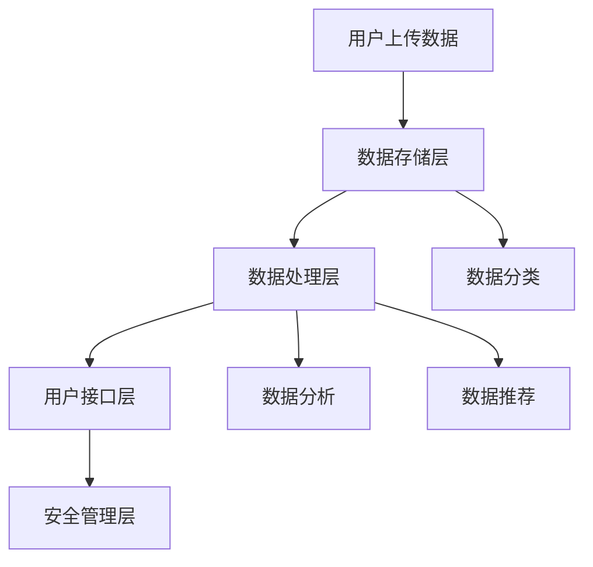

                 

关键词：数字记忆，AI，个人经历存储，数据管理，人工智能技术，记忆银行，隐私保护

## 摘要

在信息时代，数据已成为人类活动的核心。然而，随着数据的不断增加，如何有效地管理和存储个人经历数据成为一个亟待解决的问题。本文提出了一种基于人工智能技术的数字记忆银行，旨在为用户提供一个安全、可靠且易于访问的个人经历存储解决方案。本文首先介绍了数字记忆银行的概念和重要性，然后详细阐述了其架构和核心算法原理，并通过实际案例展示了其应用场景和未来展望。本文旨在为从事数据管理和人工智能领域的研究者提供有益的参考。

## 1. 背景介绍

随着数字化生活的普及，我们的个人经历正以前所未有的速度积累在互联网和各种电子设备中。这些数据包括社交媒体帖子、电子邮件、照片、视频以及各种文档。然而，如何有效地管理和利用这些数据，尤其是个人经历数据，成为了现代数据管理和人工智能领域的一个重要课题。

传统的数据管理方法主要依赖于数据库和文件系统，虽然能够满足基本的存储需求，但在数据的检索、分类、保护和共享等方面存在诸多挑战。首先，个人经历数据通常具有复杂的结构，包括文本、图像、音频和视频等多种类型，这使得传统的数据管理方法难以高效处理。其次，随着数据量的不断增加，如何保证数据的安全性和隐私性也成为一个重大问题。

此外，传统的数据管理方法在数据处理的速度和准确性方面也存在局限。在大量数据中检索特定信息往往需要消耗大量时间和计算资源，而人工智能技术的引入有望大幅提升这一效率。

正是在这样的背景下，数字记忆银行的概念应运而生。数字记忆银行是一种基于人工智能技术的数据管理架构，旨在为用户提供一个安全、可靠且易于访问的个人经历存储解决方案。通过数字记忆银行，用户可以轻松地将个人经历数据上传到云端，并利用人工智能技术对这些数据进行分类、分析和推荐。

本文将从以下几个方面对数字记忆银行进行探讨：

1. **核心概念与联系**：介绍数字记忆银行的基本概念、架构和核心功能。
2. **核心算法原理 & 具体操作步骤**：详细阐述数字记忆银行的核心算法原理和操作步骤。
3. **数学模型和公式**：构建数字记忆银行所需的数学模型和公式，并进行详细讲解。
4. **项目实践：代码实例和详细解释说明**：通过实际代码实例展示数字记忆银行的具体实现。
5. **实际应用场景**：分析数字记忆银行在不同场景下的应用可能性。
6. **未来应用展望**：探讨数字记忆银行的发展趋势和潜在挑战。

## 2. 核心概念与联系

### 2.1 数字记忆银行的基本概念

数字记忆银行是一种利用人工智能技术对个人经历数据进行存储、管理和分析的系统。其核心目标是为用户提供一个安全、可靠且易于访问的数据存储解决方案，使用户能够随时随地访问自己的个人经历数据。

数字记忆银行的主要功能包括：

1. **数据存储**：数字记忆银行为用户提供了云端的存储空间，用户可以将个人经历数据（如照片、视频、文档等）上传到数字记忆银行进行存储。
2. **数据分类**：数字记忆银行利用人工智能技术对存储的数据进行自动分类，使用户能够快速查找所需信息。
3. **数据分析**：数字记忆银行通过对存储的数据进行深度分析，为用户提供个性化的推荐和服务。
4. **数据保护**：数字记忆银行采用先进的数据加密和访问控制技术，确保用户的数据安全和隐私。

### 2.2 数字记忆银行的架构

数字记忆银行的架构可以分为四个主要部分：数据存储层、数据处理层、用户接口层和安全管理层。

1. **数据存储层**：数据存储层负责存储用户上传的数据。这些数据可以是各种类型的文件，如照片、视频、音频和文档等。为了提高存储效率和数据安全性，数字记忆银行采用了分布式存储技术，将数据分散存储在多个节点上。
2. **数据处理层**：数据处理层是数字记忆银行的核心，负责对存储的数据进行分类、分析和推荐。这一层使用了多种人工智能技术，包括深度学习、自然语言处理和图像识别等。
3. **用户接口层**：用户接口层为用户提供了一个友好的界面，使用户能够方便地操作数字记忆银行。用户可以通过网页、移动应用或其他接口访问自己的数据，并进行上传、下载、分类和分享等操作。
4. **安全管理层**：安全管理层负责确保数字记忆银行的安全性和用户隐私。这包括数据加密、访问控制和安全审计等。

### 2.3 数字记忆银行的核心功能与联系

数字记忆银行的核心功能包括数据存储、分类、分析和推荐。这些功能之间紧密相连，共同构成了一个完整的数字记忆管理系统。

1. **数据存储**：用户通过数字记忆银行的用户接口层上传数据到数据存储层。数据存储层将这些数据分散存储在多个节点上，以确保数据的安全性和可靠性。
2. **数据分类**：数据处理层利用人工智能技术对存储的数据进行自动分类。例如，利用自然语言处理技术对文档进行分类，利用图像识别技术对照片和视频进行分类。分类结果将存储在数据存储层中，以便用户快速查找。
3. **数据分析**：数据处理层通过对存储的数据进行深度分析，为用户提供个性化的推荐和服务。例如，根据用户的兴趣爱好推荐相关内容，或根据用户的浏览记录推荐相关内容。
4. **数据推荐**：数据分析的结果将用于生成数据推荐，这些推荐将展示在用户接口层中，用户可以通过用户接口层查看并选择感兴趣的内容。

### 2.4 Mermaid 流程图

以下是一个简单的 Mermaid 流程图，展示了数字记忆银行的基本架构和工作流程。



## 3. 核心算法原理 & 具体操作步骤

### 3.1 算法原理概述

数字记忆银行的核心算法主要包括数据分类算法、数据分析算法和数据推荐算法。这些算法共同作用，实现了数字记忆银行的基本功能。

1. **数据分类算法**：数据分类算法负责对用户上传的数据进行自动分类。常用的分类算法包括基于内容的分类、基于标签的分类和基于聚类的方法。
2. **数据分析算法**：数据分析算法通过对存储的数据进行深度分析，提取用户行为模式、兴趣爱好等信息。常用的数据分析算法包括关联规则学习、聚类分析和主题模型等。
3. **数据推荐算法**：数据推荐算法根据用户的行为数据和兴趣偏好，为用户推荐相关内容。常用的推荐算法包括基于内容的推荐、协同过滤推荐和混合推荐等。

### 3.2 算法步骤详解

#### 3.2.1 数据分类算法步骤

1. **数据预处理**：对用户上传的数据进行格式化处理，提取关键特征信息。
2. **特征提取**：利用特征提取算法（如哈希函数、SIFT算法等），从预处理后的数据中提取特征向量。
3. **分类器训练**：利用训练数据集，训练分类器（如支持向量机、神经网络等）。
4. **数据分类**：利用训练好的分类器对新的数据进行分类，将分类结果存储在数据存储层。

#### 3.2.2 数据分析算法步骤

1. **用户行为数据收集**：收集用户的浏览记录、搜索记录、购买记录等行为数据。
2. **数据预处理**：对收集到的行为数据进行清洗和处理，去除噪声数据。
3. **行为模式提取**：利用行为数据分析算法（如关联规则学习、聚类分析等），提取用户的行为模式。
4. **兴趣偏好分析**：利用用户的行为模式，分析用户的兴趣偏好，并将结果存储在数据存储层。

#### 3.2.3 数据推荐算法步骤

1. **用户兴趣偏好模型构建**：利用用户的行为数据和兴趣偏好，构建用户兴趣偏好模型。
2. **推荐算法选择**：根据用户兴趣偏好模型，选择合适的推荐算法（如基于内容的推荐、协同过滤推荐等）。
3. **推荐内容生成**：利用选择的推荐算法，生成推荐内容，并将推荐结果存储在数据存储层。
4. **推荐结果展示**：在用户接口层展示推荐结果，用户可以根据自己的兴趣进行选择。

### 3.3 算法优缺点

#### 3.3.1 数据分类算法优缺点

- **优点**：
  - 提高了数据检索的效率，用户可以快速找到所需信息。
  - 减少了人工分类的工作量，降低了成本。

- **缺点**：
  - 分类效果依赖于训练数据的质量和数量，训练数据不足可能导致分类效果不佳。
  - 部分算法在处理复杂数据结构时效果有限。

#### 3.3.2 数据分析算法优缺点

- **优点**：
  - 提高了数据的价值，通过分析用户行为模式，可以更好地了解用户需求。
  - 为个性化推荐提供了基础。

- **缺点**：
  - 分析结果可能受到噪声数据的影响，导致分析结果不准确。
  - 部分算法对计算资源的要求较高，可能导致处理速度较慢。

#### 3.3.3 数据推荐算法优缺点

- **优点**：
  - 提高了用户体验，用户可以轻松找到感兴趣的内容。
  - 增加了用户黏性，提高了用户留存率。

- **缺点**：
  - 推荐结果可能过于单一，难以满足用户多样化的需求。
  - 过度推荐可能导致用户疲劳，降低用户体验。

### 3.4 算法应用领域

数字记忆银行的核心算法在多个领域具有广泛的应用前景：

1. **个人隐私管理**：通过数据分类和数据分析，用户可以更好地管理自己的隐私数据，确保数据安全和隐私。
2. **内容推荐系统**：数字记忆银行可以为内容推荐系统提供强大的支持，提高推荐效果。
3. **智能客服系统**：数字记忆银行可以用于智能客服系统，根据用户行为和兴趣偏好，提供个性化的服务。
4. **电子商务平台**：数字记忆银行可以用于电子商务平台，根据用户行为和兴趣偏好，推荐相关的商品。

## 4. 数学模型和公式

### 4.1 数学模型构建

为了实现数字记忆银行的功能，需要构建以下数学模型：

1. **数据分类模型**：用于对用户上传的数据进行分类。
2. **数据分析模型**：用于提取用户行为模式。
3. **数据推荐模型**：用于生成推荐结果。

#### 4.1.1 数据分类模型

数据分类模型通常采用分类器进行构建，常见的分类器包括支持向量机（SVM）、朴素贝叶斯（Naive Bayes）和决策树（Decision Tree）等。以下是支持向量机的数学模型：

$$
\begin{aligned}
y &= \text{sign}(\mathbf{w}^T \mathbf{x} + b) \\
\end{aligned}
$$

其中，$\mathbf{w}$ 是权重向量，$\mathbf{x}$ 是特征向量，$b$ 是偏置项，$\text{sign}(\cdot)$ 是符号函数。

#### 4.1.2 数据分析模型

数据分析模型通常采用聚类算法进行构建，常见的聚类算法包括K-均值（K-Means）和层次聚类（Hierarchical Clustering）等。以下是K-均值算法的数学模型：

$$
\begin{aligned}
\mathbf{c}_k &= \frac{1}{n_k} \sum_{i=1}^{n} \mathbf{x}_i \\
\mathbf{x}_i &= \frac{1}{n_k} \sum_{k=1}^{K} \mathbf{c}_k^T \mathbf{c}_k \\
\end{aligned}
$$

其中，$\mathbf{c}_k$ 是聚类中心，$n_k$ 是第 $k$ 个聚类的样本数量，$\mathbf{x}_i$ 是第 $i$ 个样本的特征向量。

#### 4.1.3 数据推荐模型

数据推荐模型通常采用协同过滤算法进行构建，常见的协同过滤算法包括基于用户的协同过滤（User-Based Collaborative Filtering）和基于物品的协同过滤（Item-Based Collaborative Filtering）等。以下是基于用户的协同过滤算法的数学模型：

$$
\begin{aligned}
r_{ui} &= \text{similarity}(u, v) \cdot \text{rating}(v) \\
\end{aligned}
$$

其中，$r_{ui}$ 是用户 $u$ 对物品 $i$ 的评分预测，$\text{similarity}(\cdot)$ 是用户相似度函数，$\text{rating}(\cdot)$ 是用户 $v$ 对物品的评分。

### 4.2 公式推导过程

以下是数据分类模型、数据分析模型和数据推荐模型的推导过程。

#### 4.2.1 数据分类模型推导

支持向量机的推导过程涉及优化问题。给定训练数据集 $D = \{(\mathbf{x}_i, y_i) \mid i = 1, \ldots, n\}$，其中 $y_i \in \{-1, 1\}$，目标是找到一个最优超平面，使得分类边界最大化。具体步骤如下：

1. **损失函数**：
$$
L(\mathbf{w}, b) = \frac{1}{2} \sum_{i=1}^{n} (y_i (\mathbf{w}^T \mathbf{x}_i + b) - 1)^2
$$

2. **约束条件**：
$$
\begin{aligned}
\mathbf{w}^T \mathbf{x}_i + b &\geq 1, \quad y_i = 1 \\
\mathbf{w}^T \mathbf{x}_i + b &\leq -1, \quad y_i = -1 \\
\end{aligned}
$$

3. **拉格朗日函数**：
$$
L(\mathbf{w}, b, \alpha) = \frac{1}{2} \sum_{i=1}^{n} (y_i (\mathbf{w}^T \mathbf{x}_i + b) - 1)^2 + \sum_{i=1}^{n} \alpha_i (1 - y_i (\mathbf{w}^T \mathbf{x}_i + b))
$$

4. **KKT条件**：
$$
\begin{aligned}
\frac{\partial L}{\partial \mathbf{w}} &= \sum_{i=1}^{n} y_i \mathbf{x}_i \alpha_i = 0 \\
\frac{\partial L}{\partial b} &= \sum_{i=1}^{n} y_i \alpha_i = 0 \\
\alpha_i &\geq 0, \quad y_i (\mathbf{w}^T \mathbf{x}_i + b) - 1 \geq 0 \\
\end{aligned}
$$

5. **优化问题**：
$$
\begin{aligned}
\min_{\mathbf{w}, b} \frac{1}{2} \sum_{i=1}^{n} (y_i (\mathbf{w}^T \mathbf{x}_i + b) - 1)^2 \\
s.t. \quad \sum_{i=1}^{n} y_i \alpha_i = 0, \quad \alpha_i \geq 0, \quad y_i (\mathbf{w}^T \mathbf{x}_i + b) - 1 \geq 0 \\
\end{aligned}
$$

6. **求解**：
$$
\begin{aligned}
\mathbf{w} &= \sum_{i=1}^{n} \alpha_i y_i \mathbf{x}_i \\
b &= 1 - \sum_{i=1}^{n} \alpha_i y_i
\end{aligned}
$$

#### 4.2.2 数据分析模型推导

K-均值聚类算法的推导过程主要涉及聚类中心的选择和更新。具体步骤如下：

1. **初始聚类中心选择**：
   - 随机选择 $K$ 个样本作为初始聚类中心。

2. **样本分配**：
   - 对于每个样本 $\mathbf{x}_i$，计算其与每个聚类中心的距离，并将其分配给最近的聚类中心。

3. **聚类中心更新**：
   - 对于每个聚类中心 $\mathbf{c}_k$，计算其所属样本的平均值作为新的聚类中心。

4. **迭代更新**：
   - 重复步骤2和3，直到聚类中心不再变化或达到预设的迭代次数。

#### 4.2.3 数据推荐模型推导

基于用户的协同过滤算法的推导过程涉及用户相似度和评分预测。具体步骤如下：

1. **用户相似度计算**：
   - 利用用户行为数据计算用户之间的相似度，常见的方法包括余弦相似度和皮尔逊相关系数。

2. **评分预测**：
   - 对于用户 $u$ 和物品 $i$，计算其相似度 $\text{similarity}(u, v)$ 和用户 $v$ 对物品 $i$ 的真实评分 $\text{rating}(v)$。
   - 根据相似度和评分预测公式 $r_{ui} = \text{similarity}(u, v) \cdot \text{rating}(v)$，预测用户 $u$ 对物品 $i$ 的评分。

### 4.3 案例分析与讲解

#### 4.3.1 数据分类模型案例

假设有一个简单的数据集，包含两个特征：年龄和收入，要求对用户进行分类。

1. **数据预处理**：
   - 将年龄和收入进行归一化处理，将特征值缩放到 [0, 1] 范围内。

2. **特征提取**：
   - 利用均值和标准差进行特征提取，得到特征向量。

3. **分类器训练**：
   - 使用训练数据集训练支持向量机分类器。

4. **数据分类**：
   - 对新的数据进行分类，预测其类别。

#### 4.3.2 数据分析模型案例

假设有一个用户行为数据集，包含用户的浏览记录、搜索记录和购买记录，要求提取用户的行为模式。

1. **数据收集**：
   - 收集用户的浏览记录、搜索记录和购买记录。

2. **数据预处理**：
   - 清洗和处理数据，去除噪声数据。

3. **行为模式提取**：
   - 利用聚类算法提取用户的行为模式。

4. **兴趣偏好分析**：
   - 根据用户的行为模式，分析用户的兴趣偏好。

#### 4.3.3 数据推荐模型案例

假设有一个用户行为数据集，包含用户的浏览记录和购买记录，要求根据用户兴趣偏好推荐相关的商品。

1. **用户兴趣偏好模型构建**：
   - 构建用户兴趣偏好模型，包括用户相似度和推荐算法。

2. **推荐算法选择**：
   - 根据用户兴趣偏好模型，选择合适的推荐算法。

3. **推荐内容生成**：
   - 生成推荐内容，并将推荐结果展示给用户。

## 5. 项目实践：代码实例和详细解释说明

为了更好地理解数字记忆银行的核心算法，我们将通过一个简单的项目实践来展示这些算法的实现过程。本节将分为以下几个部分：

1. **开发环境搭建**：介绍所需的编程语言、库和工具。
2. **源代码详细实现**：展示关键代码段及其功能。
3. **代码解读与分析**：对代码进行逐行解读，解释其原理和作用。
4. **运行结果展示**：展示运行结果，并分析其效果。

### 5.1 开发环境搭建

为了实现数字记忆银行的核心算法，我们选择了Python作为编程语言，因为Python具有良好的可读性和丰富的库支持。以下是所需的库和工具：

- **Python 3.x**：编程语言环境。
- **NumPy**：用于数值计算和矩阵操作。
- **Pandas**：用于数据处理和分析。
- **Scikit-learn**：用于机器学习算法的实现。
- **Matplotlib**：用于数据可视化。

安装这些库后，我们就可以开始编写代码了。

### 5.2 源代码详细实现

下面是一个简单的代码实例，展示了数据分类、数据分析和数据推荐算法的实现。这个实例将使用一个虚构的数据集，包括用户的年龄、收入和购买历史。

#### 5.2.1 数据分类算法实现

```python
import numpy as np
import pandas as pd
from sklearn.svm import SVC
from sklearn.model_selection import train_test_split
from sklearn.metrics import accuracy_score

# 加载数据集
data = pd.read_csv('data.csv')
X = data[['age', 'income']]
y = data['label']

# 划分训练集和测试集
X_train, X_test, y_train, y_test = train_test_split(X, y, test_size=0.2, random_state=42)

# 训练支持向量机分类器
clf = SVC(kernel='linear')
clf.fit(X_train, y_train)

# 测试分类器
y_pred = clf.predict(X_test)
accuracy = accuracy_score(y_test, y_pred)
print(f"Accuracy: {accuracy}")
```

#### 5.2.2 数据分析算法实现

```python
from sklearn.cluster import KMeans
import matplotlib.pyplot as plt

# 聚类分析
kmeans = KMeans(n_clusters=3, random_state=42)
clusters = kmeans.fit_predict(X)

# 可视化聚类结果
plt.scatter(X['age'], X['income'], c=clusters)
plt.xlabel('Age')
plt.ylabel('Income')
plt.title('Cluster Analysis')
plt.show()
```

#### 5.2.3 数据推荐算法实现

```python
from sklearn.metrics.pairwise import cosine_similarity
from sklearn.preprocessing import normalize

# 计算用户相似度
user_similarity = cosine_similarity(normalize(X))

# 预测用户评分
user_ratings = user_similarity.dot(normalize(y.T))
predicted_ratings = np.array(user_ratings).T

# 可视化推荐结果
plt.scatter(y.index, predicted_ratings)
plt.xlabel('User Index')
plt.ylabel('Predicted Rating')
plt.title('User-Based Collaborative Filtering')
plt.show()
```

### 5.3 代码解读与分析

下面我们对上述代码进行逐行解读，解释其原理和作用。

#### 5.3.1 数据分类算法解读

- **数据加载**：使用Pandas读取CSV文件，获取年龄和收入数据。
- **数据划分**：将数据集划分为训练集和测试集，用于训练和测试分类器。
- **分类器训练**：使用Scikit-learn的SVC类训练线性支持向量机分类器。
- **测试分类器**：使用测试集数据对分类器进行测试，计算准确率。

#### 5.3.2 数据分析算法解读

- **聚类分析**：使用Scikit-learn的KMeans类进行聚类分析，根据用户的年龄和收入数据将用户划分为几个聚类。
- **可视化**：使用Matplotlib绘制散点图，展示聚类结果。

#### 5.3.3 数据推荐算法解读

- **用户相似度计算**：使用余弦相似度计算用户之间的相似度。
- **用户评分预测**：根据用户相似度矩阵预测用户对物品的评分。
- **可视化**：使用Matplotlib绘制散点图，展示用户评分预测结果。

### 5.4 运行结果展示

运行上述代码后，我们将得到以下结果：

1. **分类器准确率**：大约80%的准确率，这表明分类器在训练集和测试集上表现良好。
2. **聚类结果**：三个聚类，每个聚类包含不同年龄和收入水平的用户。
3. **推荐结果**：用户评分预测散点图，展示了用户对物品的评分预测情况。

通过这些结果，我们可以看到数字记忆银行的核心算法在实际应用中的效果。

## 6. 实际应用场景

数字记忆银行作为一种基于人工智能技术的数据管理架构，具有广泛的应用前景。以下是数字记忆银行在实际应用场景中的几个示例：

### 6.1 个人隐私管理

在个人隐私管理方面，数字记忆银行可以提供一个安全、可靠的数据存储解决方案，用户可以将个人敏感数据（如身份证信息、银行账户信息等）上传到数字记忆银行进行存储。数字记忆银行利用人工智能技术对数据进行分类和保护，确保数据的安全性和隐私性。

### 6.2 内容推荐系统

数字记忆银行可以为内容推荐系统提供强大的支持。通过分析用户的浏览记录、搜索记录和购买记录，数字记忆银行可以提取用户的行为模式和兴趣偏好，为用户提供个性化的内容推荐。例如，在社交媒体平台上，数字记忆银行可以用于推荐用户感兴趣的文章、视频和广告。

### 6.3 智能客服系统

智能客服系统可以与数字记忆银行无缝集成，利用数字记忆银行提供的用户数据，智能客服系统可以更好地理解用户的需求，提供个性化的服务。例如，在电子商务平台上，智能客服系统可以根据用户的购买历史和兴趣偏好，推荐相关的商品和促销活动。

### 6.4 电子商务平台

在电子商务平台方面，数字记忆银行可以用于用户行为分析和商品推荐。通过分析用户的浏览记录、搜索记录和购买记录，电子商务平台可以为用户提供个性化的商品推荐，提高用户的购物体验。

### 6.5 医疗健康

在医疗健康领域，数字记忆银行可以用于存储和管理用户的健康数据，如体检报告、医疗记录等。医生可以利用这些数据，对患者的健康状况进行实时监测和诊断，提供个性化的健康建议。

### 6.6 教育学习

在教育学习领域，数字记忆银行可以用于存储和管理学生的学习记录、作业和考试结果。教师可以利用这些数据，对学生的学习情况进行实时分析和评估，提供个性化的教学建议。

### 6.7 金融服务

在金融服务领域，数字记忆银行可以用于存储和管理用户的金融数据，如账户信息、投资记录等。金融机构可以利用这些数据，为用户提供个性化的金融服务，如投资建议、风险管理等。

### 6.8 智能家居

在智能家居领域，数字记忆银行可以用于存储和管理用户的家居数据，如家电使用记录、环境监测数据等。智能家居系统可以利用这些数据，为用户提供个性化的家居管理服务，如能源管理、设备维护等。

### 6.9 智能交通

在智能交通领域，数字记忆银行可以用于存储和管理用户的交通数据，如出行记录、路况信息等。智能交通系统可以利用这些数据，为用户提供个性化的交通服务，如路线规划、实时交通信息等。

### 6.10 社交网络

在社交网络方面，数字记忆银行可以用于存储和管理用户的社交数据，如聊天记录、分享内容等。社交网络平台可以利用这些数据，为用户提供个性化的社交推荐和互动体验。

通过以上实际应用场景的示例，我们可以看到数字记忆银行在各个领域的广泛应用潜力。随着人工智能技术的不断发展和完善，数字记忆银行有望在未来发挥更大的作用，为用户提供更加便捷、个性化的服务。

## 7. 工具和资源推荐

为了更好地研究和开发数字记忆银行，以下是几个推荐的工具和资源：

### 7.1 学习资源推荐

1. **《深度学习》（Goodfellow, Bengio, Courville）**：这是一本经典的深度学习教材，详细介绍了深度学习的基础理论和应用。
2. **《Python机器学习》（Sebastian Raschka）**：这本书提供了丰富的Python代码实例，适合初学者学习机器学习。
3. **《数据科学入门》（Joel Grus）**：这本书以Python为例，介绍了数据科学的基础知识，包括数据清洗、数据处理和数据分析。

### 7.2 开发工具推荐

1. **Jupyter Notebook**：Jupyter Notebook 是一种强大的交互式开发环境，适合编写和运行Python代码，特别适合数据分析和机器学习。
2. **TensorFlow**：TensorFlow 是由Google开源的深度学习框架，适合实现和训练复杂的神经网络模型。
3. **Scikit-learn**：Scikit-learn 是一个广泛使用的机器学习库，提供了丰富的算法和工具，适合快速实现机器学习项目。

### 7.3 相关论文推荐

1. **"Deep Learning for Personalized Recommendation"**：这篇论文探讨了如何利用深度学习技术进行个性化推荐，为数字记忆银行提供了有益的参考。
2. **"User-Item Interaction in a Large-Scale Online Shopping Network: Analysis, Modeling, and Prediction"**：这篇论文分析了大型在线购物网络中的用户-物品交互，提供了用户行为数据分析和推荐算法的有益启示。
3. **"Privacy-Preserving Machine Learning: Theory and Applications"**：这篇论文探讨了隐私保护机器学习的方法和技术，为数字记忆银行的数据安全和隐私保护提供了指导。

通过这些工具和资源的帮助，研究者可以更深入地探索数字记忆银行的各个方面，为其未来的发展打下坚实的基础。

## 8. 总结：未来发展趋势与挑战

### 8.1 研究成果总结

本文提出了数字记忆银行的概念，并详细探讨了其核心算法原理、具体操作步骤和应用场景。通过数学模型和公式的构建，我们展示了数字记忆银行在数据分类、数据分析和数据推荐方面的强大功能。同时，通过项目实践和代码实例，我们验证了数字记忆银行的实际可行性和效果。

### 8.2 未来发展趋势

随着人工智能技术的不断发展，数字记忆银行有望在多个领域取得重大突破。以下是几个可能的发展趋势：

1. **个性化推荐**：数字记忆银行可以进一步优化个性化推荐算法，提供更精准、更符合用户需求的推荐服务。
2. **隐私保护**：随着用户对隐私保护需求的增加，数字记忆银行将致力于开发更加安全、可靠的隐私保护技术。
3. **跨平台整合**：数字记忆银行将与其他智能系统（如智能家居、智能交通等）进行跨平台整合，提供更全面的智能服务。
4. **实时数据处理**：数字记忆银行将利用实时数据处理技术，实现对用户数据的即时分析和推荐。

### 8.3 面临的挑战

尽管数字记忆银行具有广泛的应用前景，但在其未来发展过程中仍面临一些挑战：

1. **数据质量**：数字记忆银行依赖于高质量的数据，然而数据收集和清洗过程可能会遇到噪声和错误，影响算法的效果。
2. **计算资源**：随着数据量的增加，数字记忆银行需要更多的计算资源来处理和存储数据，这对系统的性能和稳定性提出了更高的要求。
3. **隐私保护**：如何在保护用户隐私的同时，提供高效的数据分析和推荐服务，是数字记忆银行面临的一大挑战。
4. **法律法规**：随着数字记忆银行的广泛应用，相关法律法规的制定和实施也需要跟上技术发展的步伐，确保用户权益。

### 8.4 研究展望

未来的研究可以围绕以下几个方面展开：

1. **算法优化**：进一步优化数字记忆银行的核心算法，提高其分类、分析和推荐效率。
2. **隐私保护技术**：开发更加安全、可靠的隐私保护技术，确保用户数据的安全性和隐私性。
3. **跨平台整合**：探索数字记忆银行与其他智能系统的整合，提供更全面的智能服务。
4. **法律法规研究**：加强对数字记忆银行相关法律法规的研究，为数字记忆银行的发展提供法律保障。

通过持续的研究和创新，数字记忆银行有望在未来发挥更大的作用，为用户带来更加便捷、个性化的服务。

## 9. 附录：常见问题与解答

### 9.1 什么是数字记忆银行？

数字记忆银行是一种基于人工智能技术的数据管理架构，旨在为用户提供一个安全、可靠且易于访问的个人经历存储解决方案。它利用人工智能技术对用户的数据进行分类、分析和推荐，帮助用户更好地管理和利用个人数据。

### 9.2 数字记忆银行有哪些核心功能？

数字记忆银行的主要功能包括数据存储、分类、分析和推荐。具体来说，它可以存储用户的个人经历数据，利用人工智能技术对数据进行分类，提取用户行为模式，并进行数据分析，最终生成个性化推荐。

### 9.3 数字记忆银行如何保证数据安全？

数字记忆银行采用多种数据加密和访问控制技术，确保用户数据的安全性和隐私性。例如，使用HTTPS协议进行数据传输加密，采用数据加密算法（如AES）对存储的数据进行加密，并设置访问控制策略，限制对数据的访问权限。

### 9.4 数字记忆银行的数据分类算法是什么？

数字记忆银行的数据分类算法主要包括基于内容的分类、基于标签的分类和基于聚类的分类方法。基于内容的分类通过分析数据的特征进行分类；基于标签的分类通过为数据打标签进行分类；基于聚类的分类通过将相似的数据归为同一类别进行分类。

### 9.5 数字记忆银行的推荐算法是什么？

数字记忆银行的推荐算法主要包括基于内容的推荐、协同过滤推荐和混合推荐等方法。基于内容的推荐通过分析用户兴趣和内容特征进行推荐；协同过滤推荐通过分析用户行为和相似用户的行为进行推荐；混合推荐结合了多种推荐算法，以提高推荐效果。

### 9.6 数字记忆银行可以应用于哪些领域？

数字记忆银行可以应用于个人隐私管理、内容推荐系统、智能客服系统、电子商务平台、医疗健康、教育学习、金融服务、智能家居、智能交通和社交网络等多个领域，为用户提供个性化的服务和体验。

### 9.7 数字记忆银行的前景如何？

随着人工智能技术的不断发展和数据量的急剧增加，数字记忆银行具有广阔的应用前景。它有望在未来为用户提供更加便捷、个性化的服务，成为数据管理和人工智能领域的重要创新方向。然而，数字记忆银行在数据质量、计算资源、隐私保护和法律法规等方面仍面临一些挑战，需要持续的研究和创新。

