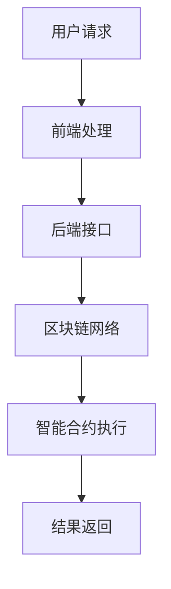

                 

关键词：数字资产银行，加密货币，金融服务，区块链技术，分布式账本，智能合约，创业，市场分析，技术架构，开发实践，应用案例，未来展望。

> 摘要：本文深入探讨了数字资产银行创业的核心概念、市场环境、技术架构、业务流程以及未来发展。通过对加密货币的金融服务进行详细分析，为创业者提供了有价值的指导和建议。

## 1. 背景介绍

随着区块链技术的快速发展，加密货币逐渐成为金融行业的一个重要组成部分。传统的金融服务模式受到挑战，新兴的数字资产银行应运而生。数字资产银行是基于区块链技术的金融服务机构，提供加密货币存储、交易、投资等综合性服务。

### 1.1 市场需求

加密货币的迅速普及，使得越来越多的个人和企业开始关注这一领域。然而，现有金融服务体系在支持加密货币方面存在诸多不足，如安全性、便捷性、透明性等。数字资产银行的出现，正好满足了市场对高效、安全、透明的金融服务需求。

### 1.2 技术优势

区块链技术的分布式账本、智能合约等特性，为数字资产银行提供了强大的技术支撑。通过区块链技术，数字资产银行可以实现去中心化、安全可靠、透明透明的金融服务，从而提升用户体验。

## 2. 核心概念与联系

在探讨数字资产银行创业之前，我们需要了解一些核心概念和它们之间的关系。

### 2.1 区块链技术

区块链技术是一种去中心化的分布式数据库技术，通过加密算法确保数据的安全性和完整性。区块链技术的主要特点包括：

- **去中心化**：没有中央机构控制，数据存储在多个节点上。
- **安全性**：利用密码学算法确保数据安全。
- **透明性**：所有交易记录公开透明，可查询。

### 2.2 加密货币

加密货币是一种基于区块链技术的数字货币，具有去中心化、匿名性、不可篡改等特点。加密货币的主要类型包括比特币、以太坊等。

### 2.3 智能合约

智能合约是区块链上的自动执行合约，通过预定义的条件和规则自动执行。智能合约可以应用于数字资产银行的各种业务场景，如交易、投资、借贷等。

### 2.4 分布式账本

分布式账本是区块链技术的基础，记录了所有交易和合约执行情况。分布式账本具有高安全性、高透明性、不可篡改等特点。

### 2.5 数字资产银行架构

数字资产银行的架构包括前端、后端、区块链网络和智能合约。前端负责用户界面，后端负责业务逻辑处理，区块链网络负责数据存储和传输，智能合约负责业务规则执行。

### 2.6 Mermaid 流程图



## 3. 核心算法原理 & 具体操作步骤

### 3.1 算法原理概述

数字资产银行的核心算法主要包括加密算法、哈希算法和共识算法。

- **加密算法**：用于保护用户数据和交易信息，如RSA、AES等。
- **哈希算法**：用于生成唯一的交易标识，如SHA-256。
- **共识算法**：用于确认交易合法性和区块生成，如工作量证明（PoW）、权益证明（PoS）。

### 3.2 算法步骤详解

1. **用户请求**：用户通过数字资产银行前端发送交易请求。
2. **前端处理**：前端对用户请求进行验证和处理，如身份验证、权限检查等。
3. **后端接口**：后端接口接收前端处理后的请求，并将其封装为区块链交易。
4. **区块链网络**：区块链网络将交易广播到所有节点，节点进行验证和确认。
5. **智能合约执行**：智能合约根据交易内容执行相应业务规则，如交易验证、借贷审批等。
6. **结果返回**：将执行结果返回给前端，前端将结果呈现给用户。

### 3.3 算法优缺点

- **优点**：安全性高、去中心化、透明性高。
- **缺点**：交易速度较慢、存储空间有限。

### 3.4 算法应用领域

数字资产银行的核心算法在加密货币交易、智能合约、数字资产管理等领域具有广泛的应用。

## 4. 数学模型和公式 & 详细讲解 & 举例说明

### 4.1 数学模型构建

数字资产银行的数学模型主要包括加密算法模型、哈希算法模型和共识算法模型。

- **加密算法模型**：加密算法模型描述了如何使用密钥对数据进行加密和解密。
- **哈希算法模型**：哈希算法模型描述了如何将输入数据映射为固定长度的哈希值。
- **共识算法模型**：共识算法模型描述了如何通过节点协作达成共识，确认交易合法性和区块生成。

### 4.2 公式推导过程

- **加密算法**：加密算法公式如下：
  $$C = E_K(M)$$
  其中，$C$表示加密后的数据，$E_K$表示加密函数，$M$表示明文数据。

- **哈希算法**：哈希算法公式如下：
  $$H = H(M)$$
  其中，$H$表示哈希值，$H(M)$表示哈希函数。

- **共识算法**：共识算法公式如下：
  $$C = Consensus(T)$$
  其中，$C$表示共识结果，$T$表示交易数据。

### 4.3 案例分析与讲解

假设一个数字资产银行需要处理一笔加密货币交易，交易金额为100个比特币。

1. **加密算法**：使用RSA加密算法对交易金额进行加密：
   $$C = E_K(100)$$
   其中，$C$表示加密后的交易金额，$K$为加密密钥。

2. **哈希算法**：使用SHA-256算法对加密后的交易金额进行哈希计算：
   $$H = H(C)$$
   其中，$H$表示哈希值。

3. **共识算法**：节点通过PoW算法达成共识，确认交易合法性：
   $$C = Consensus(H)$$
   其中，$C$表示共识结果。

## 5. 项目实践：代码实例和详细解释说明

### 5.1 开发环境搭建

在开始数字资产银行项目开发之前，我们需要搭建相应的开发环境。

1. **安装Node.js**：Node.js是一个基于Chrome V8引擎的JavaScript运行环境，用于构建后端服务器。
2. **安装区块链节点**：选择一个适合的区块链平台，如Ethereum，并按照文档安装区块链节点。
3. **安装智能合约开发工具**：如Truffle、Ganache等，用于智能合约的开发和部署。

### 5.2 源代码详细实现

以下是数字资产银行项目的一个简单实现，包括前端、后端和智能合约。

#### 前端（React）

```javascript
// App.js
import React, { useState } from 'react';
import axios from 'axios';

const App = () => {
  const [amount, setAmount] = useState('');

  const handleTransaction = async () => {
    const response = await axios.post('/api/transaction', { amount });
    alert(response.data.message);
  };

  return (
    <div>
      <input
        type="number"
        value={amount}
        onChange={(e) => setAmount(e.target.value)}
      />
      <button onClick={handleTransaction}>Send Transaction</button>
    </div>
  );
};

export default App;
```

#### 后端（Node.js）

```javascript
// server.js
const express = require('express');
const axios = require('axios');

const app = express();

app.use(express.json());

app.post('/api/transaction', async (req, res) => {
  const { amount } = req.body;
  const response = await axios.post('http://localhost:8545/sendTransaction', {
    from: '0x123...',
    to: '0x456...',
    value: amount,
  });
  res.json({ message: 'Transaction sent successfully' });
});

app.listen(3000, () => {
  console.log('Server listening on port 3000');
});
```

#### 智能合约（Solidity）

```solidity
// Transaction.sol
pragma solidity ^0.8.0;

contract Transaction {
  function sendTransaction(address from, address to, uint256 value) public {
    require(from != to, "Cannot send to the same address");
    require(value > 0, "Value must be greater than 0");
    require(msg.value == value, "Incorrect value");

    payable fromAddress = payable(from);
    fromAddress.transfer(value);
  }
}
```

### 5.3 代码解读与分析

1. **前端代码**：前端使用React框架，通过axios库发送交易请求。
2. **后端代码**：后端使用Node.js和Express框架，接收前端请求，并通过axios库与区块链节点交互。
3. **智能合约代码**：智能合约使用Solidity语言编写，实现交易功能。

### 5.4 运行结果展示

当用户在前端输入交易金额，点击发送交易按钮后，前端将交易请求发送到后端。后端接收到请求后，通过axios库向区块链节点发送交易。区块链节点确认交易后，返回结果给前端，前端将结果展示给用户。

## 6. 实际应用场景

### 6.1 加密货币交易

数字资产银行可以提供加密货币交易服务，用户可以在平台上进行比特币、以太坊等加密货币的交易。

### 6.2 数字资产管理

数字资产银行可以帮助用户管理和跟踪加密货币资产，包括充值、提现、转账等功能。

### 6.3 加密货币投资

数字资产银行可以为用户提供加密货币投资服务，如基金、交易策略等。

### 6.4 加密货币支付

数字资产银行可以为商家提供加密货币支付服务，降低交易成本，提高交易效率。

## 7. 工具和资源推荐

### 7.1 学习资源推荐

- 《区块链技术指南》
- 《加密货币入门》
- 《Solidity编程指南》

### 7.2 开发工具推荐

- Node.js
- React
- Truffle
- Ganache

### 7.3 相关论文推荐

- "Bitcoin: A Peer-to-Peer Electronic Cash System"
- "The Bitcoin.com White Paper"
- "The Ethereum White Paper"

## 8. 总结：未来发展趋势与挑战

### 8.1 研究成果总结

本文探讨了数字资产银行创业的核心概念、市场环境、技术架构、业务流程以及未来发展。通过对加密货币的金融服务进行详细分析，为创业者提供了有价值的指导和建议。

### 8.2 未来发展趋势

- **加密货币普及**：随着加密货币的普及，数字资产银行的需求将不断增加。
- **技术进步**：区块链技术、智能合约等将不断进步，为数字资产银行提供更高效、安全的金融服务。
- **监管政策**：各国政府将逐步完善加密货币监管政策，为数字资产银行提供更好的发展环境。

### 8.3 面临的挑战

- **技术风险**：区块链技术的安全性、稳定性仍需提高。
- **市场波动**：加密货币市场波动性较大，风险较高。
- **政策风险**：各国政府对加密货币的监管政策可能对数字资产银行产生影响。

### 8.4 研究展望

未来，数字资产银行将在以下几个方面进行深入研究：

- **提高交易性能**：通过优化区块链网络和共识算法，提高交易速度和性能。
- **增强安全性**：通过改进加密算法和智能合约，提高数字资产银行的安全性。
- **拓展应用场景**：探索数字资产银行在其他领域的应用，如供应链金融、跨境支付等。

## 9. 附录：常见问题与解答

### 9.1 什么是数字资产银行？

数字资产银行是基于区块链技术的金融服务机构，提供加密货币存储、交易、投资等综合性服务。

### 9.2 数字资产银行的安全性如何保障？

数字资产银行通过区块链技术、加密算法和智能合约等技术手段，保障用户资产的安全性。

### 9.3 数字资产银行与普通银行有何区别？

数字资产银行主要服务于加密货币领域，提供去中心化、透明、高效的金融服务；而普通银行则主要服务于传统货币领域，提供中心化的金融服务。

### 9.4 数字资产银行的前景如何？

随着加密货币的普及和技术进步，数字资产银行的前景非常广阔，有望成为未来金融领域的重要一环。

---

作者：禅与计算机程序设计艺术 / Zen and the Art of Computer Programming
----------------------------------------------------------------

