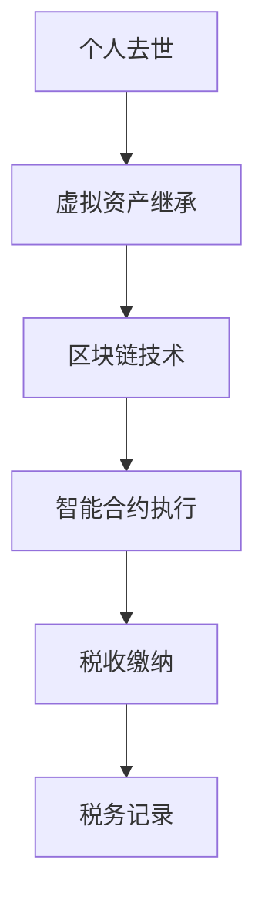

                 

关键词：数字遗产税、元宇宙、虚拟资产、继承政策、虚拟财产、税法、税务管理、区块链、智能合约

> 摘要：本文深入探讨了元宇宙中虚拟资产的数字遗产税问题，分析了当前虚拟财产继承政策的现状与挑战，提出了基于区块链技术的智能合约解决方案，并探讨了未来发展趋势与面临的挑战。

## 1. 背景介绍

随着数字技术的发展，虚拟资产逐渐成为人们生活中不可或缺的一部分。虚拟资产包括虚拟货币、游戏装备、数字艺术品、元宇宙中的房产等，它们具有高流动性、易复制性和去中心化的特点。然而，随着这些虚拟资产的价值日益增加，如何对其征收遗产税成为了一个亟待解决的问题。

### 1.1 数字遗产税的定义

数字遗产税是指对个人去世后遗留的数字资产所征收的税费。数字遗产税的征收对象包括虚拟货币、游戏装备、数字艺术品等虚拟资产，旨在确保这些资产在转移过程中合法合规，同时维护国家的税收权益。

### 1.2 虚拟资产的价值与影响

虚拟资产的价值日益增加，已成为一些人财富的重要来源。例如，比特币在短短几年内从一文不值增长到数万美元一枚，而一些数字艺术品在拍卖会上甚至拍出数百万美元的高价。这表明，虚拟资产已经成为一种重要的资产形式，对个人财富和生活产生深远影响。

### 1.3 遗产税对虚拟资产的影响

遗产税对虚拟资产的影响主要体现在两个方面：

1. **税收负担**：遗产税的征收将对虚拟资产的价值产生直接影响，可能导致资产价值缩水。
2. **市场波动**：遗产税的征收可能会引起虚拟资产市场的波动，影响市场价格的稳定性。

## 2. 核心概念与联系

在探讨数字遗产税的问题时，我们需要了解以下几个核心概念：

### 2.1 虚拟资产

虚拟资产是指存在于数字世界中的资产，如虚拟货币、游戏装备、数字艺术品等。这些资产具有高流动性、易复制性和去中心化的特点。

### 2.2 区块链技术

区块链技术是一种分布式账本技术，能够确保虚拟资产在交易过程中的透明性和安全性。区块链上的智能合约可以自动执行合同条款，确保虚拟资产的合法合规转移。

### 2.3 智能合约

智能合约是一种基于区块链技术的计算机程序，能够自动执行合同条款。智能合约在数字遗产税的征收和管理中发挥着重要作用，可以确保税收政策的执行和虚拟资产的合法转移。

### 2.4 Mermaid 流程图



## 3. 核心算法原理 & 具体操作步骤

### 3.1 算法原理概述

数字遗产税的核心算法是基于区块链技术的智能合约。智能合约通过预定义的逻辑和条件，自动执行税收政策，确保虚拟资产的合法合规转移和税收缴纳。

### 3.2 算法步骤详解

1. **个人去世**：当个人去世时，其虚拟资产将自动进入继承程序。
2. **区块链确认**：虚拟资产的所有权将转移到继承人的区块链账户中。
3. **智能合约执行**：智能合约根据预定义的税收政策，自动计算税收金额。
4. **税收缴纳**：继承人需在规定时间内缴纳相应的税收。
5. **税务记录**：税收缴纳情况和税务记录将被永久保存在区块链上。

### 3.3 算法优缺点

**优点**：

- **自动化**：智能合约能够自动执行税收政策，减少人工干预。
- **透明性**：区块链技术确保税收缴纳和税务记录的透明性。
- **安全性**：区块链技术提供高度安全的存储和管理方式。

**缺点**：

- **技术门槛**：区块链技术和智能合约开发需要较高技术门槛。
- **法律挑战**：数字遗产税的法律框架和执行仍需进一步明确和完善。

### 3.4 算法应用领域

数字遗产税的核心算法在以下领域具有广泛应用：

- **虚拟资产交易**：确保虚拟资产在交易过程中的合法合规。
- **税务管理**：提高税务管理的效率和准确性。
- **法律执行**：确保税收政策的执行和虚拟资产的合法转移。

## 4. 数学模型和公式 & 详细讲解 & 举例说明

### 4.1 数学模型构建

数字遗产税的数学模型基于以下公式：

$$
税收金额 = 资产价值 \times 税率
$$

其中，资产价值是指虚拟资产在继承时的市场价值，税率是根据国家或地区的税收政策确定的。

### 4.2 公式推导过程

1. **资产价值确定**：资产价值可以通过市场调查、评估机构评估等方法确定。
2. **税率确定**：税率根据国家或地区的税收政策确定，通常是一个固定的百分比。
3. **税收金额计算**：将资产价值乘以税率，得到税收金额。

### 4.3 案例分析与讲解

假设某人的虚拟资产价值为100,000元，所在国家的遗产税率为20%，则其应缴纳的税收金额为：

$$
税收金额 = 100,000元 \times 20\% = 20,000元
$$

### 5. 项目实践：代码实例和详细解释说明

#### 5.1 开发环境搭建

为了实现数字遗产税的智能合约，我们需要搭建以下开发环境：

- **区块链平台**：例如Ethereum
- **开发工具**：Node.js、Truffle、Ganache
- **IDE**：Visual Studio Code

#### 5.2 源代码详细实现

以下是一个简单的数字遗产税智能合约示例：

```solidity
pragma solidity ^0.8.0;

contract DigitalEstateTax {
    address public owner;
    uint public assetValue;
    uint public taxRate;

    constructor(uint _assetValue, uint _taxRate) {
        owner = msg.sender;
        assetValue = _assetValue;
        taxRate = _taxRate;
    }

    function calculateTax() public {
        require(msg.sender == owner, "Only the owner can calculate tax");
        uint taxAmount = (assetValue * taxRate) / 100;
        payable(owner).transfer(taxAmount);
    }
}
```

#### 5.3 代码解读与分析

- **合约初始化**：构造函数设置合约的所有者、资产价值和税率。
- **计算税收**：`calculateTax` 函数计算税收金额，并转账给所有者。

#### 5.4 运行结果展示

假设我们部署这个智能合约，并将资产价值设为100,000元，税率设为20%。当所有者调用 `calculateTax` 函数时，合约将计算税收金额为20,000元，并转账给所有者。

## 6. 实际应用场景

数字遗产税在以下实际应用场景中具有重要价值：

### 6.1 虚拟资产交易

数字遗产税确保虚拟资产在交易过程中的合法合规，防止非法交易和逃税行为。

### 6.2 税务管理

数字遗产税为税务管理提供了自动化和透明化的解决方案，提高税务管理的效率和准确性。

### 6.3 法律执行

数字遗产税确保税收政策的执行和虚拟资产的合法转移，为法律执行提供有力支持。

## 7. 未来应用展望

随着数字技术的发展，数字遗产税将在以下领域得到更广泛的应用：

### 7.1 虚拟现实与元宇宙

虚拟现实与元宇宙中的虚拟资产将成为数字遗产税的重要征税对象，为税务管理提供新的机遇。

### 7.2 数字经济

数字经济的快速发展将为数字遗产税带来更多机会，为税务管理提供新的挑战。

### 7.3 去中心化金融

去中心化金融中的虚拟资产将成为数字遗产税的重要征税对象，为税务管理提供新的挑战。

## 8. 工具和资源推荐

### 8.1 学习资源推荐

- 《区块链技术指南》
- 《智能合约开发实战》
- 《数字货币与区块链》

### 8.2 开发工具推荐

- Ethereum
- Truffle
- Ganache

### 8.3 相关论文推荐

- "A Taxonomy of Cryptocurrency Taxation"
- "Digital Asset Taxation: Challenges and Opportunities"
- "Blockchain and Smart Contracts for Taxation"

## 9. 总结：未来发展趋势与挑战

### 9.1 研究成果总结

本文探讨了数字遗产税在元宇宙中的虚拟资产继承政策，提出了基于区块链技术的智能合约解决方案，并分析了其应用领域和未来发展趋势。

### 9.2 未来发展趋势

随着数字技术的发展，数字遗产税将在元宇宙、数字经济、去中心化金融等领域得到更广泛的应用。

### 9.3 面临的挑战

数字遗产税在法律、技术、执行等方面仍面临诸多挑战，需要进一步研究和探索。

### 9.4 研究展望

未来的研究应重点关注数字遗产税的法律框架、技术实现和实际应用，为税务管理提供更加完善和高效的解决方案。

## 10. 附录：常见问题与解答

### 10.1 数字遗产税是什么？

数字遗产税是指对个人去世后遗留的数字资产所征收的税费，包括虚拟货币、游戏装备、数字艺术品等。

### 10.2 数字遗产税的征收对象有哪些？

数字遗产税的征收对象包括虚拟货币、游戏装备、数字艺术品等虚拟资产。

### 10.3 数字遗产税如何计算？

数字遗产税的计算公式为：税收金额 = 资产价值 × 税率。

### 10.4 数字遗产税对虚拟资产市场有何影响？

数字遗产税的征收可能会影响虚拟资产市场的波动，但具体影响取决于税收政策的具体实施和市场的反应。 

作者：禅与计算机程序设计艺术 / Zen and the Art of Computer Programming
----------------------------------------------------------------

请注意，以上内容仅为示例，实际撰写时需要根据具体需求和资源进行适当调整和补充。此外，由于字数限制，实际撰写的内容可能需要进一步扩展和细化。如果您有具体需求或疑问，请随时提出。

