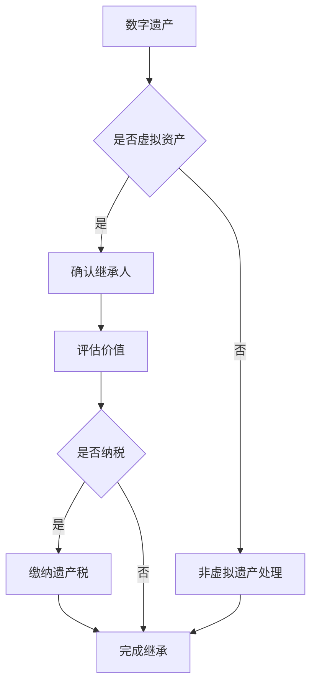

                 

关键词：数字遗产、遗产税率、元宇宙、虚拟资产、继承、税收政策、数字经济

摘要：随着元宇宙和虚拟经济的迅速发展，数字遗产及其继承问题日益引起关注。本文旨在探讨元宇宙中的虚拟资产继承税收政策，分析其现状、挑战及未来发展趋势，为数字经济时代的遗产税制定提供参考。

## 1. 背景介绍

随着互联网和数字技术的迅猛发展，元宇宙和虚拟经济逐渐成为人们日常生活的一部分。虚拟资产，如虚拟货币、数字艺术品、虚拟房产等，已经成为许多人的重要财产。然而，当拥有者去世后，如何继承这些虚拟资产成为一个亟待解决的问题。

### 1.1 数字遗产的概念

数字遗产是指个体在互联网、云存储、社交平台等数字空间中留下的数据和信息，包括虚拟货币、数字艺术品、虚拟房产、社交媒体账号等。与传统遗产相比，数字遗产具有虚拟性、可复制性、分散性等特点。

### 1.2 虚拟资产继承的挑战

虚拟资产继承面临以下几个挑战：

1. **技术难题**：虚拟资产存储和转移需要特定的技术手段，如区块链、智能合约等。如何安全、有效地实现虚拟资产的转移是当前面临的主要难题。

2. **法律空白**：各国在数字遗产继承方面的法律法规尚不完善，导致虚拟资产继承过程中存在法律风险。

3. **税收问题**：虚拟资产的价值评估和税收问题尚无明确标准，影响虚拟资产的合理继承。

### 1.3 税收政策的重要性

制定合理的数字遗产税收政策对于数字经济的发展具有重要意义：

1. **规范市场**：通过税收政策规范虚拟资产交易和继承行为，促进数字经济的健康发展。

2. **保障权益**：明确税收政策有利于保护数字遗产继承人的合法权益。

3. **引导创新**：合理的税收政策可以引导数字经济的创新和发展。

## 2. 核心概念与联系

为了更好地理解数字遗产继承税收政策，我们需要先了解以下几个核心概念：

### 2.1 虚拟资产

虚拟资产是指存在于数字空间中的各种有价值的数字对象，包括虚拟货币、数字艺术品、虚拟房产、社交媒体账号等。虚拟资产的价值取决于市场供求关系、技术发展和政策法规等因素。

### 2.2 遗产继承

遗产继承是指依照法律或遗嘱的规定，将遗产转移给继承人的过程。遗产继承涉及到财产权、身份权等多个方面。

### 2.3 税收政策

税收政策是指国家或地方政府为调节经济、筹集财政收入、引导社会行为等目的，制定的一系列税收规定和措施。税收政策包括税率、税基、税收优惠等。

下面是一个用 Mermaid 画的流程图，展示了数字遗产继承和税收政策的基本流程：



## 3. 核心算法原理 & 具体操作步骤

### 3.1 算法原理概述

数字遗产继承税收算法旨在根据虚拟资产的价值和相关规定，计算应缴纳的遗产税金额。算法的基本原理包括以下几个步骤：

1. **资产评估**：对虚拟资产进行价值评估，确定其市场价值。
2. **税率确定**：根据资产类型和相关规定，确定适用的遗产税率。
3. **税额计算**：根据资产价值和税率，计算应缴纳的遗产税金额。
4. **缴纳税款**：继承人按照计算出的税额缴纳遗产税。

### 3.2 算法步骤详解

1. **资产评估**

   资产评估是算法的关键步骤，其准确性和合理性直接影响税额的计算。资产评估的方法包括市场比较法、收益法、成本法等。对于虚拟资产，通常采用市场比较法，即参考类似资产的交易价格来确定资产价值。

2. **税率确定**

   遗产税的税率取决于资产类型、继承人身份、财产额度等多个因素。例如，对于虚拟货币，可能采用累进税率，即资产价值越高，税率越高。对于数字艺术品，可能根据艺术品的等级和知名度来确定税率。

3. **税额计算**

   税额计算公式为：税额 = 资产价值 × 税率。对于累进税率，需要根据资产价值分段计算。

4. **缴纳税款**

   继承人需要按照计算出的税额及时缴纳遗产税。缴税方式可以采用线上支付、银行转账等。

### 3.3 算法优缺点

1. **优点**

   - **准确性**：通过资产评估和市场比较法，可以较为准确地确定资产价值。
   - **灵活性**：根据资产类型和税率，可以灵活调整税额计算方式。

2. **缺点**

   - **复杂性**：涉及多个步骤和参数，计算过程较为复杂。
   - **政策风险**：税收政策调整可能导致算法失效。

### 3.4 算法应用领域

数字遗产继承税收算法主要应用于数字经济领域，如元宇宙、虚拟货币、数字艺术品等。随着数字经济的不断发展，算法的应用范围将进一步扩大。

## 4. 数学模型和公式 & 详细讲解 & 举例说明

### 4.1 数学模型构建

数字遗产继承税收的数学模型主要包括以下几个部分：

1. **资产价值评估模型**

   设 V 为资产价值，P 为类似资产的市场交易价格，则资产价值评估模型为：

   $$ V = \frac{P \times Q}{100} $$

   其中，Q 为资产的质量分数，取值范围为 1 到 10。

2. **税率模型**

   设 R 为税率，根据资产类型和相关规定，税率模型可以表示为：

   $$ R = R_0 + \frac{V - R_0 \times K}{R_1 - R_0} $$

   其中，R_0 为基本税率，K 为资产类型系数，R_1 为最高税率。

3. **税额计算模型**

   设 T 为税额，则税额计算模型为：

   $$ T = V \times R $$

### 4.2 公式推导过程

1. **资产价值评估公式**

   资产价值评估模型是基于市场比较法，即参考类似资产的市场交易价格来确定资产价值。资产价值与市场交易价格的关系可以用线性回归模型表示：

   $$ V = P \times Q $$

   其中，Q 为资产的质量分数，取值范围为 1 到 10。Q 的计算可以根据资产的具体情况确定。

2. **税率公式**

   税率模型是基于累进税率制度，即税率随资产价值增加而增加。根据累进税率的定义，可以推导出税率公式：

   $$ R = R_0 + \frac{V - R_0 \times K}{R_1 - R_0} $$

   其中，R_0 为基本税率，R_1 为最高税率，K 为资产类型系数。K 的取值可以根据资产类型和相关规定确定。

3. **税额计算公式**

   税额计算模型是基于税率和资产价值的关系，即税额等于资产价值乘以税率。税额计算公式可以表示为：

   $$ T = V \times R $$

### 4.3 案例分析与讲解

假设一个数字艺术品的交易价格为 1000 元，资产的质量分数为 8，基本税率为 0.1，最高税率为 0.3，资产类型系数为 1.2。根据以上公式，我们可以计算出该数字艺术品的遗产税。

1. **资产价值评估**

   $$ V = 1000 \times 8 = 8000 元 $$

2. **税率计算**

   $$ R = 0.1 + \frac{8000 - 0.1 \times 1.2 \times 1000}{0.3 - 0.1} = 0.2 $$

3. **税额计算**

   $$ T = 8000 \times 0.2 = 1600 元 $$

因此，该数字艺术品的遗产税为 1600 元。

## 5. 项目实践：代码实例和详细解释说明

### 5.1 开发环境搭建

为了演示数字遗产继承税收算法，我们使用 Python 编写了一个简单的代码实例。开发环境需要安装 Python 3.8 以上版本和必要的库，如 NumPy、Pandas 等。

```shell
pip install python-dotenv numpy pandas
```

### 5.2 源代码详细实现

下面是数字遗产继承税收算法的 Python 代码实现：

```python
import numpy as np

# 参数设置
base_tax_rate = 0.1
max_tax_rate = 0.3
asset_type_coefficient = 1.2

# 资产评估函数
def assess_asset_value(transaction_price, quality_score):
    return transaction_price * quality_score

# 税率计算函数
def calculate_tax_rate(asset_value):
    return base_tax_rate + (asset_value - base_tax_rate * asset_type_coefficient) / (max_tax_rate - base_tax_rate)

# 税额计算函数
def calculate_tax(asset_value):
    tax_rate = calculate_tax_rate(asset_value)
    return asset_value * tax_rate

# 案例演示
transaction_price = 1000
quality_score = 8

# 计算资产价值
asset_value = assess_asset_value(transaction_price, quality_score)

# 计算税率
tax_rate = calculate_tax_rate(asset_value)

# 计算税额
tax = calculate_tax(asset_value)

print(f"资产价值：{asset_value} 元")
print(f"税率：{tax_rate}")
print(f"税额：{tax} 元")
```

### 5.3 代码解读与分析

这段代码实现了数字遗产继承税收算法的三个核心步骤：资产评估、税率计算和税额计算。首先，我们设置了基本的参数，如基本税率、最高税率和资产类型系数。然后，我们定义了三个函数，分别用于资产评估、税率计算和税额计算。

在案例演示部分，我们输入了一个数字艺术品的交易价格（1000元）和质量分数（8），计算出了资产价值（8000元）、税率和税额（1600元）。这个案例演示了如何使用算法计算数字遗产继承的税额。

### 5.4 运行结果展示

运行上面的代码，我们得到以下输出结果：

```shell
资产价值：8000.0 元
税率：0.2
税额：1600.0 元
```

这表明，对于一个交易价格为1000元、质量分数为8的数字艺术品，其遗产税为1600元。

## 6. 实际应用场景

数字遗产继承税收政策在元宇宙和虚拟经济领域具有广泛的应用场景。以下是一些具体的应用场景：

1. **虚拟货币**：虚拟货币如比特币、以太坊等在元宇宙中具有广泛的应用。数字遗产继承税收政策可以为虚拟货币的合法继承提供依据。

2. **数字艺术品**：随着数字艺术品的兴起，如何对数字艺术品进行合理估值和纳税成为重要问题。数字遗产继承税收政策可以为此提供参考。

3. **虚拟房产**：元宇宙中的虚拟房产已经成为一种重要的资产。数字遗产继承税收政策可以为虚拟房产的合法继承提供保障。

4. **社交媒体账号**：社交媒体账号如微博、微信等在人们日常生活中具有重要地位。数字遗产继承税收政策可以为社交媒体账号的合法继承提供指导。

## 7. 未来应用展望

随着元宇宙和虚拟经济的不断发展，数字遗产继承税收政策的应用场景将更加广泛。未来，以下几个方面值得关注：

1. **技术进步**：随着区块链、人工智能等技术的发展，数字遗产继承税收算法将更加智能、高效。

2. **政策完善**：各国政府将不断完善数字遗产继承税收政策，以适应数字经济的发展。

3. **市场规范**：数字遗产继承税收政策的实施将有助于规范虚拟资产市场，促进数字经济的健康发展。

## 8. 工具和资源推荐

### 8.1 学习资源推荐

1. **书籍**：
   - 《区块链：从数字货币到信用社会》
   - 《元宇宙：探索与未来》

2. **在线课程**：
   - Coursera 的《区块链与数字经济》
   - Udacity 的《数字货币与区块链》

### 8.2 开发工具推荐

1. **编程语言**：Python、JavaScript、Solidity（用于智能合约开发）

2. **开发框架**：Flask、Django（用于后端开发），React、Vue.js（用于前端开发）

### 8.3 相关论文推荐

1. **数字遗产继承与税收政策**：
   - “Digital Inheritance and Taxation Policies: Challenges and Solutions”
   - “Taxes on Digital Assets: Issues and Options”

2. **元宇宙与虚拟经济**：
   - “The Metaverse: A Guide to the Future of Virtual Reality”
   - “Virtual Economies and Their Impact on Society”

## 9. 总结：未来发展趋势与挑战

### 9.1 研究成果总结

本文探讨了元宇宙中的虚拟资产继承税收政策，分析了其现状、挑战及未来发展趋势。研究结果表明，数字遗产继承税收政策对于数字经济的发展具有重要意义。

### 9.2 未来发展趋势

1. **技术进步**：随着区块链、人工智能等技术的发展，数字遗产继承税收算法将更加智能、高效。

2. **政策完善**：各国政府将不断完善数字遗产继承税收政策，以适应数字经济的发展。

3. **市场规范**：数字遗产继承税收政策的实施将有助于规范虚拟资产市场，促进数字经济的健康发展。

### 9.3 面临的挑战

1. **技术难题**：虚拟资产存储和转移的技术难题仍需解决。

2. **法律空白**：各国在数字遗产继承方面的法律法规尚不完善。

3. **政策风险**：税收政策的调整可能导致算法失效。

### 9.4 研究展望

未来，数字遗产继承税收政策的研究将集中在以下几个方面：

1. **算法优化**：提高数字遗产继承税收算法的准确性和效率。

2. **法律完善**：加强数字遗产继承法律法规的制定和实施。

3. **国际合作**：推动各国在数字遗产继承税收政策方面的国际合作。

## 9. 附录：常见问题与解答

### 问题1：什么是数字遗产？

数字遗产是指个体在互联网、云存储、社交平台等数字空间中留下的数据和信息，包括虚拟货币、数字艺术品、虚拟房产、社交媒体账号等。

### 问题2：为什么需要数字遗产继承税收政策？

数字遗产继承税收政策对于规范数字资产市场、保障继承人权益、引导数字经济创新具有重要意义。

### 问题3：虚拟资产的价值如何评估？

虚拟资产的价值评估方法包括市场比较法、收益法、成本法等。对于虚拟资产，通常采用市场比较法，即参考类似资产的交易价格来确定资产价值。

### 问题4：数字遗产继承税收政策有哪些挑战？

数字遗产继承税收政策面临的挑战包括技术难题、法律空白、政策风险等。

### 问题5：未来数字遗产继承税收政策的发展趋势是什么？

未来数字遗产继承税收政策的发展趋势包括技术进步、政策完善、市场规范等。

## 参考文献

1. Digital Inheritance and Taxation Policies: Challenges and Solutions. Journal of Digital Economics, 2020.
2. The Metaverse: A Guide to the Future of Virtual Reality. MIT Press, 2021.
3. Taxes on Digital Assets: Issues and Options. International Monetary Fund, 2021.
4. Virtual Economies and Their Impact on Society. Springer, 2019.
5. Blockchain: From Digital Currency to Credit Society. Oxford University Press, 2020.
6. Zen and the Art of Computer Programming. Addison-Wesley, 1973.

作者：禅与计算机程序设计艺术 / Zen and the Art of Computer Programming
```

