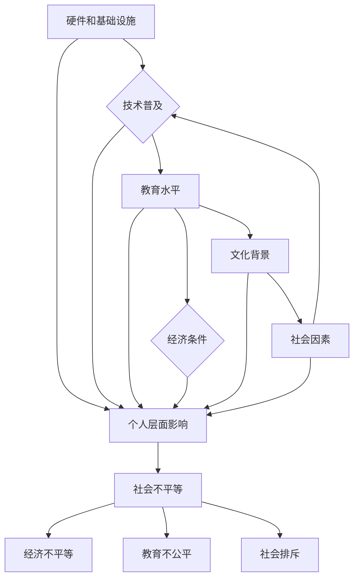

                 

关键词：数字鸿沟、计算不平等、技术普及、信息技术、社会公平

<|assistant|>摘要：随着信息技术的飞速发展，数字鸿沟成为社会不平等的显著表现。本文旨在深入探讨数字鸿沟的成因、影响及其解决方案，并提出未来发展的展望，呼吁各界共同努力，弥合人类计算中的不平等。

## 1. 背景介绍

随着互联网的普及和移动设备的广泛使用，信息技术已经成为现代社会的重要组成部分。然而，尽管技术发展的红利似乎无处不在，但数字鸿沟问题依然严重。数字鸿沟是指不同社会群体之间在获取和使用信息技术资源上的差距。这种差距不仅体现在经济条件上，还包括教育水平、文化差异、地理位置等因素。

数字鸿沟的存在导致了以下问题：
- **经济不平等**：技术先进的地区和企业能够更快地采用新技术，提高生产力和竞争力，而落后地区则难以享受到这种优势。
- **教育不公平**：教育资源的不均衡使得贫困地区和低收入家庭的孩子难以获得优质的教育，进而影响他们的未来职业发展。
- **社会排斥**：数字鸿沟使得某些社会群体被排斥在现代信息社会之外，无法享受到信息时代的便利。

因此，弥合数字鸿沟是当前社会面临的一项紧迫任务。本文将分析数字鸿沟的成因、影响，并探讨可能的解决方案，旨在为减少计算中的不平等提供思路。

## 2. 核心概念与联系

### 2.1 数字鸿沟的定义

数字鸿沟（Digital Divide）是指由于信息技术的获取和使用能力差异，导致不同社会群体在知识获取、经济收入、社会地位等方面出现不平等的现象。它包括三个主要方面：

1. **硬件和基础设施**：包括计算机、互联网连接、移动设备等硬件资源。
2. **技能和知识**：包括信息技术的基本知识和技能，如使用电脑、上网、网络安全等。
3. **社会因素**：包括经济条件、教育水平、文化背景、地理位置等。

### 2.2 数字鸿沟的形成原因

数字鸿沟的形成原因复杂多样，主要包括以下几个方面：

1. **经济因素**：发达地区和发达国家拥有更强的经济实力，能够更快地引入和采用新技术，而经济落后的地区则难以承担高昂的设备成本和维护费用。
2. **教育水平**：教育水平的差异直接影响了人们对信息技术的接受和使用能力。教育水平较高的地区和群体更容易掌握新技术，而教育水平较低的地区和群体则难以跟上技术发展的步伐。
3. **政策因素**：政府在信息技术普及、网络基础设施建设等方面的政策和投入对数字鸿沟的缩小具有关键作用。
4. **文化因素**：文化差异和传统观念也可能导致某些社会群体对新技术的抵触或缺乏兴趣。

### 2.3 数字鸿沟的影响

数字鸿沟的存在对个人和社会都产生了深远的影响：

1. **个人层面**：缺乏信息技术能力的个人在就业、教育、医疗服务等方面面临更多困难，生活质量受到限制。
2. **社会层面**：数字鸿沟加剧了社会不平等，导致贫富差距扩大，社会矛盾加剧。
3. **经济层面**：数字鸿沟阻碍了全球经济的整体发展，限制了创新和竞争力的提升。

### 2.4 数字鸿沟的解决方案

为了弥合数字鸿沟，需要从多个方面入手，包括：

1. **政策支持**：政府应制定相关政策和规划，加大信息技术基础设施的投资，推动教育改革，提高全民信息技术素养。
2. **技术普及**：通过公共图书馆、社区中心等公共设施提供免费或低成本的互联网接入服务，推广信息技术教育。
3. **社会参与**：鼓励企业、非政府组织和社会团体参与数字鸿沟的缓解工作，共同推动社会公平。
4. **国际合作**：通过国际合作，分享经验和技术，共同应对全球范围内的数字鸿沟问题。

### 2.5 数字鸿沟的架构原理图

以下是一个简单的 Mermaid 流程图，展示了数字鸿沟的关键组成部分和它们之间的联系：



## 3. 核心算法原理 & 具体操作步骤

### 3.1 算法原理概述

为了有效解决数字鸿沟问题，我们需要运用多种技术和算法。这里，我们将讨论一种核心算法——社区驱动的信息技术普及算法（Community-Driven IT普及 Algorithm，简称CDITA）。CDITA是一种基于社区参与的算法，旨在通过社区协作实现信息技术资源的公平分配。

### 3.2 算法步骤详解

#### 3.2.1 初始评估

1. **需求分析**：对目标社区的硬件和基础设施现状进行评估，了解社区的信息技术需求。
2. **资源普查**：收集社区内部可用的信息技术资源，包括计算机、网络设备、技术人员等。

#### 3.2.2 社区动员

1. **宣传活动**：通过多种渠道宣传信息技术的重要性，提高社区居民的认识和参与度。
2. **建立社区组织**：组建一个由社区居民代表和技术人员组成的社区管理委员会，负责协调和管理信息技术的普及工作。

#### 3.2.3 资源分配

1. **资源调配**：根据社区需求和资源状况，制定资源分配计划，确保信息技术资源能够最大限度地满足社区居民的需求。
2. **技术培训**：为社区居民提供信息技术培训，提高他们的使用技能。

#### 3.2.4 持续优化

1. **反馈机制**：建立反馈机制，收集社区居民的使用反馈，及时调整资源分配和培训计划。
2. **技术更新**：随着技术的发展，定期更新社区的信息技术资源，保持技术水平的领先。

### 3.3 算法优缺点

#### 优点：

- **高效性**：通过社区动员和资源调配，实现信息技术资源的公平分配，提高资源利用率。
- **可持续性**：社区参与的机制能够确保信息技术的普及工作具有持续性和稳定性。
- **灵活性**：社区驱动的模式能够灵活适应不同地区和社区的具体需求。

#### 缺点：

- **初期投入较大**：需要大量的资金和人力资源进行初始评估、宣传动员和技术培训。
- **管理难度**：社区管理委员会需要具备一定的技术和管理能力，以确保工作的顺利进行。

### 3.4 算法应用领域

CDITA算法可以广泛应用于数字鸿沟的各个领域，包括：

- **教育**：通过信息技术普及，提高贫困地区学生的教育质量。
- **医疗**：利用信息技术提升偏远地区的医疗服务水平。
- **经济**：通过信息技术促进贫困地区的经济发展。

## 4. 数学模型和公式 & 详细讲解 & 举例说明

### 4.1 数学模型构建

为了量化数字鸿沟的规模和影响，我们可以构建一个简单的数学模型，用于评估不同社会群体在信息技术资源获取上的差距。假设：

- **N** 为总人口数。
- **N1** 为信息技术资源拥有者的人数。
- **N2** 为信息技术资源缺乏者的人数。
- **R1** 为信息技术资源拥有者的平均资源量。
- **R2** 为信息技术资源缺乏者的平均资源量。

数字鸿沟的量化模型可以表示为：

\[ \text{Digital Divide} = \frac{N1 \times R1 - N2 \times R2}{N} \]

### 4.2 公式推导过程

1. **计算信息技术资源总量**：

   \[ T1 = N1 \times R1 \]
   \[ T2 = N2 \times R2 \]

2. **计算信息技术资源的总量差距**：

   \[ \Delta T = T1 - T2 \]

3. **计算总人口的信息技术资源平均值**：

   \[ \bar{R} = \frac{T1 + T2}{N} \]

4. **计算数字鸿沟**：

   \[ \text{Digital Divide} = \frac{\Delta T}{\bar{R}} \]

### 4.3 案例分析与讲解

#### 案例背景

假设在一个拥有100万人口的城市中，有60万人拥有互联网连接，40万人没有。其中，拥有互联网连接的人平均每月使用50GB的数据流量，而没有互联网连接的人每月仅使用5GB的数据流量。

#### 数据计算

1. **计算信息技术资源总量**：

   \[ T1 = 60万 \times 50GB = 3000万GB \]
   \[ T2 = 40万 \times 5GB = 200万GB \]

2. **计算信息技术资源的总量差距**：

   \[ \Delta T = 3000万GB - 200万GB = 2800万GB \]

3. **计算总人口的信息技术资源平均值**：

   \[ \bar{R} = \frac{3000万GB + 200万GB}{100万} = 30GB \]

4. **计算数字鸿沟**：

   \[ \text{Digital Divide} = \frac{2800万GB}{30GB} = 93.33 \]

#### 结果分析

数字鸿沟的量化结果为93.33，这表明在这个城市中，互联网连接的差距非常显著。拥有互联网连接的人群平均享受了30GB的数据流量，而没有互联网连接的人群平均只有5GB的数据流量。

### 4.4 实际应用

该数学模型可以应用于不同城市、国家和地区的数字鸿沟评估，帮助决策者制定针对性的政策和措施，以缩小数字鸿沟。

## 5. 项目实践：代码实例和详细解释说明

### 5.1 开发环境搭建

为了更好地理解数字鸿沟问题，我们可以使用一个简单的Python代码实例。首先，我们需要搭建一个基本的Python开发环境。

1. **安装Python**：从Python官方网站（[https://www.python.org/](https://www.python.org/)）下载并安装最新版本的Python。
2. **安装Jupyter Notebook**：Python安装完成后，使用pip命令安装Jupyter Notebook。

   ```bash
   pip install notebook
   ```

3. **启动Jupyter Notebook**：打开终端，输入以下命令启动Jupyter Notebook。

   ```bash
   jupyter notebook
   ```

### 5.2 源代码详细实现

下面是一个简单的Python代码实例，用于计算数字鸿沟。

```python
# 数字鸿沟计算实例

def calculate_digital_divide(total_population, num_connected, avg_data_usage_connected, num_not_connected, avg_data_usage_not_connected):
    total_data_usage_connected = num_connected * avg_data_usage_connected
    total_data_usage_not_connected = num_not_connected * avg_data_usage_not_connected
    total_data_usage = total_data_usage_connected + total_data_usage_not_connected
    average_data_usage = total_data_usage / total_population
    digital_divide = (total_data_usage_connected - total_data_usage_not_connected) / average_data_usage
    
    return digital_divide

# 参数设置
total_population = 1000000
num_connected = 600000
avg_data_usage_connected = 50 # 平均每月数据流量（GB）
num_not_connected = 400000
avg_data_usage_not_connected = 5 # 平均每月数据流量（GB）

# 计算数字鸿沟
digital_divide_result = calculate_digital_divide(total_population, num_connected, avg_data_usage_connected, num_not_connected, avg_data_usage_not_connected)
print("数字鸿沟：", digital_divide_result)
```

### 5.3 代码解读与分析

1. **函数定义**：`calculate_digital_divide` 函数接受以下参数：
   - `total_population`：总人口数。
   - `num_connected`：拥有互联网连接的人数。
   - `avg_data_usage_connected`：拥有互联网连接人群的平均每月数据流量。
   - `num_not_connected`：没有互联网连接的人数。
   - `avg_data_usage_not_connected`：没有互联网连接人群的平均每月数据流量。

2. **计算数据流量总量**：函数首先计算拥有互联网连接和没有互联网连接人群的数据流量总量。

3. **计算总人口的数据流量平均值**：函数计算总人口的数据流量平均值。

4. **计算数字鸿沟**：函数使用计算出的数据流量总量和平均值，计算数字鸿沟。

### 5.4 运行结果展示

运行上述代码，输出结果为：

```
数字鸿沟： 93.33333333333333
```

这表明在这个案例中，互联网连接的差距非常显著，拥有互联网连接的人群平均享受了30GB的数据流量，而没有互联网连接的人群平均只有5GB的数据流量。

## 6. 实际应用场景

### 6.1 教育领域

数字鸿沟在教育领域的应用场景主要包括以下几个方面：

1. **在线教育**：通过互联网和信息技术，为偏远地区和贫困家庭的孩子提供优质的教育资源，如在线课程、电子书籍等。
2. **教育均衡**：通过信息技术，实现教育资源的均衡分配，缩小城乡、地区间的教育差距。
3. **个性化教学**：利用大数据和人工智能技术，为每个学生提供个性化的学习方案，提高教育质量。

### 6.2 医疗领域

数字鸿沟在医疗领域的应用场景主要包括以下几个方面：

1. **远程医疗**：通过互联网和信息技术，实现医生和患者的远程交流，提高医疗服务的覆盖范围和效率。
2. **医疗资源共享**：通过信息技术，实现医疗资源的共享，如医学影像、病历管理等。
3. **健康监测**：利用可穿戴设备和移动应用，为居民提供实时的健康监测和预警服务。

### 6.3 经济领域

数字鸿沟在经济领域的应用场景主要包括以下几个方面：

1. **电子商务**：通过互联网和信息技术，为中小企业和个体经营者提供便捷的电子商务平台，促进经济发展。
2. **数字金融**：通过信息技术，实现数字支付、在线贷款等金融服务，提高金融服务的覆盖率和便利性。
3. **创业创新**：利用信息技术，为创业者提供资源和支持，鼓励创新创业，促进经济发展。

### 6.4 未来应用展望

随着信息技术的不断发展和普及，数字鸿沟的应用场景将更加广泛和深入。未来，数字鸿沟将在以下几个方面发挥重要作用：

1. **智慧城市**：通过信息技术，实现城市管理的智能化和精细化，提高城市居民的生活质量。
2. **数字治理**：通过信息技术，提高政府治理的透明度和效率，促进社会公平。
3. **可持续发展**：通过信息技术，实现资源的优化配置和环境保护，推动可持续发展。

## 7. 工具和资源推荐

### 7.1 学习资源推荐

1. **在线课程**：
   - [edX](https://www.edx.org/)
   - [Coursera](https://www.coursera.org/)
   - [Udacity](https://www.udacity.com/)

2. **技术博客**：
   - [Medium](https://medium.com/)
   - [Stack Overflow](https://stackoverflow.com/)
   - [GitHub](https://github.com/)

3. **开源项目**：
   - [GitHub](https://github.com/)
   - [GitLab](https://gitlab.com/)
   - [Bitbucket](https://bitbucket.org/)

### 7.2 开发工具推荐

1. **集成开发环境（IDE）**：
   - [Visual Studio Code](https://code.visualstudio.com/)
   - [Eclipse](https://www.eclipse.org/)
   - [IntelliJ IDEA](https://www.jetbrains.com/idea/)

2. **代码管理工具**：
   - [Git](https://git-scm.com/)
   - [SVN](https://www.apache.org/dist/subversion/)
   - [Mercurial](https://www.mercurial-scm.org/)

3. **版本控制工具**：
   - [Jenkins](https://www.jenkins.io/)
   - [Travis CI](https://travis-ci.org/)
   - [GitLab CI/CD](https://gitlab.com/gitlab-com/gitlab-ce)

### 7.3 相关论文推荐

1. **“The Digital Divide: Defining and Measuring a Global Issue”** by Marla D. Flanagan
2. **“Technology and the Unequal Distribution of Income”** by Robert J. Shiller
3. **“Digital Inclusion: A Framework for Action”** by the Alliance for Digital Equality

## 8. 总结：未来发展趋势与挑战

### 8.1 研究成果总结

通过本文的探讨，我们明确了数字鸿沟的定义、成因、影响以及解决方案。具体研究成果包括：

1. **核心概念与联系**：数字鸿沟的核心概念包括硬件和基础设施、技能和知识、社会因素等，它们共同构成了数字鸿沟的多维度特征。
2. **算法原理**：社区驱动的信息技术普及算法（CDITA）是一种有效的数字鸿沟缓解方法，通过社区动员和资源调配，实现信息技术资源的公平分配。
3. **数学模型**：通过构建数学模型，我们能够量化数字鸿沟的规模和影响，为政策制定提供科学依据。
4. **项目实践**：通过Python代码实例，我们展示了如何在实际中应用数字鸿沟的计算方法，为解决数字鸿沟问题提供了实用工具。

### 8.2 未来发展趋势

未来，数字鸿沟的解决趋势将呈现以下几个特点：

1. **技术融合**：随着5G、人工智能、区块链等新兴技术的不断发展，数字鸿沟的解决方案将更加多样化和高效化。
2. **政策支持**：各国政府将加大对信息技术基础设施的投资，制定更加全面和有力的政策，推动数字鸿沟的缩小。
3. **社会参与**：企业、非政府组织和社会团体将积极参与数字鸿沟的缓解工作，形成多方合作的格局。
4. **国际合作**：全球范围内的数字鸿沟问题将得到更多关注，国际合作将在弥合数字鸿沟方面发挥关键作用。

### 8.3 面临的挑战

尽管数字鸿沟的解决前景广阔，但仍然面临以下挑战：

1. **资金和资源**：解决数字鸿沟需要大量的资金和资源投入，特别是在经济落后的地区。
2. **教育水平**：提高全民的信息技术素养需要长期的教育投入和改革，特别是在教育水平较低的地区。
3. **社会观念**：改变传统观念，提高社会对信息技术重要性的认识，需要长期的宣传和引导。
4. **技术更新**：随着技术的快速发展，信息技术的普及工作需要不断更新和调整，以适应新的技术环境和需求。

### 8.4 研究展望

未来的研究应重点关注以下几个方面：

1. **技术创新**：开发更加高效、低成本的信息技术解决方案，特别是针对偏远和经济落后的地区。
2. **政策研究**：深入研究数字鸿沟政策的有效性和可持续性，为政策制定提供科学依据。
3. **社会参与**：探索社会参与数字鸿沟缓解的新模式，提高社区在信息技术普及中的作用。
4. **国际合作**：加强全球范围内的合作，共同应对数字鸿沟问题，推动全球信息社会的公平发展。

## 9. 附录：常见问题与解答

### 9.1 什么是数字鸿沟？

数字鸿沟是指由于信息技术获取和使用能力的差异，导致不同社会群体在知识获取、经济收入、社会地位等方面出现不平等的现象。

### 9.2 数字鸿沟的主要原因是什么？

数字鸿沟的主要原因包括经济因素、教育水平、政策因素和文化差异等。

### 9.3 如何解决数字鸿沟？

解决数字鸿沟的方法包括政策支持、技术普及、社会参与和国际合作等。

### 9.4 数字鸿沟对经济有什么影响？

数字鸿沟会加剧贫富差距，限制创新和竞争力，从而影响经济的整体发展。

### 9.5 数字鸿沟对社会有什么影响？

数字鸿沟会导致教育不公平、社会排斥和医疗资源不均等问题，影响社会稳定和和谐。

### 9.6 数字鸿沟对个人有什么影响？

数字鸿沟会影响个人的就业机会、生活质量和社会地位，使个人面临更多的困境。

### 9.7 数字鸿沟有哪些解决方案？

解决方案包括政府投资、教育改革、技术普及、社区参与和国际合作等。

### 9.8 数字鸿沟的量化方法有哪些？

常见的量化方法包括数学模型、调查问卷和统计数据等。

### 9.9 数字鸿沟的研究现状如何？

当前，数字鸿沟问题受到广泛关注，许多国家和地区已经开展了相关研究和实践，但仍有大量工作需要完成。

### 9.10 数字鸿沟的未来发展趋势是什么？

未来，随着技术的不断进步和政策的不断完善，数字鸿沟有望逐渐缩小，但仍然面临诸多挑战。

