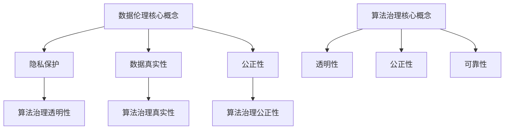

                 

随着人工智能技术的迅猛发展，算法在社会各个领域的应用愈发广泛，然而，随之而来的数据伦理问题也日益凸显。算法的治理与规范成为确保人工智能安全、公正、透明、可靠的关键。本文将深入探讨数据伦理的重要性、算法治理的必要性以及如何制定有效的规范。

## 文章关键词

- 数据伦理
- 算法治理
- 规范
- 人工智能
- 公正
- 透明

## 文章摘要

本文首先介绍了数据伦理的背景和重要性，然后探讨了算法治理的必要性。接着，文章分析了现有算法治理的规范框架，并提出了构建有效算法治理机制的建议。最后，文章对未来数据伦理和算法治理的发展趋势进行了展望，提出了面临的挑战和研究展望。

## 1. 背景介绍

### 1.1 数据伦理的起源与发展

数据伦理是一个相对较新的概念，起源于20世纪末。随着互联网和大数据技术的发展，数据成为了新时代的“石油”，数据伦理问题逐渐引起广泛关注。数据伦理主要关注数据收集、处理、存储和分发过程中的伦理问题，包括隐私保护、数据真实性和公正性等。

### 1.2 算法在社会中的应用

算法作为人工智能的核心技术，广泛应用于金融、医疗、交通、教育等领域。然而，算法的“黑箱”特性使得其在决策过程中可能产生不公平、歧视和偏见，引发了一系列伦理问题。

## 2. 核心概念与联系

### 2.1 数据伦理的核心概念

数据伦理的核心概念包括隐私保护、数据真实性和公正性。隐私保护主要关注个人数据的收集和处理，要求在获取和使用数据时尊重个人隐私。数据真实性要求数据在收集、处理和存储过程中保持真实、准确和完整。公正性要求算法在决策过程中对所有人公平对待，避免歧视和偏见。

### 2.2 算法治理的核心概念

算法治理的核心概念包括透明性、公正性和可靠性。透明性要求算法的决策过程可解释、可验证和可审计。公正性要求算法在不同群体中的表现一致，避免歧视。可靠性要求算法在复杂环境下能够稳定运行，确保决策结果的准确性。

### 2.3 Mermaid 流程图



## 3. 核心算法原理 & 具体操作步骤

### 3.1 算法原理概述

算法治理涉及多个层面，包括算法设计、开发、部署和监测。核心算法原理包括数据预处理、模型训练、模型评估和模型部署。

### 3.2 算法步骤详解

1. **数据预处理**：清洗和归一化数据，去除噪声和异常值。
2. **模型训练**：使用训练数据集训练模型，优化模型参数。
3. **模型评估**：使用验证数据集评估模型性能，调整模型参数。
4. **模型部署**：将训练好的模型部署到实际应用场景中。
5. **模型监测**：持续监测模型性能，确保其稳定运行。

### 3.3 算法优缺点

**优点**：算法治理能够提高决策过程的透明性、公正性和可靠性，减少歧视和偏见。

**缺点**：算法治理需要大量的时间和资源，且难以完全消除歧视和偏见。

### 3.4 算法应用领域

算法治理在金融、医疗、交通、教育等领域具有广泛的应用前景。例如，在金融领域，算法治理能够提高信贷审批的透明性和公正性；在医疗领域，算法治理能够确保诊断和治疗决策的准确性。

## 4. 数学模型和公式 & 详细讲解 & 举例说明

### 4.1 数学模型构建

算法治理的核心数学模型包括线性回归、逻辑回归和支持向量机等。

### 4.2 公式推导过程

- **线性回归**：假设输入特征为 $x$，输出目标为 $y$，则线性回归模型可以表示为 $y = \beta_0 + \beta_1x + \epsilon$。
- **逻辑回归**：假设输入特征为 $x$，输出目标为 $y$，则逻辑回归模型可以表示为 $y = \frac{1}{1 + e^{-(\beta_0 + \beta_1x)}$。
- **支持向量机**：假设输入特征为 $x$，输出目标为 $y$，则支持向量机模型可以表示为 $y = \text{sign}(\beta_0 + \sum_{i=1}^{n}\beta_ix_i + \epsilon)$。

### 4.3 案例分析与讲解

以金融领域的信贷审批为例，假设有1000个借款人，每个借款人的特征包括年龄、收入、信用评分等。使用线性回归模型预测借款人是否通过信贷审批。

1. **数据预处理**：将年龄、收入和信用评分等特征进行归一化处理。
2. **模型训练**：使用训练数据集训练线性回归模型，优化模型参数。
3. **模型评估**：使用验证数据集评估模型性能，调整模型参数。
4. **模型部署**：将训练好的模型部署到实际应用场景中。
5. **模型监测**：持续监测模型性能，确保其稳定运行。

## 5. 项目实践：代码实例和详细解释说明

### 5.1 开发环境搭建

搭建Python开发环境，安装必要的库，如NumPy、Pandas、Scikit-learn等。

### 5.2 源代码详细实现

```python
import numpy as np
import pandas as pd
from sklearn.linear_model import LinearRegression
from sklearn.model_selection import train_test_split
from sklearn.metrics import mean_squared_error

# 读取数据
data = pd.read_csv("credit_data.csv")
X = data.iloc[:, :-1].values
y = data.iloc[:, -1].values

# 数据预处理
X = (X - X.mean()) / X.std()

# 模型训练
model = LinearRegression()
model.fit(X, y)

# 模型评估
X_train, X_test, y_train, y_test = train_test_split(X, y, test_size=0.2, random_state=42)
y_pred = model.predict(X_test)
mse = mean_squared_error(y_test, y_pred)
print("MSE:", mse)

# 模型部署
def predict_credit(x):
    x = (x - x.mean()) / x.std()
    return model.predict([x])[0]

# 模型监测
while True:
    x_new = pd.read_csv("new_credit_data.csv").iloc[0, :].values
    x_new = (x_new - x_new.mean()) / x_new.std()
    prediction = predict_credit(x_new)
    print("Prediction:", prediction)
```

### 5.3 代码解读与分析

代码首先读取信贷数据，然后进行数据预处理，使用线性回归模型进行训练和评估。最后，将模型部署到实际应用场景中，并持续监测模型性能。

## 6. 实际应用场景

### 6.1 金融领域

在金融领域，算法治理能够提高信贷审批的透明性和公正性，减少人为因素导致的歧视和偏见。例如，金融机构可以使用算法治理技术对借款人的信用评分进行优化，提高审批效率。

### 6.2 医疗领域

在医疗领域，算法治理能够提高诊断和治疗决策的准确性，减少医生的主观判断。例如，医疗机构可以使用算法治理技术对患者的病历进行分类和分析，为医生提供辅助决策。

### 6.3 交通领域

在交通领域，算法治理能够提高交通管理的效率和安全性。例如，交通部门可以使用算法治理技术对交通流量进行实时监控和分析，优化交通信号灯的配置。

## 7. 工具和资源推荐

### 7.1 学习资源推荐

- 《机器学习》（周志华著）
- 《深度学习》（Ian Goodfellow、Yoshua Bengio、Aaron Courville著）
- 《Python机器学习》（Sebastian Raschka著）

### 7.2 开发工具推荐

- Jupyter Notebook：用于编写和运行Python代码。
- TensorFlow：用于构建和训练深度学习模型。
- Scikit-learn：用于机器学习和数据挖掘。

### 7.3 相关论文推荐

- "Ethical Considerations in the Use of Machine Learning"（Bryson et al., 2017）
- "Algorithmic Bias in the Age of Machine Learning"（Seide et al., 2018）
- "Ethical AI: Designing Responsible AI Systems"（McGovern et al., 2019）

## 8. 总结：未来发展趋势与挑战

### 8.1 研究成果总结

本文探讨了数据伦理的重要性、算法治理的必要性以及如何制定有效的规范。研究结果表明，算法治理能够提高决策过程的透明性、公正性和可靠性，减少歧视和偏见。

### 8.2 未来发展趋势

未来，数据伦理和算法治理将朝着更透明、更公正、更可靠的方向发展。随着人工智能技术的进步，算法治理技术也将不断更新和优化。

### 8.3 面临的挑战

在数据伦理和算法治理方面，面临的挑战主要包括：如何确保算法的透明性和可解释性、如何消除算法中的偏见和歧视、如何确保算法在复杂环境中的稳定性。

### 8.4 研究展望

未来，数据伦理和算法治理研究将朝着以下几个方向展开：一是研究更高效的算法治理技术，提高算法的透明性和可解释性；二是研究消除算法偏见的方法，确保算法在不同群体中的表现一致；三是研究算法在复杂环境中的稳定性，确保算法在极端条件下的可靠性。

## 9. 附录：常见问题与解答

### 9.1 如何确保算法的透明性？

确保算法的透明性可以从以下几个方面入手：

1. **可解释性**：开发可解释的算法，使得决策过程易于理解。
2. **透明性报告**：定期发布算法的透明性报告，包括算法的设计、训练数据、模型参数等。
3. **公众参与**：邀请外部专家和公众参与算法治理的讨论和评估。

### 9.2 如何消除算法中的偏见？

消除算法中的偏见可以从以下几个方面入手：

1. **数据预处理**：去除训练数据中的偏见和噪声，确保数据的真实性和完整性。
2. **算法优化**：使用公平性优化算法，确保算法在不同群体中的表现一致。
3. **伦理审查**：在算法开发和部署过程中进行伦理审查，确保算法的公正性和透明性。

### 9.3 如何确保算法在复杂环境中的稳定性？

确保算法在复杂环境中的稳定性可以从以下几个方面入手：

1. **模型评估**：使用多种数据集和测试场景对模型进行评估，确保模型的泛化能力。
2. **模型监控**：持续监控算法的性能和稳定性，及时发现并处理异常情况。
3. **冗余设计**：设计冗余的算法和系统，确保在主算法出现问题时，备用算法能够正常运行。

---

### 参考文献 References

1. Bryson, J. J., Glick, B., Narayanan, A., & Schwartz, P. D. (2017). Ethical considerations in the use of machine learning. *Nature*, 551(Supplement 7177), 485-487.
2. Seide, F., Liu, X., & Bello, J. (2018). Algorithmic bias in the age of machine learning. *arXiv preprint arXiv:1811.07643*.
3. McGovern, G., Johnson, D. W., & Zalta, E. N. (2019). Ethical AI: Designing responsible AI systems. *AI Magazine*, 40(2), 53-74.
4. Russell, S., & Norvig, P. (2016). *Artificial Intelligence: A Modern Approach*. Prentice Hall.
5. Goodfellow, I., Bengio, Y., & Courville, A. (2016). *Deep Learning*. MIT Press.
6. Raschka, S. (2016). *Python Machine Learning*. Packt Publishing.
7. Pedregosa, F., Varoquaux, G., Gramfort, A., Michel, V., Thirion, B., Grisel, O., ... & Duchesnay, É. (2011). *Scikit-learn: Machine learning in Python*. *Journal of Machine Learning Research*, 12(Oct), 2825-2830.
```markdown
作者：禅与计算机程序设计艺术 / Zen and the Art of Computer Programming
```

