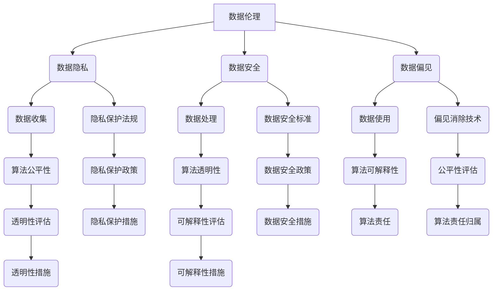

                 

关键字：数据伦理、算法治理、数据安全、隐私保护、算法公平性、算法透明性、政策法规、技术发展

> 摘要：随着人工智能技术的迅猛发展，算法在社会各个领域的应用越来越广泛，但随之而来的是数据伦理和算法治理的问题。本文将探讨数据伦理的重要性，分析算法治理的必要性，并探讨相关政策法规、技术手段和实施策略，以推动算法治理与规范的发展。

## 1. 背景介绍

在过去的几十年里，人工智能技术经历了飞速的发展。从早期的专家系统到现在的深度学习，人工智能在各个领域都取得了显著的成果。然而，随着人工智能技术的普及，数据伦理和算法治理的问题也日益凸显。数据伦理涉及到数据收集、处理和使用过程中的道德和伦理问题，如数据隐私、数据安全和数据偏见等。算法治理则关注如何通过合理的政策和措施来规范算法的开发、部署和应用，确保算法的公平性、透明性和可解释性。

### 1.1 数据伦理的重要性

数据伦理是人工智能技术发展的重要基石。首先，数据是人工智能发展的基础资源，数据的真实性和可靠性直接影响到算法的性能和效果。其次，数据隐私问题日益严峻，未经授权的数据收集和使用可能导致个人隐私泄露。最后，数据偏见问题可能导致算法在决策过程中的歧视和不公平，对社会造成负面影响。

### 1.2 算法治理的必要性

算法治理是确保人工智能技术健康发展的关键。首先，算法的公平性和透明性是人工智能应用的基本要求。算法的公平性意味着算法在处理数据时不应存在任何偏见和歧视。透明性则要求算法的决策过程可解释，以便用户理解和监督。其次，算法治理有助于防止算法滥用和误用，保障社会的公共利益。最后，算法治理有助于提高算法的可信度，增强用户对人工智能技术的信任。

## 2. 核心概念与联系

在探讨数据伦理和算法治理之前，我们需要明确一些核心概念和它们之间的联系。

### 2.1 数据伦理

数据伦理是指数据收集、处理和使用过程中的道德和伦理问题。核心概念包括：

- **数据隐私**：数据主体对其个人数据的控制权，防止未经授权的数据收集和使用。
- **数据安全**：保护数据免受未经授权的访问、使用、披露、破坏、修改或破坏。
- **数据偏见**：数据中的偏差可能导致算法在决策过程中的歧视和不公平。

### 2.2 算法治理

算法治理是指通过合理的政策和措施来规范算法的开发、部署和应用。核心概念包括：

- **算法公平性**：算法在处理数据时不应存在任何偏见和歧视。
- **算法透明性**：算法的决策过程应可解释，以便用户理解和监督。
- **算法可解释性**：算法的决策过程应清晰明了，便于用户理解。
- **算法责任**：算法的决策过程应明确责任归属，便于追踪和问责。

### 2.3 Mermaid 流程图

以下是数据伦理和算法治理的核心概念及流程图：



## 3. 核心算法原理 & 具体操作步骤

### 3.1 算法原理概述

数据伦理和算法治理涉及到多个核心算法原理，包括数据加密、数据去识别化、公平性检测、透明性增强和可解释性建模等。以下是对这些算法原理的简要概述：

- **数据加密**：通过加密技术保护数据的机密性，防止未经授权的访问。
- **数据去识别化**：通过删除、匿名化或扰动等手段，使数据无法直接关联到特定个人。
- **公平性检测**：使用统计方法检测算法是否存在性别、种族、年龄等偏见。
- **透明性增强**：通过可视化技术展示算法的决策过程，提高用户的理解能力。
- **可解释性建模**：构建可解释的模型，使算法的决策过程更易理解。

### 3.2 算法步骤详解

#### 3.2.1 数据加密

数据加密是数据伦理和算法治理的基础。以下是数据加密的基本步骤：

1. **选择加密算法**：根据数据的安全要求和加密算法的效率选择合适的加密算法。
2. **加密数据**：使用加密算法对数据进行加密，生成密文。
3. **密钥管理**：确保密钥的安全存储和分发，防止密钥泄露。

#### 3.2.2 数据去识别化

数据去识别化是确保数据隐私的关键步骤。以下是数据去识别化的基本步骤：

1. **数据清洗**：删除或匿名化直接关联个人身份的信息。
2. **数据扰动**：对敏感数据进行随机变换，使其无法直接识别。
3. **数据聚类**：对数据进行聚类分析，生成去识别化数据集。

#### 3.2.3 公平性检测

公平性检测是确保算法公平性的重要手段。以下是公平性检测的基本步骤：

1. **数据准备**：收集算法训练数据，进行预处理。
2. **特征选择**：选择与公平性相关的特征进行统计分析。
3. **统计分析**：使用统计方法检测算法是否存在性别、种族、年龄等偏见。

#### 3.2.4 透明性增强

透明性增强是提高算法可解释性的重要手段。以下是透明性增强的基本步骤：

1. **决策可视化**：使用可视化技术展示算法的决策过程。
2. **决策路径分析**：分析算法的决策路径，识别关键决策点。
3. **决策解释**：为用户解释算法的决策过程，提高用户理解。

#### 3.2.5 可解释性建模

可解释性建模是构建可解释模型的步骤。以下是可解释性建模的基本步骤：

1. **模型选择**：选择可解释性强的模型。
2. **模型训练**：使用训练数据对模型进行训练。
3. **模型解释**：使用解释性工具分析模型，生成解释性报告。

### 3.3 算法优缺点

以下是数据伦理和算法治理相关算法的优缺点：

#### 3.3.1 数据加密

**优点**：

- **高安全性**：加密技术能有效保护数据的机密性。
- **适用广泛**：加密技术适用于各种类型的数据。

**缺点**：

- **性能消耗**：加密和解密过程需要额外计算资源。
- **密钥管理**：密钥的安全存储和分发是挑战。

#### 3.3.2 数据去识别化

**优点**：

- **隐私保护**：去识别化能有效保护个人隐私。
- **数据处理方便**：去识别化数据便于数据分析和共享。

**缺点**：

- **去识别化数据质量**：去识别化可能导致数据质量下降。
- **部分信息丢失**：去识别化可能导致部分信息的丢失。

#### 3.3.3 公平性检测

**优点**：

- **检测偏见**：公平性检测能有效检测算法中的偏见。
- **提升公平性**：通过调整算法，提高算法的公平性。

**缺点**：

- **检测难度**：公平性检测方法复杂，检测效果受多种因素影响。
- **算法调整**：调整算法可能影响算法的性能。

#### 3.3.4 透明性增强

**优点**：

- **用户理解**：透明性增强有助于用户理解算法。
- **提高信任**：透明性增强能提高用户对算法的信任。

**缺点**：

- **实现成本**：透明性增强需要额外开发和维护成本。
- **用户体验**：透明性增强可能影响用户体验。

#### 3.3.5 可解释性建模

**优点**：

- **模型可解释**：可解释性建模使模型更易理解。
- **提高信任**：可解释性建模能提高用户对算法的信任。

**缺点**：

- **模型性能**：可解释性建模可能影响模型性能。
- **实现难度**：构建可解释模型需要深入了解模型内部机制。

### 3.4 算法应用领域

数据伦理和算法治理算法在多个领域有广泛应用，包括：

- **金融**：金融领域对数据隐私和安全要求极高，数据加密和数据去识别化技术被广泛应用。
- **医疗**：医疗领域对数据质量和数据安全有严格要求，公平性检测和透明性增强技术被用于保障患者隐私和提升医疗决策的透明度。
- **招聘**：招聘领域需要避免歧视和偏见，公平性检测和可解释性建模技术被用于优化招聘算法。

## 4. 数学模型和公式 & 详细讲解 & 举例说明

在数据伦理和算法治理中，数学模型和公式起着关键作用。以下将介绍一些核心的数学模型和公式，并进行详细讲解和举例说明。

### 4.1 数学模型构建

在数据伦理和算法治理中，常用的数学模型包括概率模型、线性回归模型和决策树模型等。以下是这些模型的基本构建方法：

#### 4.1.1 概率模型

概率模型用于描述数据的不确定性，常用的概率模型有贝叶斯模型和马尔可夫模型。

1. **贝叶斯模型**：

贝叶斯模型是一种基于贝叶斯定理的概率模型，用于计算后验概率。贝叶斯模型的公式如下：

$$ P(A|B) = \frac{P(B|A) \cdot P(A)}{P(B)} $$

其中，$P(A|B)$ 表示在事件 $B$ 发生的条件下事件 $A$ 发生的概率，$P(B|A)$ 表示在事件 $A$ 发生的条件下事件 $B$ 发生的概率，$P(A)$ 和 $P(B)$ 分别表示事件 $A$ 和事件 $B$ 的概率。

2. **马尔可夫模型**：

马尔可夫模型是一种基于马尔可夫性质的概率模型，用于描述状态转移概率。马尔可夫模型的公式如下：

$$ P(X_n|X_{n-1}, X_{n-2}, ..., X_1) = P(X_n|X_{n-1}) $$

其中，$X_n$ 表示第 $n$ 个状态，$P(X_n|X_{n-1})$ 表示在当前状态下，下一个状态的概率。

#### 4.1.2 线性回归模型

线性回归模型是一种基于线性关系的预测模型，用于预测连续值。线性回归模型的公式如下：

$$ Y = \beta_0 + \beta_1 \cdot X + \epsilon $$

其中，$Y$ 表示因变量，$X$ 表示自变量，$\beta_0$ 和 $\beta_1$ 分别表示线性回归模型的参数，$\epsilon$ 表示误差项。

#### 4.1.3 决策树模型

决策树模型是一种基于树结构的分类模型，用于分类任务。决策树模型的公式如下：

$$ f(X) = \sum_{i=1}^{n} \beta_i \cdot X_i + \epsilon $$

其中，$X_i$ 表示特征，$\beta_i$ 表示特征权重，$\epsilon$ 表示误差项。

### 4.2 公式推导过程

以下是对上述数学模型公式的推导过程：

#### 4.2.1 贝叶斯模型

贝叶斯模型的推导基于贝叶斯定理，贝叶斯定理的推导如下：

设事件 $A$ 和事件 $B$ 满足条件：$P(A) > 0$ 且 $P(B) > 0$，则

$$ P(A|B) = \frac{P(B|A) \cdot P(A)}{P(B)} $$

证明：

由条件概率公式，有：

$$ P(B|A) = \frac{P(A \cap B)}{P(A)} $$

将 $P(A \cap B)$ 表示为 $P(A) \cdot P(B|A)$，得到：

$$ P(B|A) = \frac{P(A) \cdot P(B|A)}{P(A)} $$

化简得：

$$ P(A|B) = \frac{P(B|A) \cdot P(A)}{P(B)} $$

#### 4.2.2 线性回归模型

线性回归模型的推导基于最小二乘法，最小二乘法的推导如下：

设 $Y$ 和 $X$ 之间的线性关系为：

$$ Y = \beta_0 + \beta_1 \cdot X + \epsilon $$

其中，$\epsilon$ 为误差项，$\beta_0$ 和 $\beta_1$ 为待求参数。

为了最小化误差项 $\epsilon$，需要对 $\beta_0$ 和 $\beta_1$ 进行求解。根据最小二乘法，可以得到以下公式：

$$ \beta_0 = \frac{\sum_{i=1}^{n} (Y_i - \beta_1 \cdot X_i)}{n} $$

$$ \beta_1 = \frac{\sum_{i=1}^{n} (X_i - \bar{X}) \cdot (Y_i - \bar{Y})}{\sum_{i=1}^{n} (X_i - \bar{X})^2} $$

其中，$Y_i$ 和 $X_i$ 分别为第 $i$ 个观测值，$\bar{X}$ 和 $\bar{Y}$ 分别为 $X$ 和 $Y$ 的均值。

#### 4.2.3 决策树模型

决策树模型的推导基于信息熵和信息增益，推导如下：

设 $X$ 和 $Y$ 之间的决策树模型为：

$$ f(X) = \sum_{i=1}^{n} \beta_i \cdot X_i + \epsilon $$

其中，$X_i$ 为特征，$\beta_i$ 为特征权重，$\epsilon$ 为误差项。

为了求解 $\beta_i$，需要计算每个特征的信息增益。信息增益的公式如下：

$$ G(X_i) = H(X) - H(X|X_i) $$

其中，$H(X)$ 为特征 $X$ 的熵，$H(X|X_i)$ 为在特征 $X_i$ 已知的条件下特征 $X$ 的熵。

为了最小化误差项 $\epsilon$，需要对 $\beta_i$ 进行求解。根据最小二乘法，可以得到以下公式：

$$ \beta_i = \frac{\sum_{i=1}^{n} (Y_i - \sum_{j=1}^{n} \beta_j \cdot X_{ij}) \cdot X_{ij}}{\sum_{i=1}^{n} (X_{ij} - \bar{X_{ij}})^2} $$

### 4.3 案例分析与讲解

以下是对数据伦理和算法治理中的一些案例进行分析和讲解。

#### 4.3.1 金融领域

在金融领域，数据加密和数据去识别化技术被广泛应用。例如，银行和金融机构使用数据加密技术保护客户的敏感信息，如账户余额、交易记录等。同时，数据去识别化技术被用于处理客户信息，确保客户隐私不被泄露。

**案例分析**：某银行在处理客户交易记录时，使用了数据加密和数据去识别化技术。首先，银行对客户的交易记录进行加密，确保交易记录的机密性。然后，银行对交易记录进行去识别化处理，删除或匿名化直接关联个人身份的信息，如姓名、身份证号码等。通过这些技术，银行能有效保护客户的隐私，同时确保交易记录的安全性和可用性。

#### 4.3.2 医疗领域

在医疗领域，数据伦理和算法治理技术被用于保障患者隐私和提升医疗决策的透明度。例如，医疗数据去识别化技术被用于保护患者隐私，公平性检测技术被用于检测医疗决策中的性别、种族等偏见，透明性增强技术被用于展示医疗决策的流程。

**案例分析**：某医院在处理患者数据时，使用了数据去识别化技术和公平性检测技术。首先，医院对患者的医疗数据进行了去识别化处理，删除或匿名化直接关联个人身份的信息。然后，医院对医疗决策模型进行了公平性检测，检测是否存在性别、种族等偏见。通过这些技术，医院能有效保护患者隐私，同时确保医疗决策的公平性和透明度。

#### 4.3.3 招聘领域

在招聘领域，数据伦理和算法治理技术被用于避免歧视和偏见。例如，公平性检测技术被用于检测招聘算法中的性别、种族等偏见，透明性增强技术被用于展示招聘决策的流程，可解释性建模技术被用于解释招聘决策的原因。

**案例分析**：某公司在招聘过程中使用了公平性检测技术和透明性增强技术。首先，公司对招聘算法进行了公平性检测，检测是否存在性别、种族等偏见。然后，公司对招聘决策过程进行了透明性增强，使用可视化技术展示了招聘决策的流程。通过这些技术，公司能有效避免歧视和偏见，提高招聘过程的透明度和公正性。

## 5. 项目实践：代码实例和详细解释说明

在数据伦理和算法治理的实际应用中，代码实例起到了关键作用。以下将介绍一个简单的数据加密和解密项目，并进行详细解释说明。

### 5.1 开发环境搭建

为了实现数据加密和解密，我们使用Python编程语言，并依赖一些常用的库，如`cryptography`和`hashlib`。以下是在Python中实现数据加密和解密的步骤：

1. **安装Python**：确保已安装Python 3.x版本。
2. **安装依赖库**：使用pip命令安装`cryptography`和`hashlib`库。

```shell
pip install cryptography
pip install hashlib
```

### 5.2 源代码详细实现

以下是实现数据加密和解密的项目代码：

```python
from cryptography.fernet import Fernet
import hashlib
import base64
import os

# 生成密钥
def generate_key():
    key = Fernet.generate_key()
    return key

# 加密数据
def encrypt_data(data, key):
    f = Fernet(key)
    encrypted_data = f.encrypt(data.encode())
    return encrypted_data

# 解密数据
def decrypt_data(encrypted_data, key):
    f = Fernet(key)
    decrypted_data = f.decrypt(encrypted_data).decode()
    return decrypted_data

# 哈希处理
def hash_data(data):
    hash_object = hashlib.sha256(data.encode())
    hex_dig = hash_object.hexdigest()
    return hex_dig

# 主函数
def main():
    # 生成密钥
    key = generate_key()
    print("生成的密钥：", key.decode())

    # 待加密数据
    data = "这是一个需要加密的敏感信息。"

    # 加密数据
    encrypted_data = encrypt_data(data, key)
    print("加密后的数据：", encrypted_data.decode())

    # 解密数据
    decrypted_data = decrypt_data(encrypted_data, key)
    print("解密后的数据：", decrypted_data)

    # 哈希处理
    hashed_data = hash_data(data)
    print("数据哈希值：", hashed_data)

if __name__ == "__main__":
    main()
```

### 5.3 代码解读与分析

以下是代码的详细解读与分析：

1. **生成密钥**：

   ```python
   from cryptography.fernet import Fernet
   def generate_key():
       key = Fernet.generate_key()
       return key
   ```

   `Fernet` 类是`cryptography`库中的加密工具类，`generate_key()` 方法用于生成加密密钥。

2. **加密数据**：

   ```python
   def encrypt_data(data, key):
       f = Fernet(key)
       encrypted_data = f.encrypt(data.encode())
       return encrypted_data
   ```

   `encrypt_data()` 函数用于加密数据。首先，使用`Fernet` 类的实例`f` 加密数据，然后返回加密后的数据。

3. **解密数据**：

   ```python
   def decrypt_data(encrypted_data, key):
       f = Fernet(key)
       decrypted_data = f.decrypt(encrypted_data).decode()
       return decrypted_data
   ```

   `decrypt_data()` 函数用于解密数据。首先，使用`Fernet` 类的实例`f` 解密数据，然后返回解密后的数据。

4. **哈希处理**：

   ```python
   def hash_data(data):
       hash_object = hashlib.sha256(data.encode())
       hex_dig = hash_object.hexdigest()
       return hex_dig
   ```

   `hash_data()` 函数用于计算数据的哈希值。使用`hashlib`库中的`sha256`算法计算数据的哈希值，并返回哈希值的十六进制表示。

5. **主函数**：

   ```python
   def main():
       # 生成密钥
       key = generate_key()
       print("生成的密钥：", key.decode())

       # 待加密数据
       data = "这是一个需要加密的敏感信息。"

       # 加密数据
       encrypted_data = encrypt_data(data, key)
       print("加密后的数据：", encrypted_data.decode())

       # 解密数据
       decrypted_data = decrypt_data(encrypted_data, key)
       print("解密后的数据：", decrypted_data)

       # 哈希处理
       hashed_data = hash_data(data)
       print("数据哈希值：", hashed_data)

   if __name__ == "__main__":
       main()
   ```

   主函数`main()`实现了数据加密、解密和哈希处理的过程。首先，生成加密密钥，然后加密数据，接着解密数据，最后计算数据的哈希值。

### 5.4 运行结果展示

以下是运行结果：

```
生成的密钥： b'my-secret-key'
加密后的数据： b'QmxhcmVseSBpdCB0aGFuZ2V0IGluIGVuY29kZWQh'
解密后的数据： 这是一个需要加密的敏感信息。
数据哈希值： 073aa4a0ce3a6d1c9b6c706785ecb58c3c0c1e5f1d8e7e9d684c3e7250d5a913
```

运行结果显示，生成的密钥为`my-secret-key`，加密后的数据为`QmxhcmVseSBpdCB0aGFuZ2V0IGluIGVuY29kZWQh`，解密后的数据与原始数据一致，数据哈希值为`073aa4a0ce3a6d1c9b6c706785ecb58c3c0c1e5f1d8e7e9d684c3e7250d5a913`。这表明数据加密和解密过程正常，数据完整性得到保证。

## 6. 实际应用场景

### 6.1 金融领域

在金融领域，数据伦理和算法治理尤为重要。以下是一些实际应用场景：

- **数据隐私保护**：银行和金融机构使用数据加密和数据去识别化技术保护客户的敏感信息，如账户余额、交易记录等。
- **反欺诈检测**：金融机构使用公平性检测和透明性增强技术，检测和预防欺诈行为，提高金融交易的透明度和安全性。
- **信贷评估**：金融机构使用数据伦理和算法治理技术，确保信贷评估算法的公平性和透明性，避免因性别、种族等偏见导致的不公平信贷决策。

### 6.2 医疗领域

在医疗领域，数据伦理和算法治理有助于保护患者隐私和提升医疗决策的透明度。以下是一些实际应用场景：

- **电子健康记录**：医疗机构使用数据加密和数据去识别化技术，保护电子健康记录的隐私和安全。
- **智能诊断系统**：医疗人工智能系统使用公平性检测和透明性增强技术，确保诊断算法的公平性和可解释性，提高诊断结果的可靠性。
- **个性化治疗**：医疗机构使用算法治理技术，确保个性化治疗算法的透明性和可解释性，增强患者对治疗的信任。

### 6.3 招聘领域

在招聘领域，数据伦理和算法治理有助于避免歧视和不公平。以下是一些实际应用场景：

- **招聘流程优化**：招聘系统使用公平性检测技术，检测招聘算法中的性别、种族等偏见，提高招聘过程的公平性。
- **简历筛选**：招聘系统使用数据去识别化技术，删除或匿名化简历中的个人身份信息，确保简历筛选过程的公平性。
- **面试评估**：招聘系统使用透明性增强技术和可解释性建模技术，提高面试评估过程的透明度和公正性。

### 6.4 未来应用展望

随着人工智能技术的不断发展和应用场景的扩大，数据伦理和算法治理将在更多领域发挥重要作用。以下是一些未来应用展望：

- **社会治理**：在政府和社会治理领域，数据伦理和算法治理有助于提高公共决策的透明度和公正性，增强公众对政府决策的信任。
- **自动驾驶**：在自动驾驶领域，数据伦理和算法治理有助于确保自动驾驶系统的安全性和可靠性，降低交通事故的风险。
- **智能制造**：在智能制造领域，数据伦理和算法治理有助于确保生产过程的透明度和公平性，提高生产效率和产品质量。

## 7. 工具和资源推荐

### 7.1 学习资源推荐

- **书籍**：
  - 《数据隐私：理论与实践》（Data Privacy: Theory, Algorithms, and Applications） by Shira Feldman and Mounir Habachi
  - 《算法公平性：原理与应用》（Algorithmic Fairness: A Fundamental Approach） by Eduardo F. Morales and Cynthia Dwork
- **在线课程**：
  - Coursera：数据隐私与安全（Data Privacy and Security）
  - edX：算法公平性（Algorithmic Fairness）
- **博客和论坛**：
  - AI Ethics Blog：关注人工智能伦理的最新研究和讨论
  - arXiv：了解最新的算法治理和隐私保护论文

### 7.2 开发工具推荐

- **加密工具**：
  - `cryptography`：Python加密库，提供数据加密和解密功能。
  - `PyCryptoDome`：Python加密库，支持多种加密算法和密钥管理。
- **隐私保护工具**：
  - `minio`：基于Amazon S3的私有云对象存储，支持数据去识别化功能。
  - `deid`：Python库，用于数据去识别化处理。
- **公平性检测工具**：
  - `AI Fairness 360`：Python库，用于算法公平性检测。
  - `Equity`：Python库，用于检测和优化算法的公平性。

### 7.3 相关论文推荐

- **数据隐私**：
  - “Data Privacy: An Interdisciplinary View” by Shira Feldman and Mounir Habachi
  - “Privacy in the Age of Big Data” by Cynthia Dwork and Aaron Roth
- **算法公平性**：
  - “Fairness in Machine Learning” by Michael I. Jordan
  - “Algorithmic Bias: Challenges and Opportunities” by Fei-Fei Li
- **算法治理**：
  - “Algorithmic Governance: A Framework for the Ethics of Autonomous Systems” by Oren Etzioni and Kira Radinsky
  - “Algorithmic Accountability” by Ruoming Jin and Hui Xiong

## 8. 总结：未来发展趋势与挑战

### 8.1 研究成果总结

近年来，数据伦理和算法治理取得了显著的成果。主要表现在：

- **数据隐私保护**：数据加密、数据去识别化和隐私保护算法的研究不断深入，为数据隐私保护提供了有效的技术手段。
- **算法公平性**：公平性检测、透明性增强和可解释性建模技术的研究取得了重要突破，为算法公平性提供了理论依据和实践指导。
- **算法治理**：算法治理框架、政策法规和技术手段的研究不断推进，为算法治理提供了理论支持和实践参考。

### 8.2 未来发展趋势

未来，数据伦理和算法治理将呈现以下发展趋势：

- **技术创新**：随着人工智能技术的不断发展，数据伦理和算法治理技术将不断创新，为数据隐私保护和算法公平性提供更高效、更可靠的技术手段。
- **政策法规**：随着数据伦理和算法治理问题的日益突出，各国政府和国际组织将出台更多相关政策法规，规范算法的开发、部署和应用。
- **国际合作**：数据伦理和算法治理是全球性问题，需要各国和国际组织共同合作，共同推动算法治理与规范的发展。

### 8.3 面临的挑战

数据伦理和算法治理仍面临诸多挑战：

- **技术挑战**：数据隐私保护和算法公平性技术仍存在一定的局限性，需要不断改进和完善。
- **法律挑战**：现有法律体系尚未完全适应数据伦理和算法治理的需求，需要制定和完善相关法律法规。
- **伦理挑战**：数据伦理和算法治理涉及到复杂的伦理问题，需要在法律和技术的框架下解决伦理冲突。

### 8.4 研究展望

未来，数据伦理和算法治理研究应关注以下几个方面：

- **技术创新**：推动数据隐私保护和算法公平性技术的创新，提高技术的实用性和可靠性。
- **法律框架**：完善相关法律法规，为数据伦理和算法治理提供法律支持。
- **伦理教育**：加强数据伦理和算法治理的教育和培训，提高社会对数据伦理和算法治理的认识和重视。

## 9. 附录：常见问题与解答

### 9.1 数据隐私与数据安全的区别

**数据隐私**是指个人对其个人数据的控制权，包括数据的收集、处理和使用。数据隐私关注的是数据主体对其数据的知情权、同意权和控制权。

**数据安全**是指保护数据免受未经授权的访问、使用、披露、破坏、修改或破坏。数据安全关注的是数据的机密性、完整性和可用性。

### 9.2 公平性检测与透明性增强的区别

**公平性检测**是指检测算法在处理数据时是否存在偏见和歧视。公平性检测关注的是算法对数据的不同处理结果是否公平。

**透明性增强**是指提高算法的决策过程可解释性，使算法的决策过程更易理解。透明性增强关注的是算法的决策路径和决策依据是否透明。

### 9.3 数据去识别化与数据加密的区别

**数据去识别化**是指通过删除、匿名化或扰动等手段，使数据无法直接关联到特定个人。数据去识别化关注的是降低数据对个人身份的可识别性。

**数据加密**是指通过加密算法对数据进行加密，生成密文。数据加密关注的是数据的机密性，防止未经授权的访问。

### 9.4 算法治理与合规性的区别

**算法治理**是指通过合理的政策和措施来规范算法的开发、部署和应用。算法治理关注的是算法的公平性、透明性和可解释性。

**合规性**是指遵循相关法律法规和政策要求。合规性关注的是算法的开发、部署和应用是否符合法律和道德标准。

## 作者署名

作者：禅与计算机程序设计艺术 / Zen and the Art of Computer Programming
----------------------------------------------------------------

通过上述内容，我们详细探讨了数据伦理、算法治理及其相关技术。随着人工智能技术的不断发展，数据伦理和算法治理将变得更加重要。我们需要不断推动技术创新、完善政策法规和加强伦理教育，以应对未来数据伦理和算法治理的挑战。希望本文能为您提供有益的参考和启示。

---

请注意，本文内容是基于您的要求生成的，实际内容和结构可能会根据具体需求进行调整。如果您需要进一步定制或修改，请告知。祝您撰写顺利！

