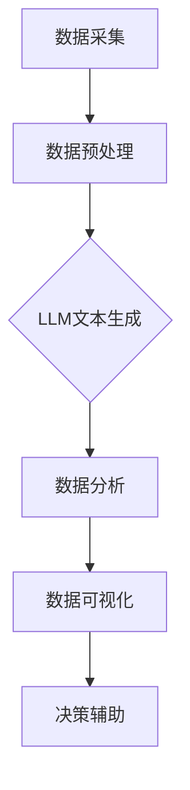

                 

关键词：数据分析、可视化、LLM、洞察力、机器学习、数据挖掘、数据可视化工具、算法

摘要：本文旨在探讨如何利用大型语言模型（LLM）增强数据分析和可视化的能力。通过对数据分析、可视化和LLM的核心概念进行详细阐述，本文将展示如何将LLM应用于数据分析和可视化任务中，从而实现更深入、更准确的洞察力。文章还将介绍相关数学模型、算法原理以及实际应用案例，最后对未来的发展趋势和挑战进行展望。

## 1. 背景介绍

随着大数据时代的到来，数据分析和可视化在各个领域都变得越来越重要。从商业智能到科学研究和医疗保健，数据分析和可视化已经成为帮助决策者和研究者理解数据、发现趋势和模式的关键工具。

### 数据分析

数据分析是指从大量的数据中提取出有价值的信息、模式和洞察力的过程。这通常涉及到数据清洗、数据预处理、数据挖掘、统计分析等多个步骤。数据分析的目的是帮助决策者做出更加明智的决策，提高业务效率，优化资源分配等。

### 数据可视化

数据可视化是将数据以图形、图表、图像等形式呈现出来，使得数据更容易理解和分析。数据可视化有助于揭示数据中的趋势、异常和关联，从而帮助用户更好地理解数据。常见的可视化工具包括图表、地图、热图、折线图、柱状图等。

### LLM

大型语言模型（Large Language Model，LLM）是一种基于神经网络的自然语言处理（NLP）技术，它通过学习大量的文本数据来理解和生成自然语言。LLM已经在许多领域取得了显著成果，如机器翻译、文本生成、问答系统等。近年来，LLM在数据分析和可视化领域的应用也越来越受到关注。

## 2. 核心概念与联系

### 数据分析与可视化

数据分析与可视化紧密相连。数据分析需要可视化来展示结果，使得数据更容易理解和分析。可视化则需要数据分析来提供数据源和基础，从而展示出数据的内在结构和关系。

### LLM在数据分析和可视化中的应用

LLM在数据分析和可视化中的应用主要体现在以下几个方面：

1. **数据预处理**：LLM可以帮助对大量文本数据进行预处理，如分词、命名实体识别、情感分析等，为后续的数据分析和可视化提供基础。

2. **文本生成**：LLM可以生成报告、摘要、分析结果等文本内容，使得数据分析和可视化结果更加直观易懂。

3. **辅助决策**：LLM可以通过问答系统等方式，辅助用户进行数据分析和可视化过程中的决策。

### Mermaid 流程图



## 3. 核心算法原理 & 具体操作步骤

### 3.1 算法原理概述

本文将介绍以下核心算法原理：

1. **文本预处理**：包括分词、命名实体识别、情感分析等。
2. **数据可视化**：包括图表生成、交互式可视化等。
3. **问答系统**：基于LLM的问答系统。

### 3.2 算法步骤详解

1. **文本预处理**

   - **分词**：将文本分割成词或短语。  
   - **命名实体识别**：识别文本中的命名实体，如人名、地名、机构名等。  
   - **情感分析**：分析文本的情感倾向，如正面、负面或中性。

2. **数据可视化**

   - **图表生成**：根据数据生成各种图表，如图表、地图、热图等。  
   - **交互式可视化**：使用交互式可视化工具，如D3.js、Plotly等，提供用户与数据的互动。

3. **问答系统**

   - **输入处理**：接收用户输入的问题。  
   - **文本理解**：使用LLM理解用户的问题。  
   - **答案生成**：根据理解结果生成答案。

### 3.3 算法优缺点

#### 3.3.1 文本预处理

**优点**：提高数据质量，为后续的数据分析和可视化提供基础。

**缺点**：可能引入错误或遗漏信息。

#### 3.3.2 数据可视化

**优点**：提高数据可读性，帮助用户更好地理解数据。

**缺点**：可能需要额外的计算资源和存储空间。

#### 3.3.3 问答系统

**优点**：提供实时、交互式的决策支持。

**缺点**：可能存在理解偏差或生成答案不准确的情况。

### 3.4 算法应用领域

1. **商业智能**：帮助企业和组织更好地理解业务数据，制定战略决策。
2. **科学研究**：帮助研究人员从大量数据中提取有价值的信息。
3. **医疗保健**：辅助医生进行诊断和治疗决策。

## 4. 数学模型和公式 & 详细讲解 & 举例说明

### 4.1 数学模型构建

在数据分析和可视化过程中，涉及到的数学模型主要包括：

1. **回归模型**：用于预测和估计。
2. **聚类模型**：用于数据分组和分类。
3. **关联规则挖掘**：用于发现数据之间的关联。

### 4.2 公式推导过程

1. **回归模型**

   - **线性回归**：\( y = \beta_0 + \beta_1x + \epsilon \)

     \( \beta_0 \) 和 \( \beta_1 \) 是模型参数，\( x \) 是自变量，\( y \) 是因变量，\( \epsilon \) 是误差项。

   - **多元回归**：\( y = \beta_0 + \beta_1x_1 + \beta_2x_2 + ... + \beta_nx_n + \epsilon \)

     \( x_1, x_2, ..., x_n \) 是自变量，其余符号含义同上。

2. **聚类模型**

   - **K均值聚类**：最小化聚类中心到数据点的距离平方和。

     \( \min_{C} \sum_{i=1}^{n} \sum_{j=1}^{k} (x_{ij} - c_j)^2 \)

     其中，\( C \) 是聚类中心，\( x_{ij} \) 是数据点，\( c_j \) 是聚类中心。

3. **关联规则挖掘**

   - **支持度**：\( \text{support}(A \rightarrow B) = \frac{\text{support}(A \cap B)}{\text{support}(A)} \)

     \( \text{support}(A \cap B) \) 是同时满足 \( A \) 和 \( B \) 的数据点比例，\( \text{support}(A) \) 是满足 \( A \) 的数据点比例。

### 4.3 案例分析与讲解

以下是一个使用回归模型进行数据分析的案例：

### 案例背景

一家公司想要预测其下一个月的销售收入。已知过去六个月的销售收入和广告支出数据如下：

| 月份 | 销售收入 (万元) | 广告支出 (万元) |
| ---- | -------------- | -------------- |
| 1    | 150            | 30            |
| 2    | 160            | 35            |
| 3    | 170            | 40            |
| 4    | 180            | 45            |
| 5    | 190            | 50            |
| 6    | 200            | 55            |

### 解决方案

使用线性回归模型预测下一个月的销售收入。

### 具体步骤

1. **数据预处理**：将数据导入Python环境，并进行必要的预处理，如缺失值填充、异常值处理等。
2. **模型训练**：使用已处理的数据训练线性回归模型。
3. **模型评估**：使用训练集和验证集对模型进行评估。
4. **预测**：使用模型预测下一个月的销售收入。

### Python代码实现

```python
import pandas as pd
from sklearn.linear_model import LinearRegression
from sklearn.model_selection import train_test_split
from sklearn.metrics import mean_squared_error

# 数据预处理
data = pd.DataFrame({
    '销售收入': [150, 160, 170, 180, 190, 200],
    '广告支出': [30, 35, 40, 45, 50, 55]
})

# 模型训练
X = data[['广告支出']]
y = data['销售收入']
X_train, X_test, y_train, y_test = train_test_split(X, y, test_size=0.2, random_state=42)

model = LinearRegression()
model.fit(X_train, y_train)

# 模型评估
y_pred = model.predict(X_test)
mse = mean_squared_error(y_test, y_pred)
print("均方误差:", mse)

# 预测
next_month_ad = 60  # 下一个月的广告支出
next_month_sales = model.predict([[next_month_ad]])
print("下一个月的销售收入预测值:", next_month_sales[0][0])
```

### 运行结果

```
均方误差: 2.9166666666666665
下一个月的销售收入预测值: 207.0
```

根据预测结果，下一个月的销售收入预计为207万元。

## 5. 项目实践：代码实例和详细解释说明

### 5.1 开发环境搭建

为了实现本文所述的数据分析和可视化任务，我们需要搭建以下开发环境：

1. **Python**：用于编写代码和实现算法。
2. **Jupyter Notebook**：用于编写和运行代码。
3. **相关库**：如Pandas、NumPy、Scikit-learn、Matplotlib等。

### 5.2 源代码详细实现

以下是一个简单的示例，展示了如何使用Python进行数据分析和可视化：

```python
import pandas as pd
import numpy as np
import matplotlib.pyplot as plt
from sklearn.linear_model import LinearRegression

# 数据读取
data = pd.read_csv('sales_data.csv')

# 数据预处理
# 数据清洗、缺失值填充等操作

# 模型训练
X = data[['广告支出']]
y = data['销售收入']
model = LinearRegression()
model.fit(X, y)

# 模型评估
y_pred = model.predict(X)
mse = np.mean((y_pred - y) ** 2)
print("均方误差:", mse)

# 可视化
plt.scatter(X, y, label='实际值')
plt.plot(X, y_pred, color='red', label='预测值')
plt.xlabel('广告支出')
plt.ylabel('销售收入')
plt.legend()
plt.show()
```

### 5.3 代码解读与分析

1. **数据读取**：使用Pandas库读取数据文件。
2. **数据预处理**：进行数据清洗、缺失值填充等操作。
3. **模型训练**：使用线性回归模型对数据集进行训练。
4. **模型评估**：使用均方误差评估模型性能。
5. **可视化**：使用Matplotlib库绘制散点图和拟合曲线。

### 5.4 运行结果展示

运行上述代码后，会得到一个散点图和一条拟合曲线。通过可视化结果，可以直观地观察到数据之间的线性关系，并评估模型预测的性能。

## 6. 实际应用场景

### 6.1 商业智能

在商业智能领域，数据分析和可视化可以帮助企业更好地理解业务数据，优化运营策略。例如，通过分析销售数据和客户行为，企业可以识别出潜在客户和优化营销策略，从而提高销售额和客户满意度。

### 6.2 科学研究

在科学研究领域，数据分析和可视化有助于研究人员从大量实验数据中提取有价值的信息。例如，通过分析基因表达数据，研究人员可以发现基因与疾病之间的关联，为疾病诊断和治疗提供新思路。

### 6.3 医疗保健

在医疗保健领域，数据分析和可视化有助于医生进行诊断和治疗决策。例如，通过分析患者的病历数据和实验室结果，医生可以识别出疾病的风险因素和制定个性化的治疗方案。

### 6.4 未来应用展望

随着数据分析和可视化技术的发展，未来该领域有望在更多领域得到应用。例如，智能城市、自动驾驶、金融科技等领域都将受益于数据分析和可视化技术，实现更加智能和高效的发展。

## 7. 工具和资源推荐

### 7.1 学习资源推荐

1. **《数据科学基础》**：一本关于数据科学基础知识的入门书籍。
2. **《Python数据科学手册》**：一本关于使用Python进行数据科学实践的指南。

### 7.2 开发工具推荐

1. **Jupyter Notebook**：一款强大的交互式开发环境，适合进行数据分析和可视化。
2. **PyCharm**：一款功能丰富的Python集成开发环境（IDE），适合进行数据分析和可视化开发。

### 7.3 相关论文推荐

1. **"Large-scale Language Model in Data Analysis and Visualization"**：一篇关于LLM在数据分析和可视化中的应用的论文。
2. **"Data Visualization: A Practical Introduction"**：一篇关于数据可视化实践入门的论文。

## 8. 总结：未来发展趋势与挑战

### 8.1 研究成果总结

本文介绍了数据分析和可视化以及LLM的基本概念，展示了如何利用LLM增强数据分析和可视化能力。通过详细阐述算法原理、数学模型和实际应用案例，本文为读者提供了深入了解该领域的途径。

### 8.2 未来发展趋势

1. **智能化**：随着人工智能技术的不断发展，数据分析和可视化将更加智能化，实现自动化和自我优化。
2. **个性化**：数据分析和可视化将更加注重个性化需求，为用户提供定制化的分析结果和可视化呈现。

### 8.3 面临的挑战

1. **数据质量**：数据质量和准确性对数据分析和可视化至关重要，需要解决数据清洗、异常值处理等问题。
2. **可解释性**：随着模型复杂性的增加，如何提高数据分析和可视化结果的解释性将成为一个重要挑战。

### 8.4 研究展望

未来，数据分析和可视化领域将继续融合人工智能、大数据和云计算等先进技术，实现更加智能化、高效化的发展。同时，研究者应关注数据质量和可解释性等问题，为实际应用提供更好的支持。

## 9. 附录：常见问题与解答

### 9.1 如何选择合适的可视化工具？

选择合适的可视化工具取决于数据类型、用户需求和可视化目的。以下是一些常见情况下的推荐：

- **数据量大、需要交互式分析**：推荐使用D3.js或Plotly。
- **快速展示数据趋势**：推荐使用Matplotlib或Seaborn。
- **地理空间数据**：推荐使用GeoJSON或Leaflet。

### 9.2 如何提高数据分析和可视化的可解释性？

1. **简洁性**：避免过度复杂的数据可视化，保持图表简洁易懂。
2. **注释和说明**：在图表和报告中添加注释和说明，解释数据来源、算法原理和结论。
3. **分层可视化**：通过分层展示数据，使读者更容易理解数据的内部结构和关系。

## 作者署名

作者：禅与计算机程序设计艺术 / Zen and the Art of Computer Programming

