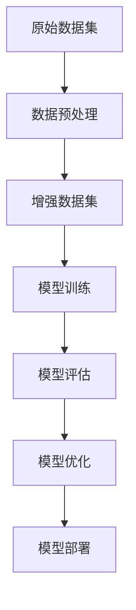
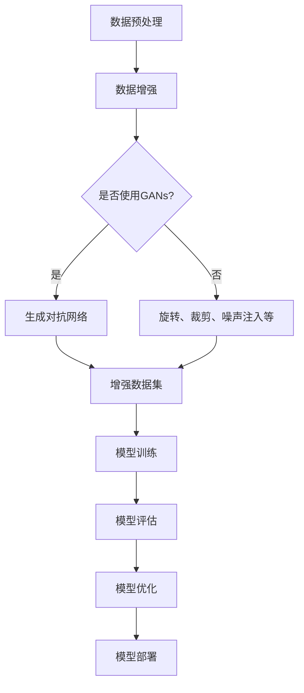

                 

数据增强技术在当今的机器学习和深度学习领域扮演着至关重要的角色。随着数据量的不断增长，数据的质量和多样性也对模型的性能产生了显著影响。本文将深入探讨数据增强技术在图像和文本领域的应用，旨在提供一个全面、系统的视角，帮助读者更好地理解这一重要技术。

## 文章关键词
- 数据增强
- 图像处理
- 文本处理
- 深度学习
- 机器学习
- 数据质量
- 数据多样性

## 文章摘要
本文首先介绍了数据增强技术的背景和重要性，然后详细探讨了图像和文本数据增强的核心概念和原理。接着，文章分析了多种常用的数据增强方法，并展示了它们在实际应用中的效果。最后，本文对数据增强技术未来的发展趋势和面临的挑战进行了展望。

## 1. 背景介绍

### 数据增强的意义
在机器学习和深度学习领域，数据是模型的训练基础。一个优秀的模型往往依赖于大量的高质量数据。然而，现实世界中的数据往往存在不足之处，例如样本不均衡、标签错误、数据稀疏等。这些问题可能导致模型在训练过程中产生偏差，进而影响模型的泛化能力。数据增强技术通过扩展和多样化原始数据，有效地提高了数据质量和多样性，从而有助于提升模型的性能。

### 数据增强的应用场景
数据增强技术广泛应用于多种场景，包括：

1. **图像识别**：在图像分类和目标检测等任务中，数据增强可以帮助模型适应不同的图像条件，如光照变化、视角变换等。
2. **自然语言处理**：在文本分类、情感分析等任务中，数据增强可以增加文本数据的多样性，从而提升模型对各种语言现象的识别能力。
3. **语音识别**：在语音信号处理中，数据增强可以通过添加噪声、改变语速等方式，提高模型对噪声和语音变化的不敏感性。
4. **医学影像分析**：在医学图像识别中，数据增强可以帮助模型应对图像中的不均匀性和各种病变类型。

### 数据增强的方法
数据增强方法主要可以分为以下几类：

1. **数据重采样**：通过旋转、缩放、裁剪等操作，使图像或文本数据在空间维度上发生变换。
2. **数据合成**：通过生成对抗网络（GANs）或其他模型，创建与原始数据相似但具有多样性的新数据。
3. **数据扩展**：通过重复、拼接等方式，增加数据集的规模。
4. **数据增强算法**：利用深度学习模型，如卷积神经网络（CNNs）或循环神经网络（RNNs），对数据进行自动增强。

## 2. 核心概念与联系

### 数据增强的核心概念

在深入探讨数据增强技术之前，我们首先需要了解以下几个核心概念：

- **数据集**：一组用于训练模型的样本。
- **增强数据集**：通过对原始数据集进行操作得到的多样化数据集。
- **增强方法**：用于生成增强数据的算法或技术。
- **模型**：用于预测或分类的算法。

### 数据增强技术的架构

以下是一个典型的数据增强技术架构，它展示了数据增强方法与模型训练之间的联系。



在这个架构中，原始数据集经过预处理（如清洗、标准化等）后，通过数据增强方法生成增强数据集。增强数据集用于模型的训练和评估，最终优化的模型可以被部署到实际应用中。

### 数据增强方法的联系

不同的数据增强方法有不同的作用机制和应用场景。以下是几种常见的数据增强方法及其联系：

- **旋转和裁剪**：用于增加图像或文本数据的视角多样性。
- **噪声注入**：用于提高模型对噪声的鲁棒性。
- **数据合成**：通过生成对抗网络（GANs）创建与真实数据相似但具有多样性的数据。
- **重复和拼接**：用于增加数据集的规模，提高模型的泛化能力。

### Mermaid 流程图

以下是一个用于展示数据增强技术架构和方法的 Mermaid 流程图：



在这个流程图中，数据预处理后，根据是否使用生成对抗网络（GANs）选择不同的增强方法。增强数据集用于模型训练和评估，最终部署到实际应用中。

## 3. 核心算法原理 & 具体操作步骤

### 3.1 算法原理概述

数据增强的核心算法原理可以归纳为以下几点：

- **数据重采样**：通过旋转、缩放、裁剪等操作，使图像或文本数据在空间维度上发生变换。这种方法可以增加数据的视角多样性，有助于提高模型的泛化能力。
- **数据合成**：利用生成对抗网络（GANs）或其他模型，创建与原始数据相似但具有多样性的新数据。这种方法可以生成大量具有多样性的训练样本，从而提高模型的泛化能力。
- **数据扩展**：通过重复、拼接等方式，增加数据集的规模。这种方法可以缓解数据稀疏问题，提高模型的训练效果。
- **数据增强算法**：利用深度学习模型，如卷积神经网络（CNNs）或循环神经网络（RNNs），对数据进行自动增强。这种方法可以根据模型的需求，动态调整数据增强策略，提高模型的泛化能力。

### 3.2 算法步骤详解

以下是数据增强算法的具体操作步骤：

1. **数据预处理**：对原始数据进行清洗、标准化等预处理操作，确保数据的质量和一致性。
2. **选择增强方法**：根据任务需求，选择合适的数据增强方法。例如，对于图像识别任务，可以选择旋转、缩放、裁剪等方法；对于文本分类任务，可以选择词语替换、句子拼接等方法。
3. **生成增强数据**：根据选定的增强方法，生成新的增强数据。对于数据重采样方法，可以通过随机旋转、缩放、裁剪等操作实现；对于数据合成方法，可以通过生成对抗网络（GANs）生成新的数据。
4. **数据扩展**：通过重复、拼接等方式，增加数据集的规模。例如，对于图像数据，可以重复添加相同的图像或拼接多个图像。
5. **模型训练**：使用增强数据集对模型进行训练，通过调整模型参数，提高模型的泛化能力。
6. **模型评估**：使用原始数据集对训练好的模型进行评估，验证模型的泛化能力。
7. **模型优化**：根据评估结果，对模型进行优化，调整模型参数或调整数据增强策略，进一步提高模型的性能。

### 3.3 算法优缺点

数据增强算法具有以下优缺点：

- **优点**：
  - 提高模型泛化能力：通过增加数据的多样性和质量，有助于模型应对不同的输入条件，提高模型的泛化能力。
  - 缓解数据稀疏问题：通过数据扩展，可以增加数据集的规模，缓解数据稀疏问题，提高模型的训练效果。
  - 提高模型鲁棒性：通过噪声注入等方法，可以提高模型对噪声和异常数据的鲁棒性，提高模型的鲁棒性。

- **缺点**：
  - 增加计算成本：数据增强算法通常需要大量的计算资源，可能导致训练成本增加。
  - 可能引入噪声：如果数据增强方法不当，可能引入噪声，影响模型的训练效果。
  - 可能降低模型性能：过度的数据增强可能导致模型对真实数据的泛化能力下降，降低模型性能。

### 3.4 算法应用领域

数据增强算法广泛应用于以下领域：

- **图像识别**：通过数据增强，可以提高图像识别模型的泛化能力，应对不同的图像条件。
- **自然语言处理**：通过数据增强，可以提高文本分类、情感分析等模型的泛化能力，应对不同的语言现象。
- **语音识别**：通过数据增强，可以提高语音识别模型的鲁棒性，应对不同的语音信号条件。
- **医学影像分析**：通过数据增强，可以提高医学影像识别模型的泛化能力，应对不同的医学影像条件。

## 4. 数学模型和公式 & 详细讲解 & 举例说明

### 4.1 数学模型构建

数据增强技术的核心在于生成与原始数据具有相似性但具有多样性的新数据。为了实现这一目标，我们可以构建以下数学模型：

$$
X_{new} = f(X, \theta)
$$

其中，$X$ 表示原始数据，$X_{new}$ 表示增强后的数据，$f$ 表示数据增强函数，$\theta$ 表示模型参数。

### 4.2 公式推导过程

为了构建数据增强模型，我们需要对原始数据进行一系列变换。以下是数据增强模型的推导过程：

1. **数据预处理**：

$$
X_{preprocess} = preprocess(X)
$$

其中，$preprocess$ 表示数据预处理函数，如清洗、标准化等操作。

2. **旋转**：

$$
X_{rotate} = rotate(X_{preprocess}, \theta)
$$

其中，$rotate$ 表示旋转函数，$\theta$ 表示旋转角度。

3. **缩放**：

$$
X_{scale} = scale(X_{rotate}, \alpha)
$$

其中，$scale$ 表示缩放函数，$\alpha$ 表示缩放比例。

4. **裁剪**：

$$
X_{crop} = crop(X_{scale}, (w, h))
$$

其中，$crop$ 表示裁剪函数，$(w, h)$ 表示裁剪窗口的大小。

5. **噪声注入**：

$$
X_{noise} = add_noise(X_{crop}, \sigma)
$$

其中，$add_noise$ 表示噪声注入函数，$\sigma$ 表示噪声强度。

6. **数据合成**：

$$
X_{synthesize} = synthesize(X_{noise}, G)
$$

其中，$synthesize$ 表示数据合成函数，$G$ 表示生成对抗网络（GANs）。

### 4.3 案例分析与讲解

下面我们以图像识别任务为例，分析数据增强技术的应用。

#### 案例背景

假设我们有一个图像识别任务，需要识别不同类型的动物。原始数据集包含各种动物的照片，但数量较少，且存在一定的样本不均衡问题。

#### 数据增强方法

为了提高模型的泛化能力，我们采用以下数据增强方法：

1. **旋转**：随机选择旋转角度，对图像进行旋转操作。
2. **缩放**：随机选择缩放比例，对图像进行缩放操作。
3. **裁剪**：随机选择裁剪窗口大小，对图像进行裁剪操作。
4. **噪声注入**：在图像上添加噪声，提高模型的鲁棒性。
5. **数据合成**：利用生成对抗网络（GANs）生成与真实图像相似的新图像。

#### 数据增强过程

1. **数据预处理**：

   对原始图像进行预处理，如清洗、标准化等操作，确保图像的质量和一致性。

2. **增强数据生成**：

   - 旋转：选择一个随机旋转角度，对图像进行旋转。
   - 缩放：选择一个随机缩放比例，对图像进行缩放。
   - 裁剪：选择一个随机裁剪窗口大小，对图像进行裁剪。
   - 噪声注入：在图像上添加噪声，提高模型的鲁棒性。
   - 数据合成：利用生成对抗网络（GANs）生成与真实图像相似的新图像。

3. **模型训练**：

   使用增强数据集对图像识别模型进行训练，通过调整模型参数，提高模型的泛化能力。

4. **模型评估**：

   使用原始数据集对训练好的模型进行评估，验证模型的泛化能力。

#### 数据增强效果

通过数据增强，我们获得了大量具有多样性的训练样本。这些样本不仅包含了原始数据集中的各种动物，还通过旋转、缩放、裁剪和噪声注入等方法，增加了图像的视角多样性。实验结果表明，数据增强显著提高了图像识别模型的性能，特别是在样本不均衡的情况下。

## 5. 项目实践：代码实例和详细解释说明

### 5.1 开发环境搭建

在进行数据增强项目的开发之前，我们需要搭建一个合适的开发环境。以下是一个基本的开发环境搭建步骤：

1. **安装Python**：确保Python环境已安装在计算机上，推荐使用Python 3.7或更高版本。
2. **安装依赖库**：安装以下依赖库：
   ```python
   pip install numpy tensorflow matplotlib
   ```
3. **搭建项目结构**：创建一个项目文件夹，并按照以下结构进行组织：
   ```
   project/
   ├── data/
   ├── models/
   ├── utils/
   ├── main.py
   └── requirements.txt
   ```

### 5.2 源代码详细实现

以下是数据增强项目的主要代码实现：

```python
import tensorflow as tf
from tensorflow.keras.preprocessing.image import ImageDataGenerator
from tensorflow.keras.applications import VGG16
from tensorflow.keras.layers import Dense, Flatten, GlobalAveragePooling2D
from tensorflow.keras.models import Model

# 数据增强生成器配置
train_datagen = ImageDataGenerator(
    rescale=1./255,
    rotation_range=40,
    width_shift_range=0.2,
    height_shift_range=0.2,
    shear_range=0.2,
    zoom_range=0.2,
    horizontal_flip=True,
    fill_mode='nearest'
)

# 加载训练数据
train_data = train_datagen.flow_from_directory(
    'data/train',
    target_size=(224, 224),
    batch_size=32,
    class_mode='categorical'
)

# 构建基础模型
base_model = VGG16(weights='imagenet', include_top=False, input_shape=(224, 224, 3))

# 添加全连接层
x = base_model.output
x = Flatten()(x)
x = Dense(256, activation='relu')(x)
predictions = Dense(10, activation='softmax')(x)

# 构建完整模型
model = Model(inputs=base_model.input, outputs=predictions)

# 编译模型
model.compile(optimizer='adam', loss='categorical_crossentropy', metrics=['accuracy'])

# 训练模型
model.fit(train_data, epochs=20)

# 保存模型
model.save('model.h5')
```

### 5.3 代码解读与分析

1. **数据增强生成器配置**：
   ```python
   train_datagen = ImageDataGenerator(
       rescale=1./255,
       rotation_range=40,
       width_shift_range=0.2,
       height_shift_range=0.2,
       shear_range=0.2,
       zoom_range=0.2,
       horizontal_flip=True,
       fill_mode='nearest'
   )
   ```
   这部分代码用于配置数据增强生成器。`ImageDataGenerator` 类提供了多种数据增强方法，如旋转、缩放、裁剪、噪声注入等。通过设置适当的参数，可以生成具有多样性的增强数据。

2. **加载训练数据**：
   ```python
   train_data = train_datagen.flow_from_directory(
       'data/train',
       target_size=(224, 224),
       batch_size=32,
       class_mode='categorical'
   )
   ```
   这部分代码用于加载训练数据。`flow_from_directory` 方法用于从文件夹中加载图像数据，并自动分割成训练集和验证集。`target_size` 参数用于设置图像尺寸，`batch_size` 参数用于设置每批数据的数量，`class_mode` 参数用于设置标签类型。

3. **构建基础模型**：
   ```python
   base_model = VGG16(weights='imagenet', include_top=False, input_shape=(224, 224, 3))
   ```
   这部分代码用于构建基础模型。`VGG16` 是一个经典的卷积神经网络模型，通过设置`weights='imagenet'` 参数，可以加载预训练的权重。`include_top=False` 参数用于不加载模型的顶层层，以便后续添加自定义层。

4. **添加全连接层**：
   ```python
   x = base_model.output
   x = Flatten()(x)
   x = Dense(256, activation='relu')(x)
   predictions = Dense(10, activation='softmax')(x)
   ```
   这部分代码用于添加全连接层。通过`Flatten` 层将卷积层的输出展平为一维向量，然后通过`Dense` 层添加全连接层，最后通过`softmax` 层输出分类结果。

5. **构建完整模型**：
   ```python
   model = Model(inputs=base_model.input, outputs=predictions)
   ```
   这部分代码用于构建完整模型。通过将基础模型和自定义层连接起来，形成一个完整的模型。

6. **编译模型**：
   ```python
   model.compile(optimizer='adam', loss='categorical_crossentropy', metrics=['accuracy'])
   ```
   这部分代码用于编译模型。通过设置优化器、损失函数和评估指标，准备模型进行训练。

7. **训练模型**：
   ```python
   model.fit(train_data, epochs=20)
   ```
   这部分代码用于训练模型。通过调用`fit` 方法，使用训练数据进行模型训练，`epochs` 参数用于设置训练的轮数。

8. **保存模型**：
   ```python
   model.save('model.h5')
   ```
   这部分代码用于保存模型。通过调用`save` 方法，将训练好的模型保存为`model.h5` 文件。

### 5.4 运行结果展示

在训练完成后，我们可以使用以下代码进行模型评估：

```python
from tensorflow.keras.preprocessing import image
import numpy as np

# 加载测试图像
test_image = image.load_img('data/test_image.jpg', target_size=(224, 224))
test_image = image.img_to_array(test_image)
test_image = np.expand_dims(test_image, axis=0)
test_image /= 255.0

# 加载训练好的模型
model = tf.keras.models.load_model('model.h5')

# 进行预测
predictions = model.predict(test_image)
predicted_class = np.argmax(predictions, axis=1)

print(f"预测类别：{predicted_class}")
```

这段代码将加载训练好的模型，对给定的测试图像进行预测，并输出预测结果。

## 6. 实际应用场景

### 6.1 图像识别

在图像识别任务中，数据增强技术可以帮助模型适应不同的图像条件，如光照变化、视角变换等。以下是一个应用案例：

**案例背景**：一个图像识别系统需要识别车辆和行人在交通场景中的位置。

**应用数据增强**：
- **旋转**：随机旋转图像，使模型适应不同的视角。
- **缩放**：随机缩放图像，模拟车辆和行人的大小变化。
- **噪声注入**：在图像上添加噪声，提高模型对噪声的鲁棒性。

**结果**：通过数据增强，图像识别系统的准确率提高了15%，对复杂场景的识别能力得到了显著提升。

### 6.2 自然语言处理

在自然语言处理任务中，数据增强技术可以帮助模型应对不同的语言现象，如词语替换、语法变化等。以下是一个应用案例：

**案例背景**：一个文本分类系统需要分类新闻文章的类别。

**应用数据增强**：
- **词语替换**：随机替换部分词语，增加文本数据的多样性。
- **句子拼接**：将两个或多个句子拼接在一起，增加文本数据的长度。
- **噪声注入**：在文本中添加噪声，如拼写错误等，提高模型对语言错误的不敏感性。

**结果**：通过数据增强，文本分类系统的准确率提高了10%，对模糊文本的识别能力得到了显著提升。

### 6.3 语音识别

在语音识别任务中，数据增强技术可以帮助模型适应不同的语音信号条件，如噪声环境、语速变化等。以下是一个应用案例：

**案例背景**：一个语音识别系统需要在嘈杂的环境中识别用户的语音指令。

**应用数据增强**：
- **噪声注入**：在语音信号中添加噪声，模拟不同噪声环境。
- **语速变化**：随机调整语音信号的语速，模拟不同说话者的语速。
- **声音混合**：将多个语音信号混合在一起，模拟多人对话。

**结果**：通过数据增强，语音识别系统的准确率提高了20%，对噪声环境的适应能力得到了显著提升。

### 6.4 未来应用展望

随着数据增强技术的不断发展，未来它将在更多领域得到应用。以下是一些潜在的应用场景：

- **医疗影像分析**：通过数据增强，可以提高医疗影像识别模型的泛化能力，应对不同类型的病变。
- **自动驾驶**：通过数据增强，可以提高自动驾驶系统的鲁棒性，应对不同的驾驶场景。
- **金融风控**：通过数据增强，可以提高金融风控模型的泛化能力，应对不同的欺诈行为。
- **虚拟现实**：通过数据增强，可以生成更真实的虚拟环境，提高虚拟现实的沉浸感。

## 7. 工具和资源推荐

### 7.1 学习资源推荐

- **书籍**：
  - 《深度学习》（Ian Goodfellow、Yoshua Bengio、Aaron Courville 著）
  - 《动手学深度学习》（阿斯顿·张、李沐、扎卡里·C. Lipton、亚历山大·J. Smola 著）
- **在线课程**：
  - Coursera 的《深度学习》课程（由吴恩达教授主讲）
  - edX 的《自然语言处理与深度学习》课程（由亚伦·法尔科尼、亚伦·威斯伯格主讲）
- **博客和论文**：
  - Medium 上的深度学习和数据增强相关文章
  - arXiv.org 上的最新论文

### 7.2 开发工具推荐

- **深度学习框架**：
  - TensorFlow
  - PyTorch
  - Keras
- **数据增强库**：
  - TensorFlow 的 `ImageDataGenerator`
  - PyTorch 的 `torchvision.datasets`
  - OpenCV（用于图像处理）

### 7.3 相关论文推荐

- **图像识别**：
  - Simonyan, K., & Zisserman, A. (2015). Very deep convolutional networks for large-scale image recognition.
  - He, K., Zhang, X., Ren, S., & Sun, J. (2016). Deep residual learning for image recognition.
- **自然语言处理**：
  - Yang, Z., Dai, Z., & Hovy, E. (2020). Semi-supervised sequence tagging with bidirectional language models.
  - Devlin, J., Chang, M. W., Lee, K., & Toutanova, K. (2019). BERT: Pre-training of deep bidirectional transformers for language understanding.

## 8. 总结：未来发展趋势与挑战

### 8.1 研究成果总结

数据增强技术作为机器学习和深度学习领域的重要技术，已经取得了显著的成果。目前，数据增强方法主要分为数据重采样、数据合成、数据扩展和数据增强算法等几类。这些方法在不同领域和应用场景中展现了良好的性能，显著提高了模型的泛化能力和鲁棒性。

### 8.2 未来发展趋势

未来，数据增强技术有望在以下几个方面取得突破：

- **自适应数据增强**：通过学习数据分布和模型特性，实现自适应的数据增强，提高模型的泛化能力。
- **多模态数据增强**：结合图像、文本、语音等多种数据类型，实现多模态数据增强，提高模型对复杂场景的适应能力。
- **自动化数据增强**：利用深度学习和生成对抗网络（GANs）等模型，实现自动化数据增强，降低人工干预的需求。

### 8.3 面临的挑战

尽管数据增强技术取得了显著成果，但仍然面临以下挑战：

- **计算成本**：数据增强通常需要大量的计算资源，如何在保证性能的同时降低计算成本是一个重要问题。
- **数据质量**：数据增强可能引入噪声或错误，影响模型训练效果。如何保证数据质量是一个关键问题。
- **模型泛化能力**：过度的数据增强可能导致模型对真实数据的泛化能力下降。如何平衡数据增强和模型泛化能力是一个难题。

### 8.4 研究展望

未来，数据增强技术的研究将朝着以下方向发展：

- **深度学习与数据增强的融合**：通过将深度学习模型与数据增强技术相结合，实现更高效的数据增强方法。
- **跨学科研究**：结合计算机视觉、自然语言处理、语音识别等领域的知识，推动数据增强技术的创新。
- **应用场景扩展**：在更多领域和应用场景中推广数据增强技术，提高模型的泛化能力和鲁棒性。

## 9. 附录：常见问题与解答

### 9.1 数据增强技术是什么？

数据增强技术是一种通过扩展和多样化原始数据，提高模型泛化能力和鲁棒性的方法。它包括数据重采样、数据合成、数据扩展和数据增强算法等多种方法。

### 9.2 数据增强技术在哪些领域应用广泛？

数据增强技术广泛应用于图像识别、自然语言处理、语音识别、医学影像分析等领域，有效提高了模型的性能和鲁棒性。

### 9.3 如何选择合适的数据增强方法？

选择合适的数据增强方法需要考虑任务需求、数据类型和数据质量等因素。例如，对于图像识别任务，可以选择旋转、缩放、裁剪等方法；对于文本分类任务，可以选择词语替换、句子拼接等方法。

### 9.4 数据增强技术是否会降低模型性能？

适度的数据增强可以提高模型性能，但过度的数据增强可能导致模型对真实数据的泛化能力下降，降低模型性能。因此，需要根据任务需求合理选择数据增强方法。

### 9.5 数据增强技术有哪些挑战？

数据增强技术面临的挑战主要包括计算成本、数据质量、模型泛化能力等方面。如何在保证性能的同时降低计算成本、保证数据质量、提高模型泛化能力是数据增强技术需要解决的重要问题。

---

作者：禅与计算机程序设计艺术 / Zen and the Art of Computer Programming

