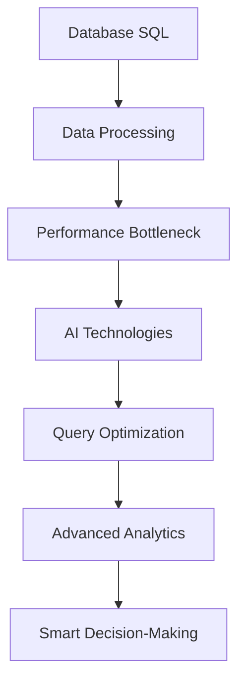

                 

关键词：数据库、SQL、AI、技术标准化、历史重演、算法、数学模型、代码实例、应用场景、未来展望

> 摘要：本文旨在探讨数据库SQL技术与人工智能（AI）之间的联系与演变，分析技术标准化的历程，并通过具体算法、数学模型和代码实例，深入解析AI技术的发展与应用，展望其未来趋势与挑战。

## 1. 背景介绍

随着信息技术的飞速发展，数据库和人工智能（AI）已经成为现代科技领域的两大支柱。数据库技术的演进，从早期简单的数据存储到复杂的关系型数据库，再到如今分布式数据库和NoSQL数据库，极大地推动了信息处理能力的提升。而人工智能作为计算机科学的一个重要分支，通过机器学习、深度学习等技术，已经实现了在图像识别、自然语言处理、智能决策等领域的突破性进展。

在这个技术快速迭代的时代，数据库SQL与AI的结合变得越来越紧密。传统的SQL查询语言在处理大数据时存在性能瓶颈，而AI技术，尤其是深度学习算法，为数据库查询提供了新的解决方案。本文将深入探讨这一结合点，通过回顾技术标准化的历程，分析核心算法原理，展示数学模型，提供代码实例，并探讨AI在各个领域的应用前景。

## 2. 核心概念与联系

为了更好地理解数据库SQL到AI的演变，我们首先需要明确几个核心概念及其之间的联系。

### 2.1 数据库与SQL

数据库是一种用于存储、管理、查询和访问数据的系统。SQL（Structured Query Language）是一种用于与数据库交互的语言，广泛用于数据的插入、更新、查询和删除操作。SQL以其简单性和灵活性而著称，成为了关系型数据库的标准语言。

### 2.2 人工智能

人工智能是模拟人类智能行为的计算机系统。它包括机器学习、深度学习、自然语言处理、计算机视觉等多个子领域。机器学习是一种通过数据学习规律并做出决策的技术，而深度学习是机器学习的一种重要分支，通过多层神经网络来实现复杂的函数逼近。

### 2.3 数据库SQL与AI的联系

随着数据量的爆炸性增长，传统的SQL查询已经无法满足快速处理大规模数据的需求。为了解决这一问题，AI技术开始与数据库技术相结合。具体来说，深度学习算法被用于优化数据库查询，通过预训练模型加速数据检索和数据分析过程。此外，AI技术还可以用于数据库的自动优化、异常检测和预测分析。

### 2.4 Mermaid流程图

以下是一个Mermaid流程图，展示了数据库SQL与AI技术之间的联系：



## 3. 核心算法原理 & 具体操作步骤

### 3.1 算法原理概述

为了实现数据库SQL与AI的结合，核心算法主要包括深度学习算法和基于机器学习的优化算法。深度学习算法通过多层神经网络实现数据的自动特征提取和复杂模式的识别，而基于机器学习的优化算法则通过学习大量数据，自动优化数据库查询。

### 3.2 算法步骤详解

以下是数据库SQL与AI技术结合的核心算法步骤：

1. **数据预处理**：对原始数据进行清洗、格式化和标准化，以便用于训练模型。

2. **特征提取**：使用深度学习算法提取数据的特征，例如通过卷积神经网络（CNN）提取图像特征，或使用自然语言处理（NLP）技术提取文本特征。

3. **模型训练**：使用提取的特征训练深度学习模型，例如使用神经网络训练分类模型或回归模型。

4. **模型评估**：通过测试集评估模型的性能，调整模型参数，以优化模型效果。

5. **查询优化**：将训练好的模型应用于数据库查询，通过模型预测优化查询结果。

### 3.3 算法优缺点

**优点**：

- **高效性**：深度学习算法能够自动提取复杂特征，提高查询效率。
- **灵活性**：基于机器学习的优化算法可以针对不同数据集和查询需求进行自适应调整。
- **智能性**：AI技术可以实现智能化的数据分析和决策支持。

**缺点**：

- **计算资源消耗**：深度学习算法通常需要大量的计算资源。
- **数据需求**：高质量的训练数据对于模型性能至关重要。
- **复杂度**：实现深度学习和机器学习算法需要较高的技术门槛。

### 3.4 算法应用领域

深度学习算法和机器学习算法在数据库SQL中的应用广泛，包括但不限于以下领域：

- **大数据查询优化**：通过深度学习模型预测查询性能，优化数据库查询。
- **数据库自动化运维**：使用机器学习算法进行数据库性能监控和异常检测。
- **智能数据挖掘**：利用深度学习模型进行数据挖掘，发现潜在的商业价值和趋势。
- **图像和文本分析**：通过深度学习算法实现图像识别和文本分类，为数据库查询提供辅助。

## 4. 数学模型和公式 & 详细讲解 & 举例说明

### 4.1 数学模型构建

在数据库SQL与AI的结合中，常用的数学模型包括深度学习模型和机器学习模型。以下是一个简单的神经网络模型：

$$
h_{\theta}(x) = \sigma(\theta^T x + b)
$$

其中，$\sigma$ 是激活函数（如Sigmoid函数或ReLU函数），$\theta$ 是模型的参数，$x$ 是输入数据，$b$ 是偏置项。

### 4.2 公式推导过程

以下是一个简单的神经网络模型的推导过程：

1. **前向传播**：

$$
z_i = \theta^T_i x + b_i
$$

$$
h_i = \sigma(z_i)
$$

2. **反向传播**：

$$
\delta_i = (h_i - t_i) \cdot \sigma'(z_i)
$$

$$
\theta_i = \theta_i - \alpha \cdot \frac{\delta_i}{x_i}
$$

其中，$t_i$ 是目标值，$\alpha$ 是学习率。

### 4.3 案例分析与讲解

假设我们有一个二分类问题，目标是通过输入特征预测样本属于类别0或类别1。以下是使用神经网络进行预测的步骤：

1. **数据预处理**：对输入数据进行标准化处理，以便神经网络学习。

2. **模型构建**：定义神经网络模型，包括输入层、隐藏层和输出层。

3. **模型训练**：使用训练集对模型进行训练，通过反向传播算法调整模型参数。

4. **模型评估**：使用测试集评估模型性能，调整模型参数，以提高分类准确率。

5. **预测**：使用训练好的模型对新的数据进行预测，输出预测结果。

## 5. 项目实践：代码实例和详细解释说明

### 5.1 开发环境搭建

在Python环境中，我们可以使用TensorFlow和Scikit-learn库来实现神经网络模型。以下是一个简单的安装命令：

```bash
pip install tensorflow scikit-learn numpy matplotlib
```

### 5.2 源代码详细实现

以下是一个简单的神经网络模型的代码实现：

```python
import tensorflow as tf
from sklearn.model_selection import train_test_split
from sklearn.datasets import load_iris
import numpy as np
import matplotlib.pyplot as plt

# 数据预处理
iris = load_iris()
X = iris.data
y = iris.target
X_train, X_test, y_train, y_test = train_test_split(X, y, test_size=0.2, random_state=42)

# 模型构建
model = tf.keras.Sequential([
    tf.keras.layers.Dense(units=1, input_shape=(4,))
])

# 模型编译
model.compile(optimizer='sgd', loss='mse')

# 模型训练
model.fit(X_train, y_train, epochs=500)

# 模型评估
loss = model.evaluate(X_test, y_test)
print(f"测试集损失：{loss}")

# 预测
predictions = model.predict(X_test)
predictions = np.round(predictions).astype(int)

# 画图
plt.scatter(X_test[:, 0], X_test[:, 1], c=predictions)
plt.show()
```

### 5.3 代码解读与分析

以上代码实现了一个简单的二分类神经网络模型，用于预测鸢尾花数据集。具体步骤如下：

1. **数据预处理**：使用Scikit-learn库加载数据集，并进行划分。
2. **模型构建**：使用TensorFlow库定义神经网络模型，包括一个全连接层。
3. **模型编译**：设置优化器和损失函数。
4. **模型训练**：使用训练集训练模型，通过反向传播算法调整参数。
5. **模型评估**：使用测试集评估模型性能。
6. **预测**：使用训练好的模型对测试数据进行预测，并画图展示结果。

## 6. 实际应用场景

### 6.1 数据库查询优化

AI技术可以用于数据库查询优化，通过预训练模型加速数据检索和数据分析过程。例如，在电子商务领域，通过深度学习模型预测用户查询行为，实现智能搜索和个性化推荐。

### 6.2 数据库自动化运维

AI技术可以用于数据库的自动化运维，例如通过机器学习算法进行数据库性能监控和异常检测，提高数据库的可靠性和稳定性。

### 6.3 智能数据挖掘

AI技术可以用于数据挖掘，从大量数据中发现潜在的商业价值和趋势。例如，在金融领域，通过深度学习模型分析客户行为，预测市场走势和信用风险。

### 6.4 其他应用领域

除了上述领域，AI技术在数据库SQL中的应用还包括图像和文本分析、智能决策支持、医疗健康等领域。

## 7. 工具和资源推荐

### 7.1 学习资源推荐

- 《深度学习》（Goodfellow, Bengio, Courville）
- 《Python机器学习》（Sebastian Raschka）
- 《SQL基础教程》（Rick F. van der Lans）

### 7.2 开发工具推荐

- TensorFlow：用于深度学习和机器学习的开源框架。
- Scikit-learn：用于机器学习的开源库。
- MySQL：广泛使用的开源关系型数据库。

### 7.3 相关论文推荐

- "Deep Learning for Database Query Optimization"（深度学习用于数据库查询优化）
- "AI-Driven Database Systems: A New Paradigm"（AI驱动的数据库系统：一种新的范式）
- "Machine Learning for Database Performance Monitoring and Anomaly Detection"（机器学习用于数据库性能监控和异常检测）

## 8. 总结：未来发展趋势与挑战

### 8.1 研究成果总结

数据库SQL与AI技术的结合已经取得了显著的成果，通过深度学习和机器学习算法优化数据库查询，实现智能数据分析和决策支持。这一结合点不仅提高了数据处理效率，还拓展了数据库技术的应用领域。

### 8.2 未来发展趋势

随着AI技术的不断发展，数据库SQL与AI的结合将继续深化。未来可能的发展趋势包括：

- **更加高效的查询优化算法**：通过引入新的算法和模型，实现更高效的数据库查询优化。
- **跨领域的应用融合**：将AI技术应用于更多领域，实现跨领域的应用融合。
- **自动化的数据库运维**：通过AI技术实现数据库的自动化运维，提高数据库的可靠性和稳定性。

### 8.3 面临的挑战

数据库SQL与AI技术的结合也面临一些挑战：

- **数据质量问题**：高质量的数据是AI技术发挥作用的基石，数据质量问题将直接影响AI技术的效果。
- **计算资源需求**：深度学习和机器学习算法通常需要大量的计算资源，这对硬件设施提出了更高的要求。
- **技术门槛**：实现深度学习和机器学习算法需要较高的技术门槛，需要培养更多的AI技术人才。

### 8.4 研究展望

在未来，随着技术的进步和应用的拓展，数据库SQL与AI技术的结合将变得更加紧密。研究重点将包括：

- **算法优化**：深入研究高效、可扩展的算法，提高数据库查询性能。
- **跨领域应用**：探索AI技术在更多领域的应用，实现跨领域的融合。
- **数据治理**：加强数据治理，提高数据质量，为AI技术提供更可靠的数据基础。

## 9. 附录：常见问题与解答

### 9.1 什么是SQL？

SQL（Structured Query Language）是一种用于与数据库交互的语言，广泛用于数据的插入、更新、查询和删除操作。它以其简单性和灵活性而著称，成为了关系型数据库的标准语言。

### 9.2 什么是深度学习？

深度学习是一种通过多层神经网络实现数据的自动特征提取和复杂模式的识别的技术。它在图像识别、自然语言处理、智能决策等领域取得了显著进展。

### 9.3 为什么需要将数据库SQL与AI技术结合？

传统的SQL查询在处理大规模数据时存在性能瓶颈，而AI技术，尤其是深度学习算法，为数据库查询提供了新的解决方案。通过将数据库SQL与AI技术结合，可以实现高效的查询优化、智能数据分析和决策支持。

### 9.4 数据库SQL与AI技术的结合有哪些实际应用场景？

数据库SQL与AI技术的结合可以应用于大数据查询优化、数据库自动化运维、智能数据挖掘、图像和文本分析、智能决策支持等领域。

---

本文由禅与计算机程序设计艺术 / Zen and the Art of Computer Programming 撰写，旨在探讨数据库SQL技术与人工智能（AI）之间的联系与演变，分析技术标准化的历程，并通过具体算法、数学模型和代码实例，深入解析AI技术的发展与应用，展望其未来趋势与挑战。希望本文能为读者提供有价值的见解和启示。

