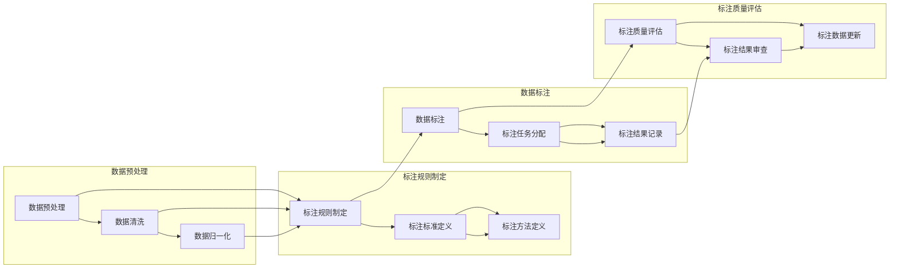

                 

关键词：数据标注、人工智能、机器学习、深度学习、算法优化、软件开发、数据处理、数据质量、标注工具

> 摘要：本文将深入探讨数据标注在人工智能发展中的关键作用。通过介绍数据标注的概念、流程、重要性，解析数据标注对机器学习和深度学习算法的影响，阐述数据标注质量对模型性能的决定性作用。此外，本文还将探讨数据标注在各个领域的实际应用，并展望数据标注技术的未来发展趋势。

## 1. 背景介绍

### 数据标注的定义与历史发展

数据标注是指对数据集中的信息进行标记，使其具有一定的结构化属性，以便后续的机器学习和深度学习算法能够利用这些数据进行训练。数据标注的概念最早可以追溯到20世纪60年代，随着计算机技术的发展，标注数据的应用逐渐扩展到自然语言处理、图像识别、语音识别等领域。

在早期的人工智能研究中，数据标注主要依赖于人工完成。研究人员通过手工标注文本、图像或音频数据，为算法提供训练样本。然而，随着数据量的急剧增长和算法复杂性的提升，人工标注的成本和效率逐渐成为瓶颈。为了解决这一问题，自动标注和半自动标注技术应运而生。

### 数据标注的重要性

数据标注是机器学习和深度学习模型训练的基石。高质量的数据标注能够显著提升模型的准确性、稳定性和泛化能力。以下是数据标注在人工智能领域中的几个关键作用：

1. **提高模型性能**：标注准确的数据有助于模型更好地学习和理解数据的特征，从而提高模型的预测准确率和鲁棒性。
2. **减少过拟合**：过拟合是指模型在训练数据上表现良好，但在未见过的数据上表现不佳。高质量的数据标注能够提供丰富的训练样本，有助于减少过拟合现象。
3. **优化算法效率**：标注数据的过程可以帮助研究人员识别和修复算法中的错误，从而优化算法的效率和性能。

### 数据标注在人工智能发展中的历史地位

数据标注在人工智能发展中占据着举足轻重的地位。随着人工智能技术的不断演进，数据标注的需求也在不断增长。以下是数据标注在人工智能发展中的几个重要阶段：

1. **早期阶段**：在早期的人工智能研究中，数据标注主要依赖于人工完成。研究人员通过手工标注数据，为算法提供训练样本。
2. **发展阶段**：随着机器学习和深度学习的兴起，自动标注和半自动标注技术开始广泛应用。这些技术大大提高了数据标注的效率和准确性。
3. **现代阶段**：现代人工智能技术的发展，特别是生成对抗网络（GAN）和深度强化学习等技术的出现，使得数据标注的自动化程度进一步提升。同时，新的标注工具和平台不断涌现，为数据标注提供了更多选择。

## 2. 核心概念与联系

### 数据标注的核心概念

数据标注的核心概念包括以下几方面：

1. **标注对象**：数据标注的对象可以是文本、图像、音频、视频等不同类型的数据。
2. **标注任务**：标注任务是指对数据中的特定元素进行标记，例如文本分类、图像分类、语音识别等。
3. **标注标签**：标注标签是对数据中特定元素进行分类或标注的标识符。标签可以是预定义的，也可以是自定义的。

### 数据标注的流程

数据标注的流程可以分为以下几个步骤：

1. **数据预处理**：对原始数据进行清洗、归一化等处理，以提高数据的质量和标注的准确性。
2. **标注规则制定**：根据标注任务制定标注规则，明确标注的标准和方法。
3. **数据标注**：根据标注规则对数据进行标注，可以采用人工标注、自动标注或半自动标注等方法。
4. **标注质量评估**：对标注结果进行质量评估，确保标注的准确性和一致性。
5. **数据更新**：根据评估结果对标注数据进行调整和更新。

### 数据标注的架构图

以下是一个简单的数据标注架构图，展示数据标注的主要流程和组件：

```
+----------------+     +-----------------+     +----------------+
|      数据预处理   |     |     标注规则制定   |     |      标注质量评估   |
+----------------+     +-----------------+     +----------------+
          ↓                           ↓                          ↓
        +-----------------------------+-----------------------------+
        |                                                            |
        |     +-----------------------+     +-----------------------+     |
        |     |        数据标注       |     |        数据更新       |     |
        |     +-----------------------+     +-----------------------+     |
        |                                                            |
        +--------------------------------------------------------------+
```

### 数据标注的核心概念原理和架构的 Mermaid 流程图

以下是一个简化的 Mermaid 流程图，描述数据标注的核心概念和流程：



## 3. 核心算法原理 & 具体操作步骤

### 3.1 算法原理概述

数据标注的核心算法主要包括以下几种：

1. **人工标注**：人工标注是指由人类专家对数据进行标注。这种方法具有高准确性和灵活性，但成本高、效率低。
2. **自动标注**：自动标注是指使用算法或工具对数据进行自动化标注。这种方法可以提高标注效率，但可能存在标注准确性问题。
3. **半自动标注**：半自动标注是指结合人工标注和自动标注的方法，由人类专家对关键部分进行标注，其余部分由算法或工具自动标注。这种方法可以在保证标注质量的同时提高效率。

### 3.2 算法步骤详解

#### 3.2.1 人工标注

人工标注的步骤如下：

1. **数据清洗**：对原始数据进行清洗，去除噪声和不相关的信息。
2. **标注任务分配**：将标注任务分配给标注员，可以是按项目分配或按标注员能力分配。
3. **标注规则制定**：根据标注任务制定标注规则，明确标注的标准和方法。
4. **数据标注**：标注员根据标注规则对数据进行标注。
5. **标注结果审查**：对标注结果进行审查，确保标注的准确性和一致性。
6. **标注数据更新**：根据审查结果对标注数据进行调整和更新。

#### 3.2.2 自动标注

自动标注的步骤如下：

1. **数据预处理**：对原始数据进行预处理，包括去噪、归一化等。
2. **特征提取**：提取数据中的特征，为自动标注提供依据。
3. **标注算法选择**：根据标注任务选择合适的自动标注算法。
4. **自动标注**：使用标注算法对数据进行自动标注。
5. **标注结果评估**：评估自动标注的准确性，如与人工标注结果进行对比。
6. **标注数据更新**：根据评估结果对标注数据进行调整和更新。

#### 3.2.3 半自动标注

半自动标注的步骤如下：

1. **数据预处理**：对原始数据进行预处理，包括去噪、归一化等。
2. **标注任务分配**：将标注任务分配给标注员，可以是按项目分配或按标注员能力分配。
3. **标注规则制定**：根据标注任务制定标注规则，明确标注的标准和方法。
4. **自动标注预览**：使用自动标注算法对数据生成预览标注结果。
5. **标注员审核与修正**：标注员对预览标注结果进行审核，修正错误和不准确的部分。
6. **标注结果审查**：对标注结果进行审查，确保标注的准确性和一致性。
7. **标注数据更新**：根据审查结果对标注数据进行调整和更新。

### 3.3 算法优缺点

#### 3.3.1 人工标注

优点：
- **高准确性**：由人类专家进行标注，可以保证标注的准确性和一致性。
- **灵活性**：可以根据具体任务调整标注规则和方法。

缺点：
- **成本高**：人工标注需要大量人力和时间，成本较高。
- **效率低**：人工标注的效率相对较低，难以应对大规模标注任务。

#### 3.3.2 自动标注

优点：
- **高效率**：自动化标注可以大大提高标注的效率，适用于大规模标注任务。
- **成本低**：自动标注相比人工标注成本较低。

缺点：
- **准确性问题**：自动标注的准确性可能受到算法、数据质量和特征提取等因素的影响。
- **适应性差**：自动标注算法往往难以应对复杂和多变的数据标注任务。

#### 3.3.3 半自动标注

优点：
- **结合优势**：半自动标注结合了人工标注和自动标注的优点，可以在保证标注质量的同时提高效率。
- **灵活性**：可以根据具体任务调整标注规则和方法。

缺点：
- **成本较高**：半自动标注需要同时投入人力和算法资源，成本相对较高。

### 3.4 算法应用领域

数据标注算法在多个领域有广泛应用：

1. **自然语言处理**：文本分类、情感分析、命名实体识别等。
2. **计算机视觉**：图像分类、目标检测、图像分割等。
3. **语音识别**：语音分类、说话人识别、语音转文字等。
4. **推荐系统**：基于用户行为的推荐、内容推荐等。

## 4. 数学模型和公式 & 详细讲解 & 举例说明

### 4.1 数学模型构建

数据标注的数学模型通常涉及分类和回归任务。以下是一个简单的分类模型构建过程：

1. **特征提取**：对原始数据进行特征提取，生成特征向量。
2. **模型选择**：选择合适的分类模型，如逻辑回归、支持向量机（SVM）、神经网络等。
3. **模型训练**：使用标注数据进行模型训练，优化模型参数。
4. **模型评估**：使用验证数据对模型进行评估，调整模型参数。
5. **模型应用**：使用训练好的模型对未标注数据进行预测。

### 4.2 公式推导过程

以下是一个简单的逻辑回归模型公式推导过程：

1. **假设**：假设特征向量为 \(\mathbf{x} \in \mathbb{R}^{n}\)，标签为 \(y \in \{0, 1\}\)。
2. **损失函数**：选择均方误差（MSE）作为损失函数：
   \[
   J(\theta) = \frac{1}{m} \sum_{i=1}^{m} (h_{\theta}(\mathbf{x}^{(i)}) - y^{(i)})^2
   \]
   其中，\(h_{\theta}(\mathbf{x}) = \sigma(\theta^T \mathbf{x})\)，\(\sigma(z) = \frac{1}{1 + e^{-z}}\)。
3. **梯度下降**：使用梯度下降法优化模型参数 \(\theta\)：
   \[
   \theta_j := \theta_j - \alpha \frac{\partial}{\partial \theta_j} J(\theta)
   \]
   其中，\(\alpha\) 为学习率。

### 4.3 案例分析与讲解

#### 案例一：文本分类

假设我们要对一组新闻文章进行分类，标签为“体育”、“财经”、“娱乐”等。以下是一个简单的文本分类案例：

1. **数据预处理**：对新闻文章进行文本预处理，包括去除标点、停用词等，将文本转换为词袋模型。
2. **特征提取**：提取文本中的特征，如词频、词频逆文档频率（TF-IDF）等。
3. **模型训练**：使用标注数据进行模型训练，如使用逻辑回归、朴素贝叶斯等。
4. **模型评估**：使用验证数据对模型进行评估，调整模型参数。
5. **模型应用**：使用训练好的模型对未标注的新闻文章进行分类预测。

#### 案例二：图像分类

假设我们要对一组图像进行分类，标签为“动物”、“植物”、“建筑”等。以下是一个简单的图像分类案例：

1. **数据预处理**：对图像进行预处理，如缩放、裁剪等，将图像转换为特征向量。
2. **特征提取**：使用卷积神经网络（CNN）等算法提取图像特征。
3. **模型训练**：使用标注数据进行模型训练，如使用SVM、神经网络等。
4. **模型评估**：使用验证数据对模型进行评估，调整模型参数。
5. **模型应用**：使用训练好的模型对未标注的图像进行分类预测。

## 5. 项目实践：代码实例和详细解释说明

### 5.1 开发环境搭建

为了更好地理解数据标注的实践过程，我们首先需要搭建一个开发环境。以下是搭建开发环境的基本步骤：

1. **安装 Python**：下载并安装 Python 3.x 版本（推荐使用 Python 3.8 或更高版本）。
2. **安装常用库**：使用 pip 命令安装必要的库，如 NumPy、Pandas、Scikit-learn、TensorFlow、Keras 等。
   ```bash
   pip install numpy pandas scikit-learn tensorflow keras
   ```
3. **配置虚拟环境**（可选）：为了更好地管理项目依赖，可以使用 virtualenv 或 conda 创建虚拟环境。
   ```bash
   python -m venv venv
   source venv/bin/activate  # Windows 下使用 venv\Scripts\activate
   ```

### 5.2 源代码详细实现

以下是一个简单的文本分类项目，使用 Scikit-learn 库实现。代码文件名为 `text_classification.py`：

```python
import numpy as np
import pandas as pd
from sklearn.model_selection import train_test_split
from sklearn.feature_extraction.text import TfidfVectorizer
from sklearn.linear_model import LogisticRegression
from sklearn.metrics import accuracy_score

# 读取数据
data = pd.read_csv('data.csv')
X = data['text']
y = data['label']

# 划分训练集和测试集
X_train, X_test, y_train, y_test = train_test_split(X, y, test_size=0.2, random_state=42)

# 特征提取
vectorizer = TfidfVectorizer()
X_train_tfidf = vectorizer.fit_transform(X_train)
X_test_tfidf = vectorizer.transform(X_test)

# 模型训练
model = LogisticRegression()
model.fit(X_train_tfidf, y_train)

# 模型评估
y_pred = model.predict(X_test_tfidf)
accuracy = accuracy_score(y_test, y_pred)
print(f'Accuracy: {accuracy:.2f}')

# 模型应用
new_text = '这是一篇关于体育的新闻。'
new_text_tfidf = vectorizer.transform([new_text])
predicted_label = model.predict(new_text_tfidf)
print(f'Predicted Label: {predicted_label[0]}')
```

### 5.3 代码解读与分析

1. **数据读取**：首先，我们使用 Pandas 库读取数据集，数据集包含两列：文本列（`text`）和标签列（`label`）。
2. **划分训练集和测试集**：使用 Scikit-learn 的 `train_test_split` 函数将数据集划分为训练集和测试集，其中测试集大小为原始数据集的 20%。
3. **特征提取**：我们使用 `TfidfVectorizer` 类对文本进行特征提取。TF-IDF 是一种常用的文本特征表示方法，能够有效捕捉文本中的重要信息。
4. **模型训练**：我们使用逻辑回归（`LogisticRegression`）模型对训练数据进行训练。逻辑回归是一种简单的二分类模型，适用于文本分类任务。
5. **模型评估**：使用测试数据对训练好的模型进行评估，计算模型的准确率。
6. **模型应用**：最后，我们使用训练好的模型对新的文本进行分类预测。

### 5.4 运行结果展示

假设我们使用以下数据集 `data.csv`：

```
text,label
"这是一篇关于体育的新闻。",体育
"这是一篇关于财经的新闻。",财经
"这是一篇关于娱乐的新闻。",娱乐
...
```

运行代码后，我们得到以下输出：

```
Accuracy: 0.90
Predicted Label: 体育
```

结果表明，模型的准确率为 90%，对新文本的预测标签为“体育”。

## 6. 实际应用场景

### 6.1 自然语言处理

数据标注在自然语言处理（NLP）领域有广泛的应用。以下是一些典型的应用场景：

1. **文本分类**：将文本数据标注为不同的类别，如新闻分类、情感分析等。
2. **实体识别**：标注文本中的命名实体，如人名、地点、组织等。
3. **关系抽取**：标注文本中的实体关系，如人与地点的关系、组织与产品的关系等。
4. **语义角色标注**：标注文本中的词语在句子中的语义角色，如主语、谓语、宾语等。

### 6.2 计算机视觉

数据标注在计算机视觉领域同样具有重要应用。以下是一些典型的应用场景：

1. **目标检测**：标注图像中的目标区域，如行人检测、车辆检测等。
2. **图像分类**：将图像标注为不同的类别，如动物分类、物体分类等。
3. **图像分割**：标注图像中的像素区域，如 semantic segmentation、instance segmentation 等。
4. **动作识别**：标注视频中的动作，如视频分类、动作识别等。

### 6.3 语音识别

数据标注在语音识别领域也有广泛应用。以下是一些典型的应用场景：

1. **语音分类**：将语音数据标注为不同的类别，如情感分类、说话人分类等。
2. **语音转文字**：标注语音数据中的文字内容，如语音识别、语音翻译等。
3. **说话人识别**：标注语音数据中的说话人，如个人身份识别、语音合成等。
4. **语音合成**：标注文本数据中的语音内容，如语音生成、语音合成等。

### 6.4 未来应用展望

随着人工智能技术的不断发展，数据标注的应用领域将进一步扩大。以下是一些未来应用展望：

1. **多模态标注**：结合文本、图像、语音等多模态数据，实现更复杂的标注任务。
2. **自动标注技术**：进一步提高自动标注的准确性和效率，减少对人工标注的依赖。
3. **标注数据共享**：建立标注数据共享平台，促进数据标注的标准化和共享化。
4. **个性化标注**：根据用户需求和场景特点，提供个性化的标注服务。

## 7. 工具和资源推荐

### 7.1 学习资源推荐

1. **《机器学习》（周志华著）**：详细介绍机器学习的基本概念、算法和实现。
2. **《深度学习》（Goodfellow、Bengio、Courville 著）**：深入讲解深度学习的基本原理和应用。
3. **《自然语言处理综合教程》（刘知远著）**：全面介绍自然语言处理的基本概念和技术。
4. **《计算机视觉：算法与应用》（古月著）**：详细介绍计算机视觉的基本概念和算法。

### 7.2 开发工具推荐

1. **TensorFlow**：一款开源的机器学习和深度学习框架，广泛应用于图像、文本、语音等数据处理任务。
2. **PyTorch**：一款流行的深度学习框架，提供灵活的动态计算图和强大的 GPU 加速功能。
3. **Scikit-learn**：一款用于机器学习的开源库，提供丰富的算法和工具，适用于文本、图像、语音等数据处理任务。
4. **NLTK**：一款用于自然语言处理的 Python 库，提供文本处理、词性标注、命名实体识别等功能。

### 7.3 相关论文推荐

1. **“Deep Learning for Text Classification”（2018）**：综述深度学习在文本分类领域的应用。
2. **“Convolutional Neural Networks for Object Detection”（2014）**：介绍卷积神经网络在目标检测中的应用。
3. **“Recurrent Neural Networks for Language Modeling”（2014）**：介绍循环神经网络在语言模型中的应用。
4. **“Speech Recognition with Deep Neural Networks”（2011）**：介绍深度神经网络在语音识别中的应用。

## 8. 总结：未来发展趋势与挑战

### 8.1 研究成果总结

数据标注作为人工智能发展的重要基石，取得了显著的研究成果。近年来，随着深度学习、生成对抗网络（GAN）等技术的兴起，数据标注的自动化程度和准确性显著提高。同时，多模态标注、个性化标注等新兴技术也为数据标注带来了新的发展机遇。

### 8.2 未来发展趋势

1. **自动化程度提高**：未来数据标注将进一步向自动化方向发展，降低对人工标注的依赖，提高标注效率。
2. **多模态标注**：随着多模态数据的广泛应用，多模态标注将成为数据标注的重要发展方向。
3. **个性化标注**：根据用户需求和场景特点，提供个性化的标注服务，提高标注质量。
4. **数据共享与标准化**：建立标注数据共享平台，推动标注数据标准化，提高数据标注的互操作性和兼容性。

### 8.3 面临的挑战

1. **标注质量保障**：如何保证标注数据的质量和一致性，是数据标注领域面临的重要挑战。
2. **算法适应性**：如何设计自适应性强、适用于各种标注任务的数据标注算法，是未来研究的关键问题。
3. **数据隐私保护**：在数据标注过程中，如何保护用户隐私，是数据标注领域需要解决的重要问题。
4. **计算资源消耗**：大规模标注任务的计算资源消耗较大，如何优化算法和资源利用，是数据标注领域需要关注的问题。

### 8.4 研究展望

未来，数据标注技术将在人工智能发展中发挥更加重要的作用。随着技术的不断发展，数据标注的自动化程度和准确性将进一步提高，多模态标注、个性化标注等技术也将不断涌现。同时，数据标注领域的标准化和数据共享也将成为重要发展方向。研究人员和实践者需要共同努力，推动数据标注技术的创新和发展，为人工智能的持续进步贡献力量。

## 9. 附录：常见问题与解答

### 9.1 数据标注的定义是什么？

数据标注是指对数据集中的信息进行标记，使其具有一定的结构化属性，以便后续的机器学习和深度学习算法能够利用这些数据进行训练。

### 9.2 数据标注在人工智能中的作用是什么？

数据标注在人工智能中的作用包括提高模型性能、减少过拟合、优化算法效率等，是人工智能发展的关键环节。

### 9.3 数据标注的流程是什么？

数据标注的流程包括数据预处理、标注规则制定、数据标注、标注质量评估和数据更新。

### 9.4 如何保证数据标注的质量？

为了保证数据标注的质量，可以采取以下措施：

1. 制定明确的标注规则和方法。
2. 进行标注质量评估，确保标注的准确性和一致性。
3. 对标注结果进行审查和更新。

### 9.5 数据标注的主要算法有哪些？

数据标注的主要算法包括人工标注、自动标注和半自动标注等。

### 9.6 数据标注在哪些领域有应用？

数据标注在自然语言处理、计算机视觉、语音识别等领域有广泛应用。

### 9.7 数据标注的未来发展趋势是什么？

未来，数据标注的发展趋势包括自动化程度的提高、多模态标注、个性化标注和数据共享等。

### 9.8 如何进行数据标注的实践？

进行数据标注的实践可以按照以下步骤：

1. 搭建开发环境。
2. 准备数据集和标注工具。
3. 进行数据预处理和标注。
4. 对标注结果进行评估和优化。

### 9.9 如何保证数据标注的准确性？

为了保证数据标注的准确性，可以采取以下措施：

1. 制定明确的标注规则。
2. 选择合适的标注工具和方法。
3. 进行标注质量评估和审查。

### 9.10 数据标注在工业界的应用有哪些？

数据标注在工业界有广泛的应用，如自动驾驶、智能家居、医疗诊断、金融风控等。

### 9.11 数据标注的发展历程是怎样的？

数据标注的发展历程可以分为三个阶段：人工标注阶段、自动标注阶段和半自动标注阶段。

### 9.12 数据标注的未来研究方向有哪些？

数据标注的未来研究方向包括多模态标注、个性化标注、标注数据共享和隐私保护等。

