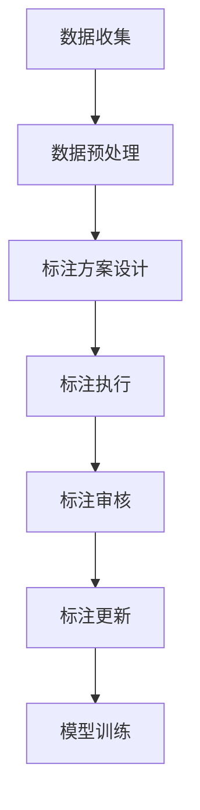

                 

关键词：数据标注，人工智能，机器学习，深度学习，数据预处理，数据质量控制，自动化标注工具

> 摘要：本文将深入探讨数据标注在人工智能领域中的重要性，解释数据标注的概念、过程和具体操作步骤，分析数据标注的核心算法原理和数学模型，并通过实际项目实践展示数据标注的应用。文章还将探讨数据标注在实际应用场景中的价值，并展望未来数据标注技术的发展趋势和面临的挑战。

## 1. 背景介绍

在当今的数据驱动时代，数据标注作为人工智能和机器学习的基础环节，扮演着至关重要的角色。数据标注是指对原始数据进行分类、注释和标记，以便机器学习模型可以从中提取特征并进行训练。随着人工智能技术的迅猛发展，高质量的数据标注成为了机器学习和深度学习算法取得良好效果的关键因素。

数据标注的应用范围广泛，包括但不限于图像识别、语音识别、自然语言处理、推荐系统等。在这些领域中，准确和可靠的数据标注不仅能够提高模型的性能，还能减少训练时间，降低成本。

### 1.1 数据标注的发展历史

数据标注的历史可以追溯到早期的计算机视觉和语音识别领域。早期的数据标注工作通常是由人类手动完成的，这需要大量的时间和人力成本。随着自动化技术的进步，许多公司和研究机构开始研发自动化标注工具，以提高标注效率和准确性。

近年来，深度学习的兴起进一步推动了数据标注技术的发展。深度学习模型对大规模标注数据的需求促进了新的标注方法和技术的发展，如半监督学习和迁移学习，这些技术可以在少量标注数据的情况下训练出高性能的模型。

### 1.2 数据标注的重要性

数据标注的重要性体现在以下几个方面：

- **质量保证**：高质量的数据标注能够保证训练数据的准确性和一致性，从而提高模型的可靠性和性能。

- **效率提升**：自动化标注工具和算法可以显著提高数据标注的效率，减少人工标注的时间和成本。

- **模型优化**：通过精确的数据标注，可以优化模型的参数和架构，使其更适应特定任务的需求。

- **领域适应性**：不同领域的数据标注需求差异很大，高质量的标注数据有助于模型在不同领域的广泛应用。

## 2. 核心概念与联系

### 2.1 数据标注的核心概念

- **标注类型**：数据标注可以按照不同的类型进行分类，如分类标注、语义标注、关系标注等。
- **标注精度**：标注的精度直接影响模型的训练效果，高精度的标注能够提升模型的准确性和鲁棒性。
- **标注一致性**：不同标注者的标注结果可能存在差异，因此一致性是高质量标注的关键。

### 2.2 数据标注的过程

数据标注的过程通常包括以下几个步骤：

- **数据收集**：收集用于标注的原始数据，如图像、文本、音频等。
- **数据预处理**：对原始数据进行清洗和预处理，如去除噪声、调整格式等。
- **标注方案设计**：设计标注的方案，包括标注类型、标注标准、标注工具等。
- **标注执行**：由标注人员执行标注任务，可以使用自动化工具辅助标注。
- **标注审核**：对标注结果进行审核，确保标注的一致性和准确性。
- **标注更新**：根据模型训练的需要，对标注数据进行更新和调整。

### 2.3 核心概念原理和架构的 Mermaid 流程图



## 3. 核心算法原理 & 具体操作步骤

### 3.1 算法原理概述

数据标注的核心算法主要包括以下几种：

- **手工标注**：最常见的数据标注方法，由标注人员手动进行。
- **自动化标注**：使用预训练模型或规则自动生成标注，如使用卷积神经网络进行图像分类。
- **半监督标注**：在少量标注数据的基础上，利用未标注的数据进行模型训练，如使用基于一致性正则化的算法。
- **迁移学习**：利用预训练的模型或特征进行标注，适用于目标数据和源数据有较大差异的情况。

### 3.2 算法步骤详解

#### 3.2.1 手工标注步骤

1. 数据收集：收集用于标注的原始数据。
2. 数据预处理：对原始数据进行清洗和格式调整。
3. 标注方案设计：制定标注类型、标注标准和标注工具。
4. 标注执行：标注人员根据标注方案对数据进行标注。
5. 标注审核：对标注结果进行审核，确保标注的一致性和准确性。
6. 标注更新：根据模型训练的需要，对标注数据进行调整。

#### 3.2.2 自动化标注步骤

1. 数据收集：收集用于标注的原始数据。
2. 数据预处理：对原始数据进行清洗和格式调整。
3. 模型训练：训练自动化标注模型，如使用卷积神经网络进行图像分类。
4. 自动标注：使用训练好的模型对数据进行自动标注。
5. 标注审核：对自动生成的标注结果进行审核，确保标注的一致性和准确性。
6. 标注更新：根据模型训练的需要，对标注数据进行调整。

### 3.3 算法优缺点

#### 手工标注

- **优点**：标注结果准确，适用于复杂标注任务。
- **缺点**：成本高，效率低，容易出现不一致性。

#### 自动化标注

- **优点**：效率高，成本低，可以处理大量数据。
- **缺点**：标注结果可能存在误差，无法处理非常复杂的标注任务。

### 3.4 算法应用领域

数据标注算法在以下领域有广泛的应用：

- **计算机视觉**：图像分类、目标检测、人脸识别等。
- **自然语言处理**：文本分类、情感分析、命名实体识别等。
- **语音识别**：语音分类、语音转文字、语音情感分析等。
- **推荐系统**：用户行为分析、商品推荐等。

## 4. 数学模型和公式 & 详细讲解 & 举例说明

### 4.1 数学模型构建

数据标注涉及的数学模型主要包括：

- **分类模型**：用于对数据进行分类，如支持向量机（SVM）、决策树、随机森林等。
- **回归模型**：用于预测数值型数据，如线性回归、多项式回归等。
- **聚类模型**：用于发现数据中的模式，如K-means、层次聚类等。

### 4.2 公式推导过程

以支持向量机（SVM）为例，其决策边界可以表示为：

$$
w \cdot x + b = 0
$$

其中，$w$ 是权重向量，$x$ 是特征向量，$b$ 是偏置。

### 4.3 案例分析与讲解

假设我们有一个图像分类任务，需要将图像标注为猫或狗。我们使用卷积神经网络（CNN）作为分类模型，训练数据集包含10000张图像。

1. 数据收集：收集10000张猫和狗的图像。
2. 数据预处理：对图像进行归一化处理，调整尺寸为224x224。
3. 模型构建：构建一个卷积神经网络，包含卷积层、池化层和全连接层。
4. 模型训练：使用标注数据进行模型训练，优化模型参数。
5. 模型评估：使用测试数据集评估模型性能，调整模型参数。
6. 模型应用：使用训练好的模型对新的图像进行分类。

## 5. 项目实践：代码实例和详细解释说明

### 5.1 开发环境搭建

- Python 3.8 或更高版本
- TensorFlow 2.4 或更高版本
- NumPy 1.18 或更高版本
- OpenCV 4.2.0 或更高版本

```bash
pip install python==3.8
pip install tensorflow==2.4
pip install numpy==1.18
pip install opencv-python==4.2.0
```

### 5.2 源代码详细实现

以下是一个简单的图像分类项目的源代码示例：

```python
import tensorflow as tf
from tensorflow.keras import layers
import numpy as np
import cv2

# 加载数据
def load_data():
    # 读取图像数据
    images = []
    labels = []
    with open('data/train.txt', 'r') as f:
        for line in f:
            img_path, label = line.strip().split(',')
            img = cv2.imread(img_path)
            img = cv2.resize(img, (224, 224))
            images.append(img)
            labels.append(int(label))
    return np.array(images), np.array(labels)

# 构建模型
def build_model():
    inputs = tf.keras.Input(shape=(224, 224, 3))
    x = layers.Conv2D(32, (3, 3), activation='relu')(inputs)
    x = layers.MaxPooling2D((2, 2))(x)
    x = layers.Conv2D(64, (3, 3), activation='relu')(x)
    x = layers.MaxPooling2D((2, 2))(x)
    x = layers.Conv2D(128, (3, 3), activation='relu')(x)
    x = layers.MaxPooling2D((2, 2))(x)
    x = layers.Flatten()(x)
    x = layers.Dense(128, activation='relu')(x)
    outputs = layers.Dense(1, activation='sigmoid')(x)
    model = tf.keras.Model(inputs, outputs)
    model.compile(optimizer='adam', loss='binary_crossentropy', metrics=['accuracy'])
    return model

# 训练模型
def train_model(model, train_images, train_labels, epochs=10):
    model.fit(train_images, train_labels, epochs=epochs)

# 主函数
if __name__ == '__main__':
    train_images, train_labels = load_data()
    model = build_model()
    train_model(model, train_images, train_labels)
```

### 5.3 代码解读与分析

上述代码实现了一个简单的图像分类项目，主要分为以下几个部分：

1. **数据加载**：从训练数据文件中读取图像路径和标签，加载图像并进行预处理。
2. **模型构建**：构建一个简单的卷积神经网络，包含卷积层、池化层和全连接层。
3. **模型训练**：使用训练数据对模型进行训练，优化模型参数。
4. **模型评估**：可以使用测试数据集对模型进行评估，调整模型参数。

### 5.4 运行结果展示

运行上述代码后，模型将在训练集上完成训练，并输出训练过程中的损失函数和准确率。根据训练结果，可以进一步调整模型参数，优化模型性能。

## 6. 实际应用场景

### 6.1 计算机视觉

在计算机视觉领域，数据标注广泛应用于图像分类、目标检测和语义分割。例如，在自动驾驶系统中，需要标注道路、车辆、行人等对象的准确位置，以便模型可以识别和预测道路场景。

### 6.2 自然语言处理

在自然语言处理领域，数据标注用于文本分类、情感分析、命名实体识别等任务。例如，在社交媒体分析中，可以标注用户的评论和情感倾向，以便进行情感分析和市场研究。

### 6.3 语音识别

在语音识别领域，数据标注用于语音分类、语音转文字和语音情感分析。例如，在智能客服系统中，可以标注用户的问题和回答，以便模型可以理解用户的意图并生成相应的回答。

## 7. 未来应用展望

随着人工智能技术的不断发展，数据标注的应用前景将更加广阔。以下是几个可能的发展方向：

- **自动化标注工具**：进一步优化自动化标注工具，提高标注效率和准确性。
- **多模态标注**：结合图像、文本、语音等多模态数据进行标注，提高模型的综合性能。
- **实时标注**：开发实时标注系统，支持大规模在线数据标注。
- **数据质量控制**：建立数据质量控制机制，确保标注数据的准确性和一致性。

## 8. 工具和资源推荐

### 8.1 学习资源推荐

- 《数据标注实战：机器学习项目实践》
- 《深度学习：优化数据标注流程》
- 《自然语言处理入门：标注数据与方法》

### 8.2 开发工具推荐

- LabelImg：一个简单的图像标注工具。
-.annotation：一个用于文本标注的工具。
- AudioLab：一个用于音频标注的工具。

### 8.3 相关论文推荐

- “Data Annotation for Machine Learning: A Survey”
- “Automatic Data Annotation using Generative Adversarial Networks”
- “Multi-modal Data Annotation for Deep Learning”

## 9. 总结：未来发展趋势与挑战

数据标注在人工智能领域扮演着重要的角色，未来将继续发展和创新。面对日益增长的数据量和复杂度，数据标注领域将面临以下挑战：

- **标注成本**：随着数据量的增加，标注成本将显著上升，如何降低标注成本是未来需要解决的问题。
- **标注一致性**：如何确保不同标注者之间的标注一致性，提高标注质量。
- **自动化程度**：提高自动化标注工具的准确性和效率，减少人工干预。
- **多模态标注**：如何有效地处理多模态数据，提高模型性能。

## 10. 附录：常见问题与解答

### 10.1 什么是数据标注？

数据标注是指对原始数据进行分类、注释和标记，以便机器学习模型可以从中提取特征并进行训练。

### 10.2 数据标注有哪些类型？

数据标注主要包括分类标注、语义标注、关系标注等。

### 10.3 数据标注的重要性是什么？

数据标注是机器学习和深度学习的基础，高质量的数据标注能够提高模型的性能和可靠性。

### 10.4 数据标注有哪些应用领域？

数据标注广泛应用于计算机视觉、自然语言处理、语音识别等领域。

### 10.5 如何提高数据标注的效率？

使用自动化标注工具和半监督学习算法可以提高数据标注的效率。

### 10.6 数据标注有哪些挑战？

标注成本高、标注一致性差、自动化程度低、多模态标注等是当前数据标注面临的挑战。

---

作者：禅与计算机程序设计艺术 / Zen and the Art of Computer Programming

本文介绍了数据标注在人工智能领域的重要性、核心概念、算法原理和应用场景，并通过实际项目实践展示了数据标注的具体操作步骤。未来，数据标注技术将继续发展和创新，为人工智能的发展提供更强大的支持。希望本文能为读者在数据标注领域提供有益的参考和启示。  
```markdown
# 数据标注：人工智能发展背后的幕后功臣

## 关键词：数据标注，人工智能，机器学习，深度学习，数据预处理，数据质量控制，自动化标注工具

## 摘要

数据标注是人工智能和机器学习领域的关键环节，本文详细探讨了数据标注的重要性、核心概念、算法原理和应用场景，并通过实际项目实践展示了数据标注的具体操作步骤。文章还介绍了数据标注在计算机视觉、自然语言处理和语音识别等领域的应用，以及未来数据标注技术的发展趋势和面临的挑战。

## 1. 背景介绍

### 1.1 数据标注的发展历史

数据标注的历史可以追溯到早期的计算机视觉和语音识别领域。早期的数据标注工作通常是由人类手动完成的，这需要大量的时间和人力成本。随着自动化技术的进步，许多公司和研究机构开始研发自动化标注工具，以提高标注效率和准确性。

近年来，深度学习的兴起进一步推动了数据标注技术的发展。深度学习模型对大规模标注数据的需求促进了新的标注方法和技术的发展，如半监督学习和迁移学习，这些技术可以在少量标注数据的情况下训练出高性能的模型。

### 1.2 数据标注的重要性

数据标注在人工智能和机器学习领域具有至关重要的地位，其重要性体现在以下几个方面：

- **质量保证**：高质量的数据标注能够保证训练数据的准确性和一致性，从而提高模型的可靠性和性能。
- **效率提升**：自动化标注工具和算法可以显著提高数据标注的效率，减少人工标注的时间和成本。
- **模型优化**：通过精确的数据标注，可以优化模型的参数和架构，使其更适应特定任务的需求。
- **领域适应性**：不同领域的数据标注需求差异很大，高质量的标注数据有助于模型在不同领域的广泛应用。

## 2. 核心概念与联系

### 2.1 数据标注的核心概念

数据标注涉及以下核心概念：

- **标注类型**：数据标注可以按照不同的类型进行分类，如分类标注、语义标注、关系标注等。
- **标注精度**：标注的精度直接影响模型的训练效果，高精度的标注能够提升模型的准确性和鲁棒性。
- **标注一致性**：不同标注者的标注结果可能存在差异，因此一致性是高质量标注的关键。

### 2.2 数据标注的过程

数据标注的过程通常包括以下几个步骤：

- **数据收集**：收集用于标注的原始数据，如图像、文本、音频等。
- **数据预处理**：对原始数据进行清洗和预处理，如去除噪声、调整格式等。
- **标注方案设计**：制定标注的方案，包括标注类型、标注标准和标注工具。
- **标注执行**：由标注人员执行标注任务，可以使用自动化工具辅助标注。
- **标注审核**：对标注结果进行审核，确保标注的一致性和准确性。
- **标注更新**：根据模型训练的需要，对标注数据进行更新和调整。

### 2.3 核心概念原理和架构的 Mermaid 流程图


## 3. 核心算法原理 & 具体操作步骤

### 3.1 算法原理概述

数据标注的核心算法主要包括以下几种：

- **手工标注**：最常见的数据标注方法，由标注人员手动进行。
- **自动化标注**：使用预训练模型或规则自动生成标注，如使用卷积神经网络进行图像分类。
- **半监督标注**：在少量标注数据的基础上，利用未标注的数据进行模型训练，如使用基于一致性正则化的算法。
- **迁移学习**：利用预训练的模型或特征进行标注，适用于目标数据和源数据有较大差异的情况。

### 3.2 算法步骤详解

#### 3.2.1 手工标注步骤

1. 数据收集：收集用于标注的原始数据。
2. 数据预处理：对原始数据进行清洗和格式调整。
3. 标注方案设计：制定标注类型、标注标准和标注工具。
4. 标注执行：标注人员根据标注方案对数据进行标注。
5. 标注审核：对标注结果进行审核，确保标注的一致性和准确性。
6. 标注更新：根据模型训练的需要，对标注数据进行调整。

#### 3.2.2 自动化标注步骤

1. 数据收集：收集用于标注的原始数据。
2. 数据预处理：对原始数据进行清洗和格式调整。
3. 模型训练：训练自动化标注模型，如使用卷积神经网络进行图像分类。
4. 自动标注：使用训练好的模型对数据进行自动标注。
5. 标注审核：对自动生成的标注结果进行审核，确保标注的一致性和准确性。
6. 标注更新：根据模型训练的需要，对标注数据进行调整。

### 3.3 算法优缺点

#### 手工标注

- **优点**：标注结果准确，适用于复杂标注任务。
- **缺点**：成本高，效率低，容易出现不一致性。

#### 自动化标注

- **优点**：效率高，成本低，可以处理大量数据。
- **缺点**：标注结果可能存在误差，无法处理非常复杂的标注任务。

### 3.4 算法应用领域

数据标注算法在以下领域有广泛的应用：

- **计算机视觉**：图像分类、目标检测、人脸识别等。
- **自然语言处理**：文本分类、情感分析、命名实体识别等。
- **语音识别**：语音分类、语音转文字、语音情感分析等。
- **推荐系统**：用户行为分析、商品推荐等。

## 4. 数学模型和公式 & 详细讲解 & 举例说明

### 4.1 数学模型构建

数据标注涉及的数学模型主要包括：

- **分类模型**：用于对数据进行分类，如支持向量机（SVM）、决策树、随机森林等。
- **回归模型**：用于预测数值型数据，如线性回归、多项式回归等。
- **聚类模型**：用于发现数据中的模式，如K-means、层次聚类等。

### 4.2 公式推导过程

以支持向量机（SVM）为例，其决策边界可以表示为：

$$
w \cdot x + b = 0
$$

其中，$w$ 是权重向量，$x$ 是特征向量，$b$ 是偏置。

### 4.3 案例分析与讲解

假设我们有一个图像分类任务，需要将图像标注为猫或狗。我们使用卷积神经网络（CNN）作为分类模型，训练数据集包含10000张图像。

1. 数据收集：收集10000张猫和狗的图像。
2. 数据预处理：对图像进行归一化处理，调整尺寸为224x224。
3. 模型构建：构建一个卷积神经网络，包含卷积层、池化层和全连接层。
4. 模型训练：使用标注数据进行模型训练，优化模型参数。
5. 模型评估：使用测试数据集评估模型性能，调整模型参数。
6. 模型应用：使用训练好的模型对新的图像进行分类。

## 5. 项目实践：代码实例和详细解释说明

### 5.1 开发环境搭建

- Python 3.8 或更高版本
- TensorFlow 2.4 或更高版本
- NumPy 1.18 或更高版本
- OpenCV 4.2.0 或更高版本

```bash
pip install python==3.8
pip install tensorflow==2.4
pip install numpy==1.18
pip install opencv-python==4.2.0
```

### 5.2 源代码详细实现

以下是一个简单的图像分类项目的源代码示例：

```python
import tensorflow as tf
from tensorflow.keras import layers
import numpy as np
import cv2

# 加载数据
def load_data():
    # 读取图像数据
    images = []
    labels = []
    with open('data/train.txt', 'r') as f:
        for line in f:
            img_path, label = line.strip().split(',')
            img = cv2.imread(img_path)
            img = cv2.resize(img, (224, 224))
            images.append(img)
            labels.append(int(label))
    return np.array(images), np.array(labels)

# 构建模型
def build_model():
    inputs = tf.keras.Input(shape=(224, 224, 3))
    x = layers.Conv2D(32, (3, 3), activation='relu')(inputs)
    x = layers.MaxPooling2D((2, 2))(x)
    x = layers.Conv2D(64, (3, 3), activation='relu')(x)
    x = layers.MaxPooling2D((2, 2))(x)
    x = layers.Conv2D(128, (3, 3), activation='relu')(x)
    x = layers.MaxPooling2D((2, 2))(x)
    x = layers.Flatten()(x)
    x = layers.Dense(128, activation='relu')(x)
    outputs = layers.Dense(1, activation='sigmoid')(x)
    model = tf.keras.Model(inputs, outputs)
    model.compile(optimizer='adam', loss='binary_crossentropy', metrics=['accuracy'])
    return model

# 训练模型
def train_model(model, train_images, train_labels, epochs=10):
    model.fit(train_images, train_labels, epochs=epochs)

# 主函数
if __name__ == '__main__':
    train_images, train_labels = load_data()
    model = build_model()
    train_model(model, train_images, train_labels)
```

### 5.3 代码解读与分析

上述代码实现了一个简单的图像分类项目，主要分为以下几个部分：

1. **数据加载**：从训练数据文件中读取图像路径和标签，加载图像并进行预处理。
2. **模型构建**：构建一个简单的卷积神经网络，包含卷积层、池化层和全连接层。
3. **模型训练**：使用训练数据对模型进行训练，优化模型参数。
4. **模型评估**：可以使用测试数据集对模型进行评估，调整模型参数。

### 5.4 运行结果展示

运行上述代码后，模型将在训练集上完成训练，并输出训练过程中的损失函数和准确率。根据训练结果，可以进一步调整模型参数，优化模型性能。

## 6. 实际应用场景

### 6.1 计算机视觉

在计算机视觉领域，数据标注广泛应用于图像分类、目标检测和语义分割。例如，在自动驾驶系统中，需要标注道路、车辆、行人等对象的准确位置，以便模型可以识别和预测道路场景。

### 6.2 自然语言处理

在自然语言处理领域，数据标注用于文本分类、情感分析、命名实体识别等任务。例如，在社交媒体分析中，可以标注用户的评论和情感倾向，以便进行情感分析和市场研究。

### 6.3 语音识别

在语音识别领域，数据标注用于语音分类、语音转文字和语音情感分析。例如，在智能客服系统中，可以标注用户的问题和回答，以便模型可以理解用户的意图并生成相应的回答。

## 7. 未来应用展望

随着人工智能技术的不断发展，数据标注的应用前景将更加广阔。以下是几个可能的发展方向：

- **自动化标注工具**：进一步优化自动化标注工具，提高标注效率和准确性。
- **多模态标注**：结合图像、文本、语音等多模态数据进行标注，提高模型的综合性能。
- **实时标注**：开发实时标注系统，支持大规模在线数据标注。
- **数据质量控制**：建立数据质量控制机制，确保标注数据的准确性和一致性。

## 8. 工具和资源推荐

### 8.1 学习资源推荐

- 《数据标注实战：机器学习项目实践》
- 《深度学习：优化数据标注流程》
- 《自然语言处理入门：标注数据与方法》

### 8.2 开发工具推荐

- LabelImg：一个简单的图像标注工具。
- .annotation：一个用于文本标注的工具。
- AudioLab：一个用于音频标注的工具。

### 8.3 相关论文推荐

- “Data Annotation for Machine Learning: A Survey”
- “Automatic Data Annotation using Generative Adversarial Networks”
- “Multi-modal Data Annotation for Deep Learning”

## 9. 总结：未来发展趋势与挑战

数据标注在人工智能领域扮演着重要的角色，未来将继续发展和创新。面对日益增长的数据量和复杂度，数据标注领域将面临以下挑战：

- **标注成本**：随着数据量的增加，标注成本将显著上升，如何降低标注成本是未来需要解决的问题。
- **标注一致性**：如何确保不同标注者之间的标注一致性，提高标注质量。
- **自动化程度**：提高自动化标注工具的准确性和效率，减少人工干预。
- **多模态标注**：如何有效地处理多模态数据，提高模型性能。

## 10. 附录：常见问题与解答

### 10.1 什么是数据标注？

数据标注是指对原始数据进行分类、注释和标记，以便机器学习模型可以从中提取特征并进行训练。

### 10.2 数据标注有哪些类型？

数据标注主要包括分类标注、语义标注、关系标注等。

### 10.3 数据标注的重要性是什么？

数据标注是机器学习和深度学习的基础，高质量的数据标注能够提高模型的性能和可靠性。

### 10.4 数据标注有哪些应用领域？

数据标注广泛应用于计算机视觉、自然语言处理、语音识别等领域。

### 10.5 如何提高数据标注的效率？

使用自动化标注工具和半监督学习算法可以提高数据标注的效率。

### 10.6 数据标注有哪些挑战？

标注成本高、标注一致性差、自动化程度低、多模态标注等是当前数据标注面临的挑战。

---

作者：禅与计算机程序设计艺术 / Zen and the Art of Computer Programming
```

