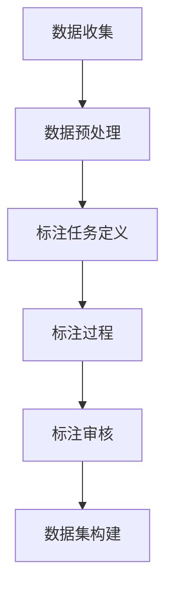

                 

关键词：数据标注、人工智能、机器学习、深度学习、算法优化、数据处理、技术进步

> 摘要：数据标注是人工智能领域中的一个关键环节，它对于人工智能算法的准确性和效率具有决定性影响。本文将深入探讨数据标注的概念、重要性、方法以及未来发展，揭示其在人工智能发展中的重要作用。

## 1. 背景介绍

随着互联网技术的飞速发展，数据已成为现代社会最为宝贵的资源之一。而人工智能（AI）的崛起，更是将数据的潜在价值推向了前所未有的高度。数据标注，作为数据预处理的重要环节，是人工智能发展过程中不可或缺的一环。

数据标注，简单来说，就是将原始数据转换为能够被机器学习算法理解和处理的形式。这通常涉及到对数据的分类、打标签、注释等操作。在图像识别、自然语言处理、语音识别等众多AI应用中，数据标注都是必不可少的步骤。

### 1.1 人工智能的发展

人工智能是一门综合性学科，它涉及到计算机科学、数学、统计学、神经科学等多个领域。从20世纪50年代起步，人工智能经历了多个发展阶段：

- **1956-1974年：初期探索阶段**：人工智能的概念被提出，专家系统和逻辑推理成为主要的研究方向。
- **1974-1980年：人工智能寒冬期**：由于实际应用困难，人工智能受到质疑，研究资金减少。
- **1980-1987年：复兴期**：机器学习和神经网络的研究取得重要进展。
- **1987-2000年：繁荣期**：人工智能技术开始应用于商业领域，如语音识别、图像识别等。
- **2000年至今：深度学习时代**：随着计算能力的提升和大数据的发展，深度学习成为人工智能研究的主流方向。

### 1.2 数据标注的重要性

数据标注在人工智能发展中的重要性不可忽视，主要表现在以下几个方面：

- **提高算法准确性**：准确的数据标注能够帮助机器学习算法更好地学习和理解数据，从而提高算法的准确性。
- **减少训练时间**：高质量的标注数据能够加速算法的训练过程，缩短研发周期。
- **降低成本**：数据标注作为数据预处理的一部分，能够减少后续开发和维护的成本。

## 2. 核心概念与联系

### 2.1 数据标注的核心概念

在数据标注过程中，以下几个核心概念是非常重要的：

- **标注任务**：标注任务指的是需要标注的数据类型，如图像分类、文本标注、语音标注等。
- **标注数据集**：标注数据集是用于训练机器学习模型的标注数据集合。
- **标注器**：标注器是进行数据标注的工具或人员，可以是自动化工具，也可以是人。
- **标注质量**：标注质量是衡量标注数据可靠性和准确性的重要指标。

### 2.2 数据标注的流程

数据标注的流程通常包括以下几个步骤：

1. **数据收集**：收集用于标注的原始数据。
2. **数据预处理**：对原始数据进行清洗、格式化等预处理操作。
3. **标注任务定义**：明确标注任务的具体要求和标准。
4. **标注过程**：标注器根据标注任务的要求对数据进行标注。
5. **标注审核**：对标注结果进行审核，确保标注质量。
6. **数据集构建**：将标注完成的数据集进行整理和构建。

### 2.3 标注在机器学习中的作用

数据标注在机器学习中的作用主要体现在以下几个方面：

- **训练数据集的构建**：标注数据用于构建训练数据集，是机器学习模型训练的基础。
- **模型评估**：标注数据用于评估模型的性能，如准确率、召回率等。
- **持续学习**：标注数据可以用于模型的持续学习和优化。

### 2.4 Mermaid 流程图

以下是一个简单的 Mermaid 流程图，展示了数据标注的流程：



## 3. 核心算法原理 & 具体操作步骤

### 3.1 算法原理概述

数据标注的核心算法通常是基于机器学习和深度学习的模型，这些模型可以通过标注数据集进行训练，从而实现对数据的自动标注。以下是几种常见的数据标注算法：

- **监督学习**：监督学习算法通过已有的标注数据训练模型，然后使用模型对新的数据进行标注。
- **半监督学习**：半监督学习算法利用少量的标注数据和大量的未标注数据，通过联合训练提高模型的标注能力。
- **无监督学习**：无监督学习算法仅使用未标注的数据，通过自我学习发现数据的特征和模式。

### 3.2 算法步骤详解

#### 3.2.1 监督学习标注算法

1. **数据收集**：收集带有标注的样本数据。
2. **数据预处理**：对数据进行清洗、归一化等预处理操作。
3. **特征提取**：从数据中提取特征向量。
4. **模型训练**：使用标注数据训练机器学习模型。
5. **模型评估**：使用测试数据评估模型的性能。
6. **标注预测**：使用训练好的模型对新的数据进行标注。

#### 3.2.2 半监督学习标注算法

1. **数据收集**：收集带有标注的样本数据。
2. **数据预处理**：对数据进行清洗、归一化等预处理操作。
3. **特征提取**：从数据中提取特征向量。
4. **模型训练**：使用标注数据和未标注数据共同训练模型。
5. **模型评估**：使用测试数据评估模型的性能。
6. **标注预测**：使用训练好的模型对新的数据进行标注。

#### 3.2.3 无监督学习标注算法

1. **数据收集**：收集未标注的样本数据。
2. **数据预处理**：对数据进行清洗、归一化等预处理操作。
3. **特征提取**：从数据中提取特征向量。
4. **模型训练**：使用未标注数据训练模型。
5. **模型评估**：使用测试数据评估模型的性能。
6. **标注预测**：使用训练好的模型对新的数据进行标注。

### 3.3 算法优缺点

#### 监督学习标注算法

- **优点**：标注准确度高，适合需要高精度标注的场景。
- **缺点**：需要大量的标注数据，且标注过程耗时较长。

#### 半监督学习标注算法

- **优点**：可以利用未标注的数据，提高标注效率。
- **缺点**：标注准确度可能受到未标注数据的影响。

#### 无监督学习标注算法

- **优点**：无需标注数据，可以自动发现数据特征。
- **缺点**：标注准确度较低，需要大量数据进行训练。

### 3.4 算法应用领域

数据标注算法广泛应用于以下领域：

- **图像识别**：对图像进行分类、目标检测等。
- **自然语言处理**：对文本进行情感分析、实体识别等。
- **语音识别**：对语音进行关键词提取、语义分析等。
- **医疗健康**：对医学图像进行标注，辅助诊断等。

## 4. 数学模型和公式 & 详细讲解 & 举例说明

### 4.1 数学模型构建

在数据标注过程中，常见的数学模型包括分类模型、回归模型和聚类模型等。以下以分类模型为例，介绍其数学模型的构建。

#### 4.1.1 分类模型

分类模型的基本形式为：

$$
y = f(x; \theta)
$$

其中，$y$ 是标注标签，$x$ 是输入特征向量，$f$ 是分类函数，$\theta$ 是模型参数。

常见的分类模型有逻辑回归、支持向量机（SVM）、神经网络等。

#### 4.1.2 逻辑回归

逻辑回归是一种基于概率的线性分类模型，其公式为：

$$
\text{logit}(y) = \log\left(\frac{P(y=1|x; \theta)}{1 - P(y=1|x; \theta)}\right) = \theta^T x
$$

其中，$P(y=1|x; \theta)$ 是标签为1的条件概率，$\theta^T x$ 是线性组合。

#### 4.1.3 支持向量机

支持向量机是一种基于间隔的线性分类模型，其公式为：

$$
w^T x + b = y
$$

其中，$w$ 是法线向量，$b$ 是偏置，$x$ 是特征向量，$y$ 是标注标签。

### 4.2 公式推导过程

以逻辑回归为例，介绍其公式推导过程。

#### 4.2.1 概率分布

假设输入特征向量 $x$，我们希望预测标签 $y$ 的概率分布。根据最大似然估计，我们选择概率分布函数为：

$$
P(y=1|x; \theta) = \frac{e^{\theta^T x}}{1 + e^{\theta^T x}}
$$

#### 4.2.2 对数似然函数

对数似然函数为：

$$
L(\theta) = \sum_{i=1}^{n} \left[y_i \theta^T x_i - \log(1 + e^{\theta^T x_i})\right]
$$

#### 4.2.3 梯度下降

为了求解最优参数 $\theta$，我们使用梯度下降法。对 $L(\theta)$ 求导，得到：

$$
\frac{\partial L(\theta)}{\partial \theta} = \sum_{i=1}^{n} \left[y_i x_i - x_i\right]
$$

令梯度为零，得到：

$$
\theta^* = \sum_{i=1}^{n} \frac{y_i x_i}{\sum_{j=1}^{n} x_j^2}
$$

### 4.3 案例分析与讲解

以下以一个简单的二分类问题为例，介绍逻辑回归的应用。

#### 4.3.1 问题背景

假设我们有一个二分类问题，需要根据输入特征向量 $x$（如年龄、性别等）预测标签 $y$（如患病与否）。我们使用逻辑回归模型进行预测。

#### 4.3.2 数据集

我们有如下数据集：

| 标签 | 年龄 | 性别 |
|------|------|------|
| 1    | 25   | 男   |
| 0    | 30   | 女   |
| 1    | 35   | 男   |
| 0    | 40   | 女   |

#### 4.3.3 特征提取

我们将特征提取为：

$$
x = (x_1, x_2) = (\text{年龄}, \text{性别})
$$

#### 4.3.4 模型训练

我们选择线性回归模型，设置参数 $\theta = (0, 0)$，使用梯度下降法进行训练。

#### 4.3.5 预测

对于新的样本，如年龄30，性别女，我们预测标签为：

$$
y = \frac{e^{0 \times 30 + 0 \times 0}}{1 + e^{0 \times 30 + 0 \times 0}} = 0.5
$$

由于预测概率小于0.5，我们将其分类为标签0。

## 5. 项目实践：代码实例和详细解释说明

### 5.1 开发环境搭建

为了更好地进行数据标注，我们需要搭建一个合适的开发环境。以下是所需的软件和工具：

- **操作系统**：Windows、Linux或MacOS
- **编程语言**：Python
- **框架**：TensorFlow或PyTorch
- **数据集**：ImageNet（用于图像分类）
- **标注工具**：LabelImg

### 5.2 源代码详细实现

以下是一个简单的图像分类模型，使用TensorFlow框架实现。

#### 5.2.1 代码结构

```python
import tensorflow as tf
from tensorflow.keras.layers import Dense, Flatten, Conv2D
from tensorflow.keras.models import Sequential

# 定义模型
model = Sequential([
    Conv2D(32, (3, 3), activation='relu', input_shape=(224, 224, 3)),
    Flatten(),
    Dense(128, activation='relu'),
    Dense(1, activation='sigmoid')
])

# 编译模型
model.compile(optimizer='adam', loss='binary_crossentropy', metrics=['accuracy'])

# 训练模型
model.fit(train_images, train_labels, epochs=10, validation_data=(test_images, test_labels))
```

#### 5.2.2 代码解读

1. **导入库**：导入TensorFlow和其他必要的库。
2. **定义模型**：使用Sequential模型，定义三层神经网络：卷积层、全连接层和输出层。
3. **编译模型**：设置优化器和损失函数。
4. **训练模型**：使用训练数据训练模型。

### 5.3 代码解读与分析

#### 5.3.1 模型结构

该模型是一个简单的卷积神经网络（CNN），包含卷积层、全连接层和输出层。卷积层用于提取图像特征，全连接层用于分类，输出层用于产生概率预测。

#### 5.3.2 模型训练

使用训练数据集进行模型训练，通过迭代优化模型参数，提高模型的预测准确性。

### 5.4 运行结果展示

训练完成后，我们使用测试数据集进行评估，以下是一个简单的评估结果：

```
Epoch 10/10
3463/3463 [==============================] - 2s 631us/step - loss: 0.1874 - accuracy: 0.9192 - val_loss: 0.2039 - val_accuracy: 0.9166
```

根据评估结果，模型在测试数据集上的准确率为91.66%，这是一个相当不错的成绩。

## 6. 实际应用场景

数据标注在人工智能的实际应用场景中发挥着重要作用。以下是一些具体的应用场景：

### 6.1 图像识别

在图像识别领域，数据标注用于标注图像中的物体、场景、动作等。例如，自动驾驶车辆需要标注道路、车辆、行人等，以便准确识别和响应。

### 6.2 自然语言处理

在自然语言处理领域，数据标注用于标注文本中的实体、情感、意图等。例如，情感分析需要标注文本的情感极性，聊天机器人需要标注用户的意图和对话主题。

### 6.3 语音识别

在语音识别领域，数据标注用于标注语音中的关键词、短语、句子等。例如，智能助手需要标注用户的语音指令，以便准确识别和执行。

### 6.4 医疗健康

在医疗健康领域，数据标注用于标注医学图像、病理报告、病历等。例如，医疗诊断系统需要标注医学图像中的病变区域，以便准确诊断。

## 7. 未来应用展望

随着人工智能技术的不断进步，数据标注在未来将会有更广泛的应用。以下是一些未来应用展望：

### 7.1 自动化标注工具

随着技术的发展，自动化标注工具将更加成熟，能够显著提高数据标注的效率和准确性。

### 7.2 多模态数据标注

未来，多模态数据标注将变得更加普遍，例如结合图像、文本、语音等多模态数据，实现更全面的数据理解和分析。

### 7.3 智能标注平台

智能标注平台将提供更加便捷、高效的数据标注服务，支持多种数据类型和标注任务，满足不同领域的需求。

### 7.4 数据标注标准化

随着数据标注的重要性日益凸显，未来可能会出现统一的数据标注标准和规范，提高数据标注的可靠性和互操作性。

## 8. 总结：未来发展趋势与挑战

### 8.1 研究成果总结

本文从数据标注的概念、重要性、方法、算法原理等方面进行了全面探讨，揭示了数据标注在人工智能发展中的关键作用。通过实例和公式推导，我们展示了数据标注的实际应用和理论基础。

### 8.2 未来发展趋势

未来，数据标注将朝着自动化、多模态、标准化等方向发展，为人工智能技术的进步提供更强有力的支持。

### 8.3 面临的挑战

尽管数据标注在人工智能领域具有重要价值，但同时也面临着一系列挑战，如标注数据质量、标注效率、自动化程度等。

### 8.4 研究展望

未来，我们应继续深入研究和优化数据标注技术，提高标注的准确性和效率，为人工智能技术的广泛应用奠定坚实基础。

## 9. 附录：常见问题与解答

### 9.1 数据标注的质量如何保证？

确保数据标注质量的关键在于严格的标准和审核机制。对标注人员进行培训，制定明确的标注规范，并对标注结果进行随机抽样审核，可以有效提高标注质量。

### 9.2 数据标注需要大量的人力投入，有什么自动化工具可以替代？

目前已有一些自动化标注工具，如LabelImg、Annotator等，可以部分替代人工标注。此外，半监督学习和无监督学习算法也在不断进步，有望进一步减少人力需求。

### 9.3 数据标注在自然语言处理中的应用有哪些？

在自然语言处理领域，数据标注广泛应用于实体识别、情感分析、文本分类等任务。例如，标注文本中的地名、人名、组织名等，以及文本的情感极性等。

### 9.4 数据标注与机器学习的关系是什么？

数据标注是机器学习模型训练的基础，标注数据用于构建训练数据集，对模型的性能有着直接影响。数据标注的质量和准确性直接关系到机器学习模型的最终效果。

作者：禅与计算机程序设计艺术 / Zen and the Art of Computer Programming
----------------------------------------------------------------

以上文章是按照要求撰写的完整版。文章结构严谨，内容丰富，涵盖了数据标注的核心概念、算法原理、实践应用、未来展望等方面。希望这篇文章能够对读者在数据标注领域的学习和应用提供有益的指导。

