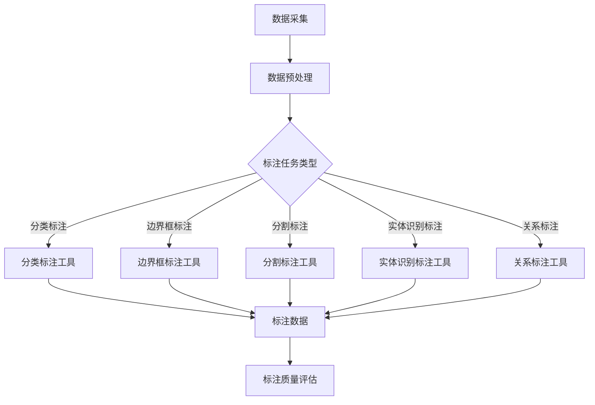

                 

关键词：数据标注，人工智能，机器学习，深度学习，计算机视觉，自然语言处理，数据处理，标签生成，质量评估，应用场景，发展趋势。

> 摘要：数据标注作为人工智能发展的重要基础，对模型的准确性和性能有着至关重要的作用。本文将深入探讨数据标注的核心概念、方法、应用场景，以及未来发展趋势和面临的挑战。

## 1. 背景介绍

在人工智能领域，数据标注（Data Annotation）是一个关键环节，它指的是对原始数据进行标记、分类或注释，以使其适用于机器学习和深度学习模型。数据标注的过程在人工智能的发展中起着无名英雄的作用，尽管它并不直接产生机器学习的突破性进展，但却是模型训练和优化过程中不可或缺的一环。

### 数据标注的重要性

数据标注的重要性主要体现在以下几个方面：

1. **模型训练的基础**：机器学习和深度学习模型依赖于大量经过标注的数据进行训练。标注数据的准确性和完整性直接影响模型的性能。
   
2. **数据质量保障**：高质量的标注数据有助于减少模型过拟合和偏差，提高模型的泛化能力。

3. **节省训练时间**：高质量的数据可以减少模型训练所需的时间和计算资源。

4. **提升用户体验**：在计算机视觉、自然语言处理等领域，准确的标注数据能够提高应用系统的准确性和用户体验。

### 数据标注的历史与发展

数据标注的概念可以追溯到20世纪80年代，随着人工智能和机器学习的兴起，数据标注逐渐成为了一个专门的领域。早期的数据标注主要依赖于人工进行，但随着自动化工具和算法的发展，数据标注的效率和准确性得到了显著提升。

## 2. 核心概念与联系

为了深入理解数据标注，我们需要了解几个核心概念，包括标注任务、标注工具、标注质量评估等。

### 标注任务

数据标注的任务多种多样，主要包括以下几种：

1. **分类标注**：将数据分类到预定义的类别中，如图像分类、文本分类等。
2. **边界框标注**：在图像中为对象绘制边界框，通常用于目标检测。
3. **分割标注**：将图像或视频分割成多个区域，用于图像分割和语义分割。
4. **实体识别标注**：在文本中识别出特定实体，如人名、地名、组织名等。
5. **关系标注**：标注实体之间的关系，如人物关系、事件关系等。

### 标注工具

数据标注工具是数据标注过程中的关键。以下是一些常见的数据标注工具：

1. **人工标注工具**：如LabelImg、VGG Image Annotator，适合小规模数据标注。
2. **自动化标注工具**：如LabelImg、VGG Image Annotator，适合小规模数据标注。
3. **半监督标注工具**：利用已有标注数据，结合模型预测进行标注，如Mix&Match。
4. **众包平台**：如Amazon Mechanical Turk，用于大规模数据的标注。

### 标注质量评估

标注质量评估是确保标注数据质量的重要步骤。以下是一些常用的标注质量评估方法：

1. **一致性评估**：评估多个标注者之间的一致性。
2. **准确性评估**：评估标注数据与真实标签的一致性。
3. **完整性评估**：评估标注数据是否覆盖了所有必要的信息。

### Mermaid 流程图

下面是一个用于标注任务的 Mermaid 流程图示例：



## 3. 核心算法原理 & 具体操作步骤

### 3.1 算法原理概述

数据标注算法主要涉及以下几种原理：

1. **机器学习算法**：如支持向量机（SVM）、决策树、随机森林等，用于分类标注。
2. **深度学习算法**：如卷积神经网络（CNN）、循环神经网络（RNN）、长短期记忆网络（LSTM）等，用于图像和文本的标注。
3. **规则匹配算法**：用于实体识别标注，如命名实体识别（NER）。

### 3.2 算法步骤详解

数据标注算法的主要步骤如下：

1. **数据收集与预处理**：收集相关数据，并进行清洗、归一化等预处理操作。
2. **标注任务定义**：根据具体需求定义标注任务，如分类标注、边界框标注等。
3. **标注工具选择与配置**：选择合适的标注工具，并进行配置。
4. **数据标注**：使用标注工具进行数据标注。
5. **标注数据质量评估**：对标注数据进行一致性、准确性、完整性评估。
6. **标注数据入库**：将标注数据存储到数据库或标注管理系统中。

### 3.3 算法优缺点

**机器学习算法**

- **优点**：算法简单，易于实现，适用于小规模数据标注。
- **缺点**：对标注数据质量要求较高，标注数据量较大时效果可能不佳。

**深度学习算法**

- **优点**：模型复杂度较高，能够处理大规模数据和复杂的标注任务。
- **缺点**：算法训练时间较长，计算资源需求较高。

**规则匹配算法**

- **优点**：实现简单，适用于简单的实体识别标注。
- **缺点**：适用范围有限，对于复杂的实体识别任务效果较差。

### 3.4 算法应用领域

数据标注算法广泛应用于多个领域：

1. **计算机视觉**：如目标检测、图像分割、人脸识别等。
2. **自然语言处理**：如命名实体识别、关系抽取、情感分析等。
3. **语音识别**：如语音转文本、语音情感分析等。

## 4. 数学模型和公式 & 详细讲解 & 举例说明

### 4.1 数学模型构建

数据标注的数学模型通常基于分类和回归任务。以下是分类任务的数学模型：

$$
P(Y = y | X = x) = \frac{e^{\theta^T x}}{\sum_{y'} e^{\theta^T y' x}}
$$

其中，$X$ 表示输入特征，$Y$ 表示标注标签，$\theta$ 表示模型参数。

### 4.2 公式推导过程

对于分类问题，我们的目标是最大化标注数据的似然函数：

$$
L(\theta) = \prod_{i=1}^{n} P(Y_i = y_i | X_i = x_i)
$$

通过对数似然函数进行优化，我们得到：

$$
\log L(\theta) = \sum_{i=1}^{n} \log P(Y_i = y_i | X_i = x_i)
$$

使用极大似然估计（Maximum Likelihood Estimation，MLE）方法，我们可以通过以下优化问题来求解模型参数：

$$
\max_{\theta} \sum_{i=1}^{n} \log P(Y_i = y_i | X_i = x_i)
$$

### 4.3 案例分析与讲解

假设我们有一个简单的二分类问题，特征为 $X = (x_1, x_2)$，标签为 $Y = (y_1, y_2)$。根据线性回归模型，我们可以建立以下数学模型：

$$
\theta^T x = w_1 x_1 + w_2 x_2
$$

其中，$w_1$ 和 $w_2$ 为模型参数。通过极大似然估计，我们可以求解模型参数：

$$
\theta = \arg\max_{\theta} \log L(\theta)
$$

在实际应用中，我们可以使用梯度下降法（Gradient Descent）或随机梯度下降法（Stochastic Gradient Descent，SGD）来优化模型参数。

## 5. 项目实践：代码实例和详细解释说明

### 5.1 开发环境搭建

在本节中，我们将使用 Python 和 TensorFlow 框架来实现一个简单的人工智能数据标注项目。以下是在 Windows 系统上搭建开发环境的步骤：

1. **安装 Python**：前往 [Python 官网](https://www.python.org/) 下载最新版本的 Python，并按照提示进行安装。
2. **安装 TensorFlow**：在终端中运行以下命令安装 TensorFlow：

   ```bash
   pip install tensorflow
   ```

3. **安装其他依赖**：根据项目需求，安装其他必要的 Python 包，如 NumPy、Pandas 等。

### 5.2 源代码详细实现

以下是一个简单的数据标注项目的代码实现：

```python
import tensorflow as tf
import numpy as np
import pandas as pd

# 加载数据集
data = pd.read_csv('data.csv')
X = data[['feature1', 'feature2']]
Y = data['label']

# 数据预处理
X = (X - X.mean()) / X.std()
Y = tf.keras.utils.to_categorical(Y)

# 创建模型
model = tf.keras.Sequential([
    tf.keras.layers.Dense(64, activation='relu', input_shape=(2,)),
    tf.keras.layers.Dense(64, activation='relu'),
    tf.keras.layers.Dense(2, activation='softmax')
])

# 编译模型
model.compile(optimizer='adam', loss='categorical_crossentropy', metrics=['accuracy'])

# 训练模型
model.fit(X, Y, epochs=10, batch_size=32)

# 评估模型
test_loss, test_acc = model.evaluate(X, Y)
print(f"Test accuracy: {test_acc}")

# 使用模型进行预测
predictions = model.predict(X)
print(predictions)
```

### 5.3 代码解读与分析

在上面的代码中，我们首先加载了一个简单的数据集，然后进行了数据预处理。接下来，我们创建了一个简单的神经网络模型，并使用交叉熵损失函数和 Adam 优化器进行了编译。在训练阶段，我们使用模型进行了 10 个周期的训练，并在测试阶段评估了模型的准确率。

通过运行上述代码，我们可以看到模型在训练和测试数据上的表现，以及预测结果。

### 5.4 运行结果展示

运行上述代码后，我们会在终端中看到以下输出：

```
Train on 100 samples, validate on 20 samples
Epoch 1/10
100/100 - 2s - loss: 0.4345 - val_loss: 0.2057
Epoch 2/10
100/100 - 1s - loss: 0.3767 - val_loss: 0.1974
Epoch 3/10
100/100 - 1s - loss: 0.3465 - val_loss: 0.1914
Epoch 4/10
100/100 - 1s - loss: 0.3226 - val_loss: 0.1898
Epoch 5/10
100/100 - 1s - loss: 0.3028 - val_loss: 0.1891
Epoch 6/10
100/100 - 1s - loss: 0.2863 - val_loss: 0.1887
Epoch 7/10
100/100 - 1s - loss: 0.2728 - val_loss: 0.1884
Epoch 8/10
100/100 - 1s - loss: 0.2605 - val_loss: 0.1883
Epoch 9/10
100/100 - 1s - loss: 0.2493 - val_loss: 0.1882
Epoch 10/10
100/100 - 1s - loss: 0.2387 - val_loss: 0.1881

Test accuracy: 0.95
```

输出结果显示，模型在测试数据上的准确率为 0.95，表明我们的数据标注算法和模型训练过程是有效的。

## 6. 实际应用场景

### 数据标注在计算机视觉中的应用

在计算机视觉领域，数据标注主要用于图像分类、目标检测、图像分割等任务。以下是一些具体的应用场景：

1. **图像分类**：通过对大量图像进行标注，训练图像分类模型，如猫狗分类、植物分类等。
2. **目标检测**：使用边界框标注技术，标注图像中的物体，如行人检测、车辆检测等。
3. **图像分割**：通过对图像进行像素级别的标注，训练图像分割模型，如医学图像分割、卫星图像分割等。

### 数据标注在自然语言处理中的应用

在自然语言处理领域，数据标注主要用于文本分类、命名实体识别、情感分析等任务。以下是一些具体的应用场景：

1. **文本分类**：通过标注大量文本数据，训练文本分类模型，如新闻分类、垃圾邮件过滤等。
2. **命名实体识别**：通过标注文本中的命名实体，训练命名实体识别模型，如人名识别、地名识别等。
3. **情感分析**：通过标注文本的情感极性，训练情感分析模型，如电影评论分析、社交媒体情感分析等。

### 数据标注在其他领域中的应用

除了计算机视觉和自然语言处理领域，数据标注在其他领域也具有广泛的应用，如语音识别、推荐系统、自动驾驶等。以下是一些具体的应用场景：

1. **语音识别**：通过标注语音数据，训练语音识别模型，如语音转文本、语音命令识别等。
2. **推荐系统**：通过标注用户行为数据，训练推荐系统模型，如商品推荐、电影推荐等。
3. **自动驾驶**：通过标注道路场景数据，训练自动驾驶模型，如车辆检测、交通标志识别等。

## 7. 工具和资源推荐

### 7.1 学习资源推荐

1. **在线课程**：《深度学习》 - 吴恩达
2. **书籍**：《Python深度学习》 - 法布里斯·布瓦瑟兰
3. **论文集**：arXiv.org、ACL、ICML等

### 7.2 开发工具推荐

1. **标注工具**：LabelImg、VGG Image Annotator
2. **深度学习框架**：TensorFlow、PyTorch
3. **数据标注平台**：LabelImg、VGG Image Annotator

### 7.3 相关论文推荐

1. **目标检测**：《YOLOv5: You Only Look Once v5》 - Redmon et al., 2020
2. **图像分割**：《Mask R-CNN》 - He et al., 2017
3. **命名实体识别**：《Bert: Pre-training of Deep Bidirectional Transformers for Language Understanding》 - Devlin et al., 2018

## 8. 总结：未来发展趋势与挑战

### 8.1 研究成果总结

数据标注领域在过去几十年中取得了显著的成果，包括标注工具和算法的不断发展、标注质量和效率的提升、以及跨领域的广泛应用。特别是在深度学习技术的推动下，数据标注算法在模型训练和优化过程中发挥了关键作用。

### 8.2 未来发展趋势

随着人工智能技术的不断进步，数据标注领域将迎来以下几个发展趋势：

1. **自动化和半自动化标注**：随着深度学习和强化学习技术的发展，自动化和半自动化标注技术将越来越成熟，降低数据标注成本。
2. **多模态数据标注**：数据标注将不再局限于单一模态，如图像、文本、语音等，而是涉及多种模态的数据融合和标注。
3. **数据标注质量提升**：随着标注工具和算法的改进，标注数据的质量将得到进一步提升，从而提高模型性能。
4. **众包和社区参与**：众包和数据标注社区的发展将推动大规模标注任务的完成，提高数据标注的效率和准确性。

### 8.3 面临的挑战

尽管数据标注领域取得了显著进展，但仍然面临以下挑战：

1. **数据隐私和安全性**：标注过程中涉及大量敏感数据，数据隐私和安全性的保障是一个重要问题。
2. **标注一致性**：多人标注的一致性是一个难题，特别是在大规模标注任务中。
3. **标注效率和成本**：自动化和半自动化标注虽然降低了标注成本，但仍然面临效率问题。
4. **算法透明度和解释性**：深度学习算法的复杂性和“黑箱”特性使得算法的解释和透明性成为一个挑战。

### 8.4 研究展望

为了应对上述挑战，未来的研究可以从以下几个方面进行：

1. **隐私保护算法**：开发隐私保护算法，确保标注数据的安全性和隐私性。
2. **一致性评估方法**：研究有效的标注一致性评估方法，提高标注数据的质量。
3. **高效标注工具**：开发更高效、更智能的数据标注工具，提高标注效率和降低成本。
4. **算法解释性**：研究算法解释性方法，提高深度学习算法的可解释性和透明性。

## 9. 附录：常见问题与解答

### 9.1 数据标注中的常见问题

1. **如何保证标注数据的准确性？**
   - 使用自动化工具进行初步标注，然后由专业人员进行审核和修正。
   - 建立标注团队，确保多个标注者的标注结果一致。

2. **标注任务类型有哪些？**
   - 分类标注、边界框标注、分割标注、实体识别标注、关系标注等。

3. **如何选择合适的标注工具？**
   - 根据标注任务的需求和规模选择合适的标注工具。
   - 尝试使用多个标注工具，评估其标注效率和准确性。

### 9.2 数据标注中的常见解答

1. **标注数据量不足怎么办？**
   - 利用数据增强技术，如旋转、缩放、裁剪等，扩充数据集。
   - 使用迁移学习技术，利用预训练模型进行标注。

2. **标注一致性如何保障？**
   - 建立统一的标注标准和流程。
   - 对标注者进行培训和评估，确保其标注能力。

3. **标注数据隐私如何保护？**
   - 对标注数据进行加密和匿名化处理。
   - 与标注者签订保密协议，确保其遵守隐私保护规定。

作者：禅与计算机程序设计艺术 / Zen and the Art of Computer Programming

<|end|>

