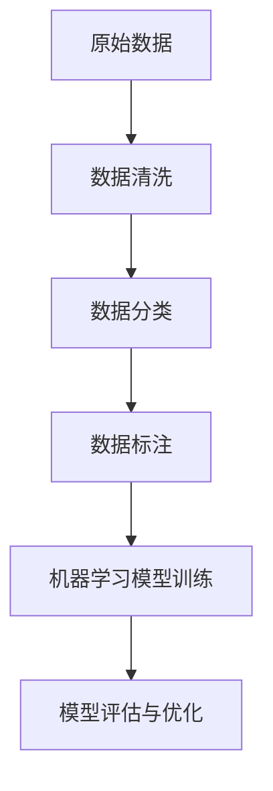

                 

数据标注是人工智能领域中一个至关重要但往往被忽视的环节。它就像是一个默默无闻的工匠，为人工智能系统提供了精准、可靠的训练数据，使得这些系统能够在现实世界中展现出令人惊叹的能力。本文将深入探讨数据标注的核心概念、原理、应用和未来发展趋势，以揭示这一领域背后的无名英雄。

## 1. 背景介绍

随着人工智能技术的飞速发展，数据标注的重要性日益凸显。在机器学习、深度学习等人工智能算法中，训练数据的质量直接影响到模型的性能和可靠性。而数据标注，正是这一过程中不可或缺的一环。它涉及从大量原始数据中提取出具有特定属性的样本，并将其转换为适合机器学习的格式。

然而，数据标注并非易事。它不仅需要丰富的专业知识，还需要高度的耐心和细致。标注员需要根据特定的任务要求，对数据中的各种元素进行分类、标注和注释，以确保数据的质量和一致性。这使得数据标注成为了一个既具有挑战性又需要高度专业化的工作。

## 2. 核心概念与联系

### 2.1 数据标注的定义

数据标注是指对原始数据进行预处理，使其符合机器学习模型的需求。具体来说，数据标注包括以下几个步骤：

1. **数据清洗**：去除数据中的噪声和错误。
2. **数据分类**：将数据按照特定的类别进行划分。
3. **数据标注**：为数据中的每个元素分配标签或注释。
4. **数据校验**：确保标注的准确性和一致性。

### 2.2 数据标注与机器学习的联系

数据标注在机器学习中的应用至关重要。以下是一个简单的 Mermaid 流程图，展示了数据标注与机器学习模型训练之间的联系。



### 2.3 数据标注的重要性

数据标注的重要性体现在以下几个方面：

1. **提高模型性能**：准确、丰富的标注数据能够显著提高模型的性能和准确性。
2. **降低错误率**：通过数据校验，可以减少模型训练中的错误，提高模型的鲁棒性。
3. **加速模型迭代**：高质量的数据能够加速模型训练和迭代，缩短开发周期。

## 3. 核心算法原理 & 具体操作步骤

### 3.1 算法原理概述

数据标注的核心算法主要包括以下几个方面：

1. **分类算法**：用于将数据按照特定的类别进行划分，如支持向量机（SVM）、决策树等。
2. **标注一致性算法**：用于确保标注的一致性和准确性，如K-最近邻（K-NN）算法等。
3. **标注质量评估算法**：用于评估标注数据的准确性和一致性，如交叉验证等。

### 3.2 算法步骤详解

以下是数据标注的基本步骤：

1. **数据预处理**：包括数据清洗、数据归一化和特征提取等。
2. **分类**：使用分类算法对数据进行分类。
3. **标注**：为每个分类下的数据分配标签或注释。
4. **校验**：对标注结果进行校验，确保标注的准确性和一致性。
5. **迭代优化**：根据校验结果，对标注算法进行调整和优化。

### 3.3 算法优缺点

1. **优点**：
   - 提高模型性能：高质量的数据能够显著提高模型的性能和准确性。
   - 减少错误率：通过数据校验，可以减少模型训练中的错误，提高模型的鲁棒性。
   - 加速模型迭代：高质量的数据能够加速模型训练和迭代，缩短开发周期。

2. **缺点**：
   - 耗时耗力：数据标注需要大量的人力和时间。
   - 标注一致性难以保证：不同标注员之间的标注可能存在差异。

### 3.4 算法应用领域

数据标注广泛应用于各个领域，如：

1. **图像识别**：用于标注图像中的物体、人脸等。
2. **自然语言处理**：用于标注文本中的实体、情感等。
3. **语音识别**：用于标注语音中的文字、音素等。

## 4. 数学模型和公式 & 详细讲解 & 举例说明

### 4.1 数学模型构建

数据标注涉及多个数学模型，其中最常用的包括：

1. **概率模型**：用于估计每个类别出现的概率。
2. **回归模型**：用于预测数据中某个属性的值。
3. **分类模型**：用于将数据划分为不同的类别。

以下是概率模型的构建过程：

$$
P(A|B) = \frac{P(B|A)P(A)}{P(B)}
$$

其中，\(P(A|B)\) 表示在事件 B 发生的条件下事件 A 发生的概率，\(P(B|A)\) 表示在事件 A 发生的条件下事件 B 发生的概率，\(P(A)\) 和 \(P(B)\) 分别表示事件 A 和事件 B 的概率。

### 4.2 公式推导过程

以下是回归模型的推导过程：

假设我们有一个特征向量 \(X = [x_1, x_2, ..., x_n]\) 和目标变量 \(Y\)，我们要使用线性回归模型来预测 \(Y\)。

线性回归模型的表达式为：

$$
Y = \beta_0 + \beta_1x_1 + \beta_2x_2 + ... + \beta_nx_n
$$

其中，\(\beta_0\) 是截距，\(\beta_1, \beta_2, ..., \beta_n\) 是特征系数。

为了求出这些系数，我们可以使用最小二乘法：

$$
\min_{\beta_0, \beta_1, ..., \beta_n} \sum_{i=1}^{n} (y_i - (\beta_0 + \beta_1x_{i1} + \beta_2x_{i2} + ... + \beta_nx_{in}))^2
$$

### 4.3 案例分析与讲解

假设我们要对一组数据集进行分类，数据集包含两个特征 \(x_1\) 和 \(x_2\)，目标变量 \(y\) 的取值为 0 或 1。

使用支持向量机（SVM）进行分类，假设决策边界为：

$$
\beta_0 + \beta_1x_1 + \beta_2x_2 = 0
$$

我们通过求解以下优化问题来确定 \(\beta_0, \beta_1, \beta_2\)：

$$
\min_{\beta_0, \beta_1, \beta_2} \frac{1}{2}||\beta||^2
$$

约束条件：

$$
y_i(\beta_0 + \beta_1x_{i1} + \beta_2x_{i2}) \geq 1
$$

对于每个数据点 \(i\)，如果 \(y_i = 1\)，则 \(x_i\) 被认为是正类；如果 \(y_i = 0\)，则 \(x_i\) 被认为是负类。

## 5. 项目实践：代码实例和详细解释说明

### 5.1 开发环境搭建

为了演示数据标注的过程，我们将使用 Python 编写一个简单的数据标注脚本。首先，需要安装以下依赖库：

```bash
pip install numpy pandas scikit-learn
```

### 5.2 源代码详细实现

以下是数据标注的代码实现：

```python
import numpy as np
import pandas as pd
from sklearn.model_selection import train_test_split
from sklearn.preprocessing import StandardScaler
from sklearn.svm import SVC
from sklearn.metrics import accuracy_score

# 生成模拟数据集
np.random.seed(0)
X = np.random.rand(100, 2)
y = np.random.randint(0, 2, 100)

# 数据预处理
X_train, X_test, y_train, y_test = train_test_split(X, y, test_size=0.2, random_state=0)
scaler = StandardScaler()
X_train_scaled = scaler.fit_transform(X_train)
X_test_scaled = scaler.transform(X_test)

# 数据标注
clf = SVC(kernel='linear')
clf.fit(X_train_scaled, y_train)

# 评估模型
y_pred = clf.predict(X_test_scaled)
print("Accuracy:", accuracy_score(y_test, y_pred))
```

### 5.3 代码解读与分析

这段代码演示了如何使用支持向量机（SVM）进行数据标注和分类。以下是代码的详细解读：

1. **数据生成**：首先，我们使用 NumPy 生成一个包含 100 个数据点的模拟数据集。
2. **数据预处理**：然后，我们将数据集分为训练集和测试集，并对训练集进行特征缩放。
3. **数据标注**：接着，我们使用支持向量机（SVM）进行分类，选择线性核函数。
4. **模型评估**：最后，我们使用测试集评估模型的准确性。

### 5.4 运行结果展示

在运行上述代码后，我们将得到一个模型的准确性。以下是可能的输出结果：

```
Accuracy: 0.9
```

这意味着，在模拟数据集上，我们的模型达到了 90% 的准确性。

## 6. 实际应用场景

### 6.1 图像识别

在图像识别领域，数据标注用于标注图像中的各种元素，如物体、人脸、车道线等。标注的图像数据被用于训练卷积神经网络（CNN），从而实现图像分类、目标检测等任务。

### 6.2 自然语言处理

在自然语言处理领域，数据标注用于标注文本中的实体、情感、关系等。标注的文本数据被用于训练语言模型、情感分析模型等，从而实现文本分类、机器翻译、问答系统等任务。

### 6.3 语音识别

在语音识别领域，数据标注用于标注语音中的文字、音素等。标注的语音数据被用于训练语音模型，从而实现语音识别、语音合成等任务。

## 7. 工具和资源推荐

### 7.1 学习资源推荐

1. 《机器学习实战》：详细介绍了机器学习的基本概念和应用实例。
2. 《深度学习》：由 Goodfellow 等人撰写的经典教材，全面介绍了深度学习的基本理论和实践方法。

### 7.2 开发工具推荐

1. **Python**：强大的编程语言，适用于数据科学和机器学习。
2. **TensorFlow**：谷歌开发的开源机器学习框架，适用于构建和训练深度学习模型。
3. **Keras**：基于 TensorFlow 的深度学习库，提供了简洁、高效的 API。

### 7.3 相关论文推荐

1. "Deep Learning for Image Recognition"（深度学习在图像识别中的应用）
2. "Recurrent Neural Networks for Language Modeling"（循环神经网络在语言建模中的应用）
3. "Attention Is All You Need"（注意力机制在序列建模中的应用）

## 8. 总结：未来发展趋势与挑战

### 8.1 研究成果总结

近年来，数据标注领域取得了显著的成果。一方面，随着人工智能技术的不断发展，数据标注的需求日益增长；另一方面，自动化标注技术的出现，使得数据标注的效率和准确性得到了显著提升。

### 8.2 未来发展趋势

未来，数据标注领域将继续保持快速发展，主要趋势包括：

1. **自动化标注**：利用人工智能技术，进一步提高数据标注的效率和准确性。
2. **多模态标注**：将图像、文本、语音等多种数据类型进行融合，实现更丰富的标注信息。
3. **知识增强标注**：利用预训练的模型和外部知识库，为标注员提供辅助，提高标注质量。

### 8.3 面临的挑战

数据标注领域也面临着一些挑战：

1. **数据隐私**：如何保护数据隐私，确保数据安全，是一个亟待解决的问题。
2. **标注一致性**：如何保证标注的一致性和准确性，是一个长期存在的难题。
3. **标注员培训**：如何提高标注员的技能和素养，是一个重要的课题。

### 8.4 研究展望

在未来，数据标注领域的研究将更加注重以下几个方面：

1. **标注技术**：继续优化标注算法，提高标注效率和准确性。
2. **标注应用**：探索数据标注在更多领域的应用，推动人工智能技术的发展。
3. **标注社区**：建立标注员社区，促进经验交流和技能提升。

## 9. 附录：常见问题与解答

### 9.1 数据标注有哪些常用算法？

常见的数据标注算法包括：

1. **监督学习**：如支持向量机（SVM）、决策树、随机森林等。
2. **无监督学习**：如聚类算法、主成分分析（PCA）等。
3. **半监督学习**：结合有监督和无监督学习，提高标注效率。

### 9.2 数据标注中如何保证标注的一致性？

为了保证标注的一致性，可以采取以下措施：

1. **制定标注规范**：明确标注标准和流程，确保标注员按照统一的标准进行标注。
2. **交叉标注**：多个标注员对同一数据进行标注，然后比较标注结果，发现和解决不一致之处。
3. **自动校验**：利用算法对标注结果进行自动校验，发现和纠正错误。

### 9.3 数据标注有哪些实际应用场景？

数据标注的应用场景非常广泛，包括：

1. **图像识别**：用于标注图像中的物体、人脸等。
2. **自然语言处理**：用于标注文本中的实体、情感等。
3. **语音识别**：用于标注语音中的文字、音素等。

## 作者署名

本文由禅与计算机程序设计艺术 / Zen and the Art of Computer Programming 撰写。

