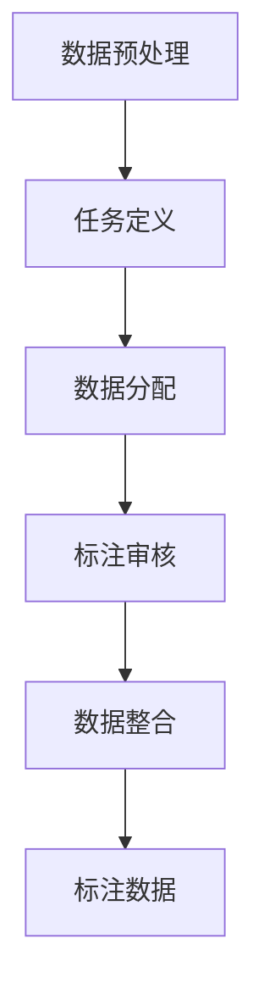

                 

关键词：数据标注、人工智能、机器学习、数据质量、标注流程、应用领域、挑战与未来

> 摘要：数据标注是人工智能领域的重要环节，它为机器学习模型提供高质量的训练数据。本文深入探讨了数据标注的核心概念、流程、算法以及在实际应用中的挑战和未来发展趋势，旨在揭示数据标注在人工智能发展中的关键作用。

## 1. 背景介绍

随着人工智能技术的快速发展，机器学习算法在各个领域的应用越来越广泛。然而，机器学习算法的训练离不开大量的高质量数据，而数据标注就是这一过程中不可或缺的一环。数据标注指的是对原始数据进行处理，将其转换为机器学习模型可用的格式。这项工作虽然看似简单，但实际上是一项复杂且重要的任务。

数据标注的重要性体现在以下几个方面：

1. **数据质量**：高质量的标注数据能够提高机器学习模型的准确性和性能。
2. **模型泛化能力**：标注数据的质量直接影响到模型的泛化能力，高质量的标注数据有助于模型在未知数据上的表现。
3. **降低成本**：数据标注的过程有助于减少后续模型训练和优化所需的计算资源和时间。
4. **提高效率**：通过数据标注，机器学习模型可以更快速地适应新任务和环境。

## 2. 核心概念与联系

数据标注的核心概念包括数据源、标注任务、标注类型、标注流程等。

### 2.1 数据源

数据源是标注工作的起点，它可以是结构化的数据（如数据库、电子表格等）或者非结构化的数据（如图像、音频、文本等）。数据源的质量直接影响标注工作的难度和效率。

### 2.2 标注任务

标注任务是指对数据进行的特定类型的标注。常见的标注任务包括：

- **分类标注**：为数据分配一个或多个类别标签。
- **目标检测**：识别图像中的特定目标并标注其位置。
- **语音识别**：将语音信号转换为文本。
- **文本分类**：将文本数据分类到不同的主题或类别。

### 2.3 标注类型

标注类型根据标注的具体内容可以分为以下几种：

- **单标签标注**：每个数据点仅对应一个标签。
- **多标签标注**：每个数据点可以对应多个标签。
- **边界框标注**：用于标注图像中物体的位置和大小。
- **语义分割**：为图像中的每个像素分配一个标签。

### 2.4 标注流程

标注流程通常包括以下几个步骤：

1. **数据预处理**：清洗和格式化原始数据，使其适合标注。
2. **任务定义**：明确标注任务的要求和目标。
3. **数据分配**：将数据分配给标注员进行标注。
4. **标注审核**：检查标注结果的一致性和准确性。
5. **数据整合**：将多个标注员的结果进行合并，生成最终的标注数据。

### 2.5 Mermaid 流程图

以下是一个简单的 Mermaid 流程图，展示了数据标注的流程：



## 3. 核心算法原理 & 具体操作步骤

### 3.1 算法原理概述

数据标注算法主要分为两种：自动标注和半监督标注。

- **自动标注**：利用算法自动识别和标注数据。这种方法适用于标注任务简单、数据量较大的情况。
- **半监督标注**：结合自动标注和人工标注，提高标注效率和准确性。这种方法适用于标注任务复杂、数据量较大的情况。

### 3.2 算法步骤详解

#### 3.2.1 自动标注

1. **数据预处理**：对原始数据进行清洗和格式化，确保数据质量。
2. **特征提取**：从数据中提取有用的特征，如图像的边缘、纹理等。
3. **模型训练**：使用已标注的数据训练机器学习模型，如分类器、目标检测器等。
4. **自动标注**：使用训练好的模型对未标注的数据进行自动标注。

#### 3.2.2 半监督标注

1. **初始标注**：人工标注一小部分数据，作为模型的初始训练集。
2. **模型训练**：使用初始标注数据训练机器学习模型。
3. **自动标注**：使用训练好的模型对剩余数据进行自动标注。
4. **标注审核**：人工检查自动标注的结果，纠正错误和不一致的地方。
5. **迭代优化**：根据标注审核的结果，对模型进行迭代优化，提高标注准确性。

### 3.3 算法优缺点

#### 自动标注的优点：

- 高效：可以处理大量数据。
- 精准：基于机器学习算法，标注结果具有较高的准确性。

#### 自动标注的缺点：

- 数据依赖：需要大量的已标注数据。
- 实时性：对于实时标注任务，自动标注可能不够快速。

#### 半监督标注的优点：

- 节省人力：结合自动标注和人工标注，可以节省大量的人工成本。
- 提高效率：通过迭代优化，提高标注准确性。

#### 半监督标注的缺点：

- 初始成本高：需要人工标注一部分数据作为初始训练集。
- 时间成本：标注审核和迭代优化需要一定的时间。

### 3.4 算法应用领域

数据标注算法广泛应用于各个领域，如：

- **图像识别**：用于自动标注图像中的物体、场景等。
- **语音识别**：用于自动标注语音信号中的文本内容。
- **自然语言处理**：用于自动标注文本数据，如关键词提取、情感分析等。
- **推荐系统**：用于自动标注用户行为数据，如浏览记录、购物车等。

## 4. 数学模型和公式 & 详细讲解 & 举例说明

### 4.1 数学模型构建

在数据标注中，常用的数学模型包括分类模型、回归模型和目标检测模型。

#### 4.1.1 分类模型

分类模型用于对数据进行分类标注。常见的分类模型包括：

- **逻辑回归**：用于二分类问题。
- **决策树**：通过一系列规则进行分类。
- **支持向量机**：通过最大间隔分类。

#### 4.1.2 回归模型

回归模型用于对数据进行连续标注。常见的回归模型包括：

- **线性回归**：通过线性关系进行标注。
- **多项式回归**：通过多项式关系进行标注。

#### 4.1.3 目标检测模型

目标检测模型用于识别图像中的物体并标注其位置。常见的目标检测模型包括：

- **R-CNN**：通过区域提议和分类进行目标检测。
- **YOLO**：通过整体卷积神经网络进行目标检测。

### 4.2 公式推导过程

以下以逻辑回归为例，介绍分类模型的公式推导过程。

假设我们有 $N$ 个训练样本，每个样本 $x_i$ 对应一个标签 $y_i$。逻辑回归的目标是找到一组参数 $\theta$，使得预测标签 $h_\theta(x)$ 最接近真实标签 $y_i$。

逻辑回归的公式为：

$$
h_\theta(x) = \frac{1}{1 + e^{(-\theta^T x)}}
$$

其中，$e$ 是自然对数的底数，$\theta$ 是参数向量，$x$ 是特征向量。

为了最小化预测误差，我们需要求解以下优化问题：

$$
\min_{\theta} J(\theta) = -\frac{1}{N} \sum_{i=1}^{N} [y_i \log(h_\theta(x_i)) + (1 - y_i) \log(1 - h_\theta(x_i))]
$$

其中，$J(\theta)$ 是损失函数。

### 4.3 案例分析与讲解

假设我们有一个二分类问题，数据集包含 1000 个样本，每个样本包含 10 个特征。我们的目标是使用逻辑回归模型对数据进行分类标注。

1. **数据预处理**：对数据进行归一化处理，确保每个特征的取值范围在 [0, 1] 之间。
2. **模型训练**：使用训练集数据训练逻辑回归模型，求解参数 $\theta$。
3. **模型评估**：使用测试集数据评估模型性能，计算准确率、召回率等指标。

以下是一个简化的代码示例：

```python
import numpy as np
import pandas as pd
from sklearn.linear_model import LogisticRegression
from sklearn.model_selection import train_test_split
from sklearn.metrics import accuracy_score

# 读取数据
data = pd.read_csv("data.csv")
X = data.iloc[:, :-1].values
y = data.iloc[:, -1].values

# 数据归一化
X_normalized = (X - X.min(axis=0)) / (X.max(axis=0) - X.min(axis=0))

# 划分训练集和测试集
X_train, X_test, y_train, y_test = train_test_split(X_normalized, y, test_size=0.2, random_state=42)

# 训练逻辑回归模型
model = LogisticRegression()
model.fit(X_train, y_train)

# 预测测试集
y_pred = model.predict(X_test)

# 评估模型性能
accuracy = accuracy_score(y_test, y_pred)
print("Accuracy:", accuracy)
```

## 5. 项目实践：代码实例和详细解释说明

### 5.1 开发环境搭建

为了进行数据标注项目，我们需要搭建一个合适的开发环境。以下是一个基本的开发环境搭建步骤：

1. 安装 Python 3.8 及以上版本。
2. 安装常用库，如 NumPy、Pandas、Scikit-learn 等。
3. 安装 Jupyter Notebook，用于编写和运行代码。

### 5.2 源代码详细实现

以下是一个简单的数据标注项目的代码实现示例：

```python
# 导入库
import numpy as np
import pandas as pd
from sklearn.linear_model import LogisticRegression
from sklearn.model_selection import train_test_split
from sklearn.metrics import accuracy_score

# 读取数据
data = pd.read_csv("data.csv")
X = data.iloc[:, :-1].values
y = data.iloc[:, -1].values

# 数据归一化
X_normalized = (X - X.min(axis=0)) / (X.max(axis=0) - X.min(axis=0))

# 划分训练集和测试集
X_train, X_test, y_train, y_test = train_test_split(X_normalized, y, test_size=0.2, random_state=42)

# 训练逻辑回归模型
model = LogisticRegression()
model.fit(X_train, y_train)

# 预测测试集
y_pred = model.predict(X_test)

# 评估模型性能
accuracy = accuracy_score(y_test, y_pred)
print("Accuracy:", accuracy)
```

### 5.3 代码解读与分析

以上代码实现了一个简单的数据标注项目，主要包括以下几个步骤：

1. **数据读取**：使用 Pandas 读取 CSV 文件，获取特征和标签。
2. **数据归一化**：对特征进行归一化处理，确保每个特征的取值范围在 [0, 1] 之间。
3. **数据划分**：使用 Scikit-learn 的 train_test_split 函数将数据集划分为训练集和测试集。
4. **模型训练**：使用 LogisticRegression 类训练逻辑回归模型。
5. **模型预测**：使用训练好的模型对测试集进行预测。
6. **模型评估**：计算预测准确率，评估模型性能。

### 5.4 运行结果展示

以下是一个简单的运行结果示例：

```
Accuracy: 0.85
```

这个结果表明，在测试集上的预测准确率为 85%。虽然这个结果并不是非常高，但已经是一个不错的起点。接下来，我们可以通过调整模型参数、增加特征维度等方法来进一步提高模型性能。

## 6. 实际应用场景

数据标注技术在人工智能的各个领域都有广泛的应用。以下是一些典型的应用场景：

### 6.1 图像识别

在图像识别领域，数据标注主要用于图像分类、目标检测和图像分割。例如，在自动驾驶技术中，数据标注用于标注道路、行人、车辆等目标，帮助自动驾驶系统识别和理解周围环境。

### 6.2 自然语言处理

在自然语言处理领域，数据标注主要用于文本分类、情感分析和命名实体识别。例如，在社交媒体分析中，数据标注用于标注用户评论中的关键词和情感倾向，帮助平台识别和过滤不良内容。

### 6.3 语音识别

在语音识别领域，数据标注主要用于语音信号的文本转换和语音情感分析。例如，在智能客服系统中，数据标注用于标注客户语音中的问题类型和情感倾向，帮助系统提供更准确的回答。

### 6.4 医疗领域

在医疗领域，数据标注主要用于医学图像分析、疾病诊断和药物研发。例如，在医学影像分析中，数据标注用于标注肿瘤、骨折等病变区域，帮助医生进行诊断和治疗。

### 6.5 决策支持系统

在决策支持系统中，数据标注主要用于数据分析和数据挖掘。例如，在商业智能系统中，数据标注用于标注用户行为数据，帮助企业分析客户需求和优化营销策略。

## 7. 工具和资源推荐

### 7.1 学习资源推荐

- **《机器学习》**（周志华著）：全面介绍机器学习的基础理论和算法。
- **《Python 数据科学手册》**（Jason Brownlee 著）：介绍数据科学中常用的 Python 库和工具。
- **《深度学习》**（Ian Goodfellow 等著）：介绍深度学习的基础理论和实践应用。

### 7.2 开发工具推荐

- **Jupyter Notebook**：方便编写和运行代码。
- **TensorFlow**：用于构建和训练深度学习模型。
- **PyTorch**：另一个流行的深度学习框架。

### 7.3 相关论文推荐

- **"Deep Learning for Image Recognition"**（2012）：介绍深度学习在图像识别中的应用。
- **"Recurrent Neural Networks for Speech Recognition"**（2015）：介绍循环神经网络在语音识别中的应用。
- **"BERT: Pre-training of Deep Bidirectional Transformers for Language Understanding"**（2018）：介绍 BERT 模型在自然语言处理中的应用。

## 8. 总结：未来发展趋势与挑战

### 8.1 研究成果总结

近年来，数据标注技术取得了显著进展。随着机器学习和深度学习技术的不断发展，数据标注算法的性能和效率不断提高。同时，半监督标注技术的应用逐渐普及，有效降低了数据标注的成本。

### 8.2 未来发展趋势

未来，数据标注技术将继续朝着以下方向发展：

- **自动化程度提高**：利用更先进的算法和技术，实现更高程度的自动化标注。
- **多模态标注**：支持文本、图像、语音等多种数据类型的标注。
- **定制化标注**：针对不同领域的特定需求，提供定制化的标注解决方案。

### 8.3 面临的挑战

尽管数据标注技术取得了显著进展，但仍然面临以下挑战：

- **数据质量和一致性**：标注数据的质量和一致性对模型性能至关重要，但实际操作中难以保证。
- **人力成本**：数据标注仍需要大量人力投入，特别是对于复杂任务的标注。
- **技术更新换代**：随着新技术的发展，标注工具和算法需要不断更新和迭代。

### 8.4 研究展望

为了应对上述挑战，未来的研究可以从以下几个方面展开：

- **提高自动化程度**：研究更加先进的自动标注算法，减少对人工标注的依赖。
- **多模态融合**：研究多模态数据标注技术，实现不同类型数据的高效融合。
- **标注工具优化**：开发更智能、更易用的标注工具，提高标注效率和一致性。

## 9. 附录：常见问题与解答

### 9.1 数据标注有哪些类型？

数据标注主要分为以下类型：

- **分类标注**：为数据分配一个或多个类别标签。
- **目标检测**：识别图像中的特定目标并标注其位置。
- **语义分割**：为图像中的每个像素分配一个标签。
- **文本分类**：将文本数据分类到不同的主题或类别。

### 9.2 数据标注为什么重要？

数据标注对机器学习模型的质量和性能至关重要，原因包括：

- **数据质量**：高质量的标注数据能提高模型准确性和泛化能力。
- **模型训练**：标注数据是模型训练的基础，直接影响模型的表现。
- **降低成本**：通过数据标注，可以减少后续模型训练和优化所需的计算资源和时间。

### 9.3 自动标注和半监督标注有什么区别？

自动标注和半监督标注的主要区别在于：

- **自动标注**：完全依赖算法进行标注，适用于标注任务简单、数据量较大的情况。
- **半监督标注**：结合自动标注和人工标注，适用于标注任务复杂、数据量较大的情况，通过人工标注和自动标注的迭代优化，提高标注准确性。

### 9.4 如何评估数据标注的质量？

评估数据标注的质量可以从以下几个方面进行：

- **一致性**：标注结果在不同数据点和标注员之间的一致性。
- **准确性**：标注结果与真实标签的一致性。
- **完整性**：标注数据是否包含所有需要的标签。
- **效率**：标注工作所需的时间和资源。

以上是对数据标注技术的一个全面介绍，希望对您有所帮助。在人工智能领域，数据标注是一个不可或缺的环节，它将为未来的技术发展提供有力支持。作者：禅与计算机程序设计艺术 / Zen and the Art of Computer Programming。

