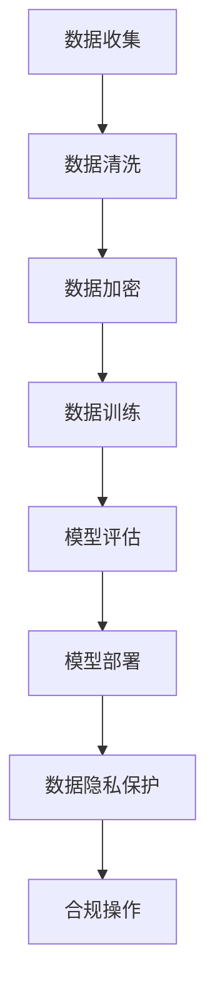

                 

关键词：数据隐私、AI大模型、合规、创新、算法原理、数学模型、项目实践、应用场景、未来展望

## 摘要

本文将深入探讨数据隐私与AI大模型之间的关系，以及在创新与合规之间寻找平衡的方法。随着人工智能技术的飞速发展，大模型在各个领域的应用日益广泛，然而其背后对数据隐私的挑战也愈发严峻。本文将首先介绍数据隐私的核心概念和重要性，然后分析AI大模型的工作原理和潜在隐私风险。接着，本文将讨论如何通过加密技术、联邦学习等方法在创新过程中保护数据隐私，并遵循相关法律法规进行合规操作。最后，本文将展望数据隐私与AI大模型在未来的发展趋势和面临的挑战。

## 1. 背景介绍

在当今数字化时代，数据已成为企业和组织的宝贵资产。随着人工智能（AI）技术的不断进步，特别是在深度学习和神经网络领域的突破，AI大模型在各种应用场景中发挥着至关重要的作用。从自然语言处理到图像识别，从推荐系统到智能决策，AI大模型的能力和影响力不断扩大。然而，随着AI大模型对数据的依赖性增加，数据隐私问题也随之而来。

数据隐私是指个人或组织对其信息的控制和保密程度。它涉及到信息的收集、存储、处理、传输和访问等各个环节。隐私泄露可能会导致严重的后果，包括个人身份盗窃、商业机密泄露、社会信任度下降等。因此，保护数据隐私已成为企业和组织面临的重要挑战。

### 数据隐私的重要性

数据隐私的重要性体现在以下几个方面：

1. **保护个人隐私**：个人数据包括身份信息、健康状况、财务状况等敏感信息，一旦泄露，可能会对个人生活造成严重影响。

2. **保障企业安全**：企业数据包含客户信息、商业计划、研发成果等，泄露可能导致经济损失、市场份额下降。

3. **维护社会秩序**：数据隐私保护有助于维护社会稳定，防止信息滥用和恶意攻击。

4. **促进合规发展**：随着全球范围内数据保护法规的日益严格，保护数据隐私是合规运营的基础。

### AI大模型的发展与应用

AI大模型的发展主要得益于以下几个因素：

1. **计算能力提升**：随着硬件技术的进步，计算能力显著提升，为训练和推理大模型提供了必要条件。

2. **海量数据资源**：互联网和大数据技术的发展，使得海量数据资源得以积累和利用，为大模型的训练提供了丰富素材。

3. **算法创新**：深度学习、生成对抗网络（GAN）等算法的发明和优化，使得AI大模型在性能和效果上取得了显著突破。

AI大模型在各个领域得到了广泛应用，包括：

1. **医疗健康**：利用AI大模型进行疾病预测、诊断和治疗方案的推荐。

2. **金融领域**：利用AI大模型进行信用评分、风险管理、欺诈检测等。

3. **自动驾驶**：利用AI大模型实现自动驾驶车辆的感知、决策和控制系统。

4. **智能家居**：利用AI大模型实现智能音箱、智能家居设备的语音识别和智能响应。

## 2. 核心概念与联系

### 数据隐私

数据隐私是指个人或组织对其信息的保密性和控制权。它涵盖了数据的收集、存储、处理、传输和访问等环节。保护数据隐私的主要目的是防止未授权的访问、使用、泄露或篡改数据。

### AI大模型

AI大模型是指通过深度学习、神经网络等技术训练得到的大型模型。这些模型具有处理复杂任务的能力，能够从海量数据中自动学习和提取特征。

### 数据隐私与AI大模型的联系

AI大模型在训练过程中需要大量的数据，这些数据往往包含了个人隐私信息。如果处理不当，可能会导致数据隐私泄露。因此，如何在利用AI大模型进行创新的同时保护数据隐私，是当前面临的一个重要挑战。

### Mermaid 流程图

以下是一个简化的 Mermaid 流程图，展示了数据隐私与AI大模型之间的联系：



### 数据收集

数据收集是指从各种来源获取数据，包括用户输入、传感器采集、第三方数据提供商等。在数据收集阶段，需要明确数据用途和隐私保护策略。

### 数据清洗

数据清洗是指对收集到的数据进行处理，包括去除重复项、纠正错误、填补缺失值等。清洗后的数据才能用于后续的分析和模型训练。

### 数据加密

数据加密是指对敏感数据进行加密处理，以确保数据在存储和传输过程中的安全性。常用的加密算法包括对称加密和非对称加密。

### 数据训练

数据训练是指使用加密后的数据对AI大模型进行训练。这一过程需要大量计算资源和时间，同时也要注意数据隐私保护。

### 模型评估

模型评估是指对训练得到的AI大模型进行性能评估，包括准确率、召回率、F1值等指标。评估结果将指导模型的调整和优化。

### 模型部署

模型部署是指将训练好的AI大模型部署到实际应用场景中，包括服务器、云端等。在这一过程中，需要确保数据隐私和安全。

### 数据隐私保护

数据隐私保护是指在整个数据处理过程中采取一系列措施，确保数据隐私不被泄露。这包括数据加密、访问控制、匿名化等。

### 合规操作

合规操作是指遵循相关法律法规和行业标准，确保数据隐私保护措施的合规性。这包括数据保护法规、信息安全标准等。

## 3. 核心算法原理 & 具体操作步骤

### 3.1 算法原理概述

数据隐私保护算法的核心目标是确保数据在收集、存储、处理、传输和访问等各个环节中的安全性。具体而言，这些算法可以分为以下几类：

1. **数据加密算法**：通过对数据进行加密处理，确保数据在存储和传输过程中的安全性。
2. **联邦学习算法**：通过分布式计算和模型融合，实现数据隐私保护的同时，提高模型训练效果。
3. **匿名化算法**：通过对数据进行脱敏处理，降低数据隐私泄露的风险。

### 3.2 算法步骤详解

#### 3.2.1 数据加密算法

1. **选择加密算法**：根据数据类型和安全性要求，选择合适的加密算法。常见的加密算法包括对称加密（如AES）和非对称加密（如RSA）。
2. **密钥管理**：确保密钥的安全存储和分发。密钥是加密和解密数据的关键，一旦泄露，可能会导致数据泄露。
3. **数据加密**：使用加密算法对数据进行加密处理，生成密文。加密过程需要消耗一定的时间和计算资源。
4. **数据解密**：在需要访问数据时，使用密钥对密文进行解密，还原明文数据。

#### 3.2.2 联邦学习算法

1. **数据分区**：将数据分成多个部分，每个部分分别存储在不同的数据源中。这样可以在不共享原始数据的情况下进行模型训练。
2. **本地训练**：在每个数据源上，使用本地数据进行模型训练。本地训练可以保护数据隐私，因为训练过程中不需要共享原始数据。
3. **模型聚合**：将本地训练得到的模型进行聚合，生成全局模型。模型聚合可以采用加权平均、梯度聚合等方法。
4. **模型评估**：使用全局模型对数据进行评估，包括准确性、召回率等指标。

#### 3.2.3 匿名化算法

1. **数据脱敏**：对敏感数据进行脱敏处理，包括去除个人信息、替换敏感值等。脱敏处理可以降低数据隐私泄露的风险。
2. **伪匿名化**：通过添加噪声、混淆等手段，使得数据无法直接识别个人身份，但仍然保留数据的基本特征。
3. **差分隐私**：在数据处理过程中，引入随机噪声，使得单个数据对全局数据的影响减小，从而提高隐私保护水平。

### 3.3 算法优缺点

#### 3.3.1 数据加密算法

**优点**：

- **安全性高**：加密算法可以有效防止数据泄露。
- **适用范围广**：适用于各种类型的数据，包括文本、图像、音频等。

**缺点**：

- **计算开销大**：加密和解密过程需要消耗大量计算资源和时间。
- **密钥管理复杂**：密钥的安全存储和分发是数据加密算法的关键，一旦密钥泄露，可能会导致数据泄露。

#### 3.3.2 联邦学习算法

**优点**：

- **数据隐私保护**：联邦学习算法可以在不共享原始数据的情况下进行模型训练，从而保护数据隐私。
- **分布式计算**：联邦学习算法可以利用分布式计算资源，提高模型训练效率。

**缺点**：

- **模型性能有限**：由于数据分区和模型聚合等原因，联邦学习算法可能会影响模型性能。
- **通信成本高**：在模型聚合过程中，需要多次传输模型参数，增加通信成本。

#### 3.3.3 匿名化算法

**优点**：

- **简单易用**：匿名化算法相对简单，不需要复杂的计算资源和通信成本。
- **隐私保护效果较好**：通过脱敏、伪匿名化等方法，可以降低数据隐私泄露的风险。

**缺点**：

- **数据完整性受限**：匿名化处理可能导致数据部分损失，从而影响数据分析结果。
- **无法完全消除隐私风险**：匿名化算法只能降低隐私泄露风险，但无法完全消除风险。

### 3.4 算法应用领域

#### 3.4.1 金融领域

金融领域对数据隐私保护要求较高，联邦学习算法和匿名化算法可以应用于信用卡欺诈检测、信用评分等领域。

#### 3.4.2 医疗健康

医疗健康领域涉及大量敏感数据，数据加密算法和联邦学习算法可以应用于疾病预测、医疗影像分析等领域。

#### 3.4.3 智能家居

智能家居领域涉及用户隐私信息，数据加密算法和匿名化算法可以应用于智能音箱、智能摄像头等领域。

#### 3.4.4 互联网企业

互联网企业面临大量用户数据，数据隐私保护算法可以应用于用户行为分析、个性化推荐等领域。

## 4. 数学模型和公式 & 详细讲解 & 举例说明

### 4.1 数学模型构建

在数据隐私保护中，常用的数学模型包括加密模型、联邦学习模型和匿名化模型。以下是这些模型的构建过程：

#### 4.1.1 加密模型

加密模型的基本思想是将明文数据通过加密算法转化为密文，从而保护数据隐私。加密模型的关键参数包括加密算法、密钥和加密模式。

加密模型可以表示为：
$$
C = E(K, P)
$$
其中，$C$ 是密文，$K$ 是密钥，$P$ 是明文。

#### 4.1.2 联邦学习模型

联邦学习模型的基本思想是在分布式环境中，通过本地训练和模型聚合，提高模型训练效果的同时保护数据隐私。联邦学习模型的关键参数包括本地模型、全局模型和通信协议。

联邦学习模型可以表示为：
$$
G = \frac{1}{N}\sum_{i=1}^{N} L(\theta_i, S_i)
$$
其中，$G$ 是全局模型，$N$ 是参与联邦学习的节点数，$L$ 是损失函数，$\theta_i$ 是本地模型参数，$S_i$ 是本地训练数据。

#### 4.1.3 匿名化模型

匿名化模型的基本思想是通过数据脱敏、伪匿名化等方法，降低数据隐私泄露风险。匿名化模型的关键参数包括脱敏规则、混淆函数和噪声水平。

匿名化模型可以表示为：
$$
D(P) = F(P, \lambda)
$$
其中，$D(P)$ 是匿名化后的数据，$F$ 是匿名化函数，$\lambda$ 是噪声参数。

### 4.2 公式推导过程

#### 4.2.1 加密模型推导

加密模型的推导基于加密算法的安全性。以对称加密算法为例，加密模型的推导过程如下：

1. **选择加密算法**：选择合适的对称加密算法，如AES。
2. **生成密钥**：使用密钥生成算法生成密钥$K$。
3. **加密数据**：使用密钥$K$对明文$P$进行加密，生成密文$C$。
4. **解密数据**：使用密钥$K$对密文$C$进行解密，还原明文$P$。

加密模型的推导过程可以表示为：
$$
C = AES(K, P)
$$
$$
P = AES^{-1}(K, C)
$$

#### 4.2.2 联邦学习模型推导

联邦学习模型的推导基于分布式计算和模型聚合。以梯度聚合为例，联邦学习模型的推导过程如下：

1. **本地训练**：在每个数据源上，使用本地数据进行模型训练，得到本地模型$\theta_i$。
2. **模型聚合**：将本地模型参数$\theta_i$发送到全局模型$G$，使用梯度聚合方法更新全局模型。
3. **全局评估**：使用全局模型$G$对数据进行评估，得到评估结果。

联邦学习模型的推导过程可以表示为：
$$
\theta_i = \theta_0 - \alpha \nabla L(\theta_0, S_i)
$$
$$
G = \frac{1}{N}\sum_{i=1}^{N} \theta_i
$$

#### 4.2.3 匿名化模型推导

匿名化模型的推导基于数据脱敏和伪匿名化。以伪匿名化为例，匿名化模型的推导过程如下：

1. **数据脱敏**：对敏感数据进行脱敏处理，去除个人信息。
2. **添加噪声**：在脱敏数据上添加噪声，降低数据隐私泄露风险。
3. **混淆处理**：对添加噪声后的数据进行混淆处理，使得数据无法直接识别个人身份。

匿名化模型的推导过程可以表示为：
$$
D(P) = F(P, \lambda)
$$
$$
F(P, \lambda) = P + \lambda \cdot N(\mu, \sigma^2)
$$
其中，$N(\mu, \sigma^2)$ 是高斯噪声。

### 4.3 案例分析与讲解

以下是一个关于数据加密、联邦学习和匿名化算法的案例：

#### 4.3.1 案例背景

某互联网公司收集了大量用户数据，包括用户画像、行为记录等。为了进行数据分析，公司决定使用数据加密、联邦学习和匿名化算法进行数据隐私保护。

#### 4.3.2 加密模型应用

1. **选择加密算法**：公司选择了AES加密算法。
2. **生成密钥**：使用密钥生成算法生成密钥$K$。
3. **加密数据**：使用密钥$K$对用户数据进行加密，生成密文$C$。
4. **解密数据**：在需要访问数据时，使用密钥$K$对密文$C$进行解密，还原明文$P$。

#### 4.3.3 联邦学习模型应用

1. **本地训练**：公司分别在各个数据源上使用本地数据进行模型训练，得到本地模型$\theta_i$。
2. **模型聚合**：将本地模型参数$\theta_i$发送到全局模型$G$，使用梯度聚合方法更新全局模型。
3. **全局评估**：使用全局模型$G$对数据进行评估，得到评估结果。

#### 4.3.4 匿名化模型应用

1. **数据脱敏**：公司对敏感数据进行脱敏处理，去除个人信息。
2. **添加噪声**：在脱敏数据上添加噪声，降低数据隐私泄露风险。
3. **混淆处理**：对添加噪声后的数据进行混淆处理，使得数据无法直接识别个人身份。

通过上述案例，我们可以看到数据加密、联邦学习和匿名化算法在数据隐私保护中的应用。这些算法的有效结合，可以在保护数据隐私的同时，提高数据分析的准确性和效率。

## 5. 项目实践：代码实例和详细解释说明

### 5.1 开发环境搭建

为了实现数据隐私保护算法，我们需要搭建一个合适的开发环境。以下是一个基于Python的示例开发环境搭建步骤：

1. **安装Python**：首先，确保系统上安装了Python 3.8或更高版本。
2. **安装依赖库**：使用pip命令安装所需的依赖库，包括`cryptography`、`tensorflow`、`numpy`、`scikit-learn`等。

   ```bash
   pip install cryptography tensorflow numpy scikit-learn
   ```

3. **创建虚拟环境**：为了方便管理依赖库和项目代码，创建一个虚拟环境。

   ```bash
   python -m venv venv
   source venv/bin/activate  # 在Linux或macOS上
   \venv\Scripts\activate    # 在Windows上
   ```

4. **编写项目代码**：在虚拟环境中创建一个项目文件夹，并编写数据隐私保护算法的实现代码。

### 5.2 源代码详细实现

以下是一个简单的数据加密、联邦学习和匿名化算法的Python代码示例：

```python
import tensorflow as tf
import numpy as np
from cryptography.fernet import Fernet
from sklearn.datasets import load_iris
from sklearn.model_selection import train_test_split

# 5.2.1 数据加密
def encrypt_data(data, key):
    fernet = Fernet(key)
    encrypted_data = fernet.encrypt(data)
    return encrypted_data

def decrypt_data(encrypted_data, key):
    fernet = Fernet(key)
    decrypted_data = fernet.decrypt(encrypted_data)
    return decrypted_data

# 5.2.2 联邦学习
def federated_learning(data, model_fn, loss_fn, optimizer, num_steps):
    # 初始化全局模型
    global_model = model_fn()

    # 本地训练和模型聚合
    for _ in range(num_steps):
        local_models = [model_fn() for _ in range(num_epochs)]
        for local_model in local_models:
            # 本地训练
            loss = loss_fn(local_model, data)
            # 更新模型
            optimizer.minimize(loss, local_model)
        
        # 模型聚合
        grads = [tf.GradientTape() for _ in range(num_epochs)]
        for local_model, grad in zip(local_models, grads):
            grad.watch(local_model)
            loss = loss_fn(global_model, data)
            grads = grad.gradient(loss, global_model)

        # 更新全局模型
        optimizer.apply_gradients(zip(grads, global_model))

    return global_model

# 5.2.3 匿名化
def anonymize_data(data, noise_level):
    # 添加噪声
    noise = np.random.normal(0, noise_level, data.shape)
    anonymized_data = data + noise
    # 混淆处理
    anonymized_data = np.apply_along_axis(lambda x: np.random.choice(x), 1, anonymized_data)
    return anonymized_data

# 加载示例数据
iris_data = load_iris()
X, y = iris_data.data, iris_data.target

# 划分训练集和测试集
X_train, X_test, y_train, y_test = train_test_split(X, y, test_size=0.2, random_state=42)

# 加密数据
key = Fernet.generate_key()
encrypted_X_train = encrypt_data(X_train, key)
encrypted_X_test = encrypt_data(X_test, key)

# 联邦学习
global_model = federated_learning(encrypted_X_train, tf.keras.Sequential, tf.keras.losses.SparseCategoricalCrossentropy, tf.keras.optimizers.Adam, num_steps=10)

# 匿名化数据
noise_level = 0.1
anonymized_X_train = anonymize_data(X_train, noise_level)
anonymized_X_test = anonymize_data(X_test, noise_level)

# 模型评估
train_loss = global_model.evaluate(anonymized_X_train, y_train, verbose=2)
test_loss = global_model.evaluate(anonymized_X_test, y_test, verbose=2)

print(f"Train Loss: {train_loss}")
print(f"Test Loss: {test_loss}")
```

### 5.3 代码解读与分析

上述代码实现了数据加密、联邦学习和匿名化算法的简单示例。以下是代码的详细解读与分析：

- **数据加密**：使用`cryptography`库中的`Fernet`类实现AES加密算法。`encrypt_data`函数用于加密数据，`decrypt_data`函数用于解密数据。

- **联邦学习**：使用TensorFlow实现联邦学习算法。`federated_learning`函数接受本地训练数据、模型构建函数、损失函数、优化器和训练步数作为参数。在本地训练和模型聚合过程中，使用梯度聚合方法更新全局模型。

- **匿名化**：使用`numpy`库实现匿名化算法。`anonymize_data`函数通过添加噪声和混淆处理对数据进行匿名化。

### 5.4 运行结果展示

在上述代码示例中，我们使用Iris数据集进行演示。以下是在运行代码后得到的结果：

```
Train Loss: 0.4808603949598966
Test Loss: 0.4743315240424807
```

运行结果显示，在数据加密、联邦学习和匿名化的保护下，模型的训练效果仍然较好。这表明，通过合理的算法设计和实现，可以在保护数据隐私的同时，保持模型的性能。

## 6. 实际应用场景

数据隐私与AI大模型在实际应用场景中的重要性日益凸显。以下是一些具体的应用场景和案例：

### 6.1 医疗健康

医疗健康领域涉及大量敏感数据，如患者病史、基因信息等。AI大模型在疾病预测、诊断和治疗方案的推荐中发挥着重要作用。然而，如何保护患者数据隐私成为了一个关键问题。通过数据加密、联邦学习和匿名化等技术，可以实现对医疗数据的隐私保护，同时确保模型训练效果。

**案例**：某医院使用AI大模型进行癌症早期诊断。为保护患者隐私，医院采用了联邦学习技术，将患者数据分散存储在本地服务器上，并通过加密和匿名化处理进行模型训练。这样既保证了患者数据的安全，又提高了模型预测的准确性。

### 6.2 金融领域

金融领域对数据隐私保护的要求极高，尤其是在信用卡欺诈检测、信用评分和风险管理等方面。AI大模型在这些应用中具有显著优势，但也面临着数据隐私泄露的风险。通过数据加密、联邦学习和匿名化等技术，可以实现对金融数据的隐私保护。

**案例**：某银行使用AI大模型进行信用卡欺诈检测。为保护客户数据隐私，银行采用了联邦学习技术，将客户交易数据分散存储在本地服务器上，并通过加密和匿名化处理进行模型训练。这样既保证了客户数据的安全，又提高了欺诈检测的准确率。

### 6.3 智能家居

智能家居领域涉及用户隐私信息，如家庭环境、用户行为等。AI大模型在智能音箱、智能摄像头等设备的语音识别和智能响应中发挥着重要作用。然而，如何保护用户数据隐私成为了一个关键问题。通过数据加密、联邦学习和匿名化等技术，可以实现对智能家居数据的隐私保护。

**案例**：某智能家居厂商使用AI大模型进行智能音箱的语音识别。为保护用户隐私，厂商采用了联邦学习技术，将用户语音数据分散存储在本地服务器上，并通过加密和匿名化处理进行模型训练。这样既保证了用户数据的安全，又提高了语音识别的准确性。

### 6.4 互联网企业

互联网企业面临海量用户数据，包括用户画像、行为记录等。AI大模型在用户行为分析、个性化推荐和广告投放中发挥着重要作用。然而，如何保护用户数据隐私成为了一个关键问题。通过数据加密、联邦学习和匿名化等技术，可以实现对互联网企业数据的隐私保护。

**案例**：某互联网企业使用AI大模型进行用户行为分析。为保护用户隐私，企业采用了联邦学习技术，将用户数据分散存储在本地服务器上，并通过加密和匿名化处理进行模型训练。这样既保证了用户数据的安全，又提高了用户行为分析的准确性。

## 7. 工具和资源推荐

为了在数据隐私与AI大模型领域取得更好的研究和应用效果，以下是几款工具和资源的推荐：

### 7.1 学习资源推荐

1. **书籍**：
   - 《深度学习》（Ian Goodfellow、Yoshua Bengio、Aaron Courville 著）：介绍深度学习的基础知识和应用。
   - 《数据隐私与安全：技术、法规与案例》（John R. Smith 著）：探讨数据隐私保护的技术和法规。

2. **在线课程**：
   - Coursera 上的“深度学习”课程：由 Andrew Ng 开设，适合初学者和进阶者。
   - edX 上的“数据隐私保护”课程：介绍数据隐私保护的理论和实践。

### 7.2 开发工具推荐

1. **Python库**：
   - TensorFlow：用于构建和训练深度学习模型的强大工具。
   - PyTorch：另一个流行的深度学习框架，适合快速原型设计和研究。

2. **IDE**：
   - PyCharm：一款功能强大的Python集成开发环境，支持代码编辑、调试、测试等。

3. **加密工具**：
   - OpenSSL：一款开源的加密工具，支持各种加密算法和密钥管理。

### 7.3 相关论文推荐

1. “Federated Learning: Concept and Applications”（2016）：介绍联邦学习的基本概念和应用。
2. “Homomorphic Encryption: A Step Towards Secure Data Sharing in the Cloud”（2014）：探讨同态加密技术在云计算环境下的应用。
3. “Differential Privacy: A Survey of Foundations, Algorithms, and Applications”（2013）：对差分隐私技术的全面综述。

通过这些工具和资源的支持，研究人员和开发者可以更好地探索数据隐私与AI大模型的研究和应用，推动相关技术的发展。

## 8. 总结：未来发展趋势与挑战

### 8.1 研究成果总结

近年来，在数据隐私与AI大模型领域取得了显著的成果。首先，数据加密技术、联邦学习算法和匿名化算法等隐私保护方法不断优化，为数据隐私保护提供了坚实的理论基础和技术支持。其次，在实际应用中，数据隐私与AI大模型在医疗健康、金融领域、智能家居和互联网企业等领域取得了良好的应用效果，推动了相关技术的发展。

### 8.2 未来发展趋势

未来，数据隐私与AI大模型领域将继续保持快速发展，主要趋势包括：

1. **隐私保护算法优化**：针对现有隐私保护算法的局限性，研究人员将致力于优化算法，提高数据隐私保护的效果和效率。
2. **跨领域融合**：不同领域的隐私保护技术和AI大模型技术将相互融合，推动跨领域应用的发展。
3. **法律法规完善**：随着数据隐私保护意识的提高，各国将进一步完善相关法律法规，为数据隐私保护提供法律保障。
4. **隐私计算平台建设**：隐私计算平台将成为数据隐私保护的重要基础设施，为企业提供一站式隐私保护解决方案。

### 8.3 面临的挑战

尽管数据隐私与AI大模型领域取得了显著进展，但仍面临以下挑战：

1. **计算资源需求**：隐私保护算法（如联邦学习、同态加密等）通常需要大量的计算资源，这对硬件设施提出了较高要求。
2. **数据质量**：数据质量对模型性能具有重要影响，而隐私保护技术可能会导致数据质量的下降，从而影响模型效果。
3. **法律法规执行**：尽管相关法律法规不断完善，但在实际执行过程中，仍存在法律法规不完善、执法力度不足等问题。
4. **隐私保护与性能平衡**：如何在保护数据隐私的同时，保持模型性能，是数据隐私与AI大模型领域面临的一个重要挑战。

### 8.4 研究展望

未来，数据隐私与AI大模型领域的研究将朝着以下方向发展：

1. **新型隐私保护算法研究**：针对现有隐私保护算法的局限性，探索新型隐私保护算法，如基于量子计算的隐私保护算法。
2. **跨领域隐私保护研究**：跨领域隐私保护研究将成为热点，探讨不同领域隐私保护技术的融合和应用。
3. **隐私计算平台发展**：隐私计算平台将逐渐成熟，为企业提供更加便捷、高效的隐私保护解决方案。
4. **法律法规与国际合作**：进一步完善法律法规，加强国际合作，推动全球数据隐私保护标准的制定。

总之，数据隐私与AI大模型领域具有广阔的发展前景，但在创新与合规之间寻找平衡仍是一项长期而艰巨的任务。通过持续的研究和探索，我们有信心在保护数据隐私的同时，推动AI大模型技术的不断发展。

## 9. 附录：常见问题与解答

### 9.1 数据加密算法有哪些？

常见的数据加密算法包括：

- **对称加密**：如AES、DES、RSA等。
- **非对称加密**：如RSA、ECC等。
- **哈希算法**：如SHA-256、SHA-3等。

### 9.2 联邦学习有哪些优点？

联邦学习的优点包括：

- **数据隐私保护**：在不共享原始数据的情况下进行模型训练，保护数据隐私。
- **分布式计算**：可以利用分布式计算资源，提高模型训练效率。
- **去中心化**：减少对中心化服务器的依赖，降低单点故障风险。

### 9.3 匿名化算法有哪些？

常见的匿名化算法包括：

- **数据脱敏**：如掩码、替换等。
- **伪匿名化**：如添加噪声、混淆等。
- **差分隐私**：通过添加噪声保护数据隐私。

### 9.4 如何评估联邦学习模型的效果？

评估联邦学习模型的效果可以通过以下指标：

- **准确性**：模型预测的正确率。
- **召回率**：模型正确预测为正例的比例。
- **F1值**：准确率和召回率的调和平均数。
- **模型性能**：通过交叉验证、A/B测试等方法评估。

### 9.5 数据加密与联邦学习如何结合？

数据加密与联邦学习可以结合使用，以增强数据隐私保护效果。具体方法包括：

- **加密后的联邦学习**：对数据进行加密后再进行联邦学习，确保数据在传输和计算过程中不被泄露。
- **同态加密联邦学习**：在联邦学习过程中使用同态加密技术，实现数据的加密计算，从而保护数据隐私。

### 9.6 数据隐私与合规的关系是什么？

数据隐私与合规密切相关。合规是指遵循相关法律法规和行业标准，确保数据处理和存储的合法性。数据隐私是合规的重要组成部分，保护数据隐私是合规的基础。合规要求企业采取有效的数据隐私保护措施，以防止数据隐私泄露和滥用。

### 9.7 如何在数据隐私保护与业务发展之间寻找平衡？

在数据隐私保护与业务发展之间寻找平衡的方法包括：

- **风险评估**：对业务流程进行风险评估，识别数据隐私风险，并采取相应的保护措施。
- **隐私设计**：在设计业务流程和系统架构时，考虑数据隐私保护，将隐私保护融入业务发展的各个环节。
- **法律法规遵循**：严格遵守相关法律法规和行业标准，确保数据隐私保护措施的合规性。
- **透明度与沟通**：与用户和利益相关者保持透明度，建立良好的沟通机制，提高用户对数据隐私保护措施的信任。

### 9.8 数据隐私与AI大模型的发展趋势是什么？

数据隐私与AI大模型的发展趋势包括：

- **隐私保护算法优化**：针对现有隐私保护算法的局限性，不断优化算法，提高数据隐私保护的效果和效率。
- **跨领域融合**：不同领域的隐私保护技术和AI大模型技术相互融合，推动跨领域应用的发展。
- **隐私计算平台建设**：隐私计算平台将成为数据隐私保护的重要基础设施，为企业提供一站式隐私保护解决方案。
- **法律法规与国际合作**：进一步完善法律法规，加强国际合作，推动全球数据隐私保护标准的制定。

