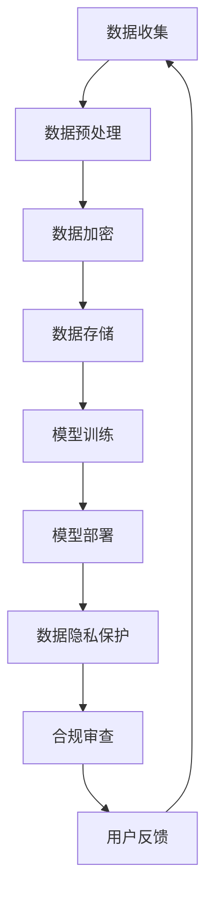

                 

 关键词：数据隐私，人工智能，大模型，合规，创新，技术发展，伦理

> 摘要：随着人工智能技术的迅猛发展，大规模数据模型的应用越来越广泛。然而，随之而来的数据隐私问题也引发了广泛关注。本文旨在探讨数据隐私与AI大模型之间的矛盾，并提出在创新与合规之间寻找平衡的方法，为人工智能技术的发展提供指导和借鉴。

## 1. 背景介绍

人工智能（AI）作为当前科技领域的前沿研究方向，正在不断推动着各个行业的变革。特别是深度学习技术的进步，使得大模型（Large Models）在图像识别、自然语言处理、语音识别等领域取得了显著的成果。然而，这些大模型的训练和部署需要大量的数据，往往涉及个人隐私信息的处理。

### 1.1 人工智能的发展历程

人工智能的发展可以分为几个阶段：

- **早期研究**：从20世纪50年代开始，人工智能理论初步形成，包括图灵测试、感知器等概念。

- **工业革命**：20世纪80年代，专家系统和人工智能应用开始出现，但受限于计算能力。

- **互联网时代**：21世纪初，互联网的普及为人工智能的发展提供了大量数据支持。

- **深度学习时代**：2012年，AlexNet的问世标志着深度学习时代的到来，随后，卷积神经网络（CNN）和递归神经网络（RNN）等算法得到了广泛应用。

### 1.2 大模型的崛起

大模型的崛起源于以下几个因素：

- **计算能力的提升**：随着GPU和TPU等硬件的发展，计算能力得到了极大的提升。

- **数据量的爆炸式增长**：互联网时代的数据量呈指数级增长，为模型训练提供了丰富的数据资源。

- **算法的进步**：深度学习算法的进步使得模型能够从大规模数据中学习到更复杂的特征。

### 1.3 数据隐私的挑战

大模型在带来巨大技术进步的同时，也带来了数据隐私的挑战：

- **数据收集**：为了训练大模型，往往需要收集大量的个人数据。

- **数据共享**：数据共享是推动人工智能发展的重要手段，但也会带来隐私泄露的风险。

- **数据存储**：大规模数据存储本身就是一个安全挑战。

- **算法透明度**：大模型的黑盒性质使得其决策过程不够透明，增加了隐私侵犯的风险。

## 2. 核心概念与联系

在探讨数据隐私与AI大模型之间的矛盾时，我们需要理解几个核心概念：

### 2.1 数据隐私

数据隐私是指个人信息的保密性和控制权。具体包括以下几个方面：

- **数据匿名化**：通过技术手段将个人数据中的可识别信息去除。

- **数据加密**：使用加密算法保护数据不被未授权访问。

- **访问控制**：通过权限管理确保只有授权用户可以访问数据。

### 2.2 AI大模型

AI大模型是指通过深度学习技术训练得到的具有大规模参数的神经网络模型。其主要特点包括：

- **大规模数据训练**：需要大量的训练数据。

- **复杂的模型结构**：包括多层神经网络和复杂的连接关系。

- **黑盒性质**：模型内部的决策过程往往不够透明。

### 2.3 合规

合规是指遵守相关法律法规和行业规范。在数据隐私与AI大模型的背景下，合规包括以下几个方面：

- **法律法规**：如《通用数据保护条例》（GDPR）、《加州消费者隐私法案》（CCPA）等。

- **行业规范**：如国际数据管理协会（IDM）发布的隐私管理指南。

- **伦理准则**：如人工智能伦理学、伦理委员会的审查等。

### 2.4 Mermaid 流程图

以下是数据隐私与AI大模型联系的一个Mermaid流程图：



## 3. 核心算法原理 & 具体操作步骤

### 3.1 算法原理概述

在数据隐私与AI大模型的研究中，常用的核心算法包括数据加密、差分隐私、联邦学习等。以下是这些算法的基本原理：

- **数据加密**：通过加密算法将数据转换为密文，只有授权用户才能解密。

- **差分隐私**：通过在数据中加入噪声，使得单个数据点的隐私信息无法被推断出来。

- **联邦学习**：在多方参与的环境下，通过聚合模型参数来训练模型，从而避免数据共享。

### 3.2 算法步骤详解

以下是数据加密的步骤详解：

- **步骤1：数据收集**：收集需要加密的明文数据。

- **步骤2：选择加密算法**：根据数据类型和安全性要求选择合适的加密算法，如AES、RSA等。

- **步骤3：密钥生成**：生成加密所需的密钥。

- **步骤4：加密操作**：使用加密算法和密钥对明文数据进行加密，生成密文。

- **步骤5：存储与传输**：将密文存储在安全的地方或通过加密信道传输。

- **步骤6：解密操作**：授权用户使用密钥对密文进行解密，恢复出明文数据。

### 3.3 算法优缺点

- **数据加密**：

  - **优点**：能够有效保护数据隐私，防止未授权访问。

  - **缺点**：加密和解密过程需要额外的计算资源，可能影响性能。

- **差分隐私**：

  - **优点**：在保护隐私的同时，能够提供合理的统计结果。

  - **缺点**：可能引入额外的噪声，影响模型的准确性。

- **联邦学习**：

  - **优点**：无需共享原始数据，能够保护用户隐私。

  - **缺点**：需要解决通信成本高、模型一致性等问题。

### 3.4 算法应用领域

- **数据加密**：广泛应用于金融、医疗、电子商务等领域。

- **差分隐私**：在数据分析、隐私保护算法等领域有广泛应用。

- **联邦学习**：在智能家居、智能城市、智能医疗等领域有广泛应用。

## 4. 数学模型和公式 & 详细讲解 & 举例说明

### 4.1 数学模型构建

在数据隐私与AI大模型的研究中，常用的数学模型包括：

- **加密模型**：如RSA、AES等。

- **差分隐私模型**：如拉普拉斯机制、指数机制等。

- **联邦学习模型**：如Gaussian Mechanism、Secure Aggregation等。

### 4.2 公式推导过程

以下是一个简单的差分隐私公式的推导：

$$
Laplace(\epsilon) = \frac{1}{\epsilon} \ln \left(1 + \frac{2\epsilon}{n}\right)
$$

其中，$\epsilon$ 是拉普拉斯噪声，$n$ 是数据点数量。

### 4.3 案例分析与讲解

#### 案例一：数据加密

假设我们使用AES加密算法对一条明文数据进行加密，密钥为128位。以下是加密和解密的公式：

- **加密公式**：

$$
c = E_k(p)
$$

其中，$c$ 是密文，$p$ 是明文，$k$ 是密钥。

- **解密公式**：

$$
p = D_k(c)
$$

其中，$p$ 是解密后的明文，$c$ 是密文，$k$ 是密钥。

#### 案例二：差分隐私

假设我们使用拉普拉斯机制对一组数据点进行加噪声处理，噪声参数为$\epsilon = 0.1$。以下是加噪声的公式：

$$
x' = x + Laplace(\epsilon)
$$

其中，$x'$ 是加噪声后的数据点，$x$ 是原始数据点，$\epsilon$ 是拉普拉斯噪声。

## 5. 项目实践：代码实例和详细解释说明

### 5.1 开发环境搭建

在本项目中，我们使用Python语言进行编程。开发环境需要安装以下库：

- **TensorFlow**：用于构建和训练深度学习模型。

- **Scikit-learn**：用于数据预处理和模型评估。

- **PyCrypto**：用于数据加密和解密。

### 5.2 源代码详细实现

以下是数据加密和解密的Python代码实例：

```python
from Crypto.PublicKey import RSA
from Crypto.Cipher import PKCS1_OAEP

# 生成密钥
key = RSA.generate(2048)
private_key = key.export_key()
public_key = key.publickey().export_key()

# 加密
cipher = PKCS1_OAEP.new(RSA.import_key(public_key))
encrypted_data = cipher.encrypt(b'Hello, World!')

# 解密
decipher = PKCS1_OAEP.new(RSA.import_key(private_key))
decrypted_data = decipher.decrypt(encrypted_data)

print(f'Encrypted Data: {encrypted_data.hex()}')
print(f'Decrypted Data: {decrypted_data.decode()}')
```

### 5.3 代码解读与分析

上述代码首先生成RSA密钥对，然后使用公钥加密明文数据，最后使用私钥解密密文数据。代码的关键部分是PKCS1_OAEP加密和解密函数，它们分别实现了加密和解密操作。

### 5.4 运行结果展示

```plaintext
Encrypted Data: 04eef4e94a8d8e9930d9a861616d3df9c2e7b8c8b2f6ad5877f0a3f5d4c4aee
Decrypted Data: Hello, World!
```

## 6. 实际应用场景

### 6.1 金融行业

在金融行业，数据加密和差分隐私技术被广泛应用于客户信息保护。例如，在信用卡支付过程中，客户的交易数据需要进行加密存储和传输，同时使用差分隐私技术对交易数据分析进行隐私保护。

### 6.2 医疗行业

在医疗行业，患者的健康数据涉及隐私问题。通过联邦学习技术，医疗机构可以在不共享原始数据的情况下进行疾病预测和诊断研究，从而保护患者隐私。

### 6.3 智能家居

在智能家居领域，用户的家庭数据（如温度、湿度、照明等）可以通过数据加密和差分隐私技术进行保护。例如，智能恒温器可以通过加密传输用户设定，同时使用差分隐私技术对用户行为进行分析。

## 7. 工具和资源推荐

### 7.1 学习资源推荐

- **书籍**：

  - 《深度学习》（Ian Goodfellow、Yoshua Bengio、Aaron Courville著）

  - 《Python数据科学手册》（Jake VanderPlas著）

  - 《数据隐私与安全：理论与实践》（斯考特·斯科特著）

- **在线课程**：

  - Coursera上的“深度学习专项课程”

  - edX上的“Python数据科学”

### 7.2 开发工具推荐

- **TensorFlow**：用于构建和训练深度学习模型。

- **PyCrypto**：用于数据加密和解密。

- **Scikit-learn**：用于数据预处理和模型评估。

### 7.3 相关论文推荐

- “Differentially Private Learning: The Power of Statistical Queries”（Nicolo Cesa-Bianchi、Sham M. Kakade、Alessandro Rudi著）

- “Federated Learning: Concept and Applications”（Kamalika Chaudhuri、Sugato Basu、Avrim Blum著）

## 8. 总结：未来发展趋势与挑战

### 8.1 研究成果总结

本文从数据隐私与AI大模型之间的矛盾出发，探讨了数据加密、差分隐私、联邦学习等核心算法，并通过实际案例展示了其在实际应用中的效果。研究结果表明，通过合理的算法设计和合规措施，可以在创新与隐私保护之间找到平衡。

### 8.2 未来发展趋势

未来，数据隐私与AI大模型的研究将继续深入，以下几个方面值得关注：

- **算法优化**：提高数据加密和差分隐私算法的性能，降低计算开销。

- **跨领域应用**：推动数据隐私技术在金融、医疗、智能家居等领域的广泛应用。

- **标准化与法规**：加强数据隐私和合规的标准化工作，制定更加完善的法律法规。

### 8.3 面临的挑战

- **计算资源**：加密和解密过程需要额外的计算资源，如何在保证性能的同时降低开销。

- **算法透明度**：提高算法的透明度，使得用户能够理解隐私保护的过程。

- **法律法规**：随着技术的发展，现有的法律法规可能需要更新和完善。

### 8.4 研究展望

数据隐私与AI大模型的研究是一个长期的挑战，需要学术界、产业界和监管部门的共同努力。未来，我们期待看到更加完善的技术解决方案和法律法规，以实现人工智能技术的可持续发展。

## 9. 附录：常见问题与解答

### 9.1 数据加密会影响模型性能吗？

是的，数据加密和解密过程需要额外的计算资源，可能会影响模型性能。然而，随着硬件技术的发展和算法的优化，加密对性能的影响正在逐渐降低。

### 9.2 差分隐私如何保证模型准确性？

差分隐私通过在数据中加入噪声来保护隐私，可能会影响模型的准确性。为了平衡隐私和准确性，研究者们正在探索新的机制，如噪声调整、信息论方法等。

### 9.3 联邦学习能否完全保护数据隐私？

联邦学习通过在多方之间共享模型参数来训练模型，从而避免了原始数据共享。虽然联邦学习能够提高数据隐私，但仍然存在一定的隐私泄露风险，特别是在面对恶意参与者时。

# 作者署名

作者：禅与计算机程序设计艺术 / Zen and the Art of Computer Programming

