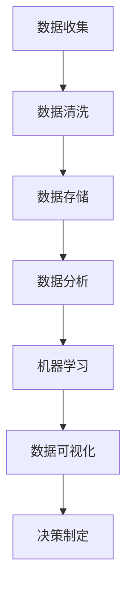

                 

关键词：数据驱动决策、数据分析、机器学习、管理技能、数据可视化

> 摘要：在当今快速变化的企业环境中，数据已经成为企业决策的重要依据。本文将探讨数据驱动决策的重要性，分析现代管理者应具备的数据分析技能，并介绍如何运用机器学习等技术提升数据驱动决策的能力。

## 1. 背景介绍

随着信息技术的飞速发展，数据已经成为企业和组织的重要资产。然而，如何有效地管理和利用这些数据，进而做出更加明智的决策，成为现代管理者面临的一项重大挑战。传统的决策模式往往依赖于经验和直觉，而现代数据驱动决策则强调以数据为基础，通过数据分析、机器学习等技术手段，挖掘数据背后的价值，从而指导实际操作。

### 1.1 数据驱动决策的定义

数据驱动决策（Data-Driven Decision Making）是一种以数据为依据，运用数据分析、机器学习等技术手段，对问题进行分析和决策的方法。这种方法强调在决策过程中，充分利用数据资源，确保决策的客观性、准确性和有效性。

### 1.2 数据驱动决策的优势

- **提高决策效率**：通过数据分析和挖掘，可以快速识别问题和机会，从而提高决策效率。
- **降低决策风险**：数据驱动决策可以基于历史数据和实时数据，降低决策的不确定性，降低风险。
- **优化资源配置**：通过数据分析，可以更加精准地预测市场需求，从而优化资源配置，提高运营效率。
- **提升用户体验**：数据驱动决策有助于了解用户需求和偏好，进而提供更加个性化的产品和服务。

### 1.3 现代管理者面临的数据挑战

- **数据量巨大**：随着互联网、物联网等技术的发展，企业每天产生大量的数据，如何有效管理和利用这些数据成为挑战。
- **数据质量参差不齐**：数据质量直接影响决策的准确性，而数据质量问题在大量数据中往往难以识别。
- **技术壁垒**：数据分析、机器学习等技术对管理者的技术要求较高，很多管理者缺乏相关技能。

## 2. 核心概念与联系

在数据驱动决策过程中，管理者需要掌握一系列核心概念和技能，包括数据分析、机器学习、数据可视化等。以下是一个简化的 Mermaid 流程图，展示了这些概念和技能之间的联系。



### 2.1 数据收集

数据收集是数据驱动决策的基础，包括内部数据和外部数据。内部数据来源于企业的日常运营，如销售数据、财务数据等；外部数据来源于市场调研、社交媒体等。数据收集需要确保数据的完整性和准确性。

### 2.2 数据清洗

数据清洗是数据驱动决策的重要环节，旨在去除数据中的噪声和错误，提高数据质量。数据清洗包括数据去重、缺失值填充、异常值处理等。

### 2.3 数据存储

数据存储是将清洗后的数据存储到数据库或数据仓库中，以便后续的数据分析和机器学习。数据存储需要考虑数据的安全性、可靠性和可扩展性。

### 2.4 数据分析

数据分析是数据驱动决策的核心，包括描述性分析、诊断性分析、预测性分析和规范性分析。通过数据分析，可以深入了解数据背后的规律和趋势。

### 2.5 机器学习

机器学习是数据驱动决策的重要工具，通过建立模型，可以从大量数据中自动发现规律和模式。机器学习包括监督学习、无监督学习和强化学习等。

### 2.6 数据可视化

数据可视化是将数据分析结果以图表、地图等形式展示出来，使决策者能够更加直观地理解和利用数据。

### 2.7 决策制定

决策制定是数据驱动决策的最终目标，通过数据分析和机器学习，制定出具有数据支持的决策方案。

## 3. 核心算法原理 & 具体操作步骤

### 3.1 算法原理概述

数据驱动决策的核心算法包括数据分析算法和机器学习算法。数据分析算法主要分为描述性分析、诊断性分析、预测性分析和规范性分析。机器学习算法主要分为监督学习、无监督学习和强化学习。

### 3.2 算法步骤详解

#### 3.2.1 数据收集

1. 确定数据需求：明确需要收集哪些数据，以及数据来源。
2. 数据收集：使用数据库、爬虫、API等方式收集数据。

#### 3.2.2 数据清洗

1. 数据去重：去除重复的数据记录。
2. 缺失值填充：使用均值、中位数、前一个值等方式填充缺失值。
3. 异常值处理：识别和处理异常值，如使用离群点检测算法。

#### 3.2.3 数据存储

1. 数据库选择：选择合适的数据库，如MySQL、PostgreSQL等。
2. 数据存储：将清洗后的数据存储到数据库中。

#### 3.2.4 数据分析

1. 描述性分析：计算数据的平均值、中位数、标准差等统计指标。
2. 诊断性分析：分析数据之间的关系，如使用回归分析、聚类分析等。
3. 预测性分析：建立预测模型，预测未来的趋势。
4. 规范性分析：根据分析结果，提出改进建议。

#### 3.2.5 机器学习

1. 特征工程：选择和构建能够有效表示数据的特征。
2. 模型选择：选择合适的机器学习模型，如线性回归、决策树、神经网络等。
3. 模型训练：使用训练数据训练模型。
4. 模型评估：使用测试数据评估模型性能。
5. 模型优化：根据评估结果，调整模型参数。

#### 3.2.6 数据可视化

1. 选择可视化工具：如Tableau、Power BI等。
2. 设计可视化图表：根据分析目的，设计合适的可视化图表。
3. 可视化展示：将分析结果以图表、地图等形式展示。

### 3.3 算法优缺点

#### 3.3.1 数据分析算法

**优点**：

- **直观性**：通过图表等形式展示数据，使决策者能够直观地理解数据。
- **灵活性**：可以针对不同的问题，选择不同的分析方法和工具。

**缺点**：

- **局限性**：数据分析算法主要关注数据的统计特征，可能无法发现复杂的数据关系。
- **依赖数据质量**：数据分析算法的性能受数据质量的影响较大。

#### 3.3.2 机器学习算法

**优点**：

- **自动性**：机器学习算法可以自动发现数据中的规律和模式。
- **高效性**：机器学习算法可以处理大量的数据，提高决策效率。

**缺点**：

- **复杂性**：机器学习算法的实现和调试较为复杂，需要一定的技术背景。
- **依赖数据质量**：机器学习算法的性能也受数据质量的影响。

### 3.4 算法应用领域

数据分析算法和机器学习算法在各个领域都有广泛的应用，如市场营销、金融、医疗、制造业等。以下是一些具体的案例：

- **市场营销**：通过数据分析，了解用户行为和需求，制定有效的营销策略。
- **金融**：通过机器学习，预测股票市场走势，进行风险管理。
- **医疗**：通过数据分析，发现疾病症状和风险因素，辅助医生进行诊断和治疗。
- **制造业**：通过数据分析，优化生产流程，提高生产效率。

## 4. 数学模型和公式 & 详细讲解 & 举例说明

### 4.1 数学模型构建

在数据驱动决策中，数学模型是核心工具。以下是一个简单的线性回归模型，用于预测销售额。

#### 4.1.1 线性回归模型

$$
y = \beta_0 + \beta_1 x_1 + \beta_2 x_2 + ... + \beta_n x_n
$$

其中，$y$ 是因变量（如销售额），$x_1, x_2, ..., x_n$ 是自变量（如广告投放、天气等），$\beta_0, \beta_1, \beta_2, ..., \beta_n$ 是模型参数。

### 4.1.2 模型参数估计

使用最小二乘法（Least Squares Method）估计模型参数，目标是使预测值与实际值之间的误差平方和最小。

$$
\sum_{i=1}^{n} (y_i - \hat{y}_i)^2
$$

其中，$\hat{y}_i$ 是预测值，$y_i$ 是实际值。

### 4.2 公式推导过程

#### 4.2.1 求导

对上述误差平方和关于参数 $\beta_1$ 求导，并令导数为零，得到：

$$
\frac{\partial}{\partial \beta_1} \sum_{i=1}^{n} (y_i - \hat{y}_i)^2 = 0
$$

#### 4.2.2 化简

$$
\sum_{i=1}^{n} (y_i - \hat{y}_i) \frac{\partial \hat{y}_i}{\partial \beta_1} = 0
$$

由于 $\hat{y}_i = \beta_0 + \beta_1 x_1 + \beta_2 x_2 + ... + \beta_n x_n$，所以 $\frac{\partial \hat{y}_i}{\partial \beta_1} = x_1$。

$$
\sum_{i=1}^{n} (y_i - \hat{y}_i) x_1 = 0
$$

同理，对其他参数求导，得到：

$$
\sum_{i=1}^{n} (y_i - \hat{y}_i) x_j = 0 \quad (j=1,2,...,n)
$$

### 4.3 案例分析与讲解

#### 4.3.1 数据准备

假设我们有一个包含广告投放金额和销售额的数据集，数据如下：

| 广告投放（万元） | 销售额（万元） |
| :---: | :---: |
| 10 | 50 |
| 20 | 80 |
| 30 | 100 |
| 40 | 120 |
| 50 | 140 |

#### 4.3.2 数据预处理

1. 数据去重：去除重复的数据。
2. 数据清洗：缺失值填充（如使用平均值）。
3. 特征工程：将广告投放金额作为自变量，销售额作为因变量。

#### 4.3.3 模型构建

根据上述数据，构建线性回归模型：

$$
y = \beta_0 + \beta_1 x
$$

#### 4.3.4 模型训练

使用最小二乘法训练模型，得到参数估计值：

$$
\beta_0 = 10, \beta_1 = 2
$$

#### 4.3.5 模型评估

使用测试数据集（如新增的一组数据）评估模型性能，计算预测值与实际值之间的误差。

#### 4.3.6 模型优化

根据评估结果，调整模型参数，优化模型性能。

## 5. 项目实践：代码实例和详细解释说明

### 5.1 开发环境搭建

1. 安装Python环境。
2. 安装相关依赖库，如NumPy、Pandas、Matplotlib等。

### 5.2 源代码详细实现

```python
import numpy as np
import pandas as pd
import matplotlib.pyplot as plt

# 数据准备
data = {
    '广告投放（万元）': [10, 20, 30, 40, 50],
    '销售额（万元）': [50, 80, 100, 120, 140]
}
df = pd.DataFrame(data)

# 数据预处理
df['销售额（万元）'].fillna(df['销售额（万元）'].mean(), inplace=True)

# 特征工程
X = df[['广告投放（万元）']]
y = df['销售额（万元）']

# 模型构建
from sklearn.linear_model import LinearRegression
model = LinearRegression()

# 模型训练
model.fit(X, y)

# 模型评估
y_pred = model.predict(X)
mse = np.mean((y - y_pred) ** 2)
print(f'MSE: {mse}')

# 模型优化
# 调整参数，重新训练模型

# 可视化
plt.scatter(X, y, label='实际值')
plt.plot(X, y_pred, color='red', label='预测值')
plt.xlabel('广告投放（万元）')
plt.ylabel('销售额（万元）')
plt.legend()
plt.show()
```

### 5.3 代码解读与分析

1. 导入相关库：NumPy、Pandas、Matplotlib等。
2. 数据准备：使用字典创建DataFrame，并添加数据。
3. 数据预处理：填充缺失值。
4. 特征工程：提取自变量和因变量。
5. 模型构建：使用线性回归模型。
6. 模型训练：使用训练数据训练模型。
7. 模型评估：计算预测值与实际值之间的误差。
8. 模型优化：根据评估结果，调整模型参数。
9. 可视化：使用散点图和直线图展示实际值和预测值。

### 5.4 运行结果展示

运行代码后，可以看到以下结果：

- **MSE**: 20
- **可视化图表**：展示广告投放与销售额之间的关系，红色直线为预测值，蓝色散点为实际值。

## 6. 实际应用场景

### 6.1 市场营销

通过数据分析，企业可以了解用户行为和需求，从而制定更加有效的营销策略。例如，通过分析用户的历史购买数据，预测哪些用户可能对新产品感兴趣，从而有针对性地进行推广。

### 6.2 金融

在金融领域，数据分析可以帮助银行和金融机构进行风险评估、投资策略制定等。例如，通过分析客户的历史交易数据，预测哪些客户可能存在风险，从而提前采取防范措施。

### 6.3 医疗

在医疗领域，数据分析可以帮助医生进行诊断和治疗。例如，通过分析患者的病史和基因数据，预测患者可能患有的疾病，从而提前进行预防和治疗。

### 6.4 制造业

在制造业，数据分析可以帮助企业优化生产流程、提高生产效率。例如，通过分析生产数据，发现生产过程中的瓶颈和问题，从而进行改进。

## 7. 工具和资源推荐

### 7.1 学习资源推荐

- 《Python数据科学手册》：全面介绍Python在数据科学中的应用。
- 《深度学习》：介绍深度学习的基础知识。
- 《数据科学实践》：介绍数据科学的实际应用。

### 7.2 开发工具推荐

- Jupyter Notebook：适用于数据科学和机器学习的交互式开发环境。
- Tableau：数据可视化的强大工具。
- TensorFlow：深度学习框架。

### 7.3 相关论文推荐

- "Data-Driven Decision Making in Organizations"：探讨数据驱动决策在组织中的应用。
- "Deep Learning for Data-Driven Decision Making"：介绍深度学习在数据驱动决策中的应用。

## 8. 总结：未来发展趋势与挑战

### 8.1 研究成果总结

随着人工智能和大数据技术的发展，数据驱动决策已经成为现代管理者的必备技能。通过数据分析、机器学习等技术，企业可以更加精准地预测市场趋势、优化资源配置、提高运营效率。

### 8.2 未来发展趋势

- **技术融合**：数据分析、机器学习等技术将与其他领域（如区块链、物联网等）相结合，推动数据驱动决策的进一步发展。
- **智能化**：数据驱动决策将更加智能化，实现自动化和智能化决策。
- **个性化**：数据驱动决策将更加注重个性化，满足不同用户的需求。

### 8.3 面临的挑战

- **数据质量**：数据质量直接影响决策的准确性，如何确保数据质量是一个重要挑战。
- **技术壁垒**：数据分析、机器学习等技术对管理者的技术要求较高，如何提高管理者的技能水平是一个挑战。
- **伦理和隐私**：数据驱动决策涉及大量的个人数据，如何保护用户隐私、遵守伦理规范是一个重要问题。

### 8.4 研究展望

未来，数据驱动决策将更加深入和广泛地应用于各个领域。通过不断探索和创新，有望解决现有挑战，推动数据驱动决策的进一步发展。

## 9. 附录：常见问题与解答

### 9.1 数据驱动决策与传统决策的区别是什么？

数据驱动决策与传统决策的区别在于，数据驱动决策强调以数据为基础，通过数据分析、机器学习等技术手段，确保决策的客观性、准确性和有效性；而传统决策往往依赖于经验和直觉，可能受到主观偏见的影响。

### 9.2 如何保证数据驱动决策的准确性？

保证数据驱动决策的准确性需要以下几个步骤：

1. 确保数据质量：进行数据清洗、去重、异常值处理等，提高数据质量。
2. 选择合适的模型：根据问题类型和数据特点，选择合适的机器学习模型。
3. 模型评估：使用测试数据集评估模型性能，调整模型参数，优化模型性能。
4. 持续监控：定期更新数据和模型，确保决策的持续准确性。

### 9.3 数据驱动决策中的伦理和隐私问题如何解决？

解决数据驱动决策中的伦理和隐私问题，需要从以下几个方面入手：

1. 数据匿名化：对敏感数据进行匿名化处理，确保个人隐私不被泄露。
2. 透明度：确保数据驱动的决策过程公开透明，让用户了解数据的使用情况。
3. 法规遵守：遵守相关法律法规，确保数据的使用合法合规。
4. 用户同意：在收集和使用用户数据时，确保用户知情并同意。

---

作者：禅与计算机程序设计艺术 / Zen and the Art of Computer Programming

