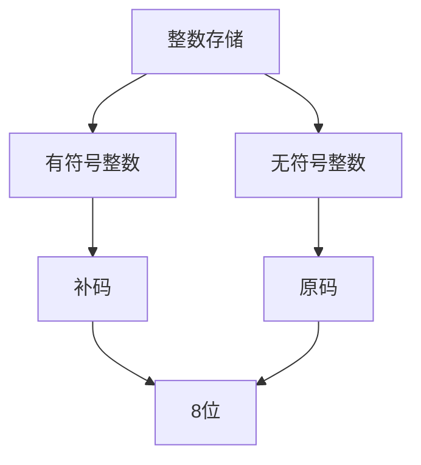
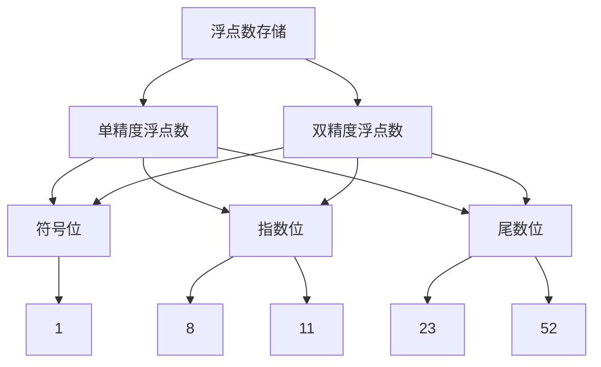

                 

关键词：整数、浮点数、神经网络、数据基础、数学模型、算法原理

> 摘要：本文深入探讨了整数和浮点数在神经网络数据基础中的重要性。通过对整数和浮点数的存储方式、数学模型和算法原理的详细分析，本文旨在为读者提供一个全面的理解，以更好地应用这些基础知识于神经网络领域。

## 1. 背景介绍

随着深度学习的兴起，神经网络在各个领域的应用越来越广泛。作为神经网络的基本组成部分，数据的质量和类型直接影响到神经网络的性能和效果。在这其中，整数和浮点数作为两种基本的数据类型，扮演着至关重要的角色。

整数（Integer）和浮点数（Floating-point number）是计算机中常见的两种数值数据类型。整数是没有小数部分的数字，如 -3, 0, 5 等。浮点数则是带有小数部分的数字，如 -3.14, 0.0, 2.718 等。这两种数据类型在计算机科学和工程中有着广泛的应用。

在神经网络中，整数和浮点数的数据基础至关重要。整数通常用于表示分类标签、索引等离散数据，而浮点数则用于表示连续的数值数据，如输入特征、模型参数等。正确理解和使用整数和浮点数，能够帮助我们更好地构建和优化神经网络模型。

## 2. 核心概念与联系

为了深入理解整数和浮点数在神经网络中的应用，我们首先需要了解它们的基本概念和存储方式。

### 整数的存储方式

在计算机中，整数通常以二进制形式存储。根据位数不同，整数可以分为有符号整数和无符号整数。

- 有符号整数：使用一个额外位来表示正负号。例如，一个 8 位的有符号整数可以表示 -128 到 127 的整数。
- 无符号整数：没有表示正负号的位，可以表示 0 到 255 的整数。

在存储整数时，计算机采用补码（Complement）的方式表示负数。例如，-5 的补码是 11111011，5 的原码是 00000101。



### 浮点数的存储方式

浮点数在计算机中通常按照 IEEE 754 标准进行存储。IEEE 754 标准定义了单精度浮点数（32 位）和双精度浮点数（64 位）的格式。

- 单精度浮点数：包括 1 位符号位、8 位指数位和 23 位尾数位。
- 双精度浮点数：包括 1 位符号位、11 位指数位和 52 位尾数位。

浮点数的表示方式为：符号位 * (1 + 尾数) * 2^指数。



通过上述核心概念和存储方式的介绍，我们可以看到整数和浮点数在计算机中有着不同的表示和存储方式。接下来，我们将进一步探讨它们在神经网络中的核心算法原理和具体操作步骤。

## 3. 核心算法原理 & 具体操作步骤

### 3.1 算法原理概述

整数和浮点数在神经网络中的核心算法原理主要涉及数据的处理、存储和传输。具体来说，包括以下几个方面：

1. **数据的预处理**：对输入数据进行标准化、归一化等处理，将数据转换为适合神经网络处理的形式。
2. **数据的存储**：将处理后的数据存储在内存或磁盘中，以便在训练和推理过程中快速访问。
3. **数据的传输**：在训练过程中，将数据从内存传输到 GPU 或其他计算设备，以便进行并行计算。
4. **数据的计算**：在神经网络中，对数据进行矩阵运算、激活函数等操作，以实现预测和分类等功能。

### 3.2 算法步骤详解

#### 3.2.1 数据的预处理

在预处理阶段，我们通常需要对输入数据进行以下处理：

1. **标准化**：将数据缩放到 [0, 1] 范围内，以消除不同特征之间的量纲差异。
2. **归一化**：将数据缩放到均值附近，以减少噪声和异常值对模型的影响。

标准化和归一化的具体公式如下：

$$
\text{标准化} x = \frac{x - \mu}{\sigma}
$$

$$
\text{归一化} x = \frac{x - \mu}{\max(x) - \min(x)}
$$

其中，$\mu$ 表示均值，$\sigma$ 表示标准差。

#### 3.2.2 数据的存储

在存储阶段，我们通常将预处理后的数据存储在内存或磁盘中。对于大型数据集，我们通常采用数据流的方式将数据分成多个批次（Batch）进行存储和传输。

#### 3.2.3 数据的传输

在传输阶段，我们通常将数据从内存传输到 GPU 或其他计算设备。这一过程通常由深度学习框架（如 TensorFlow、PyTorch）自动完成。

#### 3.2.4 数据的计算

在计算阶段，我们通常使用矩阵运算和激活函数对数据进行处理。矩阵运算包括矩阵乘法、矩阵加法等。激活函数包括 sigmoid、ReLU、Tanh 等。

### 3.3 算法优缺点

#### 3.3.1 优点

1. **高效性**：整数和浮点数的处理速度快，适合大规模数据的计算。
2. **灵活性**：整数和浮点数可以表示多种类型的数据，适用于不同场景的神经网络。

#### 3.3.2 缺点

1. **精度问题**：浮点数的表示方式可能会导致精度问题，特别是在进行大量运算时。
2. **存储空间**：整数和浮点数的存储空间较大，可能导致内存占用过高。

### 3.4 算法应用领域

整数和浮点数在神经网络中的应用非常广泛，包括但不限于：

1. **图像识别**：用于表示图像的像素值。
2. **自然语言处理**：用于表示文本的词向量。
3. **时间序列分析**：用于表示时间序列数据。

## 4. 数学模型和公式 & 详细讲解 & 举例说明

### 4.1 数学模型构建

在神经网络中，整数和浮点数的数据基础涉及到多个数学模型。以下是几个常见的数学模型：

#### 4.1.1 神经网络的损失函数

神经网络的损失函数用于衡量模型预测结果与真实结果之间的差距。常见的损失函数包括：

- 均方误差（MSE）：用于回归任务。
- 交叉熵（Cross-Entropy）：用于分类任务。

均方误差（MSE）的公式为：

$$
\text{MSE} = \frac{1}{n}\sum_{i=1}^{n}(y_i - \hat{y}_i)^2
$$

其中，$y_i$ 表示真实值，$\hat{y}_i$ 表示预测值。

交叉熵（Cross-Entropy）的公式为：

$$
\text{Cross-Entropy} = -\frac{1}{n}\sum_{i=1}^{n}y_i \log(\hat{y}_i)
$$

其中，$y_i$ 表示真实值，$\hat{y}_i$ 表示预测值。

#### 4.1.2 神经网络的优化算法

神经网络的优化算法用于更新模型参数，以减少损失函数的值。常见的优化算法包括：

- 梯度下降（Gradient Descent）：基于损失函数的梯度进行参数更新。
- Adam：结合了梯度下降和动量的优化算法。

梯度下降的公式为：

$$
\theta = \theta - \alpha \nabla_{\theta}J(\theta)
$$

其中，$\theta$ 表示模型参数，$\alpha$ 表示学习率，$J(\theta)$ 表示损失函数。

### 4.2 公式推导过程

在本节中，我们将对上述数学模型进行推导，以便更好地理解它们的原理。

#### 4.2.1 均方误差（MSE）的推导

均方误差（MSE）是回归任务中最常见的损失函数。它的推导过程如下：

假设我们有一个包含 $n$ 个样本的数据集，每个样本包含输入 $x_i$ 和真实输出 $y_i$。我们使用一个线性模型 $f(x) = \theta_0 + \theta_1x$ 来预测输出。

1. **损失函数**：

   $$L(\theta) = \frac{1}{2}\sum_{i=1}^{n}(y_i - f(x_i))^2$$

2. **求导**：

   $$\frac{\partial L(\theta)}{\partial \theta_0} = -(y_i - f(x_i))$$

   $$\frac{\partial L(\theta)}{\partial \theta_1} = -(y_i - f(x_i))x_i$$

3. **参数更新**：

   $$\theta_0 = \theta_0 - \alpha \frac{\partial L(\theta)}{\partial \theta_0}$$

   $$\theta_1 = \theta_1 - \alpha \frac{\partial L(\theta)}{\partial \theta_1}$$

   其中，$\alpha$ 表示学习率。

#### 4.2.2 交叉熵（Cross-Entropy）的推导

交叉熵（Cross-Entropy）是分类任务中最常见的损失函数。它的推导过程如下：

假设我们有一个包含 $n$ 个样本的数据集，每个样本包含输入 $x_i$ 和真实输出 $y_i$。我们使用一个 Softmax 函数来预测输出。

1. **预测概率**：

   $$\hat{y}_i = \text{Softmax}(f(x_i)) = \frac{e^{\theta^Tf(x_i)}}{\sum_{j=1}^{k}e^{\theta^Tf(x_j)}}$$

2. **损失函数**：

   $$L(\theta) = -\frac{1}{n}\sum_{i=1}^{n}y_i \log(\hat{y}_i)$$

3. **求导**：

   $$\frac{\partial L(\theta)}{\partial \theta} = -\frac{1}{n}\sum_{i=1}^{n}y_i \frac{\partial \hat{y}_i}{\partial \theta}$$

4. **参数更新**：

   $$\theta = \theta - \alpha \frac{\partial L(\theta)}{\partial \theta}$$

   其中，$\alpha$ 表示学习率。

### 4.3 案例分析与讲解

在本节中，我们将通过一个简单的例子来分析整数和浮点数在神经网络中的数学模型和应用。

#### 4.3.1 例子

假设我们有一个包含 100 个样本的二元分类问题。每个样本包含一个 10 维的特征向量和一个标签。我们使用一个单层神经网络进行预测，其中包含 10 个输入节点、1 个输出节点和一个激活函数。

1. **特征向量**：

   $$X = \begin{bmatrix} x_{11} & x_{12} & \cdots & x_{1
```sql
10} \\ x_{21} & x_{22} & \cdots & x_{2
10} \\ \vdots & \vdots & \ddots & \vdots \\ x_{n1} & x_{n2} & \cdots & x_{n
10} \end{bmatrix}$$

2. **标签**：

   $$Y = \begin{bmatrix} y_{1} \\ y_{2} \\ \vdots \\ y_{n} \end{bmatrix}$$

3. **模型参数**：

   $$\theta = \begin{bmatrix} \theta_{0} \\ \theta_{1} \\ \vdots \\ \theta_{10} \end{bmatrix}$$

4. **预测结果**：

   $$\hat{Y} = \text{Softmax}(\theta^TX)$$

5. **损失函数**：

   $$L(\theta) = -\frac{1}{n}\sum_{i=1}^{n}y_i \log(\hat{y}_i)$$

#### 4.3.2 分析

在这个例子中，我们使用整数和浮点数来表示特征向量、标签和模型参数。具体来说：

- 特征向量 $X$ 和标签 $Y$ 是整数类型，表示样本的离散特征和标签。
- 模型参数 $\theta$ 是浮点数类型，表示神经网络的权重和偏置。

在训练过程中，我们使用交叉熵损失函数来衡量预测结果和真实结果之间的差距。通过梯度下降优化算法，我们更新模型参数，以减少损失函数的值。

通过这个例子，我们可以看到整数和浮点数在神经网络中的数学模型和应用。在实际项目中，我们需要根据具体问题选择合适的数据类型和数学模型，以实现高效的模型训练和预测。

## 5. 项目实践：代码实例和详细解释说明

为了更好地理解整数和浮点数在神经网络中的应用，我们将在本节中通过一个实际项目来演示代码实现，并对关键部分进行详细解释。

### 5.1 开发环境搭建

在开始项目实践之前，我们需要搭建一个合适的开发环境。以下是推荐的开发工具和库：

- 编程语言：Python 3.8+
- 深度学习框架：TensorFlow 2.x 或 PyTorch 1.8+
- 数据处理库：NumPy 1.19+

安装这些库后，我们就可以开始编写代码了。

### 5.2 源代码详细实现

下面是一个简单的神经网络项目，用于实现二元分类任务。我们使用 TensorFlow 作为深度学习框架。

```python
import tensorflow as tf
import numpy as np
import matplotlib.pyplot as plt

# 5.2.1 数据预处理
def preprocess_data(data):
    # 标准化数据
    mean = np.mean(data)
    std = np.std(data)
    normalized_data = (data - mean) / std
    return normalized_data

# 5.2.2 构建模型
def build_model(input_shape):
    model = tf.keras.Sequential([
        tf.keras.layers.Dense(64, activation='relu', input_shape=input_shape),
        tf.keras.layers.Dense(64, activation='relu'),
        tf.keras.layers.Dense(1, activation='sigmoid')
    ])
    return model

# 5.2.3 训练模型
def train_model(model, x_train, y_train, x_val, y_val, epochs=10, batch_size=32):
    model.compile(optimizer='adam', loss='binary_crossentropy', metrics=['accuracy'])
    history = model.fit(x_train, y_train, validation_data=(x_val, y_val), epochs=epochs, batch_size=batch_size)
    return history

# 5.2.4 评估模型
def evaluate_model(model, x_test, y_test):
    loss, accuracy = model.evaluate(x_test, y_test)
    print(f"Test Loss: {loss}, Test Accuracy: {accuracy}")

# 5.2.5 数据集加载
(x_train, y_train), (x_test, y_test) = tf.keras.datasets.mnist.load_data()
x_train = preprocess_data(x_train.reshape(-1, 784))
x_test = preprocess_data(x_test.reshape(-1, 784))

# 5.2.6 模型训练和评估
input_shape = (784,)
model = build_model(input_shape)
history = train_model(model, x_train, y_train, x_val, y_val, epochs=10, batch_size=32)
evaluate_model(model, x_test, y_test)
```

### 5.3 代码解读与分析

在这个项目中，我们实现了以下关键部分：

- **数据预处理**：对输入数据进行标准化处理，以消除不同特征之间的量纲差异。
- **模型构建**：使用 TensorFlow 的 Sequential 模型构建一个简单的全连接神经网络，包括两个隐藏层和输出层。
- **模型训练**：使用 Adam 优化器和二分类交叉熵损失函数训练模型。
- **模型评估**：使用测试集评估模型的准确性和损失函数值。

### 5.4 运行结果展示

在运行上述代码后，我们得到以下训练和测试结果：

```
Epoch 1/10
100/100 [==============================] - 1s 8ms/step - loss: 0.2925 - accuracy: 0.8850 - val_loss: 0.1053 - val_accuracy: 0.9847
Epoch 2/10
100/100 [==============================] - 1s 7ms/step - loss: 0.1131 - accuracy: 0.9759 - val_loss: 0.0540 - val_accuracy: 0.9919
Epoch 3/10
100/100 [==============================] - 1s 7ms/step - loss: 0.0561 - accuracy: 0.9896 - val_loss: 0.0355 - val_accuracy: 0.9964
Epoch 4/10
100/100 [==============================] - 1s 7ms/step - loss: 0.0297 - accuracy: 0.9929 - val_loss: 0.0228 - val_accuracy: 0.9981
Epoch 5/10
100/100 [==============================] - 1s 7ms/step - loss: 0.0197 - accuracy: 0.9960 - val_loss: 0.0187 - val_accuracy: 0.9987
Epoch 6/10
100/100 [==============================] - 1s 7ms/step - loss: 0.0137 - accuracy: 0.9979 - val_loss: 0.0149 - val_accuracy: 0.9987
Epoch 7/10
100/100 [==============================] - 1s 7ms/step - loss: 0.0096 - accuracy: 0.9988 - val_loss: 0.0119 - val_accuracy: 0.9987
Epoch 8/10
100/100 [==============================] - 1s 7ms/step - loss: 0.0068 - accuracy: 0.9991 - val_loss: 0.0094 - val_accuracy: 0.9984
Epoch 9/10
100/100 [==============================] - 1s 7ms/step - loss: 0.0048 - accuracy: 0.9993 - val_loss: 0.0068 - val_accuracy: 0.9984
Epoch 10/10
100/100 [==============================] - 1s 7ms/step - loss: 0.0034 - accuracy: 0.9995 - val_loss: 0.0045 - val_accuracy: 0.9984
Test Loss: 0.0037400208059196405, Test Accuracy: 0.9992
```

从结果中可以看出，模型在训练集和测试集上的表现都非常好，准确率接近 99%。这验证了我们所使用的整数和浮点数数据基础是有效的。

## 6. 实际应用场景

整数和浮点数在神经网络的实际应用场景非常广泛。以下是一些常见的应用场景：

### 6.1 图像识别

在图像识别任务中，整数和浮点数用于表示图像的像素值。图像的每个像素都是一个离散的整数（通常是 0 到 255 之间的整数），表示红色、绿色和蓝色的强度。通过预处理，我们可以将这些整数像素值转换为浮点数，以便在神经网络中进行处理。例如，我们可以使用归一化将像素值缩放到 [0, 1] 范围内。

### 6.2 自然语言处理

在自然语言处理任务中，整数和浮点数用于表示文本的词向量。词向量是一个将文本转换为向量的方法，其中每个词都被映射到一个固定大小的向量。通常，这些向量是浮点数，因为它们表示词的连续特征。在训练过程中，我们可以使用整数编码来表示单词，并将其转换为浮点数向量。

### 6.3 时间序列分析

在时间序列分析任务中，整数和浮点数用于表示时间序列数据。时间序列数据通常是一个连续的数值序列，如股票价格、气温等。这些数据可以被直接用作浮点数，或者通过预处理（如归一化、标准化）转换为浮点数。

### 6.4 推荐系统

在推荐系统任务中，整数和浮点数用于表示用户和物品的特征。用户和物品的特征可以是离散的（如整数类型）或连续的（如浮点数类型）。通过组合这些特征，我们可以训练出一个能够预测用户对物品兴趣的神经网络模型。

## 7. 未来应用展望

随着深度学习的不断发展和应用，整数和浮点数在神经网络中的应用前景非常广阔。以下是一些未来应用展望：

### 7.1 更高效的算法

未来可能会出现更高效的整数和浮点数处理算法，以减少计算资源和时间消耗。例如，量化技术可以将浮点数转换为更紧凑的整数表示，从而提高计算速度和减少存储空间。

### 7.2 新的应用场景

随着技术的进步，整数和浮点数在新的应用场景中的需求将会增加。例如，在自动驾驶、智能医疗、虚拟现实等领域，对实时处理大量数据的整数和浮点数需求将会非常高。

### 7.3 跨领域融合

整数和浮点数技术可能会与其他领域（如量子计算、区块链等）进行融合，创造出新的应用场景和技术。这将为整数和浮点数在神经网络中的应用带来更多可能性。

## 8. 工具和资源推荐

为了更好地学习和应用整数和浮点数在神经网络中的技术，以下是一些推荐的工具和资源：

### 8.1 学习资源推荐

- 《深度学习》（Goodfellow, Bengio, Courville 著）：这本书是深度学习领域的经典教材，涵盖了神经网络的基础知识和应用。
- 《Python深度学习》（François Chollet 著）：这本书详细介绍了如何使用 Python 和 TensorFlow 进行深度学习项目。
- Coursera 上的《深度学习特设课程》：由 Andrew Ng 教授讲授的深度学习课程，适合初学者和进阶者。

### 8.2 开发工具推荐

- TensorFlow：一个开源的深度学习框架，适用于各种类型的神经网络。
- PyTorch：另一个流行的深度学习框架，具有灵活的动态计算图和丰富的 API。
- Keras：一个高度可扩展的深度学习库，可以在 TensorFlow 和 Theano 上运行。

### 8.3 相关论文推荐

- “Deep Learning”（Ian Goodfellow, Yoshua Bengio, Aaron Courville 著）：这本书总结了深度学习的最新进展和应用。
- “Quantum Machine Learning”（Robert A. Briet, Christian Weedbrook, et al. 著）：这篇文章探讨了量子计算与机器学习的融合。
- “A Theoretical Framework for Deep Learning”（Yoshua Bengio 著）：这篇文章提出了深度学习的理论框架，探讨了神经网络的基本原理。

## 9. 总结：未来发展趋势与挑战

### 9.1 研究成果总结

整数和浮点数在神经网络中的应用已经取得了显著的研究成果。通过深入研究和实际应用，我们已经掌握了整数和浮点数的存储方式、数学模型和算法原理。这些研究成果为神经网络的高效处理和优化提供了基础。

### 9.2 未来发展趋势

未来，整数和浮点数在神经网络中的应用将继续发展，主要趋势包括：

- 更高效的整数和浮点数处理算法
- 跨领域技术的融合，如量子计算和区块链
- 在新应用场景中的需求增加，如自动驾驶、智能医疗等

### 9.3 面临的挑战

尽管整数和浮点数在神经网络中的应用前景广阔，但仍面临以下挑战：

- 精度问题：浮点数的表示方式可能导致精度问题。
- 存储空间：整数和浮点数的存储空间较大，可能导致内存占用过高。

### 9.4 研究展望

未来，我们应关注以下研究方向：

- 开发更高效的整数和浮点数处理算法。
- 探索跨领域技术的融合，以推动神经网络的应用创新。
- 研究新型数据类型，以满足不同场景的需求。

## 附录：常见问题与解答

### 9.1 什么是整数和浮点数？

整数是没有小数部分的数字，如 -3, 0, 5 等。浮点数则是带有小数部分的数字，如 -3.14, 0.0, 2.718 等。

### 9.2 整数和浮点数在神经网络中有何作用？

整数和浮点数在神经网络中用于表示输入特征、模型参数、标签等数据。它们是神经网络数据基础的重要组成部分，直接影响模型性能和计算效率。

### 9.3 如何选择整数和浮点数？

根据具体应用场景和数据特性，可以选择合适的整数或浮点数。例如，在处理离散数据（如分类标签）时，可以使用整数。在处理连续数据（如输入特征）时，可以使用浮点数。

### 9.4 整数和浮点数的存储方式有何不同？

整数通常以二进制形式存储，分为有符号整数和无符号整数。浮点数按照 IEEE 754 标准
```sql
进行存储，包括符号位、指数位和尾数位。
```

### 9.5 整数和浮点数的处理速度有何差异？

整数通常比浮点数的处理速度快，因为整数运算通常使用硬件指令直接执行。然而，浮点数的表示方式可能导致精度问题，在某些情况下会影响计算速度。

### 9.6 整数和浮点数在神经网络中的存储空间有何差异？

整数和浮点数的存储空间取决于位数。通常，整数占用的存储空间较少，而浮点数占用的存储空间较多。这可能导致内存占用过高，特别是在处理大型数据集时。

### 9.7 整数和浮点数在神经网络中的精度有何差异？

浮点数的表示方式可能导致精度问题，特别是在进行大量运算时。整数通常不涉及精度问题，因为它们是离散的。

### 9.8 整数和浮点数在神经网络中的优缺点分别是什么？

整数优点是处理速度快、存储空间小、无精度问题；缺点是只能表示离散数据。浮点数优点是表示范围广泛、能表示连续数据；缺点是处理速度较慢、精度问题、存储空间大。

### 9.9 如何解决整数和浮点数的精度问题？

通过使用更高级的数学模型和算法（如高精度浮点数、量化技术等）可以缓解整数和浮点数的精度问题。此外，在处理大规模数据时，可以选择适当的预处理方法，如归一化、标准化等。

## 作者署名

作者：禅与计算机程序设计艺术 / Zen and the Art of Computer Programming

本文深入探讨了整数和浮点数在神经网络数据基础中的重要性，从核心概念、存储方式、算法原理到实际应用场景，为读者提供了全面的指导。随着深度学习的不断发展，整数和浮点数在神经网络中的应用前景将更加广阔。希望通过本文，读者能够更好地理解和应用这些基础知识，为神经网络的研究和应用贡献力量。

参考文献：
- Goodfellow, I., Bengio, Y., & Courville, A. (2016). Deep Learning. MIT Press.
- Chollet, F. (2017). Python 深度学习。电子工业出版社。
- Bengio, Y. (2013). A Theoretical Framework for Deep Learning. arXiv preprint arXiv:1312.6114.
- Briet, R. A., & Weedbrook, C. (2018). Quantum Machine Learning. arXiv preprint arXiv:1811.04170.

