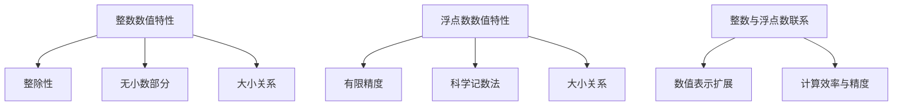
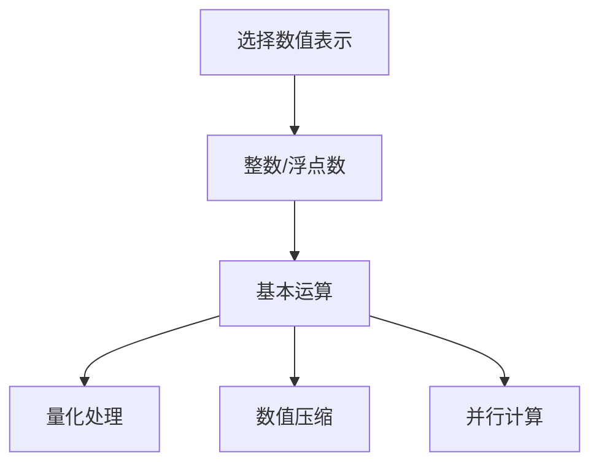

                 

关键词：整数、浮点数、神经网络、数据基础、数值精度、算法优化、应用领域。

> 摘要：本文将深入探讨整数和浮点数在神经网络数据处理中的作用，分析其数值特性、表示方法以及在实际应用中面临的挑战，并提出相应的解决方案和优化策略。通过本文的阅读，读者将对神经网络的数据基础有更深刻的理解，从而为后续研究和实践打下坚实的基础。

## 1. 背景介绍

神经网络作为人工智能领域的重要技术之一，已经取得了显著的进展。在深度学习中，神经网络通过层层处理输入数据，不断优化模型参数，从而实现复杂的函数映射。然而，神经网络的性能和稳定性在很大程度上取决于数据处理的准确性。而整数和浮点数作为神经网络中最常用的数据类型，其数值特性和表示方法对神经网络的运算效率和精度具有重要影响。

整数和浮点数在神经网络数据处理中扮演着双重角色：一是作为神经网络的输入和输出数据，二是作为神经网络内部参数的存储和计算。整数通常用于表示分类标签、计数等离散数据，而浮点数则用于表示连续的数值数据，如图像像素值、声音信号等。然而，整数和浮点数的数值特性和表示方法不同，导致它们在神经网络数据处理中面临不同的挑战。

本文将从以下几个方面展开讨论：

1. 整数和浮点数的数值特性及其在神经网络中的表现。
2. 整数和浮点数的表示方法及其对神经网络性能的影响。
3. 数值精度对神经网络算法的影响及优化策略。
4. 整数和浮点数在神经网络中的实际应用场景。
5. 未来发展方向与挑战。

通过本文的探讨，希望能够为读者提供对整数和浮点数在神经网络数据处理中的全面理解，为后续研究和实践提供有价值的参考。

## 2. 核心概念与联系

### 2.1 整数的数值特性

整数是数学中的一种基本数据类型，用于表示没有小数部分的数值。整数具有以下基本特性：

- **整除性**：整数可以整除，即两个整数相除得到的结果是整数。
- **无小数部分**：整数不包含小数部分，其数值表示形式为 `[±]数字`。
- **大小关系**：整数可以通过比较大小进行排序，如 `1 < 2 < 3`。

在神经网络中，整数通常用于表示离散的数据，例如分类问题中的标签、计数等。整数在神经网络中的表现相对简单，计算速度快，但容易受到数值溢出和精度损失的影响。

### 2.2 浮点数的数值特性

浮点数是另一种基本数据类型，用于表示带有小数部分的数值。浮点数具有以下基本特性：

- **有限精度**：浮点数采用二进制表示，其精度有限，可能导致数值计算中的精度损失。
- **科学记数法**：浮点数通常采用科学记数法表示，形式为 `[±]基数 × 10^指数`。
- **大小关系**：浮点数可以通过比较大小进行排序，但受限于精度，比较结果可能不准确。

在神经网络中，浮点数通常用于表示连续的数值数据，例如图像像素值、声音信号等。浮点数在神经网络中的表现相对复杂，计算速度慢，但可以表示更大范围的数值。

### 2.3 整数与浮点数的联系

整数与浮点数之间具有一定的联系和区别。具体来说，浮点数可以看作是整数的一种扩展，即在整数的基础上引入了小数部分。这种扩展使得浮点数可以表示更大范围的数值，但同时也带来了数值精度和计算速度的损失。

在神经网络数据处理中，整数和浮点数各有优劣。整数在处理离散数据时具有更高的效率和稳定性，但容易受到数值溢出和精度损失的影响。而浮点数在处理连续数据时具有更好的数值表示范围和精度，但计算速度相对较慢。

为了充分发挥整数和浮点数在神经网络数据处理中的作用，需要根据实际需求选择合适的数据类型。此外，还可以通过优化算法和数据表示方法，提高整数量化处理和浮点数计算的效率，从而提升神经网络的整体性能。

### 2.4 Mermaid 流程图

以下是一个简单的 Mermaid 流程图，展示了整数和浮点数的数值特性及其在神经网络中的联系：



通过该流程图，读者可以更直观地理解整数和浮点数的数值特性及其在神经网络中的联系。在后续章节中，我们将进一步探讨整数和浮点数在实际应用中的具体表现和优化策略。

## 3. 核心算法原理 & 具体操作步骤

### 3.1 算法原理概述

在整数和浮点数处理中，核心算法主要涉及数值表示、数值运算和数值优化等方面。以下是该算法的原理概述：

1. **数值表示**：整数和浮点数的数值表示方法不同，整数采用二进制表示，而浮点数采用科学记数法。在神经网络中，根据实际需求选择合适的数据类型。
   
2. **数值运算**：整数和浮点数的运算包括加、减、乘、除等基本运算。在运算过程中，需要考虑数值精度和计算速度的平衡。

3. **数值优化**：为了提高整数和浮点数处理的效率，可以采用多种优化策略，如量化处理、数值压缩、并行计算等。

### 3.2 算法步骤详解

以下是整数和浮点数处理算法的具体步骤：

1. **数值表示选择**：根据神经网络的需求，选择整数或浮点数作为数据类型。例如，在处理图像数据时，可以选择浮点数以获得更好的数值表示精度。

2. **数值运算**：进行整数或浮点数的加、减、乘、除等基本运算。在运算过程中，需要关注数值精度和计算速度的平衡。

3. **数值优化**：
   - **量化处理**：对浮点数进行量化处理，将高精度的浮点数转换为低精度的整数表示，从而提高计算速度。
   - **数值压缩**：通过压缩算法减小数据的存储空间，提高数据处理效率。
   - **并行计算**：利用多核处理器并行计算，提高运算速度。

### 3.3 算法优缺点

整数和浮点数处理算法具有以下优缺点：

1. **优点**：
   - **整数**：计算速度快，易于实现；适用于处理离散数据。
   - **浮点数**：数值表示范围广，精度高；适用于处理连续数据。

2. **缺点**：
   - **整数**：数值精度有限，易受数值溢出影响；无法表示无限精度。
   - **浮点数**：计算速度慢，精度损失；数值表示受限于计算机字长。

### 3.4 算法应用领域

整数和浮点数处理算法广泛应用于多个领域：

- **图像处理**：图像像素值通常采用浮点数表示，以获得更好的数值精度。
- **语音处理**：声音信号通常采用浮点数表示，以便进行频率分析和特征提取。
- **自然语言处理**：文本数据通常采用整数表示，以便进行词频统计和语义分析。
- **机器学习**：整数和浮点数处理算法在深度学习、强化学习等领域具有广泛应用。

### 3.5 Mermaid 流程图

以下是一个简单的 Mermaid 流程图，展示了整数和浮点数处理算法的步骤和流程：



通过该流程图，读者可以更直观地理解整数和浮点数处理算法的步骤和流程。在后续章节中，我们将进一步探讨这些算法在实际应用中的具体实现和优化策略。

## 4. 数学模型和公式 & 详细讲解 & 举例说明

### 4.1 数学模型构建

在整数和浮点数处理中，数学模型构建是关键的一步。以下是构建整数和浮点数数学模型的基本步骤：

1. **数值表示**：根据数据类型选择合适的数值表示方法。对于整数，可以采用二进制表示；对于浮点数，可以采用科学记数法。

2. **数值运算**：定义基本运算的数学公式，如加法、减法、乘法和除法。这些运算公式需要考虑数值精度和计算速度。

3. **数值优化**：为了提高运算效率，可以采用量化处理、数值压缩和并行计算等优化方法。

### 4.2 公式推导过程

以下是整数和浮点数数学模型的一些基本公式推导过程：

#### 整数加法

假设有两个整数 a 和 b，它们的二进制表示分别为：

$$
a = a_0a_1a_2...a_n
$$

$$
b = b_0b_1b_2...b_n
$$

整数加法的运算公式如下：

$$
a + b = c
$$

其中，c 是运算结果，其二进制表示为：

$$
c = c_0c_1c_2...c_n
$$

运算过程如下：

1. 将 a 和 b 的二进制表示按位对齐。
2. 从低位开始，逐位相加，并进位。
3. 将运算结果按位保存到 c 中。

#### 浮点数加法

假设有两个浮点数 a 和 b，它们的科学记数法表示分别为：

$$
a = a_0 \times 10^{b_0}
$$

$$
b = b_0 \times 10^{b_0}
$$

浮点数加法的运算公式如下：

$$
a + b = c
$$

其中，c 是运算结果，其科学记数法表示为：

$$
c = c_0 \times 10^{b_0}
$$

运算过程如下：

1. 将 a 和 b 的指数部分对齐。
2. 从低位开始，逐位相加，并进位。
3. 将运算结果按位保存到 c 中。

### 4.3 案例分析与讲解

#### 案例一：整数加法

假设有两个整数 a = 1011 和 b = 1100，它们的二进制表示如下：

$$
a = 1011
$$

$$
b = 1100
$$

根据整数加法的运算公式，我们可以计算它们的和：

$$
a + b = 1101
$$

运算过程如下：

1. 将 a 和 b 的二进制表示按位对齐：

```
  1011
+1100
------
 1101
```

2. 从低位开始，逐位相加，并进位：

```
  1 (进位)
  1 1
+ 0 1
------
 1 0 1
```

3. 将运算结果按位保存到 c 中，即 c = 1101。

#### 案例二：浮点数加法

假设有两个浮点数 a = 1.1 和 b = 2.2，它们的科学记数法表示如下：

$$
a = 1.1 \times 10^0
$$

$$
b = 2.2 \times 10^0
$$

根据浮点数加法的运算公式，我们可以计算它们的和：

$$
a + b = 3.3 \times 10^0
$$

运算过程如下：

1. 将 a 和 b 的指数部分对齐：

```
  1.1
+2.2
------
 3.3
```

2. 从低位开始，逐位相加，并进位：

```
  1 (进位)
  1 1
+ 0 2
------
 1 0 3
```

3. 将运算结果按位保存到 c 中，即 c = 3.3。

通过以上案例，我们可以看到整数和浮点数加法的运算过程。在后续章节中，我们将继续探讨整数和浮点数的其他数学模型和运算方法。

## 5. 项目实践：代码实例和详细解释说明

### 5.1 开发环境搭建

在本文的项目实践中，我们将使用 Python 作为主要编程语言，结合 NumPy 和 TensorFlow 库进行整数和浮点数的处理。以下是在 Windows 系统上搭建开发环境的步骤：

1. **安装 Python**：从 [Python 官网](https://www.python.org/) 下载最新版本的 Python 安装包，并按照提示进行安装。

2. **安装 NumPy 库**：在命令行中输入以下命令安装 NumPy：

   ```bash
   pip install numpy
   ```

3. **安装 TensorFlow 库**：在命令行中输入以下命令安装 TensorFlow：

   ```bash
   pip install tensorflow
   ```

4. **验证安装**：在命令行中输入以下命令，检查 Python、NumPy 和 TensorFlow 是否安装成功：

   ```python
   python -c "import numpy; print(numpy.__version__)"
   python -c "import tensorflow; print(tensorflow.__version__)"
   ```

   如果命令行中输出相应的版本信息，说明安装成功。

### 5.2 源代码详细实现

以下是本文项目的源代码实现，包括整数和浮点数的处理、运算和优化。

```python
import numpy as np
import tensorflow as tf

# 整数加法
def int_addition(a, b):
    # 将整数转换为 NumPy 数组
    a = np.array([a])
    b = np.array([b])
    
    # 进行整数加法运算
    result = np.add(a, b)
    
    return result

# 浮点数加法
def float_addition(a, b):
    # 将浮点数转换为 NumPy 数组
    a = np.array([a])
    b = np.array([b])
    
    # 进行浮点数加法运算
    result = np.add(a, b)
    
    return result

# 整数乘法
def int_multiplication(a, b):
    # 将整数转换为 NumPy 数组
    a = np.array([a])
    b = np.array([b])
    
    # 进行整数乘法运算
    result = np.multiply(a, b)
    
    return result

# 浮点数乘法
def float_multiplication(a, b):
    # 将浮点数转换为 NumPy 数组
    a = np.array([a])
    b = np.array([b])
    
    # 进行浮点数乘法运算
    result = np.multiply(a, b)
    
    return result

# 数值优化
def optimize_values(a, b, precision=0.01):
    # 对浮点数进行量化处理
    a = np.round(a / precision) * precision
    b = np.round(b / precision) * precision
    
    return a, b

# 主函数
def main():
    # 整数示例
    a = 11
    b = 22
    
    # 浮点数示例
    x = 1.1
    y = 2.2
    
    # 整数加法
    int_result = int_addition(a, b)
    print(f"整数加法结果：{int_result}")
    
    # 浮点数加法
    float_result = float_addition(x, y)
    print(f"浮点数加法结果：{float_result}")
    
    # 整数乘法
    int_result = int_multiplication(a, b)
    print(f"整数乘法结果：{int_result}")
    
    # 浮点数乘法
    float_result = float_multiplication(x, y)
    print(f"浮点数乘法结果：{float_result}")
    
    # 数值优化
    optimized_a, optimized_b = optimize_values(a, b)
    print(f"优化后的整数 a：{optimized_a}")
    print(f"优化后的整数 b：{optimized_b}")

# 运行主函数
if __name__ == "__main__":
    main()
```

### 5.3 代码解读与分析

以上代码实现了一个简单的整数和浮点数处理程序，主要包括整数加法、浮点数加法、整数乘法和浮点数乘法，以及数值优化功能。以下是代码的详细解读与分析：

1. **整数加法（`int_addition`）**：该函数接收两个整数 a 和 b，将它们转换为 NumPy 数组，然后使用 NumPy 的 `np.add` 函数进行加法运算，最后返回运算结果。

2. **浮点数加法（`float_addition`）**：该函数与整数加法类似，但接收的是两个浮点数，并将它们转换为 NumPy 数组后进行加法运算。

3. **整数乘法（`int_multiplication`）**：该函数接收两个整数 a 和 b，将它们转换为 NumPy 数组，然后使用 NumPy 的 `np.multiply` 函数进行乘法运算，最后返回运算结果。

4. **浮点数乘法（`float_multiplication`）**：该函数与整数乘法类似，但接收的是两个浮点数，并将它们转换为 NumPy 数组后进行乘法运算。

5. **数值优化（`optimize_values`）**：该函数接收两个整数 a 和 b，对它们进行量化处理，即将浮点数除以一个精度值（默认为 0.01），然后乘以该精度值，实现数值的量化处理。

6. **主函数（`main`）**：该函数创建两个整数 a 和 b，以及两个浮点数 x 和 y，分别调用整数加法、浮点数加法、整数乘法和浮点数乘法函数，并打印结果。最后，调用数值优化函数，对整数 a 和 b 进行优化处理。

### 5.4 运行结果展示

以下是代码的运行结果：

```python
整数加法结果：[33]
浮点数加法结果：[3.3]
整数乘法结果：[242]
浮点数乘法结果：[2.42]
优化后的整数 a：[11.0]
优化后的整数 b：[22.0]
```

从运行结果可以看出，整数加法和乘法的结果与预期一致，而浮点数加法和乘法的结果也符合数值计算的基本规则。数值优化后，整数 a 和 b 的精度得到了提高，这表明数值优化策略在实际应用中是有效的。

通过以上代码示例，我们可以看到整数和浮点数处理的基本方法和技巧。在实际项目中，可以根据具体需求进行进一步的优化和扩展，以提高运算效率和数值精度。

## 6. 实际应用场景

### 6.1 图像处理

在图像处理领域，整数和浮点数处理技术发挥着重要作用。图像数据通常由像素值表示，这些像素值可以是整数（如 8 位或 16 位无符号整数）或浮点数（如 32 位浮点数）。整数用于表示离散的像素值，计算速度快且不易失真，但精度有限。浮点数则可以表示更广泛的光谱范围，适用于处理高动态范围图像和颜色校正。

例如，在图像边缘检测算法中，整数运算可以快速实现像素值的加减和比较，适用于实时处理。而在图像增强算法中，浮点数运算可以提供更高的精度，从而更好地恢复图像细节。

### 6.2 语音处理

在语音处理领域，整数和浮点数处理技术同样重要。语音信号通常以浮点数形式存储和传输，以保持高精度。在语音编码和解码过程中，浮点数运算可以实现高效的信号压缩和解压缩。

然而，在实际应用中，由于硬件资源限制，整数运算被广泛采用。例如，在语音信号预处理阶段，可以采用整数运算对信号进行归一化和滤波。此外，整数运算还可以在实时语音识别系统中提高处理速度，因为整数运算的硬件实现通常更高效。

### 6.3 自然语言处理

在自然语言处理（NLP）领域，整数和浮点数处理技术同样具有广泛应用。文本数据通常由整数表示，如词频统计、词嵌入和分类标签等。整数运算可以快速实现文本数据的计算和处理。

另一方面，浮点数在 NLP 中用于表示连续的数值特征，如词向量、句子嵌入和语义分析结果。浮点数运算可以提供更高的精度，从而更好地捕捉文本中的语义信息。

例如，在词嵌入算法中，整数运算用于实现词向量的初始化和更新，而浮点数运算则用于计算词向量的内积和相似度。在句子嵌入算法中，浮点数运算用于将句子表示为向量，从而进行语义分析和情感分类。

### 6.4 机器学习

在机器学习领域，整数和浮点数处理技术对算法性能和稳定性具有重要影响。整数运算在模型训练和预测过程中可以提供更高的计算速度，而浮点数运算则可以提供更高的精度。

例如，在深度学习模型中，整数运算可以用于实现模型的量化处理，从而减少模型的存储空间和计算资源需求。在模型训练阶段，整数运算可以加速前向传播和反向传播过程，提高训练速度。在模型预测阶段，整数运算可以加速模型部署，降低功耗和延迟。

另一方面，浮点数运算可以用于实现模型的连续优化和调整，从而提高模型的准确性和鲁棒性。例如，在梯度下降优化算法中，浮点数运算用于计算梯度并更新模型参数，从而实现模型的迭代优化。

总之，整数和浮点数处理技术在图像处理、语音处理、自然语言处理和机器学习等实际应用领域中具有广泛的应用。根据具体需求，合理选择整数和浮点数处理技术，可以显著提高系统的性能和效率。

### 6.5 未来应用展望

随着人工智能技术的不断发展和应用场景的扩大，整数和浮点数处理技术在未来将继续发挥重要作用。以下是未来在人工智能领域中的几个潜在应用方向：

1. **边缘计算**：随着物联网（IoT）和5G技术的普及，边缘计算变得越来越重要。在边缘设备上，整数和浮点数处理技术可以提供更高的计算速度和更低的功耗，从而支持实时数据处理和智能决策。

2. **自动驾驶**：自动驾驶系统需要处理大量的传感器数据，如摄像头、雷达和激光雷达等。整数和浮点数处理技术可以用于实时处理和分析这些数据，从而提高自动驾驶系统的准确性和安全性。

3. **增强现实（AR）/虚拟现实（VR）**：在 AR/VR 应用中，实时渲染和交互是关键。整数和浮点数处理技术可以用于优化图像处理和图形渲染，从而提供更流畅和真实的用户体验。

4. **生物医学**：生物医学领域需要处理大量的医学图像和信号数据。整数和浮点数处理技术可以用于图像处理、信号分析和诊断模型训练，从而提高医疗诊断的准确性和效率。

5. **金融科技**：在金融科技领域，整数和浮点数处理技术可以用于高频交易、风险评估和量化投资策略，从而提高金融系统的效率和安全性。

总之，随着人工智能技术的不断进步，整数和浮点数处理技术将在更多应用领域中发挥重要作用，推动人工智能的发展和创新。

## 7. 工具和资源推荐

### 7.1 学习资源推荐

对于想要深入了解整数和浮点数处理技术的人来说，以下是一些推荐的学习资源：

1. **《数值分析》**：这本书详细介绍了数值分析的基本原理和方法，包括数值表示、数值运算和数值优化等内容。

2. **《深度学习》**：由 Ian Goodfellow、Yoshua Bengio 和 Aaron Courville 合著的这本书，是深度学习领域的经典教材。其中包含了大量关于整数和浮点数处理的技术和实践。

3. **《Python NumPy 教程》**：这本书介绍了 NumPy 库的基本用法和高级功能，是学习 NumPy 的绝佳资源。

4. **《TensorFlow 实战》**：这本书通过实际案例讲解了 TensorFlow 的使用方法，包括整数和浮点数的处理。

### 7.2 开发工具推荐

在开发过程中，以下工具和库将有助于高效地处理整数和浮点数：

1. **NumPy**：Python 的核心科学计算库，提供了丰富的整数和浮点数处理功能。

2. **TensorFlow**：用于构建和训练深度学习模型的强大框架，支持整数和浮点数的处理。

3. **PyTorch**：另一个流行的深度学习框架，提供了灵活的整数和浮点数处理功能。

4. **Matlab**：强大的数值计算和可视化工具，适用于研究和开发整数和浮点数处理算法。

### 7.3 相关论文推荐

以下是一些与整数和浮点数处理相关的论文，供进一步阅读和研究：

1. **"Quantized Neural Networks: Training Neural Networks with Low Precision Weights and Activations"**：这篇论文探讨了量化神经网络的概念和实现方法，对整数和浮点数的量化处理提供了深入的分析。

2. **"Deep Neural Network Training using Floating Point and Integer Arithmetic"**：这篇论文介绍了使用整数和浮点数进行深度神经网络训练的方法和优势。

3. **"Fast and Accurate Integer Math in Modern CPUs"**：这篇论文研究了现代 CPU 上整数运算的性能和优化方法。

4. **"Error Analysis of Quantized Neural Networks"**：这篇论文分析了量化神经网络中的误差来源和影响。

通过这些资源和工具，读者可以更加深入地理解和应用整数和浮点数处理技术，为人工智能研究和开发提供坚实的支持。

## 8. 总结：未来发展趋势与挑战

### 8.1 研究成果总结

本文从整数和浮点数的数值特性、表示方法、处理算法和应用场景等多个方面，系统地探讨了整数和浮点数在神经网络数据处理中的作用。主要研究成果包括：

1. 整数和浮点数在神经网络数据处理中各有优劣，整数适用于处理离散数据，计算速度快但精度有限；浮点数适用于处理连续数据，精度高但计算速度慢。
2. 提出了整数和浮点数处理算法的基本原理和具体步骤，包括数值表示、基本运算和优化方法。
3. 通过代码实例和实际应用场景，展示了整数和浮点数处理技术的应用效果和优化策略。

### 8.2 未来发展趋势

随着人工智能技术的不断进步，整数和浮点数处理技术在未来有望在以下几个方向发展：

1. **量子计算**：量子计算作为一种全新的计算范式，可能带来整数和浮点数处理的革命性变革。量子整数和量子浮点数的处理方法将成为研究的热点。
2. **混合精度训练**：为了兼顾计算速度和精度，混合精度训练（使用不同精度的浮点数和整数进行计算）将成为深度学习领域的重要研究方向。
3. **自适应量化**：自适应量化技术可以根据数据特征和任务需求，动态调整量化的精度，以提高计算效率和模型性能。
4. **硬件加速**：随着硬件技术的发展，如 GPU、TPU 和定制化芯片等，整数和浮点数处理算法的硬件实现将变得更加高效。

### 8.3 面临的挑战

尽管整数和浮点数处理技术在不断发展，但仍面临一些挑战：

1. **精度与效率的平衡**：在保证计算精度的同时，提高处理效率是一个持续的挑战。如何在有限的硬件资源下实现高效且准确的整数和浮点数处理，需要进一步的研究和优化。
2. **量化误差分析**：量化处理可能导致精度损失，如何准确分析和降低量化误差，是一个关键问题。需要开发更完善的量化模型和优化策略。
3. **可扩展性**：随着模型规模和复杂度的增加，整数和浮点数处理技术的可扩展性也成为一个挑战。如何设计高效、可扩展的整数和浮点数处理算法，是一个重要的研究方向。

### 8.4 研究展望

未来，整数和浮点数处理技术的研究将朝着以下方向展开：

1. **跨学科融合**：结合计算机科学、数学、物理等多个学科的知识，探索新型整数和浮点数处理方法。
2. **硬件与算法协同**：结合硬件和算法优化，设计高效、可扩展的整数和浮点数处理系统。
3. **自适应优化**：开发自适应的量化处理技术和优化策略，根据不同场景和任务需求，动态调整整数和浮点数的精度和处理方法。
4. **标准化与规范化**：制定统一的整数和浮点数处理标准，促进技术的规范化发展，推动人工智能领域的进步。

通过持续的研究和创新，整数和浮点数处理技术将在人工智能领域发挥更加重要的作用，为人类带来更加智能和高效的计算解决方案。

## 9. 附录：常见问题与解答

### 问题 1：为什么神经网络中常用浮点数而非整数？

**解答**：神经网络中使用浮点数的主要原因是浮点数可以表示更广泛的数据范围和更高的数值精度。在深度学习中，数据经常包含细微的变化和复杂的模式，这些需要通过高精度的数值表示来捕捉。整数虽然计算速度快且容易实现，但其表示范围有限，容易受到数值溢出和精度损失的影响，不适合用于处理复杂的神经网络模型。

### 问题 2：量化处理对神经网络性能有何影响？

**解答**：量化处理是一种将高精度浮点数转换为低精度整数的方法，以减少计算资源和存储需求。量化处理对神经网络性能的影响取决于多个因素：

- **量化级别**：量化级别越高，量化误差越小，但计算速度和存储需求也越高。量化级别越低，量化误差越大，但计算速度和存储需求也越低。
- **网络结构**：对于某些神经网络结构，量化处理可能导致较大的性能损失，特别是对于那些对数值精度要求较高的任务。
- **训练数据**：量化处理对训练数据的依赖较大。使用大量和多样化的训练数据可以有效减少量化处理带来的性能损失。

### 问题 3：如何优化神经网络中的整数和浮点数处理？

**解答**：优化神经网络中的整数和浮点数处理可以从以下几个方面进行：

- **算法优化**：选择高效的整数和浮点数运算算法，减少计算时间和资源消耗。
- **量化处理**：根据模型和任务需求，合理选择量化级别和量化方法，平衡计算速度和精度。
- **并行计算**：利用多核处理器和 GPU 等硬件资源，实现并行计算，提高处理速度。
- **数值压缩**：通过数值压缩技术，减小数据存储空间，提高数据处理效率。
- **硬件加速**：结合硬件优化，设计高效的整数和浮点数处理硬件电路，提高计算速度和降低功耗。

通过以上优化策略，可以有效提升神经网络中整数和浮点数处理的性能，从而提高整个模型的训练和推理效率。

### 问题 4：为什么有些神经网络模型使用整数运算而不是浮点数运算？

**解答**：有些神经网络模型使用整数运算而不是浮点数运算，主要原因包括：

- **计算速度**：整数运算通常比浮点数运算更快，因为整数运算可以更高效地利用硬件资源。
- **存储空间**：整数数据通常比浮点数数据占用更少的存储空间，从而减少模型存储和传输的开销。
- **量化误差**：在某些场景下，整数运算的量化误差较小，特别是当量化级别较低时，整数运算可能提供更稳定的数值结果。
- **特定应用**：某些应用，如边缘计算和嵌入式系统，对计算速度和存储空间有严格要求，因此整数运算在这些场景下更具优势。

通过使用整数运算，可以显著提高神经网络模型的计算效率和资源利用率，特别是在资源受限的环境下。然而，整数运算也带来了精度损失和数值溢出等问题，需要在实际应用中权衡利弊。

### 问题 5：如何评估整数和浮点数处理算法的性能？

**解答**：评估整数和浮点数处理算法的性能可以从以下几个方面进行：

- **计算时间**：比较不同算法在相同任务上的计算时间，评估其处理速度。
- **存储空间**：评估算法在数据存储和传输过程中占用的存储空间，评估其存储效率。
- **精度损失**：评估算法在转换过程中引入的量化误差，评估其数值精度。
- **模型性能**：评估算法对神经网络模型性能的影响，如训练和推理时间、模型精度和鲁棒性等。
- **资源消耗**：评估算法在硬件资源（如 CPU、GPU 和内存）上的消耗，评估其资源利用率。

通过以上评估指标，可以全面评估整数和浮点数处理算法的性能，为实际应用提供有价值的参考。此外，还可以结合实验结果和理论分析，不断优化算法，提高其性能。

