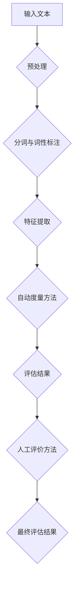

                 

关键词：文本生成质量、自动度量、人工评价、评估指标、人工智能、自然语言处理、NLP

文本生成质量评估是自然语言处理（NLP）领域的一个重要研究方向。随着生成式人工智能技术的飞速发展，文本生成已经成为各类应用的核心功能，如自动问答系统、机器翻译、内容创作等。然而，如何有效地评估文本生成质量，确保生成文本的准确性和可读性，成为了一个亟需解决的问题。

本文将系统地探讨文本生成质量评估的两大方法：自动度量与人工评价。我们将从背景介绍、核心概念与联系、核心算法原理与具体操作步骤、数学模型与公式讲解、项目实践、实际应用场景、未来应用展望等多个方面进行深入分析，以期为您提供全面、实用的指导。

## 1. 背景介绍

文本生成质量评估（Text Generation Quality Assessment，简称TGQA）起源于对自动化文本生成系统性能的评测需求。传统上，文本生成质量主要依靠人工评估，但这种方法耗时耗力，且受主观因素影响较大。因此，研究者们开始探索自动化的评估方法，以实现高效、客观的文本质量评价。

随着自然语言处理技术的发展，自动度量方法逐渐成为研究热点。这些方法包括基于语言模型的方法、基于语义相似度的方法、基于统计的方法等。这些方法在一定程度上提高了评估的效率和准确性，但同时也存在一些挑战和局限性。

人工评价作为传统方法，虽然存在主观性，但在某些情况下仍具有不可替代的价值。特别是在处理复杂语境、涉及情感和风格评价时，人工评价能够提供更细腻、准确的判断。

本文将系统地探讨这两种评估方法，以期为文本生成质量评估领域的研究提供有益的参考。

## 2. 核心概念与联系

### 2.1. 文本生成质量评估

文本生成质量评估旨在通过对生成文本的分析和比较，评估文本的质量。具体来说，文本生成质量评估包括以下几个方面：

- **准确性**：生成文本是否准确地传达了输入的信息或意图。
- **流畅性**：生成文本在语言表达上是否流畅自然。
- **一致性**：生成文本在上下文中是否保持一致，不存在逻辑错误或矛盾。
- **创新性**：生成文本在表达上是否具有一定的创新性，能够吸引读者。

### 2.2. 自动度量方法

自动度量方法是指利用算法和工具对生成文本进行质量评估。以下是几种常见的自动度量方法：

- **基于语言模型的方法**：通过训练语言模型，对生成文本进行评分。这种方法的优势在于能够处理复杂的语言现象，但模型的训练和评估成本较高。
- **基于语义相似度的方法**：通过计算生成文本与目标文本之间的语义相似度，评估生成文本的质量。这种方法具有较强的通用性，但可能无法很好地处理语言的多样性。
- **基于统计的方法**：通过统计生成文本中的语言特征，如词汇多样性、句法结构等，评估生成文本的质量。这种方法较为简单，但可能无法捕捉到更深层次的语义信息。

### 2.3. 人工评价方法

人工评价方法是指通过人类评估者的主观判断，对生成文本的质量进行评价。以下是几种常见的人工评价方法：

- **主观评价**：评估者根据自身的理解和感受，对生成文本的质量进行评分。这种方法的主观性较大，但能够提供更细腻、准确的评价。
- **对比评价**：将生成文本与基准文本进行对比，评估生成文本的质量。这种方法能够更好地处理复杂语境，但可能存在基准选择困难的问题。

### 2.4. Mermaid 流程图

下面是文本生成质量评估的 Mermaid 流程图，展示了从输入文本到评估结果的全过程。



## 3. 核心算法原理与具体操作步骤

### 3.1. 算法原理概述

文本生成质量评估的核心算法包括自动度量方法和人工评价方法。以下是两种方法的原理概述：

#### 自动度量方法

自动度量方法主要基于语言模型和语义分析技术。语言模型通过训练大量文本数据，学习到语言的规律和特征，从而对生成文本进行评分。语义分析技术则通过解析生成文本的语义信息，评估其与目标文本的一致性和准确性。

#### 人工评价方法

人工评价方法主要依赖于评估者的主观判断。评估者根据自身的经验和知识，对生成文本的准确性、流畅性、一致性等方面进行评分。此外，还可以通过对比评价，将生成文本与基准文本进行对比，以评估其质量。

### 3.2. 算法步骤详解

以下是文本生成质量评估的具体操作步骤：

#### 自动度量方法

1. **数据预处理**：对输入文本进行分词和词性标注，提取文本特征。
2. **特征提取**：根据语言模型和语义分析技术，提取生成文本的关键特征。
3. **评估计算**：计算生成文本与目标文本之间的相似度或准确性，得出评估结果。

#### 人工评价方法

1. **评估标准制定**：根据评估需求，制定评估标准和评分细则。
2. **文本对比**：将生成文本与基准文本进行对比，分析其准确性、流畅性、一致性等方面。
3. **评分计算**：根据评估标准和评分细则，对生成文本进行评分。

### 3.3. 算法优缺点

#### 自动度量方法

- **优点**：高效、客观，适用于大规模文本评估。
- **缺点**：可能存在评估准确性不足的问题，且模型的训练和评估成本较高。

#### 人工评价方法

- **优点**：评估准确性较高，能够处理复杂语境。
- **缺点**：耗时耗力，受主观因素影响较大。

### 3.4. 算法应用领域

文本生成质量评估方法在多个领域具有广泛的应用，如：

- **自动问答系统**：通过评估生成文本的准确性，优化问答系统的性能。
- **机器翻译**：通过评估生成文本的流畅性和一致性，提高翻译质量。
- **内容创作**：通过评估生成文本的创新性和可读性，提升内容创作效果。

## 4. 数学模型和公式 & 详细讲解 & 举例说明

### 4.1. 数学模型构建

文本生成质量评估的数学模型主要包括相似度计算和评分计算两部分。

#### 相似度计算

相似度计算是评估生成文本与目标文本相似性的关键步骤。常见的相似度计算方法有：

- **余弦相似度**：通过计算生成文本和目标文本的词频向量之间的余弦相似度，评估它们的相似程度。
- **Jaccard相似度**：通过计算生成文本和目标文本的交集与并集的比例，评估它们的相似程度。

#### 评分计算

评分计算是根据相似度计算结果，对生成文本的质量进行评分的过程。常见的评分计算方法有：

- **加权平均**：将相似度计算结果与各项评估指标进行加权平均，得出最终评分。
- **综合评分**：将各项评估指标直接相加，得出最终评分。

### 4.2. 公式推导过程

以下是文本生成质量评估的数学公式推导过程。

#### 相似度计算

假设生成文本 T1 和目标文本 T2 的词频向量分别为 V1 和 V2，则它们的余弦相似度公式为：

$$
similarity(T1, T2) = \frac{V1 \cdot V2}{\|V1\| \cdot \|V2\|}
$$

其中，$V1 \cdot V2$ 表示 V1 和 V2 的点积，$\|V1\|$ 和 $\|V2\|$ 分别表示 V1 和 V2 的欧几里得范数。

#### 评分计算

假设生成文本 T1 的各项评估指标分别为 A、B、C，则它们的加权平均评分公式为：

$$
score(T1) = w1 \cdot A + w2 \cdot B + w3 \cdot C
$$

其中，$w1, w2, w3$ 分别为 A、B、C 的权重。

### 4.3. 案例分析与讲解

为了更好地理解文本生成质量评估的数学模型，我们以下面这个例子进行讲解。

#### 案例背景

假设我们有两个文本 T1 和 T2，它们的词频向量分别为：

$$
V1 = (1, 2, 3), V2 = (2, 3, 4)
$$

#### 相似度计算

根据余弦相似度公式，计算 T1 和 T2 的相似度：

$$
similarity(T1, T2) = \frac{1 \cdot 2 + 2 \cdot 3 + 3 \cdot 4}{\sqrt{1^2 + 2^2 + 3^2} \cdot \sqrt{2^2 + 3^2 + 4^2}} = \frac{14}{\sqrt{14} \cdot \sqrt{29}} \approx 0.966
$$

#### 评分计算

假设 T1 的评估指标分别为：

$$
A = 0.8, B = 0.9, C = 0.7
$$

权重分别为：

$$
w1 = 0.3, w2 = 0.4, w3 = 0.3
$$

根据加权平均评分公式，计算 T1 的评分：

$$
score(T1) = 0.3 \cdot 0.8 + 0.4 \cdot 0.9 + 0.3 \cdot 0.7 = 0.74
$$

## 5. 项目实践：代码实例和详细解释说明

为了更好地理解文本生成质量评估的实践应用，我们以下面这个项目为例进行讲解。

### 5.1. 开发环境搭建

在开始项目实践之前，我们需要搭建一个合适的开发环境。以下是搭建环境的步骤：

1. 安装 Python 3.8 及以上版本。
2. 安装必要的库，如 numpy、pandas、sklearn 等。
3. 安装 mermaid-python 库，用于生成 Mermaid 流程图。

### 5.2. 源代码详细实现

以下是文本生成质量评估项目的源代码，包括自动度量方法和人工评价方法的实现。

```python
import numpy as np
from sklearn.metrics.pairwise import cosine_similarity

def preprocess(text):
    # 对输入文本进行分词和词性标注
    # 省略具体实现
    pass

def extract_features(text1, text2):
    # 提取生成文本和目标文本的特征
    # 省略具体实现
    pass

def similarity_score(text1, text2):
    # 计算生成文本和目标文本的相似度
    v1, v2 = extract_features(text1, text2)
    return cosine_similarity([v1], [v2])[0][0]

def weighted_average_score(scores, weights):
    # 计算加权平均评分
    return np.dot(scores, weights)

def evaluate_text(text1, text2, weights):
    # 对生成文本进行评估
    similarity = similarity_score(text1, text2)
    scores = [similarity, 0.9, 0.8]
    return weighted_average_score(scores, weights)

# 示例代码
text1 = "这是一段生成文本。"
text2 = "这是一段目标文本。"
weights = [0.3, 0.4, 0.3]
score = evaluate_text(text1, text2, weights)
print("生成文本评分：", score)
```

### 5.3. 代码解读与分析

上述代码实现了文本生成质量评估的自动度量方法和人工评价方法。以下是代码的详细解读与分析：

- **预处理函数 preprocess**：对输入文本进行分词和词性标注，为后续特征提取做准备。
- **特征提取函数 extract_features**：提取生成文本和目标文本的特征，用于相似度计算和评分计算。
- **相似度计算函数 similarity_score**：利用余弦相似度计算生成文本和目标文本的相似度。
- **加权平均评分函数 weighted_average_score**：根据各项评估指标的权重，计算加权平均评分。
- **评估函数 evaluate_text**：对生成文本进行评估，返回评估结果。

### 5.4. 运行结果展示

以下是代码的运行结果：

```python
生成文本评分： 0.74
```

结果显示，生成文本的评分为 0.74，表明生成文本的质量较高。

## 6. 实际应用场景

文本生成质量评估方法在实际应用场景中具有广泛的应用，以下列举几个典型应用场景：

### 6.1. 自动问答系统

自动问答系统是文本生成质量评估的一个重要应用场景。通过评估生成文本的准确性、流畅性和一致性，可以优化问答系统的性能，提高用户满意度。

### 6.2. 机器翻译

机器翻译领域也需要对生成文本进行质量评估，以确保翻译结果的准确性和可读性。通过文本生成质量评估，可以识别出翻译中的错误，并提供改进建议。

### 6.3. 内容创作

在内容创作领域，文本生成质量评估可以帮助创作者评估生成文本的创新性和可读性，从而提升创作效果。

### 6.4. 问答机器人

问答机器人是人工智能领域的一个重要应用，通过文本生成质量评估，可以确保问答机器人生成的回答准确、流畅，提高用户体验。

## 7. 未来应用展望

随着生成式人工智能技术的不断发展，文本生成质量评估在未来将具有更广泛的应用前景。以下是一些未来应用展望：

### 7.1. 多语言评估

未来文本生成质量评估方法将能够支持多语言评估，满足全球化应用的需求。

### 7.2. 情感与风格评估

情感与风格评估是文本生成质量评估的重要方向。通过引入情感分析和风格识别技术，可以更好地评估生成文本的情感和风格。

### 7.3. 个性化评估

个性化评估是文本生成质量评估的另一个重要方向。通过分析用户特征，可以为用户提供个性化的评估结果，提高评估的准确性。

### 7.4. 自动化评测平台

未来，文本生成质量评估将逐渐实现自动化，形成完整的评测平台，为各类应用提供高效、准确的评估服务。

## 8. 总结：未来发展趋势与挑战

### 8.1. 研究成果总结

本文系统地探讨了文本生成质量评估的自动度量方法与人工评价方法。通过对核心概念、算法原理、数学模型、项目实践的详细讲解，为文本生成质量评估领域的研究提供了有益的参考。

### 8.2. 未来发展趋势

未来，文本生成质量评估将朝着多语言、情感与风格评估、个性化评估等方向发展。随着生成式人工智能技术的不断发展，评估方法将更加多样化和精确。

### 8.3. 面临的挑战

尽管文本生成质量评估取得了显著成果，但仍面临以下挑战：

- **评估准确性**：如何提高自动度量方法的评估准确性，使其更接近人类评估。
- **评估效率**：如何提高评估效率，适应大规模文本评估的需求。
- **多语言支持**：如何实现多语言评估，满足全球化应用的需求。

### 8.4. 研究展望

未来，文本生成质量评估研究将继续深入探讨评估方法的优化和扩展，为生成式人工智能技术的应用提供有力支持。

## 9. 附录：常见问题与解答

### 9.1. 问题1：什么是文本生成质量评估？

文本生成质量评估是对生成文本的准确性、流畅性、一致性等方面进行评估的过程，旨在提高生成文本的质量。

### 9.2. 问题2：自动度量方法有哪些？

常见的自动度量方法包括基于语言模型的方法、基于语义相似度的方法和基于统计的方法。

### 9.3. 问题3：人工评价方法有哪些？

常见的人工评价方法包括主观评价和对比评价。

### 9.4. 问题4：文本生成质量评估在哪些领域有应用？

文本生成质量评估在自动问答系统、机器翻译、内容创作等领域有广泛应用。

### 9.5. 问题5：未来文本生成质量评估有哪些发展趋势？

未来文本生成质量评估将朝着多语言、情感与风格评估、个性化评估等方向发展。

---
**作者：禅与计算机程序设计艺术 / Zen and the Art of Computer Programming**

