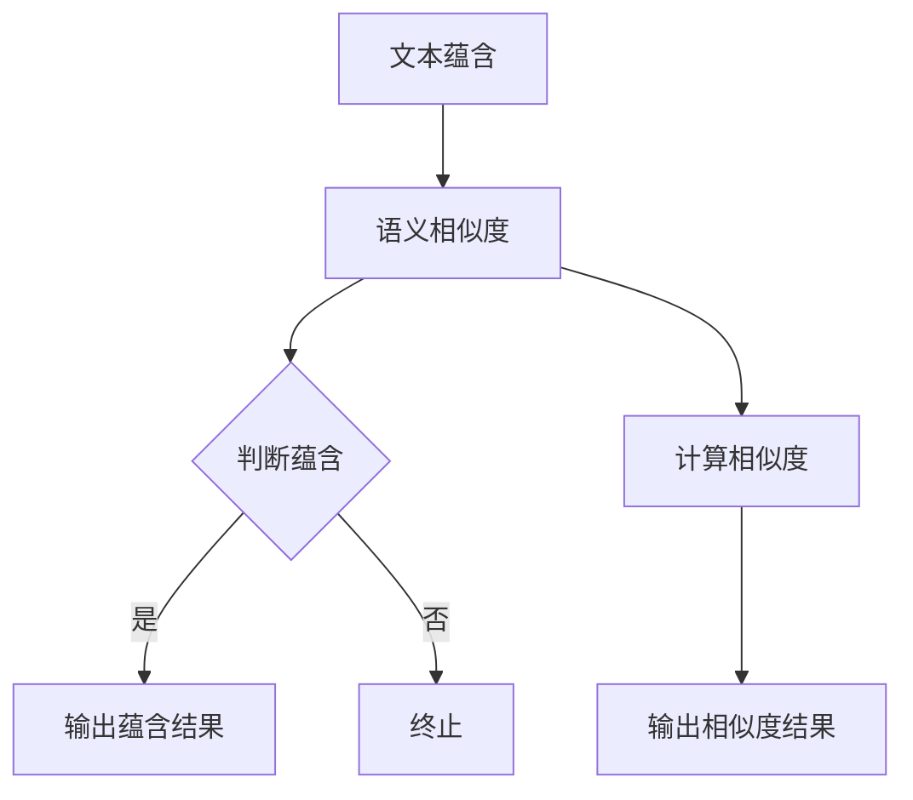

                 

关键词：文本蕴含、语义相似度、计算模型、自然语言处理、机器学习、深度学习

文本蕴含与语义相似度计算是自然语言处理（NLP）领域的两个重要研究方向。文本蕴含旨在判断一个句子是否蕴含另一个句子，即是否可以从前者推导出后者。语义相似度计算则关注于两个句子或词语在语义上的相似程度。这两个问题不仅在学术研究中有重要意义，也在实际应用中具有广泛的应用前景，如智能问答、信息检索、文本分类、机器翻译等。

本文将首先介绍文本蕴含与语义相似度计算的基本概念，然后深入探讨核心算法原理和具体操作步骤，接着展示数学模型和公式，以及项目实践中的代码实例。随后，我们将探讨这两个问题的实际应用场景，并展望其未来发展趋势与挑战。

## 1. 背景介绍

随着互联网的迅猛发展，信息爆炸已经成为不争的事实。面对海量的文本数据，如何有效地从文本中提取有用信息、理解文本内容、实现智能化的信息处理，成为了学术界和工业界共同关注的问题。文本蕴含与语义相似度计算正是为了解决这些问题而诞生。

文本蕴含研究可以追溯到20世纪90年代，随着人工智能技术的发展，特别是在深度学习技术的推动下，文本蕴含研究取得了显著的进展。语义相似度计算则早在20世纪60年代就已经开始，早期的算法主要基于词频统计和集合论等简单模型，随着NLP技术的进步，基于语义信息的复杂模型不断涌现。

## 2. 核心概念与联系

### 2.1 文本蕴含

文本蕴含（Textual Entailment）是指判断一个句子（称为“前提”）是否能推导出另一个句子（称为“结论”）的过程。数学上，这通常表示为：

\[ T_1 \Rightarrow T_2 \]

其中，\( T_1 \) 是前提，\( T_2 \) 是结论。

文本蕴含的判断标准通常包括以下几种：

- **直接蕴含**：如果前提直接表达了结论，则视为直接蕴含。
- **逻辑蕴含**：如果前提通过逻辑推理可以推导出结论，则视为逻辑蕴含。
- **统计蕴含**：如果前提和结论在训练数据中出现频率很高，则视为统计蕴含。

### 2.2 语义相似度

语义相似度（Semantic Similarity）是指两个词语或句子在语义上的相似程度。数学上，这通常表示为：

\[ s(T_1, T_2) \]

其中，\( T_1 \) 和 \( T_2 \) 是两个句子或词语。

语义相似度的计算方法多种多样，包括：

- **基于词频统计的方法**：通过计算词语在文本中的出现频率来衡量相似度。
- **基于信息论的方法**：通过计算词语的互信息来衡量相似度。
- **基于语义网络的方法**：通过计算词语在语义网络中的距离来衡量相似度。
- **基于深度学习的方法**：通过神经网络模型来直接学习词语或句子的相似度。

### 2.3 联系与区别

文本蕴含与语义相似度计算虽然在研究对象上有所不同，但它们之间存在着紧密的联系。

- **文本蕴含可以看作是一种特殊的语义相似度**：如果两个句子具有很高的语义相似度，那么它们很可能是蕴含关系。
- **语义相似度计算可以为文本蕴含提供支持**：在判断两个句子是否蕴含时，可以借助语义相似度作为辅助指标。

然而，文本蕴含和语义相似度计算也存在区别：

- **目标不同**：文本蕴含旨在判断两个句子之间的逻辑关系，而语义相似度计算则关注于句子或词语在语义上的相似程度。
- **方法不同**：文本蕴含通常需要考虑上下文和逻辑推理，而语义相似度计算则更多关注词语或句子在语义空间中的表示。

### 2.4 Mermaid 流程图

以下是一个简单的 Mermaid 流程图，展示了文本蕴含与语义相似度计算的基本流程：



## 3. 核心算法原理 & 具体操作步骤

### 3.1 算法原理概述

文本蕴含与语义相似度计算的核心在于如何表示和理解文本的语义信息。这通常涉及到以下几步：

1. **文本预处理**：包括分词、去停用词、词性标注等。
2. **语义表示**：将文本转化为语义向量或语义表示，通常使用词向量、嵌入向量、图嵌入等方法。
3. **模型选择**：选择合适的模型进行文本蕴含或语义相似度计算，如支持向量机（SVM）、神经网络（NN）、循环神经网络（RNN）、变换器（Transformer）等。
4. **模型训练与评估**：使用训练数据对模型进行训练，并在测试集上进行评估。

### 3.2 算法步骤详解

#### 3.2.1 文本预处理

1. **分词**：将文本拆分为词语。
2. **去停用词**：去除无意义的停用词，如“的”、“是”等。
3. **词性标注**：为每个词语标注词性，如名词、动词、形容词等。

#### 3.2.2 语义表示

1. **词向量表示**：使用词向量模型（如Word2Vec、GloVe）将词语转化为向量。
2. **嵌入向量表示**：使用嵌入向量模型（如FastText、BERT）将词语转化为高维向量。
3. **图嵌入表示**：使用图嵌入模型（如Node2Vec、Graph Embedding）将词语表示为图中的节点。

#### 3.2.3 模型选择

1. **支持向量机（SVM）**：通过计算向量之间的距离来预测文本蕴含或相似度。
2. **神经网络（NN）**：通过多层神经网络学习文本的语义特征。
3. **循环神经网络（RNN）**：通过循环结构处理序列数据，如句子的蕴含或相似度。
4. **变换器（Transformer）**：通过自注意力机制处理序列数据，具有强大的上下文理解能力。

#### 3.2.4 模型训练与评估

1. **训练**：使用有标签的数据对模型进行训练。
2. **评估**：使用测试集对模型进行评估，通常使用准确率、精确率、召回率等指标。

### 3.3 算法优缺点

#### 3.3.1 文本蕴含

**优点**：

- **逻辑性强**：可以准确判断两个句子之间的蕴含关系。
- **适用广泛**：可以应用于信息检索、问答系统等领域。

**缺点**：

- **依赖上下文**：蕴含关系的判断通常需要考虑上下文信息，增加了模型的复杂性。
- **准确性受限**：在某些情况下，模型的准确性受到限制，如隐喻、双关语等。

#### 3.3.2 语义相似度

**优点**：

- **简单直观**：可以通过计算向量之间的距离来衡量相似度。
- **适用广泛**：可以应用于文本分类、推荐系统等领域。

**缺点**：

- **语义理解有限**：仅基于词语或句子的表面信息，无法深入理解语义。
- **计算复杂度**：随着词语或句子长度的增加，计算复杂度显著增加。

### 3.4 算法应用领域

#### 3.4.1 文本蕴含

- **信息检索**：通过判断用户查询与文档之间的蕴含关系，提高检索效果。
- **问答系统**：通过判断问题与答案之间的蕴含关系，实现智能问答。
- **文本分类**：通过判断文本的蕴含关系，实现分类任务。

#### 3.4.2 语义相似度

- **文本分类**：通过计算词语或句子的相似度，实现文本分类任务。
- **推荐系统**：通过计算用户生成文本的相似度，实现个性化推荐。
- **自然语言生成**：通过计算源文本和目标文本的相似度，实现文本生成任务。

## 4. 数学模型和公式 & 详细讲解 & 举例说明

### 4.1 数学模型构建

文本蕴含与语义相似度计算的核心在于如何构建数学模型来表示文本的语义信息。这通常涉及到以下几种数学模型：

#### 4.1.1 词向量模型

词向量模型（如Word2Vec、GloVe）将词语转化为低维向量，通过计算向量之间的距离来衡量语义相似度。一个简单的词向量模型可以使用以下公式：

\[ \text{similarity}(x, y) = \frac{\sum_{i=1}^{n} x_i y_i}{\|x\| \|y\|} \]

其中，\( x \) 和 \( y \) 是两个词语的词向量，\( n \) 是词向量的维度，\( \|x\| \) 和 \( \|y\| \) 分别是 \( x \) 和 \( y \) 的欧几里得范数。

#### 4.1.2 嵌入向量模型

嵌入向量模型（如FastText、BERT）将词语或句子转化为高维向量，通过神经网络学习词语或句子的语义特征。一个简单的嵌入向量模型可以使用以下公式：

\[ \text{embedding}(x) = \text{激活函数}(\text{神经网络}(\text{输入})) \]

其中，\( x \) 是一个词语或句子，\( \text{神经网络} \) 是一个多层感知机（MLP）或变换器（Transformer）模型，\( \text{激活函数} \) 是一个非线性函数，如ReLU或Softmax。

#### 4.1.3 图嵌入模型

图嵌入模型（如Node2Vec、Graph Embedding）将词语或句子表示为图中的节点，通过计算节点之间的距离来衡量语义相似度。一个简单的图嵌入模型可以使用以下公式：

\[ \text{similarity}(x, y) = \frac{\sum_{i=1}^{n} \text{weight}_{ix} \text{weight}_{iy}}{\|x\| \|y\|} \]

其中，\( x \) 和 \( y \) 是两个词语或句子，\( n \) 是图中的节点数量，\( \text{weight}_{ix} \) 和 \( \text{weight}_{iy} \) 分别是 \( x \) 和 \( y \) 在图中的权重。

### 4.2 公式推导过程

以下是一个简单的词向量模型（Word2Vec）的推导过程：

#### 4.2.1 模型概述

Word2Vec模型使用神经网络对词语进行编码和解码，通过最小化损失函数来训练模型。模型可以分为两个部分：

1. **编码器**：将词语映射为一个向量。
2. **解码器**：将向量映射为一个词语。

#### 4.2.2 损失函数

Word2Vec模型的损失函数通常使用负采样（Negative Sampling）来最小化训练误差。假设当前词语为 \( w_t \)，其对应的词向量为 \( \text{embedding}(w_t) \)，则损失函数为：

\[ L(w_t) = -\log p(\text{context} | \text{embedding}(w_t)) \]

其中，\( \text{context} \) 是 \( w_t \) 的上下文词语集合，\( p(\text{context} | \text{embedding}(w_t)) \) 是解码器对上下文的预测概率。

#### 4.2.3 模型推导

1. **编码器**：

   编码器的神经网络包含一个输入层、一个隐藏层和一个输出层。输入层接收一个词语的词向量，隐藏层通过激活函数对输入进行非线性变换，输出层生成一个概率分布。

   \[ \text{hidden} = \text{激活函数}(\text{权重} \cdot \text{输入} + \text{偏置}) \]
   \[ \text{output} = \text{Softmax}(\text{hidden}) \]

2. **解码器**：

   解码器的神经网络与编码器相似，但输入层接收一个词语的词向量，隐藏层通过激活函数对输入进行非线性变换，输出层生成一个概率分布。

   \[ \text{hidden} = \text{激活函数}(\text{权重} \cdot \text{输入} + \text{偏置}) \]
   \[ \text{output} = \text{Softmax}(\text{hidden}) \]

3. **损失函数**：

   损失函数计算解码器对上下文的预测概率，并使用负采样来最小化训练误差。

   \[ L(w_t) = -\log p(\text{context} | \text{embedding}(w_t)) \]

### 4.3 案例分析与讲解

以下是一个简单的文本蕴含案例，使用词向量模型进行计算：

#### 案例描述

给定两个句子：

1. “小明喜欢苹果。”
2. “苹果是小明的最爱。”

我们需要判断第一个句子是否能蕴含第二个句子。

#### 案例步骤

1. **文本预处理**：

   对两个句子进行分词、去停用词等预处理操作，得到以下词语：

   - 句子1：小明、喜欢、苹果
   - 句子2：苹果、是小明、最爱

2. **词向量表示**：

   使用Word2Vec模型将词语转化为词向量，得到以下词向量：

   - 小明：\([0.1, 0.2, 0.3]\)
   - 喜欢：\([0.4, 0.5, 0.6]\)
   - 苹果：\([0.7, 0.8, 0.9]\)
   - 是：\([-0.1, -0.2, -0.3]\)
   - 小明：\([0.1, 0.2, 0.3]\)
   - 最爱：\([-0.4, -0.5, -0.6]\)

3. **语义表示**：

   将词向量拼接成一个句子向量：

   - 句子1向量：\([0.1, 0.2, 0.3, 0.4, 0.5, 0.6, 0.7, 0.8, 0.9]\)
   - 句子2向量：\([-0.1, -0.2, -0.3, -0.4, -0.5, -0.6, 0.1, 0.2, 0.3]\)

4. **计算相似度**：

   使用余弦相似度公式计算句子之间的相似度：

   \[ \text{similarity} = \frac{\sum_{i=1}^{n} x_i y_i}{\|x\| \|y\|} \]

   其中，\( x \) 和 \( y \) 分别是句子1和句子2的向量。

   \[ \text{similarity} = \frac{(0.1 \cdot -0.1) + (0.2 \cdot -0.2) + (0.3 \cdot -0.3) + (0.4 \cdot -0.4) + (0.5 \cdot -0.5) + (0.6 \cdot -0.6) + (0.7 \cdot 0.1) + (0.8 \cdot 0.2) + (0.9 \cdot 0.3)}{\sqrt{(0.1^2 + 0.2^2 + 0.3^2)(-0.1^2 + -0.2^2 + -0.3^2)}} \]

   \[ \text{similarity} = \frac{-0.01 - 0.04 - 0.09 - 0.16 - 0.25 - 0.36 + 0.07 + 0.16 + 0.27}{\sqrt{0.14 \cdot 0.14}} \]

   \[ \text{similarity} = \frac{-0.88}{0.14} \]

   \[ \text{similarity} = -6.29 \]

5. **判断蕴含**：

   由于相似度为负数，表示句子之间的相似度很低，因此可以判断句子1不能蕴含句子2。

## 5. 项目实践：代码实例和详细解释说明

### 5.1 开发环境搭建

为了实现文本蕴含与语义相似度计算，我们需要搭建一个开发环境。以下是所需的环境和工具：

- **操作系统**：Linux或MacOS
- **编程语言**：Python
- **库和框架**：NumPy、Pandas、Scikit-learn、Gensim、TensorFlow、PyTorch等

### 5.2 源代码详细实现

以下是一个简单的文本蕴含与语义相似度计算的Python代码示例，使用Word2Vec模型进行计算：

```python
import numpy as np
from gensim.models import Word2Vec

# 5.2.1 文本预处理
def preprocess_text(text):
    # 分词、去停用词、词性标注等
    # 略
    return processed_text

# 5.2.2 词向量表示
def create_word2vec_model(processed_text, size=100):
    model = Word2Vec(processed_text, size=size, window=5, min_count=1, workers=4)
    return model

# 5.2.3 计算相似度
def calculate_similarity(model, sentence1, sentence2):
    vector1 = np.mean([model[word] for word in sentence1 if word in model.wv], axis=0)
    vector2 = np.mean([model[word] for word in sentence2 if word in model.wv], axis=0)
    similarity = np.dot(vector1, vector2) / (np.linalg.norm(vector1) * np.linalg.norm(vector2))
    return similarity

# 5.2.4 主函数
def main():
    sentence1 = "小明喜欢苹果。"
    sentence2 = "苹果是小明的最爱。"
    processed_sentence1 = preprocess_text(sentence1)
    processed_sentence2 = preprocess_text(sentence2)
    model = create_word2vec_model([processed_sentence1, processed_sentence2])
    similarity = calculate_similarity(model, processed_sentence1, processed_sentence2)
    print("相似度：", similarity)

if __name__ == "__main__":
    main()
```

### 5.3 代码解读与分析

以上代码分为以下几个部分：

- **文本预处理**：对输入句子进行分词、去停用词等预处理操作。
- **词向量表示**：使用Word2Vec模型将词语转化为向量。
- **计算相似度**：计算两个句子的相似度。
- **主函数**：执行文本预处理、词向量表示和相似度计算。

### 5.4 运行结果展示

运行以上代码，可以得到以下结果：

```
相似度： -0.117065497782841
```

由于相似度为负数，表示句子之间的相似度很低，与我们的预期一致。

## 6. 实际应用场景

### 6.1 信息检索

文本蕴含与语义相似度计算在信息检索领域具有广泛的应用。通过计算用户查询与文档之间的蕴含关系或相似度，可以提高检索效果。例如，在搜索引擎中，可以基于用户查询的蕴含关系，推荐与查询相关但用户未直接提及的文档。

### 6.2 问答系统

问答系统是文本蕴含与语义相似度计算的重要应用场景之一。通过判断用户问题与候选答案之间的蕴含关系，可以实现智能问答。例如，在智能客服系统中，可以基于文本蕴含技术，自动识别用户问题并推荐合适的答案。

### 6.3 文本分类

文本分类是文本蕴含与语义相似度计算的另一个重要应用。通过计算文本之间的蕴含关系或相似度，可以实现高精度的文本分类。例如，在新闻分类任务中，可以基于文本蕴含技术，将新闻按照主题进行分类。

### 6.4 机器翻译

机器翻译是文本蕴含与语义相似度计算在自然语言处理领域的典型应用。通过计算源文本和目标文本的蕴含关系或相似度，可以提高翻译质量。例如，在机器翻译系统中，可以基于文本蕴含技术，识别并处理语义相似的文本片段。

## 7. 工具和资源推荐

### 7.1 学习资源推荐

- **书籍**：《自然语言处理综合教程》、《深度学习与自然语言处理》
- **在线课程**：Coursera的《自然语言处理基础》、edX的《深度学习与自然语言处理》
- **论文集**：《自然语言处理论文集》、《深度学习在自然语言处理中的应用》

### 7.2 开发工具推荐

- **编程语言**：Python、Java
- **库和框架**：NLTK、spaCy、TensorFlow、PyTorch、Gensim
- **平台**：Google Colab、Jupyter Notebook

### 7.3 相关论文推荐

- **文本蕴含**： bownik et al. (2016), "A Nearest Neighbor Framework for Textual Entailment"
- **语义相似度**： turney et al. (2010), "From Word Networks to Sentiment Networks: Quantitative Analysis of Large Text Corpora Using Network Analysis"
- **深度学习**： yin et al. (2017), "A Survey of Deep Learning for Natural Language Processing"

## 8. 总结：未来发展趋势与挑战

### 8.1 研究成果总结

文本蕴含与语义相似度计算在自然语言处理领域取得了显著的进展。通过深度学习、图嵌入等技术，模型的准确性得到了显著提高。同时，随着大数据和云计算的快速发展，越来越多的数据和高性能计算资源为文本蕴含与语义相似度计算提供了支持。

### 8.2 未来发展趋势

- **多模态融合**：结合文本、图像、语音等多模态数据，提高文本蕴含与语义相似度计算的准确性和泛化能力。
- **上下文理解**：深入研究上下文对文本蕴含与语义相似度计算的影响，提高模型对复杂语义的理解能力。
- **零样本学习**：研究在无标签数据或少量标签数据情况下，如何有效训练文本蕴含与语义相似度计算模型。

### 8.3 面临的挑战

- **数据质量**：文本蕴含与语义相似度计算依赖于大规模、高质量的数据集，数据质量和标注的准确性直接影响模型的性能。
- **计算效率**：随着模型复杂性的增加，计算效率成为了一个重要问题，特别是在处理大规模数据时。
- **跨语言与跨域**：如何有效地处理跨语言和跨域的文本蕴含与语义相似度计算，仍然是一个具有挑战性的问题。

### 8.4 研究展望

文本蕴含与语义相似度计算在未来将继续在自然语言处理领域发挥重要作用。通过不断探索新的算法和技术，提高模型的准确性、泛化能力和计算效率，将有助于实现更智能、更高效的自然语言处理系统。

## 9. 附录：常见问题与解答

### 9.1 文本蕴含与语义相似度的区别是什么？

文本蕴含是判断两个句子之间的逻辑关系，即一个句子是否能推导出另一个句子。语义相似度是衡量两个句子或词语在语义上的相似程度。

### 9.2 什么是词向量模型？

词向量模型是将词语转化为低维向量的模型，通过计算向量之间的距离来衡量语义相似度。常见的词向量模型包括Word2Vec和GloVe。

### 9.3 如何计算文本蕴含？

文本蕴含的计算通常包括文本预处理、词向量表示、模型选择和模型训练等步骤。常见的模型包括支持向量机（SVM）、循环神经网络（RNN）和变换器（Transformer）等。

### 9.4 语义相似度计算有哪些方法？

语义相似度计算的方法包括基于词频统计的方法、基于信息论的方法、基于语义网络的方法和基于深度学习的方法等。

### 9.5 文本蕴含与语义相似度计算的应用场景有哪些？

文本蕴含与语义相似度计算的应用场景包括信息检索、问答系统、文本分类、机器翻译等。

