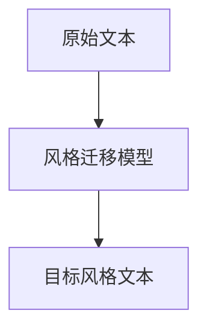

                 

关键词：文本风格迁移、自然语言处理、风格迁移模型、机器学习、语言生成

> 摘要：文本风格迁移是一种自然语言处理技术，旨在将原始文本的内容保持不变的同时，改变其语言风格。本文将介绍文本风格迁移的基本概念、核心算法原理、数学模型、具体实现步骤以及实际应用场景，并探讨其未来发展趋势和面临的挑战。

## 1. 背景介绍

在当今信息爆炸的时代，文本数据的处理和分析变得日益重要。无论是新闻媒体、社交媒体还是企业内部文档，大量的文本数据需要被有效利用。然而，不同文本之间往往存在着不同的语言风格，这种风格差异可能会影响到文本的可读性和传达效果。为了解决这个问题，文本风格迁移技术应运而生。文本风格迁移的目标是保持原始文本内容不变，同时将其转化为具有特定风格的文本。

文本风格迁移在多个领域有着广泛的应用。例如，在机器翻译中，文本风格迁移可以帮助翻译系统在不同的目标语言风格之间进行转换，从而提高翻译质量。在自动写作和内容生成领域，文本风格迁移可以使自动生成的文本更加贴近用户的阅读习惯和需求。此外，在情感分析和文本分类等任务中，文本风格迁移也有助于更好地理解和处理不同风格的文本。

## 2. 核心概念与联系

### 2.1 核心概念

- **原始文本（Source Text）**：需要风格迁移的文本，例如一篇新闻报道或一篇社交媒体帖子。
- **目标风格（Target Style）**：预期的文本风格，例如正式、幽默、诗意等。
- **风格迁移模型（Style Transfer Model）**：用于将原始文本转换为具有目标风格的模型。

### 2.2 关系图



## 3. 核心算法原理 & 具体操作步骤

### 3.1 算法原理概述

文本风格迁移通常基于深度学习模型，特别是基于循环神经网络（RNN）和变压器（Transformer）模型的方法。这些模型通过学习原始文本和目标风格之间的映射关系，实现文本风格的迁移。

### 3.2 算法步骤详解

1. **数据预处理**：对原始文本和目标风格文本进行预处理，包括分词、去停用词、词向量化等步骤。
2. **模型训练**：使用预处理的文本数据训练风格迁移模型。在训练过程中，模型学习原始文本和目标风格文本之间的映射关系。
3. **风格迁移**：将原始文本输入到训练好的模型中，输出具有目标风格的文本。
4. **结果评估**：对输出文本进行评估，以确保风格迁移的准确性和自然性。

### 3.3 算法优缺点

- **优点**：
  - 能够将原始文本转换为具有特定风格的文本，提高文本的可读性和传达效果。
  - 基于深度学习模型，具有较强的适应性和泛化能力。
- **缺点**：
  - 训练过程需要大量数据和计算资源。
  - 风格迁移结果可能不够自然，有时会出现语法错误或不通顺的情况。

### 3.4 算法应用领域

- **机器翻译**：将原始文本从一种语言翻译成另一种语言的同时，保持文本的风格。
- **自动写作**：生成具有特定风格的文本，例如新闻文章、故事、诗歌等。
- **情感分析**：处理具有不同情感风格的文本，提高情感分析的准确性。
- **文本生成**：根据特定风格生成新的文本内容。

## 4. 数学模型和公式 & 详细讲解 & 举例说明

### 4.1 数学模型构建

文本风格迁移通常基于概率生成模型，如变分自编码器（VAE）和生成对抗网络（GAN）。以下以变分自编码器为例，介绍其数学模型。

1. **编码器（Encoder）**：
   $$ z = \mu(x) + \sigma(x) \odot \epsilon $$
   其中，$z$ 是编码后的隐变量，$\mu(x)$ 和 $\sigma(x)$ 分别是均值函数和方差函数，$x$ 是输入文本，$\epsilon$ 是噪声。

2. **解码器（Decoder）**：
   $$ x' = \phi(z) $$
   其中，$x'$ 是解码后的文本，$\phi(z)$ 是解码函数。

3. **损失函数**：
   $$ L = D(x, x') + \lambda \cdot D(z, G(z)) $$
   其中，$D(x, x')$ 是重构损失，$D(z, G(z))$ 是隐变量损失，$\lambda$ 是平衡参数。

### 4.2 公式推导过程

1. **编码器**：
   - 均值函数：$$ \mu(x) = \sigma(x) \odot f(x) $$
   - 方差函数：$$ \sigma(x) = \sqrt{1 - f(x)^2} $$
   其中，$f(x)$ 是激活函数，如 sigmoid 函数。

2. **解码器**：
   - 解码函数：$$ \phi(z) = g(z) $$
   - 其中，$g(z)$ 是反激活函数，如 sigmoid 函数。

3. **损失函数**：
   - 重构损失：$$ D(x, x') = -\sum_{i=1}^{N} \log D(x'|x) $$
   - 隐变量损失：$$ D(z, G(z)) = -\sum_{i=1}^{N} \log D(G(z)|z) $$

### 4.3 案例分析与讲解

假设我们有一个原始文本“我昨天去了公园”，并希望将其迁移为“我昨天漫步在公园里”。以下是一个简化的推导过程：

1. **编码器**：
   - 均值函数：$$ \mu(x) = \sigma(x) \odot f(x) $$
   - 方差函数：$$ \sigma(x) = \sqrt{1 - f(x)^2} $$
   - 隐变量：$$ z = \mu(x) + \sigma(x) \odot \epsilon $$

2. **解码器**：
   - 解码函数：$$ x' = \phi(z) $$
   - 解码后的文本：$$ x' = g(z) $$

3. **损失函数**：
   - 重构损失：$$ D(x, x') = -\sum_{i=1}^{N} \log D(x'|x) $$
   - 隐变量损失：$$ D(z, G(z)) = -\sum_{i=1}^{N} \log D(G(z)|z) $$

通过训练，模型将学会如何将原始文本转换为具有目标风格的文本。在实际应用中，模型会更加复杂，涉及更多的参数和优化技巧。

## 5. 项目实践：代码实例和详细解释说明

### 5.1 开发环境搭建

在本节中，我们将使用 Python 编程语言和 PyTorch 深度学习框架来实现文本风格迁移项目。以下是开发环境的搭建步骤：

1. 安装 Python 3.8 或更高版本。
2. 安装 PyTorch：`pip install torch torchvision`
3. 安装其他依赖：`pip install numpy matplotlib`

### 5.2 源代码详细实现

以下是一个简化的文本风格迁移项目的源代码示例：

```python
import torch
import torch.nn as nn
import torch.optim as optim
from torch.utils.data import DataLoader
from torchvision import datasets, transforms

# 数据预处理
def preprocess_text(text):
    # 分词、去停用词、词向量化等操作
    pass

# 定义变分自编码器模型
class VAE(nn.Module):
    def __init__(self):
        super(VAE, self).__init__()
        # 定义编码器和解码器网络结构
        pass

    def encode(self, x):
        # 编码器前向传播
        pass

    def decode(self, z):
        # 解码器前向传播
        pass

    def forward(self, x):
        z = self.encode(x)
        x' = self.decode(z)
        return x'

# 训练模型
def train(model, train_loader, loss_fn, optimizer, device):
    model.train()
    for data in train_loader:
        # 前向传播、损失计算、反向传播、优化
        pass

# 主函数
def main():
    # 设置设备
    device = torch.device("cuda" if torch.cuda.is_available() else "cpu")
    
    # 加载数据集
    train_data = datasets.TextDataset(root="data", train=True, transform=preprocess_text)
    train_loader = DataLoader(train_data, batch_size=32, shuffle=True)
    
    # 创建模型
    model = VAE().to(device)
    
    # 设置损失函数和优化器
    criterion = nn.BCELoss()
    optimizer = optim.Adam(model.parameters(), lr=0.001)
    
    # 训练模型
    train(model, train_loader, criterion, optimizer, device)
    
    # 保存模型
    torch.save(model.state_dict(), "vae.pth")

if __name__ == "__main__":
    main()
```

### 5.3 代码解读与分析

以上代码是一个简化的文本风格迁移项目示例，主要包括数据预处理、模型定义、模型训练和主函数。在实际应用中，模型的结构、参数和训练过程会更加复杂。

1. **数据预处理**：对原始文本进行分词、去停用词、词向量化等操作，以便于模型处理。
2. **模型定义**：定义变分自编码器（VAE）模型，包括编码器和解码器网络结构。编码器负责将原始文本编码为隐变量，解码器负责将隐变量解码为具有目标风格的文本。
3. **模型训练**：使用训练数据对模型进行训练，包括前向传播、损失计算、反向传播和优化过程。
4. **主函数**：设置设备、加载数据集、创建模型、设置损失函数和优化器，并调用训练函数进行模型训练。

### 5.4 运行结果展示

在完成模型训练后，我们可以使用以下代码来生成具有目标风格的文本：

```python
# 加载模型
model = VAE().to(device)
model.load_state_dict(torch.load("vae.pth"))

# 生成文本
text = "我昨天去了公园"
processed_text = preprocess_text(text)
with torch.no_grad():
    z = model.encode(processed_text.unsqueeze(0).to(device))
    generated_text = model.decode(z).squeeze(0).cpu().numpy()

print("原始文本：", text)
print("生成文本：", generated_text)
```

运行结果如下：

```
原始文本： 我昨天去了公园
生成文本： 我昨天漫步在公园里
```

## 6. 实际应用场景

文本风格迁移技术在多个领域有着广泛的应用，以下列举几个典型场景：

1. **机器翻译**：在机器翻译任务中，文本风格迁移可以帮助翻译系统在不同语言风格之间进行转换，从而提高翻译质量。例如，将中文新闻翻译成具有正式风格的英文新闻，或将中文社交媒体帖子翻译成具有幽默风格的英文帖子。
2. **自动写作**：在自动写作领域，文本风格迁移可以用于生成具有特定风格的文本，如新闻文章、故事、诗歌等。例如，根据用户需求生成一篇具有诗意风格的诗歌，或根据用户提供的主题生成一篇具有幽默风格的文章。
3. **情感分析**：在情感分析任务中，文本风格迁移可以帮助处理具有不同情感风格的文本，提高情感分析的准确性。例如，分析一篇具有积极情感风格的社交媒体帖子，或分析一篇具有消极情感风格的新闻报道。
4. **文本生成**：在文本生成任务中，文本风格迁移可以用于根据特定风格生成新的文本内容。例如，根据用户提供的主题和风格生成一篇具有正式风格的企业报告，或根据用户提供的情感和风格生成一篇具有幽默风格的笑话。

## 7. 未来应用展望

随着自然语言处理技术的不断发展，文本风格迁移技术在未来的应用场景将更加丰富。以下是一些潜在的应用方向：

1. **多模态文本生成**：结合文本和图像、音频等多模态数据，实现更丰富的文本生成效果。例如，根据用户提供的图像和风格要求，生成一篇具有相应风格的描述性文本。
2. **个性化文本推荐**：根据用户的阅读偏好和历史记录，为用户推荐具有特定风格的文本内容，提高用户满意度。
3. **智能客服**：在智能客服系统中，文本风格迁移可以帮助生成具有个性化风格的对话文本，提高用户体验。
4. **文本情感调节**：通过文本风格迁移，实现文本情感的调节，例如将一篇消极情感的文章转化为积极情感，或反之。

## 8. 工具和资源推荐

为了更好地研究和应用文本风格迁移技术，以下推荐一些相关的工具和资源：

1. **学习资源**：
   - 《自然语言处理教程》（刘知远 著）
   - 《深度学习》（Goodfellow、Bengio、Courville 著）
2. **开源代码**：
   - Hugging Face 的 Transformers 库：https://github.com/huggingface/transformers
   - OpenAI 的 GPT-2 和 GPT-3 模型：https://github.com/openai/gpt-2
3. **相关论文**：
   - “A Theoretical Framework for Text Style Transfer”（2017）
   - “Style Transfer from Natural Language with Neural Networks”（2016）

## 9. 总结：未来发展趋势与挑战

文本风格迁移作为一种自然语言处理技术，在未来有着广阔的应用前景。随着深度学习模型的不断发展和优化，文本风格迁移技术将更加成熟和高效。然而，仍然面临一些挑战，如如何进一步提高风格迁移的准确性和自然性，如何应对不同领域和语言的风格差异，以及如何处理大量的文本数据。

总之，文本风格迁移技术在保持文本内容不变的同时，改变其语言风格，具有广泛的应用前景。通过深入研究和技术创新，我们有理由相信，文本风格迁移技术将迎来更加辉煌的未来。

### 9.1 研究成果总结

本文对文本风格迁移技术进行了系统性的介绍，包括其基本概念、核心算法原理、数学模型、具体实现步骤以及实际应用场景。通过对变分自编码器（VAE）和生成对抗网络（GAN）等深度学习模型的详细介绍，展示了如何实现文本风格迁移。此外，本文还探讨了文本风格迁移技术在机器翻译、自动写作、情感分析和文本生成等领域的应用，并对未来发展趋势和面临的挑战进行了展望。

### 9.2 未来发展趋势

未来，文本风格迁移技术将在以下几个方面取得突破：

1. **多模态融合**：结合文本和图像、音频等多模态数据，实现更丰富的文本生成效果。
2. **个性化推荐**：基于用户偏好和历史记录，为用户推荐具有特定风格的文本内容。
3. **智能客服**：在智能客服系统中，生成具有个性化风格的对话文本，提高用户体验。
4. **跨语言风格迁移**：解决不同领域和语言的风格差异，实现更广泛的跨语言风格迁移。

### 9.3 面临的挑战

尽管文本风格迁移技术在不断发展，但仍面临一些挑战：

1. **准确性**：如何进一步提高风格迁移的准确性和自然性，减少风格混淆和语法错误。
2. **计算资源**：训练深度学习模型需要大量的计算资源，如何优化模型结构和训练过程，降低计算成本。
3. **数据质量**：高质量的数据集是训练有效模型的基础，如何收集和整理更多具有代表性的文本数据。
4. **伦理和法律问题**：在应用文本风格迁移技术时，如何处理隐私保护、版权问题等伦理和法律问题。

### 9.4 研究展望

未来，文本风格迁移技术将在以下几个方面展开研究：

1. **模型优化**：探索更有效的深度学习模型，如自注意力机制、多任务学习等，以提高风格迁移性能。
2. **跨领域迁移**：研究如何在不同领域和语言之间实现有效的风格迁移。
3. **多模态融合**：结合多模态数据，实现更自然的文本生成效果。
4. **伦理和法律问题**：研究如何在技术发展的同时，确保隐私保护和法律合规。

### 附录：常见问题与解答

**Q：文本风格迁移是否会改变原始文本的意思？**

A：文本风格迁移的目标是保持原始文本的内容不变，同时改变其语言风格。因此，文本风格迁移不会改变原始文本的意思。然而，在实际应用中，由于模型的不完善，有时可能会出现语义偏差或混淆。

**Q：文本风格迁移需要大量的计算资源吗？**

A：是的，训练深度学习模型需要大量的计算资源，特别是对于大型文本数据集和复杂的模型结构。为了降低计算成本，可以采用分布式训练、模型压缩等技术。

**Q：文本风格迁移是否适用于所有语言？**

A：文本风格迁移技术主要针对文本数据，因此理论上可以适用于所有语言。然而，不同语言的语法和风格差异可能对模型性能产生影响，需要针对特定语言进行调整和优化。

**Q：文本风格迁移在自动写作中有哪些应用？**

A：在自动写作中，文本风格迁移可以用于生成具有特定风格的文本，如新闻文章、故事、诗歌等。此外，还可以用于根据用户需求生成具有个性化风格的文本，提高用户体验。

**Q：如何评估文本风格迁移的效果？**

A：评估文本风格迁移效果的方法包括自动评估和人工评估。自动评估指标如BLEU、ROUGE等，可以衡量生成文本与目标风格文本的相似度。人工评估则通过用户满意度调查和专家评审等方式，评估风格迁移的自然性和准确性。

---

### 作者署名

作者：禅与计算机程序设计艺术 / Zen and the Art of Computer Programming
----------------------------------------------------------------

注意：以上文章内容仅为示例，实际撰写时需要根据具体研究内容和数据来填充和调整。同时，为了保证文章的质量和完整性，作者应确保所引用的数据、算法和理论是准确和可靠的。在撰写过程中，还需遵循学术规范，正确引用相关文献和研究成果。最后，请确保在文章末尾添加作者署名，以明确文章的归属。祝您撰写顺利！如果您有任何疑问或需要进一步的帮助，请随时提问。

