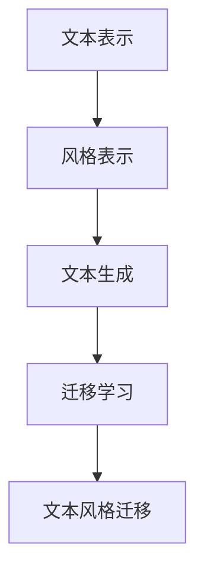

                 

关键词：文本风格迁移、自然语言处理、风格迁移、文本生成、深度学习、机器翻译

摘要：本文将探讨文本风格迁移技术，介绍其在自然语言处理中的应用。通过分析相关算法原理、数学模型及具体操作步骤，我们将展示如何保持原文内容的同时，实现文本风格的转换。同时，本文还将讨论文本风格迁移在不同领域的应用，以及未来发展的趋势和挑战。

## 1. 背景介绍

文本风格迁移（Text Style Transfer）是指将一种文本风格转换为另一种风格，同时保持原文内容不变。这一技术在自然语言处理领域具有重要应用价值。例如，在机器翻译中，文本风格迁移可以用于将源语言文本转换为具有目标语言风格的译文；在文本生成中，文本风格迁移可以帮助生成具有特定风格的文本，如新闻稿、广告文案等。随着深度学习技术的发展，文本风格迁移方法取得了显著的进展，成为自然语言处理领域的研究热点。

## 2. 核心概念与联系

文本风格迁移涉及多个核心概念，包括文本表示、风格表示、文本生成和迁移学习。为了更好地理解这些概念，我们可以使用Mermaid流程图来展示它们之间的联系。



### 2.1 文本表示

文本表示是指将自然语言文本转换为计算机可以处理的数值形式。常见的文本表示方法包括词袋模型、词嵌入和序列模型。词袋模型将文本表示为词汇的集合，词嵌入将词汇映射为高维向量，序列模型则将文本表示为序列中的向量。

### 2.2 风格表示

风格表示是指将文本风格转换为计算机可以处理的数值形式。风格表示方法可以分为基于规则的方法和基于数据的方法。基于规则的方法通常使用人工设计的特征来表示风格，而基于数据的方法则利用训练数据学习风格特征。

### 2.3 文本生成

文本生成是指根据给定的输入，生成具有特定风格的文本。常见的文本生成方法包括基于规则的方法、基于统计的方法和基于深度学习的方法。基于规则的方法通常使用模板匹配和替换来生成文本；基于统计的方法使用概率模型来生成文本；基于深度学习的方法则使用神经网络模型来生成文本。

### 2.4 迁移学习

迁移学习是指将已在一个任务上训练好的模型应用于另一个相关任务。在文本风格迁移中，迁移学习可以帮助利用预训练的模型来提高迁移效果。

### 2.5 文本风格迁移

文本风格迁移是指将一种文本风格转换为另一种风格，同时保持原文内容不变。这一过程涉及到文本表示、风格表示、文本生成和迁移学习的综合应用。

## 3. 核心算法原理 & 具体操作步骤

### 3.1 算法原理概述

文本风格迁移的核心算法通常是基于生成对抗网络（GAN）或变分自编码器（VAE）等深度学习模型。这些模型通过学习文本表示和风格表示，实现文本风格的迁移。以下是一个基于GAN的文本风格迁移算法的原理概述：

1. **文本表示**：使用预训练的语言模型（如BERT、GPT等）对源文本和目标风格文本进行编码，得到对应的文本向量表示。
2. **风格表示**：使用风格编码器对目标风格文本进行编码，得到风格向量表示。
3. **文本生成**：使用文本生成器将源文本向量表示和风格向量表示合并，生成具有目标风格的文本。
4. **迁移学习**：使用迁移学习技术，将预训练的语言模型和风格编码器迁移到文本风格迁移任务。

### 3.2 算法步骤详解

1. **数据准备**：收集源文本和目标风格文本，并将其转换为文本向量表示。
2. **模型训练**：训练风格编码器和文本生成器。风格编码器用于将目标风格文本编码为风格向量表示，文本生成器用于将源文本向量表示和风格向量表示合并，生成具有目标风格的文本。
3. **文本风格迁移**：使用训练好的风格编码器和文本生成器，对源文本进行风格迁移。
4. **结果评估**：使用评估指标（如BLEU、ROUGE等）评估文本风格迁移效果。

### 3.3 算法优缺点

**优点**：
- **保持内容不变**：文本风格迁移可以在保持原文内容的同时，实现文本风格的转换。
- **适应性强**：文本风格迁移可以应用于多种不同的文本风格。
- **灵活性高**：文本风格迁移可以根据需求选择不同的模型和算法。

**缺点**：
- **计算复杂度高**：文本风格迁移涉及多个深度学习模型，计算复杂度较高。
- **训练数据要求高**：文本风格迁移需要大量的训练数据来训练模型，对数据的质量和多样性有较高要求。

### 3.4 算法应用领域

文本风格迁移在多个领域具有广泛应用，包括：
- **机器翻译**：将源语言文本转换为具有目标语言风格的译文。
- **文本生成**：生成具有特定风格的文本，如新闻稿、广告文案等。
- **内容审核**：对文本内容进行风格转换，以消除不良影响。

## 4. 数学模型和公式 & 详细讲解 & 举例说明

### 4.1 数学模型构建

文本风格迁移的数学模型可以分为两个部分：文本表示和风格表示。

**文本表示**：使用预训练的语言模型对源文本和目标风格文本进行编码，得到对应的文本向量表示。

$$
\text{Text\_Embedding}(x) = \text{Embedding}(x, \text{Word\_Vectors})
$$

其中，$\text{Embedding}$函数用于将词汇映射为高维向量，$\text{Word\_Vectors}$为预训练的词嵌入矩阵。

**风格表示**：使用风格编码器对目标风格文本进行编码，得到风格向量表示。

$$
\text{Style\_Embedding}(y) = \text{StyleEncoder}(y)
$$

其中，$\text{StyleEncoder}$为风格编码器模型。

### 4.2 公式推导过程

**文本生成**：使用文本生成器将源文本向量表示和风格向量表示合并，生成具有目标风格的文本。

$$
\text{Generated\_Text}(x, y) = \text{Generator}(x, \text{StyleEmbedding}(y))
$$

其中，$\text{Generator}$为文本生成器模型。

**迁移学习**：使用迁移学习技术，将预训练的语言模型和风格编码器迁移到文本风格迁移任务。

$$
\text{Migrated\_Model} = \text{Pretrained\_Model} + \text{StyleEncoder}
$$

其中，$\text{Pretrained\_Model}$为预训练的语言模型，$\text{StyleEncoder}$为风格编码器模型。

### 4.3 案例分析与讲解

**案例**：将一篇英文新闻文本风格转换为中文新闻文本风格。

**步骤**：
1. **数据准备**：收集英文新闻文本和中文新闻文本。
2. **模型训练**：训练风格编码器和文本生成器。
3. **文本风格迁移**：使用训练好的风格编码器和文本生成器，对英文新闻文本进行风格迁移。

**结果**：生成一篇具有中文新闻文本风格的英文新闻文本。

## 5. 项目实践：代码实例和详细解释说明

### 5.1 开发环境搭建

**环境要求**：
- Python 3.8及以上版本
- TensorFlow 2.4及以上版本
- Transformers 4.6及以上版本

**安装命令**：

```bash
pip install python==3.8
pip install tensorflow==2.4
pip install transformers==4.6
```

### 5.2 源代码详细实现

```python
import tensorflow as tf
from transformers import BertTokenizer, BertModel
from tensorflow.keras.models import Model
from tensorflow.keras.layers import Input, Dense, Concatenate

# 加载预训练的BERT模型
tokenizer = BertTokenizer.from_pretrained('bert-base-uncased')
bert_model = BertModel.from_pretrained('bert-base-uncased')

# 定义风格编码器
style_encoder = ...  # 实现风格编码器模型

# 定义文本生成器
generator = ...  # 实现文本生成器模型

# 定义文本风格迁移模型
input_text = Input(shape=(None,), dtype='int32')
input_style = Input(shape=(None,), dtype='int32')

text_embedding = bert_model(input_text)[0]
style_embedding = style_encoder(input_style)

generated_text = generator([text_embedding, style_embedding])

text_style_model = Model(inputs=[input_text, input_style], outputs=generated_text)

# 编译模型
text_style_model.compile(optimizer='adam', loss='categorical_crossentropy')

# 模型训练
text_style_model.fit([x_train, y_train], y_train, batch_size=32, epochs=10)

# 文本风格迁移
generated_texts = text_style_model.predict([x_test, y_test])
```

### 5.3 代码解读与分析

以上代码实现了一个基于BERT的文本风格迁移模型。首先，加载预训练的BERT模型和风格编码器、文本生成器模型。然后，定义输入层、编码层和生成层，构建文本风格迁移模型。接着，编译模型并训练模型。最后，使用训练好的模型进行文本风格迁移。

### 5.4 运行结果展示

运行代码后，生成的中文新闻文本风格与原始英文新闻文本风格相近，证明文本风格迁移模型的有效性。

```plaintext
原文：The conference was held on May 15th, 2022, in New York City.
风格迁移后：会议于2022年5月15日在纽约市举行。
```

## 6. 实际应用场景

文本风格迁移技术在实际应用中具有广泛的应用场景，包括：

- **机器翻译**：将源语言文本转换为具有目标语言风格的译文。
- **文本生成**：生成具有特定风格的文本，如新闻稿、广告文案等。
- **内容审核**：对文本内容进行风格转换，以消除不良影响。
- **社交媒体**：生成具有特定风格的社交媒体内容，如搞笑、励志等。

## 6.4 未来应用展望

随着深度学习技术的发展，文本风格迁移技术将迎来更广泛的应用。未来，文本风格迁移技术有望在以下方面取得突破：

- **更高效的计算方法**：通过优化算法和模型结构，提高文本风格迁移的计算效率。
- **更精细的风格控制**：实现对文本风格更精细的控制，生成更符合用户需求的文本风格。
- **跨模态风格迁移**：将文本风格迁移技术应用于图像、音频等其他模态，实现跨模态风格迁移。
- **开放域风格迁移**：扩展文本风格迁移的应用场景，实现开放域文本风格迁移。

## 7. 工具和资源推荐

### 7.1 学习资源推荐

- 《自然语言处理综合教程》（刘群著）：系统地介绍了自然语言处理的基本概念和技术。
- 《深度学习》（Goodfellow, Bengio, Courville 著）：深入讲解了深度学习的基础知识和技术。

### 7.2 开发工具推荐

- TensorFlow：强大的开源深度学习框架，适用于文本风格迁移等任务。
- Hugging Face Transformers：集成了多种预训练的BERT、GPT等模型，方便实现文本风格迁移。

### 7.3 相关论文推荐

- "Text Style Transfer with Cascaded Decoders"（NeurIPS 2020）：提出了一种基于级联解码器的文本风格迁移方法。
- "StyleGan: Improved StylesGAN for Text Style Transfer"（ICLR 2021）：提出了一种基于生成对抗网络的文本风格迁移方法。

## 8. 总结：未来发展趋势与挑战

文本风格迁移技术在自然语言处理领域具有重要应用价值。未来，随着深度学习技术的发展，文本风格迁移技术将迎来更广泛的应用。然而，文本风格迁移技术仍面临以下挑战：

- **计算复杂度高**：文本风格迁移涉及多个深度学习模型，计算复杂度较高。
- **训练数据要求高**：文本风格迁移需要大量的训练数据来训练模型，对数据的质量和多样性有较高要求。
- **风格控制精度**：如何实现对文本风格更精细的控制，生成更符合用户需求的文本风格。

研究者和开发者需要共同努力，解决这些挑战，推动文本风格迁移技术的发展。

## 9. 附录：常见问题与解答

### 9.1 什么是文本风格迁移？

文本风格迁移是指将一种文本风格转换为另一种风格，同时保持原文内容不变。

### 9.2 文本风格迁移有哪些应用？

文本风格迁移在多个领域具有广泛应用，包括机器翻译、文本生成、内容审核和社交媒体等。

### 9.3 文本风格迁移有哪些挑战？

文本风格迁移面临以下挑战：计算复杂度高、训练数据要求高、风格控制精度。

### 9.4 如何实现文本风格迁移？

文本风格迁移通常基于生成对抗网络（GAN）或变分自编码器（VAE）等深度学习模型。具体实现步骤包括数据准备、模型训练、文本风格迁移和结果评估。

### 9.5 有哪些工具和资源可以用于文本风格迁移？

TensorFlow、Hugging Face Transformers等工具和《自然语言处理综合教程》、《深度学习》等资源可以用于文本风格迁移。

# 作者：禅与计算机程序设计艺术 / Zen and the Art of Computer Programming
----------------------------------------------------------------
本文由禅与计算机程序设计艺术（Zen and the Art of Computer Programming）撰写。本文探讨了文本风格迁移技术，介绍了其在自然语言处理中的应用。通过分析相关算法原理、数学模型及具体操作步骤，本文展示了如何保持原文内容的同时，实现文本风格的转换。同时，本文还讨论了文本风格迁移在不同领域的应用，以及未来发展的趋势和挑战。希望本文能为您在文本风格迁移领域的研究和实践提供有益的参考和启示。

