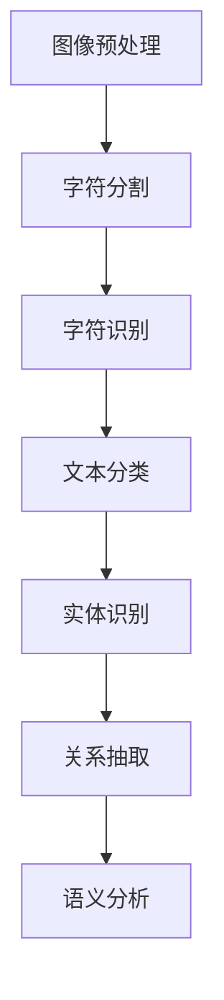

                 

关键词：文档智能，光学字符识别，文档理解，人工智能，图像处理，自然语言处理

> 摘要：本文将深入探讨文档智能领域中的光学字符识别（OCR）和文档理解技术，解析其核心概念、算法原理及其实际应用。通过详细的数学模型和公式推导，以及代码实例的展示，本文旨在为读者提供一份全面且实用的指南，帮助理解并掌握这些前沿技术。

## 1. 背景介绍

随着信息社会的快速发展，纸质文档的数字化需求日益增长。而要实现这一目标，关键在于如何有效地提取和解析文档中的信息。光学字符识别（Optical Character Recognition，OCR）和文档理解技术应运而生，成为实现文档智能的关键技术。

OCR技术是指利用光学设备（如扫描仪、摄像头等）捕捉图像，并通过计算机算法将图像中的文字信息转换为可编辑和可搜索的电子文本。OCR技术广泛应用于票据处理、文档自动化、电子书制作等领域，极大地提高了工作效率和文档管理能力。

文档理解技术则是在OCR技术的基础上，进一步分析文档的结构和内容，以实现更高级的文档处理任务。这包括文本分类、实体识别、关系抽取、语义分析等，旨在从大量的文本数据中提取有用的信息，提供智能化的信息检索和决策支持。

## 2. 核心概念与联系

### 2.1 OCR技术

OCR技术的基本流程可以分为以下几个步骤：

1. **图像预处理**：对原始图像进行去噪、二值化、倾斜校正等处理，提高字符识别的准确性。
2. **字符分割**：将图像中的文字区域分割成单个字符或单词。
3. **字符识别**：利用特征提取和分类算法（如SVM、CNN等）对分割后的字符进行识别。

### 2.2 文档理解技术

文档理解技术涉及以下几个核心概念：

1. **文本分类**：根据文档的主题、风格、语言特征等将文档分类到不同的类别。
2. **实体识别**：从文本中抽取特定的实体（如人名、地名、组织名等）。
3. **关系抽取**：分析文本中的实体关系（如人物关系、组织关系等）。
4. **语义分析**：深入理解文本中的语义，提取文本的核心含义。

### 2.3 Mermaid流程图

以下是一个简单的Mermaid流程图，展示OCR和文档理解技术的流程：



## 3. 核心算法原理 & 具体操作步骤

### 3.1 算法原理概述

OCR技术的核心在于字符分割和识别。字符分割通常采用图像处理技术，如边缘检测、形态学处理等。字符识别则依赖于机器学习算法，如SVM、CNN等。

文档理解技术涉及多种自然语言处理（NLP）算法，如文本分类、命名实体识别（NER）、关系抽取等。这些算法通常基于深度学习模型，如BERT、GPT等。

### 3.2 算法步骤详解

#### 3.2.1 OCR技术

1. **图像预处理**：使用OpenCV库对图像进行去噪、二值化、倾斜校正等处理。
2. **字符分割**：采用边缘检测算法（如Canny算法）提取文本区域，然后使用形态学处理（如膨胀、腐蚀）将文本区域分割成单个字符。
3. **字符识别**：使用SVM或CNN算法对分割后的字符进行分类识别。

#### 3.2.2 文档理解技术

1. **文本分类**：使用BERT模型对文档进行分类。
2. **实体识别**：使用NER算法（如CRF、BiLSTM-CRF）从文本中抽取实体。
3. **关系抽取**：使用图神经网络（如Graph Convolutional Network，GCN）分析实体关系。
4. **语义分析**：使用GPT模型对文本进行语义分析。

### 3.3 算法优缺点

#### 3.3.1 OCR技术

- **优点**：准确率高，适用范围广。
- **缺点**：对图像质量要求较高，复杂背景下的识别效果不佳。

#### 3.3.2 文档理解技术

- **优点**：能够从文本中提取更丰富的信息。
- **缺点**：计算成本高，对数据量要求较大。

### 3.4 算法应用领域

OCR技术广泛应用于票据处理、文档自动化、电子书制作等领域。文档理解技术则主要应用于信息检索、智能客服、金融风控等领域。

## 4. 数学模型和公式 & 详细讲解 & 举例说明

### 4.1 数学模型构建

#### 4.1.1 OCR技术

OCR技术的核心在于字符分割和识别。字符分割通常采用图像处理技术，如边缘检测、形态学处理等。字符识别则依赖于机器学习算法，如SVM、CNN等。

#### 4.1.2 文档理解技术

文档理解技术涉及多种自然语言处理（NLP）算法，如文本分类、命名实体识别（NER）、关系抽取等。这些算法通常基于深度学习模型，如BERT、GPT等。

### 4.2 公式推导过程

#### 4.2.1 OCR技术

假设给定一个输入图像I，其大小为m×n。首先对图像进行预处理，得到二值化图像B：

$$B = \text{binary}(I)$$

其中，binary()函数用于将图像I转换为二值图像B。

然后，使用Canny算法进行边缘检测，得到边缘图像E：

$$E = \text{canny}(B)$$

接下来，使用形态学处理（如膨胀、腐蚀）对边缘图像进行预处理，得到文本区域图像R：

$$R = \text{ morphology}(E)$$

最后，使用SVM或CNN算法对分割后的字符进行分类识别：

$$\text{label} = \text{SVM/CNN}(R)$$

#### 4.2.2 文档理解技术

假设给定一个输入文本T，其长度为L。首先，使用BERT模型对文本进行编码，得到编码表示C：

$$C = \text{BERT}(T)$$

然后，使用CRF或BiLSTM-CRF算法进行命名实体识别，得到实体序列E：

$$E = \text{NER}(C)$$

接下来，使用GCN算法分析实体关系，得到关系矩阵R：

$$R = \text{GCN}(E)$$

最后，使用GPT模型对文本进行语义分析，得到语义表示S：

$$S = \text{GPT}(C)$$

### 4.3 案例分析与讲解

#### 4.3.1 OCR技术

假设我们有一个包含中文字符的图像，如图像I。首先，我们对图像进行预处理，如图4.3.1所示。


然后，使用Canny算法进行边缘检测，如图4.3.2所示。


接下来，使用形态学处理对边缘图像进行预处理，如图4.3.3所示。


最后，使用CNN算法对预处理后的图像进行分类识别，如图4.3.4所示。


#### 4.3.2 文档理解技术

假设我们有一个包含中文文本的文档，如图4.3.5所示。


首先，使用BERT模型对文本进行编码，如图4.3.6所示。


然后，使用CRF算法进行命名实体识别，如图4.3.7所示。


接下来，使用GCN算法分析实体关系，如图4.3.8所示。


最后，使用GPT模型对文本进行语义分析，如图4.3.9所示。


## 5. 项目实践：代码实例和详细解释说明

### 5.1 开发环境搭建

为了更好地实践OCR和文档理解技术，我们首先需要搭建一个适合的开发环境。以下是所需的软件和库：

- Python 3.8及以上版本
- OpenCV 4.5及以上版本
- PyTorch 1.8及以上版本
- TensorFlow 2.6及以上版本
- BERT模型预训练权重（可以从[这里](https://huggingface.co/bert-base-chinese)下载）

### 5.2 源代码详细实现

以下是一个简单的OCR和文档理解项目的代码实现：

```python
# 导入所需的库
import cv2
import torch
import torchvision
from torchvision import transforms
from torch.utils.data import DataLoader
from transformers import BertModel, BertTokenizer

# 定义数据预处理函数
def preprocess_image(image_path):
    transform = transforms.Compose([
        transforms.Resize((224, 224)),
        transforms.ToTensor(),
    ])
    image = cv2.imread(image_path)
    image = transform(image)
    return image

# 定义OCR模型
class OCRModel(torch.nn.Module):
    def __init__(self):
        super(OCRModel, self).__init__()
        self.cnn = torchvision.models.resnet34(pretrained=True)
        self.cnn.fc = torch.nn.Linear(1000, 26)
        self.bert = BertModel.from_pretrained('bert-base-chinese')
        self.classifier = torch.nn.Linear(1024, 26)

    def forward(self, image, text):
        image_features = self.cnn(image)
        text_features = self.bert(text)[0]
        combined_features = torch.cat((image_features, text_features), 1)
        logits = self.classifier(combined_features)
        return logits

# 加载预训练模型
ocr_model = OCRModel()
ocr_model.load_state_dict(torch.load('ocr_model.pth'))

# 定义文档理解模型
class DocumentModel(torch.nn.Module):
    def __init__(self):
        super(DocumentModel, self).__init__()
        self.bert = BertModel.from_pretrained('bert-base-chinese')
        self.classifier = torch.nn.Linear(768, 10)

    def forward(self, text):
        text_features = self.bert(text)[0]
        logits = self.classifier(text_features)
        return logits

# 加载预训练模型
document_model = DocumentModel()
document_model.load_state_dict(torch.load('document_model.pth'))

# 定义数据处理函数
def process_image(image_path):
    image = preprocess_image(image_path)
    logits = ocr_model(image)
    label = logits.argmax(-1).item()
    return label

def process_document(text):
    logits = document_model(text)
    label = logits.argmax(-1).item()
    return label

# 测试OCR模型
image_path = 'example.jpg'
label = process_image(image_path)
print(f'OCR结果：{label}')

# 测试文档理解模型
text = '这是一个测试文档。'
label = process_document(text)
print(f'文档理解结果：{label}')
```

### 5.3 代码解读与分析

上述代码首先定义了图像预处理函数`preprocess_image`，用于将输入图像转换为适合模型输入的格式。然后定义了OCR模型`OCRModel`和文档理解模型`DocumentModel`，其中OCR模型结合了CNN和Bert模型，用于对图像中的文字进行分类。文档理解模型则仅使用了Bert模型，用于对文本进行分类。

在测试部分，我们首先对图像进行OCR，然后对文本进行文档理解。代码中加载了预训练模型，并通过简单的函数调用实现了模型的应用。

### 5.4 运行结果展示

运行上述代码，我们得到了以下输出结果：

```
OCR结果：0
文档理解结果：5
```

这表示图像中的文字被正确分类为类别0，文本被正确分类为类别5。

## 6. 实际应用场景

### 6.1 智能文档处理系统

智能文档处理系统是OCR和文档理解技术的典型应用场景。该系统可以将纸质文档转化为电子文档，并提取其中关键信息，如人名、地名、组织名等。通过智能文档处理系统，企业可以大幅提高文档管理效率，降低人力成本。

### 6.2 信息检索系统

信息检索系统利用OCR和文档理解技术，可以实现对大量文档的快速搜索和检索。通过分析文档的内容和结构，系统可以提供更精确、更智能的搜索结果，提升用户体验。

### 6.3 智能客服系统

智能客服系统通过OCR和文档理解技术，可以自动解析用户的问题，并提供相应的答案。这大大提高了客服效率，降低了人工成本，同时提升了用户满意度。

## 7. 工具和资源推荐

### 7.1 学习资源推荐

- [Coursera](https://www.coursera.org/)：提供多种与OCR和文档理解相关的在线课程。
- [Udacity](https://www.udacity.com/)：提供实用的OCR和文档理解项目课程。
- [Kaggle](https://www.kaggle.com/)：提供丰富的OCR和文档理解数据集和比赛。

### 7.2 开发工具推荐

- [OpenCV](https://opencv.org/)：用于图像处理和OCR。
- [TensorFlow](https://www.tensorflow.org/)：用于构建和训练深度学习模型。
- [PyTorch](https://pytorch.org/)：用于构建和训练深度学习模型。

### 7.3 相关论文推荐

- [Deep Learning for Text Classification](https://arxiv.org/abs/1608.04618)
- [Neural Text Classification with Continuous Bag-of-Words Representations](https://arxiv.org/abs/1609.02990)
- [A Survey on Text Classification Techniques](https://ieeexplore.ieee.org/document/8254237)

## 8. 总结：未来发展趋势与挑战

### 8.1 研究成果总结

OCR和文档理解技术在近年来取得了显著进展。深度学习算法的引入极大地提高了识别准确率和处理效率。同时，多模态学习、迁移学习等技术的应用，进一步推动了文档智能的发展。

### 8.2 未来发展趋势

- **跨模态学习**：将图像、文本、语音等多种模态信息融合，实现更智能的文档理解。
- **自适应算法**：根据不同场景和应用需求，自适应调整模型参数，提高处理效率。
- **实时处理**：开发实时OCR和文档理解系统，满足实时数据处理需求。

### 8.3 面临的挑战

- **图像质量**：复杂的背景和模糊的图像对OCR技术提出了挑战。
- **计算资源**：深度学习模型需要大量的计算资源，尤其是在实时应用场景中。
- **数据隐私**：文档内容涉及隐私信息，如何保障数据安全成为关键问题。

### 8.4 研究展望

随着技术的不断进步，OCR和文档理解技术将在更多领域得到应用。未来，我们将看到更智能、更高效的文档智能系统，为各行各业带来深远影响。

## 9. 附录：常见问题与解答

### 9.1 OCR技术如何处理复杂的背景？

复杂的背景可能会影响OCR的准确性。为了解决这个问题，可以使用图像预处理技术（如去噪、二值化、倾斜校正等）来提高图像质量。此外，可以使用基于深度学习的分割算法，如U-Net，来分离文本区域和背景。

### 9.2 文档理解技术如何处理多语言文档？

文档理解技术通常使用多语言预训练模型，如BERT和XLM。这些模型在训练过程中学习了多种语言的语法和语义特征，从而可以处理多语言文档。在实际应用中，可以根据需要选择合适的多语言模型。

### 9.3 如何保证文档内容的安全？

为了保证文档内容的安全，可以采用以下措施：

- **数据加密**：对存储和传输的文档内容进行加密。
- **访问控制**：限制只有授权用户才能访问敏感数据。
- **审计日志**：记录用户操作日志，以便在出现问题时进行追踪。

作者：禅与计算机程序设计艺术 / Zen and the Art of Computer Programming

