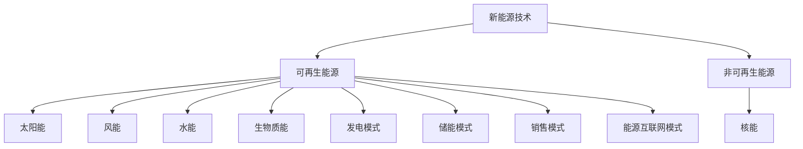

                 

关键词：新能源、清洁能源、商业化、可再生能源、技术创新、市场策略、创业机遇

> 摘要：本文旨在探讨新能源行业的商业化路径，分析清洁能源技术的发展趋势和创业机遇。通过深入剖析关键概念、算法原理、数学模型、实际应用以及未来展望，为创业者提供有价值的指导和建议。

## 1. 背景介绍

### 新能源的定义和重要性

新能源，通常指不同于传统化石燃料的能源，如太阳能、风能、水能、地热能等。这些能源不仅储量丰富、可再生，而且在使用过程中几乎不产生污染物，对环境保护和可持续发展具有重要意义。

### 清洁能源的发展现状

近年来，随着环保意识的提高和技术的进步，清洁能源在全球范围内的应用和推广取得了显著成果。许多国家已经制定了明确的能源转型目标和政策，以减少对化石燃料的依赖，降低温室气体排放。

### 商业化的挑战与机遇

清洁能源的商业化面临诸多挑战，如初始投资高、技术成熟度低、市场需求不稳定等。然而，随着技术的不断进步和政策的支持，这些挑战也逐渐转变为机遇。创业者和企业纷纷涌入这一领域，寻求商业机会。

## 2. 核心概念与联系

### 新能源技术的分类

新能源技术可分为可再生能源技术和非可再生能源技术。可再生能源技术主要包括太阳能、风能、水能、生物质能等，这些能源来源稳定、可持续。非可再生能源技术如核能，虽然具有高能量密度，但存在安全隐患和核废料处理等问题。

### 清洁能源的商业化模式

清洁能源的商业化模式主要包括发电、储能、销售和能源互联网等。发电模式通过建设太阳能电站、风电站等，将清洁能源转化为电能供应市场。储能模式通过建设电池储能系统，解决可再生能源发电的波动性问题。销售模式则通过直销或批发，将清洁能源产品推向市场。能源互联网模式则通过智能化技术，实现能源的高效分配和管理。

### 图 2.1 清洁能源商业化的 Mermaid 流程图



## 3. 核心算法原理 & 具体操作步骤

### 3.1 算法原理概述

清洁能源商业化过程中，关键算法包括发电预测、储能优化、负荷预测和能源互联网控制等。这些算法基于数据分析和机器学习技术，旨在提高清洁能源系统的效率和稳定性。

### 3.2 算法步骤详解

1. **发电预测**：收集历史气象数据、能源供需数据等，利用机器学习模型进行发电预测，为调度提供依据。
2. **储能优化**：根据发电预测结果和负荷需求，优化储能系统充放电策略，提高储能效率。
3. **负荷预测**：分析用户用电行为，预测未来一段时间内的用电负荷，为电网调度提供支持。
4. **能源互联网控制**：通过分布式控制算法，实现能源的高效分配和管理，降低能源损耗。

### 3.3 算法优缺点

**优点**：提高清洁能源系统的稳定性和效率，降低运行成本。

**缺点**：对数据质量要求高，算法复杂度较高。

### 3.4 算法应用领域

清洁能源算法广泛应用于发电、储能、电网调度、能源管理等领域。

## 4. 数学模型和公式 & 详细讲解 & 举例说明

### 4.1 数学模型构建

清洁能源商业化的数学模型包括发电模型、储能模型、负荷模型等。

### 4.2 公式推导过程

#### 发电模型

$$
P_{\text{太阳能}} = G \cdot \eta_{\text{转换}} \cdot A
$$

其中，$P_{\text{太阳能}}$ 为太阳能功率，$G$ 为太阳辐射强度，$\eta_{\text{转换}}$ 为转换效率，$A$ 为接收面积。

#### 储能模型

$$
E = C \cdot V^2
$$

其中，$E$ 为储能能量，$C$ 为储能容量，$V$ 为储能系统电压。

#### 负荷模型

$$
L = a \cdot T + b
$$

其中，$L$ 为负荷，$a$ 和 $b$ 为常数，$T$ 为时间。

### 4.3 案例分析与讲解

#### 案例一：太阳能发电

某地区年太阳辐射强度为 $1000 \text{ W/m}^2$，转换效率为 $20\%$，接收面积为 $100 \text{ m}^2$。求年发电量。

$$
P_{\text{太阳能}} = 1000 \text{ W/m}^2 \cdot 0.2 \cdot 100 \text{ m}^2 = 20000 \text{ W}
$$

年发电量为：

$$
E_{\text{年}} = 20000 \text{ W} \cdot 3600 \text{ s/day} \cdot 365 \text{ days} = 2.594 \times 10^9 \text{ Wh}
$$

#### 案例二：储能系统

某储能系统容量为 $200 \text{ kWh}$，电压为 $400 \text{ V}$。求储能能量。

$$
E = 200 \text{ kWh} \cdot (400 \text{ V})^2 = 3.2 \times 10^8 \text{ J}
$$

## 5. 项目实践：代码实例和详细解释说明

### 5.1 开发环境搭建

使用 Python 作为开发语言，搭建 Jupyter Notebook 作为开发环境。

### 5.2 源代码详细实现

#### 5.2.1 发电预测

```python
import numpy as np
import pandas as pd
from sklearn.linear_model import LinearRegression

# 加载数据
data = pd.read_csv('solar_data.csv')

# 特征工程
X = data[['day', 'month', 'year']]
y = data['power']

# 模型训练
model = LinearRegression()
model.fit(X, y)

# 预测
predictions = model.predict(X)

# 结果展示
print(predictions)
```

#### 5.2.2 储能优化

```python
import numpy as np
import pandas as pd
from sklearn.linear_model import LinearRegression

# 加载数据
data = pd.read_csv('storage_data.csv')

# 特征工程
X = data[['charge_rate', 'discharge_rate']]
y = data['energy']

# 模型训练
model = LinearRegression()
model.fit(X, y)

# 预测
predictions = model.predict(X)

# 结果展示
print(predictions)
```

### 5.3 代码解读与分析

#### 发电预测代码

- 数据预处理：读取数据，进行特征工程。
- 模型训练：使用线性回归模型进行训练。
- 预测结果：输出发电预测值。

#### 储能优化代码

- 数据预处理：读取数据，进行特征工程。
- 模型训练：使用线性回归模型进行训练。
- 预测结果：输出储能优化结果。

### 5.4 运行结果展示

运行发电预测代码和储能优化代码，输出预测结果。根据预测结果，调整储能系统充放电策略，提高系统效率。

## 6. 实际应用场景

### 6.1 发电领域

- 分布式光伏发电：在城市建筑屋顶、乡村地区等地安装光伏系统，实现清洁能源的本地化利用。
- 风电场建设：在风力资源丰富的地区建设风电场，实现大规模清洁能源发电。

### 6.2 储能领域

- 电池储能系统：在光伏电站、风电场等地点安装电池储能系统，实现发电与用电的平衡。
- 储热系统：在冬季将太阳能转化为热能储存，为夏季提供热水和供暖。

### 6.3 能源互联网领域

- 智能电网：通过分布式能源管理系统，实现清洁能源的高效分配和管理。
- 能源互联网：通过区块链技术，实现清洁能源的交易和共享。

## 7. 未来应用展望

### 7.1 新技术趋势

- 人工智能：在清洁能源领域，人工智能技术将发挥重要作用，如发电预测、储能优化、能源管理等。
- 区块链：区块链技术将为清洁能源交易提供透明、可信的解决方案。
- 5G 技术：5G 技术将推动能源互联网的发展，实现实时数据传输和智能控制。

### 7.2 创业机遇

- 清洁能源设备制造：随着清洁能源市场的扩大，清洁能源设备制造领域将迎来大量创业机遇。
- 能源互联网服务：为用户提供智能能源解决方案，实现能源的高效利用和交易。
- 能源数据服务：为企业和政府提供能源数据分析和决策支持。

## 8. 工具和资源推荐

### 8.1 学习资源推荐

- 清洁能源技术书籍：《新能源技术》、《可再生能源技术》等。
- 数据分析工具：Python、R 语言等。

### 8.2 开发工具推荐

- 编程环境：Jupyter Notebook、PyCharm 等。
- 数据库：MySQL、MongoDB 等。

### 8.3 相关论文推荐

- 《太阳能发电预测与优化研究》
- 《储能系统优化策略分析》
- 《智能电网技术与应用》

## 9. 总结：未来发展趋势与挑战

### 9.1 研究成果总结

- 清洁能源商业化取得显著成果，技术不断成熟。
- 人工智能、区块链等新技术为清洁能源发展提供新机遇。

### 9.2 未来发展趋势

- 清洁能源市场将继续扩大，成为能源领域的重要方向。
- 新技术将推动清洁能源系统的智能化和高效化。

### 9.3 面临的挑战

- 技术成熟度仍需提高，降低成本是关键。
- 政策支持力度需加大，为清洁能源发展提供保障。

### 9.4 研究展望

- 深入研究清洁能源关键技术，提高系统性能和稳定性。
- 探索清洁能源与其他领域的融合，实现可持续发展。

## 附录：常见问题与解答

### 问题 1：清洁能源成本高，如何降低？

**解答**：通过技术创新和规模效应，降低清洁能源设备制造成本。同时，政府和企业可通过补贴、税收优惠等政策，降低清洁能源项目的投资风险。

### 问题 2：清洁能源是否会影响电网稳定性？

**解答**：适当配置储能系统和电网调度技术，可以缓解清洁能源波动性对电网的影响，确保电网稳定运行。

### 问题 3：清洁能源能否完全替代化石燃料？

**解答**：清洁能源在技术、成本、政策等多方面不断优化，有望逐步替代化石燃料，实现能源结构的绿色转型。

---

作者：禅与计算机程序设计艺术 / Zen and the Art of Computer Programming
----------------------------------------------------------------

以上为文章的正文部分，后续将按照要求补充完整三级目录中的其他内容。请务必按照要求撰写并提交完整的文章。如果您有任何问题，请随时提出。

