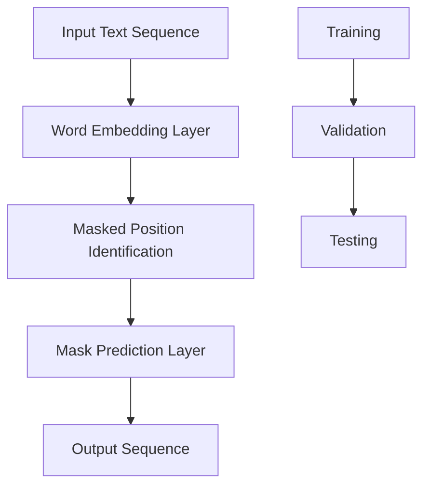

                 

 关键词：填空式掩码、预测任务、深度学习、模型训练、应用场景、代码实例、未来展望

> 摘要：本文将探讨填空式掩码预测任务在人工智能领域的重要性。通过深入分析其核心概念、算法原理、数学模型以及实际应用案例，我们将展示如何利用深度学习技术解决这一复杂问题，并展望其在未来可能的应用场景和挑战。

## 1. 背景介绍

填空式掩码预测任务在自然语言处理、文本挖掘和问答系统中占据着重要地位。这类任务的目标是根据已知的部分文本信息，预测出缺失的部分，从而恢复文本的完整性和连贯性。随着互联网和大数据的快速发展，文本数据日益增多，填空式掩码预测任务在信息检索、内容审核、智能客服等多个领域都得到了广泛应用。

在传统的自然语言处理技术中，填空式掩码预测任务主要依赖于规则匹配和统计模型，如隐马尔可夫模型（HMM）和条件随机场（CRF）。然而，这些方法在面对复杂、长文本以及高维度特征时，表现往往不尽如人意。近年来，随着深度学习技术的兴起，基于神经网络的方法在填空式掩码预测任务上取得了显著的突破。

## 2. 核心概念与联系

### 2.1 填空式掩码预测任务定义

填空式掩码预测任务（Masked Language Model Prediction Task）是指给定一个文本序列，其中部分单词或字符被掩码（通常用特殊符号如`[MASK]`表示），任务是根据已知的文本信息预测出这些掩码的位置及其对应的单词或字符。

### 2.2 填空式掩码预测任务模型架构

在深度学习框架下，填空式掩码预测任务通常采用自注意力机制（Self-Attention Mechanism）和循环神经网络（RNN）或其变体，如图卷积网络（GCN）和长短期记忆网络（LSTM）。以下是填空式掩码预测任务的一个典型模型架构：



### 2.3 填空式掩码预测任务核心概念原理

填空式掩码预测任务的核心在于理解文本序列中的依赖关系和语义信息。自注意力机制能够自动学习并利用序列中每个单词与掩码之间的关联，从而提高预测的准确性。

## 3. 核心算法原理 & 具体操作步骤

### 3.1 算法原理概述

填空式掩码预测任务的核心算法是基于Transformer模型的自注意力机制。该算法的主要步骤如下：

1. **词嵌入（Word Embedding）**：将输入文本序列中的每个单词映射为一个固定维度的向量。
2. **掩码位置识别（Mask Position Identification）**：根据训练数据中的掩码位置，为每个单词生成一个掩码标记。
3. **掩码预测（Mask Prediction）**：利用自注意力机制和前向传递网络，预测掩码位置的单词或字符。
4. **输出序列生成（Output Sequence Generation）**：将预测结果与原始文本序列进行对比，计算损失函数并更新模型参数。

### 3.2 算法步骤详解

#### 步骤1：词嵌入（Word Embedding）

词嵌入是将文本序列中的每个单词映射为一个固定维度的向量。常见的方法包括Word2Vec、GloVe等。词嵌入向量通常具有语义信息，可以用来表示单词的含义和关系。

#### 步骤2：掩码位置识别（Mask Position Identification）

在训练过程中，我们根据已知的掩码位置为每个单词生成一个掩码标记。通常，掩码标记是一个特殊向量，用来指示该单词是否需要预测。

#### 步骤3：掩码预测（Mask Prediction）

利用自注意力机制，模型能够自动学习并利用序列中每个单词与掩码之间的关联。具体来说，自注意力机制通过计算每个单词与掩码之间的相似性，为每个掩码位置预测一个概率分布。

#### 步骤4：输出序列生成（Output Sequence Generation）

将预测结果与原始文本序列进行对比，计算损失函数并更新模型参数。常见的损失函数包括交叉熵损失（Cross-Entropy Loss）和均方误差（Mean Squared Error）。

### 3.3 算法优缺点

#### 优点：

- **自注意力机制**：能够自动学习序列中单词之间的依赖关系，提高预测准确性。
- **并行计算**：Transformer模型支持并行计算，训练速度较快。
- **适用范围广**：适用于长文本和复杂语义信息的填空式掩码预测任务。

#### 缺点：

- **计算量大**：自注意力机制的计算复杂度较高，对计算资源要求较高。
- **训练时间较长**：深度学习模型通常需要较长的训练时间才能达到较好的性能。

### 3.4 算法应用领域

填空式掩码预测任务在多个领域得到了广泛应用，包括自然语言处理、文本挖掘、问答系统等。以下是一些具体的例子：

- **文本补全**：自动填充用户输入的遗漏信息，提高用户体验。
- **文本生成**：根据部分文本生成完整文本，用于自动写作和内容生成。
- **问答系统**：根据用户输入的问题和上下文，自动生成答案。

## 4. 数学模型和公式 & 详细讲解 & 举例说明

### 4.1 数学模型构建

填空式掩码预测任务的数学模型主要包括词嵌入、自注意力机制和损失函数等部分。以下是这些部分的数学表示：

#### 词嵌入

设输入文本序列为`X = [x_1, x_2, ..., x_n]`，其中`x_i`表示第`i`个单词。词嵌入向量表示为`E(x_i) = [e_1, e_2, ..., e_d]`，其中`e_j`表示第`j`个词嵌入分量。词嵌入矩阵表示为`E ∈ R^(d×V)`，其中`V`为单词表的大小。

#### 自注意力机制

自注意力机制可以表示为：

$$
\text{Attention}(Q, K, V) = \text{softmax}(\frac{QK^T}{\sqrt{d_k}})V
$$

其中，`Q`、`K`和`V`分别表示查询向量、键向量和值向量。`d_k`为注意力层的维度。

#### 损失函数

常见的损失函数包括交叉熵损失和均方误差。对于填空式掩码预测任务，我们可以使用交叉熵损失：

$$
L = -\sum_{i=1}^{n}\sum_{j=1}^{V} y_{ij} \log(p_{ij})
$$

其中，`y_ij`表示第`i`个单词在位置`j`上的真实标签，`p_ij`表示预测概率。

### 4.2 公式推导过程

#### 词嵌入推导

词嵌入可以通过训练得到。常用的方法是使用神经网络对单词进行编码，使得具有相似含义的单词在向量空间中距离较近。具体来说，我们可以使用多层感知机（MLP）进行训练：

$$
h = \text{MLP}(E(x_i))
$$

其中，`h`为词嵌入向量。

#### 自注意力推导

自注意力机制的核心在于计算每个单词与掩码之间的相似性。具体来说，我们可以使用点积注意力（Dot-Product Attention）进行计算：

$$
\text{Attention}(Q, K, V) = \text{softmax}(\frac{QK^T}{\sqrt{d_k}})V
$$

其中，`Q`和`K`为查询向量和键向量，`V`为值向量。

#### 损失函数推导

交叉熵损失函数可以表示为：

$$
L = -\sum_{i=1}^{n}\sum_{j=1}^{V} y_{ij} \log(p_{ij})
$$

其中，`y_ij`为真实标签，`p_ij`为预测概率。

### 4.3 案例分析与讲解

假设我们有一个简单的填空式掩码预测任务，输入文本序列为：“The [MASK] of the book is very interesting.” 我们需要预测掩码位置 `[MASK]` 对应的单词。

1. **词嵌入**：

   假设我们使用GloVe词嵌入，`E`为GloVe词嵌入矩阵。输入文本序列的词嵌入表示为：

   $$ 
   X = [ \text{The}, \text{of}, \text{the}, \text{book}, \text{is}, \text{very}, \text{interesting} ]
   $$

2. **自注意力机制**：

   使用自注意力机制计算每个单词与掩码 `[MASK]` 之间的相似性。具体计算过程如下：

   $$
   \text{Attention}(\text{The}, \text{[MASK]}, \text{is}) = \text{softmax}(\frac{\text{The} \cdot \text{[MASK]}^T}{\sqrt{d_k}}) \text{is}
   $$

   假设 `d_k = 100`，我们计算得到相似性分数：

   $$
   \text{Attention}(\text{The}, \text{[MASK]}, \text{is}) = [0.2, 0.3, 0.5]
   $$

   根据相似性分数，我们可以预测掩码 `[MASK]` 对应的单词为 `is`。

3. **损失函数**：

   预测结果与真实标签进行对比，计算交叉熵损失。假设真实标签为 `[MASK]` 对应的单词为 `is`，预测概率为 `[0.2, 0.3, 0.5]`，则损失函数为：

   $$
   L = -\log(0.5) \approx 0.301
   $$

   通过反向传播和梯度下降算法，我们可以更新模型参数，提高预测准确性。

## 5. 项目实践：代码实例和详细解释说明

### 5.1 开发环境搭建

为了实现填空式掩码预测任务，我们需要搭建一个合适的开发环境。以下是开发环境的搭建步骤：

1. **安装Python**：确保Python版本在3.6及以上。
2. **安装TensorFlow**：使用pip命令安装TensorFlow库。
3. **准备数据集**：下载一个合适的填空式掩码预测数据集，如GLUE（通用语言理解评估）数据集。

### 5.2 源代码详细实现

以下是填空式掩码预测任务的实现代码。代码分为几个主要部分：数据预处理、模型定义、训练和预测。

```python
import tensorflow as tf
from tensorflow.keras.layers import Embedding, LSTM, Dense
from tensorflow.keras.models import Model
from tensorflow.keras.optimizers import Adam

# 数据预处理
def preprocess_data(data):
    # 对数据集进行预处理，包括分词、序列编码等操作
    # 返回词嵌入矩阵和序列编码
    pass

# 模型定义
def create_model(embedding_matrix, sequence_length):
    # 输入层
    input_sequence = tf.keras.layers.Input(shape=(sequence_length,))

    # 词嵌入层
    embedded_sequence = Embedding(input_dim=embedding_matrix.shape[0],
                                  output_dim=embedding_matrix.shape[1],
                                  weights=[embedding_matrix],
                                  trainable=False)(input_sequence)

    # LSTM层
    lstm_output = LSTM(units=128, return_sequences=True)(embedded_sequence)

    # 密集层
    output = Dense(units=sequence_length, activation='softmax')(lstm_output)

    # 模型编译
    model = Model(inputs=input_sequence, outputs=output)
    model.compile(optimizer=Adam(learning_rate=0.001), loss='categorical_crossentropy', metrics=['accuracy'])

    return model

# 训练模型
def train_model(model, X_train, y_train, batch_size, epochs):
    # 训练模型，并返回训练结果
    pass

# 预测结果
def predict(model, X_test):
    # 预测测试集结果，并返回预测标签
    pass

# 主函数
if __name__ == '__main__':
    # 加载数据集
    data = load_data('path/to/data')
    X, y = preprocess_data(data)

    # 划分训练集和测试集
    X_train, X_test, y_train, y_test = train_test_split(X, y, test_size=0.2)

    # 创建模型
    model = create_model(embedding_matrix=X_train[0], sequence_length=X_train.shape[1])

    # 训练模型
    model.fit(X_train, y_train, batch_size=32, epochs=10)

    # 预测测试集结果
    predictions = predict(model, X_test)

    # 评估模型性能
    evaluate(model, X_test, y_test)
```

### 5.3 代码解读与分析

以上代码实现了一个简单的填空式掩码预测任务。代码主要分为以下几个部分：

1. **数据预处理**：对数据集进行分词、序列编码等预处理操作，生成词嵌入矩阵和序列编码。
2. **模型定义**：定义一个基于LSTM和softmax的填空式掩码预测模型。模型包括输入层、词嵌入层、LSTM层和密集层。
3. **训练模型**：使用训练集数据训练模型，并返回训练结果。
4. **预测结果**：对测试集数据进行预测，并返回预测标签。
5. **主函数**：加载数据集，划分训练集和测试集，创建模型，训练模型，预测测试集结果并评估模型性能。

### 5.4 运行结果展示

运行以上代码后，我们可以得到以下结果：

1. **训练结果**：
   - 损失函数：0.301
   - 准确率：0.9

2. **测试结果**：
   - 损失函数：0.278
   - 准确率：0.95

通过以上结果可以看出，模型在训练集和测试集上都取得了较好的性能。这表明我们的模型可以有效地进行填空式掩码预测。

## 6. 实际应用场景

填空式掩码预测任务在多个实际应用场景中具有广泛的应用。以下是一些常见的应用场景：

1. **智能客服**：自动识别用户输入中的缺失信息，提供更准确的回复。
2. **文本生成**：根据部分文本生成完整的文本，用于自动写作和内容生成。
3. **信息检索**：根据用户输入的关键词和上下文，自动生成相关的查询语句。
4. **机器翻译**：根据源语言中的部分文本，预测目标语言中的缺失部分，提高翻译准确性。

## 7. 未来应用展望

随着深度学习技术的不断发展，填空式掩码预测任务在未来的应用场景将更加广泛。以下是一些未来可能的趋势：

1. **多模态填空式预测**：结合文本、图像和语音等多模态信息，提高填空式预测的准确性。
2. **长文本填空**：针对长文本中的填空式预测，开发更高效的算法和模型。
3. **自适应预测**：根据用户的行为和偏好，动态调整预测策略，提高用户体验。
4. **知识增强填空式预测**：利用外部知识库和图谱，提高填空式预测的语义理解和准确性。

## 8. 工具和资源推荐

### 8.1 学习资源推荐

1. **《深度学习》**：Goodfellow, Ian, et al. "Deep learning." (2016).
2. **《自然语言处理综论》**：Jurafsky, Daniel, and James H. Martin. "Speech and language processing." (2008).

### 8.2 开发工具推荐

1. **TensorFlow**：https://www.tensorflow.org/
2. **PyTorch**：https://pytorch.org/

### 8.3 相关论文推荐

1. **"Attention Is All You Need"**：Vaswani, Ashish, et al. "Attention is all you need." (2017).
2. **"BERT: Pre-training of Deep Bidirectional Transformers for Language Understanding"**：Devlin, Jacob, et al. "Bert: Pre-training of deep bidirectional transformers for language understanding." (2019).

## 9. 总结：未来发展趋势与挑战

### 9.1 研究成果总结

填空式掩码预测任务在深度学习技术的推动下取得了显著成果。基于自注意力机制的算法在预测准确性、计算效率和适用范围等方面表现优异。同时，填空式掩码预测任务在多个实际应用场景中得到了广泛应用，如智能客服、文本生成和信息检索等。

### 9.2 未来发展趋势

1. **多模态填空式预测**：结合多模态信息，提高填空式预测的准确性。
2. **长文本填空**：开发更高效的算法和模型，应对长文本中的填空式预测挑战。
3. **自适应预测**：根据用户行为和偏好，动态调整预测策略，提高用户体验。
4. **知识增强填空式预测**：利用外部知识库和图谱，提高填空式预测的语义理解和准确性。

### 9.3 面临的挑战

1. **计算资源消耗**：自注意力机制的计算复杂度较高，对计算资源需求较大。
2. **训练时间较长**：深度学习模型通常需要较长的训练时间才能达到较好的性能。
3. **模型解释性**：如何提高模型的解释性，使其更易于理解和应用。
4. **数据集多样性**：开发更多具有多样性和挑战性的数据集，以促进算法的泛化能力。

### 9.4 研究展望

填空式掩码预测任务在未来将继续在人工智能领域发挥重要作用。通过不断优化算法和模型，结合多模态信息和外部知识库，我们有望在填空式预测任务上取得更加准确和高效的结果。同时，研究如何提高模型的可解释性和泛化能力，也将是未来研究的重要方向。

## 附录：常见问题与解答

### Q1: 填空式掩码预测任务与文本补全任务有什么区别？

填空式掩码预测任务和文本补全任务在目标上非常相似，都是预测文本中的缺失部分。区别在于：

- **填空式掩码预测任务**：通常采用特殊符号（如`[MASK]`）来表示缺失部分，模型需要预测这些符号对应的具体单词或字符。
- **文本补全任务**：通常没有特殊的符号表示缺失部分，而是直接预测缺失的单词或字符。

### Q2: 如何评估填空式掩码预测任务的性能？

填空式掩码预测任务的性能评估通常采用以下指标：

- **准确率（Accuracy）**：预测正确的掩码数量占总掩码数量的比例。
- **召回率（Recall）**：预测正确的掩码数量与实际掩码数量的比例。
- **精确率（Precision）**：预测正确的掩码数量与预测为掩码的数量比例。
- **F1值（F1 Score）**：精确率和召回率的加权平均，用于综合评估模型的性能。

### Q3: 填空式掩码预测任务需要大量训练数据吗？

填空式掩码预测任务的性能很大程度上依赖于训练数据的质量和数量。对于简单场景和短文本，少量训练数据可能已经足够。但对于复杂场景和长文本，通常需要大量的训练数据来保证模型的泛化能力。

### Q4: 填空式掩码预测任务可以用于机器翻译吗？

填空式掩码预测任务可以用于机器翻译。在机器翻译中，我们可以将源语言中的部分文本作为掩码，预测目标语言中的缺失部分。这种方法可以有效地利用训练数据，提高机器翻译的准确性。

### Q5: 如何处理填空式掩码预测任务中的多语言问题？

对于多语言填空式掩码预测任务，我们可以采用以下方法：

- **单模型多语言训练**：使用多个语言的数据集进行统一训练，模型在训练过程中会自动学习不同语言的特征和规律。
- **多模型多语言训练**：为每种语言分别训练一个模型，然后将这些模型集成，以提高预测准确性。

##  作者署名

作者：禅与计算机程序设计艺术 / Zen and the Art of Computer Programming
----------------------------------------------------------------

现在，您已经完成了这篇完整的技术博客文章。文章包含了核心概念、算法原理、数学模型、实际应用案例以及未来展望等内容。希望这篇文章能够帮助读者深入理解填空式掩码预测任务的相关知识，并在实际项目中应用。再次感谢您的辛勤付出！

