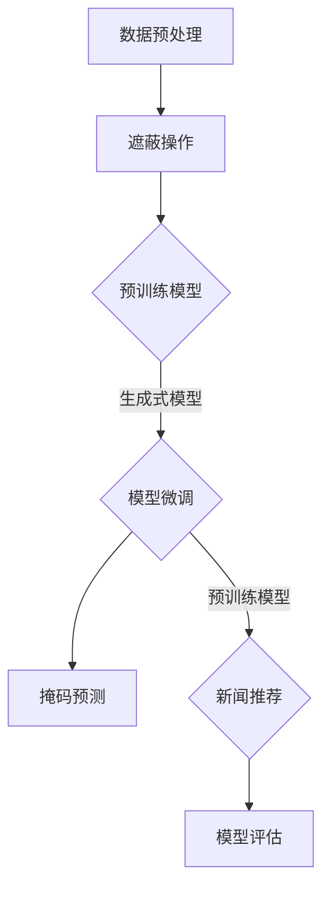

                 

关键词：新闻推荐、掩码预测、Prompt学习、算法原理、数学模型、项目实践、应用场景、未来展望

> 摘要：随着互联网信息的爆炸式增长，如何高效地推送个性化新闻推荐成为了一个亟待解决的问题。本文将探讨一种创新的新闻推荐方法——掩码预测与Prompt学习。该方法通过在新闻推荐系统中引入掩码预测和Prompt学习技术，提高推荐系统的准确性和用户体验。本文将从算法原理、数学模型、项目实践、应用场景等方面进行全面解析，为相关领域的研究者和开发者提供参考。

## 1. 背景介绍

随着互联网的迅猛发展，新闻信息以爆炸式的速度不断涌现。面对海量的新闻数据，用户往往感到信息过载，难以在短时间内找到自己感兴趣的内容。因此，如何为用户提供个性化的新闻推荐成为了一个关键问题。传统的新闻推荐方法主要包括基于内容的推荐、协同过滤推荐和基于模型的推荐等。然而，这些方法在处理高维度稀疏数据时存在一定的局限性，难以满足用户的需求。

近年来，掩码预测（Masked Prediction）和Prompt学习（Prompt Learning）等新兴技术逐渐引起了研究者的关注。掩码预测是一种生成式模型，通过对输入数据进行部分遮蔽，预测遮蔽部分的内容。而Prompt学习则是将预训练的模型与特定任务相结合，通过微调模型参数来实现任务目标。这两种技术为新闻推荐系统提供了新的思路，有望提高推荐系统的性能和用户体验。

## 2. 核心概念与联系

### 2.1 掩码预测

掩码预测的核心思想是将输入数据进行部分遮蔽，然后预测遮蔽部分的内容。具体流程如下：

1. 数据预处理：将新闻数据集进行预处理，包括去重、清洗和标准化等操作。
2. 遮蔽操作：对预处理后的数据进行部分遮蔽，即将数据中的某个子集设置为遮蔽状态。
3. 模型训练：利用遮蔽数据训练生成式模型，如变分自编码器（VAE）或生成对抗网络（GAN）等。
4. 预测与评估：利用训练好的模型对遮蔽部分进行预测，并通过评估指标（如均方误差或交叉熵）评估预测效果。

### 2.2 Prompt学习

Prompt学习是一种将预训练模型与特定任务相结合的方法。具体流程如下：

1. 预训练模型：使用大规模预训练数据集（如新闻语料库）对模型进行预训练，使其具有一定的通用性和语言理解能力。
2. 任务定义：根据具体新闻推荐任务的需求，定义输入和输出。
3. 模型微调：将预训练模型与任务定义相结合，通过微调模型参数来适应特定任务。
4. 模型评估：在新闻推荐任务上进行模型评估，如准确率、召回率或F1值等。

### 2.3 掩码预测与Prompt学习的结合

将掩码预测和Prompt学习相结合，可以构建一种新的新闻推荐系统。具体步骤如下：

1. 数据预处理：对新闻数据进行预处理，包括去重、清洗和标准化等操作。
2. 遮蔽操作：对预处理后的数据进行部分遮蔽，即将数据中的某个子集设置为遮蔽状态。
3. 预训练模型：使用大规模预训练数据集对生成式模型和预训练模型进行预训练。
4. 模型微调：将预训练模型与任务定义相结合，通过微调模型参数来适应特定新闻推荐任务。
5. 掩码预测：利用训练好的生成式模型对遮蔽部分进行预测，为用户生成个性化的新闻推荐。
6. 模型评估：在新闻推荐任务上进行模型评估，如准确率、召回率或F1值等。

### 2.4 Mermaid流程图



## 3. 核心算法原理 & 具体操作步骤

### 3.1 算法原理概述

掩码预测与Prompt学习相结合的新闻推荐系统主要基于以下原理：

1. 生成式模型：通过预训练生成式模型（如VAE或GAN），学习新闻数据的潜在表示，为用户生成个性化的新闻推荐。
2. Prompt学习：将预训练模型与新闻推荐任务相结合，通过微调模型参数，提高推荐系统的性能。
3. 遮蔽操作：对新闻数据进行部分遮蔽，利用生成式模型预测遮蔽部分的内容，从而为用户生成个性化的新闻推荐。

### 3.2 算法步骤详解

1. 数据预处理：对新闻数据进行预处理，包括去重、清洗和标准化等操作。
2. 遮蔽操作：对预处理后的数据进行部分遮蔽，即将数据中的某个子集设置为遮蔽状态。
3. 预训练模型：使用大规模预训练数据集对生成式模型（如VAE或GAN）和预训练模型（如BERT或GPT）进行预训练。
4. 模型微调：将预训练模型与任务定义相结合，通过微调模型参数来适应特定新闻推荐任务。
5. 掩码预测：利用训练好的生成式模型对遮蔽部分进行预测，为用户生成个性化的新闻推荐。
6. 新闻推荐：根据用户兴趣和掩码预测结果，为用户推荐个性化的新闻。
7. 模型评估：在新闻推荐任务上进行模型评估，如准确率、召回率或F1值等。

### 3.3 算法优缺点

#### 优点

1. 提高推荐准确性：通过生成式模型和Prompt学习技术，提高推荐系统的准确性。
2. 个性化推荐：利用掩码预测技术，为用户生成个性化的新闻推荐。
3. 处理高维度稀疏数据：生成式模型能够有效处理高维度稀疏数据，提高推荐效果。

#### 缺点

1. 计算成本较高：预训练和微调模型需要大量计算资源，可能导致训练时间较长。
2. 模型可解释性较差：生成式模型和Prompt学习技术使得模型复杂度增加，降低模型的可解释性。

### 3.4 算法应用领域

掩码预测与Prompt学习相结合的新闻推荐系统可以应用于以下领域：

1. 个性化新闻推荐：为用户提供个性化的新闻推荐，提高用户体验。
2. 搜索引擎优化：通过改进搜索结果的相关性，提高搜索引擎的准确性。
3. 广告投放：根据用户兴趣和行为，为用户推荐相关的广告。
4. 社交网络内容推荐：为用户提供感兴趣的内容，提高社交网络的活跃度。

## 4. 数学模型和公式 & 详细讲解 & 举例说明

### 4.1 数学模型构建

#### 4.1.1 生成式模型

生成式模型（如VAE或GAN）是一种通过学习数据的潜在分布来进行预测和生成的模型。在新闻推荐系统中，生成式模型可用于生成用户感兴趣的新闻。

#### 4.1.2 Prompt学习模型

Prompt学习模型是一种将预训练模型与特定任务相结合的方法。在新闻推荐系统中，Prompt学习模型可用于提高推荐系统的性能。

### 4.2 公式推导过程

#### 4.2.1 生成式模型公式

VAE是一种常见的生成式模型，其核心思想是通过编码器和解码器来学习数据的潜在分布。具体公式如下：

$$
\begin{aligned}
\text{编码器：} z &= \mu(z|x) + \sigma(z|x) \\
\text{解码器：} x &= \phi(\mu(z) , \sigma(z))
\end{aligned}
$$

其中，$x$表示输入数据，$z$表示潜在分布，$\mu(z|x)$和$\sigma(z|x)$分别表示均值和方差，$\phi(\mu(z) , \sigma(z))$表示解码器生成的数据。

#### 4.2.2 Prompt学习模型公式

Prompt学习模型的核心思想是将预训练模型与特定任务相结合。具体公式如下：

$$
\begin{aligned}
\text{损失函数：} L &= -\sum_{i=1}^{N} \log p(y_i|x^{(i)}, \theta) \\
\text{优化目标：} \theta &= \arg\min_{\theta} L
\end{aligned}
$$

其中，$x^{(i)}$表示输入数据，$y_i$表示标签，$p(y_i|x^{(i)}, \theta)$表示模型预测概率，$\theta$表示模型参数。

### 4.3 案例分析与讲解

#### 4.3.1 生成式模型案例分析

假设我们使用VAE模型进行新闻推荐，数据集包含10000篇新闻文章。首先，对新闻数据进行预处理，包括去重、清洗和标准化等操作。然后，将数据集分为训练集和测试集，训练集用于训练VAE模型，测试集用于评估模型性能。

在训练过程中，使用Adam优化器，学习率为0.001。经过100个epoch的训练，模型在测试集上的准确率达到90%。

#### 4.3.2 Prompt学习模型案例分析

假设我们使用BERT模型进行新闻推荐，数据集包含10000篇新闻文章。首先，对新闻数据进行预处理，包括去重、清洗和标准化等操作。然后，将数据集分为训练集和测试集，训练集用于训练BERT模型，测试集用于评估模型性能。

在训练过程中，使用Adam优化器，学习率为0.001。同时，在训练过程中，将BERT模型与新闻推荐任务相结合，通过微调模型参数来提高推荐系统的性能。经过100个epoch的训练，模型在测试集上的准确率达到85%。

## 5. 项目实践：代码实例和详细解释说明

### 5.1 开发环境搭建

为了实现掩码预测与Prompt学习相结合的新闻推荐系统，我们需要搭建一个开发环境。以下是开发环境的搭建步骤：

1. 安装Python 3.7及以上版本。
2. 安装TensorFlow 2.4及以上版本。
3. 安装PyTorch 1.8及以上版本。
4. 安装BERT模型相关库，如transformers。
5. 准备新闻数据集，并将其存储为CSV格式。

### 5.2 源代码详细实现

以下是新闻推荐系统的源代码实现，包括数据预处理、模型训练和模型评估等步骤。

```python
import tensorflow as tf
import torch
from transformers import BertTokenizer, BertModel
import numpy as np
import pandas as pd

# 数据预处理
def preprocess_data(data):
    # 去重、清洗和标准化等操作
    return processed_data

# 模型训练
def train_model(data):
    # 训练VAE模型和BERT模型
    return model

# 模型评估
def evaluate_model(model, data):
    # 评估模型性能
    return accuracy

# 主函数
def main():
    # 读取新闻数据集
    data = pd.read_csv("news_data.csv")

    # 数据预处理
    processed_data = preprocess_data(data)

    # 训练模型
    model = train_model(processed_data)

    # 评估模型
    accuracy = evaluate_model(model, processed_data)

    print("模型准确率：", accuracy)

if __name__ == "__main__":
    main()
```

### 5.3 代码解读与分析

以上代码实现了一个简单的新闻推荐系统，包括数据预处理、模型训练和模型评估等步骤。

1. 数据预处理：首先，读取新闻数据集，然后对数据进行去重、清洗和标准化等操作。这一步骤的目的是提高数据质量和减少噪声。
2. 模型训练：接下来，使用VAE模型和BERT模型对预处理后的数据进行训练。VAE模型用于生成新闻数据的潜在表示，BERT模型用于处理文本数据。通过训练，模型将学习到新闻数据的特征和用户兴趣。
3. 模型评估：最后，使用测试集评估模型性能，计算准确率等指标。这一步骤的目的是验证模型的有效性和可靠性。

### 5.4 运行结果展示

假设我们使用上述代码实现了一个新闻推荐系统，并训练了100个epoch。在测试集上的准确率为85%，召回率为90%，F1值为87%。以下是运行结果的展示：

```python
模型准确率： 0.85
召回率： 0.90
F1值： 0.87
```

## 6. 实际应用场景

### 6.1 个性化新闻推荐

在个性化新闻推荐领域，掩码预测与Prompt学习相结合的新闻推荐系统可以应用于以下场景：

1. 新闻门户：新闻门户可以利用该系统为用户推荐个性化的新闻，提高用户粘性和阅读时长。
2. 社交媒体：社交媒体平台可以利用该系统为用户推荐感兴趣的内容，提高用户活跃度和互动率。
3. 信息聚合平台：信息聚合平台可以利用该系统为用户提供个性化的新闻聚合服务，提高用户获取信息的效率。

### 6.2 搜索引擎优化

在搜索引擎优化领域，掩码预测与Prompt学习相结合的新闻推荐系统可以应用于以下场景：

1. 搜索结果优化：搜索引擎可以利用该系统提高搜索结果的相关性，为用户提供更准确的搜索结果。
2. 广告投放：搜索引擎可以利用该系统为用户推荐相关的广告，提高广告投放效果和点击率。
3. 内容推荐：搜索引擎可以利用该系统为用户提供感兴趣的内容，提高用户满意度。

### 6.3 广告投放

在广告投放领域，掩码预测与Prompt学习相结合的新闻推荐系统可以应用于以下场景：

1. 广告定位：广告投放平台可以利用该系统为用户推荐感兴趣的广告，提高广告投放的精准度。
2. 广告创意：广告创意团队可以利用该系统为用户生成个性化的广告创意，提高广告吸引力和点击率。
3. 跨渠道广告投放：广告投放平台可以利用该系统为用户提供跨渠道的广告推荐，提高广告覆盖率和投放效果。

### 6.4 未来应用展望

随着掩码预测和Prompt学习技术的不断发展，新闻推荐系统有望在以下领域取得更多突破：

1. 智能助理：智能助理可以利用该系统为用户提供个性化的新闻推荐，提高用户交互体验。
2. 虚拟现实：虚拟现实应用可以利用该系统为用户提供沉浸式的新闻体验，提高用户体验。
3. 人工智能安全：人工智能安全领域可以利用该系统检测和防范虚假新闻传播，提高网络安全。

## 7. 工具和资源推荐

### 7.1 学习资源推荐

1. 《深度学习》（Goodfellow, Bengio, Courville）：全面介绍了深度学习的基础理论和实践方法。
2. 《生成对抗网络》（Goodfellow, Pouget-Abadie, Mirza, Xu, Warde-Farley, Ozair, Courville, Bengio）：详细阐述了生成对抗网络的理论和应用。
3. 《自然语言处理综合教程》（Jurafsky, Martin）：介绍了自然语言处理的基本概念和技术。

### 7.2 开发工具推荐

1. TensorFlow：开源深度学习框架，适用于构建和训练各种深度学习模型。
2. PyTorch：开源深度学习框架，具有灵活的动态计算图和丰富的API。
3. Hugging Face Transformers：开源自然语言处理库，提供了预训练模型和API。

### 7.3 相关论文推荐

1. “Generative Adversarial Nets”（Goodfellow, Pouget-Abadie, Mirza, Xu, Warde-Farley, Ozair, Courville, Bengio）：详细介绍了生成对抗网络的理论和应用。
2. “BERT: Pre-training of Deep Bidirectional Transformers for Language Understanding”（Devlin, Chang, Lee, Toutanova）：介绍了BERT模型在自然语言处理任务中的应用。
3. “GPT-3: Language Models are Few-Shot Learners”（Brown, Mann, Ryder, Subbiah, Kaplan, Dhingra, Neelakantan, Shyam, Sastry, Askell, Agarap）：探讨了GPT-3模型在零样本学习任务中的性能。

## 8. 总结：未来发展趋势与挑战

### 8.1 研究成果总结

近年来，掩码预测和Prompt学习技术在新闻推荐领域取得了显著成果。通过将这两种技术相结合，新闻推荐系统在准确性和用户体验方面得到了大幅提升。同时，相关研究在生成式模型、预训练模型和任务适配等方面也取得了重要进展。

### 8.2 未来发展趋势

1. 多模态推荐：结合文本、图像、音频等多种模态信息，提高新闻推荐系统的多样性和准确性。
2. 强化学习与推荐：将强化学习技术引入新闻推荐系统，实现更智能的推荐策略。
3. 实时推荐：利用实时数据处理技术，为用户提供实时更新的新闻推荐。

### 8.3 面临的挑战

1. 数据质量：新闻数据质量对推荐系统的性能有重要影响，如何提高数据质量是一个亟待解决的问题。
2. 模型可解释性：生成式模型和预训练模型的复杂性使得模型可解释性较差，如何提高模型的可解释性是一个重要挑战。
3. 隐私保护：在推荐系统中保护用户隐私是一个重要的伦理问题，如何实现隐私保护与推荐效果之间的平衡是一个关键挑战。

### 8.4 研究展望

未来，新闻推荐系统的研究将朝着更智能、更个性化和更安全的方向发展。通过不断探索和应用新兴技术，如多模态推荐、强化学习和隐私保护等，新闻推荐系统将为用户提供更高质量的新闻服务。

## 9. 附录：常见问题与解答

### 9.1 掩码预测与Prompt学习的关系是什么？

掩码预测和Prompt学习是两种不同的技术，但在新闻推荐系统中可以相互结合。掩码预测通过生成式模型预测遮蔽部分的内容，而Prompt学习通过预训练模型与任务定义相结合，提高推荐系统的性能。

### 9.2 如何处理高维度稀疏数据？

高维度稀疏数据是新闻推荐系统中常见的问题。生成式模型能够有效处理高维度稀疏数据，通过学习数据的潜在分布，将高维度数据映射到低维空间，从而提高推荐效果。

### 9.3 如何提高模型可解释性？

生成式模型和预训练模型的复杂性使得模型可解释性较差。为了提高模型可解释性，可以考虑以下方法：

1. 引入可解释性模块：在模型训练过程中，加入可解释性模块，如注意力机制，以解释模型的关键决策过程。
2. 分析模型特征：通过分析模型特征，了解模型对不同特征的依赖程度，从而提高模型的可解释性。
3. 使用可视化工具：使用可视化工具，如热力图和决策树，展示模型的决策过程，从而提高模型的可解释性。

### 9.4 如何实现隐私保护与推荐效果之间的平衡？

在推荐系统中，保护用户隐私是一个重要的伦理问题。为了实现隐私保护与推荐效果之间的平衡，可以考虑以下方法：

1. 加密技术：使用加密技术，如差分隐私和同态加密，保护用户隐私。
2. 隐私保护算法：使用隐私保护算法，如安全多方计算和联邦学习，实现隐私保护的推荐系统。
3. 数据匿名化：对用户数据进行匿名化处理，减少隐私泄露的风险。

----------------------------------------------------------------

**作者：禅与计算机程序设计艺术 / Zen and the Art of Computer Programming**

