```mermaid
graph TB
    A(数字化转型) --> B(数字化营销)
    A --> C(在线预订与支付)
    A --> D(数字化服务)
    B --> E(社交媒体营销)
    B --> F(搜索引擎优化)
    B --> G(在线广告)
    C --> H(OTA平台)
    C --> I(移动支付)
    D --> J(人工智能)
    D --> K(大数据)
    D --> L(物联网)
    E --> M(品牌知名度提升)
    E --> N(游客转化率提升)
    F --> O(搜索引擎排名提升)
    F --> P(游客流量增加)
    G --> Q(广告投放效果提升)
    G --> R(品牌曝光度增加)
    H --> S(预订流程简化)
    H --> T(游客体验提升)
    I --> U(支付便捷性提升)
    I --> V(游客满意度提升)
    J --> W(个性化服务)
    J --> X(服务效率提升)
    K --> Y(用户画像构建)
    K --> Z(旅游建议个性化)
    L --> AA(智慧旅游设施)
    L --> BB(旅游服务智能化)
    B(用户中心化) --> CC(用户画像)
    B --> DD(用户反馈)
    B --> EE(用户参与)
    CC --> FF(个性化旅游建议)
    CC --> GG(服务优化)
    DD --> HH(服务改进)
    DD --> II(用户满意度提升)
    EE --> JJ(用户忠诚度提升)
    EE --> KK(口碑传播)
    C(创新策略) --> LL(技术创新)
    C --> MM(产品创新)
    C --> NN(服务创新)
    LL --> OO(虚拟现实应用)
    LL --> PP(增强现实应用)
    LL --> QQ(智能导游系统)
    MM --> RR(主题旅游)
    MM --> SS(定制旅行)
    MM --> TT(创意住宿)
    NN --> UU(个性化服务)
    NN --> VV(私人导游)
    NN --> WW(专属接送)
```
                 

关键词：旅游业、注意力经济、数字化转型、用户体验、创新策略

## 摘要

本文旨在探讨旅游业如何在注意力经济时代中突围，通过数字化转型和用户体验创新实现可持续发展。文章首先介绍了注意力经济的基本概念，然后分析了旅游业面临的挑战，最后提出了具体的解决方案和未来展望。

## 1. 背景介绍

旅游业作为全球经济发展的重要引擎，正面临着前所未有的挑战。一方面，消费者需求不断升级，个性化、定制化、体验化的旅游产品成为主流；另一方面，信息爆炸和互联网技术的迅猛发展，使得游客的选择变得更加多样化和分散化。在这样的背景下，旅游业需要寻找新的增长点，以适应注意力经济时代的要求。

### 注意力经济的兴起

注意力经济是指消费者在信息过载的环境下，愿意将注意力转移给那些能够提供独特价值的产品或服务。在互联网时代，内容创作者、平台运营商和品牌商家都在争夺用户的注意力。注意力成为了一种稀缺资源，也成为了一种新的经济形态。

## 2. 核心概念与联系

### 转型数字化

数字化转型是旅游业应对注意力经济挑战的关键策略。它包括以下几个方面：

1. **数字化营销**：利用社交媒体、搜索引擎优化和在线广告等手段，提高品牌知名度和游客转化率。
2. **在线预订与支付**：通过OTA（在线旅行社）平台和移动支付等方式，简化预订流程，提升游客体验。
3. **数字化服务**：利用人工智能、大数据和物联网等技术，提供个性化的旅游服务。

### 用户中心化

用户中心化是注意力经济时代的核心理念。旅游业需要关注用户的需求和行为，提供个性化、定制化的服务。这包括以下几个方面：

1. **用户画像**：通过数据分析和用户行为分析，构建用户画像，为用户提供个性化的旅游建议。
2. **用户反馈**：及时收集用户反馈，优化产品和服务。
3. **用户参与**：鼓励用户参与旅游体验的创造和传播，提高用户忠诚度。

### 创新策略

创新策略是旅游业在注意力经济中突围的重要手段。旅游业可以通过以下方式实现创新：

1. **技术创新**：引入新的技术，如虚拟现实、增强现实和智能导游等，提升旅游体验。
2. **产品创新**：推出独特的旅游产品，如主题旅游、定制旅行和创意住宿等。
3. **服务创新**：提供个性化的服务，如定制旅游服务、私人导游和专属接送等。

## 2.1 核心概念原理和架构的 Mermaid 流程图



## 3. 核心算法原理 & 具体操作步骤

### 3.1 算法原理概述

旅游业在数字化转型和用户体验创新中，可以运用多种算法和技术。以下是一些核心算法的原理概述：

1. **推荐算法**：基于用户行为和偏好，为用户提供个性化的旅游推荐。
2. **图像识别算法**：用于自动分类和识别旅游照片，提升游客的分享体验。
3. **自然语言处理算法**：用于分析和理解用户的语言表达，提供智能客服和个性化内容。
4. **预测模型**：用于预测游客流量、预订趋势等，帮助旅游企业做出数据驱动的决策。

### 3.2 算法步骤详解

1. **推荐算法**
   - 数据采集：收集用户的历史行为数据，如浏览记录、收藏夹、评价等。
   - 数据预处理：对数据进行分析和处理，去除噪声和缺失值。
   - 特征提取：将用户行为转化为可计算的数字特征。
   - 模型训练：使用机器学习算法，如协同过滤或基于内容的推荐算法，训练推荐模型。
   - 推荐生成：根据用户特征和模型预测，生成个性化的旅游推荐。

2. **图像识别算法**
   - 数据预处理：对图像进行预处理，如缩放、裁剪、增强等。
   - 特征提取：使用卷积神经网络（CNN）提取图像特征。
   - 模型训练：使用训练数据集训练图像识别模型。
   - 图像分类：对输入图像进行分类，识别旅游照片的类别。

3. **自然语言处理算法**
   - 数据预处理：对文本进行分词、去停用词、词性标注等处理。
   - 模型训练：使用深度学习模型，如循环神经网络（RNN）或变压器（Transformer），训练自然语言处理模型。
   - 文本分析：使用训练好的模型分析用户评论，提取关键信息。
   - 智能回复：根据分析结果，生成智能回复或个性化内容。

4. **预测模型**
   - 数据采集：收集历史数据，如游客流量、预订量等。
   - 数据预处理：对数据进行清洗和处理，去除异常值和缺失值。
   - 特征工程：提取时间序列特征、用户特征、季节性特征等。
   - 模型训练：使用时间序列预测模型，如ARIMA、LSTM等，训练预测模型。
   - 预测生成：根据模型预测，生成未来的游客流量或预订趋势。

### 3.3 算法优缺点

1. **推荐算法**
   - 优点：可以提供个性化的旅游推荐，提升用户体验。
   - 缺点：需要大量的用户数据支持，且可能存在数据偏差和冷启动问题。

2. **图像识别算法**
   - 优点：可以自动分类和识别旅游照片，提高游客分享体验。
   - 缺点：对图像质量要求较高，且训练过程较为复杂。

3. **自然语言处理算法**
   - 优点：可以分析和理解用户的语言表达，提供智能客服和个性化内容。
   - 缺点：在处理复杂语言结构时可能存在理解误差。

4. **预测模型**
   - 优点：可以预测未来的游客流量和预订趋势，帮助旅游企业做出数据驱动的决策。
   - 缺点：预测结果可能受到数据质量和模型选择的影响。

### 3.4 算法应用领域

1. **在线旅行社**：利用推荐算法为用户提供个性化的旅游推荐，提高转化率。
2. **旅游景点**：利用图像识别算法自动分类和识别游客照片，提升分享体验。
3. **旅游电商平台**：利用自然语言处理算法分析用户评论，提供智能客服和个性化内容。
4. **旅游数据分析**：利用预测模型预测未来的游客流量和预订趋势，优化运营策略。

## 4. 数学模型和公式 & 详细讲解 & 举例说明

### 4.1 数学模型构建

在注意力经济中，旅游业可以使用多种数学模型来优化运营策略。以下是一个简单的数学模型，用于预测未来的游客流量。

假设旅游业的游客流量 \( X_t \) 受到以下因素的影响：

1. **季节性因素**：用 \( S_t \) 表示，取值范围为 [0, 1]，表示当前季节的权重。
2. **促销活动**：用 \( P_t \) 表示，取值范围为 [0, 1]，表示当前是否有促销活动。
3. **竞争对手**：用 \( C_t \) 表示，取值范围为 [0, 1]，表示竞争对手的活跃程度。

则游客流量 \( X_t \) 可以表示为：

$$
X_t = \alpha S_t + \beta P_t + \gamma C_t + \delta
$$

其中，\( \alpha \)、\( \beta \)、\( \gamma \) 和 \( \delta \) 是模型的参数，需要通过历史数据进行估计。

### 4.2 公式推导过程

1. **季节性因素**：

   $$ S_t = \frac{t - t_{min}}{t_{max} - t_{min}} $$

   其中，\( t \) 表示当前时间，\( t_{min} \) 和 \( t_{max} \) 分别表示季节的开始和结束时间。

2. **促销活动**：

   $$ P_t = \begin{cases} 
   1 & \text{如果当前有促销活动} \\
   0 & \text{如果没有促销活动} 
   \end{cases} $$

3. **竞争对手**：

   $$ C_t = \frac{C_t^+ - C_t^-}{C_t^+ + C_t^-} $$

   其中，\( C_t^+ \) 表示竞争对手的活跃度较高时期的天数，\( C_t^- \) 表示活跃度较低时期的天数。

4. **游客流量**：

   $$ X_t = \alpha S_t + \beta P_t + \gamma C_t + \delta $$

### 4.3 案例分析与讲解

假设一家旅游公司在过去一年中的游客流量数据如下表：

| 日期 | 游客流量 | 季节性因素 | 促销活动 | 竞争对手 |
| ---- | -------- | ---------- | -------- | -------- |
| 2022-01-01 | 1000 | 0.5 | 0 | 0 |
| 2022-02-01 | 800 | 0.25 | 1 | 0 |
| 2022-03-01 | 1200 | 0.75 | 0 | 1 |
| 2022-04-01 | 1500 | 1 | 0 | 0 |
| 2022-05-01 | 1000 | 0.75 | 0 | 1 |
| 2022-06-01 | 800 | 0.5 | 1 | 0 |
| 2022-07-01 | 1200 | 0.25 | 0 | 1 |
| 2022-08-01 | 1500 | 0 | 1 | 0 |
| 2022-09-01 | 1000 | 0.25 | 0 | 1 |
| 2022-10-01 | 800 | 0.5 | 1 | 0 |
| 2022-11-01 | 1200 | 0.75 | 0 | 0 |
| 2022-12-01 | 1000 | 1 | 0 | 0 |

我们可以使用上述数学模型来预测未来一个月的游客流量。首先，我们需要估计模型的参数 \( \alpha \)、\( \beta \)、\( \gamma \) 和 \( \delta \)。

通过最小二乘法，我们可以得到以下参数估计值：

$$ \alpha \approx 0.8, \beta \approx 0.2, \gamma \approx 0.3, \delta \approx 1000 $$

然后，我们可以使用这些参数来预测未来一个月的游客流量。假设当前时间是 2022-11-01，我们需要预测 2022-11-01 至 2022-12-01 这一个月的游客流量。

根据模型，我们可以计算每个月的预测值：

$$ X_{11} = 0.8 \times 0.75 + 0.2 \times 0 + 0.3 \times 1 + 1000 = 1120 $$

$$ X_{12} = 0.8 \times 1 + 0.2 \times 1 + 0.3 \times 0 + 1000 = 1020 $$

$$ X_{13} = 0.8 \times 0.25 + 0.2 \times 0 + 0.3 \times 1 + 1000 = 1080 $$

$$ X_{14} = 0.8 \times 0.5 + 0.2 \times 1 + 0.3 \times 0 + 1000 = 1060 $$

$$ X_{15} = 0.8 \times 0.75 + 0.2 \times 0 + 0.3 \times 1 + 1000 = 1120 $$

$$ X_{16} = 0.8 \times 1 + 0.2 \times 1 + 0.3 \times 0 + 1000 = 1020 $$

$$ X_{17} = 0.8 \times 0.25 + 0.2 \times 0 + 0.3 \times 1 + 1000 = 1080 $$

$$ X_{18} = 0.8 \times 0.5 + 0.2 \times 1 + 0.3 \times 0 + 1000 = 1060 $$

根据这些预测值，我们可以得出未来一个月的游客流量预计为 1070 人。

## 5. 项目实践：代码实例和详细解释说明

### 5.1 开发环境搭建

为了实现上述数学模型和算法，我们需要搭建一个开发环境。以下是基本的开发环境搭建步骤：

1. **安装 Python**：从官方网站下载并安装 Python 3.8 或以上版本。
2. **安装 Jupyter Notebook**：在终端中运行以下命令：
   ```bash
   pip install notebook
   ```
3. **安装必要的库**：在 Jupyter Notebook 中运行以下命令：
   ```python
   !pip install numpy pandas scikit-learn matplotlib
   ```

### 5.2 源代码详细实现

以下是实现上述数学模型的 Python 代码实例：

```python
import numpy as np
import pandas as pd
from sklearn.linear_model import LinearRegression
import matplotlib.pyplot as plt

# 生成模拟数据
np.random.seed(42)
dates = pd.date_range(start='2022-01-01', end='2022-12-01', freq='MS')
data = pd.DataFrame(index=dates)
data['游客流量'] = np.random.randint(500, 1500, size=len(dates))
data['季节性因素'] = data['游客流量'].rolling(window=12).mean()
data['促销活动'] = np.random.randint(0, 2, size=len(dates))
data['竞争对手'] = np.random.randint(0, 2, size=len(dates))

# 数据预处理
data['季节性因素'] = data['季节性因素'].fillna(0)
data['促销活动'] = data['促销活动'].fillna(0)
data['竞争对手'] = data['竞争对手'].fillna(0)

# 特征工程
X = data[['季节性因素', '促销活动', '竞争对手']]
y = data['游客流量']

# 模型训练
model = LinearRegression()
model.fit(X, y)

# 参数估计
alpha, beta, gamma, delta = model.coef_
print(f"季节性因素：{alpha}, 促销活动：{beta}, 竞争对手：{gamma}, 常数项：{delta}")

# 预测
X_pred = pd.DataFrame({'季节性因素': [0.75, 1, 0.25, 0.5, 0.75, 1, 0.25, 0.5],
                       '促销活动': [0, 1, 0, 1, 0, 1, 0, 1],
                       '竞争对手': [1, 0, 1, 0, 1, 0, 1, 0]})
y_pred = model.predict(X_pred)

# 结果展示
plt.figure(figsize=(10, 5))
plt.plot(data.index, data['游客流量'], label='实际值')
plt.plot(X_pred.index, y_pred, label='预测值')
plt.xlabel('日期')
plt.ylabel('游客流量')
plt.legend()
plt.show()
```

### 5.3 代码解读与分析

1. **数据生成**：首先，我们使用 NumPy 生成了一组模拟数据，包括日期、游客流量、季节性因素、促销活动和竞争对手的值。

2. **数据预处理**：对数据进行预处理，包括填充缺失值和填充常数项。

3. **特征工程**：将数据进行特征提取，生成特征矩阵 \( X \) 和目标变量 \( y \)。

4. **模型训练**：使用线性回归模型进行训练。

5. **参数估计**：输出模型的参数估计值，包括季节性因素、促销活动和竞争对手的权重，以及常数项。

6. **预测**：使用训练好的模型进行预测。

7. **结果展示**：使用 matplotlib 绘制实际值和预测值的对比图。

## 6. 实际应用场景

### 6.1 在线旅行社

在线旅行社（OTA）可以利用注意力经济原理，通过以下方式提升用户体验和转化率：

1. **个性化推荐**：使用推荐算法，根据用户的历史行为和偏好，为用户推荐合适的旅游产品。
2. **智能搜索**：利用自然语言处理技术，实现智能搜索，提高搜索效率和准确性。
3. **社交媒体营销**：通过社交媒体平台，与用户互动，提升品牌知名度和用户忠诚度。

### 6.2 旅游景点

旅游景点可以通过以下方式利用注意力经济，提高游客体验和满意度：

1. **虚拟现实导览**：提供虚拟现实导览服务，让游客在预订前就能感受景点的魅力。
2. **智能导游系统**：使用图像识别和自然语言处理技术，实现智能导游，提高游客的互动体验。
3. **社交媒体互动**：鼓励游客在社交媒体上分享旅游体验，提高景点的曝光度和口碑。

### 6.3 旅游电商平台

旅游电商平台可以通过以下方式利用注意力经济，提升用户满意度和转化率：

1. **个性化促销**：根据用户的浏览和购买历史，为用户推荐个性化的促销活动和优惠。
2. **社交分享**：鼓励用户在社交媒体上分享购物体验，提高品牌曝光度和用户忠诚度。
3. **智能客服**：利用自然语言处理技术，提供智能客服服务，提高用户满意度。

## 6.4 未来应用展望

未来，旅游业在注意力经济中的应用将更加广泛和深入。以下是一些未来应用展望：

1. **智能旅游**：通过物联网、人工智能和大数据等技术，实现全方位的智能旅游体验。
2. **虚拟旅游**：利用虚拟现实和增强现实技术，提供虚拟旅游体验，满足用户对新鲜感和个性化的需求。
3. **个性化定制**：通过大数据分析和个性化推荐，为用户提供高度个性化的旅游服务。

## 7. 工具和资源推荐

### 7.1 学习资源推荐

1. **书籍**：
   - 《深度学习》
   - 《Python机器学习》
   - 《自然语言处理原理》
2. **在线课程**：
   - Coursera：机器学习、深度学习、数据科学
   - Udemy：Python编程、数据可视化、自然语言处理
3. **博客和网站**：
   - Medium：技术文章和案例分析
   - Stack Overflow：编程问答社区

### 7.2 开发工具推荐

1. **Python**：用于数据分析、数据科学和机器学习的通用编程语言。
2. **Jupyter Notebook**：用于编写和运行 Python 代码，提供良好的交互式环境。
3. **Scikit-learn**：用于机器学习的 Python 库，提供了丰富的算法和工具。
4. **TensorFlow**：用于深度学习的 Python 库，提供了强大的计算能力和灵活性。

### 7.3 相关论文推荐

1. **《注意力机制在自然语言处理中的应用》**
2. **《深度学习在推荐系统中的应用》**
3. **《物联网技术在智慧旅游中的应用研究》**
4. **《虚拟现实技术在旅游体验中的应用研究》**

## 8. 总结：未来发展趋势与挑战

### 8.1 研究成果总结

本文探讨了旅游业在注意力经济中的数字化转型和用户体验创新。通过推荐算法、图像识别算法、自然语言处理算法和预测模型等技术手段，旅游业可以提供个性化的服务，提升用户体验和满意度。此外，本文还介绍了未来应用展望，包括智能旅游、虚拟旅游和个性化定制等。

### 8.2 未来发展趋势

1. **技术融合**：物联网、人工智能、虚拟现实和大数据等技术的融合，将推动旅游业的发展。
2. **用户体验**：个性化、定制化和智能化将成为旅游业的主要发展方向。
3. **可持续发展**：旅游业将更加注重环境保护和可持续发展。

### 8.3 面临的挑战

1. **数据隐私**：随着数据收集和分析的增多，如何保护用户隐私成为一大挑战。
2. **技术门槛**：对于一些中小企业来说，引入和应用新技术可能面临较高的门槛。
3. **市场变化**：旅游业市场的变化快速，如何适应市场需求成为挑战。

### 8.4 研究展望

未来的研究应重点关注以下几个方面：

1. **隐私保护技术**：研究如何在保障用户隐私的前提下，实现数据的有效利用。
2. **用户体验评估**：建立有效的用户体验评估体系，以持续优化旅游服务。
3. **新兴技术应用**：探索物联网、区块链等新兴技术在旅游业中的应用。

## 9. 附录：常见问题与解答

### 9.1 问题 1：如何实现旅游个性化推荐？

**解答**：通过分析用户的历史行为数据，如浏览记录、收藏夹、评价等，构建用户画像。然后，使用推荐算法，如协同过滤、基于内容的推荐等，为用户提供个性化的旅游推荐。

### 9.2 问题 2：如何保护用户隐私？

**解答**：在数据处理过程中，应遵循数据最小化原则，仅收集必要的用户信息。此外，可以采用数据加密、匿名化处理等技术，保护用户隐私。

### 9.3 问题 3：如何评估用户体验？

**解答**：可以通过用户满意度调查、用户行为分析等方式，评估用户体验。同时，可以引入心理学理论，如用户参与度、用户忠诚度等指标，量化用户体验。

作者：禅与计算机程序设计艺术 / Zen and the Art of Computer Programming
----------------------------------------------------------------

文章已经完成，现在我将它转化为 Markdown 格式。以下是文章的 Markdown 版本：

```markdown
# 旅游业如何在注意力经济中突围

关键词：旅游业、注意力经济、数字化转型、用户体验、创新策略

## 摘要

本文旨在探讨旅游业如何在注意力经济时代中突围，通过数字化转型和用户体验创新实现可持续发展。文章首先介绍了注意力经济的基本概念，然后分析了旅游业面临的挑战，最后提出了具体的解决方案和未来展望。

## 1. 背景介绍

旅游业作为全球经济发展的重要引擎，正面临着前所未有的挑战。一方面，消费者需求不断升级，个性化、定制化、体验化的旅游产品成为主流；另一方面，信息爆炸和互联网技术的迅猛发展，使得游客的选择变得更加多样化和分散化。在这样的背景下，旅游业需要寻找新的增长点，以适应注意力经济时代的要求。

### 注意力经济的兴起

注意力经济是指消费者在信息过载的环境下，愿意将注意力转移给那些能够提供独特价值的产品或服务。在互联网时代，内容创作者、平台运营商和品牌商家都在争夺用户的注意力。注意力成为了一种稀缺资源，也成为了一种新的经济形态。

## 2. 核心概念与联系

### 转型数字化

数字化转型是旅游业应对注意力经济挑战的关键策略。它包括以下几个方面：

1. **数字化营销**：利用社交媒体、搜索引擎优化和在线广告等手段，提高品牌知名度和游客转化率。
2. **在线预订与支付**：通过OTA（在线旅行社）平台和移动支付等方式，简化预订流程，提升游客体验。
3. **数字化服务**：利用人工智能、大数据和物联网等技术，提供个性化的旅游服务。

### 用户中心化

用户中心化是注意力经济时代的核心理念。旅游业需要关注用户的需求和行为，提供个性化、定制化的服务。这包括以下几个方面：

1. **用户画像**：通过数据分析和用户行为分析，构建用户画像，为用户提供个性化的旅游建议。
2. **用户反馈**：及时收集用户反馈，优化产品和服务。
3. **用户参与**：鼓励用户参与旅游体验的创造和传播，提高用户忠诚度。

### 创新策略

创新策略是旅游业在注意力经济中突围的重要手段。旅游业可以通过以下方式实现创新：

1. **技术创新**：引入新的技术，如虚拟现实、增强现实和智能导游等，提升旅游体验。
2. **产品创新**：推出独特的旅游产品，如主题旅游、定制旅行和创意住宿等。
3. **服务创新**：提供个性化的服务，如定制旅游服务、私人导游和专属接送等。

## 2.1 核心概念原理和架构的 Mermaid 流程图


## 3. 核心算法原理 & 具体操作步骤

### 3.1 算法原理概述

旅游业在数字化转型和用户体验创新中，可以运用多种算法和技术。以下是一些核心算法的原理概述：

1. **推荐算法**：基于用户行为和偏好，为用户提供个性化的旅游推荐。
2. **图像识别算法**：用于自动分类和识别旅游照片，提升游客的分享体验。
3. **自然语言处理算法**：用于分析和理解用户的语言表达，提供智能客服和个性化内容。
4. **预测模型**：用于预测游客流量、预订趋势等，帮助旅游企业做出数据驱动的决策。

### 3.2 算法步骤详解

1. **推荐算法**
   - 数据采集：收集用户的历史行为数据，如浏览记录、收藏夹、评价等。
   - 数据预处理：对数据进行分析和处理，去除噪声和缺失值。
   - 特征提取：将用户行为转化为可计算的数字特征。
   - 模型训练：使用机器学习算法，如协同过滤或基于内容的推荐算法，训练推荐模型。
   - 推荐生成：根据用户特征和模型预测，生成个性化的旅游推荐。

2. **图像识别算法**
   - 数据预处理：对图像进行预处理，如缩放、裁剪、增强等。
   - 特征提取：使用卷积神经网络（CNN）提取图像特征。
   - 模型训练：使用训练数据集训练图像识别模型。
   - 图像分类：对输入图像进行分类，识别旅游照片的类别。

3. **自然语言处理算法**
   - 数据预处理：对文本进行分词、去停用词、词性标注等处理。
   - 模型训练：使用深度学习模型，如循环神经网络（RNN）或变压器（Transformer），训练自然语言处理模型。
   - 文本分析：使用训练好的模型分析用户评论，提取关键信息。
   - 智能回复：根据分析结果，生成智能回复或个性化内容。

4. **预测模型**
   - 数据采集：收集历史数据，如游客流量、预订量等。
   - 数据预处理：对数据进行清洗和处理，去除异常值和缺失值。
   - 特征工程：提取时间序列特征、用户特征、季节性特征等。
   - 模型训练：使用时间序列预测模型，如ARIMA、LSTM等，训练预测模型。
   - 预测生成：根据模型预测，生成未来的游客流量或预订趋势。

### 3.3 算法优缺点

1. **推荐算法**
   - 优点：可以提供个性化的旅游推荐，提升用户体验。
   - 缺点：需要大量的用户数据支持，且可能存在数据偏差和冷启动问题。

2. **图像识别算法**
   - 优点：可以自动分类和识别旅游照片，提高游客分享体验。
   - 缺点：对图像质量要求较高，且训练过程较为复杂。

3. **自然语言处理算法**
   - 优点：可以分析和理解用户的语言表达，提供智能客服和个性化内容。
   - 缺点：在处理复杂语言结构时可能存在理解误差。

4. **预测模型**
   - 优点：可以预测未来的游客流量和预订趋势，帮助旅游企业做出数据驱动的决策。
   - 缺点：预测结果可能受到数据质量和模型选择的影响。

### 3.4 算法应用领域

1. **在线旅行社**：利用推荐算法为用户提供个性化的旅游推荐，提高转化率。
2. **旅游景点**：利用图像识别算法自动分类和识别游客照片，提升分享体验。
3. **旅游电商平台**：利用自然语言处理算法分析用户评论，提供智能客服和个性化内容。
4. **旅游数据分析**：利用预测模型预测未来的游客流量和预订趋势，优化运营策略。

## 4. 数学模型和公式 & 详细讲解 & 举例说明

### 4.1 数学模型构建

在注意力经济中，旅游业可以使用多种数学模型来优化运营策略。以下是一个简单的数学模型，用于预测未来的游客流量。

假设旅游业的游客流量 \( X_t \) 受到以下因素的影响：

1. **季节性因素**：用 \( S_t \) 表示，取值范围为 [0, 1]，表示当前季节的权重。
2. **促销活动**：用 \( P_t \) 表示，取值范围为 [0, 1]，表示当前是否有促销活动。
3. **竞争对手**：用 \( C_t \) 表示，取值范围为 [0, 1]，表示竞争对手的活跃程度。

则游客流量 \( X_t \) 可以表示为：

$$
X_t = \alpha S_t + \beta P_t + \gamma C_t + \delta
$$

其中，\( \alpha \)、\( \beta \)、\( \gamma \) 和 \( \delta \) 是模型的参数，需要通过历史数据进行估计。

### 4.2 公式推导过程

1. **季节性因素**：

   $$ S_t = \frac{t - t_{min}}{t_{max} - t_{min}} $$

   其中，\( t \) 表示当前时间，\( t_{min} \) 和 \( t_{max} \) 分别表示季节的开始和结束时间。

2. **促销活动**：

   $$ P_t = \begin{cases} 
   1 & \text{如果当前有促销活动} \\
   0 & \text{如果没有促销活动} 
   \end{cases} $$

3. **竞争对手**：

   $$ C_t = \frac{C_t^+ - C_t^-}{C_t^+ + C_t^-} $$

   其中，\( C_t^+ \) 表示竞争对手的活跃度较高时期的天数，\( C_t^- \) 表示活跃度较低时期的天数。

4. **游客流量**：

   $$ X_t = \alpha S_t + \beta P_t + \gamma C_t + \delta $$

### 4.3 案例分析与讲解

假设一家旅游公司在过去一年中的游客流量数据如下表：

| 日期 | 游客流量 | 季节性因素 | 促销活动 | 竞争对手 |
| ---- | -------- | ---------- | -------- | -------- |
| 2022-01-01 | 1000 | 0.5 | 0 | 0 |
| 2022-02-01 | 800 | 0.25 | 1 | 0 |
| 2022-03-01 | 1200 | 0.75 | 0 | 1 |
| 2022-04-01 | 1500 | 1 | 0 | 0 |
| 2022-05-01 | 1000 | 0.75 | 0 | 1 |
| 2022-06-01 | 800 | 0.5 | 1 | 0 |
| 2022-07-01 | 1200 | 0.25 | 0 | 1 |
| 2022-08-01 | 1500 | 0 | 1 | 0 |
| 2022-09-01 | 1000 | 0.25 | 0 | 1 |
| 2022-10-01 | 800 | 0.5 | 1 | 0 |
| 2022-11-01 | 1200 | 0.75 | 0 | 0 |
| 2022-12-01 | 1000 | 1 | 0 | 0 |

我们可以使用上述数学模型来预测未来一个月的游客流量。首先，我们需要估计模型的参数 \( \alpha \)、\( \beta \)、\( \gamma \) 和 \( \delta \)。

通过最小二乘法，我们可以得到以下参数估计值：

$$ \alpha \approx 0.8, \beta \approx 0.2, \gamma \approx 0.3, \delta \approx 1000 $$

然后，我们可以使用这些参数来预测未来一个月的游客流量。假设当前时间是 2022-11-01，我们需要预测 2022-11-01 至 2022-12-01 这一个月的游客流量。

根据模型，我们可以计算每个月的预测值：

$$ X_{11} = 0.8 \times 0.75 + 0.2 \times 0 + 0.3 \times 1 + 1000 = 1120 $$

$$ X_{12} = 0.8 \times 1 + 0.2 \times 1 + 0.3 \times 0 + 1000 = 1020 $$

$$ X_{13} = 0.8 \times 0.25 + 0.2 \times 0 + 0.3 \times 1 + 1000 = 1080 $$

$$ X_{14} = 0.8 \times 0.5 + 0.2 \times 1 + 0.3 \times 0 + 1000 = 1060 $$

$$ X_{15} = 0.8 \times 0.75 + 0.2 \times 0 + 0.3 \times 1 + 1000 = 1120 $$

$$ X_{16} = 0.8 \times 1 + 0.2 \times 1 + 0.3 \times 0 + 1000 = 1020 $$

$$ X_{17} = 0.8 \times 0.25 + 0.2 \times 0 + 0.3 \times 1 + 1000 = 1080 $$

$$ X_{18} = 0.8 \times 0.5 + 0.2 \times 1 + 0.3 \times 0 + 1000 = 1060 $$

根据这些预测值，我们可以得出未来一个月的游客流量预计为 1070 人。

## 5. 项目实践：代码实例和详细解释说明

### 5.1 开发环境搭建

为了实现上述数学模型和算法，我们需要搭建一个开发环境。以下是基本的开发环境搭建步骤：

1. **安装 Python**：从官方网站下载并安装 Python 3.8 或以上版本。
2. **安装 Jupyter Notebook**：在终端中运行以下命令：
   ```bash
   pip install notebook
   ```
3. **安装必要的库**：在 Jupyter Notebook 中运行以下命令：
   ```python
   !pip install numpy pandas scikit-learn matplotlib
   ```

### 5.2 源代码详细实现

以下是实现上述数学模型的 Python 代码实例：

```python
import numpy as np
import pandas as pd
from sklearn.linear_model import LinearRegression
import matplotlib.pyplot as plt

# 生成模拟数据
np.random.seed(42)
dates = pd.date_range(start='2022-01-01', end='2022-12-01', freq='MS')
data = pd.DataFrame(index=dates)
data['游客流量'] = np.random.randint(500, 1500, size=len(dates))
data['季节性因素'] = data['游客流量'].rolling(window=12).mean()
data['促销活动'] = np.random.randint(0, 2, size=len(dates))
data['竞争对手'] = np.random.randint(0, 2, size=len(dates))

# 数据预处理
data['季节性因素'] = data['季节性因素'].fillna(0)
data['促销活动'] = data['促销活动'].fillna(0)
data['竞争对手'] = data['竞争对手'].fillna(0)

# 特征工程
X = data[['季节性因素', '促销活动', '竞争对手']]
y = data['游客流量']

# 模型训练
model = LinearRegression()
model.fit(X, y)

# 参数估计
alpha, beta, gamma, delta = model.coef_
print(f"季节性因素：{alpha}, 促销活动：{beta}, 竞争对手：{gamma}, 常数项：{delta}")

# 预测
X_pred = pd.DataFrame({'季节性因素': [0.75, 1, 0.25, 0.5, 0.75, 1, 0.25, 0.5],
                       '促销活动': [0, 1, 0, 1, 0, 1, 0, 1],
                       '竞争对手': [1, 0, 1, 0, 1, 0, 1, 0]})
y_pred = model.predict(X_pred)

# 结果展示
plt.figure(figsize=(10, 5))
plt.plot(data.index, data['游客流量'], label='实际值')
plt.plot(X_pred.index, y_pred, label='预测值')
plt.xlabel('日期')
plt.ylabel('游客流量')
plt.legend()
plt.show()
```

### 5.3 代码解读与分析

1. **数据生成**：首先，我们使用 NumPy 生成了一组模拟数据，包括日期、游客流量、季节性因素、促销活动和竞争对手的值。

2. **数据预处理**：对数据进行预处理，包括填充缺失值和填充常数项。

3. **特征工程**：将数据进行特征提取，生成特征矩阵 \( X \) 和目标变量 \( y \)。

4. **模型训练**：使用线性回归模型进行训练。

5. **参数估计**：输出模型的参数估计值，包括季节性因素、促销活动和竞争对手的权重，以及常数项。

6. **预测**：使用训练好的模型进行预测。

7. **结果展示**：使用 matplotlib 绘制实际值和预测值的对比图。

## 6. 实际应用场景

### 6.1 在线旅行社

在线旅行社（OTA）可以利用注意力经济原理，通过以下方式提升用户体验和转化率：

1. **个性化推荐**：使用推荐算法，根据用户的历史行为和偏好，为用户推荐合适的旅游产品。
2. **智能搜索**：利用自然语言处理技术，实现智能搜索，提高搜索效率和准确性。
3. **社交媒体营销**：通过社交媒体平台，与用户互动，提升品牌知名度和用户忠诚度。

### 6.2 旅游景点

旅游景点可以通过以下方式利用注意力经济，提高游客体验和满意度：

1. **虚拟现实导览**：提供虚拟现实导览服务，让游客在预订前就能感受景点的魅力。
2. **智能导游系统**：使用图像识别和自然语言处理技术，实现智能导游，提高游客的互动体验。
3. **社交媒体互动**：鼓励游客在社交媒体上分享旅游体验，提高景点的曝光度和口碑。

### 6.3 旅游电商平台

旅游电商平台可以通过以下方式利用注意力经济，提升用户满意度和转化率：

1. **个性化促销**：根据用户的浏览和购买历史，为用户推荐个性化的促销活动和优惠。
2. **社交分享**：鼓励用户在社交媒体上分享购物体验，提高品牌曝光度和用户忠诚度。
3. **智能客服**：利用自然语言处理技术，提供智能客服服务，提高用户满意度。

## 6.4 未来应用展望

未来，旅游业在注意力经济中的应用将更加广泛和深入。以下是一些未来应用展望：

1. **智能旅游**：通过物联网、人工智能和大数据等技术，实现全方位的智能旅游体验。
2. **虚拟旅游**：利用虚拟现实和增强现实技术，提供虚拟旅游体验，满足用户对新鲜感和个性化的需求。
3. **个性化定制**：通过大数据分析和个性化推荐，为用户提供高度个性化的旅游服务。

## 7. 工具和资源推荐

### 7.1 学习资源推荐

1. **书籍**：
   - 《深度学习》
   - 《Python机器学习》
   - 《自然语言处理原理》
2. **在线课程**：
   - Coursera：机器学习、深度学习、数据科学
   - Udemy：Python编程、数据可视化、自然语言处理
3. **博客和网站**：
   - Medium：技术文章和案例分析
   - Stack Overflow：编程问答社区

### 7.2 开发工具推荐

1. **Python**：用于数据分析、数据科学和机器学习的通用编程语言。
2. **Jupyter Notebook**：用于编写和运行 Python 代码，提供良好的交互式环境。
3. **Scikit-learn**：用于机器学习的 Python 库，提供了丰富的算法和工具。
4. **TensorFlow**：用于深度学习的 Python 库，提供了强大的计算能力和灵活性。

### 7.3 相关论文推荐

1. **《注意力机制在自然语言处理中的应用》**
2. **《深度学习在推荐系统中的应用》**
3. **《物联网技术在智慧旅游中的应用研究》**
4. **《虚拟现实技术在旅游体验中的应用研究》**

## 8. 总结：未来发展趋势与挑战

### 8.1 研究成果总结

本文探讨了旅游业在注意力经济中的数字化转型和用户体验创新。通过推荐算法、图像识别算法、自然语言处理算法和预测模型等技术手段，旅游业可以提供个性化的服务，提升用户体验和满意度。此外，本文还介绍了未来应用展望，包括智能旅游、虚拟旅游和个性化定制等。

### 8.2 未来发展趋势

1. **技术融合**：物联网、人工智能、虚拟现实和大数据等技术的融合，将推动旅游业的发展。
2. **用户体验**：个性化、定制化和智能化将成为旅游业的主要发展方向。
3. **可持续发展**：旅游业将更加注重环境保护和可持续发展。

### 8.3 面临的挑战

1. **数据隐私**：随着数据收集和分析的增多，如何保护用户隐私成为一大挑战。
2. **技术门槛**：对于一些中小企业来说，引入和应用新技术可能面临较高的门槛。
3. **市场变化**：旅游业市场的变化快速，如何适应市场需求成为挑战。

### 8.4 研究展望

未来的研究应重点关注以下几个方面：

1. **隐私保护技术**：研究如何在保障用户隐私的前提下，实现数据的有效利用。
2. **用户体验评估**：建立有效的用户体验评估体系，以持续优化旅游服务。
3. **新兴技术应用**：探索物联网、区块链等新兴技术在旅游业中的应用。

## 9. 附录：常见问题与解答

### 9.1 问题 1：如何实现旅游个性化推荐？

**解答**：通过分析用户的历史行为数据，如浏览记录、收藏夹、评价等，构建用户画像。然后，使用推荐算法，如协同过滤、基于内容的推荐等，为用户提供个性化的旅游推荐。

### 9.2 问题 2：如何保护用户隐私？

**解答**：在数据处理过程中，应遵循数据最小化原则，仅收集必要的用户信息。此外，可以采用数据加密、匿名化处理等技术，保护用户隐私。

### 9.3 问题 3：如何评估用户体验？

**解答**：可以通过用户满意度调查、用户行为分析等方式，评估用户体验。同时，可以引入心理学理论，如用户参与度、用户忠诚度等指标，量化用户体验。

作者：禅与计算机程序设计艺术 / Zen and the Art of Computer Programming
```

以上是转换后的 Markdown 格式文章。这个格式非常适合在博客、GitHub、GitLab 等平台发布和编辑。如果您需要在其他平台上使用，可能需要进行一些细微调整。希望这对您有帮助！

