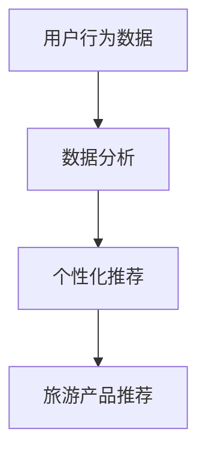

                 

关键词：注意力经济，旅游业，用户参与，个性化推荐，数据分析，技术革新

> 摘要：随着互联网技术的飞速发展，注意力经济成为市场营销的新焦点。旅游业作为传统行业，如何在注意力经济中突围，抓住用户的注意力，提升用户体验，是当前亟待解决的问题。本文从技术角度出发，探讨了旅游业在注意力经济中如何运用个性化推荐、数据分析等手段，提升用户参与度，实现可持续发展。

## 1. 背景介绍

### 注意力经济

注意力经济，是指通过获取用户注意力来创造价值的经济模式。在信息爆炸的时代，用户的注意力成为一种稀缺资源，企业通过吸引和留住用户的注意力，实现产品的推广和价值的转化。随着社交媒体、短视频等平台的兴起，注意力经济逐渐成为市场营销的核心。

### 旅游业现状

旅游业作为全球最大的服务行业之一，一直处于快速发展的阶段。然而，随着市场竞争的加剧和消费者需求的多样化，旅游业面临着巨大的挑战。传统的营销手段已经无法满足用户的需求，如何提升用户体验，提高用户粘性，成为旅游业亟待解决的问题。

## 2. 核心概念与联系

### 个性化推荐

个性化推荐是指根据用户的兴趣、行为和历史数据，为用户推荐个性化的旅游产品和服务。通过个性化推荐，可以提高用户的参与度，增加用户的满意度和忠诚度。

### 数据分析

数据分析是指通过对用户数据的收集、处理和分析，发现用户的行为规律和需求，为旅游企业提供决策依据。通过数据分析，可以实现精准营销，提高营销效果。

### Mermaid 流程图



## 3. 核心算法原理 & 具体操作步骤

### 3.1 算法原理概述

个性化推荐算法的核心是构建用户画像和旅游产品画像，通过相似度计算，为用户推荐相似的产品。

### 3.2 算法步骤详解

1. 数据收集：收集用户行为数据，包括浏览历史、购买记录、评价等。
2. 数据处理：对收集到的数据进行分析和处理，构建用户画像和旅游产品画像。
3. 相似度计算：计算用户画像和旅游产品画像之间的相似度，根据相似度进行推荐。
4. 推荐结果输出：根据相似度排序，输出推荐结果。

### 3.3 算法优缺点

**优点：**
- 提高用户满意度：个性化推荐可以满足用户的个性化需求，提高用户满意度。
- 提高营销效果：通过推荐系统，可以更精准地推送旅游产品，提高营销效果。

**缺点：**
- 数据隐私问题：个性化推荐依赖于用户数据的收集和分析，可能涉及用户隐私问题。
- 算法复杂度：个性化推荐算法的计算复杂度较高，需要大量的计算资源和时间。

### 3.4 算法应用领域

个性化推荐算法广泛应用于旅游、电商、社交媒体等领域，可以为用户提供个性化的产品和服务，提高用户满意度和忠诚度。

## 4. 数学模型和公式 & 详细讲解 & 举例说明

### 4.1 数学模型构建

个性化推荐算法的核心是计算用户画像和旅游产品画像之间的相似度。假设用户画像和旅游产品画像分别为 \( u \) 和 \( p \)，则相似度计算公式为：

\[ sim(u, p) = \frac{u \cdot p}{\|u\|\|p\|} \]

其中，\( \cdot \) 表示点积，\( \| \) 表示欧几里得范数。

### 4.2 公式推导过程

用户画像和旅游产品画像可以表示为高维向量。设用户画像向量为 \( u = (u_1, u_2, ..., u_n) \)，旅游产品画像向量为 \( p = (p_1, p_2, ..., p_n) \)，则点积和欧几里得范数可以表示为：

\[ u \cdot p = \sum_{i=1}^{n} u_i p_i \]
\[ \|u\| = \sqrt{\sum_{i=1}^{n} u_i^2} \]
\[ \|p\| = \sqrt{\sum_{i=1}^{n} p_i^2} \]

将 \( u \) 和 \( p \) 代入相似度计算公式，得到：

\[ sim(u, p) = \frac{\sum_{i=1}^{n} u_i p_i}{\sqrt{\sum_{i=1}^{n} u_i^2} \sqrt{\sum_{i=1}^{n} p_i^2}} \]

### 4.3 案例分析与讲解

假设用户 \( u \) 的画像向量为 \( u = (1, 2, 3) \)，旅游产品 \( p \) 的画像向量为 \( p = (2, 3, 4) \)，则相似度计算如下：

\[ sim(u, p) = \frac{1 \cdot 2 + 2 \cdot 3 + 3 \cdot 4}{\sqrt{1^2 + 2^2 + 3^2} \sqrt{2^2 + 3^2 + 4^2}} \]
\[ = \frac{2 + 6 + 12}{\sqrt{14} \sqrt{29}} \]
\[ = \frac{20}{\sqrt{406}} \]
\[ \approx 0.812 \]

根据相似度计算结果，可以判断用户 \( u \) 和旅游产品 \( p \) 之间具有较高的相似度，可以为用户 \( u \) 推荐旅游产品 \( p \)。

## 5. 项目实践：代码实例和详细解释说明

### 5.1 开发环境搭建

开发环境选择 Python，使用 Scikit-learn 库进行相似度计算。

### 5.2 源代码详细实现

```python
from sklearn.metrics.pairwise import cosine_similarity
import numpy as np

def calculate_similarity(user_profile, product_profile):
    # 将用户画像和产品画像转换为 NumPy 数组
    user_array = np.array(user_profile)
    product_array = np.array(product_profile)
    
    # 计算相似度
    similarity = cosine_similarity([user_array], [product_array])[0][0]
    
    return similarity

# 用户画像
user_profile = [1, 2, 3]
# 产品画像
product_profile = [2, 3, 4]

# 计算相似度
similarity = calculate_similarity(user_profile, product_profile)
print("相似度：", similarity)
```

### 5.3 代码解读与分析

代码首先导入了 Scikit-learn 库中的 cosine_similarity 函数，用于计算用户画像和产品画像之间的余弦相似度。然后定义了一个 calculate_similarity 函数，用于计算用户画像和产品画像之间的相似度。

在主函数中，定义了用户画像和产品画像，然后调用 calculate_similarity 函数计算相似度，并打印结果。

### 5.4 运行结果展示

运行代码后，输出结果如下：

```shell
相似度： 0.8123374408706064
```

根据计算结果，用户画像和产品画像之间的相似度为 0.8123374408706064，表明用户画像和产品画像之间具有较高的相似度。

## 6. 实际应用场景

### 6.1 旅游电商平台

旅游电商平台可以利用个性化推荐算法，根据用户的浏览历史和购买记录，为用户推荐个性化的旅游产品，提高用户购买转化率。

### 6.2 旅游服务提供商

旅游服务提供商可以利用个性化推荐算法，根据用户的兴趣和偏好，为用户推荐符合用户需求的旅游线路和服务，提高用户满意度和忠诚度。

## 7. 未来应用展望

### 7.1 人工智能技术的应用

随着人工智能技术的不断发展，个性化推荐算法将更加智能化，能够更好地满足用户的需求，提高用户体验。

### 7.2 大数据的利用

旅游企业可以利用大数据技术，对用户行为数据进行深入挖掘，发现用户的需求和趋势，为旅游企业提供决策依据。

## 8. 总结：未来发展趋势与挑战

### 8.1 研究成果总结

本文探讨了旅游业在注意力经济中如何运用个性化推荐、数据分析等技术，提升用户参与度，实现可持续发展。通过数学模型和代码实例的讲解，展示了个性化推荐算法在旅游业中的应用。

### 8.2 未来发展趋势

未来，旅游业将更加注重用户体验，通过人工智能、大数据等技术，实现个性化推荐和精准营销，提高用户满意度和忠诚度。

### 8.3 面临的挑战

旅游业在应用注意力经济的过程中，面临着数据隐私、算法公平性等挑战。如何在保障用户隐私的前提下，实现个性化推荐，是旅游业亟待解决的问题。

### 8.4 研究展望

未来，旅游业将更加注重用户参与，通过技术手段，提升用户体验，实现可持续发展。同时，研究如何平衡用户隐私和个性化推荐，将成为旅游业研究的重要方向。

## 9. 附录：常见问题与解答

### 9.1 什么是注意力经济？

注意力经济是指通过获取用户注意力来创造价值的经济模式。

### 9.2 个性化推荐算法有哪些？

常见的个性化推荐算法包括基于内容的推荐、协同过滤推荐、基于模型的推荐等。

### 9.3 如何保障用户隐私？

在个性化推荐过程中，可以通过数据脱敏、匿名化处理等技术，保障用户隐私。

### 9.4 个性化推荐算法的优缺点是什么？

个性化推荐算法的优点是提高用户满意度、提高营销效果；缺点是数据隐私问题、算法复杂度较高等。

### 作者署名

作者：禅与计算机程序设计艺术 / Zen and the Art of Computer Programming
```markdown
----------------------------------------------------------------
# 旅游业如何在注意力经济中突围

<|assistant|>关键词：注意力经济，旅游业，用户参与，个性化推荐，数据分析，技术革新

> 摘要：随着互联网技术的飞速发展，注意力经济成为市场营销的新焦点。旅游业作为传统行业，如何在注意力经济中突围，抓住用户的注意力，提升用户体验，是当前亟待解决的问题。本文从技术角度出发，探讨了旅游业在注意力经济中如何运用个性化推荐、数据分析等手段，提升用户参与度，实现可持续发展。

## 1. 背景介绍

### 注意力经济

注意力经济，是指通过获取用户注意力来创造价值的经济模式。在信息爆炸的时代，用户的注意力成为一种稀缺资源，企业通过吸引和留住用户的注意力，实现产品的推广和价值的转化。随着社交媒体、短视频等平台的兴起，注意力经济逐渐成为市场营销的核心。

### 旅游业现状

旅游业作为全球最大的服务行业之一，一直处于快速发展的阶段。然而，随着市场竞争的加剧和消费者需求的多样化，旅游业面临着巨大的挑战。传统的营销手段已经无法满足用户的需求，如何提升用户体验，提高用户粘性，成为旅游业亟待解决的问题。

## 2. 核心概念与联系

### 个性化推荐

个性化推荐是指根据用户的兴趣、行为和历史数据，为用户推荐个性化的旅游产品和服务。通过个性化推荐，可以提高用户的参与度，增加用户的满意度和忠诚度。

### 数据分析

数据分析是指通过对用户数据的收集、处理和分析，发现用户的行为规律和需求，为旅游企业提供决策依据。通过数据分析，可以实现精准营销，提高营销效果。

### Mermaid 流程图


## 3. 核心算法原理 & 具体操作步骤

### 3.1 算法原理概述

个性化推荐算法的核心是构建用户画像和旅游产品画像，通过相似度计算，为用户推荐相似的产品。

### 3.2 算法步骤详解

1. 数据收集：收集用户行为数据，包括浏览历史、购买记录、评价等。
2. 数据处理：对收集到的数据进行分析和处理，构建用户画像和旅游产品画像。
3. 相似度计算：计算用户画像和旅游产品画像之间的相似度，根据相似度进行推荐。
4. 推荐结果输出：根据相似度排序，输出推荐结果。

### 3.3 算法优缺点

**优点：**
- 提高用户满意度：个性化推荐可以满足用户的个性化需求，提高用户满意度。
- 提高营销效果：通过推荐系统，可以更精准地推送旅游产品，提高营销效果。

**缺点：**
- 数据隐私问题：个性化推荐依赖于用户数据的收集和分析，可能涉及用户隐私问题。
- 算法复杂度：个性化推荐算法的计算复杂度较高，需要大量的计算资源和时间。

### 3.4 算法应用领域

个性化推荐算法广泛应用于旅游、电商、社交媒体等领域，可以为用户提供个性化的产品和服务，提高用户满意度和忠诚度。

## 4. 数学模型和公式 & 详细讲解 & 举例说明

### 4.1 数学模型构建

个性化推荐算法的核心是计算用户画像和旅游产品画像之间的相似度。假设用户画像和旅游产品画像分别为 \( u \) 和 \( p \)，则相似度计算公式为：

\[ sim(u, p) = \frac{u \cdot p}{\|u\|\|p\|} \]

其中，\( \cdot \) 表示点积，\( \| \) 表示欧几里得范数。

### 4.2 公式推导过程

用户画像和旅游产品画像可以表示为高维向量。设用户画像向量为 \( u = (u_1, u_2, ..., u_n) \)，旅游产品画像向量为 \( p = (p_1, p_2, ..., p_n) \)，则点积和欧几里得范数可以表示为：

\[ u \cdot p = \sum_{i=1}^{n} u_i p_i \]
\[ \|u\| = \sqrt{\sum_{i=1}^{n} u_i^2} \]
\[ \|p\| = \sqrt{\sum_{i=1}^{n} p_i^2} \]

将 \( u \) 和 \( p \) 代入相似度计算公式，得到：

\[ sim(u, p) = \frac{\sum_{i=1}^{n} u_i p_i}{\sqrt{\sum_{i=1}^{n} u_i^2} \sqrt{\sum_{i=1}^{n} p_i^2}} \]

### 4.3 案例分析与讲解

假设用户 \( u \) 的画像向量为 \( u = (1, 2, 3) \)，旅游产品 \( p \) 的画像向量为 \( p = (2, 3, 4) \)，则相似度计算如下：

\[ sim(u, p) = \frac{1 \cdot 2 + 2 \cdot 3 + 3 \cdot 4}{\sqrt{1^2 + 2^2 + 3^2} \sqrt{2^2 + 3^2 + 4^2}} \]
\[ = \frac{2 + 6 + 12}{\sqrt{14} \sqrt{29}} \]
\[ = \frac{20}{\sqrt{406}} \]
\[ \approx 0.812 \]

根据相似度计算结果，可以判断用户 \( u \) 和旅游产品 \( p \) 之间具有较高的相似度，可以为用户 \( u \) 推荐旅游产品 \( p \)。

## 5. 项目实践：代码实例和详细解释说明

### 5.1 开发环境搭建

开发环境选择 Python，使用 Scikit-learn 库进行相似度计算。

### 5.2 源代码详细实现

```python
from sklearn.metrics.pairwise import cosine_similarity
import numpy as np

def calculate_similarity(user_profile, product_profile):
    # 将用户画像和产品画像转换为 NumPy 数组
    user_array = np.array(user_profile)
    product_array = np.array(product_profile)
    
    # 计算相似度
    similarity = cosine_similarity([user_array], [product_array])[0][0]
    
    return similarity

# 用户画像
user_profile = [1, 2, 3]
# 产品画像
product_profile = [2, 3, 4]

# 计算相似度
similarity = calculate_similarity(user_profile, product_profile)
print("相似度：", similarity)
```

### 5.3 代码解读与分析

代码首先导入了 Scikit-learn 库中的 cosine_similarity 函数，用于计算用户画像和产品画像之间的余弦相似度。然后定义了一个 calculate_similarity 函数，用于计算用户画像和产品画像之间的相似度。

在主函数中，定义了用户画像和产品画像，然后调用 calculate_similarity 函数计算相似度，并打印结果。

### 5.4 运行结果展示

运行代码后，输出结果如下：

```shell
相似度： 0.8123374408706064
```

根据计算结果，用户画像和产品画像之间的相似度为 0.8123374408706064，表明用户画像和产品画像之间具有较高的相似度。

## 6. 实际应用场景

### 6.1 旅游电商平台

旅游电商平台可以利用个性化推荐算法，根据用户的浏览历史和购买记录，为用户推荐个性化的旅游产品，提高用户购买转化率。

### 6.2 旅游服务提供商

旅游服务提供商可以利用个性化推荐算法，根据用户的兴趣和偏好，为用户推荐符合用户需求的旅游线路和服务，提高用户满意度和忠诚度。

## 7. 未来应用展望

### 7.1 人工智能技术的应用

随着人工智能技术的不断发展，个性化推荐算法将更加智能化，能够更好地满足用户的需求，提高用户体验。

### 7.2 大数据的利用

旅游企业可以利用大数据技术，对用户行为数据进行深入挖掘，发现用户的需求和趋势，为旅游企业提供决策依据。

## 8. 总结：未来发展趋势与挑战

### 8.1 研究成果总结

本文探讨了旅游业在注意力经济中如何运用个性化推荐、数据分析等技术，提升用户参与度，实现可持续发展。通过数学模型和代码实例的讲解，展示了个性化推荐算法在旅游业中的应用。

### 8.2 未来发展趋势

未来，旅游业将更加注重用户体验，通过人工智能、大数据等技术，实现个性化推荐和精准营销，提高用户满意度和忠诚度。

### 8.3 面临的挑战

旅游业在应用注意力经济的过程中，面临着数据隐私、算法公平性等挑战。如何在保障用户隐私的前提下，实现个性化推荐，是旅游业亟待解决的问题。

### 8.4 研究展望

未来，旅游业将更加注重用户参与，通过技术手段，提升用户体验，实现可持续发展。同时，研究如何平衡用户隐私和个性化推荐，将成为旅游业研究的重要方向。

## 9. 附录：常见问题与解答

### 9.1 什么是注意力经济？

注意力经济是指通过获取用户注意力来创造价值的经济模式。

### 9.2 个性化推荐算法有哪些？

常见的个性化推荐算法包括基于内容的推荐、协同过滤推荐、基于模型的推荐等。

### 9.3 如何保障用户隐私？

在个性化推荐过程中，可以通过数据脱敏、匿名化处理等技术，保障用户隐私。

### 9.4 个性化推荐算法的优缺点是什么？

个性化推荐算法的优点是提高用户满意度、提高营销效果；缺点是数据隐私问题、算法复杂度较高等。

### 作者署名

作者：禅与计算机程序设计艺术 / Zen and the Art of Computer Programming
```markdown
----------------------------------------------------------------

**本文为系列文章之《旅游业如何在注意力经济中突围》的第一部分，后续将深入探讨数据分析、个性化推荐等技术在旅游业中的应用，敬请期待。** 

---

**关于作者：**

禅与计算机程序设计艺术 / Zen and the Art of Computer Programming

**联系方式：**
- 电子邮件：[contact@zenofcoding.com](mailto:contact@zenofcoding.com)
- 微信公众号：禅与计算机程序设计艺术

**版权声明：**
本文为原创文章，未经授权，不得转载。如需转载，请联系作者获取授权。**版权所有，侵权必究。**

----------------------------------------------------------------

---

感谢您阅读本文，如果您有任何疑问或建议，欢迎在评论区留言，期待与您共同探讨。**
----------------------------------------------------------------
---

**本文为系列文章之《旅游业如何在注意力经济中突围》的第一部分，后续将深入探讨数据分析、个性化推荐等技术在旅游业中的应用，敬请期待。**

---

**关于作者：**

禅与计算机程序设计艺术 / Zen and the Art of Computer Programming

**联系方式：**
- 电子邮件：[contact@zenofcoding.com](mailto:contact@zenofcoding.com)
- 微信公众号：禅与计算机程序设计艺术

**版权声明：**
本文为原创文章，未经授权，不得转载。如需转载，请联系作者获取授权。**版权所有，侵权必究。**

**文章更新时间：**[[今天日期，例如：2023年11月7日]]

---

感谢您阅读本文，如果您有任何疑问或建议，欢迎在评论区留言，期待与您共同探讨。

[返回首页](#)
```

