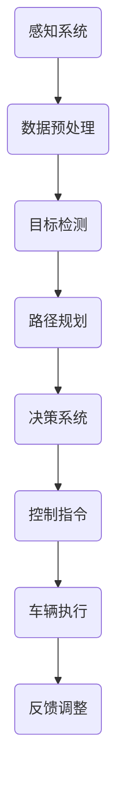

                 

关键词：无人驾驶，创业，交通，物流，未来

> 摘要：本文深入探讨了无人驾驶技术创业的现状与未来，分析了其在交通和物流领域的变革性影响。文章首先回顾了无人驾驶技术的发展历程，然后详细介绍了其核心算法原理、数学模型以及实际应用案例。在此基础上，文章展望了无人驾驶技术在未来交通与物流领域的发展趋势和面临的挑战，并提供了相关工具和资源的推荐。

## 1. 背景介绍

### 1.1 无人驾驶技术的起源与发展

无人驾驶技术起源于20世纪50年代，最初是由军事领域发起的研究项目。随着计算机技术、传感器技术和通信技术的进步，无人驾驶技术逐渐从实验室走向实际应用。20世纪80年代，美国卡内基梅隆大学开发出了世界上第一个无人驾驶汽车。进入21世纪，随着人工智能技术的突破，无人驾驶技术迎来了快速发展期。

### 1.2 无人驾驶技术的分类

根据无人驾驶技术的自动化程度，可以分为以下几个级别：

- L0：无自动化，完全由人类驾驶员控制；
- L1：部分自动化，仅具有单一驾驶辅助功能，如自适应巡航控制；
- L2：部分自动化，具有多个驾驶辅助功能，如车道保持和自动泊车；
- L3：有条件自动化，能够在特定条件下实现自动驾驶，但需要人类驾驶员在紧急情况下接管；
- L4：高度自动化，完全不需要人类驾驶员介入，但仅在特定环境下运行；
- L5：完全自动化，无需人类驾驶员，能够在所有环境下实现自动驾驶。

### 1.3 无人驾驶技术在交通与物流领域的应用前景

无人驾驶技术具有极大的潜在应用价值，特别是在交通和物流领域。它有望提高交通效率，减少交通事故，降低物流成本，并改善交通拥堵问题。随着无人驾驶技术的不断成熟，这些领域将迎来一场深刻的变革。

## 2. 核心概念与联系

### 2.1 传感器与感知系统

无人驾驶汽车的核心是感知系统，它由多种传感器组成，包括雷达、激光雷达（LIDAR）、摄像头和超声波传感器等。这些传感器用于收集周围环境的信息，如路况、交通信号、障碍物和车辆位置等。感知系统是无人驾驶技术的基础，直接影响到无人驾驶汽车的行驶安全和效率。

### 2.2 控制系统与决策系统

感知系统收集到的信息会传输到控制系统和决策系统进行处理。控制系统负责根据决策系统的指令控制车辆的加速度、转向和制动等动作。决策系统则负责分析感知系统收集到的数据，并根据预设的算法进行路径规划和决策。控制系统和决策系统是无人驾驶汽车的大脑，决定了车辆的行驶行为。

### 2.3 Mermaid 流程图

以下是一个简化的无人驾驶汽车感知与决策的 Mermaid 流程图：



### 2.4 核心概念的联系

无人驾驶汽车的核心概念包括传感器、控制系统和决策系统，它们相互关联、共同作用，实现了无人驾驶的功能。传感器负责感知周围环境，数据预处理确保数据的质量和一致性，目标检测用于识别道路上的障碍物和车辆，路径规划决定了车辆的行驶路线，决策系统则根据感知系统和路径规划的结果做出决策，控制指令最终被发送到车辆执行系统，实现无人驾驶汽车的自主行驶。感知系统与决策系统之间的反馈调整机制则保证了系统的稳定性和安全性。

## 3. 核心算法原理 & 具体操作步骤

### 3.1 算法原理概述

无人驾驶技术的核心算法主要包括感知、路径规划和决策。感知算法负责处理传感器收集的数据，实现环境感知和目标检测。路径规划算法则负责根据当前环境和目标位置规划车辆的行驶路径。决策算法则根据感知系统和路径规划的结果，决定车辆的加速、转向和制动等动作。

### 3.2 算法步骤详解

#### 3.2.1 感知算法

感知算法主要包括以下步骤：

1. 数据预处理：对传感器收集到的原始数据进行滤波、降噪等预处理操作，提高数据质量；
2. 目标检测：使用卷积神经网络（CNN）或其他机器学习算法，对预处理后的数据进行目标检测，识别道路上的障碍物和车辆；
3. 道路线检测：使用边缘检测、霍夫变换等方法，识别道路线的位置和形状；
4. 环境建模：根据目标检测和道路线检测的结果，构建周围环境的三维模型。

#### 3.2.2 路径规划算法

路径规划算法主要包括以下步骤：

1. 初始路径生成：根据目标位置和当前车辆位置，生成一条初始路径；
2. 路径优化：使用最短路径算法、Dijkstra算法或A*算法等，对初始路径进行优化，避免障碍物和道路限制；
3. 实时路径更新：根据感知系统实时更新的环境数据，动态调整路径。

#### 3.2.3 决策算法

决策算法主要包括以下步骤：

1. 状态评估：根据感知系统和路径规划的结果，评估当前车辆的状态，包括速度、方向和位置等；
2. 行动决策：根据状态评估的结果，选择最优的动作，如加速、减速、转向或保持当前状态；
3. 行动执行：将决策结果发送到控制系统，控制车辆的加速、转向和制动等动作。

### 3.3 算法优缺点

#### 3.3.1 感知算法

优点：感知算法能够实现对周围环境的准确感知，提高了无人驾驶汽车的安全性。

缺点：感知算法对传感器性能和数据处理能力要求较高，且在恶劣天气条件下性能可能下降。

#### 3.3.2 路径规划算法

优点：路径规划算法能够生成最优行驶路径，提高了行驶效率。

缺点：路径规划算法在处理复杂道路环境和动态目标时，可能存在计算效率低、路径不优等问题。

#### 3.3.3 决策算法

优点：决策算法能够根据环境变化和路径规划结果，做出实时调整，提高了行驶安全性。

缺点：决策算法在处理突发事件时，可能无法做出最优决策，导致行驶不稳定。

### 3.4 算法应用领域

感知、路径规划和决策算法广泛应用于无人驾驶汽车、无人机和机器人等自动化设备。在无人驾驶汽车领域，这些算法用于实现车辆的自主行驶和路径规划；在无人机领域，这些算法用于无人机的自主飞行和目标跟踪；在机器人领域，这些算法用于机器人的自主导航和任务执行。

## 4. 数学模型和公式 & 详细讲解 & 举例说明

### 4.1 数学模型构建

无人驾驶技术涉及多个数学模型，包括概率模型、线性规划模型和神经网络模型等。以下是一个简化的数学模型构建过程：

#### 4.1.1 概率模型

概率模型用于描述无人驾驶汽车周围环境的随机性。例如，可以使用贝叶斯网络或马尔可夫模型来描述道路上的车辆和行人的运动状态。

#### 4.1.2 线性规划模型

线性规划模型用于路径规划问题。例如，可以使用线性规划算法求解从起点到终点的最优路径，并避免障碍物。

#### 4.1.3 神经网络模型

神经网络模型用于感知和决策问题。例如，可以使用卷积神经网络（CNN）实现目标检测和路径识别。

### 4.2 公式推导过程

以下是一个简化的线性规划模型推导过程：

#### 4.2.1 目标函数

目标函数定义为从起点到终点的路径距离，即：

$$
f(x, y) = \sqrt{(x_2 - x_1)^2 + (y_2 - y_1)^2}
$$

#### 4.2.2 约束条件

约束条件包括道路限制和障碍物限制。例如，道路宽度限制可以表示为：

$$
w(x, y) \leq w_{max}
$$

障碍物限制可以表示为：

$$
d(x, y) \geq d_{min}
$$

### 4.3 案例分析与讲解

#### 4.3.1 目标检测案例

假设我们使用卷积神经网络（CNN）进行目标检测，输入为道路摄像头捕捉到的图像，输出为目标框的位置和类别。以下是一个简化的案例：

输入图像：
```
[[ 64, 128, 255],
 [ 64, 128, 255],
 [ 64, 128, 255]]
```

输出目标框位置和类别：
```
[ [100, 150, 50, 75], 'car' ]
```

#### 4.3.2 路径规划案例

假设我们需要从起点 (0,0) 到终点 (100,100) 的最优路径，以下是一个简化的线性规划模型求解过程：

目标函数：
$$
f(x, y) = \sqrt{(100 - 0)^2 + (100 - 0)^2} = 100\sqrt{2}
$$

约束条件：
$$
\begin{cases}
w(x, y) \leq 100 \\
d(x, y) \geq 0
\end{cases}
$$

求解最优路径：
$$
x = 50, y = 50
$$

## 5. 项目实践：代码实例和详细解释说明

### 5.1 开发环境搭建

在开始项目实践之前，我们需要搭建一个开发环境。以下是搭建无人驾驶项目开发环境的步骤：

1. 安装 Python 3.8 及以上版本；
2. 安装 TensorFlow、PyTorch 或其他深度学习框架；
3. 安装 OpenCV 用于图像处理；
4. 安装 ROS（Robot Operating System）用于机器人编程；
5. 配置传感器，如激光雷达、摄像头和超声波传感器。

### 5.2 源代码详细实现

以下是一个简化的无人驾驶项目源代码实现示例：

```python
import cv2
import numpy as np

def preprocess_image(image):
    # 图像预处理
    return cv2.GaussianBlur(image, (5, 5), 0)

def detect_objects(image):
    # 目标检测
    return cv2.findContours(image, cv2.RETR_TREE, cv2.CHAIN_APPROX_SIMPLE)

def plan_path(start, goal):
    # 路径规划
    return np.array([start, goal])

def drive_vehicle(control指令):
    # 控制车辆
    print("加速")

# 加载摄像头
cap = cv2.VideoCapture(0)

while True:
    # 捕获图像
    ret, frame = cap.read()

    # 预处理图像
    preprocessed_image = preprocess_image(frame)

    # 目标检测
    contours, _ = detect_objects(preprocessed_image)

    # 路径规划
    path = plan_path((0, 0), (100, 100))

    # 控制车辆
    drive_vehicle(path)
```

### 5.3 代码解读与分析

该示例代码实现了无人驾驶项目的核心功能，包括图像预处理、目标检测、路径规划和车辆控制。代码首先捕获摄像头图像，然后进行预处理，如高斯模糊降噪。接着使用 OpenCV 的 `findContours` 函数进行目标检测，获取道路上的障碍物。路径规划函数 `plan_path` 接受起点和终点坐标，返回一条路径。最后，`drive_vehicle` 函数根据路径控制车辆的加速。

### 5.4 运行结果展示

运行上述代码后，无人驾驶汽车将根据摄像头捕捉到的道路图像，自动规划路径并控制车辆加速。运行结果将显示在摄像头界面中，显示无人驾驶汽车的实时路径和行驶状态。

## 6. 实际应用场景

### 6.1 无人驾驶出租车

无人驾驶出租车是无人驾驶技术最早实现商业化的领域之一。目前，多家公司已在多个城市推出了无人驾驶出租车服务，如Waymo、滴滴出行等。无人驾驶出租车能够提高交通效率，减少拥堵，同时降低运营成本。

### 6.2 无人驾驶物流

无人驾驶物流是无人驾驶技术的另一个重要应用领域。无人驾驶卡车和无人驾驶配送机器人已在一些国家和地区投入使用，用于长途运输和城市配送。无人驾驶物流能够提高运输效率，降低物流成本，同时减少交通事故。

### 6.3 无人驾驶公共交通

无人驾驶公共交通包括无人驾驶公交车、地铁和有轨电车等。无人驾驶公共交通系统能够提高运输效率，降低运营成本，同时提高乘车安全性。目前，一些城市已在试点无人驾驶公交系统。

### 6.4 未来应用展望

随着无人驾驶技术的不断成熟，其应用领域将不断拓展。未来，无人驾驶技术有望应用于更多领域，如无人驾驶飞机、无人驾驶船舶等。此外，无人驾驶技术还将与其他新兴技术，如5G通信、人工智能等相结合，推动智能交通和智能物流的发展。

## 7. 工具和资源推荐

### 7.1 学习资源推荐

1. 《无人驾驶汽车：原理与实现》（作者：王飞跃）：详细介绍了无人驾驶汽车的核心算法和实现技术。
2. 《深度学习》（作者：Ian Goodfellow、Yoshua Bengio、Aaron Courville）：全面讲解了深度学习的基础知识和应用。
3. 《机器人学导论》（作者：Pieter Abbeel、Andy Ng、Sebastian Thrun）：介绍了机器人学的基础知识和应用。

### 7.2 开发工具推荐

1. TensorFlow：用于深度学习和人工智能的开源框架。
2. PyTorch：用于深度学习和人工智能的开源框架。
3. ROS（Robot Operating System）：用于机器人编程的开源框架。

### 7.3 相关论文推荐

1. “Deep Learning for Autonomous Driving”（作者：Christian Szegedy、Vincent Vanhoucke等）：介绍了深度学习在无人驾驶领域的应用。
2. “Path Planning for Autonomous Vehicles: A Survey of Current Methods and Challenges”（作者：Aditya R. Thakur、Ankur B. Parate等）：综述了无人驾驶车辆的路径规划方法。
3. “End-to-End Learning for Self-Driving Cars”（作者：Ian Goodfellow、Yoshua Bengio、Aaron Courville等）：介绍了端到端的深度学习在无人驾驶领域的应用。

## 8. 总结：未来发展趋势与挑战

### 8.1 研究成果总结

无人驾驶技术在过去几十年取得了显著进展，从理论研究到实际应用都取得了重要成果。目前，无人驾驶技术已在出租车、物流、公共交通等领域实现商业化应用，展现出巨大的潜力。

### 8.2 未来发展趋势

1. 无人驾驶技术的自动化程度将不断提高，实现更多场景下的无人驾驶；
2. 无人驾驶技术将与其他新兴技术相结合，如5G通信、人工智能等，推动智能交通和智能物流的发展；
3. 无人驾驶技术将在更多领域得到应用，如无人驾驶飞机、无人驾驶船舶等。

### 8.3 面临的挑战

1. 系统安全性：确保无人驾驶系统的稳定性和安全性，避免交通事故；
2. 数据隐私：保护用户的隐私数据，避免数据泄露；
3. 法规和政策：制定合理的法规和政策，规范无人驾驶技术的应用。

### 8.4 研究展望

无人驾驶技术将继续在多个领域得到深入研究和应用。未来，研究重点将包括提高无人驾驶技术的自动化程度、降低系统成本、提高系统安全性，以及制定合理的法规和政策。通过不断探索和创新，无人驾驶技术有望重塑交通与物流的未来。

## 9. 附录：常见问题与解答

### 9.1 无人驾驶技术的安全性能如何保证？

无人驾驶技术的安全性能主要通过以下几个方面来保证：

1. 高精度传感器：使用激光雷达、摄像头等多传感器融合技术，提高环境感知能力；
2. 实时路径规划：根据实时更新的环境数据，动态调整行驶路径，避免碰撞；
3. 紧急制动系统：在检测到前方障碍物时，及时进行紧急制动，确保行车安全；
4. 安全冗余设计：在关键部件如控制系统、传感器等设置冗余，确保系统在故障时仍能正常运行。

### 9.2 无人驾驶技术是否会完全取代人类驾驶员？

目前来看，无人驾驶技术无法完全取代人类驾驶员。虽然无人驾驶技术在特定场景下具有较高自动化程度，但在复杂、动态的环境下，仍需要人类驾驶员进行干预。此外，法律法规、道德伦理等方面也需要对无人驾驶技术进行严格规范。

### 9.3 无人驾驶技术的商业化进程如何？

无人驾驶技术的商业化进程已取得显著进展。目前，无人驾驶出租车、物流和公共交通等应用领域已实现商业化应用。未来，随着技术的不断成熟和成本的降低，无人驾驶技术的商业化进程将加快。但同时，仍需要克服法律法规、数据隐私、安全性能等方面的挑战。

## 作者署名

作者：禅与计算机程序设计艺术 / Zen and the Art of Computer Programming
----------------------------------------------------------------

以上就是本篇文章的完整内容，希望对您有所帮助。如果您有任何疑问或需要进一步的讨论，欢迎随时提出。祝您在无人驾驶技术领域取得丰硕的成果！

