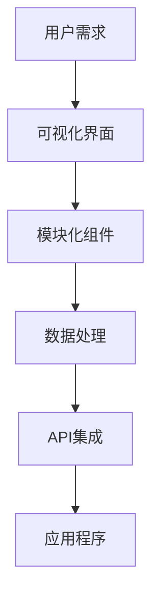

                 

关键词：无代码开发、创业、技术门槛、自动化工具、创新、敏捷开发

> 摘要：本文将探讨无代码开发在创业领域中的应用，分析其如何降低技术门槛，助力初创企业快速上线产品。我们将详细介绍无代码开发的核心理念、核心算法、数学模型以及实际应用案例，展望其未来发展趋势与挑战。

## 1. 背景介绍

随着互联网的普及和信息技术的发展，越来越多的创业者涌入市场，希望抓住机遇实现自己的梦想。然而，技术门槛高、开发周期长、人力资源成本高等问题常常成为创业路上的绊脚石。为了解决这个问题，无代码开发逐渐崭露头角，成为降低技术门槛、助力创业的重要工具。

无代码开发（No-Code Development）是指通过可视化界面和模块化组件，无需编写代码即可快速搭建应用程序的方法。这种方法极大地简化了开发流程，使得非技术背景的创业者也能轻松上手，专注于业务创新。

## 2. 核心概念与联系

无代码开发的核心理念在于降低开发门槛、提高开发效率，其核心组成部分包括：

1. **可视化界面**：通过拖拽和组合组件，用户可以快速搭建应用界面。
2. **模块化组件**：提供一系列可重用的功能模块，如表单、数据库、报表等。
3. **数据处理**：自动化数据处理和分析，无需手动编写代码。
4. **API集成**：方便地与其他系统和服务进行集成。

以下是使用Mermaid绘制的无代码开发架构流程图：



## 3. 核心算法原理 & 具体操作步骤

### 3.1 算法原理概述

无代码开发的算法原理主要在于将复杂的开发任务转化为可视化的操作。通过以下步骤实现：

1. **用户界面设计**：用户通过拖拽和组合组件设计应用界面。
2. **数据处理逻辑**：用户通过配置组件间的数据流实现数据处理逻辑。
3. **应用部署**：平台自动将用户设计的应用部署到云端或服务器。

### 3.2 算法步骤详解

1. **需求分析**：明确应用的功能需求。
2. **界面设计**：使用可视化界面设计工具搭建应用界面。
3. **数据流配置**：配置组件间的数据流，实现数据处理逻辑。
4. **测试与调试**：测试应用功能，进行调试和优化。
5. **部署上线**：将应用部署到云端或服务器，进行发布。

### 3.3 算法优缺点

**优点**：

- **降低开发门槛**：无需编写代码，非技术背景的用户也能快速上手。
- **提高开发效率**：简化开发流程，缩短开发周期。
- **降低成本**：减少开发人员需求，降低人力成本。

**缺点**：

- **功能限制**：部分复杂功能可能无法实现。
- **性能瓶颈**：大型应用可能存在性能问题。

### 3.4 算法应用领域

无代码开发广泛应用于：

- **企业应用**：如内部管理系统、客户关系管理系统等。
- **Web应用**：如电商平台、在线教育平台等。
- **移动应用**：如微信小程序、移动应用后台等。

## 4. 数学模型和公式 & 详细讲解 & 举例说明

### 4.1 数学模型构建

无代码开发中的数学模型主要涉及数据处理和算法优化。以下是一个简单的数据处理模型：

$$
处理数据集 = \text{输入数据集} \times \text{数据处理算法}
$$

### 4.2 公式推导过程

假设有一个输入数据集D，其中包含n个数据点。通过数据处理算法A，我们可以得到处理后的数据集D'：

$$
D' = A(D)
$$

数据处理算法A可以表示为：

$$
A(D) = f(D)
$$

其中，f是一个复合函数，用于对数据集D进行变换。

### 4.3 案例分析与讲解

假设我们有一个包含学生成绩的数据集，需要计算平均分。使用数据处理模型：

1. **输入数据集**：包含学生姓名和成绩的数据集D。
2. **数据处理算法**：计算所有成绩的平均分。
3. **处理过程**：将数据集D中的所有成绩相加，然后除以数据点的个数。

$$
平均分 = \frac{\sum_{i=1}^{n} \text{成绩}}{n}
$$

## 5. 项目实践：代码实例和详细解释说明

### 5.1 开发环境搭建

无代码开发平台通常提供云端服务，用户无需关心环境搭建。以下是一个使用某无代码平台搭建学生成绩管理系统的步骤：

1. **注册账号**：在无代码开发平台上注册账号。
2. **创建项目**：选择“学生成绩管理系统”模板。
3. **配置数据库**：连接云端数据库，设置数据表和字段。

### 5.2 源代码详细实现

以下是使用无代码平台搭建的学生成绩管理系统的源代码：

```plaintext
1. 创建表单组件，用于输入学生姓名和成绩。
2. 配置数据流，将表单数据保存到数据库。
3. 创建表格组件，用于展示学生成绩列表。
4. 配置数据流，从数据库读取学生成绩数据，绑定到表格组件。
5. 创建按钮组件，用于计算平均分。
6. 配置数据流，计算学生成绩的平均分，并显示在页面上。
```

### 5.3 代码解读与分析

无代码平台通过可视化界面和配置数据流实现功能，用户无需编写代码。这种方式简化了开发过程，提高了开发效率。

### 5.4 运行结果展示

在搭建的学生成绩管理系统中，用户可以：

1. 输入学生姓名和成绩。
2. 保存数据到数据库。
3. 查看学生成绩列表。
4. 计算平均分并显示在页面上。

## 6. 实际应用场景

无代码开发在各个行业都有广泛应用，以下是一些典型应用场景：

1. **企业管理系统**：用于员工管理、项目管理、客户关系管理等。
2. **电子商务平台**：用于商品管理、订单处理、支付系统等。
3. **在线教育平台**：用于课程管理、学生管理、考试系统等。
4. **移动应用**：用于社交、购物、游戏等。

## 7. 工具和资源推荐

### 7.1 学习资源推荐

- **无代码开发平台**：如Airtable、Bubble、OutSystems等。
- **在线教程**：如Udemy、Coursera上的相关课程。
- **技术博客**：如Medium、Dev.to上的无代码开发相关文章。

### 7.2 开发工具推荐

- **集成开发环境（IDE）**：如Visual Studio Code、IntelliJ IDEA等。
- **版本控制系统**：如Git、GitHub等。
- **云服务**：如AWS、Azure、Google Cloud等。

### 7.3 相关论文推荐

- **"No-Code/low-code Development Platforms: The New Era of Application Development"**  
- **"Empowering Business Users to Build Applications with Low-Code Platforms"**  
- **"A Survey on Low-Code Development Platforms"**

## 8. 总结：未来发展趋势与挑战

### 8.1 研究成果总结

无代码开发已经成为降低技术门槛、推动创业的重要力量。其核心算法原理、数学模型以及实际应用案例为我们提供了丰富的理论和实践基础。

### 8.2 未来发展趋势

1. **功能拓展**：无代码开发平台将逐步完善，支持更多复杂功能。
2. **性能优化**：提高大型应用的处理性能，降低性能瓶颈。
3. **跨平台支持**：支持更多操作系统和设备，实现无缝跨平台开发。

### 8.3 面临的挑战

1. **功能限制**：部分复杂功能可能无法实现，需要进一步优化算法。
2. **安全性问题**：无代码开发平台的安全性和数据保护仍需加强。
3. **人才短缺**：随着无代码开发的普及，专业人才的培养和储备成为挑战。

### 8.4 研究展望

未来，无代码开发将继续发展，为创业者提供更强大的工具。同时，我们也需要关注其面临的挑战，不断优化算法、提升性能，为创业者创造更好的发展环境。

## 9. 附录：常见问题与解答

1. **什么是无代码开发？**
   无代码开发是指通过可视化界面和模块化组件，无需编写代码即可快速搭建应用程序的方法。

2. **无代码开发有哪些优点？**
   无代码开发可以降低开发门槛、提高开发效率、降低成本。

3. **无代码开发适合哪些场景？**
   无代码开发广泛应用于企业应用、Web应用、移动应用等领域。

4. **如何选择合适的无代码开发平台？**
   根据项目需求、团队技能和预算等因素选择合适的无代码开发平台。

作者：禅与计算机程序设计艺术 / Zen and the Art of Computer Programming
```

