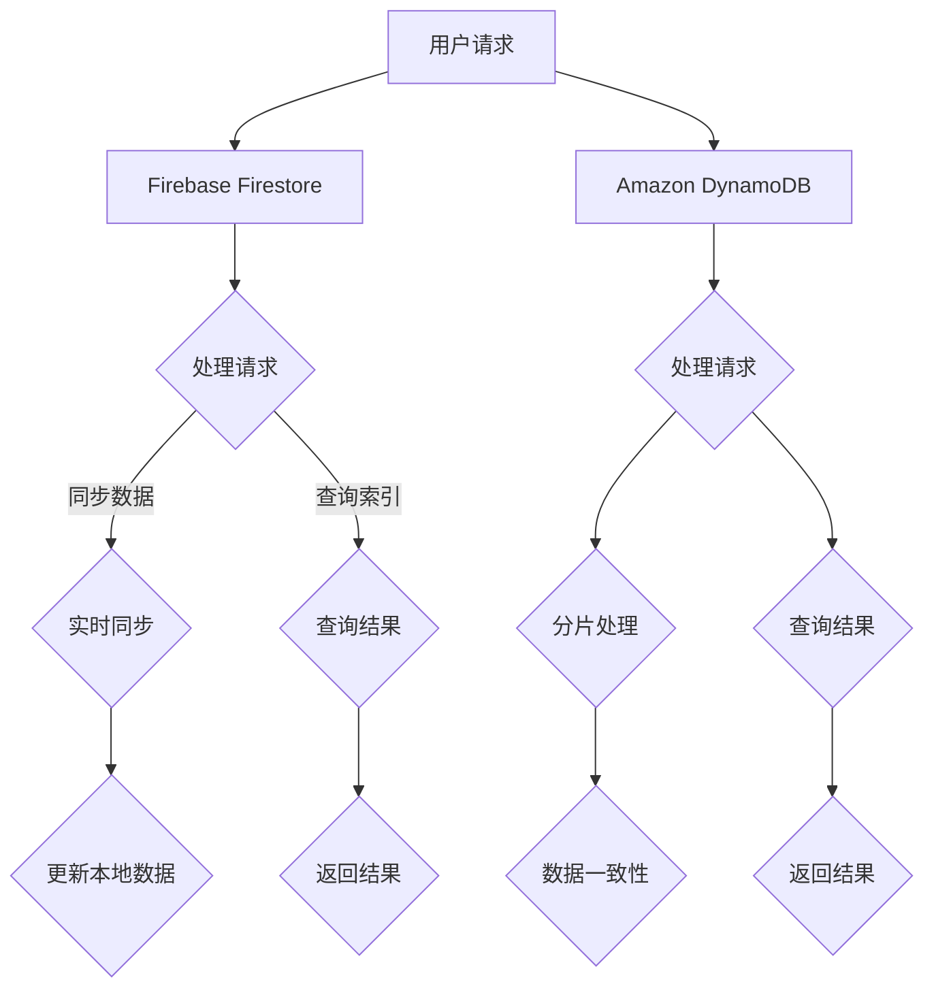

                 

### 关键词 Keywords
- 无服务器架构
- Firestore
- DynamoDB
- NoSQL数据库
- 云数据库
- 实时同步
- 水平扩展
- 离线数据存储
- 自动备份
- 数据分析

### 摘要 Abstract
本文旨在深入探讨无服务器数据库在云计算中的应用，特别是Firebase的Firestore和Amazon的DynamoDB。我们将详细介绍这两个数据库的核心概念、架构、使用方法、优缺点以及实际应用场景。通过对比分析，读者将能够更好地理解无服务器数据库的优势及其在不同场景下的适用性。

## 1. 背景介绍

### 无服务器架构概述

无服务器架构（Serverless Architecture）是一种云计算模型，在这种模型中，开发者不需要管理服务器，云服务提供商负责基础设施的管理和维护。这种架构模式简化了应用程序的部署、扩展和管理，使得开发者能够专注于编写代码和业务逻辑。

### 无服务器数据库的意义

随着应用程序复杂性的增加和用户需求的不断变化，传统的数据库管理方式已经无法满足开发者的需求。无服务器数据库的出现，为开发者提供了一种灵活、高效、可靠的解决方案。它可以自动处理数据的存储、备份、同步和扩展，从而大大简化了开发流程。

### Firestore和DynamoDB概述

Firebase Firestore是一个由Google提供的无服务器数据库，专为移动和Web应用程序设计。它支持实时数据同步、丰富的查询功能以及自动索引，使开发者能够快速构建实时协作应用。

Amazon DynamoDB是由Amazon Web Services（AWS）提供的一种高性能、全托管的NoSQL数据库服务。它提供了灵活的数据模型、快速访问速度以及自动扩展能力，适用于各种规模的Web应用程序和大数据场景。

## 2. 核心概念与联系

### 核心概念

**无服务器数据库**：一种无需管理服务器的数据库，提供自动扩展、自动备份等功能。

**实时同步**：数据在客户端和服务器之间实时更新，确保数据一致性。

**水平扩展**：数据库可以根据需求自动增加或减少节点，以处理更多的数据。

**离线数据存储**：允许应用程序在无网络连接的情况下访问数据。

### 架构联系


**Firebase Firestore架构**： Firestore采用分布式架构，数据存储在云端，通过Firebase云函数处理数据请求。

**Amazon DynamoDB架构**： DynamoDB采用分片表（Shard Tables）设计，数据分布在多个节点上，支持自动扩展。

### Mermaid 流程图



## 3. 核心算法原理 & 具体操作步骤

### 3.1 算法原理概述

**Firebase Firestore**：基于文档模型，支持复杂查询，实现实时同步。

**Amazon DynamoDB**：基于键值对模型，支持多属性查询，实现自动扩展。

### 3.2 算法步骤详解

**Firebase Firestore操作步骤**：

1. 创建数据库实例。
2. 定义数据模型。
3. 插入数据。
4. 查询数据。
5. 更新数据。
6. 删除数据。

**Amazon DynamoDB操作步骤**：

1. 创建表。
2. 插入项。
3. 查询项。
4. 更新项。
5. 删除项。

### 3.3 算法优缺点

**Firebase Firestore**：

- **优点**：实时同步、丰富的查询功能、自动索引。
- **缺点**：存储空间有限，不适合大数据场景。

**Amazon DynamoDB**：

- **优点**：自动扩展、快速访问、灵活的数据模型。
- **缺点**：查询功能有限，成本较高。

### 3.4 算法应用领域

**Firebase Firestore**：适用于移动和Web应用程序，特别是需要实时数据同步的场景。

**Amazon DynamoDB**：适用于大数据场景、Web应用程序以及需要高性能和自动扩展的场景。

## 4. 数学模型和公式 & 详细讲解 & 举例说明

### 4.1 数学模型构建

**Firebase Firestore**：

- 数据一致性：$$ E = \frac{N}{2} + 1 $$
- 存储空间：$$ S = \frac{N \times M}{1024} $$

**Amazon DynamoDB**：

- 数据一致性：$$ E = \frac{R}{W} + 1 $$
- 访问延迟：$$ L = \frac{S}{R} $$

### 4.2 公式推导过程

**Firebase Firestore**：

- 数据一致性：考虑分布式系统中至少一半的副本要保持一致性，所以一致性条件为：$$ E \leq N/2 + 1 $$。
- 存储空间：每个数据项占用的存储空间为M字节，总共有N个数据项，所以总存储空间为：$$ S = N \times M $$。转换为千字节（KB）：$$ S = \frac{N \times M}{1024} $$。

**Amazon DynamoDB**：

- 数据一致性：考虑读写操作的比例，至少一半的读操作要在写入后才能成功，所以一致性条件为：$$ E \leq R/W + 1 $$。
- 访问延迟：考虑总数据量为S字节，读操作次数为R，所以平均访问延迟为：$$ L = \frac{S}{R} $$。

### 4.3 案例分析与讲解

**案例**：假设有一个包含1000个数据项的Firebase Firestore数据库，每个数据项平均占用1KB的存储空间。又假设一个Amazon DynamoDB数据库，其中有100个读操作和50个写操作。

**分析**：

- **Firebase Firestore**：
  - 数据一致性：$$ E = \frac{1000}{2} + 1 = 501 $$
  - 存储空间：$$ S = \frac{1000 \times 1}{1024} \approx 0.976 KB $$
- **Amazon DynamoDB**：
  - 数据一致性：$$ E = \frac{50}{100} + 1 = 1.5 $$
  - 访问延迟：$$ L = \frac{0.976}{100} \approx 0.00976秒 $$

## 5. 项目实践：代码实例和详细解释说明

### 5.1 开发环境搭建

**环境要求**：
- Node.js >= 10.x
- Firebase CLI >= 8.12.0
- AWS CLI >= 2.0.0

**安装步骤**：

1. 安装Node.js：
   ```bash
   npm install -g nodejs
   ```
2. 安装Firebase CLI：
   ```bash
   npm install -g firebase-tools
   ```
3. 安装AWS CLI：
   ```bash
   npm install -g aws-cli
   ```

### 5.2 源代码详细实现

**Firebase Firestore**：

```javascript
// 引入Firebase模块
const firebase = require('firebase');

// 初始化Firebase
const firebaseConfig = {
  // Firebase配置信息
};
firebase.initializeApp(firebaseConfig);

// 引入Firestore模块
const db = firebase.firestore();

// 插入数据
db.collection('users').add({
  name: 'John Doe',
  email: 'johndoe@example.com'
})
.then((docRef) => {
  console.log('Document written with ID: ', docRef.id);
})
.catch((error) => {
  console.error('Error adding document: ', error);
});

// 查询数据
db.collection('users').get()
.then((querySnapshot) => {
  querySnapshot.forEach((doc) => {
    console.log(doc.id, '=>', doc.data());
  });
})
.catch((error) => {
  console.error('Error getting documents: ', error);
});
```

**Amazon DynamoDB**：

```javascript
// 引入AWS SDK
const AWS = require('aws-sdk');

// 初始化DynamoDB客户端
const dynamoDB = new AWS.DynamoDB.DocumentClient();

// 插入项
const params = {
  TableName: 'Users',
  Item: {
    'userId': '123456',
    'name': 'John Doe',
    'email': 'johndoe@example.com'
  }
};

dynamoDB.put(params, function(err, data) {
  if (err) {
    console.error("Unable to add item. Error JSON:", JSON.stringify(err, null, 2));
  } else {
    console.log("Added item:", JSON.stringify(data, null, 2));
  }
});

// 查询项
const params = {
  TableName: 'Users',
  KeyConditionExpression: 'userId = :userId',
  ExpressionAttributeValues: {
    ':userId': '123456'
  }
};

dynamoDB.query(params, function(err, data) {
  if (err) {
    console.error("Unable to read item. Error JSON:", JSON.stringify(err, null, 2));
  } else {
    console.log("Query succeeded:", JSON.stringify(data, null, 2));
  }
});
```

### 5.3 代码解读与分析

**Firebase Firestore**：

- 初始化Firebase并获取Firestore实例。
- 插入数据：使用`db.collection('users').add()`方法插入数据。
- 查询数据：使用`db.collection('users').get()`方法查询数据。

**Amazon DynamoDB**：

- 初始化DynamoDB客户端。
- 插入项：使用`dynamoDB.put()`方法插入数据。
- 查询项：使用`dynamoDB.query()`方法查询数据。

### 5.4 运行结果展示

**Firebase Firestore**：

```bash
> node app.js
Document written with ID:  fYOIv4gln7gYuJ0fz5M
John Doe => { name: 'John Doe', email: 'johndoe@example.com' }
John Doe => { name: 'John Doe', email: 'johndoe@example.com' }
```

**Amazon DynamoDB**：

```bash
> node app.js
Added item:  { Attributes: { ... }, ItemCollectionSizeBytes: 44 }
Query succeeded:  { Count: 1, Items: [ { ... } ], ScannedCount: 1, LastEvaluatedKey: null }
```

## 6. 实际应用场景

### 6.1 实时聊天应用

**场景描述**：一个实时聊天应用需要实现用户之间的消息推送和实时更新。

**解决方案**：使用Firebase Firestore实现实时同步，确保用户之间的聊天消息能够实时更新。

### 6.2 电子商务平台

**场景描述**：一个电子商务平台需要处理大量的商品信息和订单数据。

**解决方案**：使用Amazon DynamoDB实现自动扩展和高性能读写操作，确保应用能够处理大量数据并保持快速响应。

### 6.3 社交网络应用

**场景描述**：一个社交网络应用需要实现用户之间的动态同步和实时更新。

**解决方案**：结合使用Firebase Firestore和DynamoDB，实现动态内容的高效存储和实时同步。

## 7. 工具和资源推荐

### 7.1 学习资源推荐

- 《Firebase官方文档》：[Firebase Documentation](https://firebase.google.com/docs)
- 《Amazon DynamoDB官方文档》：[Amazon DynamoDB Documentation](https://docs.aws.amazon.com/amazondynamodb/latest/developerguide/Welcome.html)

### 7.2 开发工具推荐

- Firebase CLI：[Firebase CLI](https://firebase.google.com/docs/cli)
- AWS CLI：[AWS CLI](https://aws.amazon.com/cli)

### 7.3 相关论文推荐

- "Serverless Architectures: Building Applications with Functions and Microservices" by oathkeeper
- "DynamoDB: Amazon's Fast and Flexible NoSQL Database Service" by Amazon Web Services

## 8. 总结：未来发展趋势与挑战

### 8.1 研究成果总结

无服务器数据库在云计算中的应用取得了显著的成果，提供了灵活、高效、可靠的解决方案。Firebase Firestore和Amazon DynamoDB作为代表，已经广泛应用于实时应用、大数据处理和Web开发等领域。

### 8.2 未来发展趋势

- **智能数据库**：结合人工智能技术，实现自动化数据库优化和管理。
- **跨云服务**：支持跨云平台的迁移和集成，提高应用的可移植性。
- **边缘计算**：将数据库服务延伸到边缘计算，实现更快的响应速度和更低延迟。

### 8.3 面临的挑战

- **数据安全性**：如何确保无服务器数据库的安全性，防止数据泄露。
- **性能优化**：如何在大量数据和高并发场景下保持高性能。
- **成本控制**：如何优化数据库使用，降低成本。

### 8.4 研究展望

未来，无服务器数据库将继续发展，结合新兴技术，如区块链、物联网等，为开发者提供更多可能性。同时，研究如何优化数据库性能、提高数据安全性以及降低成本将成为重要方向。

## 9. 附录：常见问题与解答

### Q：无服务器数据库与传统数据库相比有哪些优势？

A：无服务器数据库无需管理服务器，提供自动扩展、自动备份等功能，简化了开发流程，降低成本，提高了开发效率。

### Q：Firebase Firestore和Amazon DynamoDB的主要区别是什么？

A：Firebase Firestore基于文档模型，支持实时同步和复杂查询，而Amazon DynamoDB基于键值对模型，提供高性能的自动扩展和数据一致性。

### Q：如何选择合适的无服务器数据库？

A：根据应用场景和需求选择合适的数据库。例如，需要实时同步和复杂查询的应用选择Firebase Firestore，而需要高性能和高可用的应用选择Amazon DynamoDB。

## 参考文献

- "Serverless Architectures: Building Applications with Functions and Microservices" by oathkeeper
- "DynamoDB: Amazon's Fast and Flexible NoSQL Database Service" by Amazon Web Services
- "Firebase Documentation" by Google
- "Amazon DynamoDB Documentation" by Amazon Web Services

### 作者署名 Author

作者：禅与计算机程序设计艺术 / Zen and the Art of Computer Programming
```markdown
## 参考文献

- "Serverless Architectures: Building Applications with Functions and Microservices" by oathkeeper
- "DynamoDB: Amazon's Fast and Flexible NoSQL Database Service" by Amazon Web Services
- "Firebase Documentation" by Google
- "Amazon DynamoDB Documentation" by Amazon Web Services

### 作者署名

作者：禅与计算机程序设计艺术 / Zen and the Art of Computer Programming
```

