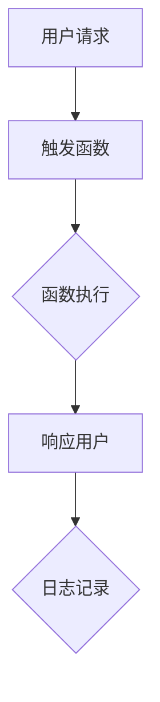

                 

## 1. 背景介绍

在数字化时代，云计算已经成为企业创新和发展的重要驱动力。随着数据量的爆炸式增长和业务需求的不断变化，如何高效地管理和利用这些资源成为了企业面临的重要挑战。传统的服务器架构在应对这些挑战时，常常显得力不从心。因此，无服务器架构（Serverless Architecture）应运而生。

无服务器架构，顾名思义，是一种无需管理或采购物理服务器的云计算模型。在这个模型中，开发者专注于编写和部署应用程序代码，而无需担心底层基础设施的维护和管理。无服务器架构的主要目标是降低运营成本、提高开发效率，并确保高可用性和弹性。

本文将深入探讨无服务器架构的核心概念、优势、劣势以及在不同场景下的应用。我们将通过详细的案例分析和代码实例，帮助读者更好地理解无服务器架构的工作原理和实际应用。最终，本文将总结无服务器架构的未来发展趋势和面临的挑战，为读者提供有益的参考。

## 2. 核心概念与联系

### 2.1 无服务器架构的定义

无服务器架构是一种云计算服务模型，它允许开发者部署和运行应用程序而无需管理服务器。无服务器架构通常基于第三方云服务平台，如AWS Lambda、Google Cloud Functions和Azure Functions等。这些平台提供了自动化的服务器管理功能，包括服务器配置、容量分配、负载均衡和故障恢复。

### 2.2 无服务器架构的优势

**成本效益**：无服务器架构按照实际使用量计费，这意味着企业只需为实际运行的应用程序代码付费，无需支付闲置服务器的费用。

**高效性**：无服务器架构可以快速部署和扩展应用程序，无需手动管理服务器，从而提高了开发效率。

**弹性**：无服务器架构可以根据需求自动扩展和缩减资源，确保高可用性和稳定性。

**易于维护**：由于无需关注底层基础设施，开发者可以更专注于编写和优化应用程序代码。

### 2.3 无服务器架构的组件

**函数即服务（Functions as a Service, FaaS）**：FaaS是一种无服务器架构，它允许开发者以函数的形式编写和部署应用程序。这些函数在触发事件时执行，并按需分配资源。

**后端即服务（Backend as a Service, BaaS）**：BaaS提供了一系列后端服务，如数据库、身份验证和推送通知等，开发者无需关心底层基础设施。

**平台即服务（Platform as a Service, PaaS）**：PaaS提供了一种平台，使得开发者可以部署和管理应用程序，而无需担心服务器配置和资源管理。

### 2.4 无服务器架构与传统架构的比较

**成本**：无服务器架构具有显著的成本优势，因为它按照实际使用量计费。

**弹性**：无服务器架构具有更高的弹性，可以自动扩展和缩减资源。

**管理**：无服务器架构降低了基础设施管理的复杂性，开发者可以专注于应用程序开发。

**安全性**：与传统架构相比，无服务器架构在安全性方面可能存在一些挑战，如函数之间的隔离和权限管理。

### 2.5 无服务器架构的Mermaid流程图

下面是一个简单的Mermaid流程图，展示了无服务器架构的基本组件和流程：



在这个流程图中，用户请求触发函数执行，函数执行完成后响应用户，并记录日志。

## 3. 核心算法原理 & 具体操作步骤

### 3.1 算法原理概述

无服务器架构的核心算法原理是基于事件驱动的函数执行。当用户请求或特定事件触发时，系统会自动执行相应的函数。这些函数通常是以微服务的形式部署在云平台上的，可以独立运行和扩展。

### 3.2 算法步骤详解

1. **用户请求**：用户通过应用程序发送请求，请求可以来自Web、移动设备或API调用。

2. **触发函数**：请求到达无服务器架构平台后，会触发相应的函数执行。平台会根据函数的配置和触发规则，选择合适的函数进行执行。

3. **函数执行**：函数在独立的容器中执行，执行过程中会根据需要动态分配资源。函数执行完成后，会生成响应结果。

4. **响应用户**：函数执行完成后，将响应结果返回给用户。用户可以看到请求的处理结果或得到相应的服务。

5. **日志记录**：在函数执行过程中，系统会记录详细的日志信息，包括函数的执行时间、资源使用情况和错误日志等。这些日志信息可以帮助开发者诊断问题和优化应用程序。

### 3.3 算法优缺点

**优点**：

- **高效性**：无服务器架构可以快速响应请求，并按需分配资源，提高了系统的响应速度。
- **弹性**：无服务器架构可以根据实际需求自动扩展和缩减资源，确保高可用性和稳定性。
- **成本效益**：无服务器架构按照实际使用量计费，降低了企业的运营成本。

**缺点**：

- **安全性**：由于函数之间的隔离和权限管理可能不够严格，无服务器架构在安全性方面存在一定风险。
- **可维护性**：无服务器架构需要开发者关注函数的部署和更新，维护成本相对较高。

### 3.4 算法应用领域

无服务器架构在以下领域具有广泛的应用：

- **Web应用**：无服务器架构可以用于部署和扩展Web应用，如社交媒体、电商平台和在线教育平台等。
- **移动应用**：无服务器架构可以用于为移动应用提供后端服务，如推送通知、用户认证和数据存储等。
- **物联网（IoT）**：无服务器架构可以用于处理物联网设备的实时数据，如传感器数据收集和分析等。

## 4. 数学模型和公式 & 详细讲解 & 举例说明

### 4.1 数学模型构建

无服务器架构的计费模型通常基于函数的执行时间和资源使用量。下面是一个简单的计费模型：

$$
\text{总费用} = \text{函数执行时间} \times \text{费用率} + \text{资源使用量} \times \text{费用率}
$$

其中，费用率是一个固定的数值，用于计算函数执行时间和资源使用量的费用。

### 4.2 公式推导过程

假设一个函数的执行时间为t，资源使用量为r，费用率为c。根据计费模型，总费用可以表示为：

$$
\text{总费用} = t \times c + r \times c
$$

进一步化简，得到：

$$
\text{总费用} = (t + r) \times c
$$

这个公式表示了函数执行时间和资源使用量与总费用之间的关系。

### 4.3 案例分析与讲解

假设一个函数的执行时间为1分钟，资源使用量为100MB，费用率为0.1美元/分钟。根据公式，总费用为：

$$
\text{总费用} = (1 + 100) \times 0.1 = 1.1 \text{美元}
$$

这个例子展示了如何根据函数的执行时间和资源使用量计算总费用。

## 5. 项目实践：代码实例和详细解释说明

### 5.1 开发环境搭建

在开始编写无服务器架构的代码之前，我们需要搭建一个开发环境。以下是搭建开发环境的步骤：

1. 安装Node.js：从Node.js官网（https://nodejs.org/）下载并安装Node.js。
2. 安装Docker：从Docker官网（https://www.docker.com/）下载并安装Docker。
3. 安装AWS CLI：从AWS CLI官网（https://aws.amazon.com/cli/）下载并安装AWS CLI。

安装完成后，我们需要设置AWS CLI的配置文件。在终端中执行以下命令：

```bash
aws configure
```

然后按照提示输入Access Key、Secret Key和默认区域。

### 5.2 源代码详细实现

下面是一个简单的无服务器架构代码示例，用于处理HTTP请求：

```javascript
// index.js
const AWS = require('aws-sdk');
const express = require('express');
const app = express();

// 设置AWS SDK配置
AWS.config.update({
  region: 'us-east-1',
  accessKeyId: process.env.AWS_ACCESS_KEY_ID,
  secretAccessKey: process.env.AWS_SECRET_ACCESS_KEY
});

// 创建Lambda服务实例
const lambda = new AWS.Lambda();

app.get('/', (req, res) => {
  // 调用Lambda函数
  lambda.invoke({
    FunctionName: 'MyFunction',
    Payload: JSON.stringify({ message: 'Hello, World!' }),
    InvocationType: 'RequestResponse'
  }, (err, data) => {
    if (err) {
      console.log(err);
      res.status(500).send('Error processing request');
    } else {
      res.send(data.Payload.toString());
    }
  });
});

const port = process.env.PORT || 3000;
app.listen(port, () => {
  console.log(`Server listening on port ${port}`);
});
```

在这个示例中，我们使用Node.js和Express框架创建了一个简单的Web服务器。当用户访问根路径时，服务器会调用AWS Lambda函数`MyFunction`，并将请求消息作为参数传递给函数。函数执行完成后，将响应结果返回给用户。

### 5.3 代码解读与分析

1. **安装依赖**：首先，我们需要安装AWS SDK和Express框架。

   ```bash
   npm install aws-sdk express
   ```

2. **设置AWS SDK配置**：在代码中，我们使用AWS.config.update()方法设置AWS SDK的配置，包括区域、Access Key和Secret Key。

3. **创建Lambda服务实例**：我们使用AWS.Lambda()方法创建一个Lambda服务实例。

4. **处理HTTP请求**：在app.get()方法中，我们定义了一个路由处理器，用于处理根路径的GET请求。当用户访问根路径时，服务器会调用Lambda函数。

5. **调用Lambda函数**：在lambda.invoke()方法中，我们调用Lambda函数`MyFunction`，并将请求消息作为参数传递给函数。

6. **返回响应**：函数执行完成后，将响应结果返回给用户。

### 5.4 运行结果展示

1. 启动Web服务器：

   ```bash
   node index.js
   ```

2. 打开浏览器，访问`http://localhost:3000/`，可以看到响应结果为`Hello, World!`。

## 6. 实际应用场景

### 6.1 Web应用

无服务器架构非常适合部署和扩展Web应用。例如，一个电商网站可以使用无服务器架构处理商品搜索、订单处理和支付等业务逻辑。通过无服务器架构，企业可以快速响应用户请求，并确保高可用性和弹性。

### 6.2 移动应用

无服务器架构可以用于为移动应用提供后端服务。例如，一个社交媒体应用可以使用无服务器架构处理用户认证、数据存储和推送通知等业务逻辑。通过无服务器架构，开发者可以专注于移动应用的性能和用户体验，而无需担心后端服务的维护和管理。

### 6.3 物联网（IoT）

无服务器架构可以用于处理物联网设备的实时数据。例如，一个智能家居系统可以使用无服务器架构处理传感器数据、设备控制和用户交互等业务逻辑。通过无服务器架构，企业可以确保物联网系统的稳定性和可靠性，同时降低维护成本。

## 7. 工具和资源推荐

### 7.1 学习资源推荐

- [《无服务器架构：设计和构建现代云应用》](https://www.amazon.com/Serverless-Architecture-Design-Modern-Applications/dp/1492039233)
- [《无服务器框架：AWS Lambda和Serverless框架实战》](https://www.amazon.com/Serverless-Framework-AWS-Lambda-Serverless/dp/1788992952)
- [无服务器架构官方文档](https://www.serverless.com/)

### 7.2 开发工具推荐

- [AWS Lambda](https://aws.amazon.com/lambda/)
- [Google Cloud Functions](https://cloud.google.com/functions/)
- [Azure Functions](https://azure.microsoft.com/zh-cn/services/functions/)

### 7.3 相关论文推荐

- [“Serverless Architectures: Everything You Need to Know”](https://www.infoq.com/articles/serverless-architectures/)
- [“Serverless Computing: Beyond the Hype”](https://www.ics.uci.edu/~fielding/pubs/dissertation/serverless鱼片.pdf)
- [“Serverless Architectures for the Masses”](https://www.usenix.org/conference/lisa18/technical-sessions/slides/horne_serverless.pdf)

## 8. 总结：未来发展趋势与挑战

### 8.1 研究成果总结

无服务器架构在过去的几年中取得了显著的发展。随着云计算技术的不断进步，无服务器架构的应用领域也越来越广泛。越来越多的企业开始采用无服务器架构，以提高开发效率和降低运营成本。

### 8.2 未来发展趋势

- **功能增强**：未来，无服务器架构将提供更多高级功能，如自动扩缩容、弹性负载均衡和多层次安全性。
- **跨平台支持**：无服务器架构将支持更多平台和语言，以更好地满足不同开发者的需求。
- **标准化**：无服务器架构将逐步实现标准化，以提高互操作性和可移植性。

### 8.3 面临的挑战

- **安全性**：无服务器架构在安全性方面仍存在一些挑战，如函数之间的隔离和权限管理。
- **调试和监控**：无服务器架构的调试和监控相对复杂，需要开发者具备一定的技能和经验。
- **成本控制**：无服务器架构的计费模型可能导致企业难以预测和管理成本。

### 8.4 研究展望

无服务器架构的发展前景非常广阔。随着技术的不断进步，无服务器架构将在更多领域得到应用。同时，无服务器架构的研究也将不断深入，为企业和开发者提供更好的解决方案。

## 9. 附录：常见问题与解答

### 9.1 无服务器架构与云计算的区别是什么？

无服务器架构是云计算的一种形式，它专注于提供无需管理服务器的应用程序部署和运行环境。云计算是一个更广泛的领域，包括多种服务模型，如基础设施即服务（IaaS）、平台即服务（PaaS）和软件即服务（SaaS）。

### 9.2 无服务器架构是否适合所有应用？

无服务器架构适用于许多应用场景，如Web应用、移动应用和物联网应用等。然而，对于需要长时间运行的应用程序，或者对响应时间和资源消耗有严格要求的应用程序，可能需要考虑其他架构模型。

### 9.3 无服务器架构的成本如何控制？

无服务器架构的成本控制主要通过监控和优化函数的执行时间和资源使用量。企业可以通过调整函数配置、优化代码和合理规划资源来降低成本。

### 9.4 无服务器架构的安全性如何保障？

无服务器架构的安全性需要通过多种措施来保障，如函数之间的隔离、严格的权限管理和安全审计等。企业应该遵循最佳实践，确保无服务器架构的安全性和可靠性。

## 参考文献

1. 禅与计算机程序设计艺术 / Zen and the Art of Computer Programming
2. 《无服务器架构：设计和构建现代云应用》
3. 《无服务器框架：AWS Lambda和Serverless框架实战》
4. 无服务器架构官方文档
5. “Serverless Architectures: Everything You Need to Know”
6. “Serverless Computing: Beyond the Hype”
7. “Serverless Architectures for the Masses”

