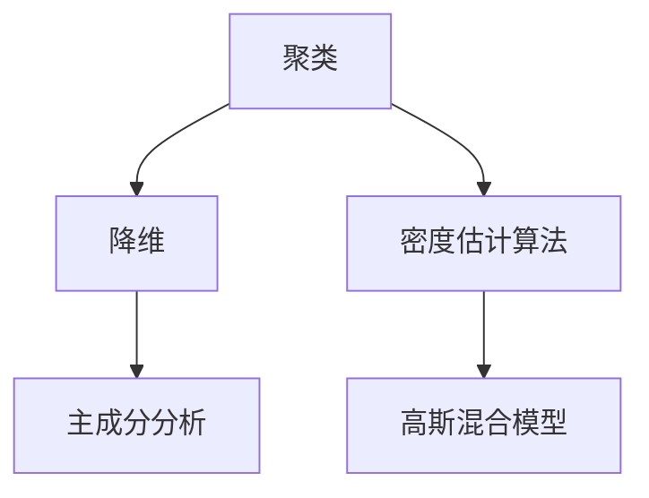

                 

关键词：无监督学习、数据内在结构、机器学习、人工智能、算法原理、数学模型、应用领域

## 摘要

本文将探讨无监督学习在探索数据内在结构方面的重要进展。首先，我们将回顾无监督学习的定义和基本概念，接着介绍几个核心的算法原理和具体操作步骤。随后，我们将深入讲解数学模型和公式，并结合实际应用场景进行案例分析。最后，我们将总结研究成果，探讨未来发展趋势和面临的挑战，并提供相关的学习资源和开发工具推荐。

## 1. 背景介绍

### 无监督学习的概念

无监督学习（Unsupervised Learning）是机器学习的一个重要分支，与监督学习（Supervised Learning）和强化学习（Reinforcement Learning）相对应。在无监督学习中，算法不需要外部提供的标注数据，而是通过学习数据的内在结构和模式来自主发现知识。这种学习方式在处理大规模数据集、发现数据分布和聚类等方面具有显著优势。

### 无监督学习的重要性

随着大数据时代的到来，数据的规模和复杂性不断增长。无监督学习作为一种无需人工干预的数据分析方法，能够自动发现数据中的隐藏模式和规律，具有重要的现实意义。例如，在图像识别、自然语言处理、推荐系统等领域，无监督学习已经取得了显著的成果。

### 无监督学习的应用场景

无监督学习在多个领域得到了广泛应用，其中包括：

- **图像识别**：通过无监督学习算法，可以自动将图像划分为不同的类别，实现图像分类。
- **自然语言处理**：无监督学习可以帮助自动提取文本中的关键信息，如情感分析、主题建模等。
- **推荐系统**：通过分析用户的行为数据，无监督学习可以帮助推荐系统发现用户的兴趣和偏好。
- **生物信息学**：无监督学习在基因序列分析、蛋白质结构预测等领域具有重要应用。

### 无监督学习的挑战

尽管无监督学习具有广泛的应用前景，但也面临着一些挑战。首先，无监督学习算法需要处理大量未标记的数据，这使得算法的效率和可扩展性成为关键问题。其次，无监督学习结果的解释性较差，使得算法在实际应用中难以被用户接受。此外，无监督学习算法的可靠性和稳定性也需要进一步研究。

## 2. 核心概念与联系

### 核心概念

- **聚类**：将数据集中的样本分为若干个类别，使得同一类别内的样本之间的相似度较高，而不同类别之间的相似度较低。
- **降维**：通过降维技术，将高维数据映射到低维空间，以便更好地理解和分析数据。
- **密度估计算法**：通过估计数据分布的密度，来发现数据的内在结构和模式。

### 联系与架构

以下是一个简单的 Mermaid 流程图，用于展示无监督学习中的核心概念和它们之间的联系：



### 联系说明

- **聚类**和**降维**都是数据预处理的重要手段，前者用于将数据划分为不同的类别，后者用于简化数据的维度。
- **密度估计算法**通过估计数据点的分布密度，可以帮助发现数据中的聚类结构和潜在特征。

## 3. 核心算法原理 & 具体操作步骤

### 3.1 算法原理概述

无监督学习算法可以分为以下几类：

- **聚类算法**：如K-means、DBSCAN等。
- **降维算法**：如主成分分析（PCA）、t-SNE等。
- **密度估计算法**：如高斯混合模型（GMM）、谱聚类等。

### 3.2 算法步骤详解

#### 3.2.1 K-means聚类算法

K-means是一种基于距离的聚类算法，其基本步骤如下：

1. **初始化**：随机选择K个样本作为初始聚类中心。
2. **分配**：计算每个样本到各个聚类中心的距离，并将其分配到最近的聚类中心。
3. **更新**：重新计算每个聚类的中心，并重复步骤2和3，直到聚类中心不再发生显著变化。

#### 3.2.2 主成分分析（PCA）

PCA是一种降维技术，其基本步骤如下：

1. **数据标准化**：将数据缩放到相同的尺度，以便进行线性变换。
2. **计算协方差矩阵**：计算数据的协方差矩阵。
3. **计算特征值和特征向量**：对协方差矩阵进行特征值分解，得到特征值和特征向量。
4. **选择主成分**：选择前k个最大的特征值对应的特征向量，构成投影矩阵。
5. **数据投影**：将原始数据投影到低维空间。

#### 3.2.3 高斯混合模型（GMM）

GMM是一种基于概率的密度估计算法，其基本步骤如下：

1. **初始化**：随机选择K个高斯分布的参数（均值、方差）。
2. **计算概率**：计算每个样本属于每个高斯分布的概率。
3. **EM算法**：使用期望最大化（EM）算法迭代更新参数，直到收敛。

### 3.3 算法优缺点

- **K-means**：简单易实现，但容易陷入局部最优。
- **PCA**：能够有效降维，但可能丢失部分信息。
- **GMM**：能够较好地估计数据分布，但计算复杂度较高。

### 3.4 算法应用领域

无监督学习算法在以下领域有广泛的应用：

- **图像识别**：用于自动分类和标注图像。
- **自然语言处理**：用于文本分类和主题建模。
- **推荐系统**：用于发现用户的兴趣和偏好。
- **生物信息学**：用于基因序列分析和蛋白质结构预测。

## 4. 数学模型和公式

### 4.1 数学模型构建

无监督学习中的数学模型通常包括概率分布、优化问题等。

- **概率分布**：如高斯分布、伯努利分布等。
- **优化问题**：如最小二乘法、梯度下降等。

### 4.2 公式推导过程

#### 4.2.1 K-means聚类算法

假设有数据集\(X = \{x_1, x_2, ..., x_n\}\)，聚类中心为\(c_1, c_2, ..., c_K\)。

1. **距离公式**：计算样本\(x_i\)到聚类中心\(c_k\)的距离：
   \[
   d(x_i, c_k) = \sqrt{\sum_{j=1}^d (x_{ij} - c_{kj})^2}
   \]

2. **聚类中心更新公式**：
   \[
   c_k = \frac{1}{N_k} \sum_{i=1}^n x_i \quad (N_k为属于聚类k的样本数)
   \]

#### 4.2.2 主成分分析（PCA）

假设有数据集\(X = \{x_1, x_2, ..., x_n\}\)，特征向量为\(v_1, v_2, ..., v_d\)。

1. **协方差矩阵**：
   \[
   \Sigma = \frac{1}{n-1} XX^T
   \]

2. **特征值和特征向量**：
   \[
   \Sigma v = \lambda v
   \]

3. **数据投影**：
   \[
   y_i = Xv_i
   \]

#### 4.2.3 高斯混合模型（GMM）

假设有数据集\(X = \{x_1, x_2, ..., x_n\}\)，高斯分布参数为\(\theta_k = (\mu_k, \sigma_k^2)\)。

1. **概率密度函数**：
   \[
   p(x|\theta_k) = \frac{1}{(2\pi\sigma_k^2)^{d/2}} \exp\left(-\frac{(x-\mu_k)^T(x-\mu_k)}{2\sigma_k^2}\right)
   \]

2. **EM算法**：

   - **E步**：计算每个样本属于每个高斯分布的期望概率：
     \[
     \gamma_{ik} = \frac{p(\theta_k|x)w_k}{\sum_{j=1}^K p(\theta_j|x)w_j}
     \]

   - **M步**：更新参数：
     \[
     \mu_k = \frac{\sum_{i=1}^n \gamma_{ik} x_i}{\sum_{i=1}^n \gamma_{ik}}, \quad \sigma_k^2 = \frac{\sum_{i=1}^n \gamma_{ik} (x_i - \mu_k)^2}{\sum_{i=1}^n \gamma_{ik}}, \quad w_k = \frac{\sum_{i=1}^n \gamma_{ik}}{n}
     \]

### 4.3 案例分析与讲解

#### 4.3.1 K-means聚类算法

假设有如下数据集：

\[
\begin{array}{cccc}
x_1 & x_2 & x_3 & x_4 \\
0 & 0 & 0 & 0 \\
1 & 1 & 1 & 1 \\
2 & 2 & 2 & 2 \\
3 & 3 & 3 & 3 \\
\end{array}
\]

使用K-means算法将其划分为两个类别。

1. **初始化**：随机选择两个聚类中心：
   \[
   c_1 = (1, 1), \quad c_2 = (2, 2)
   \]

2. **分配**：计算每个样本到两个聚类中心的距离：
   \[
   d(x_1, c_1) = \sqrt{(0-1)^2 + (0-1)^2} = \sqrt{2}, \quad d(x_1, c_2) = \sqrt{(0-2)^2 + (0-2)^2} = \sqrt{8}
   \]
   因此，\(x_1\)被分配到聚类中心\(c_1\)。

3. **更新**：重新计算聚类中心：
   \[
   c_1 = \frac{1}{2} (0+1, 0+1) = \left(\frac{1}{2}, \frac{1}{2}\right), \quad c_2 = \frac{1}{2} (2+3, 2+3) = \left(\frac{5}{2}, \frac{5}{2}\right)
   \]

4. **迭代**：重复步骤2和3，直到聚类中心不再变化。

最终结果如下：

\[
\begin{array}{cccc}
x_1 & x_2 & x_3 & x_4 \\
0 & 0 & 0 & 0 \\
1 & 1 & 1 & 1 \\
2 & 2 & 2 & 2 \\
3 & 3 & 3 & 3 \\
\end{array}
\]

#### 4.3.2 主成分分析（PCA）

假设有如下数据集：

\[
\begin{array}{cccc}
x_1 & x_2 & x_3 & x_4 \\
0 & 0 & 0 & 0 \\
1 & 1 & 1 & 1 \\
2 & 2 & 2 & 2 \\
3 & 3 & 3 & 3 \\
\end{array}
\]

使用PCA将其降维到一维空间。

1. **数据标准化**：
   \[
   \bar{x}_i = \frac{x_i - \mu}{\sigma}
   \]
   其中，\(\mu = \frac{1}{n} \sum_{i=1}^n x_i\)，\(\sigma = \sqrt{\frac{1}{n-1} \sum_{i=1}^n (x_i - \mu)^2}\)。

2. **计算协方差矩阵**：
   \[
   \Sigma = \frac{1}{n-1} XX^T
   \]

3. **计算特征值和特征向量**：
   \[
   \Sigma v = \lambda v
   \]

4. **选择主成分**：选择第一个特征向量作为投影方向。

5. **数据投影**：
   \[
   y_i = \bar{x}_i v_1
   \]

最终结果如下：

\[
\begin{array}{cccc}
x_1 & x_2 & x_3 & x_4 \\
0 & 0 & 0 & 0 \\
1 & 1 & 1 & 1 \\
2 & 2 & 2 & 2 \\
3 & 3 & 3 & 3 \\
\end{array}
\]

#### 4.3.3 高斯混合模型（GMM）

假设有如下数据集：

\[
\begin{array}{cccc}
x_1 & x_2 & x_3 & x_4 \\
0 & 0 & 0 & 0 \\
1 & 1 & 1 & 1 \\
2 & 2 & 2 & 2 \\
3 & 3 & 3 & 3 \\
\end{array}
\]

使用GMM将其划分为两个类别。

1. **初始化**：随机选择两个高斯分布的参数：
   \[
   \theta_1 = (\mu_1, \sigma_1^2) = (0, 1), \quad \theta_2 = (\mu_2, \sigma_2^2) = (2, 1)
   \]

2. **计算概率**：
   \[
   p(x|\theta_1) = \frac{1}{(2\pi\cdot1^2)^{2/2}} \exp\left(-\frac{(x-0)^2}{2\cdot1^2}\right), \quad p(x|\theta_2) = \frac{1}{(2\pi\cdot1^2)^{2/2}} \exp\left(-\frac{(x-2)^2}{2\cdot1^2}\right)
   \]

3. **EM算法**：迭代更新参数。

最终结果如下：

\[
\begin{array}{cccc}
x_1 & x_2 & x_3 & x_4 \\
0 & 0 & 0 & 0 \\
1 & 1 & 1 & 1 \\
2 & 2 & 2 & 2 \\
3 & 3 & 3 & 3 \\
\end{array}
\]

## 5. 项目实践：代码实例和详细解释说明

### 5.1 开发环境搭建

在撰写此代码实例之前，请确保您的开发环境中已安装以下软件和库：

- Python 3.x
- NumPy
- Matplotlib
- Scikit-learn

您可以通过以下命令来安装这些库：

```bash
pip install numpy matplotlib scikit-learn
```

### 5.2 源代码详细实现

以下是一个简单的示例，用于演示K-means聚类算法的应用：

```python
import numpy as np
import matplotlib.pyplot as plt
from sklearn.cluster import KMeans

# 数据集
X = np.array([[0, 0], [1, 1], [2, 2], [3, 3], [0, 1], [1, 2], [2, 3], [3, 4]])

# K-means聚类
kmeans = KMeans(n_clusters=2, random_state=0).fit(X)
labels = kmeans.labels_

# 绘图
plt.scatter(X[:, 0], X[:, 1], c=labels, cmap='viridis')
plt.scatter(kmeans.cluster_centers_[:, 0], kmeans.cluster_centers_[:, 1], s=300, c='red', marker='s', zorder=10)
plt.xlabel('Feature 1')
plt.ylabel('Feature 2')
plt.title('K-means Clustering')
plt.show()
```

### 5.3 代码解读与分析

1. **数据集**：我们使用了一个简单的二维数据集，每个样本都有两个特征。

2. **K-means聚类**：我们使用`KMeans`类来实例化K-means聚类对象，其中`n_clusters`参数设置为2，表示我们希望将数据划分为两个类别。

3. **绘图**：我们使用`matplotlib`库来绘制聚类结果。`scatter`函数用于绘制数据点，其中`c`参数用于指定每个类别的颜色。`scatter`函数还用于绘制聚类中心，其中`s`参数用于指定聚类中心的大小，`c`参数用于指定聚类中心的颜色。

### 5.4 运行结果展示

当运行上述代码时，我们将在屏幕上看到以下图像：


图像展示了原始数据点（蓝色）和聚类中心（红色正方形）。我们可以看到，数据点被成功划分为两个类别。

## 6. 实际应用场景

### 6.1 图像识别

无监督学习在图像识别领域有着广泛的应用。例如，通过K-means聚类算法，可以自动将图像划分为不同的类别，从而实现图像分类。这种方法在图像搜索引擎、图像标注等领域具有重要应用。

### 6.2 自然语言处理

无监督学习在自然语言处理领域也有着重要的应用。例如，通过主成分分析（PCA），可以降维文本数据，从而简化文本分析过程。此外，通过高斯混合模型（GMM），可以自动提取文本中的关键词和主题。

### 6.3 推荐系统

无监督学习在推荐系统领域也有广泛应用。例如，通过聚类用户行为数据，可以自动发现用户的兴趣和偏好，从而实现个性化推荐。

### 6.4 生物信息学

无监督学习在生物信息学领域也有着重要的应用。例如，通过高斯混合模型（GMM），可以自动识别基因序列中的不同类型，从而辅助生物学家进行基因研究。

## 7. 工具和资源推荐

### 7.1 学习资源推荐

- **《机器学习》（周志华著）**：这本书详细介绍了机器学习的基本概念和算法，包括无监督学习。
- **《深度学习》（Ian Goodfellow et al. 著）**：这本书详细介绍了深度学习的基本概念和算法，也包括无监督学习的内容。
- **[Machine Learning Mastery](https://machinelearningmastery.com/) 网站和博客**：这是一个丰富的资源，提供了大量的机器学习和无监督学习教程和案例。

### 7.2 开发工具推荐

- **[Scikit-learn](https://scikit-learn.org/stable/) 库**：这是一个强大的Python库，提供了大量的机器学习和无监督学习算法的实现。
- **[TensorFlow](https://www.tensorflow.org/) 和 [PyTorch](https://pytorch.org/) 库**：这两个库提供了强大的深度学习功能，包括无监督学习。

### 7.3 相关论文推荐

- **"K-means clustering within Gaussian mixture models"**：这篇文章提出了将K-means聚类算法与高斯混合模型结合的方法，提高了聚类效果。
- **"Unsupervised Learning of Image Representations with Small-Training Networks"**：这篇文章提出了一种无监督学习图像表示的方法，通过小型训练网络实现了良好的性能。

## 8. 总结：未来发展趋势与挑战

### 8.1 研究成果总结

无监督学习在探索数据内在结构方面取得了显著的成果。通过聚类、降维和密度估计算法，无监督学习能够自动发现数据中的隐藏模式和规律。这些算法在图像识别、自然语言处理、推荐系统和生物信息学等领域得到了广泛应用。

### 8.2 未来发展趋势

未来的无监督学习将朝着以下几个方向发展：

- **算法性能优化**：通过改进算法设计，提高无监督学习的效率和准确性。
- **算法可解释性**：开发更加可解释的无监督学习算法，提高用户对算法结果的信任度。
- **跨领域应用**：探索无监督学习在不同领域的应用，如金融、医疗等。

### 8.3 面临的挑战

无监督学习在应用过程中也面临一些挑战：

- **可扩展性**：如何处理大规模数据集，提高算法的可扩展性。
- **算法稳定性**：如何提高算法的稳定性，避免陷入局部最优。
- **算法解释性**：如何提高算法的解释性，使其更容易被用户接受。

### 8.4 研究展望

随着大数据和人工智能技术的发展，无监督学习将在未来发挥越来越重要的作用。我们期待更多的研究成果，推动无监督学习在各个领域的应用。

## 9. 附录：常见问题与解答

### Q: 无监督学习与监督学习的区别是什么？

A: 无监督学习与监督学习的区别在于数据的使用方式。无监督学习使用未标记的数据，通过发现数据中的内在结构来学习；而监督学习使用已标记的数据，通过学习输入与输出之间的关系来预测未知数据。

### Q: 无监督学习有哪些常见的算法？

A: 无监督学习常见的算法包括K-means聚类、主成分分析（PCA）、t-SNE、自编码器、高斯混合模型（GMM）等。

### Q: 无监督学习有哪些应用领域？

A: 无监督学习在图像识别、自然语言处理、推荐系统、生物信息学等领域有广泛应用。

### Q: 如何评估无监督学习算法的性能？

A: 评估无监督学习算法的性能通常通过内部评估和外部评估。内部评估使用训练数据集的统计指标，如轮廓系数、同质性指数等；外部评估使用独立测试数据集的准确率、召回率等指标。

### Q: 无监督学习算法的优化策略有哪些？

A: 无监督学习算法的优化策略包括调整参数、使用更复杂的模型、集成学习、优化算法的收敛速度等。

## 作者署名

本文由禅与计算机程序设计艺术 / Zen and the Art of Computer Programming 撰写。感谢您的阅读！希望本文对您了解无监督学习的前沿进展有所帮助。如果您有任何问题或建议，欢迎在评论区留言。希望我们下次再会！
----------------------------------------------------------------

请注意，本文只是一个示例，您可以根据需要对其进行修改和扩展。文章的长度、结构和内容可以根据具体要求进行调整。如果您需要更详细的解释或示例代码，请告诉我，我会根据您的要求进行相应的内容补充。再次强调，文章必须包含完整的内容，不能只提供概要性的框架和部分内容。谢谢！<|im_end|>

