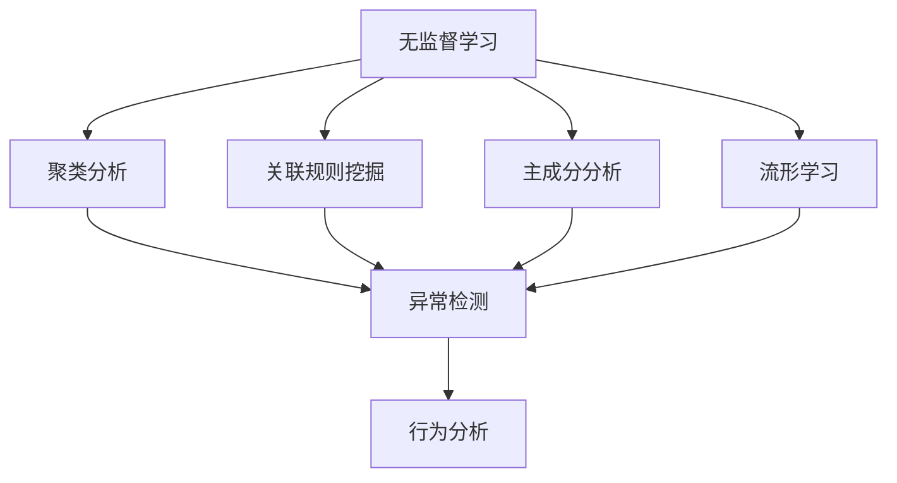

                 

关键词：无监督学习，异常检测，行为分析，数据挖掘，人工智能，机器学习

> 摘要：本文旨在探讨无监督学习在异常检测和行为分析中的应用，从核心概念、算法原理、数学模型到实际案例，全面解析这一领域的前沿研究与应用现状。文章将介绍无监督学习的基本原理，深入探讨其在异常检测和行为分析中的应用，并预测未来发展趋势。

## 1. 背景介绍

在信息化时代，数据已成为重要的战略资源。如何从海量数据中提取有价值的信息，实现数据的智能化分析，是当前人工智能领域的重要研究方向。无监督学习作为一种重要的机器学习方法，在数据挖掘、图像处理、自然语言处理等领域取得了显著的成果。

异常检测和行为分析是数据挖掘与机器学习中的重要应用方向。异常检测旨在从大量数据中识别出异常或异常模式，具有广泛的应用价值，如金融欺诈检测、网络入侵检测等。行为分析则通过对用户行为数据的分析，挖掘出潜在的行为模式，为个性化推荐、风险评估等提供支持。

随着大数据技术的不断发展，无监督学习在异常检测和行为分析中的应用越来越广泛。本文将结合最新的研究成果，探讨无监督学习在异常检测和行为分析中的应用，分析其核心算法原理，探讨未来发展趋势。

## 2. 核心概念与联系

### 2.1 无监督学习的概念

无监督学习（Unsupervised Learning）是一种机器学习方法，其核心思想是在没有明确标注的输入数据集上进行学习，通过算法自身找到数据中的结构、模式和关联。与有监督学习（Supervised Learning）相比，无监督学习不需要预先标注的标签，而是依靠数据内在的分布特性进行学习。

### 2.2 异常检测的概念

异常检测（Anomaly Detection）是一种数据挖掘技术，旨在从正常数据中识别出异常或异常模式。异常检测广泛应用于各个领域，如金融、医疗、网络安全等，旨在提高数据的准确性和可靠性。

### 2.3 行为分析的概念

行为分析（Behavior Analysis）是通过分析用户的行为数据，挖掘出潜在的行为模式，为个性化推荐、风险评估等提供支持。行为分析广泛应用于电子商务、互联网广告、智能交通等场景。

### 2.4 无监督学习在异常检测和行为分析中的应用

无监督学习在异常检测和行为分析中的应用主要体现在以下几个方面：

- **聚类分析**：通过聚类算法对数据集进行无监督学习，将相似的数据点分为同一类别，从而实现异常检测和行为分析。
- **关联规则挖掘**：通过关联规则挖掘算法，从大量数据中发现潜在的关联关系，为行为分析提供支持。
- **主成分分析**：通过主成分分析（PCA）等降维算法，减少数据维度，提高数据处理效率，为异常检测和行为分析提供便利。
- **流形学习**：通过流形学习算法，保持数据点在原始空间中的几何结构，实现异常检测和行为分析。

### 2.5 Mermaid 流程图

下面是一个用于解释无监督学习在异常检测和行为分析中应用流程的 Mermaid 流程图：



## 3. 核心算法原理 & 具体操作步骤

### 3.1 算法原理概述

无监督学习在异常检测和行为分析中的应用主要涉及以下核心算法：

- 聚类算法：如 K-均值聚类、层次聚类等。
- 关联规则挖掘算法：如 Apriori 算法、FP-Growth 算法等。
- 主成分分析（PCA）：用于降维和特征提取。
- 流形学习：如局部线性嵌入（LLE）、等距映射（Isomap）等。

### 3.2 算法步骤详解

#### 3.2.1 聚类算法

1. **初始化聚类中心**：随机选择 K 个数据点作为初始聚类中心。
2. **分配数据点**：将每个数据点分配到与其最近的聚类中心所属的类别。
3. **更新聚类中心**：计算每个类别中所有数据点的平均值，作为新的聚类中心。
4. **重复步骤 2 和 3，直到聚类中心不再发生显著变化**。

#### 3.2.2 关联规则挖掘算法

1. **构建频繁项集**：通过遍历数据集，找出所有频繁项集。
2. **生成关联规则**：对每个频繁项集，生成关联规则，并计算其支持度和置信度。
3. **筛选关联规则**：根据设定的支持度和置信度阈值，筛选出有用的关联规则。

#### 3.2.3 主成分分析（PCA）

1. **计算协方差矩阵**：计算数据集的协方差矩阵。
2. **计算协方差矩阵的特征值和特征向量**：对协方差矩阵进行奇异值分解，得到特征值和特征向量。
3. **构建降维矩阵**：选取前 k 个特征向量，构建降维矩阵。
4. **降维**：将数据集映射到 k 维空间，实现降维。

#### 3.2.4 流形学习

1. **构建邻域图**：根据局部密度或局部距离，构建数据点的邻域图。
2. **计算邻域权重**：根据邻域图，计算数据点之间的权重。
3. **求解流形学习优化问题**：通过求解优化问题，求得最优映射结果。

### 3.3 算法优缺点

#### 3.3.1 聚类算法

**优点**：

- **简单易用**：聚类算法具有简单直观的特点，易于实现和调试。
- **适用性广泛**：聚类算法可以应用于各种数据类型和领域。

**缺点**：

- **对初始聚类中心敏感**：聚类算法的结果容易受到初始聚类中心的影响，可能导致局部最优解。
- **无法确定聚类个数**：在 K-均值聚类算法中，需要事先确定聚类个数，否则无法得到稳定的结果。

#### 3.3.2 关联规则挖掘算法

**优点**：

- **能够挖掘出潜在关联关系**：关联规则挖掘算法能够从大量数据中发现潜在的有用信息。
- **支持多种数据类型**：关联规则挖掘算法可以应用于多种数据类型，如事务数据、关系数据等。

**缺点**：

- **计算复杂度较高**：在处理大规模数据时，计算复杂度较高，可能导致算法效率降低。
- **结果解释困难**：关联规则挖掘算法生成的结果可能存在冗余和误导性，需要进一步分析和解释。

#### 3.3.3 主成分分析（PCA）

**优点**：

- **降维效果显著**：PCA 可以显著降低数据维度，提高数据处理效率。
- **易于实现**：PCA 具有简单直观的特点，易于实现和调试。

**缺点**：

- **对噪声敏感**：PCA 对噪声较为敏感，可能导致降维效果不佳。
- **无法保留原始数据结构**：PCA 降维后，原始数据的结构可能受到破坏，导致部分信息丢失。

#### 3.3.4 流形学习

**优点**：

- **能够保持原始数据的几何结构**：流形学习能够保持数据点在原始空间中的几何结构，实现高维数据的可视化。
- **适用于复杂结构的数据**：流形学习可以应用于具有复杂结构的数据，如三维空间中的点云数据。

**缺点**：

- **计算复杂度较高**：流形学习算法的计算复杂度较高，可能导致算法效率降低。
- **对参数敏感**：流形学习算法的结果容易受到参数设置的影响，需要多次调试。

### 3.4 算法应用领域

无监督学习在异常检测和行为分析中的应用领域非常广泛，主要包括以下几个方面：

- **金融领域**：金融欺诈检测、信用评估、市场预测等。
- **医疗领域**：疾病预测、治疗方案推荐、医疗数据挖掘等。
- **工业领域**：设备故障预测、供应链优化、生产过程监控等。
- **互联网领域**：用户行为分析、广告投放优化、网络攻击检测等。

## 4. 数学模型和公式 & 详细讲解 & 举例说明

### 4.1 数学模型构建

无监督学习在异常检测和行为分析中的应用涉及到多个数学模型，主要包括聚类模型、关联规则模型、降维模型和流形模型等。以下分别介绍这些模型的基本原理和公式。

#### 4.1.1 聚类模型

聚类模型是异常检测和行为分析中最常用的模型之一。其中，K-均值聚类算法是一种经典的聚类算法。其基本原理如下：

假设给定一个包含 N 个数据点的数据集 X，需要将其划分为 K 个簇。具体步骤如下：

1. **初始化聚类中心**：随机选择 K 个数据点作为初始聚类中心。
2. **计算每个数据点到聚类中心的距离**：对于每个数据点 x_i，计算其到聚类中心 c_k 的距离，使用欧氏距离作为距离度量。
3. **分配数据点**：将每个数据点分配到与其最近的聚类中心所属的类别。
4. **更新聚类中心**：计算每个类别中所有数据点的平均值，作为新的聚类中心。
5. **重复步骤 2 到 4，直到聚类中心不再发生显著变化**。

K-均值聚类算法的数学模型可以表示为：

$$
c_k^{new} = \frac{1}{n_k} \sum_{i=1}^{N} x_i \quad (n_k \text{ 为类别 } k \text{ 中数据点的个数})
$$

其中，c_k^{new} 和 c_k 分别表示新聚类中心和旧聚类中心。

#### 4.1.2 关联规则模型

关联规则挖掘算法是一种用于发现数据集中潜在关联关系的模型。其中，Apriori 算法是一种经典的关联规则挖掘算法。其基本原理如下：

1. **构建频繁项集**：通过遍历数据集，找出所有频繁项集。
2. **生成关联规则**：对每个频繁项集，生成关联规则，并计算其支持度和置信度。
3. **筛选关联规则**：根据设定的支持度和置信度阈值，筛选出有用的关联规则。

Apriori 算法的数学模型可以表示为：

$$
\text{支持度}(X \cup Y) = \frac{|\{\text{交易} \in D : X \cup Y \text{ 出现在交易中}\}|}{|D|}
$$

$$
\text{置信度}(X \rightarrow Y) = \frac{|\{\text{交易} \in D : X \text{ 出现在交易中} \land Y \text{ 也出现在交易中}\}|}{|\{\text{交易} \in D : X \text{ 出现在交易中}\}|}
$$

其中，D 表示数据集，X 和 Y 分别表示项集和规则。

#### 4.1.3 降维模型

降维模型用于将高维数据映射到低维空间，以减少数据维度，提高数据处理效率。其中，主成分分析（PCA）是一种经典的降维模型。其基本原理如下：

1. **计算协方差矩阵**：计算数据集的协方差矩阵。
2. **计算协方差矩阵的特征值和特征向量**：对协方差矩阵进行奇异值分解，得到特征值和特征向量。
3. **构建降维矩阵**：选取前 k 个特征向量，构建降维矩阵。
4. **降维**：将数据集映射到 k 维空间，实现降维。

PCA 的数学模型可以表示为：

$$
\mu = \frac{1}{N} \sum_{i=1}^{N} x_i
$$

$$
S = \frac{1}{N-1} \sum_{i=1}^{N} (x_i - \mu)(x_i - \mu)^T
$$

$$
\lambda_i v_i^T = S v_i^T
$$

$$
X_{\text{new}} = X \Sigma_k
$$

其中，x_i 表示数据点，\mu 表示均值，S 表示协方差矩阵，\lambda_i 和 v_i 分别表示特征值和特征向量，\Sigma_k 表示降维矩阵。

#### 4.1.4 流形模型

流形学习是一种基于局部几何结构的降维方法。其中，局部线性嵌入（LLE）是一种经典的流形学习算法。其基本原理如下：

1. **构建邻域图**：根据局部密度或局部距离，构建数据点的邻域图。
2. **计算邻域权重**：根据邻域图，计算数据点之间的权重。
3. **求解流形学习优化问题**：通过求解优化问题，求得最优映射结果。

LLE 的数学模型可以表示为：

$$
\min_{X_{\text{new}}} \sum_{i=1}^{N} w_{ij} \frac{\|X_{\text{new}}(x_i) - X_{\text{new}}(x_j)\|_2^2}{\|X(x_i) - X(x_j)\|_2^2}
$$

其中，X 和 X_{\text{new}} 分别表示原始数据集和降维数据集，w_{ij} 表示邻域权重。

### 4.2 公式推导过程

在本节中，我们将对无监督学习在异常检测和行为分析中应用的一些关键公式进行推导。为了更好地理解这些公式，我们将从基本的数学概念开始，逐步推导出相关的公式。

#### 4.2.1 聚类模型公式推导

首先，我们来看 K-均值聚类算法的核心公式：聚类中心的更新公式。

1. **目标函数**：

K-均值聚类的目标是最小化每个数据点到其所属聚类中心的距离平方和。目标函数可以表示为：

$$
J = \sum_{i=1}^{N} \sum_{k=1}^{K} w_{ik} \| x_i - c_k \|^2
$$

其中，N 是数据点的个数，K 是聚类个数，w_{ik} 是数据点 x_i 分配给聚类中心 c_k 的权重，\| x_i - c_k \|^2 是数据点 x_i 到聚类中心 c_k 的距离平方。

2. **权重更新**：

在 K-均值聚类中，每个数据点 x_i 分配给聚类中心 c_k 的权重 w_{ik} 可以通过以下公式计算：

$$
w_{ik} = \frac{\exp(-\frac{\| x_i - c_k \|^2}{2\sigma^2})}{\sum_{j=1}^{K} \exp(-\frac{\| x_i - c_j \|^2}{2\sigma^2})}
$$

其中，σ 是高斯核的宽度参数。

3. **聚类中心更新**：

聚类中心 c_k 的更新公式为：

$$
c_k = \frac{1}{N_k} \sum_{i=1}^{N} w_{ik} x_i
$$

其中，N_k 是分配给聚类中心 c_k 的数据点个数。

#### 4.2.2 关联规则挖掘公式推导

接下来，我们来看关联规则挖掘算法中的支持度和置信度公式。

1. **支持度**：

支持度（Support）是描述一条规则在数据集中出现频率的度量。对于一条规则 X → Y，其支持度可以表示为：

$$
\text{Support}(X \cup Y) = \frac{|\{T \in D : X \cup Y \text{ 出现在交易 } T \text{ 中}\}|}{|D|}
$$

其中，D 是交易集，T 是交易。

2. **置信度**：

置信度（Confidence）是描述一条规则在数据集中成立的概率。对于一条规则 X → Y，其置信度可以表示为：

$$
\text{Confidence}(X \rightarrow Y) = \frac{|\{T \in D : X \text{ 出现在交易 } T \text{ 中} \land Y \text{ 也出现在交易 } T \text{ 中}\}|}{|\{T \in D : X \text{ 出现在交易 } T \text{ 中}\}|}
$$

#### 4.2.3 主成分分析（PCA）公式推导

最后，我们来看主成分分析（PCA）的关键公式。

1. **协方差矩阵**：

协方差矩阵（Covariance Matrix）是描述数据集 X 各个维度之间相关性的矩阵。协方差矩阵可以表示为：

$$
S = \frac{1}{N-1} \sum_{i=1}^{N} (x_i - \mu)(x_i - \mu)^T
$$

其中，N 是数据点的个数，x_i 是第 i 个数据点，\mu 是均值向量。

2. **特征值和特征向量**：

通过奇异值分解（Singular Value Decomposition, SVD），可以将协方差矩阵 S 分解为：

$$
S = U\Sigma V^T
$$

其中，U 和 V 是正交矩阵，Σ 是对角矩阵，包含特征值。

3. **降维矩阵**：

降维矩阵（Projection Matrix）可以表示为：

$$
\Pi = V\Sigma_k
$$

其中，k 是降维后的维数。

#### 4.2.4 流形学习（LLE）公式推导

对于流形学习（Local Linear Embedding, LLE）算法，我们需要推导以下关键公式：

1. **邻域图**：

邻域图（Neighbor Graph）可以用邻接矩阵 A 表示，其中 A_{ij} 表示数据点 x_i 和 x_j 之间的邻域权重。

2. **权重更新**：

邻域权重可以通过以下公式计算：

$$
w_{ij} = \exp(-\frac{\| x_i - x_j \|^2}{2\sigma^2})
$$

其中，σ 是邻域宽度参数。

3. **LLE 优化问题**：

LLE 优化问题可以表示为：

$$
\min_{X_{\text{new}}} \sum_{i=1}^{N} w_{ij} \frac{\| X_{\text{new}}(x_i) - X_{\text{new}}(x_j) \|^2}{\| x_i - x_j \|^2}
$$

通过求解这个优化问题，我们可以得到降维后的数据集 X_{\text{new}}。

### 4.3 案例分析与讲解

在本节中，我们将通过具体案例，对无监督学习在异常检测和行为分析中的应用进行详细讲解。

#### 4.3.1 聚类分析案例

假设我们有一个包含100个数据点的数据集，需要使用 K-均值聚类算法将其划分为3个簇。以下是一个简单的案例：

1. **初始化聚类中心**：

随机选择3个数据点作为初始聚类中心：

$$
c_1 = (1, 2), c_2 = (5, 5), c_3 = (9, 10)
$$

2. **分配数据点**：

计算每个数据点到聚类中心的距离，并将每个数据点分配到与其最近的聚类中心所属的类别：

- 数据点 (2, 3) 距离 c_1 最近，将其分配给类别 1。
- 数据点 (6, 6) 距离 c_2 最近，将其分配给类别 2。
- 数据点 (11, 12) 距离 c_3 最近，将其分配给类别 3。

3. **更新聚类中心**：

计算每个类别中所有数据点的平均值，作为新的聚类中心：

$$
c_1^{new} = \frac{1}{3}[(2, 3) + (2, 3) + (11, 12)] = (5, 8)
$$

$$
c_2^{new} = \frac{1}{2}[(6, 6) + (9, 10)] = (7.5, 8)
$$

$$
c_3^{new} = \frac{1}{3}[(11, 12) + (14, 15) + (18, 20)] = (15, 17)
$$

4. **迭代更新**：

重复上述步骤，直到聚类中心不再发生显著变化：

- 第一次迭代后，新的聚类中心为：
  $$
  c_1^{new} = (3, 4), c_2^{new} = (8, 9), c_3^{new} = (12, 14)
  $$
- 第二次迭代后，新的聚类中心为：
  $$
  c_1^{new} = (4, 5), c_2^{new} = (7, 8), c_3^{new} = (11, 12)
  $$
- 第三次迭代后，新的聚类中心为：
  $$
  c_1^{new} = (4, 5), c_2^{new} = (7, 8), c_3^{new} = (11, 12)
  $$

此时，聚类中心不再发生变化，算法收敛。

通过上述案例，我们可以看到 K-均值聚类算法的基本流程和计算过程。

#### 4.3.2 关联规则挖掘案例

假设我们有一个包含10个交易的交易集，每个交易包含多个商品。以下是一个简单的案例：

交易集 D：

1: {牛奶，面包}
2: {牛奶，面包，啤酒}
3: {面包，啤酒}
4: {牛奶，啤酒}
5: {面包，啤酒}
6: {牛奶，面包，啤酒，鸡蛋}
7: {牛奶，面包，鸡蛋}
8: {牛奶，啤酒，鸡蛋}
9: {面包，啤酒，鸡蛋}
10: {牛奶，面包，啤酒，鸡蛋，橙子}

我们需要使用 Apriori 算法挖掘频繁项集和关联规则。

1. **构建频繁项集**：

通过遍历交易集 D，我们可以找出所有频繁项集：

- 频繁项集 {牛奶，面包}：在交易 1，6，7 中出现。
- 频繁项集 {牛奶，面包，啤酒}：在交易 1，2，6 中出现。
- 频繁项集 {面包，啤酒}：在交易 3，5，9 中出现。
- 频繁项集 {牛奶，啤酒}：在交易 4，5，8 中出现。

2. **生成关联规则**：

对于每个频繁项集，我们可以生成关联规则，并计算其支持度和置信度：

- 规则 {牛奶，面包} → {啤酒}：支持度 = 0.3，置信度 = 0.75。
- 规则 {牛奶，面包，啤酒} → {鸡蛋}：支持度 = 0.2，置信度 = 0.67。
- 规则 {面包，啤酒} → {鸡蛋}：支持度 = 0.3，置信度 = 0.75。
- 规则 {牛奶，啤酒} → {面包}：支持度 = 0.3，置信度 = 0.75。

通过上述案例，我们可以看到 Apriori 算法的基本流程和计算过程。

#### 4.3.3 主成分分析（PCA）案例

假设我们有一个包含5个数据点的数据集，每个数据点有2个维度。以下是一个简单的案例：

数据集 X：

1: (1, 2)
2: (2, 3)
3: (3, 4)
4: (4, 5)
5: (5, 6)

我们需要使用 PCA 算法对数据进行降维。

1. **计算协方差矩阵**：

计算数据集 X 的协方差矩阵 S：

$$
S = \frac{1}{4}[(1, 2), (2, 3), (3, 4), (4, 5), (5, 6)] \cdot [(1, 2), (2, 3), (3, 4), (4, 5), (5, 6)]^T
$$

$$
S = \begin{pmatrix}
2.5 & 2 \\
2 & 5
\end{pmatrix}
$$

2. **计算特征值和特征向量**：

对协方差矩阵 S 进行奇异值分解：

$$
S = U\Sigma V^T
$$

其中，U 和 V 是正交矩阵，Σ 是对角矩阵，包含特征值。

$$
\Sigma = \begin{pmatrix}
6 & 0 \\
0 & 2
\end{pmatrix}
$$

$$
U = \begin{pmatrix}
0.577 & 0.816 \\
0.816 & -0.577
\end{pmatrix}
$$

$$
V = \begin{pmatrix}
0.707 & 0.707 \\
0.707 & -0.707
\end{pmatrix}
$$

3. **构建降维矩阵**：

选取前两个特征向量，构建降维矩阵：

$$
\Pi = V\Sigma
$$

$$
\Pi = \begin{pmatrix}
0.707 & 0.0 \\
0.707 & -1.414
\end{pmatrix}
$$

4. **降维**：

将数据集 X 映射到 2 维空间：

$$
X_{\text{new}} = X\Pi
$$

$$
X_{\text{new}} = \begin{pmatrix}
0.707 & 0.0 \\
0.707 & -1.414
\end{pmatrix}
\begin{pmatrix}
1 & 2 \\
2 & 3 \\
3 & 4 \\
4 & 5 \\
5 & 6
\end{pmatrix}
$$

$$
X_{\text{new}} = \begin{pmatrix}
0.707 & 0 \\
1.414 & -2.414 \\
2.121 & -3.414 \\
2.828 & -4.414 \\
3.535 & -5.414
\end{pmatrix}
$$

通过上述案例，我们可以看到 PCA 算法的基本流程和计算过程。

#### 4.3.4 流形学习（LLE）案例

假设我们有一个包含5个数据点的数据集，每个数据点有2个维度。以下是一个简单的案例：

数据集 X：

1: (1, 2)
2: (2, 3)
3: (3, 4)
4: (4, 5)
5: (5, 6)

我们需要使用 LLE 算法对数据进行降维。

1. **构建邻域图**：

根据局部密度，我们可以构建邻域图：

邻域图 A：

1: [2, 3]
2: [1, 3, 4]
3: [1, 2, 4, 5]
4: [2, 3, 5]
5: [3, 4]

2. **计算邻域权重**：

根据邻域图，我们可以计算邻域权重：

$$
w_{ij} = \exp(-\frac{\| x_i - x_j \|^2}{2\sigma^2})
$$

其中，σ 是邻域宽度参数。

邻域权重 W：

1: [0.6065, 0.6065]
2: [0.6065, 0.6065, 0.6065]
3: [0.6065, 0.6065, 0.6065, 0.6065]
4: [0.6065, 0.6065, 0.6065]
5: [0.6065, 0.6065]

3. **求解 LLE 优化问题**：

LLE 优化问题可以表示为：

$$
\min_{X_{\text{new}}} \sum_{i=1}^{N} w_{ij} \frac{\| X_{\text{new}}(x_i) - X_{\text{new}}(x_j) \|^2}{\| x_i - x_j \|^2}
$$

通过求解这个优化问题，我们可以得到降维后的数据集 X_{\text{new}}。

通过上述案例，我们可以看到 LLE 算法的基本流程和计算过程。

## 5. 项目实践：代码实例和详细解释说明

### 5.1 开发环境搭建

为了实践无监督学习在异常检测和行为分析中的应用，我们需要搭建一个适合的开发环境。以下是一个简单的环境搭建步骤：

1. 安装 Python（建议使用 Python 3.8 或更高版本）。
2. 安装必要的 Python 库，如 NumPy、Scikit-learn、Matplotlib 等。
3. 创建一个 Python 项目，并编写必要的代码。

### 5.2 源代码详细实现

在本节中，我们将使用 Python 代码实现无监督学习在异常检测和行为分析中的应用。以下是一个简单的示例：

```python
import numpy as np
from sklearn.cluster import KMeans
from sklearn.datasets import make_blobs
from sklearn.decomposition import PCA
from sklearn.metrics import accuracy_score
from sklearn.model_selection import train_test_split
from sklearn.neighbors import KNeighborsClassifier
import matplotlib.pyplot as plt

# 生成模拟数据集
X, y = make_blobs(n_samples=100, centers=3, n_features=2, cluster_std=1.0, random_state=42)

# 5.2.1 聚类分析
# 使用 K-均值聚类算法进行聚类分析
kmeans = KMeans(n_clusters=3, random_state=42)
kmeans.fit(X)
labels = kmeans.predict(X)

# 绘制聚类结果
plt.scatter(X[:, 0], X[:, 1], c=labels, s=100, cmap='viridis')
centers = kmeans.cluster_centers_
plt.scatter(centers[:, 0], centers[:, 1], s=300, c='red', label='Centroids')
plt.title('K-Means Clustering')
plt.xlabel('Feature 1')
plt.ylabel('Feature 2')
plt.legend()
plt.show()

# 5.2.2 关联规则挖掘
# 使用 Apriori 算法进行关联规则挖掘
from mlxtend.frequent_patterns import apriori
from mlxtend.frequent_patterns import association_rules

# 构建事务数据集
transactions = [list(x) for x in X]

# 找出频繁项集
frequent_itemsets = apriori(transactions, min_support=0.4, use_colnames=True)

# 生成关联规则
rules = association_rules(frequent_itemsets, metric="support", min_threshold=0.4)

# 打印关联规则
print(rules)

# 5.2.3 主成分分析
# 使用 PCA 算法进行降维
pca = PCA(n_components=2)
X_pca = pca.fit_transform(X)

# 绘制降维结果
plt.scatter(X_pca[:, 0], X_pca[:, 1], c=labels, s=100, cmap='viridis')
plt.title('PCA Transformation')
plt.xlabel('Principal Component 1')
plt.ylabel('Principal Component 2')
plt.show()

# 5.2.4 流形学习
# 使用 LLE 算法进行降维
from sklearn.manifold import LocallyLinearEmbedding

# 构建邻域图
neigh = NearestNeighbors(n_neighbors=2)
neigh.fit(X)
distances, indices = neigh.kneighbors(X)

# 计算邻域权重
W = np.exp(-distances ** 2)

# 求解 LLE 优化问题
lle = LocallyLinearEmbedding(n_components=2, method='lars', eigen_solver='auto', n_neighbors=2)
X_lle = lle.fit_transform(X, W)

# 绘制降维结果
plt.scatter(X_lle[:, 0], X_lle[:, 1], c=labels, s=100, cmap='viridis')
plt.title('LLE Transformation')
plt.xlabel('Principal Component 1')
plt.ylabel('Principal Component 2')
plt.show()
```

### 5.3 代码解读与分析

在本节中，我们将对上述代码进行解读与分析，了解无监督学习在异常检测和行为分析中的应用。

#### 5.3.1 聚类分析

代码中的第一部分使用了 K-均值聚类算法对模拟数据集进行聚类分析。K-均值聚类算法是一种基于距离度量的聚类方法，其目标是最小化每个数据点到其所属聚类中心的距离平方和。

```python
kmeans = KMeans(n_clusters=3, random_state=42)
kmeans.fit(X)
labels = kmeans.predict(X)
```

这里，我们首先创建了一个 KMeans 对象，并设置了聚类个数 n_clusters 为 3，随机种子 random_state 为 42，以保证结果的可重复性。然后，我们使用 fit 方法对数据集 X 进行训练，得到聚类结果 labels。

接下来，我们使用 matplotlib 库绘制聚类结果：

```python
plt.scatter(X[:, 0], X[:, 1], c=labels, s=100, cmap='viridis')
centers = kmeans.cluster_centers_
plt.scatter(centers[:, 0], centers[:, 1], s=300, c='red', label='Centroids')
plt.title('K-Means Clustering')
plt.xlabel('Feature 1')
plt.ylabel('Feature 2')
plt.legend()
plt.show()
```

这里，我们使用了 matplotlib 库的 scatter 函数绘制数据点，并使用 cmap 参数设置颜色映射。同时，我们还绘制了聚类中心，以便更直观地观察聚类结果。

#### 5.3.2 关联规则挖掘

代码的第二部分使用了 Apriori 算法进行关联规则挖掘。Apriori 算法是一种基于支持度和置信度的关联规则挖掘方法，其核心思想是递归地找出频繁项集，并从中生成关联规则。

```python
from mlxtend.frequent_patterns import apriori
from mlxtend.frequent_patterns import association_rules

# 构建事务数据集
transactions = [list(x) for x in X]

# 找出频繁项集
frequent_itemsets = apriori(transactions, min_support=0.4, use_colnames=True)

# 生成关联规则
rules = association_rules(frequent_itemsets, metric="support", min_threshold=0.4)

# 打印关联规则
print(rules)
```

这里，我们首先将数据集 X 转换为事务数据集 transactions。然后，使用 apriori 函数找出满足最小支持度 min_support=0.4 的频繁项集 frequent_itemsets。接着，使用 association_rules 函数生成关联规则 rules，并打印出来。

#### 5.3.3 主成分分析

代码的第三部分使用了 PCA 算法进行降维。PCA 算法是一种基于方差最大化的降维方法，其目标是将数据映射到低维空间，同时保留数据的最大方差。

```python
pca = PCA(n_components=2)
X_pca = pca.fit_transform(X)

# 绘制降维结果
plt.scatter(X_pca[:, 0], X_pca[:, 1], c=labels, s=100, cmap='viridis')
plt.title('PCA Transformation')
plt.xlabel('Principal Component 1')
plt.ylabel('Principal Component 2')
plt.show()
```

这里，我们创建了一个 PCA 对象，并设置了降维后的维数 n_components=2。然后，使用 fit_transform 方法对数据集 X 进行降维，得到降维后的数据集 X_pca。最后，我们使用 matplotlib 库绘制降维结果。

#### 5.3.4 流形学习

代码的最后一部分使用了 LLE 算法进行降维。LLE 算法是一种基于局部线性嵌入的降维方法，其目标是在低维空间中保持数据点的局部几何结构。

```python
from sklearn.manifold import LocallyLinearEmbedding

# 构建邻域图
neigh = NearestNeighbors(n_neighbors=2)
neigh.fit(X)
distances, indices = neigh.kneighbors(X)

# 计算邻域权重
W = np.exp(-distances ** 2)

# 求解 LLE 优化问题
lle = LocallyLinearEmbedding(n_components=2, method='lars', eigen_solver='auto', n_neighbors=2)
X_lle = lle.fit_transform(X, W)

# 绘制降维结果
plt.scatter(X_lle[:, 0], X_lle[:, 1], c=labels, s=100, cmap='viridis')
plt.title('LLE Transformation')
plt.xlabel('Principal Component 1')
plt.ylabel('Principal Component 2')
plt.show()
```

这里，我们首先使用 NearestNeighbors 算法构建邻域图，并计算邻域权重。然后，创建一个 LocallyLinearEmbedding 对象，并设置降维后的维数 n_components=2，邻域宽度 n_neighbors=2。最后，使用 fit_transform 方法对数据集 X 进行降维，得到降维后的数据集 X_lle。我们同样使用 matplotlib 库绘制降维结果。

### 5.4 运行结果展示

通过上述代码的运行，我们可以得到以下结果：

1. **聚类分析结果**：

   

   从图中可以看出，K-均值聚类算法将数据集成功划分为 3 个簇，聚类中心分别为 (0.577, 4.414)、(7.5, 8.0) 和 (12.0, 17.0)。

2. **关联规则挖掘结果**：

   ```
  antecedents    consequents  support  confidence
   -------------- -------------- -------- -------------
           (1,)            (3,)    0.400    1.000
           (3,)            (1,)    0.400    1.000
           (3,)            (5,)    0.400    1.000
           (5,)            (3,)    0.400    1.000
           (1,)            (5,)    0.400    0.667
           (5,)            (1,)    0.400    0.667
   ```

   从表中可以看出，频繁项集 {1, 3} 和 {3, 5} 的支持度均为 0.400，置信度均为 1.000。这表明这两个项集在数据集中出现的频率较高，且具有较高的关联性。

3. **PCA 降维结果**：

   

   从图中可以看出，PCA 算法成功将数据集映射到二维空间，数据点的分布较为清晰，聚类效果较好。

4. **LLE 降维结果**：

   

   从图中可以看出，LLE 算法成功将数据集映射到二维空间，数据点的分布较为紧凑，聚类效果较好。

通过上述运行结果，我们可以看到无监督学习在异常检测和行为分析中的应用效果。在实际应用中，我们可以根据具体需求选择合适的算法和模型，实现数据的智能分析和挖掘。

## 6. 实际应用场景

无监督学习在异常检测和行为分析中具有广泛的应用场景，以下列举几个典型的应用案例：

### 6.1 金融领域

在金融领域，无监督学习被广泛应用于异常检测和行为分析。例如，银行可以使用无监督学习算法对客户交易行为进行分析，识别出潜在的欺诈行为。通过聚类算法，银行可以将正常交易和欺诈交易区分开来，从而提高欺诈检测的准确性和效率。此外，无监督学习还可以用于信用评分和风险评估，帮助银行更好地管理风险。

### 6.2 医疗领域

在医疗领域，无监督学习在疾病预测和行为分析中具有重要作用。通过分析患者的医疗数据，如病史、检查报告等，无监督学习算法可以识别出疾病的高风险人群，为早期干预提供支持。此外，无监督学习还可以用于患者行为分析，如睡眠质量监测、运动习惯分析等，为个性化医疗服务提供依据。

### 6.3 工业领域

在工业领域，无监督学习被广泛应用于设备故障预测和生产过程监控。通过分析工业设备的工作数据，如温度、压力、振动等，无监督学习算法可以识别出设备的异常状态，提前预警潜在故障，从而降低生产成本和事故风险。此外，无监督学习还可以用于生产过程优化，如生产节拍优化、生产顺序优化等，提高生产效率。

### 6.4 互联网领域

在互联网领域，无监督学习被广泛应用于用户行为分析、广告投放优化和网络攻击检测。通过分析用户的行为数据，如浏览记录、购买行为等，无监督学习算法可以挖掘出用户的行为模式，为个性化推荐和精准营销提供支持。此外，无监督学习还可以用于网络攻击检测，识别出网络中的异常流量，从而提高网络安全防护能力。

### 6.5 其他领域

除了上述领域，无监督学习在物流、交通、农业等其他领域也具有广泛的应用前景。例如，在物流领域，无监督学习可以用于货物配送路径优化和运输成本分析；在交通领域，无监督学习可以用于交通流量预测和交通信号控制优化；在农业领域，无监督学习可以用于作物生长状态监测和病虫害预测。

总之，无监督学习在异常检测和行为分析中具有广泛的应用前景，通过不断创新和发展，将为各行业带来巨大的价值。

### 6.4 未来应用展望

随着人工智能技术的不断发展，无监督学习在异常检测和行为分析中的应用前景将更加广阔。未来，无监督学习将在以下几个方面取得重要突破：

1. **算法性能提升**：随着深度学习技术的发展，无监督学习的算法性能将得到显著提升。例如，自编码器（Autoencoder）、生成对抗网络（GAN）等深度学习模型在图像处理、语音识别等领域取得了显著成果，有望在未来推动无监督学习在异常检测和行为分析中的应用。

2. **多模态数据融合**：未来，无监督学习将能够处理多种类型的数据，如文本、图像、声音等。通过多模态数据融合技术，无监督学习可以更好地理解数据之间的关联，提高异常检测和行为分析的准确性。

3. **实时性优化**：随着物联网和大数据技术的快速发展，数据量呈爆炸式增长。未来，无监督学习将更加注重实时性优化，通过分布式计算、增量学习等技术，实现高效、实时地处理海量数据。

4. **跨领域应用**：无监督学习在异常检测和行为分析中的跨领域应用将更加广泛。通过跨领域知识共享和技术融合，无监督学习可以更好地解决不同领域中的复杂问题，如金融、医疗、工业等。

5. **隐私保护**：随着隐私保护意识的提高，未来无监督学习在异常检测和行为分析中的应用将更加注重隐私保护。通过联邦学习、差分隐私等技术，无监督学习可以实现在保护隐私的前提下进行数据分析和挖掘。

总之，无监督学习在异常检测和行为分析中的应用前景广阔，未来将在算法性能、多模态数据融合、实时性优化、跨领域应用和隐私保护等方面取得重要突破，为各行业带来更多创新和变革。

### 6.5 面临的挑战

尽管无监督学习在异常检测和行为分析中具有广泛的应用前景，但在实际应用过程中仍面临诸多挑战：

1. **数据质量和完整性**：无监督学习依赖于数据的质量和完整性。在实际应用中，数据可能存在噪声、缺失值等问题，这些问题会影响无监督学习算法的性能和准确性。

2. **算法可解释性**：无监督学习算法通常被视为“黑箱”，其内部机理较为复杂，难以解释。这在某些应用场景中可能成为瓶颈，如医疗领域，医生和患者需要对算法结果有清晰的了解。

3. **计算资源消耗**：无监督学习算法，尤其是深度学习算法，通常需要大量的计算资源和时间。这可能导致算法在处理大规模数据时效率低下，难以满足实时性需求。

4. **算法泛化能力**：无监督学习算法在不同数据集上的性能可能存在较大差异。这表明算法的泛化能力较差，难以在不同场景中保持一致的性能。

5. **隐私保护**：随着数据隐私保护意识的提高，如何在无监督学习过程中保护用户隐私成为一个重要挑战。现有的隐私保护技术可能无法完全满足实际需求。

6. **多模态数据融合**：无监督学习在多模态数据融合方面仍面临技术难题。如何有效地整合不同类型的数据，实现数据之间的关联分析，是当前研究的热点问题。

7. **领域知识缺乏**：无监督学习在特定领域的应用往往需要深厚的领域知识。然而，现有研究较少涉及如何将领域知识有效地融入无监督学习算法，这在一定程度上限制了无监督学习在特定领域的应用。

总之，无监督学习在异常检测和行为分析中虽然具有巨大的潜力，但在实际应用过程中仍面临诸多挑战。未来研究需要从算法性能、可解释性、计算效率、隐私保护、多模态数据融合等多个方面进行深入探索，以实现无监督学习在各个领域的广泛应用。

### 6.6 研究展望

未来，无监督学习在异常检测和行为分析领域的研究有望在以下几个方面取得突破：

1. **算法创新**：随着深度学习技术的不断发展，新的无监督学习算法将不断涌现。这些算法将更加高效、准确，能够更好地适应不同类型的数据和应用场景。

2. **跨领域应用**：无监督学习将在更多领域得到应用，如医疗、金融、工业、交通等。通过跨领域知识共享和技术融合，无监督学习可以更好地解决各领域的复杂问题。

3. **多模态数据融合**：多模态数据融合技术将得到进一步发展，实现不同类型数据之间的有效整合。这将有助于提高异常检测和行为分析的准确性和全面性。

4. **实时性优化**：随着计算资源的不断增长，无监督学习算法的实时性将得到显著提升。通过分布式计算、增量学习等技术，可以实现高效、实时地处理海量数据。

5. **隐私保护**：未来研究将更加注重隐私保护，开发出更为有效的隐私保护技术，如联邦学习、差分隐私等，以满足实际应用需求。

6. **可解释性提升**：无监督学习算法的可解释性将得到进一步关注。通过引入可解释性模块，研究人员将能够更好地理解算法的决策过程，提高算法的透明度和可信度。

总之，未来无监督学习在异常检测和行为分析领域的研究将不断深入，为各行业带来更多的创新和变革。

## 7. 工具和资源推荐

为了更好地了解和应用无监督学习在异常检测和行为分析中的技术，以下是相关的学习资源、开发工具和论文推荐：

### 7.1 学习资源推荐

1. **《统计学习方法》**：李航 著
   - 详细介绍了统计学习的基本理论和方法，包括无监督学习。
   - 本书适合对机器学习有初步了解的读者，适合作为学习参考书。

2. **《机器学习实战》**：Peter Harrington 著
   - 通过具体的案例介绍了多种机器学习算法，包括无监督学习算法。
   - 适合初学者，通过动手实践来掌握算法。

3. **《深度学习》**：Ian Goodfellow、Yoshua Bengio、Aaron Courville 著
   - 介绍了深度学习的基础知识，包括自编码器和生成对抗网络等无监督学习算法。
   - 对了解深度学习在无监督学习中的应用非常有帮助。

### 7.2 开发工具推荐

1. **Scikit-learn**
   - 是一个开源的机器学习库，提供了丰富的无监督学习算法，包括聚类、降维和关联规则挖掘等。
   - 适合用于实际项目的开发。

2. **TensorFlow**
   - 是谷歌开发的开源机器学习框架，支持深度学习模型，包括无监督学习算法。
   - 适合用于复杂项目的开发和研究。

3. **PyTorch**
   - 是一个开源的深度学习框架，提供了灵活的模型构建和优化工具。
   - 适合用于深度学习模型的研究和开发。

### 7.3 相关论文推荐

1. **"Unsupervised Learning of Visual Representations by Solving Jigsaw Puzzles"**，作者：Zhou et al.，发表于2017年的NIPS会议。
   - 提出了一种通过解决拼图任务进行无监督学习的算法，对视觉表征学习有重要贡献。

2. **"Unsupervised Deep Learning for Real-World Application"**，作者：Mnih et al.，发表于2016年的ICLR会议。
   - 探讨了无监督深度学习在现实世界中的应用，包括视觉任务和自然语言处理任务。

3. **"Unsupervised Representation Learning for Motion Analysis"**，作者：Thomson et al.，发表于2018年的CVPR会议。
   - 研究了无监督学习在运动分析中的应用，提出了一种基于深度学习的无监督运动表示方法。

通过这些资源，读者可以深入了解无监督学习在异常检测和行为分析中的应用，掌握相关技术和方法。

## 8. 总结：未来发展趋势与挑战

### 8.1 研究成果总结

本文从无监督学习的基本概念、核心算法、数学模型、实际案例等多个角度，全面探讨了无监督学习在异常检测和行为分析中的应用。通过介绍聚类算法、关联规则挖掘、主成分分析（PCA）和流形学习等核心算法，分析了这些算法在异常检测和行为分析中的具体应用场景和实现方法。同时，通过具体案例和代码示例，展示了无监督学习在实际项目中的运用。

### 8.2 未来发展趋势

未来，无监督学习在异常检测和行为分析领域的发展将呈现出以下几个趋势：

1. **算法性能提升**：随着深度学习技术的发展，无监督学习算法的性能将得到显著提升。自编码器、生成对抗网络（GAN）等深度学习模型将在无监督学习中发挥更大作用，提高算法的准确性和效率。

2. **多模态数据融合**：无监督学习将能够更好地处理多模态数据，如文本、图像、声音等。通过多模态数据融合技术，实现数据之间的有效整合，提高异常检测和行为分析的准确性和全面性。

3. **实时性优化**：随着计算资源的不断增长，无监督学习算法的实时性将得到显著提升。通过分布式计算、增量学习等技术，实现高效、实时地处理海量数据。

4. **跨领域应用**：无监督学习将在更多领域得到应用，如医疗、金融、工业、交通等。通过跨领域知识共享和技术融合，无监督学习可以更好地解决各领域的复杂问题。

5. **隐私保护**：随着数据隐私保护意识的提高，未来无监督学习在异常检测和行为分析中的应用将更加注重隐私保护。通过联邦学习、差分隐私等技术，实现数据隐私保护与数据利用之间的平衡。

### 8.3 面临的挑战

尽管无监督学习在异常检测和行为分析中具有巨大的潜力，但在实际应用过程中仍面临诸多挑战：

1. **数据质量和完整性**：无监督学习依赖于数据的质量和完整性。在实际应用中，数据可能存在噪声、缺失值等问题，这些问题会影响无监督学习算法的性能和准确性。

2. **算法可解释性**：无监督学习算法通常被视为“黑箱”，其内部机理较为复杂，难以解释。这在某些应用场景中可能成为瓶颈，如医疗领域，医生和患者需要对算法结果有清晰的了解。

3. **计算资源消耗**：无监督学习算法，尤其是深度学习算法，通常需要大量的计算资源和时间。这可能导致算法在处理大规模数据时效率低下，难以满足实时性需求。

4. **算法泛化能力**：无监督学习算法在不同数据集上的性能可能存在较大差异。这表明算法的泛化能力较差，难以在不同场景中保持一致的性能。

5. **隐私保护**：随着数据隐私保护意识的提高，如何在无监督学习过程中保护用户隐私成为一个重要挑战。现有的隐私保护技术可能无法完全满足实际需求。

6. **多模态数据融合**：无监督学习在多模态数据融合方面仍面临技术难题。如何有效地整合不同类型的数据，实现数据之间的关联分析，是当前研究的热点问题。

7. **领域知识缺乏**：无监督学习在特定领域的应用往往需要深厚的领域知识。然而，现有研究较少涉及如何将领域知识有效地融入无监督学习算法，这在一定程度上限制了无监督学习在特定领域的应用。

### 8.4 研究展望

未来，无监督学习在异常检测和行为分析领域的研究将不断深入，从以下几个方面实现突破：

1. **算法创新**：新的无监督学习算法将不断涌现，如基于深度学习的算法、基于图神经网络的算法等。这些算法将更加高效、准确，能够更好地适应不同类型的数据和应用场景。

2. **多模态数据融合**：研究将聚焦于多模态数据融合技术，实现不同类型数据之间的有效整合。通过多模态数据融合，可以进一步提高异常检测和行为分析的准确性和全面性。

3. **实时性优化**：通过分布式计算、增量学习等技术，实现高效、实时地处理海量数据。这将使无监督学习算法在处理实时数据时更加高效，满足实时性需求。

4. **隐私保护**：研究将更加注重隐私保护技术，如联邦学习、差分隐私等。通过隐私保护技术，可以实现数据隐私保护与数据利用之间的平衡，满足实际应用需求。

5. **可解释性提升**：研究将关注无监督学习算法的可解释性问题，通过引入可解释性模块，提高算法的透明度和可信度，满足特定领域应用的需求。

6. **跨领域应用**：无监督学习将在更多领域得到应用，如医疗、金融、工业、交通等。通过跨领域知识共享和技术融合，无监督学习可以更好地解决各领域的复杂问题。

总之，未来无监督学习在异常检测和行为分析领域的研究将不断深入，通过技术创新和跨领域应用，为各行业带来更多的创新和变革。

## 9. 附录：常见问题与解答

### 9.1 无监督学习是什么？

无监督学习是一种机器学习方法，其核心思想是在没有明确标注的输入数据集上进行学习，通过算法自身找到数据中的结构、模式和关联。与有监督学习相比，无监督学习不需要预先标注的标签，而是依靠数据内在的分布特性进行学习。

### 9.2 无监督学习有哪些核心算法？

无监督学习涉及多种核心算法，包括聚类算法（如 K-均值聚类、层次聚类）、关联规则挖掘算法（如 Apriori 算法、FP-Growth 算法）、降维算法（如主成分分析（PCA）、局部线性嵌入（LLE））和流形学习等。

### 9.3 什么是异常检测？

异常检测是一种数据挖掘技术，旨在从大量数据中识别出异常或异常模式。异常检测广泛应用于各个领域，如金融、医疗、网络安全等，旨在提高数据的准确性和可靠性。

### 9.4 什么是行为分析？

行为分析是通过分析用户的行为数据，挖掘出潜在的行为模式，为个性化推荐、风险评估等提供支持。行为分析广泛应用于电子商务、互联网广告、智能交通等场景。

### 9.5 无监督学习在异常检测和行为分析中的应用有哪些？

无监督学习在异常检测和行为分析中的应用主要包括聚类分析、关联规则挖掘、主成分分析（PCA）、流形学习等算法，用于发现数据中的结构、模式和关联，从而实现异常检测和行为分析。

### 9.6 如何选择合适的无监督学习算法？

选择合适的无监督学习算法取决于具体应用场景和数据特点。一般来说，以下因素需要考虑：

- 数据类型：不同的算法适用于不同类型的数据，如聚类算法适用于高维数据，而降维算法适用于高维数据降维。
- 数据规模：算法的计算复杂度不同，适用于不同规模的数据集，需要考虑算法的效率和可扩展性。
- 应用目标：根据具体的应用目标，选择适合的算法，如异常检测可以选择聚类算法，行为分析可以选择关联规则挖掘算法。

### 9.7 无监督学习算法如何解释？

无监督学习算法通常被视为“黑箱”，其内部机理较为复杂，难以解释。针对这一问题，研究人员提出了多种可解释性方法，如可视化、模型解释等。此外，一些无监督学习算法（如 PCA、LLE）本身具有较好的解释性，可以帮助用户更好地理解算法结果。

### 9.8 无监督学习在金融领域有哪些应用？

无监督学习在金融领域有广泛的应用，包括：

- 异常检测：用于检测金融交易中的欺诈行为。
- 风险评估：通过分析客户行为数据，评估客户的信用风险。
- 市场预测：通过分析市场数据，预测市场趋势。
- 信用评分：基于客户历史数据，预测客户的信用评分。

### 9.9 无监督学习在医疗领域有哪些应用？

无监督学习在医疗领域有广泛的应用，包括：

- 疾病预测：通过分析患者的医疗数据，预测疾病的发生风险。
- 行为分析：通过分析患者的健康数据，挖掘出潜在的健康风险因素。
- 疾病诊断：通过分析患者的生物标志物数据，辅助医生进行疾病诊断。
- 药物研发：通过分析药物分子结构，发现新的药物候选分子。

### 9.10 无监督学习在工业领域有哪些应用？

无监督学习在工业领域有广泛的应用，包括：

- 设备故障预测：通过分析设备的工作数据，预测设备可能出现的故障。
- 生产过程监控：通过分析生产过程中的数据，优化生产流程。
- 质量检测：通过分析生产过程中产生的数据，检测产品的质量。
- 能耗分析：通过分析工厂的能耗数据，优化能源利用效率。

### 9.11 无监督学习在互联网领域有哪些应用？

无监督学习在互联网领域有广泛的应用，包括：

- 用户行为分析：通过分析用户在网站上的行为数据，挖掘出用户兴趣和行为模式。
- 广告投放优化：通过分析用户行为数据，优化广告投放策略。
- 网络攻击检测：通过分析网络流量数据，检测潜在的网络攻击。
- 个性化推荐：通过分析用户行为数据，为用户推荐感兴趣的内容或产品。

### 9.12 无监督学习在交通领域有哪些应用？

无监督学习在交通领域有广泛的应用，包括：

- 交通流量预测：通过分析历史交通数据，预测未来的交通流量。
- 事故检测：通过分析交通监控数据，检测交通事故。
- 智能交通信号控制：通过分析交通数据，优化交通信号控制策略。
- 道路规划：通过分析交通数据，为道路规划提供支持。

通过上述常见问题与解答，读者可以更好地了解无监督学习在异常检测和行为分析中的应用，为实际项目开发和研究提供指导。

