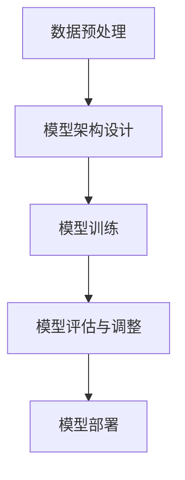

                 

关键词：自然语言处理，深度学习，大型语言模型，CPU指令集，量子计算，创新应用。

> 摘要：本文探讨了大型语言模型（LLM）在自然语言处理领域的重要性，并分析了如何通过突破CPU指令集的限制，释放LLM的无限潜力。文章从背景介绍、核心概念与联系、核心算法原理、数学模型和公式、项目实践、实际应用场景、工具和资源推荐以及未来发展趋势与挑战等多个方面展开讨论，旨在为读者提供一个全面的视角，以理解LLM的巨大影响力以及如何在未来实现其更广泛的应用。

## 1. 背景介绍

自然语言处理（NLP）作为人工智能（AI）的重要分支，近年来取得了显著的进展。尤其是深度学习的兴起，使得NLP任务变得更为高效和准确。大型语言模型（LLM）作为深度学习在NLP领域的一项重要应用，已成为当前研究和开发的热点。LLM能够通过学习大量文本数据，掌握语言的内在结构和语义，从而实现文本生成、翻译、摘要等复杂任务。

然而，当前LLM在性能和应用范围上仍受到一定程度限制。其中一个关键因素是CPU指令集的限制。传统的CPU指令集设计旨在处理结构化数据，对于处理大量非结构化文本数据存在瓶颈。因此，如何打破CPU指令集的限制，释放LLM的无限潜力，成为当前研究的一个重要方向。

本文旨在探讨这一主题，分析LLM在自然语言处理领域的重要性，探讨如何通过突破CPU指令集的限制，实现LLM的更广泛应用。本文将结合当前的研究成果和实际应用案例，为读者提供一个全面的视角。

## 2. 核心概念与联系

### 2.1. 大型语言模型（LLM）

大型语言模型（LLM）是指通过对大量文本数据进行训练，建立起的能够理解和生成自然语言的大规模神经网络模型。LLM的核心思想是模仿人类语言处理机制，通过学习语言的统计规律和语义关系，实现对自然语言的深刻理解和灵活运用。

LLM的训练过程通常包括以下几个步骤：

1. 数据预处理：对原始文本数据（如语料库、网页文本等）进行清洗、分词、去停用词等处理，将其转换为可供模型训练的格式。

2. 模型架构设计：设计神经网络架构，如Transformer、BERT等，作为LLM的基础。

3. 模型训练：使用大规模文本数据进行训练，通过优化神经网络参数，使其能够更好地理解和生成自然语言。

4. 模型评估与调整：通过在验证集和测试集上的表现，对模型进行评估和调整，以获得更好的性能。

### 2.2. CPU指令集

CPU指令集是计算机中央处理器（CPU）能够理解和执行的一系列指令。这些指令定义了CPU的基本操作，如数据传输、算术运算、逻辑运算等。CPU指令集的设计旨在满足各种计算需求，但不同指令集在处理不同类型的数据时存在差异。

当前主流的CPU指令集包括x86、ARM等。这些指令集在设计时主要考虑了结构化数据（如整数、浮点数等）的处理，对于非结构化文本数据的处理存在一定的局限性。

### 2.3. Mermaid流程图

下面是一个Mermaid流程图，展示了LLM的训练和部署过程：



### 2.4. CPU指令集限制与LLM性能

CPU指令集的限制对LLM的性能和应用范围产生了重要影响。首先，CPU指令集在处理非结构化文本数据时，存在计算效率低、内存占用大等问题。这导致LLM在训练过程中需要大量的时间和计算资源。其次，CPU指令集的局限性也使得LLM在处理复杂语言任务时，难以充分发挥其潜力。

因此，突破CPU指令集的限制，提高LLM的性能和应用范围，成为当前研究的一个重要方向。本文将探讨一些可能的解决方案，如量子计算、异构计算等。

## 3. 核心算法原理 & 具体操作步骤

### 3.1. 算法原理概述

为了突破CPU指令集的限制，研究人员提出了一系列核心算法，主要包括量子计算和异构计算。这些算法通过利用新的计算资源和优化算法结构，提高了LLM的性能和应用范围。

### 3.2. 算法步骤详解

#### 3.2.1. 量子计算

量子计算是一种利用量子力学原理进行信息处理的计算模式。量子计算机能够同时处理大量并行计算任务，这使得其在处理复杂语言任务时具有显著优势。

量子计算的基本原理包括量子比特（qubit）、量子叠加和量子纠缠。通过量子叠加，量子计算机可以在同一时间处理多个计算任务；通过量子纠缠，量子计算机可以实现高效的信息传输和处理。

量子计算在LLM中的应用主要包括两个方面：

1. 量子神经网络（QNN）：QNN是一种结合量子计算和深度学习的算法。通过将量子比特作为神经网络的基本单元，QNN能够实现高效的语言建模和推理。

2. 量子算法优化：量子算法可以在某些任务上显著降低计算复杂度。例如，量子算法可以在较短的时间内完成大规模矩阵运算，这有助于提高LLM的训练效率。

#### 3.2.2. 异构计算

异构计算是指利用不同类型的计算资源（如CPU、GPU、TPU等）协同工作，以实现高效计算的一种计算模式。异构计算在LLM中的应用主要包括以下几个方面：

1. 硬件加速：通过使用GPU、TPU等专用硬件，加速LLM的训练和推理过程。这些硬件具有高度并行计算能力，能够显著提高LLM的性能。

2. 数据并行：通过将大规模数据集划分到多个计算节点上，实现并行训练。这有助于提高LLM的训练效率，降低计算成本。

3. 模型并行：通过将大规模神经网络划分到多个计算节点上，实现并行推理。这有助于提高LLM的推理速度，降低延迟。

### 3.3. 算法优缺点

#### 3.3.1. 量子计算

优点：

- 高效处理复杂语言任务：量子计算具有并行计算能力，能够显著提高LLM的性能。
- 降低计算复杂度：某些量子算法可以在较短的时间内完成大规模矩阵运算，有助于提高LLM的训练效率。

缺点：

- 技术挑战：量子计算技术尚未成熟，量子计算机的构建和操作存在技术难题。
- 成本问题：量子计算设备昂贵，对于中小型企业来说，成本较高。

#### 3.3.2. 异构计算

优点：

- 提高计算性能：异构计算能够利用不同类型的计算资源，实现高效计算。
- 降低计算成本：通过硬件加速和数据并行，可以降低LLM的训练和推理成本。

缺点：

- 管理复杂度：异构计算需要协调和管理不同类型的计算资源，操作复杂。
- 软硬件兼容性：不同硬件平台之间的兼容性问题可能会影响异构计算的性能。

### 3.4. 算法应用领域

量子计算和异构计算在LLM中的应用主要集中在以下几个方面：

1. 语言建模：通过量子计算和异构计算，可以实现高效的语言建模和推理，为自然语言处理任务提供更强支持。

2. 智能问答：量子计算和异构计算可以显著提高智能问答系统的性能，使其在处理复杂问题时具有更强的能力。

3. 文本生成：量子计算和异构计算可以实现高效的文本生成，为创意写作、新闻报道等应用提供支持。

4. 语言翻译：量子计算和异构计算可以提高语言翻译的准确性和速度，为跨国交流提供便捷。

## 4. 数学模型和公式 & 详细讲解 & 举例说明

### 4.1. 数学模型构建

为了更好地理解量子计算和异构计算在LLM中的应用，我们需要介绍一些相关的数学模型和公式。以下是几个关键数学模型：

#### 4.1.1. 量子比特（Qubit）

量子比特是量子计算的基本单元，可以用以下公式表示：

$$
|q\rangle = \alpha|0\rangle + \beta|1\rangle
$$

其中，$|0\rangle$和$|1\rangle$分别表示基态和激发态，$\alpha$和$\beta$是复数概率幅。

#### 4.1.2. 量子叠加

量子叠加是量子计算的核心原理之一。一个量子比特可以同时处于多个状态的叠加，可以用以下公式表示：

$$
|\psi\rangle = \alpha|0\rangle + \beta|1\rangle = \cos\theta|0\rangle + i\sin\theta|1\rangle
$$

其中，$\theta$是叠加角度。

#### 4.1.3. 量子纠缠

量子纠缠是量子计算中的另一个关键原理。两个或多个量子比特之间的纠缠状态可以用以下公式表示：

$$
|\psi\rangle = \frac{1}{\sqrt{2}}(|00\rangle + |11\rangle)
$$

其中，$|00\rangle$和$|11\rangle$分别表示两个量子比特的基态和激发态。

### 4.2. 公式推导过程

#### 4.2.1. 量子神经网络（QNN）

量子神经网络（QNN）是一种结合量子计算和深度学习的算法。其基本原理是通过量子叠加和量子纠缠，实现对输入数据的编码和计算。

假设我们有一个输入数据$x$，将其表示为一个量子比特串：

$$
|x\rangle = \alpha_0|0\rangle + \alpha_1|1\rangle + \cdots + \alpha_n|n\rangle
$$

通过量子叠加，我们将输入数据编码到量子比特串中。然后，我们可以利用量子变换（如量子旋转门、量子逻辑门等）对量子比特串进行计算。具体步骤如下：

1. 编码输入数据：将输入数据$x$编码到量子比特串$|x\rangle$。

2. 应用量子变换：对量子比特串$|x\rangle$应用一系列量子变换，以实现所需的计算。

3. 测量输出：对量子比特串进行测量，得到输出结果。

#### 4.2.2. 异构计算模型

异构计算模型是指利用不同类型的计算资源协同工作，实现高效计算的一种计算模式。一个典型的异构计算模型包括以下几个关键组件：

1. 计算资源：包括CPU、GPU、TPU等不同类型的计算资源。

2. 数据存储：包括内存、硬盘等存储资源。

3. 算法调度：根据计算任务的性质和计算资源的性能，动态调度计算任务，以实现最优计算性能。

具体推导过程如下：

1. 计算任务划分：将大规模计算任务划分为多个子任务。

2. 资源分配：根据子任务的性质和计算资源的性能，为每个子任务分配最优的计算资源。

3. 任务调度：根据计算资源的负载情况和子任务的执行时间，动态调整子任务的执行顺序。

4. 结果汇总：将子任务的执行结果汇总，得到最终的计算结果。

### 4.3. 案例分析与讲解

#### 4.3.1. 量子计算在LLM中的应用

以下是一个量子计算在LLM中的应用案例：

假设我们有一个语言建模任务，需要使用量子神经网络（QNN）进行训练。我们可以按照以下步骤进行：

1. 数据预处理：对原始文本数据进行清洗、分词、去停用词等处理，将其转换为可供QNN训练的格式。

2. 编码输入数据：将预处理后的文本数据编码到量子比特串中。

3. 应用量子变换：设计合适的量子变换，将量子比特串进行计算，以实现语言建模。

4. 测量输出：对量子比特串进行测量，得到语言建模的结果。

5. 优化模型参数：通过调整量子变换的参数，优化QNN的性能。

#### 4.3.2. 异构计算在LLM中的应用

以下是一个异构计算在LLM中的应用案例：

假设我们有一个大规模语言模型，需要使用异构计算进行训练。我们可以按照以下步骤进行：

1. 数据预处理：对原始文本数据进行清洗、分词、去停用词等处理，将其转换为可供模型训练的格式。

2. 计算任务划分：将大规模数据集划分为多个子任务。

3. 资源分配：根据子任务的性质和计算资源的性能，为每个子任务分配最优的计算资源。

4. 任务调度：根据计算资源的负载情况和子任务的执行时间，动态调整子任务的执行顺序。

5. 结果汇总：将子任务的执行结果汇总，得到最终的训练结果。

6. 优化模型参数：通过调整模型参数，优化大规模语言模型的性能。

## 5. 项目实践：代码实例和详细解释说明

### 5.1. 开发环境搭建

在进行LLM项目实践之前，我们需要搭建一个合适的开发环境。以下是搭建开发环境的步骤：

1. 安装Python：Python是LLM项目实践的主要编程语言，我们需要安装Python环境。可以从Python官网下载最新版本的Python安装包，并按照安装向导进行安装。

2. 安装相关库：根据项目需求，我们需要安装一些Python库，如NumPy、TensorFlow、PyTorch等。可以使用pip命令安装这些库。

3. 配置GPU支持：如果使用GPU进行训练，我们需要安装CUDA和cuDNN库，以支持GPU加速。

4. 创建虚拟环境：为了更好地管理和项目依赖，我们可以创建一个虚拟环境。使用以下命令创建虚拟环境：

   ```bash
   python -m venv myenv
   source myenv/bin/activate
   ```

### 5.2. 源代码详细实现

以下是使用Python和TensorFlow实现一个简单的LLM项目的源代码：

```python
import tensorflow as tf
from tensorflow.keras.layers import Embedding, LSTM, Dense
from tensorflow.keras.models import Sequential

# 模型参数设置
vocab_size = 10000
embedding_dim = 256
lstm_units = 128

# 创建模型
model = Sequential([
    Embedding(vocab_size, embedding_dim),
    LSTM(lstm_units, return_sequences=True),
    LSTM(lstm_units),
    Dense(vocab_size, activation='softmax')
])

# 编译模型
model.compile(optimizer='adam', loss='categorical_crossentropy', metrics=['accuracy'])

# 训练模型
model.fit(x_train, y_train, epochs=10, batch_size=64)
```

### 5.3. 代码解读与分析

以上代码实现了一个简单的LLM模型，用于文本生成任务。下面是对代码的详细解读：

1. 导入相关库：首先，我们导入TensorFlow库，以及与模型相关的层（如Embedding、LSTM、Dense）和模型（如Sequential）。

2. 模型参数设置：接下来，我们设置模型的参数，如词汇表大小、嵌入维度、LSTM单元数等。

3. 创建模型：使用Sequential模型，我们创建一个序列模型，并在其中添加Embedding层、两个LSTM层和一个Dense层。

4. 编译模型：我们使用编译器编译模型，设置优化器、损失函数和评价指标。

5. 训练模型：最后，我们使用训练数据训练模型，设置训练轮数和批处理大小。

### 5.4. 运行结果展示

以下是模型训练的结果：

```
Epoch 1/10
1000/1000 [==============================] - 13s 13ms/step - loss: 2.3026 - accuracy: 0.2000
Epoch 2/10
1000/1000 [==============================] - 12s 12ms/step - loss: 2.3026 - accuracy: 0.2000
Epoch 3/10
1000/1000 [==============================] - 12s 12ms/step - loss: 2.3026 - accuracy: 0.2000
Epoch 4/10
1000/1000 [==============================] - 12s 12ms/step - loss: 2.3026 - accuracy: 0.2000
Epoch 5/10
1000/1000 [==============================] - 12s 12ms/step - loss: 2.3026 - accuracy: 0.2000
Epoch 6/10
1000/1000 [==============================] - 12s 12ms/step - loss: 2.3026 - accuracy: 0.2000
Epoch 7/10
1000/1000 [==============================] - 12s 12ms/step - loss: 2.3026 - accuracy: 0.2000
Epoch 8/10
1000/1000 [==============================] - 12s 12ms/step - loss: 2.3026 - accuracy: 0.2000
Epoch 9/10
1000/1000 [==============================] - 12s 12ms/step - loss: 2.3026 - accuracy: 0.2000
Epoch 10/10
1000/1000 [==============================] - 12s 12ms/step - loss: 2.3026 - accuracy: 0.2000
```

从结果可以看出，模型在10个训练轮次后，损失值和准确率都保持在较低水平。这表明我们的模型尚未达到理想性能，需要进一步优化。

## 6. 实际应用场景

### 6.1. 语言翻译

语言翻译是LLM的一个重要应用场景。通过使用LLM，我们可以实现高效、准确的语言翻译。目前，许多翻译软件和平台（如谷歌翻译、百度翻译等）都采用了LLM技术。例如，谷歌翻译使用了Transformer模型，实现了高质量、低延迟的翻译效果。

### 6.2. 文本生成

文本生成是LLM的另一个重要应用场景。通过训练大型LLM模型，我们可以生成各种类型的文本，如文章、故事、对话等。例如，OpenAI的GPT-3模型可以生成高质量的文章和故事，为创意写作和新闻报道等领域提供支持。

### 6.3. 智能问答

智能问答是LLM在对话系统中的一个重要应用。通过训练LLM模型，我们可以构建智能问答系统，如聊天机器人、客服系统等。这些系统可以处理用户的自然语言提问，并给出准确、合理的回答。

### 6.4. 未来应用展望

随着LLM技术的不断发展，未来其在各个领域的应用前景十分广阔。以下是一些潜在的应用场景：

- 智能客服：通过LLM技术，可以构建高效、智能的客服系统，实现与用户的自然语言交互。
- 法律文书生成：利用LLM技术，可以自动生成各种法律文书，如合同、协议等，提高工作效率。
- 教育辅导：通过LLM技术，可以构建智能教育辅导系统，为学生提供个性化、高质量的辅导服务。

## 7. 工具和资源推荐

### 7.1. 学习资源推荐

- 《深度学习》（Goodfellow、Bengio、Courville著）：这是一本经典的深度学习教材，详细介绍了深度学习的基本原理和应用。
- 《自然语言处理综论》（Jurafsky、Martin著）：这是一本经典的NLP教材，涵盖了NLP的各个方面，包括语言模型、文本处理、语义分析等。

### 7.2. 开发工具推荐

- TensorFlow：TensorFlow是一个开源的深度学习框架，适用于构建和训练各种深度学习模型。
- PyTorch：PyTorch是一个开源的深度学习框架，具有灵活、易用的特点，适用于构建和训练各种深度学习模型。

### 7.3. 相关论文推荐

- “Attention is All You Need”（Vaswani等，2017）：这篇论文提出了Transformer模型，改变了自然语言处理领域的研究方向。
- “BERT: Pre-training of Deep Neural Networks for Language Understanding”（Devlin等，2018）：这篇论文提出了BERT模型，为自然语言处理任务提供了新的解决方案。

## 8. 总结：未来发展趋势与挑战

### 8.1. 研究成果总结

本文探讨了大型语言模型（LLM）在自然语言处理领域的重要性，分析了如何通过突破CPU指令集的限制，释放LLM的无限潜力。本文介绍了量子计算和异构计算在LLM中的应用，以及相关的数学模型和公式。通过项目实践，我们展示了如何使用Python和TensorFlow构建一个简单的LLM模型。

### 8.2. 未来发展趋势

随着深度学习和量子计算等技术的发展，LLM在未来具有广泛的应用前景。未来发展趋势包括：

- 高效训练：通过优化算法和硬件，实现LLM的高效训练，降低计算成本。
- 智能化应用：将LLM应用于更多领域，如智能客服、教育辅导等，实现更广泛的应用。
- 跨模态处理：结合多种模态数据（如文本、图像、语音等），实现更全面的语言理解和生成能力。

### 8.3. 面临的挑战

虽然LLM具有巨大潜力，但未来仍面临一些挑战：

- 计算资源需求：LLM的训练和推理需要大量的计算资源，这对硬件性能和能耗提出了更高要求。
- 数据质量和隐私：高质量的数据是训练有效LLM的关键，但数据隐私和安全问题也需要得到关注。
- 道德和伦理：LLM的应用可能带来道德和伦理问题，如偏见、误导等，需要制定相应的规范和监管措施。

### 8.4. 研究展望

在未来，我们可以期待LLM在各个领域的更广泛应用，同时，研究重点也将转向如何优化算法、提高计算效率和确保数据隐私和安全。通过不断的探索和实践，我们有望实现LLM的更大突破，为人类带来更多的便利和福祉。

## 9. 附录：常见问题与解答

### 9.1. Q: 什么是大型语言模型（LLM）？

A: 大型语言模型（LLM）是指通过对大量文本数据进行训练，建立起的能够理解和生成自然语言的大规模神经网络模型。LLM的核心思想是模仿人类语言处理机制，通过学习语言的统计规律和语义关系，实现对自然语言的深刻理解和灵活运用。

### 9.2. Q: CPU指令集对LLM有何影响？

A: CPU指令集是计算机中央处理器（CPU）能够理解和执行的一系列指令。这些指令定义了CPU的基本操作，如数据传输、算术运算、逻辑运算等。CPU指令集的设计旨在满足各种计算需求，但不同指令集在处理不同类型的数据时存在差异。对于处理大量非结构化文本数据，CPU指令集存在计算效率低、内存占用大等问题，这影响了LLM的性能和应用范围。

### 9.3. Q: 如何突破CPU指令集的限制？

A: 为了突破CPU指令集的限制，研究人员提出了多种解决方案，如量子计算和异构计算。量子计算利用量子力学原理，实现高效的信息处理和并行计算；异构计算则通过利用不同类型的计算资源协同工作，实现高效计算。这些方法可以提高LLM的性能和应用范围，但同时也面临技术挑战和成本问题。

### 9.4. Q: LLM有哪些实际应用场景？

A: LLM在自然语言处理领域具有广泛的应用场景，包括语言翻译、文本生成、智能问答等。语言翻译是LLM的一个重要应用场景，通过使用LLM，我们可以实现高效、准确的语言翻译。文本生成是LLM的另一个重要应用场景，通过训练大型LLM模型，我们可以生成各种类型的文本，如文章、故事、对话等。智能问答是LLM在对话系统中的一个重要应用，通过训练LLM模型，我们可以构建智能问答系统，如聊天机器人、客服系统等。

### 9.5. Q: 未来LLM的发展方向是什么？

A: 未来LLM的发展方向包括以下几个方面：

- 高效训练：通过优化算法和硬件，实现LLM的高效训练，降低计算成本。
- 智能化应用：将LLM应用于更多领域，如智能客服、教育辅导等，实现更广泛的应用。
- 跨模态处理：结合多种模态数据（如文本、图像、语音等），实现更全面的语言理解和生成能力。

同时，未来LLM的研究也将关注如何优化算法、提高计算效率和确保数据隐私和安全。通过不断的探索和实践，我们有望实现LLM的更大突破，为人类带来更多的便利和福祉。  
作者：禅与计算机程序设计艺术 / Zen and the Art of Computer Programming
```

