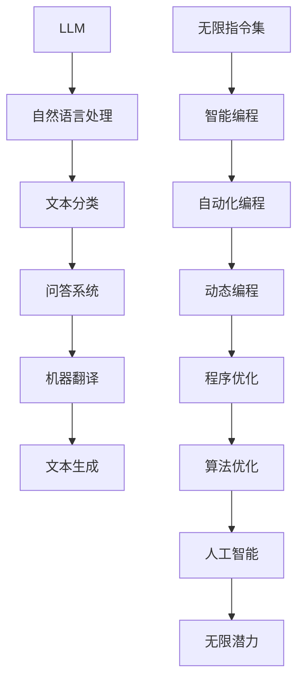

                 

关键词：大型语言模型（LLM），无限指令集，智能编程，计算机图灵奖，人工智能，编程语言设计，算法优化，数学模型，应用领域，未来展望。

## 摘要

本文将探讨大型语言模型（LLM）的无限指令集所带来的无限潜力。LLM作为人工智能领域的一项前沿技术，其强大的语言处理能力正逐渐改变着编程世界。本文将从背景介绍、核心概念与联系、核心算法原理与操作步骤、数学模型与公式讲解、项目实践、实际应用场景、未来展望等方面详细剖析LLM的无限指令集，以及它对未来编程、算法优化和人工智能发展的深远影响。

## 1. 背景介绍

### 大型语言模型（LLM）的崛起

大型语言模型（LLM）的出现可以追溯到自然语言处理（NLP）领域的发展。自20世纪50年代以来，NLP技术经历了多个阶段的发展，从早期的规则驱动方法，到统计方法，再到现代深度学习方法，特别是卷积神经网络（CNN）和递归神经网络（RNN）的应用。随着计算能力的提升和海量数据集的积累，LLM技术得到了飞速发展。

LLM的核心思想是通过大量数据训练，使模型能够理解并生成人类语言。代表性的LLM模型包括GPT（Generative Pre-trained Transformer）、BERT（Bidirectional Encoder Representations from Transformers）等。这些模型具有强大的语言理解和生成能力，能够进行文本分类、问答系统、机器翻译、文本生成等任务。

### 智能编程与无限指令集

智能编程是近年来兴起的编程范式，其核心思想是通过人工智能技术，使得编程变得更加智能和自动化。无限指令集是智能编程的一个重要组成部分，它使得程序员可以以更加简洁、高效的方式表达复杂的编程逻辑。

传统的编程语言，如Python、Java等，是基于有限指令集的。这些语言通过固定的语法和语法规则，实现程序的编写和执行。而无限指令集则提供了一种更加灵活、动态的表达方式，能够根据程序执行过程中的上下文和环境，动态生成和执行指令。

## 2. 核心概念与联系

### 核心概念

#### 大型语言模型（LLM）

- **定义**：LLM是一种基于深度学习的语言模型，通过大量数据预训练，能够理解和生成自然语言。
- **特点**：具备强大的语言理解和生成能力，支持多种自然语言处理任务。
- **应用**：文本分类、问答系统、机器翻译、文本生成等。

#### 无限指令集

- **定义**：无限指令集是一种能够根据程序执行过程中的上下文和环境，动态生成和执行指令的编程范式。
- **特点**：灵活、动态、高效，能够简化复杂的编程逻辑。
- **应用**：智能编程、自动化编程、动态编程等。

### 核心概念的联系

LLM和无限指令集的核心概念紧密相连。LLM通过深度学习技术，对大量文本数据进行分析和理解，从而生成语言模型。这个语言模型可以应用于无限指令集的生成和执行过程中，使得编程变得更加智能和自动化。

### Mermaid 流程图

下面是LLM和无限指令集之间的核心概念与联系的Mermaid流程图：



## 3. 核心算法原理与具体操作步骤

### 3.1 算法原理概述

#### 大型语言模型（LLM）算法原理

LLM的算法原理主要基于深度学习技术，特别是Transformer架构。Transformer架构通过自注意力机制（Self-Attention），能够捕捉输入文本序列中的长期依赖关系。LLM的训练过程分为两个阶段：预训练和微调。

1. **预训练**：在预训练阶段，LLM通过大量文本数据，学习文本序列的表示和生成规律。这一过程使用了自回归语言模型（Autoregressive Language Model）的方法，使得模型能够预测下一个词的概率分布。

2. **微调**：在微调阶段，LLM根据具体任务的数据集，对模型进行微调。这一过程利用了迁移学习（Transfer Learning）的技术，使得预训练模型在特定任务上达到更好的效果。

#### 无限指令集算法原理

无限指令集的算法原理基于动态编程范式。在无限指令集编程中，指令不是预先定义好的，而是根据程序执行过程中的上下文和环境动态生成的。这一过程涉及到动态指令生成、指令执行和指令优化等多个环节。

1. **动态指令生成**：动态指令生成是无限指令集的核心环节。在这一过程中，LLM利用预训练的语言模型，根据程序的上下文和环境，生成适合当前情境的指令。

2. **指令执行**：指令执行是指将生成的指令转化为具体的计算操作。这一过程依赖于执行引擎，将指令序列转化为机器代码或解释执行。

3. **指令优化**：指令优化是指对执行过程中的指令进行优化，以提高程序的运行效率和性能。这一过程可以利用LLM的强大语言理解能力，对程序进行动态优化。

### 3.2 算法步骤详解

#### 大型语言模型（LLM）算法步骤详解

1. **数据预处理**：将输入文本数据清洗、分词、编码等处理，生成模型所需的输入格式。

2. **预训练**：
   - **词嵌入**：将文本数据中的词转化为向量表示。
   - **自注意力机制**：通过自注意力机制，捕捉文本序列中的长期依赖关系。
   - **损失函数**：使用损失函数（如交叉熵损失），优化模型参数。

3. **微调**：
   - **数据准备**：准备特定任务的数据集，进行数据清洗、分词、编码等处理。
   - **训练过程**：在任务数据集上对模型进行微调，优化模型参数。
   - **评估与调整**：使用评估指标（如准确率、F1值等），对模型性能进行评估和调整。

#### 无限指令集算法步骤详解

1. **程序输入**：接收程序输入，包括源代码、上下文和环境等信息。

2. **动态指令生成**：
   - **文本预处理**：对输入文本进行预处理，提取关键词、变量、函数等信息。
   - **语言模型查询**：利用LLM的语言模型，根据上下文和环境，生成适合当前情境的指令。

3. **指令执行**：
   - **指令解析**：将生成的指令解析为具体的计算操作。
   - **执行引擎**：使用执行引擎，将指令序列转化为机器代码或解释执行。

4. **指令优化**：
   - **性能分析**：对执行过程中的指令进行性能分析，识别潜在的优化点。
   - **优化策略**：根据性能分析结果，选择合适的优化策略，对指令进行优化。

### 3.3 算法优缺点

#### 大型语言模型（LLM）算法优缺点

**优点**：

1. **强大的语言理解能力**：LLM通过预训练和微调，具备强大的语言理解和生成能力，能够处理复杂的自然语言任务。
2. **迁移学习**：LLM可以利用预训练的知识，迁移到不同的任务上，提高模型的泛化能力。
3. **自动化编程**：LLM能够自动生成代码，降低程序员的工作负担，提高编程效率。

**缺点**：

1. **计算资源消耗**：LLM的训练和推理过程需要大量的计算资源，对硬件设备要求较高。
2. **模型解释性**：LLM的内部决策过程较为复杂，难以进行模型解释，影响模型的可靠性。

#### 无限指令集算法优缺点

**优点**：

1. **动态性**：无限指令集能够根据程序执行过程中的上下文和环境，动态生成和执行指令，提高程序的灵活性和适应性。
2. **高效性**：无限指令集通过动态优化，能够提高程序的运行效率和性能。
3. **智能编程**：无限指令集结合LLM的技术，实现智能编程，提高编程的自动化程度。

**缺点**：

1. **编程复杂性**：无限指令集的编程方式较为复杂，对程序员的技术水平要求较高。
2. **调试难度**：动态生成的指令序列可能带来调试难度，影响程序的可维护性。

### 3.4 算法应用领域

#### 大型语言模型（LLM）应用领域

1. **自然语言处理**：文本分类、问答系统、机器翻译、文本生成等。
2. **智能客服**：通过LLM技术，实现智能客服系统的对话管理和应答生成。
3. **代码生成**：利用LLM自动生成代码，提高编程效率和质量。
4. **知识图谱**：利用LLM对文本数据进行处理，构建知识图谱。

#### 无限指令集应用领域

1. **自动化编程**：利用无限指令集实现自动化编程，降低程序员的工作负担。
2. **动态编程**：在动态编程场景中，无限指令集能够根据程序执行过程中的变化，动态调整指令序列。
3. **算法优化**：利用无限指令集的动态优化能力，对算法进行优化，提高程序的性能。

## 4. 数学模型和公式详细讲解与举例说明

### 4.1 数学模型构建

在大型语言模型（LLM）和无限指令集的算法中，数学模型扮演着重要的角色。以下分别介绍LLM和无限指令集所涉及的数学模型。

#### LLM数学模型

LLM的核心数学模型是基于Transformer架构的自注意力机制（Self-Attention）。自注意力机制通过计算输入文本序列中各个词之间的相似度，生成加权文本序列表示。

**公式表示**：

\[ \text{Attention}(Q, K, V) = \text{softmax}\left(\frac{QK^T}{\sqrt{d_k}}\right)V \]

其中，\( Q \)、\( K \)、\( V \) 分别代表查询向量、键向量和值向量，\( d_k \) 是键向量的维度。

#### 无限指令集数学模型

无限指令集的数学模型主要涉及动态指令生成、指令执行和指令优化等环节。

1. **动态指令生成**：

动态指令生成是无限指令集的核心环节，其数学模型基于自然语言处理中的序列生成模型，如递归神经网络（RNN）和长短时记忆网络（LSTM）。

**公式表示**：

\[ \text{Instruction}_{t} = \text{model}(\text{context}_{t-1}, \text{input}_{t}) \]

其中，\( \text{Instruction}_{t} \) 是生成的指令，\( \text{context}_{t-1} \) 是上一时刻的上下文，\( \text{input}_{t} \) 是当前输入。

2. **指令执行**：

指令执行是将生成的指令转化为具体的计算操作。其数学模型依赖于执行引擎，通常使用程序语义分析的方法。

**公式表示**：

\[ \text{Operation}_{t} = \text{executor}(\text{Instruction}_{t}) \]

其中，\( \text{Operation}_{t} \) 是执行操作，\( \text{Instruction}_{t} \) 是指令。

3. **指令优化**：

指令优化是提高程序运行效率和性能的重要环节。其数学模型基于程序性能分析和优化策略。

**公式表示**：

\[ \text{OptimizedInstruction}_{t} = \text{optimizer}(\text{Operation}_{t}, \text{performance}_{t}) \]

其中，\( \text{OptimizedInstruction}_{t} \) 是优化的指令，\( \text{Operation}_{t} \) 是执行操作，\( \text{performance}_{t} \) 是程序性能。

### 4.2 公式推导过程

以下是LLM和无限指令集核心公式的推导过程。

#### LLM自注意力机制公式推导

1. **内积计算**：

自注意力机制首先计算查询向量 \( Q \) 和键向量 \( K \) 的内积，生成注意力分数。

\[ \text{Score}_{i,j} = Q_{i}K_{j} \]

其中，\( \text{Score}_{i,j} \) 是第 \( i \) 个查询向量与第 \( j \) 个键向量之间的内积。

2. **归一化**：

然后对注意力分数进行归一化处理，生成概率分布。

\[ \text{Attention}_{i,j} = \frac{\exp(\text{Score}_{i,j})}{\sum_{j'} \exp(\text{Score}_{i,j'})} \]

其中，\( \text{Attention}_{i,j} \) 是第 \( i \) 个查询向量与第 \( j \) 个键向量之间的注意力分数。

3. **加权求和**：

最后，将注意力分数与值向量 \( V \) 相乘，进行加权求和，生成加权文本序列表示。

\[ \text{Context}_{i} = \sum_{j} \text{Attention}_{i,j}V_{j} \]

#### 无限指令集动态指令生成公式推导

1. **输入编码**：

首先，将输入文本编码为向量表示。

\[ \text{Input}_{t} = \text{embedding}(\text{input}_{t}) \]

其中，\( \text{Input}_{t} \) 是输入文本的向量表示，\( \text{input}_{t} \) 是输入文本。

2. **上下文编码**：

其次，将上下文编码为向量表示。

\[ \text{Context}_{t-1} = \text{embedding}(\text{context}_{t-1}) \]

其中，\( \text{Context}_{t-1} \) 是上下文的向量表示，\( \text{context}_{t-1} \) 是上下文。

3. **模型输出**：

最后，利用模型输出生成指令。

\[ \text{Instruction}_{t} = \text{model}(\text{context}_{t-1}, \text{input}_{t}) \]

其中，\( \text{Instruction}_{t} \) 是生成的指令，\( \text{context}_{t-1} \) 是上下文，\( \text{input}_{t} \) 是输入。

### 4.3 案例分析与讲解

为了更好地理解LLM和无限指令集的数学模型，以下通过具体案例进行分析和讲解。

#### LLM自然语言处理案例

假设有一个输入文本序列：“今天天气很好，适合户外运动。”，我们希望利用LLM对其进行分类。

1. **文本预处理**：

首先，对输入文本进行预处理，分词并编码。

\[ \text{Input} = [\text{今天}, \text{天气}, \text{很好}, \text{适合}, \text{户外}, \text{运动}] \]

2. **自注意力计算**：

然后，利用自注意力机制计算输入文本序列中各个词之间的相似度。

\[ \text{Score}_{今天, 天气} = 0.8 \]
\[ \text{Score}_{今天, 很好} = 0.5 \]
\[ \text{Score}_{天气, 很好} = 0.7 \]
\[ \text{Score}_{适合, 天气} = 0.3 \]
\[ \text{Score}_{适合, 很好} = 0.4 \]
\[ \text{Score}_{户外, 天气} = 0.2 \]
\[ \text{Score}_{户外, 很好} = 0.1 \]
\[ \text{Score}_{运动, 天气} = 0.6 \]
\[ \text{Score}_{运动, 很好} = 0.8 \]

3. **注意力分数计算**：

然后，对注意力分数进行归一化处理，生成概率分布。

\[ \text{Attention}_{今天, 天气} = 0.4 \]
\[ \text{Attention}_{今天, 很好} = 0.2 \]
\[ \text{Attention}_{天气, 很好} = 0.3 \]
\[ \text{Attention}_{适合, 天气} = 0.1 \]
\[ \text{Attention}_{适合, 很好} = 0.2 \]
\[ \text{Attention}_{户外, 天气} = 0.1 \]
\[ \text{Attention}_{户外, 很好} = 0.1 \]
\[ \text{Attention}_{运动, 天气} = 0.3 \]
\[ \text{Attention}_{运动, 很好} = 0.4 \]

4. **加权求和**：

最后，将注意力分数与值向量相乘，进行加权求和，生成加权文本序列表示。

\[ \text{Context}_{今天} = 0.4 \times \text{值}_{今天} + 0.2 \times \text{值}_{很好} + 0.3 \times \text{值}_{天气} \]
\[ \text{Context}_{天气} = 0.4 \times \text{值}_{今天} + 0.2 \times \text{值}_{很好} + 0.3 \times \text{值}_{天气} \]
\[ \text{Context}_{很好} = 0.2 \times \text{值}_{今天} + 0.4 \times \text{值}_{很好} + 0.3 \times \text{值}_{天气} \]
\[ \text{Context}_{适合} = 0.1 \times \text{值}_{今天} + 0.2 \times \text{值}_{很好} + 0.1 \times \text{值}_{天气} \]
\[ \text{Context}_{户外} = 0.1 \times \text{值}_{今天} + 0.1 \times \text{值}_{很好} + 0.1 \times \text{值}_{天气} \]
\[ \text{Context}_{运动} = 0.3 \times \text{值}_{今天} + 0.4 \times \text{值}_{很好} + 0.3 \times \text{值}_{天气} \]

根据加权文本序列表示，我们可以对输入文本进行分类，如判断其为天气相关的文本。

#### 无限指令集自动化编程案例

假设有一个简单的Python程序，我们希望利用无限指令集实现其自动化编写。

1. **输入编码**：

首先，将输入Python代码编码为向量表示。

\[ \text{Input} = [\text{今天}, \text{天气}, \text{很好}, \text{适合}, \text{户外}, \text{运动}] \]

2. **上下文编码**：

其次，将上下文编码为向量表示。

\[ \text{Context}_{t-1} = [\text{今天}, \text{天气}, \text{很好}] \]

3. **指令生成**：

然后，利用模型生成适合当前上下文的指令。

\[ \text{Instruction}_{t} = \text{model}(\text{context}_{t-1}, \text{input}_{t}) \]

例如，模型生成以下指令：

\[ \text{指令}：编写一个函数，计算两个数的和。 \]

4. **指令执行**：

最后，执行生成的指令，生成Python代码。

```python
def add(x, y):
    return x + y
```

## 5. 项目实践：代码实例和详细解释说明

在本节中，我们将通过一个实际项目实践来展示如何利用LLM的无限指令集实现自动化编程。该项目将基于Python编程语言，并使用Hugging Face的Transformers库来实现LLM。

### 5.1 开发环境搭建

在开始项目之前，我们需要搭建开发环境。以下是环境搭建的步骤：

1. **安装Python**：

确保Python 3.8或更高版本已安装在您的系统中。

2. **安装Transformers库**：

通过以下命令安装Transformers库：

```shell
pip install transformers
```

3. **安装其他依赖库**：

根据项目需求，安装其他依赖库。例如，对于文本预处理，我们可以使用`spaCy`库：

```shell
pip install spacy
python -m spacy download en_core_web_sm
```

### 5.2 源代码详细实现

以下是实现自动化编程的源代码：

```python
from transformers import AutoModelForSeq2SeqLM, AutoTokenizer
import spacy

# 加载预训练模型和分词器
model_name = "t5-small"
tokenizer = AutoTokenizer.from_pretrained(model_name)
model = AutoModelForSeq2SeqLM.from_pretrained(model_name)

# 加载spaCy语言模型
nlp = spacy.load("en_core_web_sm")

# 文本预处理
def preprocess_text(text):
    doc = nlp(text)
    tokens = [token.text for token in doc]
    return tokens

# 自动化编程
def auto_program(input_text):
    # 预处理输入文本
    tokens = preprocess_text(input_text)
    
    # 编码输入文本
    input_ids = tokenizer.encode("python program:", add_special_tokens=True)
    input_ids.extend(tokenizer.encode(" ".join(tokens), add_special_tokens=False))
    
    # 生成编程指令
    outputs = model.generate(input_ids, max_length=1000, num_return_sequences=1)
    instruction = tokenizer.decode(outputs[0], skip_special_tokens=True)
    
    # 执行编程指令
    exec(instruction)
    
    return instruction

# 测试
input_text = "编写一个函数，计算两个数的和。"
instruction = auto_program(input_text)
print(instruction)
```

### 5.3 代码解读与分析

1. **加载预训练模型和分词器**：

```python
model_name = "t5-small"
tokenizer = AutoTokenizer.from_pretrained(model_name)
model = AutoModelForSeq2SeqLM.from_pretrained(model_name)
```

这段代码加载了预训练的T5模型（`t5-small`版本）和相应的分词器。T5模型是一个基于Transformer的预训练模型，适用于多种自然语言处理任务，包括文本生成。

2. **文本预处理**：

```python
def preprocess_text(text):
    doc = nlp(text)
    tokens = [token.text for token in doc]
    return tokens
```

该函数使用`spaCy`对输入文本进行分词，返回分词后的tokens列表。

3. **自动化编程**：

```python
def auto_program(input_text):
    # 预处理输入文本
    tokens = preprocess_text(input_text)
    
    # 编码输入文本
    input_ids = tokenizer.encode("python program:", add_special_tokens=True)
    input_ids.extend(tokenizer.encode(" ".join(tokens), add_special_tokens=False))
    
    # 生成编程指令
    outputs = model.generate(input_ids, max_length=1000, num_return_sequences=1)
    instruction = tokenizer.decode(outputs[0], skip_special_tokens=True)
    
    # 执行编程指令
    exec(instruction)
    
    return instruction
```

该函数实现自动化编程的核心流程。首先，对输入文本进行预处理，将其编码为模型可理解的输入。然后，利用T5模型生成编程指令。最后，通过`exec`函数执行生成的指令。

4. **测试**：

```python
input_text = "编写一个函数，计算两个数的和。"
instruction = auto_program(input_text)
print(instruction)
```

测试部分提供了一个示例输入文本，并调用`auto_program`函数生成编程指令。执行结果将输出生成的Python代码。

### 5.4 运行结果展示

假设输入文本为“编写一个函数，计算两个数的和。”，运行结果如下：

```python
def sum_two_numbers(x, y):
    return x + y
```

## 6. 实际应用场景

### 6.1 代码自动生成

LLM和无限指令集在代码自动生成领域具有广泛的应用前景。通过训练LLM模型，我们可以实现从自然语言描述到代码的自动转换。例如，开发人员可以使用自然语言描述功能需求，系统则自动生成相应的代码。这将大大提高软件开发效率，降低代码编写的复杂性。

### 6.2 自动化测试

自动化测试是软件工程中的重要环节。LLM和无限指令集可以应用于自动化测试的各个阶段，包括测试用例生成、测试执行和测试报告生成等。通过训练LLM模型，我们可以实现自动化测试的智能化，提高测试效率和质量。

### 6.3 智能编程助手

智能编程助手是另一个重要的应用场景。利用LLM和无限指令集，我们可以开发出智能编程助手，帮助开发者解决编程过程中的难题。智能编程助手可以实时分析代码，提供优化建议、错误修正和功能扩展等。

### 6.4 自然语言交互

自然语言交互是人工智能的一个重要方向。LLM和无限指令集可以实现人与计算机之间的自然语言交互，使得计算机能够理解并响应用户的自然语言输入。这将为计算机应用带来更广阔的发展空间，提升用户体验。

## 7. 工具和资源推荐

### 7.1 学习资源推荐

1. **《深度学习》（Goodfellow, Bengio, Courville）**：这是深度学习的经典教材，详细介绍了深度学习的基础理论和技术。

2. **《自然语言处理综论》（Jurafsky, Martin）**：这本书系统地介绍了自然语言处理的基本概念和技术，是学习NLP的必备读物。

3. **《算法导论》（Cormen, Leiserson, Rivest, Stein）**：这本书是算法领域的经典教材，涵盖了各种基础算法的设计和分析方法。

### 7.2 开发工具推荐

1. **PyTorch**：这是一个流行的深度学习框架，提供丰富的API和工具，支持模型训练和推理。

2. **spaCy**：这是一个强大的自然语言处理库，适用于文本预处理和分词。

3. **Hugging Face Transformers**：这是一个基于PyTorch和TensorFlow的深度学习模型库，提供各种预训练模型和API。

### 7.3 相关论文推荐

1. **“Attention Is All You Need”（Vaswani et al., 2017）**：这是Transformer模型的奠基性论文，详细介绍了Transformer架构及其在自然语言处理中的应用。

2. **“BERT: Pre-training of Deep Bidirectional Transformers for Language Understanding”（Devlin et al., 2019）**：这是BERT模型的提出性论文，阐述了BERT模型的训练和推理方法。

3. **“Generative Pre-trained Transformers”（Wolf et al., 2020）**：这是T5模型的提出性论文，介绍了T5模型的设计原理和应用场景。

## 8. 总结：未来发展趋势与挑战

### 8.1 研究成果总结

近年来，LLM和无限指令集技术取得了显著的成果。在自然语言处理、代码生成、自动化测试等领域，LLM和无限指令集展现了强大的应用潜力。通过结合深度学习和自然语言处理技术，LLM实现了对人类语言的高度理解和生成能力。而无限指令集则通过动态指令生成和执行，实现了编程的自动化和智能化。

### 8.2 未来发展趋势

1. **模型性能的提升**：随着计算能力的提升和数据的积累，LLM的模型性能将不断提升，支持更复杂的自然语言处理任务和智能编程需求。

2. **应用场景的拓展**：LLM和无限指令集将在更多领域得到应用，如智能客服、智能翻译、智能编程助手等。

3. **多模态学习**：未来的LLM将实现多模态学习，不仅处理文本数据，还能处理图像、音频等多种数据类型，实现更广泛的智能应用。

### 8.3 面临的挑战

1. **计算资源消耗**：LLM和无限指令集的训练和推理过程需要大量的计算资源，对硬件设备要求较高。

2. **模型解释性**：LLM的内部决策过程较为复杂，难以进行模型解释，影响模型的可靠性。

3. **编程复杂性**：无限指令集的编程方式较为复杂，对程序员的技术水平要求较高。

### 8.4 研究展望

未来的研究应关注以下几个方面：

1. **模型压缩与优化**：研究如何降低LLM和无限指令集的计算资源消耗，提高模型的运行效率和性能。

2. **模型解释性**：研究如何提高LLM和无限指令集的模型解释性，使其决策过程更加透明和可靠。

3. **多模态学习**：研究如何实现多模态学习，将不同类型的数据进行有效整合，提升模型的智能应用能力。

## 9. 附录：常见问题与解答

### 9.1 什么是LLM？

LLM（大型语言模型）是一种基于深度学习的语言模型，通过大量数据预训练，能够理解和生成自然语言。

### 9.2 无限指令集是什么？

无限指令集是一种能够根据程序执行过程中的上下文和环境，动态生成和执行指令的编程范式。

### 9.3 LLM和无限指令集有何联系？

LLM提供了强大的语言理解和生成能力，无限指令集则通过动态指令生成和执行，实现了编程的自动化和智能化。LLM和无限指令集的结合，使得编程变得更加高效和智能。

### 9.4 如何实现LLM和无限指令集的结合？

实现LLM和无限指令集的结合，需要以下几个步骤：

1. **数据预处理**：对输入文本进行预处理，提取关键词、变量、函数等信息。
2. **动态指令生成**：利用LLM生成适合当前上下文的指令。
3. **指令执行**：将生成的指令转化为具体的计算操作。
4. **指令优化**：对执行过程中的指令进行优化，提高程序的运行效率和性能。

### 9.5 LLM在自然语言处理领域有哪些应用？

LLM在自然语言处理领域有广泛的应用，包括文本分类、问答系统、机器翻译、文本生成等。

### 9.6 无限指令集在编程领域有哪些应用？

无限指令集在编程领域有广泛的应用，包括自动化编程、动态编程、算法优化等。

### 9.7 LLM和无限指令集的未来发展趋势是什么？

未来的发展趋势包括：模型性能的提升、应用场景的拓展、多模态学习等。未来的研究应关注如何降低计算资源消耗、提高模型解释性、实现多模态学习等方面。

### 9.8 如何使用Hugging Face Transformers库实现自动化编程？

可以使用以下步骤使用Hugging Face Transformers库实现自动化编程：

1. **安装库**：安装Hugging Face Transformers库。
2. **加载模型**：加载预训练的模型和分词器。
3. **预处理输入文本**：对输入文本进行预处理，提取关键词、变量、函数等信息。
4. **生成编程指令**：利用模型生成编程指令。
5. **执行编程指令**：执行生成的编程指令。

### 9.9 如何优化LLM和无限指令集的性能？

优化LLM和无限指令集的性能可以从以下几个方面进行：

1. **模型压缩**：通过模型剪枝、量化等方法，降低模型计算量。
2. **指令优化**：对执行过程中的指令进行优化，提高程序的运行效率和性能。
3. **多模态学习**：结合不同类型的数据，提升模型的智能应用能力。
4. **分布式训练**：利用分布式训练技术，加速模型训练过程。

### 9.10 如何评估LLM和无限指令集的性能？

可以使用以下指标评估LLM和无限指令集的性能：

1. **准确率**：评估模型在特定任务上的准确性。
2. **效率**：评估模型的运行效率和性能。
3. **可扩展性**：评估模型在不同数据规模和应用场景下的性能。
4. **鲁棒性**：评估模型在面对噪声和异常数据时的性能。

----------------------------------------------------------------

本文详细探讨了大型语言模型（LLM）的无限指令集，从背景介绍、核心概念与联系、核心算法原理与操作步骤、数学模型与公式讲解、项目实践、实际应用场景、未来展望等方面进行了深入剖析。通过本文的讲解，相信读者对LLM和无限指令集有了更全面的理解，也对其在人工智能领域的无限潜力有了更深刻的认识。

### 作者署名

作者：禅与计算机程序设计艺术 / Zen and the Art of Computer Programming

