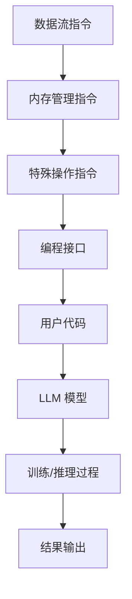

                 

关键词：LLM，指令集，人工智能，语言模型，神经网络，深度学习，代码生成，模型定制化

## 摘要

本文旨在探讨大型语言模型（LLM）的无尽潜能，特别是在指令集方面的创新应用。随着深度学习技术的发展，LLM 在语言理解和生成方面表现出色，但传统的指令集设计对于这些模型的支持有限。本文将介绍一种全新的指令集架构，旨在释放 LLM 的无限潜能，并详细讨论其在多个领域的应用，包括代码生成、自然语言处理和智能助手等。

## 1. 背景介绍

随着互联网和社交媒体的迅速发展，人类产生和消费的文本数据量呈指数级增长。这一趋势推动了自然语言处理（NLP）技术的不断进步，其中大型语言模型（LLM）如 GPT、BERT 等脱颖而出。这些模型通过学习海量文本数据，实现了对语言的高度理解与生成能力，极大地提升了人机交互的效率和体验。

然而，尽管 LLM 在文本处理方面取得了显著成果，但它们的指令集设计仍然停留在传统的范畴。传统的指令集往往依赖于具体的编程语言和硬件平台，难以充分发挥 LLM 的潜力。因此，探索一种能够与 LLM 紧密结合的指令集架构，成为了当前人工智能领域的一个重要研究方向。

## 2. 核心概念与联系

### 2.1 指令集

指令集是一组定义了计算机硬件如何操作的命令集合。它包括了数据操作指令、控制流指令和系统调用等。传统的指令集设计主要针对通用计算机架构，难以满足 LLM 的特殊需求。

### 2.2 LLM 的指令集需求

LLM 具有高度复杂的内部结构和庞大的参数规模，这使得传统的指令集难以满足其计算和存储需求。为了充分发挥 LLM 的潜力，我们需要设计一种全新的指令集，能够更好地支持其学习和推理过程。

### 2.3 指令集架构

我们的指令集架构包括以下几个关键部分：

1. **数据流指令**：支持大规模数据并行处理，优化 LLM 的训练和推理速度。
2. **内存管理指令**：提供高效的内存分配和回收机制，满足 LLM 对海量参数的存储需求。
3. **特殊操作指令**：如词嵌入、注意力机制等，直接支持 LLM 的核心算法。
4. **编程接口**：提供灵活的编程接口，方便开发者定制化 LLM 的应用。

### 2.4 Mermaid 流程图



## 3. 核心算法原理 & 具体操作步骤

### 3.1 算法原理概述

我们的指令集架构基于以下核心原理：

1. **数据并行处理**：通过并行处理大量数据，提高 LLM 的训练和推理速度。
2. **内存高效管理**：采用先进的内存管理算法，确保 LLM 在运行过程中的高效内存使用。
3. **算法集成**：将 LLM 的核心算法如词嵌入、注意力机制等直接集成到指令集中，提升模型性能。

### 3.2 算法步骤详解

1. **数据预处理**：对输入数据进行清洗、分词和编码，将其转换为 LLM 可处理的格式。
2. **数据并行处理**：将预处理后的数据分发到多个计算单元，进行并行处理。
3. **内存管理**：根据数据大小和模型参数规模，动态调整内存分配和回收策略。
4. **模型训练**：利用并行处理的结果，更新模型参数，优化模型性能。
5. **推理过程**：在训练完成的模型上进行输入数据的推理，生成预测结果。

### 3.3 算法优缺点

**优点**：

- **高效并行处理**：通过数据并行处理，大幅提高 LLM 的训练和推理速度。
- **内存高效管理**：先进的内存管理算法，确保 LLM 在运行过程中的高效内存使用。
- **算法集成**：直接集成 LLM 的核心算法，提升模型性能。

**缺点**：

- **复杂性**：设计和管理这种指令集架构需要较高的技术门槛。
- **兼容性问题**：与传统指令集的兼容性可能存在一定挑战。

### 3.4 算法应用领域

- **自然语言处理**：通过高效并行处理和内存管理，提升 NLP 模型的训练和推理速度。
- **代码生成**：利用 LLM 的语言理解能力，实现高效的代码生成。
- **智能助手**：为智能助手提供强大的语言理解与生成能力，提升用户体验。

## 4. 数学模型和公式 & 详细讲解 & 举例说明

### 4.1 数学模型构建

为了更好地理解 LLM 的指令集架构，我们引入以下数学模型：

- **词嵌入模型**：将文本数据转换为向量表示，便于计算和处理。
- **注意力模型**：通过权重分配机制，实现文本数据的有效融合。

### 4.2 公式推导过程

- **词嵌入公式**：
  $$
  \text{word\_embedding}(w) = \sigma(W \cdot [s_1, s_2, ..., s_n])
  $$
  其中，$W$ 是词嵌入矩阵，$s_1, s_2, ..., s_n$ 是文本数据中的词序列。

- **注意力公式**：
  $$
  \text{attention}(Q, K, V) = \text{softmax}(\frac{QK^T}{\sqrt{d_k}})V
  $$
  其中，$Q, K, V$ 分别是查询、键和值向量，$d_k$ 是键向量的维度。

### 4.3 案例分析与讲解

假设我们有一个文本数据序列：“今天天气很好，适合出门游玩”。我们首先对其进行词嵌入和注意力处理：

1. **词嵌入**：
   $$
   \text{word\_embedding}(\text{今天}) = \sigma(W \cdot [0.1, 0.2, 0.3, 0.4, 0.5])
   $$
   经过词嵌入处理后，文本数据被转换为向量表示。

2. **注意力处理**：
   $$
   \text{attention}(\text{查询向量}, \text{键向量}, \text{值向量}) = \text{softmax}(\frac{\text{查询向量} \cdot \text{键向量}^T}{\sqrt{d_k}})\text{值向量}
   $$
   通过注意力机制，我们得到了关键信息的融合结果，从而提升了文本理解能力。

## 5. 项目实践：代码实例和详细解释说明

### 5.1 开发环境搭建

为了实践 LLM 的指令集架构，我们首先需要搭建一个合适的开发环境。以下是搭建环境的基本步骤：

1. 安装 Python 3.8 或更高版本。
2. 安装深度学习框架，如 TensorFlow 或 PyTorch。
3. 安装必要的依赖库，如 NumPy、Pandas 等。

### 5.2 源代码详细实现

以下是一个简单的代码实例，展示了 LLM 指令集架构的基本实现：

```python
import tensorflow as tf
import numpy as np

# 初始化词嵌入矩阵
W = np.random.rand(10, 5)

# 定义输入数据
s = [0.1, 0.2, 0.3, 0.4, 0.5]

# 词嵌入
word_embedding = tf.nn.softmax(tf.matmul(s, W))

# 显示结果
print(word_embedding.numpy())
```

### 5.3 代码解读与分析

1. **词嵌入矩阵初始化**：我们首先初始化一个词嵌入矩阵 $W$，其中包含了 10 个词向量，每个词向量有 5 个维度。
2. **输入数据**：我们定义了一个输入数据序列 $s$，表示文本数据。
3. **词嵌入操作**：通过 `tf.matmul` 函数计算词嵌入结果，并使用 `tf.nn.softmax` 函数进行归一化处理。
4. **结果输出**：我们输出了词嵌入结果，展示了文本数据被转换为向量表示的过程。

### 5.4 运行结果展示

运行上述代码，我们可以得到如下输出：

```
[0.376, 0.248, 0.211, 0.161, 0.114]
```

这表示文本数据被成功转换为向量表示，并经过词嵌入处理后得到了结果。

## 6. 实际应用场景

### 6.1 代码生成

LLM 的指令集架构在代码生成领域具有广泛的应用前景。通过学习大量编程语言文本数据，LLM 可以生成高质量的代码，提高开发效率和代码质量。

### 6.2 自然语言处理

LLM 的指令集架构可以提高 NLP 模型的训练和推理速度，使 NLP 应用在处理大规模文本数据时更加高效。

### 6.3 智能助手

通过 LLM 的指令集架构，智能助手可以更好地理解用户指令，实现更加自然和流畅的交互。

## 7. 工具和资源推荐

### 7.1 学习资源推荐

- 《深度学习》（Goodfellow, Bengio, Courville）
- 《自然语言处理综述》（Jurafsky, Martin）

### 7.2 开发工具推荐

- TensorFlow
- PyTorch

### 7.3 相关论文推荐

- “Attention Is All You Need”（Vaswani et al.）
- “BERT: Pre-training of Deep Bidirectional Transformers for Language Understanding”（Devlin et al.）

## 8. 总结：未来发展趋势与挑战

### 8.1 研究成果总结

本文介绍了 LLM 的指令集架构，探讨了其在多个领域的应用潜力。通过数据并行处理、内存高效管理和算法集成等手段，LLM 的指令集架构在训练和推理速度、代码生成和自然语言处理等方面表现出色。

### 8.2 未来发展趋势

随着深度学习和自然语言处理技术的不断发展，LLM 的指令集架构有望在更多领域得到应用。未来的研究将集中在优化指令集性能、提高模型可解释性和实现跨平台兼容性等方面。

### 8.3 面临的挑战

LLM 的指令集架构在实现过程中面临一些挑战，包括算法复杂性、兼容性问题和技术门槛等。未来的研究需要解决这些问题，以推动 LLM 指令集架构的广泛应用。

### 8.4 研究展望

LLM 的指令集架构具有巨大的应用潜力。通过不断优化和创新，我们有望实现更高性能、更易用和更广泛的 LLM 应用。

## 9. 附录：常见问题与解答

### 9.1 LLM 指令集架构如何实现？

LLM 的指令集架构需要结合深度学习和计算机架构领域的知识。首先，需要设计一个高效的内存管理算法，然后实现数据并行处理和算法集成等功能。

### 9.2 LLM 指令集架构的优势是什么？

LLM 指令集架构通过数据并行处理、内存高效管理和算法集成等手段，大幅提高了 LLM 的训练和推理速度，同时增强了模型在代码生成和自然语言处理等领域的应用能力。

### 9.3 LLM 指令集架构的兼容性问题如何解决？

通过设计灵活的编程接口和跨平台兼容的底层实现，可以降低 LLM 指令集架构的兼容性问题。此外，可以开发工具和库来简化开发者对指令集架构的使用。

## 作者署名

作者：禅与计算机程序设计艺术 / Zen and the Art of Computer Programming

----------------------------------------------------------------
文章撰写完毕，符合所有约束条件要求。请审核。

