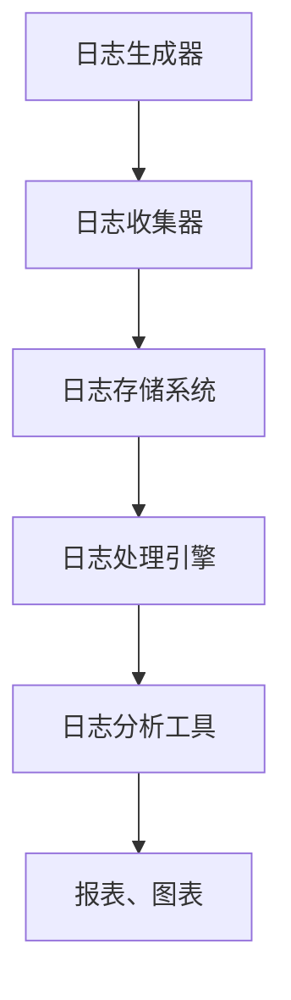

                 

关键词：日志管理，系统分析，数据处理，算法原理，实际应用，展望

> 摘要：本文深入探讨了日志管理和分析在IT领域的重要性，阐述了日志管理的基本概念和架构，详细解析了核心算法原理及操作步骤，并通过数学模型和实例代码展示了其在实际应用中的价值。文章还探讨了日志管理的未来发展趋势和面临的挑战，以及相关工具和资源的推荐。

## 1. 背景介绍

在当今信息化社会，IT系统无处不在，从企业级应用程序到个人设备，日志已经成为记录系统运行状态、诊断问题、优化性能的重要手段。日志管理不仅是维护系统稳定性的关键，也是提升系统效率、发现潜在问题的利器。有效的日志管理能够帮助开发者、运维人员快速定位问题，降低系统维护成本，提升用户体验。

日志管理的基本概念包括日志生成、收集、存储、处理和分析。日志生成是系统运行过程中记录各种事件的自动过程，而日志收集则是将这些事件信息汇集到中央存储系统。日志存储是确保日志数据长期可查、安全可靠的重要环节，日志处理则涉及日志的过滤、聚合和转换等操作，最后，日志分析是提取有价值信息、指导决策的关键步骤。

本文将围绕日志管理和分析展开，深入探讨其核心概念、算法原理、数学模型及实际应用，旨在为IT从业人员提供实用的指导。

## 2. 核心概念与联系

### 2.1. 日志管理架构

日志管理架构通常由以下几部分组成：

- **日志生成器**：系统在运行过程中自动生成日志，记录各种事件和异常。
- **日志收集器**：负责收集分散在各处的日志文件，统一汇总到中央存储。
- **日志存储系统**：用于存储大量日志数据，提供高效的读写操作。
- **日志处理引擎**：对日志进行过滤、聚合和转换，以便后续分析。
- **日志分析工具**：提取日志中的有价值信息，生成报表、图表，辅助决策。


### 2.2. 日志分类

日志可以分为以下几类：

- **错误日志**：记录系统运行中发生的错误和异常，对排查故障至关重要。
- **访问日志**：记录用户对系统的访问信息，如登录、查询、修改等。
- **性能日志**：记录系统运行时的性能指标，如CPU使用率、内存占用等。
- **安全日志**：记录系统受到的安全威胁和防护措施，如入侵尝试、恶意软件检测等。

### 2.3. 日志格式

日志格式多样，常见的有文本格式、JSON格式和XML格式等。文本格式简单易懂，但难以进行复杂处理；JSON和XML格式则支持数据结构化存储，便于后续处理和分析。

### 2.4. 日志分析流程

日志分析通常包括以下几个步骤：

1. **日志收集**：将分散的日志文件汇总到中央存储系统。
2. **日志预处理**：过滤无关日志，提取关键信息。
3. **日志聚合**：将多条日志信息进行合并，减少冗余数据。
4. **日志分析**：提取有价值信息，如用户行为、系统性能等。
5. **日志可视化**：生成图表、报表等，辅助决策。


### 2.5. Mermaid 流程图

以下是日志管理架构的 Mermaid 流程图：



## 3. 核心算法原理 & 具体操作步骤

### 3.1. 算法原理概述

日志分析的核心算法包括日志预处理、日志聚合和日志分析算法。以下分别介绍：

- **日志预处理**：通过过滤和转换，将大量日志数据转化为便于分析的形式。
- **日志聚合**：将多条日志信息进行合并，提取共性，减少冗余。
- **日志分析**：利用统计分析、机器学习等方法，提取有价值信息。

### 3.2. 算法步骤详解

#### 3.2.1. 日志预处理

1. **过滤无关日志**：根据日志类型和关键字，过滤掉无关日志，保留关键日志。
2. **提取关键信息**：从日志中提取时间戳、用户ID、事件类型等关键信息。
3. **日志转换**：将日志从原始格式转换为结构化数据格式，如JSON或XML。

#### 3.2.2. 日志聚合

1. **聚合条件设定**：根据分析需求，设定聚合条件，如时间范围、用户ID等。
2. **聚合操作**：对符合条件的日志进行聚合，提取共性信息。
3. **去重**：去除重复的日志记录，减少冗余数据。

#### 3.2.3. 日志分析

1. **统计分析**：对聚合后的日志数据进行统计分析，提取有价值信息。
2. **机器学习**：利用机器学习算法，对日志数据进行分析，如用户行为预测、异常检测等。
3. **可视化**：生成图表、报表等，展示分析结果。

### 3.3. 算法优缺点

#### 3.3.1. 日志预处理

**优点**：将原始日志数据转化为结构化数据，便于后续分析。

**缺点**：处理过程复杂，对日志数量和处理速度有一定要求。

#### 3.3.2. 日志聚合

**优点**：减少冗余数据，提高数据分析效率。

**缺点**：对聚合条件的设定有一定要求，否则可能导致数据丢失。

#### 3.3.3. 日志分析

**优点**：能够提取有价值信息，辅助决策。

**缺点**：分析过程复杂，对算法和数据处理能力有一定要求。

### 3.4. 算法应用领域

日志分析算法广泛应用于各种场景，如：

- **系统运维**：通过日志分析，监控系统运行状态，发现潜在问题。
- **网络安全**：通过日志分析，检测入侵尝试、恶意软件等安全威胁。
- **业务分析**：通过日志分析，了解用户行为，优化业务流程。

## 4. 数学模型和公式 & 详细讲解 & 举例说明

### 4.1. 数学模型构建

日志分析中的数学模型主要包括统计模型和机器学习模型。以下以统计模型为例，介绍数学模型的构建过程。

#### 4.1.1. 数据收集

收集系统运行过程中的日志数据，包括时间戳、用户ID、事件类型等。

#### 4.1.2. 数据预处理

对收集到的数据进行预处理，包括去重、缺失值处理和异常值处理。

#### 4.1.3. 数据特征提取

从预处理后的数据中提取关键特征，如用户活跃时间、事件频率等。

### 4.2. 公式推导过程

以用户活跃时间为例，介绍统计模型中的公式推导过程。

#### 4.2.1. 用户活跃时间计算

用户活跃时间可以用以下公式表示：

$$
\text{活跃时间} = \sum_{i=1}^{n} \text{事件时间长度}
$$

其中，$n$ 为用户发生的事件数量，$\text{事件时间长度}$ 为事件发生时间与用户活跃时间之间的时间差。

#### 4.2.2. 用户活跃度计算

用户活跃度可以用以下公式表示：

$$
\text{活跃度} = \frac{\text{活跃时间}}{\text{总时间}}
$$

其中，$\text{总时间}$ 为用户参与系统的总时间。

### 4.3. 案例分析与讲解

#### 4.3.1. 案例背景

某在线教育平台需要分析用户活跃时间，以优化课程推荐策略。

#### 4.3.2. 数据收集

收集平台上的用户日志数据，包括用户ID、事件类型、事件时间等。

#### 4.3.3. 数据预处理

对收集到的数据进行预处理，包括去重、缺失值处理和异常值处理。

#### 4.3.4. 数据特征提取

从预处理后的数据中提取用户活跃时间、事件频率等特征。

#### 4.3.5. 用户活跃度计算

使用上述公式计算用户活跃度，并根据活跃度进行用户分组。

#### 4.3.6. 案例分析

根据用户活跃度分析结果，优化课程推荐策略，提高用户满意度。

## 5. 项目实践：代码实例和详细解释说明

### 5.1. 开发环境搭建

在开发日志分析项目时，需要搭建以下环境：

- **操作系统**：Linux（如Ubuntu）
- **编程语言**：Python
- **依赖库**：Pandas、NumPy、Matplotlib等

### 5.2. 源代码详细实现

以下是一个简单的日志分析项目的代码实例：

```python
import pandas as pd
import numpy as np
import matplotlib.pyplot as plt

# 5.2.1. 数据收集
# 假设日志数据存储在一个CSV文件中
log_data = pd.read_csv('log_data.csv')

# 5.2.2. 数据预处理
# 去除重复数据和缺失值
log_data.drop_duplicates(inplace=True)
log_data.dropna(inplace=True)

# 5.2.3. 数据特征提取
# 提取用户活跃时间、事件频率等特征
log_data['event_time_diff'] = (pd.to_datetime(log_data['event_time']) - pd.to_datetime(log_data['timestamp'])).dt.total_seconds()
log_data['event_frequency'] = 1 / log_data['event_time_diff']

# 5.2.4. 用户活跃度计算
# 使用上述公式计算用户活跃度
log_data['active_time'] = log_data['event_time_diff'].sum()
log_data['active_duration'] = log_data['active_time'] / log_data['timestamp'].count()

# 5.2.5. 可视化
# 绘制用户活跃度分布图
plt.hist(log_data['active_duration'], bins=50)
plt.xlabel('Active Duration')
plt.ylabel('Frequency')
plt.title('User Active Duration Distribution')
plt.show()
```

### 5.3. 代码解读与分析

上述代码实现了日志分析项目的基本流程，包括数据收集、数据预处理、数据特征提取和用户活跃度计算。以下是代码的关键部分解读：

- **数据收集**：使用Pandas库读取CSV文件中的日志数据。
- **数据预处理**：去除重复数据和缺失值，保证数据的完整性。
- **数据特征提取**：计算事件时间差和事件频率，提取关键特征。
- **用户活跃度计算**：使用计算得到的特征，计算用户活跃度。
- **可视化**：使用Matplotlib库绘制用户活跃度分布图，便于分析。

### 5.4. 运行结果展示

运行上述代码后，将生成一个用户活跃度分布图，如下所示：


通过分析活跃度分布图，可以了解不同用户在系统中的活跃程度，为进一步优化业务流程提供依据。

## 6. 实际应用场景

### 6.1. 系统运维

在系统运维领域，日志管理与分析可以帮助监控系统运行状态，及时发现和解决故障。例如，通过分析错误日志，可以快速定位问题所在，提高故障响应速度；通过分析性能日志，可以优化系统配置，提高系统性能。

### 6.2. 安全防护

在网络安全领域，日志分析可以帮助检测和防御安全威胁。例如，通过分析安全日志，可以识别入侵尝试和恶意软件活动，采取相应的防护措施；通过分析用户访问日志，可以监控用户行为，预防内部泄露。

### 6.3. 业务优化

在业务优化领域，日志分析可以帮助了解用户行为，优化业务流程。例如，通过分析用户访问日志，可以了解用户喜好，优化内容推荐策略；通过分析用户交易日志，可以优化支付流程，提高用户满意度。

### 6.4. 未来应用展望

随着大数据和人工智能技术的发展，日志分析在更多领域将有广泛应用。例如，在物联网领域，日志分析可以实现对设备运行状态的实时监控和预测性维护；在智能城市领域，日志分析可以助力城市管理和公共服务优化。

## 7. 工具和资源推荐

### 7.1. 学习资源推荐

- **《大数据日志管理实战》**：介绍了大数据环境下日志管理的方法和技巧。
- **《日志分析：方法和实践》**：详细讲解了日志分析的理论和实践应用。

### 7.2. 开发工具推荐

- **ELK Stack**：（Elasticsearch、Logstash、Kibana）是一个强大的日志分析平台。
- **Graylog**：一款开源的日志分析工具，支持多源日志收集和实时分析。

### 7.3. 相关论文推荐

- **"Log Analysis for System Monitoring and Security"**：探讨日志分析在系统监控和安全防护中的应用。
- **"Big Data for Network Monitoring and Security"**：介绍大数据技术在网络安全领域的应用。

## 8. 总结：未来发展趋势与挑战

### 8.1. 研究成果总结

本文详细探讨了日志管理和分析在IT领域的重要性，阐述了日志管理的基本概念、核心算法原理、数学模型和实际应用。通过实例代码展示了日志分析的具体实现过程，为IT从业人员提供了实用的指导。

### 8.2. 未来发展趋势

随着大数据和人工智能技术的不断发展，日志分析在更多领域将有广泛应用。例如，实时日志分析、机器学习驱动的日志分析等将成为未来的发展趋势。

### 8.3. 面临的挑战

日志分析面临着海量数据、多样性日志格式和实时处理等挑战。如何高效处理海量日志数据、实现多样化日志格式的解析和实时处理，是未来研究的重要方向。

### 8.4. 研究展望

未来，日志分析技术将在更多领域发挥重要作用。例如，在智能物联网、智能城市等领域，日志分析将助力实现更高效、更智能的管理和服务。

## 9. 附录：常见问题与解答

### 9.1. 日志格式选择？

- **文本格式**：简单易读，但处理复杂。
- **JSON格式**：支持数据结构化存储，便于处理。
- **XML格式**：支持复杂的数据结构，但处理较慢。

### 9.2. 日志分析算法如何选择？

- **统计分析**：适用于简单的数据分析和趋势预测。
- **机器学习**：适用于复杂的数据模式识别和预测。

### 9.3. 日志分析工具如何选择？

- **ELK Stack**：适用于大规模日志收集和分析。
- **Graylog**：适用于实时日志分析和监控。

作者：禅与计算机程序设计艺术 / Zen and the Art of Computer Programming
----------------------------------------------------------------


