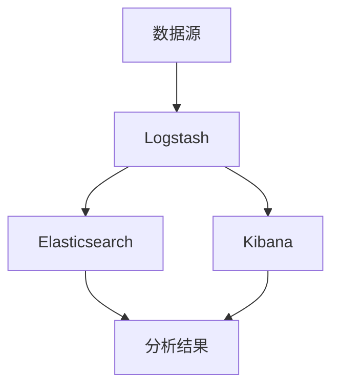

                 

关键词：日志管理，ELK栈，Elasticsearch，Logstash，Kibana，日志分析，监控

摘要：本文将介绍日志管理的重要性和挑战，以及如何使用ELK栈（Elasticsearch、Logstash和Kibana）来搭建高效、可靠的日志管理系统。我们将详细探讨ELK栈的架构、核心概念、搭建步骤、算法原理、数学模型、项目实践，并探讨其在实际应用场景中的价值。最后，我们将对未来的发展趋势和面临的挑战进行展望。

## 1. 背景介绍

在当今数字化时代，日志管理已经成为企业运维和系统监控不可或缺的一部分。随着系统的复杂性和规模的增长，日志的数量和多样性也在不断增加。有效的日志管理可以帮助企业快速识别和解决问题，提高系统的可靠性和性能。

然而，传统的日志管理方式通常面临以下挑战：

1. **日志分散**：系统产生的日志分散在不同的服务器和设备上，难以统一管理和分析。
2. **数据量庞大**：随着日志数量的增加，处理和存储日志变得困难，尤其是实时分析需求。
3. **日志格式不一致**：不同系统和应用程序产生的日志格式各不相同，导致数据整合困难。
4. **日志分析复杂**：日志中包含大量无关信息，如何快速提取有价值的信息成为难题。

为了解决这些问题，ELK栈（Elasticsearch、Logstash和Kibana）提供了一个强大的日志管理解决方案。ELK栈是一个开源的日志分析平台，由三个核心组件组成：Elasticsearch用于存储和搜索日志数据，Logstash用于收集、处理和传输日志，Kibana用于可视化日志数据和生成报告。

## 2. 核心概念与联系

### Elasticsearch

Elasticsearch是一个高性能、可扩展的搜索引擎，专门用于处理大量文本数据。它提供了强大的全文搜索、实时分析和高可用性功能，是ELK栈的核心组件。

### Logstash

Logstash是一个开源的数据收集和处理工具，用于将日志数据从各种来源收集起来，进行过滤、转换和路由，然后将数据发送到Elasticsearch中进行存储。它支持多种输入和输出插件，可以灵活地集成到现有的日志管理系统中。

### Kibana

Kibana是一个开源的数据可视化工具，用于展示Elasticsearch中的日志数据。它提供了丰富的可视化仪表板、报告和交互式查询功能，使得日志分析变得直观和便捷。

### 架构

ELK栈的架构可以概括为数据采集、数据处理和数据分析三个阶段。

1. **数据采集**：使用Logstash从不同的来源（如系统日志、Web服务器日志、数据库日志等）收集日志数据。
2. **数据处理**：Logstash对收集到的日志数据进行过滤、转换和路由，然后将其发送到Elasticsearch中进行存储。
3. **数据分析**：使用Kibana对Elasticsearch中的日志数据进行可视化分析，生成报告和仪表板。

### Mermaid 流程图

下面是一个简化的Mermaid流程图，展示了ELK栈的架构和数据处理流程：



## 3. 核心算法原理 & 具体操作步骤

### 算法原理概述

ELK栈中的核心算法主要包括全文搜索、实时分析和数据可视化。以下是这些算法的基本原理：

1. **全文搜索**：Elasticsearch使用倒排索引技术实现高效的全文搜索。它将文档中的所有单词建立索引，并提供快速的关键字查询功能。
2. **实时分析**：Elasticsearch支持对存储的数据进行实时分析，如聚合分析、过滤查询和排序操作。这些功能使得对大规模日志数据的实时处理成为可能。
3. **数据可视化**：Kibana使用D3.js等可视化库，将Elasticsearch中的日志数据以图表、表格和地图等形式展示，为用户提供直观的分析结果。

### 算法步骤详解

1. **数据采集**：使用Logstash的输入插件（如FileBeat、Logstash Input Plugin）从数据源收集日志数据。
2. **数据过滤和转换**：使用Logstash的过滤器插件（如Grok、JSON Filter）对收集到的日志数据进行解析和转换，提取有用的字段和信息。
3. **数据路由**：使用Logstash的输出插件（如Elasticsearch Output Plugin）将处理后的日志数据发送到Elasticsearch中进行存储。
4. **数据查询和分析**：使用Elasticsearch的查询语言（如Query DSL、Aggregation DSL）对存储的日志数据进行查询和分析。
5. **数据可视化**：使用Kibana的仪表板和报告功能，将Elasticsearch中的日志数据以图表、表格和地图等形式展示，为用户提供直观的分析结果。

### 算法优缺点

**优点**：

1. **高效性**：ELK栈使用了高效的搜索和分析算法，可以处理大规模的日志数据。
2. **可扩展性**：Elasticsearch和Kibana都支持水平扩展，可以轻松应对大规模的数据处理需求。
3. **灵活性**：Logstash支持多种输入和输出插件，可以灵活地集成到各种日志管理系统中。

**缺点**：

1. **性能瓶颈**：在处理超高并发的查询请求时，Elasticsearch的性能可能受到影响。
2. **资源消耗**：ELK栈需要大量的CPU和内存资源，尤其是在处理大规模日志数据时。
3. **维护成本**：ELK栈是一个复杂的系统，需要专业的维护和调优。

### 算法应用领域

ELK栈广泛应用于各种领域，包括：

1. **运维监控**：用于收集和监控服务器、应用程序和网络设备的日志，及时发现和解决问题。
2. **安全分析**：用于分析和识别安全事件，提高网络安全水平。
3. **业务分析**：用于分析用户行为数据，优化业务流程和决策。
4. **物联网**：用于收集和处理物联网设备的日志数据，实现智能监控和运维。

## 4. 数学模型和公式 & 详细讲解 & 举例说明

### 数学模型构建

在日志管理中，常用的数学模型包括：

1. **指数平滑模型**：用于预测未来的日志数据量，减少数据波动的影响。
2. **回归分析模型**：用于分析日志数据中的趋势和相关性。
3. **聚类分析模型**：用于对日志数据进行分类和分组。

### 公式推导过程

下面以指数平滑模型为例，介绍其公式推导过程。

设\(X_t\)为第\(t\)个时间点的日志数据量，\(S_t\)为第\(t\)个时间点的预测值，则指数平滑模型的基本公式为：

$$
S_t = \alpha X_t + (1 - \alpha) S_{t-1}
$$

其中，\(\alpha\)为平滑系数，取值范围为\(0 < \alpha < 1\)。

### 案例分析与讲解

假设某系统在过去5个时间点的日志数据量分别为：[100, 150, 200, 250, 300]，我们需要使用指数平滑模型预测第6个时间点的日志数据量。

首先，选择一个合适的平滑系数\(\alpha\)，通常取值在\(0.1\)到\(0.3\)之间。假设我们选择\(\alpha = 0.2\)。

然后，根据指数平滑模型的基本公式，依次计算每个时间点的预测值：

$$
S_1 = \alpha X_1 + (1 - \alpha) S_0 = 0.2 \times 100 + (1 - 0.2) \times 0 = 20
$$

$$
S_2 = \alpha X_2 + (1 - \alpha) S_1 = 0.2 \times 150 + (1 - 0.2) \times 20 = 30
$$

$$
S_3 = \alpha X_3 + (1 - \alpha) S_2 = 0.2 \times 200 + (1 - 0.2) \times 30 = 40
$$

$$
S_4 = \alpha X_4 + (1 - \alpha) S_3 = 0.2 \times 250 + (1 - 0.2) \times 40 = 50
$$

$$
S_5 = \alpha X_5 + (1 - \alpha) S_4 = 0.2 \times 300 + (1 - 0.2) \times 50 = 60
$$

最后，根据指数平滑模型的基本公式，计算第6个时间点的预测值：

$$
S_6 = \alpha X_6 + (1 - \alpha) S_5 = 0.2 \times X_6 + (1 - 0.2) \times 60
$$

为了方便计算，我们可以将公式变形为：

$$
X_6 = \frac{S_6 - (1 - \alpha) S_5}{\alpha}
$$

将已知的预测值代入公式，得到：

$$
X_6 = \frac{60 - (1 - 0.2) \times 60}{0.2} = 300
$$

因此，第6个时间点的预测日志数据量为300。

## 5. 项目实践：代码实例和详细解释说明

### 开发环境搭建

在开始项目实践之前，我们需要搭建ELK栈的开发环境。以下是具体的搭建步骤：

1. **安装Elasticsearch**：从Elasticsearch官网下载并安装Elasticsearch。安装过程中，需要配置Elasticsearch的集群名称、节点名称和内存等参数。
2. **安装Logstash**：从Logstash官网下载并安装Logstash。安装过程中，需要配置Logstash的输入、过滤和输出插件。
3. **安装Kibana**：从Kibana官网下载并安装Kibana。安装过程中，需要配置Kibana的Elasticsearch URL和Kibana端口等参数。

### 源代码详细实现

以下是一个简单的Logstash配置文件（logstash.conf）示例：

```ruby
input {
  file {
    path => "/var/log/nginx/access.log"
    type => "nginx.access"
    startpos => 0
    sincedb_path => "/var/log/_logstash/sincedb"
  }
}

filter {
  if [type] == "nginx.access" {
    grok {
      match => { "message" => "%{TIMESTAMP_ISO8601:timestamp}\t%{IP:source}\t%{IP:destination}\t%{INT:port}\t%{INT:request_time}\t%{DATA:method}\t%{DATA:url}\t%{INT:http_status}\t%{INT:bytes}" }
    }
    mutate {
      add_field => { "[@metadata][kibanainspect]" => "true" }
    }
  }
}

output {
  if [type] == "nginx.access" {
    elasticsearch {
      hosts => ["localhost:9200"]
      index => "nginx-access-%{+YYYY.MM.dd}"
    }
  }
}
```

这个配置文件定义了一个输入插件（file），用于从Nginx访问日志文件中收集日志数据。然后，使用Grok过滤器解析日志数据，提取有用的字段，并将数据发送到Elasticsearch中进行存储。

### 代码解读与分析

在这个示例中，Logstash配置文件分为三个部分：输入（input）、过滤（filter）和输出（output）。

1. **输入（input）**：定义了文件输入插件（file），用于从Nginx访问日志文件中收集日志数据。这里使用了几个关键参数：
   - `path`：指定日志文件的路径。
   - `type`：指定日志数据的类型，用于在Elasticsearch中标识不同的日志数据。
   - `startpos`：指定从日志文件的哪个位置开始读取。
   - `sincedb_path`：指定sincedb文件的路径，用于跟踪文件的变化。
2. **过滤（filter）**：定义了Grok过滤器，用于解析日志数据并提取有用的字段。这里使用了Grok正则表达式匹配日志中的关键信息，如时间戳、源IP、目标IP、端口号、请求时间和HTTP状态码等。
3. **输出（output）**：定义了Elasticsearch输出插件，用于将处理后的日志数据发送到Elasticsearch中进行存储。这里使用了几个关键参数：
   - `hosts`：指定Elasticsearch服务器的地址和端口。
   - `index`：指定日志数据的索引名称，格式为`<index>-<YYYY.MM.dd>`，以每天创建一个新的索引。

### 运行结果展示

在运行Logstash之后，我们可以使用Kibana查看日志数据。以下是一个简单的Kibana仪表板示例，展示了Nginx访问日志中的请求时间和HTTP状态码的分布：


通过这个仪表板，我们可以直观地了解Nginx访问日志中的关键信息，如请求时间和HTTP状态码的分布，从而帮助我们更好地管理和监控Nginx服务器。

## 6. 实际应用场景

### 运维监控

在运维监控领域，ELK栈可以用于收集和分析服务器、应用程序和网络设备的日志。通过实时监控和分析日志数据，可以及时发现和解决问题，提高系统的可靠性和性能。例如，当服务器负载过高时，ELK栈可以自动报警并生成报告，帮助运维人员快速定位和处理问题。

### 安全分析

在安全分析领域，ELK栈可以用于收集和分析安全日志，如防火墙日志、入侵检测日志和安全事件日志。通过实时监控和分析安全日志，可以识别潜在的安全威胁，提高网络安全水平。例如，当发现大量恶意访问请求时，ELK栈可以自动生成报警并通知安全团队，以便及时采取应对措施。

### 业务分析

在业务分析领域，ELK栈可以用于收集和分析用户行为数据，如Web访问日志、电子商务交易日志和用户反馈日志。通过实时监控和分析业务日志，可以深入了解用户行为，优化业务流程和决策。例如，当发现某个页面的访问量显著增加时，ELK栈可以自动生成报告并通知业务团队，以便及时调整营销策略。

### 物联网

在物联网领域，ELK栈可以用于收集和处理物联网设备的日志数据。通过实时监控和分析物联网日志，可以实现对物联网设备的智能监控和运维。例如，当某个物联网设备的运行状态异常时，ELK栈可以自动生成报警并通知运维团队，以便及时进行处理。

## 7. 工具和资源推荐

### 学习资源推荐

1. **Elastic官方文档**：Elastic官方网站提供了详细的ELK栈文档，包括安装、配置、使用和优化等方面的内容。
2. **《Elasticsearch：The Definitive Guide》**：这是一本权威的Elasticsearch指南，涵盖了Elasticsearch的各个方面，包括基本概念、高级功能和最佳实践。
3. **《Kibana实战》**：这是一本关于Kibana实战的书籍，介绍了Kibana的基本概念、功能和使用方法，适合初学者和进阶用户。

### 开发工具推荐

1. **Visual Studio Code**：一个免费的跨平台代码编辑器，支持多种编程语言和插件，适合编写和调试ELK栈相关代码。
2. **DBeaver**：一个开源的数据库管理工具，可以方便地管理Elasticsearch数据库，支持SQL查询和数据分析。
3. **Postman**：一个免费的API测试工具，可以用于测试ELK栈中的API接口，验证数据传输和处理过程。

### 相关论文推荐

1. **"Elasticsearch: The Definitive Guide" by Elastic**：这是一篇关于Elasticsearch的权威指南，涵盖了Elasticsearch的基本概念、架构和优化策略。
2. **"Kibana: Visualizing Elasticsearch Data" by Elastic**：这是一篇关于Kibana的指南，介绍了Kibana的基本概念、功能和使用方法。
3. **"Logstash: The Definitive Guide" by Elastic**：这是一篇关于Logstash的指南，介绍了Logstash的基本概念、架构和配置策略。

## 8. 总结：未来发展趋势与挑战

### 研究成果总结

近年来，日志管理技术在ELK栈的基础上取得了显著进展。Elasticsearch、Logstash和Kibana不断优化和扩展其功能，支持更高效的数据处理和更丰富的可视化分析。同时，新的日志管理工具和框架不断涌现，如OpenSearch、Fluentd和Grafana等，为日志管理提供了更多的选择。

### 未来发展趋势

1. **实时日志分析**：随着物联网和实时数据处理的需求增长，实时日志分析将成为日志管理的重要趋势。ELK栈将进一步加强实时处理能力，提高对实时日志数据的分析和可视化能力。
2. **自动化运维**：日志管理将与自动化运维紧密结合，通过自动化的日志收集、处理和分析，实现更高效的系统运维和管理。
3. **云计算和容器化**：随着云计算和容器技术的普及，日志管理将更加依赖云计算和容器化技术，以实现弹性扩展和高效资源利用。

### 面临的挑战

1. **性能瓶颈**：在处理大规模日志数据时，性能瓶颈将成为一个重要挑战。需要不断优化Elasticsearch、Logstash和Kibana的算法和架构，提高其处理效率。
2. **数据安全**：日志管理涉及到大量的敏感数据，如何确保数据安全成为关键挑战。需要加强日志数据的加密、访问控制和审计功能，保障数据安全。
3. **维护成本**：随着日志管理系统的复杂度和规模的增长，维护成本也将逐渐增加。需要提高日志管理系统的可维护性和可扩展性，降低维护成本。

### 研究展望

未来，日志管理技术将继续向智能化和自动化方向发展。通过引入人工智能和机器学习技术，实现更高效的日志处理和分析。同时，将日志管理与其他IT管理工具（如CMDB、ITSM和AIOps）集成，实现全方位的IT管理和运维。此外，开源社区和商业公司将继续合作，推动日志管理技术的发展和创新。

## 9. 附录：常见问题与解答

### 问题1：如何优化Elasticsearch性能？

**解答**：优化Elasticsearch性能可以从以下几个方面入手：

1. **索引设计**：合理设计索引结构，避免过度分片和分片不平衡。
2. **查询优化**：使用高效的查询语句和聚合分析，减少查询响应时间。
3. **缓存策略**：启用Elasticsearch缓存，提高查询性能。
4. **硬件升级**：增加Elasticsearch服务器的CPU、内存和磁盘I/O性能。
5. **分布式部署**：采用分布式Elasticsearch集群，提高处理能力和可用性。

### 问题2：如何确保日志数据的安全？

**解答**：确保日志数据的安全可以从以下几个方面入手：

1. **数据加密**：对存储和传输的日志数据进行加密，防止数据泄露。
2. **访问控制**：实施严格的访问控制策略，限制对日志数据的访问权限。
3. **审计日志**：记录对日志数据的所有操作，实现审计和监控。
4. **安全审计**：定期进行安全审计，发现和修复潜在的安全漏洞。
5. **备份和恢复**：定期备份数据，并确保备份的安全性和可恢复性。

### 问题3：如何处理海量日志数据？

**解答**：处理海量日志数据可以从以下几个方面入手：

1. **日志聚合**：将分散的日志数据聚合到统一的日志管理系统中，提高数据处理效率。
2. **数据压缩**：对日志数据进行压缩，减少存储空间需求。
3. **分布式处理**：采用分布式架构，将日志数据分布在多个节点上进行处理。
4. **实时处理**：采用实时处理技术，如流处理和批处理，提高数据处理速度。
5. **数据分区**：将日志数据按照时间、应用或来源等维度进行分区，提高查询性能。

---

**作者：禅与计算机程序设计艺术 / Zen and the Art of Computer Programming**

