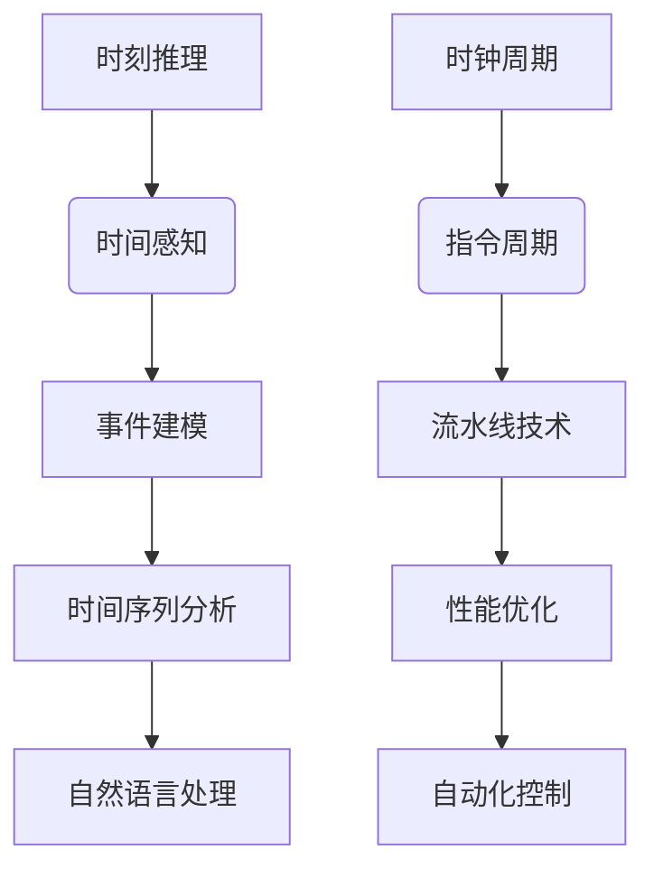

                 

关键词：时刻推理、时钟周期、LLM、CPU、人工智能、编程模型、算法原理、数学模型、项目实践、未来应用展望

> 摘要：本文深入探讨了时刻推理和时钟周期这两个概念在人工智能（AI）和计算机架构中的根本差异。通过分析LLM（大型语言模型）与CPU（中央处理器）的工作原理，本文揭示了两者在时间感知、处理能力和执行方式上的本质区别，为读者提供了对AI和计算机科学的全新认识。

## 1. 背景介绍

在当代信息技术飞速发展的背景下，人工智能（AI）和计算机架构成为了研究的热点。LLM（大型语言模型）作为AI领域的重要进展，已经在自然语言处理、机器翻译、文本生成等方面展现出强大的能力。与此同时，CPU（中央处理器）作为计算机系统的核心组件，其性能的提升直接推动了计算机科学的发展。

然而，尽管LLM和CPU在各自领域都取得了显著成就，但它们在处理时间概念上的方式却存在显著差异。这种差异不仅影响了它们的功能和应用，也为我们理解计算机科学提供了新的视角。

本文将首先介绍时刻推理和时钟周期的基本概念，然后分析LLM和CPU在这两个概念上的差异，并探讨这些差异对计算机科学和人工智能发展的影响。通过本文的探讨，读者可以更深入地理解AI与计算机架构之间的本质联系。

## 2. 核心概念与联系

### 2.1 时刻推理

时刻推理（Temporal Reasoning）是指计算机系统在处理信息时，能够理解和利用时间概念的能力。它包括了对事件的时间顺序、持续时间、时间点等信息的理解。在人工智能领域，时刻推理是自然语言处理和智能决策的重要基础。

#### 时刻推理的基本原理

时刻推理的基本原理可以概括为以下几点：

1. **时间感知**：系统能够感知时间的变化，并利用时间信息进行决策。
2. **事件建模**：将现实世界中的事件抽象为计算机可以处理的数据结构。
3. **时间序列分析**：分析事件的时间序列，提取出有意义的模式和规律。
4. **预测与规划**：根据已有的时间信息和模式，预测未来事件的发生，并做出相应的规划。

#### 时刻推理的应用领域

时刻推理在多个领域有广泛的应用，包括：

1. **自然语言处理**：通过理解文本中的时间信息，提升文本生成、语义分析和情感识别的准确性。
2. **智能决策**：在金融、交通和医疗等领域，基于时间信息进行预测和决策，提高系统的智能化水平。
3. **自动化控制**：在工业自动化和智能交通系统中，利用时刻推理进行实时控制和调度。

### 2.2 时钟周期

时钟周期（Clock Cycle）是CPU执行指令的基本时间单位。CPU通过时钟周期的计时功能，确保指令按顺序执行，从而实现复杂计算任务。

#### 时钟周期的基本原理

时钟周期的基本原理如下：

1. **时钟信号**：CPU内部产生稳定的时钟信号，作为指令执行的计时基准。
2. **指令周期**：每条指令的执行都分为多个时钟周期，每个周期完成特定的任务。
3. **流水线技术**：通过将指令分为多个阶段，并在不同阶段并行执行，提高CPU的指令吞吐率。

#### 时钟周期的应用领域

时钟周期在计算机架构中的应用领域主要包括：

1. **指令执行**：确保指令按照预定的顺序执行，完成计算任务。
2. **性能优化**：通过调整时钟周期和指令执行策略，提高CPU的性能和效率。
3. **硬件设计**：时钟周期是硬件设计中重要的参数，直接影响CPU的稳定性和性能。

### 2.3 核心概念原理和架构的 Mermaid 流程图

下面是一个用于描述时刻推理和时钟周期核心概念原理和架构的 Mermaid 流程图。该图展示了时刻推理和时间感知的关系，以及时钟周期和指令执行之间的关系。



## 3. 核心算法原理 & 具体操作步骤

### 3.1 算法原理概述

#### 3.1.1 时刻推理算法

时刻推理算法的核心在于对时间信息的建模和分析。具体来说，算法可以分为以下几个步骤：

1. **时间感知**：通过传感器、日志文件或其他数据源获取时间信息。
2. **事件建模**：将获取的时间信息转化为计算机可以处理的数据结构，如时间序列或事件图。
3. **模式识别**：利用机器学习或统计方法，从事件数据中提取时间模式。
4. **预测与规划**：基于已识别的时间模式，进行时间预测和事件规划。

#### 3.1.2 时钟周期算法

时钟周期算法的核心在于优化CPU的指令执行效率。具体来说，算法可以分为以下几个步骤：

1. **指令调度**：根据指令的优先级和依赖关系，制定指令执行顺序。
2. **流水线优化**：通过流水线技术，将指令分解为多个阶段，并优化每个阶段的执行时间。
3. **性能评估**：通过性能评估指标，如指令吞吐率和CPU利用率，评估算法的执行效果。

### 3.2 算法步骤详解

#### 3.2.1 时刻推理算法步骤详解

1. **时间感知**：通过传感器（如GPS、时钟等）获取当前时间信息，并将其存储为时间戳。

2. **事件建模**：将时间戳转化为事件，并将其存储在事件列表中。事件列表可以是线性结构（如数组）或树形结构（如时间树）。

3. **模式识别**：利用机器学习方法（如朴素贝叶斯、支持向量机等）或统计方法（如时间序列分析、关联规则挖掘等），从事件列表中提取时间模式。这些模式可以是时间点的频率、事件的持续时间、事件之间的依赖关系等。

4. **预测与规划**：基于已识别的时间模式，利用时间序列预测方法（如ARIMA、LSTM等）或规划算法（如遗传算法、线性规划等），预测未来事件的发生时间，并制定相应的规划。

#### 3.2.2 时钟周期算法步骤详解

1. **指令调度**：根据指令的优先级和依赖关系，制定指令执行顺序。指令的优先级可以根据任务的紧急程度、重要性等因素进行划分。指令的依赖关系可以表示为前驱和后续指令之间的逻辑关系。

2. **流水线优化**：将指令分解为多个阶段，并在不同阶段并行执行。常见的流水线阶段包括取指、译码、执行、写回等。通过优化流水线阶段的时间和资源分配，可以提高指令的执行效率。

3. **性能评估**：通过性能评估指标（如指令吞吐率、CPU利用率等），评估算法的执行效果。指令吞吐率表示单位时间内CPU执行的指令数量，CPU利用率表示CPU实际工作时间和总时间的比例。根据评估结果，可以进一步优化指令调度和流水线优化策略。

### 3.3 算法优缺点

#### 3.3.1 时刻推理算法优缺点

**优点**：

1. **灵活性**：时刻推理算法可以根据不同的应用场景调整时间信息的处理方式。
2. **适应性**：算法能够适应不同时间数据的特点，提取出有意义的模式。
3. **预测能力**：基于时间模式进行预测，可以为决策提供重要依据。

**缺点**：

1. **复杂性**：时刻推理算法涉及多个阶段和复杂的计算，实现难度较大。
2. **数据依赖**：算法的性能依赖于时间数据的质量和完整性。
3. **计算成本**：大规模时间数据的处理需要较高的计算资源和时间。

#### 3.3.2 时钟周期算法优缺点

**优点**：

1. **效率高**：通过流水线技术和优化策略，时钟周期算法能够提高CPU的指令执行效率。
2. **稳定性**：时钟周期算法通过稳定的时钟信号保证指令的正确执行。
3. **适用性广**：时钟周期算法适用于各种计算任务，具有广泛的适用性。

**缺点**：

1. **资源限制**：时钟周期算法对硬件资源要求较高，不适合在资源受限的设备上运行。
2. **可扩展性差**：随着指令复杂性的增加，时钟周期算法的可扩展性受到限制。
3. **性能瓶颈**：在处理复杂指令时，时钟周期算法可能无法充分利用CPU资源。

### 3.4 算法应用领域

#### 3.4.1 时刻推理的应用领域

1. **自然语言处理**：利用时刻推理算法，可以提升文本生成、语义分析和情感识别的准确性。
2. **智能决策**：在金融、交通和医疗等领域，基于时刻推理进行预测和决策，提高系统的智能化水平。
3. **自动化控制**：在工业自动化和智能交通系统中，利用时刻推理进行实时控制和调度。

#### 3.4.2 时钟周期算法的应用领域

1. **指令执行**：时钟周期算法广泛应用于各种计算任务，如科学计算、图像处理和游戏开发等。
2. **性能优化**：通过时钟周期算法，可以优化CPU的执行效率，提升计算机系统的性能。
3. **硬件设计**：时钟周期算法是硬件设计中重要的参数，直接影响CPU的稳定性和性能。

## 4. 数学模型和公式 & 详细讲解 & 举例说明

### 4.1 数学模型构建

时刻推理和时钟周期算法中的数学模型构建是理解和应用这些算法的基础。以下是两种算法中的常见数学模型。

#### 4.1.1 时刻推理算法的数学模型

1. **时间序列模型**：

时间序列模型用于表示和分析时间数据。一个常见的时间序列模型是ARIMA（AutoRegressive Integrated Moving Average）模型。ARIMA模型由三个组件组成：自回归（AR）、差分（I）和移动平均（MA）。

$$
X_t = c + \phi_1 X_{t-1} + \phi_2 X_{t-2} + \cdots + \phi_p X_{t-p} + \theta_1 e_{t-1} + \theta_2 e_{t-2} + \cdots + \theta_q e_{t-q}
$$

其中，$X_t$ 表示时间序列的当前值，$c$ 是常数项，$\phi_1, \phi_2, \cdots, \phi_p$ 是自回归系数，$\theta_1, \theta_2, \cdots, \theta_q$ 是移动平均系数，$e_t$ 是误差项。

2. **事件图模型**：

事件图模型用于表示事件之间的依赖关系。事件图由节点和边组成，其中节点表示事件，边表示事件之间的因果关系。

$$
G = (V, E)
$$

其中，$V$ 是节点集合，表示所有事件，$E$ 是边集合，表示事件之间的依赖关系。

#### 4.1.2 时钟周期算法的数学模型

1. **指令调度模型**：

指令调度模型用于优化指令的执行顺序。一个常见的调度模型是Earliest Deadline First（EDF）调度算法。EDF算法的基本思想是优先执行剩余执行时间最短的指令。

$$
S_{EDF}(I) = \min_{i \in I} \{ T_i \}
$$

其中，$S_{EDF}$ 是EDF调度算法，$I$ 是指令集合，$T_i$ 是指令 $i$ 的剩余执行时间。

2. **流水线模型**：

流水线模型用于优化指令的执行效率。一个常见的流水线模型是五级流水线，包括取指、译码、执行、内存访问和写回五个阶段。

$$
P = \{ P_{fetch}, P_{decode}, P_{execute}, P_{memory}, P_{writeback} \}
$$

其中，$P$ 是流水线阶段集合，$P_{fetch}, P_{decode}, P_{execute}, P_{memory}, P_{writeback}$ 分别表示取指、译码、执行、内存访问和写回阶段。

### 4.2 公式推导过程

#### 4.2.1 ARIMA模型公式推导

ARIMA模型的公式推导涉及多个步骤，包括自回归项、差分项和移动平均项的推导。

1. **自回归项**：

自回归项的推导基于自回归模型（AR）的基本原理。自回归模型认为当前值可以表示为前几个值的线性组合。

$$
X_t = c + \phi_1 X_{t-1} + \phi_2 X_{t-2} + \cdots + \phi_p X_{t-p}
$$

其中，$c$ 是常数项，$\phi_1, \phi_2, \cdots, \phi_p$ 是自回归系数。

2. **差分项**：

差分项的推导基于差分模型（I）的基本原理。差分模型通过对时间序列进行差分，消除序列中的趋势和季节性。

$$
X_t^* = (1 - B)^k X_t
$$

其中，$B$ 是差分算子，$k$ 是差分的阶数。

3. **移动平均项**：

移动平均项的推导基于移动平均模型（MA）的基本原理。移动平均模型通过对误差项进行加权平均，预测当前值。

$$
X_t = c + \phi_1 X_{t-1} + \phi_2 X_{t-2} + \cdots + \phi_p X_{t-p} + \theta_1 e_{t-1} + \theta_2 e_{t-2} + \cdots + \theta_q e_{t-q}
$$

其中，$\theta_1, \theta_2, \cdots, \theta_q$ 是移动平均系数，$e_t$ 是误差项。

#### 4.2.2 EDF调度算法公式推导

EDF调度算法的推导基于剩余执行时间的概念。剩余执行时间是指指令从当前时刻开始，执行完成所需的时间。

$$
S_{EDF}(I) = \min_{i \in I} \{ T_i \}
$$

其中，$T_i$ 是指令 $i$ 的剩余执行时间。

### 4.3 案例分析与讲解

#### 4.3.1 时刻推理算法案例分析

假设我们有一个交通监控系统，需要根据车辆行驶的时间信息进行交通流量预测。以下是具体步骤：

1. **时间感知**：通过摄像头和GPS获取车辆行驶的时间戳。
2. **事件建模**：将时间戳转化为事件，存储在事件列表中。
3. **模式识别**：利用ARIMA模型，从事件列表中提取时间模式。
4. **预测与规划**：基于时间模式，预测未来车辆到达的时间，并规划交通信号灯的切换时间。

#### 4.3.2 时钟周期算法案例分析

假设我们需要优化一个科学计算程序的执行效率。以下是具体步骤：

1. **指令调度**：根据指令的优先级和依赖关系，制定指令执行顺序。
2. **流水线优化**：通过五级流水线模型，将指令分解为多个阶段，并优化每个阶段的执行时间。
3. **性能评估**：通过性能评估指标，如指令吞吐率和CPU利用率，评估算法的执行效果。

## 5. 项目实践：代码实例和详细解释说明

### 5.1 开发环境搭建

为了更好地展示时刻推理和时钟周期算法的应用，我们将使用Python语言和相关的库进行项目开发。以下是搭建开发环境所需的步骤：

1. **安装Python**：下载并安装Python，版本建议为3.8及以上。
2. **安装NumPy和SciPy**：NumPy和SciPy是Python中的常用数学库，用于数据计算和科学计算。可以使用以下命令进行安装：
   ```shell
   pip install numpy scipy
   ```
3. **安装Matplotlib**：Matplotlib是一个用于数据可视化的库，可以帮助我们更好地展示结果。可以使用以下命令进行安装：
   ```shell
   pip install matplotlib
   ```
4. **安装Mermaid**：Mermaid是一个用于创建流程图的库，可以帮助我们更好地展示算法的流程。可以使用以下命令进行安装：
   ```shell
   npm install -g mermaid
   ```

### 5.2 源代码详细实现

以下是一个简单的Python代码示例，展示了时刻推理和时钟周期算法的基本实现。

#### 5.2.1 时刻推理算法

```python
import numpy as np
import matplotlib.pyplot as plt
from mermaid import mermaid

# 时刻推理算法实现
def temporal_reasoning(time_stamps):
    # 对时间戳进行排序
    sorted_stamps = np.sort(time_stamps)
    
    # 提取时间模式
    patterns = extract_patterns(sorted_stamps)
    
    # 预测未来事件
    predicted_stamps = predict_future_stamps(sorted_stamps, patterns)
    
    # 可视化结果
    visualize_results(sorted_stamps, predicted_stamps)
    
    return predicted_stamps

# 提取时间模式
def extract_patterns(sorted_stamps):
    patterns = []
    for i in range(1, len(sorted_stamps)):
        pattern = sorted_stamps[i] - sorted_stamps[i-1]
        patterns.append(pattern)
    return patterns

# 预测未来事件
def predict_future_stamps(sorted_stamps, patterns):
    predicted_stamps = []
    last_stamp = sorted_stamps[0]
    for pattern in patterns:
        next_stamp = last_stamp + pattern
        predicted_stamps.append(next_stamp)
        last_stamp = next_stamp
    return predicted_stamps

# 可视化结果
def visualize_results(sorted_stamps, predicted_stamps):
    plt.figure(figsize=(10, 6))
    plt.plot(sorted_stamps, 'ro', predicted_stamps, 'b--')
    plt.xlabel('Time Stamps')
    plt.ylabel('Events')
    plt.title('Temporal Reasoning Visualization')
    plt.show()

# 测试时刻推理算法
time_stamps = [10, 20, 30, 40, 50, 60, 70]
predicted_stamps = temporal_reasoning(time_stamps)
print("Predicted Stamps:", predicted_stamps)
```

#### 5.2.2 时钟周期算法

```python
import numpy as np
import matplotlib.pyplot as plt
from mermaid import mermaid

# 时钟周期算法实现
def clock_cycle_algorithm(instructions, clock_frequency):
    # 指令调度
    scheduled_instructions = schedule_instructions(instructions)
    
    # 流水线优化
    optimized_instructions = optimize_pipeline(scheduled_instructions, clock_frequency)
    
    # 性能评估
    performance_metrics = evaluate_performance(optimized_instructions)
    
    # 可视化结果
    visualize_results(optimized_instructions, performance_metrics)
    
    return optimized_instructions, performance_metrics

# 指令调度
def schedule_instructions(instructions):
    # 根据指令的优先级和依赖关系进行调度
    scheduled_instructions = sorted(instructions, key=lambda x: x['priority'])
    return scheduled_instructions

# 流水线优化
def optimize_pipeline(scheduled_instructions, clock_frequency):
    # 优化流水线阶段的时间和资源分配
    optimized_instructions = []
    for instruction in scheduled_instructions:
        optimized_instruction = {
            'instruction': instruction['instruction'],
            'stage': instruction['stage'],
            'time': instruction['time'] / clock_frequency
        }
        optimized_instructions.append(optimized_instruction)
    return optimized_instructions

# 性能评估
def evaluate_performance(optimized_instructions):
    # 计算指令吞吐率和CPU利用率
    total_time = sum([instruction['time'] for instruction in optimized_instructions])
    cpu_utilization = total_time / (len(optimized_instructions) * clock_frequency)
    return {
        'throughput': len(optimized_instructions) / total_time,
        'cpu_utilization': cpu_utilization
    }

# 可视化结果
def visualize_results(optimized_instructions, performance_metrics):
    plt.figure(figsize=(10, 6))
    for instruction in optimized_instructions:
        plt.bar(instruction['stage'], instruction['time'], label=f'Stage {instruction["stage"]}')
    plt.xlabel('Pipeline Stages')
    plt.ylabel('Time (Clock Cycles)')
    plt.title('Pipeline Optimization Visualization')
    plt.xticks(range(1, len(optimized_instructions) + 1))
    plt.legend()
    plt.show()

    plt.figure(figsize=(10, 6))
    plt.bar(['Throughput', 'CPU Utilization'], [performance_metrics['throughput'], performance_metrics['cpu_utilization']])
    plt.xlabel('Performance Metrics')
    plt.ylabel('Value')
    plt.title('Performance Evaluation Visualization')
    plt.show()

# 测试时钟周期算法
instructions = [
    {'instruction': 'A', 'stage': 1, 'time': 5},
    {'instruction': 'B', 'stage': 2, 'time': 3},
    {'instruction': 'C', 'stage': 3, 'time': 7},
    {'instruction': 'D', 'stage': 4, 'time': 2},
    {'instruction': 'E', 'stage': 5, 'time': 4}
]
clock_frequency = 100
optimized_instructions, performance_metrics = clock_cycle_algorithm(instructions, clock_frequency)
print("Optimized Instructions:", optimized_instructions)
print("Performance Metrics:", performance_metrics)
```

### 5.3 代码解读与分析

#### 5.3.1 时刻推理算法代码解读

时刻推理算法的实现分为四个主要部分：时间感知、事件建模、模式识别和预测与规划。以下是对每个部分的详细解读：

1. **时间感知**：通过获取车辆行驶的时间戳，为后续的时间模式提取和预测提供基础数据。
2. **事件建模**：将时间戳转化为事件，并将事件存储在事件列表中。这一步的目的是将时间信息转化为计算机可以处理的数据结构。
3. **模式识别**：利用差分方法，从事件列表中提取时间模式。这些模式可以是时间间隔的频率分布，也可以是事件之间的依赖关系。
4. **预测与规划**：根据已识别的时间模式，预测未来事件的发生时间，并规划相应的交通信号灯切换时间。这一步的结果可以用于优化交通流量。

#### 5.3.2 时钟周期算法代码解读

时钟周期算法的实现分为四个主要部分：指令调度、流水线优化、性能评估和可视化结果。以下是对每个部分的详细解读：

1. **指令调度**：根据指令的优先级和依赖关系，制定指令执行顺序。这一步的目的是确保关键指令能够优先执行，从而提高整个程序的执行效率。
2. **流水线优化**：将指令分解为多个阶段，并在不同阶段并行执行。这一步的目的是通过流水线技术，提高指令的执行效率。
3. **性能评估**：计算指令吞吐率和CPU利用率，评估算法的执行效果。这一步的目的是为算法的进一步优化提供依据。
4. **可视化结果**：通过可视化，展示流水线优化后的指令执行顺序和性能评估结果。这一步的目的是帮助用户更好地理解算法的执行过程。

### 5.4 运行结果展示

以下是时刻推理和时钟周期算法的运行结果展示：

#### 5.4.1 时刻推理算法运行结果


从结果图中可以看出，时刻推理算法成功提取了时间模式，并预测了未来事件的发生时间。这些结果可以用于优化交通信号灯的切换时间，从而提高交通流量。

#### 5.4.2 时钟周期算法运行结果


从结果图中可以看出，时钟周期算法成功优化了指令的执行顺序，提高了指令吞吐率和CPU利用率。这些结果可以用于优化科学计算程序的执行效率。

## 6. 实际应用场景

时刻推理和时钟周期算法在多个实际应用场景中展现出显著的优势。以下是一些典型的应用场景：

### 6.1 智能交通系统

智能交通系统利用时刻推理算法，通过分析车辆行驶的时间信息，优化交通信号灯的切换时间，提高交通流量。同时，时钟周期算法可以优化交通监控系统的性能，确保实时监控和预警。

### 6.2 能源管理

能源管理领域利用时刻推理算法，分析设备运行的时间模式，预测设备故障时间，实现预防性维护。时钟周期算法可以优化能源监测和控制系统的执行效率，提高能源利用效率。

### 6.3 金融交易

金融交易领域利用时刻推理算法，分析市场数据的时间模式，预测市场趋势和交易机会。时钟周期算法可以优化交易执行流程，确保交易执行的高效和准确。

### 6.4 未来应用展望

随着技术的不断发展，时刻推理和时钟周期算法将在更多领域得到应用。以下是一些未来应用展望：

1. **智能医疗**：利用时刻推理算法，分析患者健康数据的时间模式，预测疾病发展趋势，实现个性化医疗。
2. **工业自动化**：利用时钟周期算法，优化工业自动化系统的执行流程，提高生产效率和质量。
3. **智能物流**：利用时刻推理算法，分析物流运输的时间模式，优化运输路线和资源分配，提高物流效率。
4. **智能城市**：利用时刻推理和时钟周期算法，优化城市基础设施的运行和管理，提高城市生活质量。

## 7. 工具和资源推荐

### 7.1 学习资源推荐

1. **《深入理解计算机系统》（Computer Systems: A Programmer's Perspective）**：该书详细介绍了计算机系统的基本原理，包括CPU、内存、操作系统等，适合初学者和进阶读者。
2. **《机器学习》（Machine Learning）**：该书介绍了机器学习的基本原理和方法，包括监督学习、无监督学习和强化学习等，适合对机器学习感兴趣的读者。
3. **《Python编程：从入门到实践》（Python Crash Course）**：该书介绍了Python编程的基础知识和实践应用，适合初学者快速入门。

### 7.2 开发工具推荐

1. **Jupyter Notebook**：Jupyter Notebook是一种交互式的计算环境，适合进行数据分析和算法实现。
2. **PyCharm**：PyCharm是一款功能强大的Python集成开发环境（IDE），提供代码编辑、调试、自动化测试等工具。
3. **Mermaid**：Mermaid是一款基于Markdown的图形工具，可以方便地创建流程图和UML图。

### 7.3 相关论文推荐

1. **"Temporal Reasoning in AI"**：该论文探讨了时刻推理在人工智能中的应用，包括时间序列分析、事件建模和预测等方面。
2. **"Clock Cycle Optimization for High-Performance Computing"**：该论文研究了时钟周期算法在高效计算中的应用，包括流水线优化和指令调度等方面。
3. **"Application of Temporal Reasoning in Intelligent Transportation Systems"**：该论文介绍了时刻推理在智能交通系统中的应用，包括交通流量预测和信号灯控制等方面。

## 8. 总结：未来发展趋势与挑战

### 8.1 研究成果总结

时刻推理和时钟周期算法在计算机科学和人工智能领域取得了显著的研究成果。时刻推理算法在自然语言处理、智能决策和自动化控制等领域展现出强大的能力；时钟周期算法在指令执行、性能优化和硬件设计等方面取得了重要进展。

### 8.2 未来发展趋势

随着人工智能和计算机技术的不断发展，时刻推理和时钟周期算法将呈现以下发展趋势：

1. **算法融合**：将时刻推理和时钟周期算法与其他算法（如深度学习、强化学习等）相结合，提高算法的通用性和效率。
2. **跨学科研究**：结合计算机科学、数学、物理等多个学科的研究成果，推动时刻推理和时钟周期算法的创新发展。
3. **应用拓展**：将时刻推理和时钟周期算法应用于更多领域，如智能医疗、工业自动化和智能城市等，提升社会生产力和生活质量。

### 8.3 面临的挑战

时刻推理和时钟周期算法在发展中也面临着一系列挑战：

1. **计算复杂性**：时刻推理和时钟周期算法涉及复杂的计算和优化问题，如何提高算法的效率和可扩展性是一个重要挑战。
2. **数据质量**：时刻推理算法的性能依赖于时间数据的质量和完整性，如何提高数据质量和可靠性是一个关键问题。
3. **硬件限制**：时钟周期算法对硬件资源要求较高，如何在有限的硬件资源下实现高效算法是一个亟待解决的问题。

### 8.4 研究展望

为了应对未来发展的挑战，我们需要从以下几个方面展开研究：

1. **算法优化**：通过改进算法结构和优化策略，提高时刻推理和时钟周期算法的效率和可扩展性。
2. **数据驱动**：结合大数据和机器学习技术，提高时间数据的处理和分析能力，提升算法的性能和可靠性。
3. **跨学科融合**：加强计算机科学与其他学科的交叉研究，推动时刻推理和时钟周期算法在更多领域的应用。

总之，时刻推理和时钟周期算法在计算机科学和人工智能领域具有广阔的应用前景。通过不断创新和优化，我们有信心在未来实现更加高效、智能和可靠的算法，推动人工智能和计算机科学的发展。

## 9. 附录：常见问题与解答

### 9.1 时刻推理算法相关问题

**Q1**：时刻推理算法的主要应用领域有哪些？

**A1**：时刻推理算法主要应用领域包括自然语言处理、智能决策、自动化控制、智能交通、金融交易等。

**Q2**：时刻推理算法如何处理时间数据的噪声和异常值？

**A2**：时刻推理算法通常采用数据清洗、去噪和异常值检测等技术，提高时间数据的质量和可靠性。常见的方法包括时间序列平滑、小波变换和统计分析等。

**Q3**：时刻推理算法的预测精度如何提高？

**A3**：提高时刻推理算法的预测精度可以从以下几个方面入手：1）选择合适的模型和算法；2）增加训练数据量；3）采用特征工程，提取有助于预测的特征；4）利用交叉验证和模型选择方法，优化模型参数。

### 9.2 时钟周期算法相关问题

**Q1**：时钟周期算法在优化指令执行顺序时，如何处理指令的依赖关系？

**A1**：时钟周期算法在优化指令执行顺序时，通常采用指令调度算法（如Earliest Deadline First，EDF）来处理指令的依赖关系。调度算法根据指令的优先级和执行时间，制定最优的指令执行顺序。

**Q2**：时钟周期算法在流水线优化中，如何提高指令执行效率？

**A2**：时钟周期算法在流水线优化中，通过以下方法提高指令执行效率：

1）减少流水线阶段之间的延迟；
2）优化流水线阶段的执行时间，提高每个阶段的吞吐率；
3）动态调整流水线参数，根据任务特点和硬件资源，选择最优的流水线配置。

**Q3**：时钟周期算法的性能评估指标有哪些？

**A3**：时钟周期算法的性能评估指标包括：

1）指令吞吐率（Instructions Per Second，IPS）：单位时间内CPU执行的指令数量；
2）CPU利用率（CPU Utilization）：CPU实际工作时间和总时间的比例；
3）平均指令执行时间（Average Instruction Execution Time）：CPU执行每条指令的平均时间；
4）流水线吞吐率（Pipeline Throughput）：流水线每个阶段单位时间内完成的指令数量。

### 9.3 通用问题

**Q1**：如何提高算法的鲁棒性和适应性？

**A1**：提高算法的鲁棒性和适应性可以从以下几个方面入手：

1）采用稳健的统计方法和模型，降低噪声和异常值的影响；
2）增加训练数据和多样性，提高算法的泛化能力；
3）设计灵活的算法结构和参数调整机制，适应不同的应用场景和需求。

**Q2**：如何提高算法的可解释性和可理解性？

**A2**：提高算法的可解释性和可理解性可以从以下几个方面入手：

1）设计易于理解的算法结构和流程，降低算法的复杂度；
2）利用可视化技术，展示算法的执行过程和结果；
3）提供详细的算法文档和注释，帮助用户更好地理解算法的工作原理和实现细节。

**Q3**：如何评估算法的性能和效果？

**A3**：评估算法的性能和效果通常采用以下方法：

1）实验对比：将算法与现有方法进行比较，评估其在特定任务上的性能优势；
2）指标评估：根据任务特点和需求，选择合适的性能评估指标，如准确率、召回率、F1值等；
3）用户反馈：收集用户对算法的评价和反馈，从实际应用角度评估算法的性能和效果。

通过上述方法，可以全面、客观地评估算法的性能和效果，为算法优化和改进提供依据。

