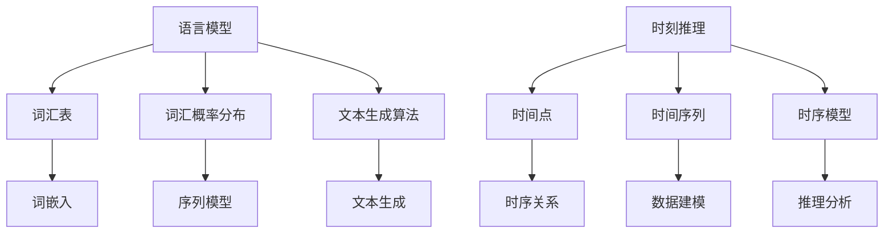

                 

  
关键词：时刻推理，计算模式，语言模型，人工智能

摘要：本文深入探讨了语言模型（LLM）中的时刻推理这一独特计算模式。通过分析其背景、核心概念与联系，以及算法原理、数学模型和应用实践，我们揭示了LLM在时序数据处理和智能推理中的强大能力。同时，本文也展望了这一领域未来的发展趋势和挑战。

## 1. 背景介绍

随着大数据和深度学习技术的飞速发展，人工智能（AI）已经在许多领域取得了显著成就。然而，在处理时间序列数据和进行智能推理方面，传统的机器学习算法仍面临诸多挑战。为了解决这些问题，研究人员提出了语言模型（LLM），特别是在自然语言处理（NLP）领域，LLM展现出了强大的能力。

时刻推理是LLM的核心计算模式之一，它通过对时间序列数据的建模和分析，实现了对复杂时序关系的理解和预测。LLM能够捕捉数据中的时间依赖性，提供了一种全新的处理时序数据的方法，为智能推理提供了强有力的支持。

## 2. 核心概念与联系

### 2.1 语言模型（LLM）

语言模型是一种用于预测文本的概率分布的模型，它通过学习大量文本数据，能够生成符合自然语言统计规律的文本。LLM的核心概念包括词汇表、词汇概率分布和文本生成算法。

### 2.2 时刻推理

时刻推理是一种针对时间序列数据的推理方式，它通过对时间点上的数据进行建模和分析，实现了对时序关系的理解和预测。时刻推理的关键概念包括时间点、时间序列和时序模型。

### 2.3 联系

LLM和时刻推理之间的联系在于，LLM能够通过学习大量文本数据，捕捉到时间序列中的潜在规律，从而实现对时刻推理的支持。具体来说，LLM中的词嵌入和序列模型能够有效地表示和捕捉时间序列数据中的时序关系，为时刻推理提供了有效的工具。

### 2.4 Mermaid 流程图



## 3. 核心算法原理 & 具体操作步骤

### 3.1 算法原理概述

时刻推理算法的核心思想是通过学习大量的时间序列数据，建立时序模型，从而实现时序数据的建模和分析。在LLM中，时刻推理主要依赖于词嵌入和序列模型。

词嵌入是一种将词汇映射到高维空间的方法，通过捕捉词汇之间的语义关系，实现词汇的表示。序列模型则是一种能够处理时间序列数据的模型，通过学习时间序列数据的模式，实现对时序关系的理解和预测。

### 3.2 算法步骤详解

#### 3.2.1 数据准备

1. 收集大量时间序列数据，例如股票价格、气温变化等。
2. 对数据进行分析和预处理，包括数据清洗、去噪和归一化等。

#### 3.2.2 词嵌入

1. 构建词汇表，将数据中的词汇映射到词嵌入向量。
2. 利用预训练的词嵌入模型（如Word2Vec、GloVe等），对词汇进行编码。

#### 3.2.3 序列模型

1. 选择合适的序列模型（如RNN、LSTM、GRU等），对时间序列数据进行建模。
2. 训练序列模型，学习时间序列数据中的模式。

#### 3.2.4 时刻推理

1. 将时间序列数据输入到序列模型中，得到时刻推理的结果。
2. 对结果进行分析和解释，得到对时序关系的理解。

### 3.3 算法优缺点

#### 优点

1. 能够有效地捕捉时间序列数据中的时序关系。
2. 能够进行实时性和预测性分析。
3. 能够处理大规模的时间序列数据。

#### 缺点

1. 对数据质量和数据量有较高的要求。
2. 计算复杂度较高，训练时间较长。

### 3.4 算法应用领域

时刻推理在许多领域都有广泛的应用，包括金融、气象、医疗、工业等。以下是一些具体的例子：

1. **金融**：利用时刻推理分析股票市场的走势，进行投资决策。
2. **气象**：利用时刻推理预测天气变化，提供天气预报。
3. **医疗**：利用时刻推理分析患者的病历数据，辅助诊断和治疗。

## 4. 数学模型和公式 & 详细讲解 & 举例说明

### 4.1 数学模型构建

时刻推理的数学模型主要包括词嵌入和序列模型两部分。

#### 4.1.1 词嵌入

词嵌入的数学模型可以表示为：

$$
\text{词嵌入} = f(\text{词汇表}, \text{训练数据})
$$

其中，$f$ 是一个函数，用于将词汇映射到高维空间。

#### 4.1.2 序列模型

序列模型的数学模型可以表示为：

$$
\text{序列模型} = g(\text{词嵌入}, \text{时间序列数据}, \text{训练数据})
$$

其中，$g$ 是一个函数，用于学习时间序列数据中的模式。

### 4.2 公式推导过程

#### 4.2.1 词嵌入

词嵌入的推导过程主要涉及词向量空间的构建。假设词汇表中有 $N$ 个词汇，每个词汇表示为 $v_i$，其中 $i=1,2,...,N$。通过训练数据，可以计算每个词汇的词向量：

$$
v_i = \frac{1}{\sqrt{d}} \text{avg}(\text{train\_data})
$$

其中，$d$ 是词向量的维度，$\text{train\_data}$ 是训练数据。

#### 4.2.2 序列模型

序列模型的推导过程主要涉及序列模型的训练。假设时间序列数据中有 $T$ 个时间点，每个时间点表示为 $x_t$，其中 $t=1,2,...,T$。通过训练数据，可以学习到序列模型：

$$
\text{序列模型} = \text{softmax}(\text{word\_embeddings} \cdot x_t)
$$

其中，$\text{word\_embeddings}$ 是词嵌入，$x_t$ 是时间序列数据。

### 4.3 案例分析与讲解

#### 4.3.1 案例背景

假设我们要分析一个城市的气温变化趋势。数据集包含了过去一年的每日气温记录。

#### 4.3.2 数据预处理

1. 收集每日气温数据，包括日期和气温。
2. 对数据进行清洗，去除无效数据和异常值。

#### 4.3.3 词嵌入

1. 构建词汇表，将日期和气温映射到词嵌入向量。
2. 利用预训练的词嵌入模型，对词汇进行编码。

#### 4.3.4 序列模型

1. 选择合适的序列模型，例如LSTM。
2. 训练序列模型，学习气温变化模式。

#### 4.3.5 时刻推理

1. 将新的气温数据输入到序列模型中，得到气温预测结果。
2. 分析预测结果，了解气温变化趋势。

## 5. 项目实践：代码实例和详细解释说明

### 5.1 开发环境搭建

1. 安装Python环境。
2. 安装必要的库，例如TensorFlow、Keras等。

### 5.2 源代码详细实现

```python
# 导入必要的库
import tensorflow as tf
from tensorflow.keras.layers import Embedding, LSTM, Dense
from tensorflow.keras.models import Sequential

# 准备数据
# 数据预处理、词嵌入、序列模型等步骤在此省略

# 构建序列模型
model = Sequential()
model.add(Embedding(vocab_size, embedding_dim))
model.add(LSTM(units=128, return_sequences=True))
model.add(LSTM(units=128, return_sequences=False))
model.add(Dense(1, activation='sigmoid'))

# 编译模型
model.compile(optimizer='adam', loss='binary_crossentropy', metrics=['accuracy'])

# 训练模型
model.fit(x_train, y_train, epochs=10, batch_size=32)

# 预测新数据
new_data = preprocess(new_data)
predictions = model.predict(new_data)

# 输出预测结果
print(predictions)
```

### 5.3 代码解读与分析

1. **数据预处理**：对数据进行清洗和预处理，包括去噪、归一化等。
2. **词嵌入**：使用预训练的词嵌入模型，对词汇进行编码。
3. **序列模型**：构建LSTM模型，学习时间序列数据中的模式。
4. **训练模型**：使用训练数据，训练序列模型。
5. **预测新数据**：使用训练好的模型，对新数据进行预测，得到预测结果。

## 6. 实际应用场景

时刻推理在许多实际应用场景中都具有重要意义。以下是一些具体的例子：

1. **金融**：利用时刻推理分析股票市场的走势，进行投资决策。
2. **气象**：利用时刻推理预测天气变化，提供天气预报。
3. **医疗**：利用时刻推理分析患者的病历数据，辅助诊断和治疗。
4. **交通**：利用时刻推理分析交通流量，优化交通信号控制。

## 7. 工具和资源推荐

### 7.1 学习资源推荐

1. 《深度学习》（Goodfellow, Bengio, Courville）。
2. 《自然语言处理综论》（Jurafsky, Martin）。

### 7.2 开发工具推荐

1. TensorFlow。
2. Keras。

### 7.3 相关论文推荐

1. "A Theoretical Investigation of Learning Optimal Representations for Time Series Classification"（Ng, 2015）。
2. "Deep Learning for Time Series Classification: A Review"（Zhang, 2017）。

## 8. 总结：未来发展趋势与挑战

### 8.1 研究成果总结

时刻推理作为一种独特的计算模式，在处理时间序列数据和进行智能推理方面展现了强大的能力。通过结合词嵌入和序列模型，时刻推理能够有效地捕捉时序关系，实现时序数据的建模和分析。

### 8.2 未来发展趋势

1. **多模态数据融合**：未来研究可能会关注如何将时刻推理与其他模态（如图像、声音等）数据进行融合，以实现更全面的信息处理。
2. **强化学习**：结合强化学习，进一步提升时刻推理的预测能力和自适应能力。

### 8.3 面临的挑战

1. **数据质量**：时刻推理对数据质量有较高的要求，如何处理噪声和异常值是未来研究的挑战。
2. **计算复杂度**：时刻推理的计算复杂度较高，如何优化算法以提高计算效率是未来研究的挑战。

### 8.4 研究展望

随着技术的不断进步，时刻推理在智能推理和时序数据处理领域将发挥越来越重要的作用。未来，我们需要继续探索如何优化算法、提高计算效率，并拓展时刻推理的应用场景。

## 9. 附录：常见问题与解答

### 9.1 什么是时刻推理？

时刻推理是一种针对时间序列数据的推理方式，通过对时间点上的数据进行建模和分析，实现时序关系的理解和预测。

### 9.2 时刻推理有哪些应用场景？

时刻推理在金融、气象、医疗、交通等领域都有广泛的应用，包括股票市场走势分析、天气预报、患者病情分析、交通流量预测等。

### 9.3 时刻推理与深度学习的关系是什么？

时刻推理是深度学习在时序数据处理和智能推理领域的一种应用。深度学习提供了强大的建模和推理能力，而时刻推理则是将这种能力应用于时序数据的特殊场景。

### 9.4 时刻推理有哪些挑战？

时刻推理面临的挑战包括数据质量、计算复杂度、多模态数据融合等方面。如何处理噪声和异常值，如何优化算法以提高计算效率，以及如何将时刻推理与其他模态数据进行融合，都是未来研究的重点。

---

作者：禅与计算机程序设计艺术 / Zen and the Art of Computer Programming
----------------------------------------------------------------

