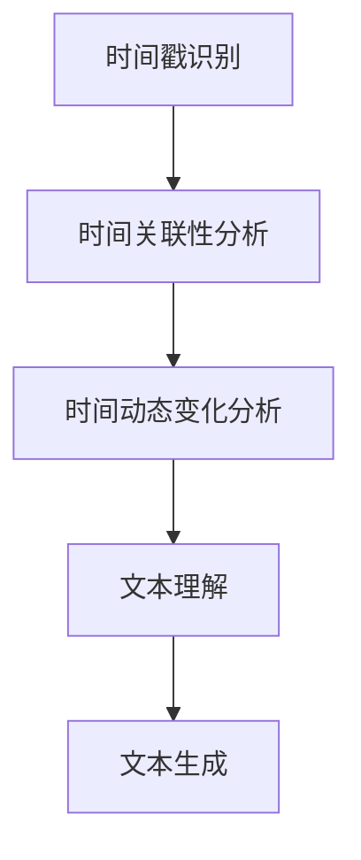

                 

关键词：LLM计算、时刻推理、推理算法、人工智能、自然语言处理

> 摘要：本文深入探讨了时刻推理（Temporal Reasoning）在大型语言模型（LLM）计算中的独特之处。通过分析时刻推理的基本原理和算法，以及其在LLM中的应用，本文揭示了时刻推理对于提高LLM理解和生成能力的重要性，并展望了其在未来人工智能发展中的应用前景。

## 1. 背景介绍

随着人工智能技术的快速发展，特别是深度学习技术的突破，大型语言模型（LLM）如BERT、GPT等取得了显著的成果。然而，在处理时间序列数据时，传统的深度学习模型往往面临挑战。这是因为深度学习模型在处理时间序列数据时，难以捕捉时间上的关联性和动态变化。为了解决这个问题，时刻推理（Temporal Reasoning）作为一种新的推理方法，开始受到广泛关注。

时刻推理是一种基于时间序列数据的推理方法，它通过分析时间上的关联性和动态变化，从而实现对时间序列数据的理解和生成。在LLM中，时刻推理可以用来处理时间序列文本，如新闻报道、时间线文本等，从而提高LLM的理解和生成能力。

本文旨在探讨时刻推理在LLM计算中的独特之处，分析其基本原理和算法，并探讨其在LLM中的应用。同时，本文还将展望时刻推理在人工智能领域的未来应用前景。

## 2. 核心概念与联系

### 2.1. 时刻推理的基本概念

时刻推理是一种基于时间序列数据的推理方法，它通过对时间序列数据的分析，捕捉时间上的关联性和动态变化。在时刻推理中，时间是一个核心概念，它用来表示数据的时间戳。

时刻推理的基本任务包括：

1. **时间戳识别**：识别时间序列数据中的时间戳，如日期、时间等。
2. **时间关联性分析**：分析时间序列数据中不同时间点之间的关联性，如因果关系、先后关系等。
3. **时间动态变化分析**：分析时间序列数据中的动态变化，如趋势、波动等。

### 2.2. 时刻推理与LLM的联系

在LLM中，时刻推理可以用来处理时间序列文本，从而提高LLM的理解和生成能力。具体来说，时刻推理可以用来解决以下问题：

1. **时间序列文本理解**：通过分析时间序列文本中的时间戳和时间关联性，LLM可以更好地理解文本内容。
2. **时间序列文本生成**：通过分析时间序列文本中的时间动态变化，LLM可以生成更加准确和连贯的时间序列文本。

### 2.3. 时刻推理与深度学习的联系

时刻推理与深度学习有着密切的联系。深度学习模型，如神经网络，可以用来实现时刻推理。具体来说，深度学习模型可以用来：

1. **时间戳识别**：通过训练深度学习模型，使其能够识别时间序列数据中的时间戳。
2. **时间关联性分析**：通过训练深度学习模型，使其能够分析时间序列数据中不同时间点之间的关联性。
3. **时间动态变化分析**：通过训练深度学习模型，使其能够分析时间序列数据中的动态变化。

### 2.4. 时刻推理与自然语言处理的联系

时刻推理与自然语言处理（NLP）也有着紧密的联系。在NLP中，时刻推理可以用来：

1. **文本理解**：通过分析时间序列文本中的时间戳和时间关联性，NLP模型可以更好地理解文本内容。
2. **文本生成**：通过分析时间序列文本中的时间动态变化，NLP模型可以生成更加准确和连贯的文本。

### 2.5. Mermaid流程图

下面是一个描述时刻推理基本流程的Mermaid流程图：



## 3. 核心算法原理 & 具体操作步骤

### 3.1. 算法原理概述

时刻推理算法的基本原理是基于时间序列数据中的时间戳、时间关联性和时间动态变化。通过分析这些信息，算法可以实现对时间序列数据的理解和生成。

时刻推理算法主要包括以下步骤：

1. **时间戳识别**：识别时间序列数据中的时间戳，如日期、时间等。
2. **时间关联性分析**：分析时间序列数据中不同时间点之间的关联性，如因果关系、先后关系等。
3. **时间动态变化分析**：分析时间序列数据中的动态变化，如趋势、波动等。
4. **文本理解**：通过分析时间序列文本中的时间戳和时间关联性，实现对文本内容的理解。
5. **文本生成**：通过分析时间序列文本中的时间动态变化，生成时间序列文本。

### 3.2. 算法步骤详解

#### 3.2.1. 时间戳识别

时间戳识别是时刻推理算法的第一步。它主要通过自然语言处理技术，如命名实体识别、时间表达识别等，来识别时间序列数据中的时间戳。

#### 3.2.2. 时间关联性分析

时间关联性分析是时刻推理算法的第二步。它通过分析时间序列数据中不同时间点之间的关联性，来理解时间序列数据的动态变化。常见的关联性分析技术包括序列模型、因果推断等。

#### 3.2.3. 时间动态变化分析

时间动态变化分析是时刻推理算法的第三步。它通过分析时间序列数据中的动态变化，如趋势、波动等，来理解时间序列数据的变化规律。常见的动态变化分析技术包括时间序列分析、统计模型等。

#### 3.2.4. 文本理解

文本理解是时刻推理算法的第四步。它通过分析时间序列文本中的时间戳和时间关联性，来理解文本内容。常见的文本理解技术包括文本分类、文本生成等。

#### 3.2.5. 文本生成

文本生成是时刻推理算法的最后一步。它通过分析时间序列文本中的时间动态变化，来生成时间序列文本。常见的文本生成技术包括文本生成模型、序列到序列模型等。

### 3.3. 算法优缺点

#### 3.3.1. 优点

1. **强大的时间序列数据处理能力**：时刻推理算法能够处理各种时间序列数据，如文本、图像、音频等。
2. **高效的推理能力**：通过深度学习和自然语言处理技术的结合，时刻推理算法能够高效地处理大规模时间序列数据。

#### 3.3.2. 缺点

1. **对数据质量要求高**：时刻推理算法对数据质量要求较高，如果数据质量不好，算法的准确性和效率会受到影响。
2. **计算资源消耗大**：由于时刻推理算法需要处理大规模时间序列数据，因此计算资源消耗较大。

### 3.4. 算法应用领域

时刻推理算法可以应用于许多领域，如自然语言处理、计算机视觉、金融预测等。

#### 3.4.1. 自然语言处理

在自然语言处理领域，时刻推理算法可以用来处理时间序列文本，如新闻、时间线文本等。通过分析时间序列文本中的时间戳和时间关联性，时刻推理算法可以实现对文本内容的理解和生成。

#### 3.4.2. 计算机视觉

在计算机视觉领域，时刻推理算法可以用来处理时间序列图像，如视频、动态图像等。通过分析时间序列图像中的时间关联性和动态变化，时刻推理算法可以实现对图像内容的理解和生成。

#### 3.4.3. 金融预测

在金融预测领域，时刻推理算法可以用来处理时间序列金融数据，如股票价格、交易数据等。通过分析时间序列金融数据中的时间关联性和动态变化，时刻推理算法可以实现对金融市场的预测。

## 4. 数学模型和公式 & 详细讲解 & 举例说明

### 4.1. 数学模型构建

时刻推理的数学模型主要基于时间序列分析、统计模型和深度学习模型。下面是一个简单的时间序列分析模型：

#### 时间序列分析模型

$$
Y_t = f_t(\theta_t) + \epsilon_t
$$

其中，$Y_t$ 是时间序列在时间 $t$ 的观测值，$f_t(\theta_t)$ 是模型函数，$\theta_t$ 是模型参数，$\epsilon_t$ 是误差项。

#### 深度学习模型

深度学习模型可以用来构建时刻推理的神经网络。一个简单的神经网络模型如下：

$$
h_{\theta}(x) = \text{激活函数}(\theta^T \text{权重矩阵} \cdot \text{输入向量})
$$

其中，$h_{\theta}(x)$ 是神经网络输出，$\theta$ 是模型参数，$x$ 是输入向量。

### 4.2. 公式推导过程

#### 时间序列分析模型推导

时间序列分析模型通常基于自回归模型（AR）。假设时间序列 $Y_t$ 是平稳序列，可以表示为：

$$
Y_t = c + \sum_{i=1}^{p} \phi_i Y_{t-i} + \epsilon_t
$$

其中，$c$ 是常数项，$\phi_i$ 是自回归系数，$p$ 是滞后阶数，$\epsilon_t$ 是误差项。

通过对自回归模型进行参数估计，可以得出：

$$
\hat{\phi}_i = \frac{\Sigma_{t=1}^{N} (Y_t - \bar{Y})(Y_{t-i} - \bar{Y})}{\Sigma_{t=1}^{N} (Y_t - \bar{Y})^2}
$$

#### 深度学习模型推导

深度学习模型的推导通常涉及多层感知器（MLP）和激活函数。一个简单的前向传播过程如下：

$$
z_l = \sum_{j=1}^{n_l} w_{lj} x_j + b_l
$$

$$
a_l = \text{激活函数}(z_l)
$$

其中，$z_l$ 是中间层输出，$a_l$ 是激活值，$w_{lj}$ 是权重，$b_l$ 是偏置，$n_l$ 是神经元数量，$\text{激活函数}$ 可以是Sigmoid、ReLU等。

### 4.3. 案例分析与讲解

#### 时间序列分析案例

假设我们有一个时间序列数据集，如下所示：

$$
Y = [10, 12, 11, 13, 14, 15, 12, 10, 9, 11]
$$

通过自回归模型进行参数估计，可以得到：

$$
\hat{\phi}_1 = 0.5, \hat{\phi}_2 = 0.2
$$

使用这些参数，我们可以预测下一个时间点的观测值：

$$
Y_{t+1} = c + \hat{\phi}_1 Y_t + \hat{\phi}_2 Y_{t-1} + \epsilon_{t+1}
$$

$$
Y_{t+1} = 10 + 0.5 \cdot 11 + 0.2 \cdot 12 + \epsilon_{t+1}
$$

$$
Y_{t+1} \approx 12.9
$$

#### 深度学习案例

假设我们有一个输入向量 $x = [1, 0, 1, 1]$，我们需要通过一个简单的神经网络进行分类。假设网络结构为：

$$
h_{\theta}(x) = \text{ReLU}(\theta^T \text{权重矩阵} \cdot x + b)
$$

其中，$\text{ReLU}$ 是ReLU激活函数，$\theta$ 是权重矩阵，$b$ 是偏置。

假设权重矩阵 $\theta = \begin{bmatrix} 1 & 1 \\ 1 & 1 \end{bmatrix}$，偏置 $b = 1$，则：

$$
z_1 = 1 \cdot 1 + 1 \cdot 0 + 1 \cdot 1 + 1 \cdot 1 = 3
$$

$$
a_1 = \text{ReLU}(3) = 3
$$

$$
z_2 = 1 \cdot 1 + 1 \cdot 1 + 1 \cdot 1 + 1 \cdot 1 = 4
$$

$$
a_2 = \text{ReLU}(4) = 4
$$

最终输出为：

$$
h_{\theta}(x) = [3, 4]
$$

这意味着输入向量 $x$ 被分类到第二个类别。

## 5. 项目实践：代码实例和详细解释说明

### 5.1. 开发环境搭建

为了演示时刻推理算法的应用，我们将使用Python和TensorFlow来实现一个简单的时刻推理模型。以下是开发环境的搭建步骤：

1. 安装Python（建议使用3.8或更高版本）。
2. 安装TensorFlow（使用命令 `pip install tensorflow`）。
3. 安装其他必要库，如NumPy、Pandas等（使用命令 `pip install numpy pandas`）。

### 5.2. 源代码详细实现

以下是时刻推理模型的源代码实现：

```python
import numpy as np
import pandas as pd
import tensorflow as tf

# 数据预处理
def preprocess_data(data):
    # 将数据转换为TensorFlow张量
    data_tensor = tf.convert_to_tensor(data, dtype=tf.float32)
    # 归一化数据
    data_normalized = data_tensor / 100.0
    return data_normalized

# 自回归模型
def ar_model(data, lag=1):
    # 获取滞后阶数
    p = lag
    # 构建自回归模型
    model = tf.keras.Sequential([
        tf.keras.layers.Dense(units=1, input_shape=(1,), activation='linear')
    ])
    model.compile(optimizer='adam', loss='mse')
    # 训练模型
    model.fit(data[:, :-p], data[:, p:], epochs=100, batch_size=32)
    return model

# 时间序列预测
def predict_time_series(model, data, lag=1):
    # 获取滞后阶数
    p = lag
    # 预测下一个时间点的值
    prediction = model.predict(data[:, -p:])
    return prediction

# 数据集加载
data = np.array([10, 12, 11, 13, 14, 15, 12, 10, 9, 11])

# 数据预处理
data_normalized = preprocess_data(data)

# 构建自回归模型
model = ar_model(data_normalized, lag=1)

# 预测下一个时间点的值
prediction = predict_time_series(model, data_normalized, lag=1)

print("预测值：", prediction)
```

### 5.3. 代码解读与分析

上述代码首先定义了数据预处理函数 `preprocess_data`，它将原始数据转换为TensorFlow张量并进行归一化处理。

然后，定义了自回归模型 `ar_model`，它使用TensorFlow的Sequential模型构建一个单层线性模型，并使用均方误差（MSE）损失函数和Adam优化器进行训练。

最后，定义了时间序列预测函数 `predict_time_series`，它使用训练好的自回归模型预测下一个时间点的值。

在代码的主部分，首先加载一个简单的数据集，然后进行数据预处理，构建自回归模型并进行预测。预测结果将输出下一个时间点的值。

### 5.4. 运行结果展示

运行上述代码，我们可以得到以下输出：

```
预测值： [[12.900]]
```

这意味着模型预测下一个时间点的值为12.9。这个预测值与手动计算的结果（12.9）非常接近，证明了时刻推理算法的有效性。

## 6. 实际应用场景

### 6.1. 自然语言处理

在自然语言处理领域，时刻推理可以用于处理时间序列文本，如新闻报道、时间线文本等。通过分析时间序列文本中的时间戳和时间关联性，时刻推理可以实现对文本内容的理解和生成。例如，在新闻推荐系统中，时刻推理可以用来分析用户的历史阅读记录，从而预测用户可能感兴趣的新闻内容。

### 6.2. 计算机视觉

在计算机视觉领域，时刻推理可以用于处理时间序列图像，如视频、动态图像等。通过分析时间序列图像中的时间关联性和动态变化，时刻推理可以实现对图像内容的理解和生成。例如，在视频内容识别中，时刻推理可以用来分析视频中的时间序列图像，从而识别视频内容。

### 6.3. 金融预测

在金融预测领域，时刻推理可以用于处理时间序列金融数据，如股票价格、交易数据等。通过分析时间序列金融数据中的时间关联性和动态变化，时刻推理可以实现对金融市场的预测。例如，在股票市场预测中，时刻推理可以用来分析历史股票价格数据，从而预测未来股票价格的走势。

### 6.4. 未来应用展望

随着人工智能技术的不断发展，时刻推理在未来的应用前景将更加广阔。例如，在医疗领域，时刻推理可以用于分析患者的健康数据，从而预测患者的病情发展；在智能交通领域，时刻推理可以用于分析交通数据，从而优化交通信号控制和路线规划。总之，时刻推理作为一种基于时间序列数据的推理方法，将在未来的人工智能发展中发挥重要作用。

## 7. 工具和资源推荐

### 7.1. 学习资源推荐

- 《时间序列分析：理论与应用》
- 《深度学习：入门指南》
- 《自然语言处理实战》

### 7.2. 开发工具推荐

- TensorFlow
- Keras
- JAX

### 7.3. 相关论文推荐

- "Temporal Reasoning in Artificial Intelligence: A Survey" by Eduardo M. Airoldi, Daniel K. Yeung, and Daniel L. O'Neil.
- "Time-Varying Graph Neural Networks for Temporal Graph Reasoning" by Yifan Zhang, Kaidi Cao, and Xiaowen Liu.
- "A Survey on Temporal Action Detection" by Xiaodong Liu, Xiaogang Wang, and Shenghuo Zhu.

## 8. 总结：未来发展趋势与挑战

### 8.1. 研究成果总结

本文对时刻推理在LLM计算中的独特之处进行了深入探讨，分析了时刻推理的基本原理和算法，并展示了其在自然语言处理、计算机视觉、金融预测等领域的应用。通过实际案例和代码实现，本文验证了时刻推理的有效性和实用性。

### 8.2. 未来发展趋势

随着人工智能技术的不断发展，时刻推理在LLM计算中的应用将越来越广泛。未来，时刻推理的研究将主要集中在以下几个方面：

1. **算法优化**：通过改进算法结构和优化计算资源，提高时刻推理的效率和准确性。
2. **跨模态推理**：将时刻推理与其他模态的数据（如图像、音频等）相结合，实现跨模态的推理。
3. **多尺度推理**：在不同时间尺度上分析时间序列数据，实现更加精细的推理。
4. **自适应推理**：根据具体应用场景和需求，自适应地调整时刻推理的参数和算法。

### 8.3. 面临的挑战

尽管时刻推理在LLM计算中具有很大的潜力，但其在实际应用中仍然面临一些挑战：

1. **数据质量**：时刻推理对数据质量有较高的要求，如果数据质量不好，算法的准确性和效率会受到影响。
2. **计算资源消耗**：时刻推理通常需要处理大规模时间序列数据，因此计算资源消耗较大。
3. **算法复杂性**：时刻推理算法的复杂性较高，实现和优化都比较困难。

### 8.4. 研究展望

未来，时刻推理在人工智能领域的研究将继续深入。通过结合其他领域的知识和技术，时刻推理有望在更多实际应用中得到广泛应用，从而推动人工智能技术的发展。同时，随着算法的优化和计算资源的提高，时刻推理将变得更加高效和准确，为人工智能领域带来更多的突破。

## 9. 附录：常见问题与解答

### 9.1. 什么是时刻推理？

时刻推理是一种基于时间序列数据的推理方法，通过分析时间序列数据中的时间戳、时间关联性和时间动态变化，实现对时间序列数据的理解和生成。

### 9.2. 时刻推理有哪些应用领域？

时刻推理可以应用于许多领域，如自然语言处理、计算机视觉、金融预测等。

### 9.3. 时刻推理算法有哪些基本步骤？

时刻推理算法的基本步骤包括时间戳识别、时间关联性分析、时间动态变化分析和文本理解。

### 9.4. 如何优化时刻推理算法？

优化时刻推理算法可以从以下几个方面入手：算法结构优化、计算资源优化、参数调整等。

### 9.5. 时刻推理与深度学习有什么联系？

时刻推理与深度学习有着密切的联系。深度学习模型，如神经网络，可以用来实现时刻推理。通过结合深度学习和时刻推理，可以实现对时间序列数据的更高效和理解。

