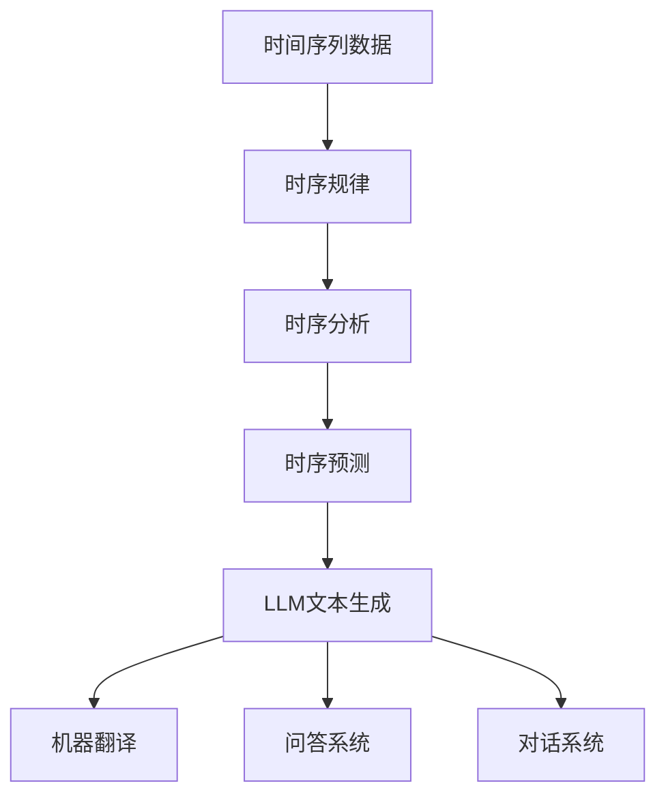

                 

关键词：时刻推理、LLM、计算独特性、算法原理、数学模型、应用领域、未来展望

摘要：本文旨在探讨时刻推理（Temporal Reasoning）在大型语言模型（LLM）计算中的独特作用。通过对核心概念、算法原理、数学模型及其应用领域的详细阐述，本文旨在为读者提供一幅清晰的LLM计算图景，并探讨未来发展的趋势与挑战。

## 1. 背景介绍

在人工智能领域，时刻推理是指对时间序列数据进行分析和处理，以揭示数据中的时序规律和趋势。随着深度学习技术的发展，尤其是大型语言模型（LLM）的兴起，时刻推理在自然语言处理（NLP）领域得到了广泛应用。LLM通过学习海量的文本数据，能够捕捉到复杂的语言结构和时序信息，从而在文本生成、机器翻译、问答系统等方面展现出强大的能力。

本文将聚焦于时刻推理在LLM计算中的独特作用，探讨其算法原理、数学模型及其在不同应用场景中的表现。通过深入分析，我们希望为读者揭示时刻推理在LLM计算中的重要地位，并为相关领域的研究和实践提供有价值的参考。

### 1.1 时刻推理的核心概念

时刻推理涉及以下几个核心概念：

- **时间序列**：时间序列是指按时间顺序排列的一组数据点。在自然语言处理中，时间序列可以是一系列文本片段、句子或词序列。

- **时序规律**：时序规律是指时间序列中数据点的统计规律和模式。通过分析时序规律，可以揭示数据中的时间依赖性和趋势。

- **时序分析**：时序分析是指对时间序列数据进行分析和处理的过程，包括趋势分析、周期性分析、异常检测等。

- **时序预测**：时序预测是基于历史数据对未来数据进行预测的过程。时序预测在LLM计算中具有重要作用，可以帮助模型更好地理解和生成文本。

### 1.2 时刻推理在LLM计算中的应用

时刻推理在LLM计算中具有以下应用：

- **文本生成**：LLM通过学习大量的文本数据，可以生成高质量的自然语言文本。时刻推理可以帮助模型捕捉到文本中的时序规律，从而生成更具连贯性和逻辑性的文本。

- **机器翻译**：在机器翻译中，时刻推理可以分析源语言和目标语言之间的时序关系，从而提高翻译的准确性和流畅性。

- **问答系统**：问答系统需要理解用户的问题和上下文，以生成合理的回答。时刻推理可以帮助模型捕捉到问题中的时序信息，从而更好地理解用户意图。

- **对话系统**：对话系统需要生成连贯自然的对话文本。时刻推理可以帮助模型分析对话中的时序信息，从而生成更符合对话逻辑的文本。

## 2. 核心概念与联系

为了更好地理解时刻推理在LLM计算中的独特作用，我们首先需要了解核心概念及其相互关系。以下是一个用Mermaid绘制的流程图，展示了这些概念之间的联系。

### 2.1 时间序列数据

时间序列数据是时刻推理的基础。它由一系列按时间顺序排列的数据点组成，可以反映数据在时间维度上的变化趋势。在自然语言处理中，时间序列数据可以是文本片段、句子或词序列。

### 2.2 时序规律

时序规律是指时间序列中数据点的统计规律和模式。通过分析时序规律，可以揭示数据中的时间依赖性和趋势。时序规律对于LLM计算至关重要，因为它可以帮助模型理解文本中的时序信息，从而生成更高质量的文本。

### 2.3 时序分析

时序分析是对时间序列数据进行分析和处理的过程，包括趋势分析、周期性分析、异常检测等。时序分析为LLM计算提供了基础数据，可以帮助模型更好地捕捉到文本中的时序规律。

### 2.4 时序预测

时序预测是基于历史数据对未来数据进行预测的过程。在LLM计算中，时序预测可以帮助模型预测文本的生成方向，从而提高文本生成的准确性和流畅性。

### 2.5 LLM文本生成、机器翻译、问答系统、对话系统

LLM文本生成、机器翻译、问答系统和对话系统都是时刻推理在不同应用场景中的具体体现。通过时刻推理，这些系统可以更好地理解和生成文本，从而提供更优质的用户体验。

## 3. 核心算法原理 & 具体操作步骤

### 3.1 算法原理概述

时刻推理在LLM计算中的核心算法主要包括以下几种：

1. **循环神经网络（RNN）**：RNN是一种能够处理序列数据的神经网络，通过记忆状态来捕捉序列中的时间依赖性。

2. **长短期记忆网络（LSTM）**：LSTM是RNN的一种改进，通过引入门控机制来防止梯度消失问题，从而更好地捕捉序列中的长期依赖性。

3. **变换器（Transformer）**：Transformer是一种基于自注意力机制的神经网络，通过全局 attent

