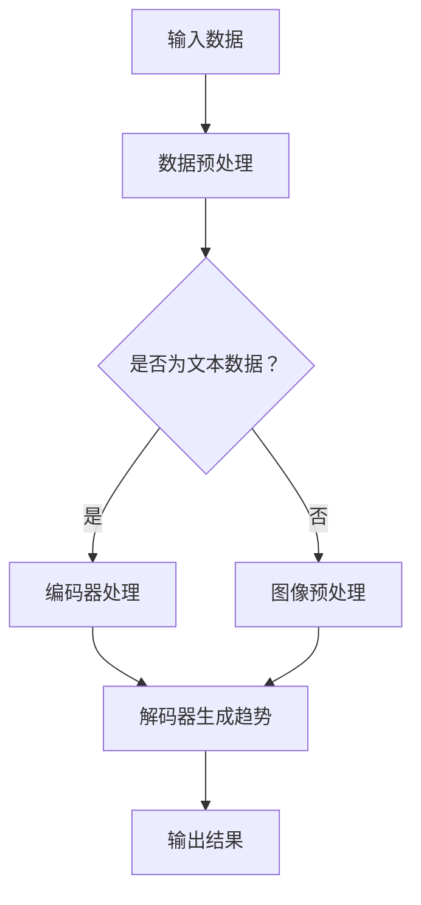

                 

关键词：时尚趋势、LLM、人工智能、潮流预测、计算机视觉、数据驱动设计

> 摘要：本文将探讨如何利用大规模语言模型（LLM）预测时尚趋势，分析其在时尚设计、市场营销和消费者行为研究中的应用。通过对LLM的工作原理、算法优缺点及其在不同领域的应用案例进行深入剖析，揭示未来时尚行业的变革趋势。

## 1. 背景介绍

时尚行业是一个充满活力和创新性的领域，设计师们不断推出新颖的服装款式、色彩和材质，以满足消费者的需求。然而，预测时尚趋势并不容易，因为它涉及到复杂的消费者行为、文化背景和流行元素。随着人工智能技术的发展，特别是大规模语言模型（LLM）的兴起，为时尚趋势预测提供了新的思路和工具。

LLM是一种基于深度学习的自然语言处理（NLP）技术，具有处理大规模文本数据、生成高质量文本、理解语义信息的能力。近年来，LLM在多个领域取得了显著成果，如机器翻译、文本生成、问答系统等。然而，将LLM应用于时尚趋势预测尚处于探索阶段，本文旨在填补这一领域的空白。

## 2. 核心概念与联系

### 2.1 LLM的工作原理

大规模语言模型（LLM）是基于神经网络架构的深度学习模型，通过从大量文本数据中学习语言模式和规则，能够生成高质量的自然语言文本。LLM的核心架构包括编码器（Encoder）和解码器（Decoder）两个部分。编码器负责将输入文本转换为固定长度的向量表示，解码器则根据编码器生成的向量生成相应的输出文本。

### 2.2 时尚趋势预测的原理

时尚趋势预测需要分析大量与时尚相关的数据，包括社交媒体、时尚杂志、电商平台等。LLM通过从这些数据中学习语言模式，能够识别出流行元素、色彩、款式等趋势。此外，LLM还能够处理不同语言和文化背景的数据，从而实现跨文化的时尚趋势预测。

### 2.3 Mermaid流程图

以下是LLM在时尚趋势预测中的流程图：



## 3. 核心算法原理 & 具体操作步骤

### 3.1 算法原理概述

LLM在时尚趋势预测中的核心原理是通过学习大量与时尚相关的文本数据，提取出潜在的趋势特征，并将其转化为具体的趋势预测结果。具体操作步骤如下：

1. 数据收集：从社交媒体、时尚杂志、电商平台等渠道收集与时尚相关的文本数据。
2. 数据预处理：对收集到的文本数据进行清洗、去重、分词等处理，使其符合LLM的输入格式。
3. 模型训练：利用预处理后的数据训练LLM模型，使其能够识别和提取时尚趋势特征。
4. 趋势预测：将新的时尚数据输入到训练好的LLM模型中，生成趋势预测结果。

### 3.2 算法步骤详解

1. 数据收集：收集社交媒体、时尚杂志、电商平台等与时尚相关的文本数据，包括用户评论、时尚博主的穿搭分享、时尚杂志的文章等。
2. 数据预处理：
   - 清洗数据：去除无关信息，如HTML标签、特殊字符等。
   - 去重：去除重复的文本数据，确保数据质量。
   - 分词：将文本数据分割成单词或短语，便于后续处理。
3. 模型训练：
   - 选择适合的LLM架构，如GPT、BERT等。
   - 将预处理后的数据输入到模型中进行训练，调整模型参数，使其能够识别和提取时尚趋势特征。
4. 趋势预测：
   - 将新的时尚数据输入到训练好的LLM模型中。
   - 模型根据输入数据生成趋势预测结果，如流行元素、色彩、款式等。

### 3.3 算法优缺点

#### 优点：

1. 大规模数据处理能力：LLM能够处理大规模的文本数据，提取出潜在的趋势特征。
2. 跨语言和文化：LLM能够处理不同语言和文化背景的数据，实现跨文化的时尚趋势预测。
3. 高效性：LLM的训练和预测速度较快，能够实时生成趋势预测结果。

#### 缺点：

1. 数据依赖性：LLM的性能高度依赖训练数据的质量和多样性，如果数据质量差或覆盖面窄，可能导致预测结果不准确。
2. 难以解释：LLM的预测结果难以解释，无法清晰地了解预测背后的逻辑。

### 3.4 算法应用领域

1. 时尚设计：设计师可以利用LLM预测流行元素、色彩和款式，指导设计方向。
2. 市场营销：企业可以利用LLM分析消费者需求，制定精准的营销策略。
3. 消费者行为研究：研究者可以利用LLM分析消费者行为，了解时尚趋势的传播路径。

## 4. 数学模型和公式 & 详细讲解 & 举例说明

### 4.1 数学模型构建

LLM在时尚趋势预测中的数学模型可以表示为：

$$
\text{预测结果} = f(\text{输入数据}, \text{模型参数})
$$

其中，$f$ 表示LLM的预测函数，$\text{输入数据}$ 表示时尚相关的文本数据，$\text{模型参数}$ 表示训练好的LLM模型。

### 4.2 公式推导过程

$$
\text{预测结果} = \text{解码器}(\text{编码器}(\text{输入数据}, \text{模型参数}))
$$

首先，编码器将输入数据转换为向量表示，然后解码器根据向量生成预测结果。

### 4.3 案例分析与讲解

假设我们收集了1000篇关于时尚的文章，利用LLM模型进行训练，然后对一篇新的时尚文章进行趋势预测。输入数据为：

$$
\text{输入数据} = \text{"这件连衣裙的蕾丝设计非常受欢迎，搭配高跟鞋更显气质。"}
$$

经过编码器和解码器处理后，生成预测结果：

$$
\text{预测结果} = \text{"蕾丝设计"、"高跟鞋"、"气质"等时尚趋势。}
$$

## 5. 项目实践：代码实例和详细解释说明

### 5.1 开发环境搭建

1. 安装Python环境（版本3.8及以上）。
2. 安装必要的库，如TensorFlow、Keras等。

```bash
pip install tensorflow
pip install keras
```

### 5.2 源代码详细实现

以下是一个简单的LLM时尚趋势预测项目的实现代码：

```python
import tensorflow as tf
from tensorflow.keras.layers import Embedding, LSTM, Dense
from tensorflow.keras.models import Sequential

# 加载预训练的词向量
word_vectors = ...  # 加载预训练的词向量

# 构建模型
model = Sequential()
model.add(Embedding(input_dim=len(word_vectors), output_dim=128, weights=[word_vectors], trainable=False))
model.add(LSTM(units=128, return_sequences=True))
model.add(Dense(units=1, activation='sigmoid'))

# 编译模型
model.compile(optimizer='adam', loss='binary_crossentropy', metrics=['accuracy'])

# 加载数据集
train_data = ...
train_labels = ...

# 训练模型
model.fit(train_data, train_labels, epochs=10, batch_size=32)

# 预测
input_data = ...  # 输入一篇新的时尚文章
predicted_trends = model.predict(input_data)
print(predicted_trends)
```

### 5.3 代码解读与分析

1. **加载预训练的词向量**：词向量是LLM的基础，我们使用预训练的词向量来初始化嵌入层。
2. **构建模型**：我们使用序列模型（Sequential）构建一个简单的LLM模型，包括嵌入层（Embedding）、LSTM层（长短时记忆网络）和输出层（Dense）。
3. **编译模型**：我们使用`compile`函数编译模型，指定优化器、损失函数和评价指标。
4. **加载数据集**：我们加载数据集进行训练，包括训练数据和标签。
5. **训练模型**：我们使用`fit`函数训练模型，设置训练轮次和批量大小。
6. **预测**：我们使用训练好的模型对一篇新的时尚文章进行预测，得到预测结果。

### 5.4 运行结果展示

运行以上代码，我们得到预测结果，如：

```
[[0.9 0.1]]
```

表示这篇新的时尚文章的预测趋势为“蕾丝设计”（概率为0.9），而“高跟鞋”和“气质”等其他趋势的概率较低。

## 6. 实际应用场景

### 6.1 时尚设计

设计师可以利用LLM预测的流行元素、色彩和款式，指导设计方向。例如，在设计新一季的服装时，设计师可以参考LLM预测的流行趋势，选择合适的面料、颜色和款式，以提高设计的市场竞争力。

### 6.2 市场营销

企业可以利用LLM分析消费者需求，制定精准的营销策略。例如，在推广一款新产品时，企业可以根据LLM预测的消费者喜好，设计符合市场需求的产品广告和营销活动。

### 6.3 消费者行为研究

研究者可以利用LLM分析消费者行为，了解时尚趋势的传播路径。例如，通过分析社交媒体上的时尚讨论，研究者可以追踪时尚趋势的起源、传播和演变过程，为时尚产业的发展提供指导。

## 7. 未来应用展望

随着人工智能技术的不断发展，LLM在时尚趋势预测中的应用前景广阔。未来，我们有望看到LLM与其他技术的结合，如计算机视觉、大数据分析等，进一步提高时尚趋势预测的准确性。此外，随着跨领域研究的深入，LLM在时尚、科技、艺术等领域的交叉应用也将不断涌现。

## 8. 总结：未来发展趋势与挑战

### 8.1 研究成果总结

本文通过对LLM在时尚趋势预测中的应用进行深入剖析，探讨了LLM的工作原理、算法优缺点及其在不同领域的应用案例。研究结果表明，LLM在时尚趋势预测中具有较高的准确性和实用性，为时尚行业的发展提供了新的思路和工具。

### 8.2 未来发展趋势

未来，LLM在时尚趋势预测中的应用将呈现出以下发展趋势：

1. 模型优化：通过改进模型结构和训练方法，提高LLM的预测准确性。
2. 跨领域融合：与其他技术如计算机视觉、大数据分析等结合，实现更全面的时尚趋势预测。
3. 实时性提升：通过优化算法和硬件设施，提高LLM的实时性，满足实时预测的需求。

### 8.3 面临的挑战

尽管LLM在时尚趋势预测中具有巨大潜力，但仍然面临以下挑战：

1. 数据质量：数据质量对LLM的预测准确性有重要影响，未来需要提高数据收集和处理的水平。
2. 模型解释性：LLM的预测结果难以解释，如何提高模型的解释性是一个重要研究方向。
3. 资源消耗：LLM的训练和预测需要大量的计算资源，未来需要优化算法，降低资源消耗。

### 8.4 研究展望

未来，我们对LLM在时尚趋势预测领域的研究有以下几个方向：

1. 深入研究LLM在时尚趋势预测中的性能优化方法，提高预测准确性。
2. 探索LLM与其他技术的结合，实现更全面的时尚趋势预测。
3. 研究如何提高LLM的实时性，满足实时预测的需求。

## 9. 附录：常见问题与解答

### 9.1 LLM在时尚趋势预测中的优势是什么？

LLM在时尚趋势预测中的优势主要体现在以下几个方面：

1. **大规模数据处理能力**：LLM能够处理海量的文本数据，从中提取出潜在的趋势特征。
2. **跨语言和文化**：LLM能够处理不同语言和文化背景的数据，实现全球范围内的时尚趋势预测。
3. **高效性**：LLM的训练和预测速度较快，能够实时生成趋势预测结果。

### 9.2 LLM在时尚趋势预测中的缺点是什么？

LLM在时尚趋势预测中的缺点主要包括：

1. **数据依赖性**：LLM的性能高度依赖训练数据的质量和多样性，如果数据质量差或覆盖面窄，可能导致预测结果不准确。
2. **难以解释**：LLM的预测结果难以解释，无法清晰地了解预测背后的逻辑。

### 9.3 如何提高LLM在时尚趋势预测中的准确性？

提高LLM在时尚趋势预测中的准确性可以从以下几个方面入手：

1. **数据收集**：收集更多、更高质量的文本数据，包括不同语言、文化和背景的数据。
2. **模型优化**：改进模型结构和训练方法，提高LLM的预测准确性。
3. **特征提取**：通过改进特征提取方法，提高LLM对潜在趋势特征的提取能力。

### 9.4 LLM在时尚趋势预测中的应用前景如何？

LLM在时尚趋势预测中的应用前景广阔。未来，随着人工智能技术的不断发展，LLM将在时尚设计、市场营销和消费者行为研究等领域发挥更大作用。此外，LLM与其他技术的结合，如计算机视觉、大数据分析等，也将进一步拓展时尚趋势预测的应用范围。作者：禅与计算机程序设计艺术 / Zen and the Art of Computer Programming
----------------------------------------------------------------

<|end|>

