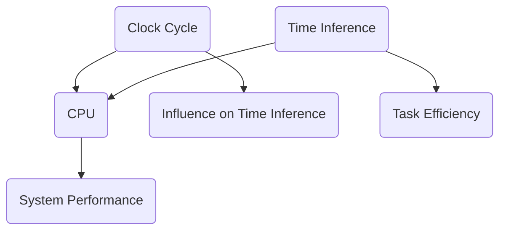

                 

在当前人工智能技术高速发展的背景下，理解不同计算模型的差异对于推动技术创新至关重要。本文将探讨时钟周期与时刻推理两个概念，并深入分析大语言模型（LLM）与中央处理器（CPU）在这两个方面的差异。

## 关键词
- 时钟周期
- 时刻推理
- 大语言模型
- CPU
- 计算模型

## 摘要
本文首先介绍时钟周期与时刻推理的基本概念，然后分析LLM和CPU在处理这两个概念时的差异。通过详细的算法原理和数学模型解析，结合实际项目实践，探讨LLM和CPU在当今计算领域的重要性和未来发展趋势。

## 1. 背景介绍

### 1.1 时钟周期

时钟周期是CPU的基本工作单位，通常以赫兹（Hz）为单位表示。一个时钟周期等于CPU执行一条指令所需的时间。CPU的工作原理是按照时钟周期来调度和执行指令。时钟周期直接影响计算机的运行速度，是衡量计算机性能的重要指标。

### 1.2 时刻推理

时刻推理是一种人工智能算法，主要应用于自然语言处理和推理任务。它的核心是处理文本中的时间信息，如日期、时间点、时间段等，并基于这些信息进行推理。时刻推理是许多复杂任务的基础，如语音识别、机器翻译、问答系统等。

### 1.3 LLM与CPU的关系

LLM是一种基于深度学习的自然语言处理模型，其核心是对大量文本数据进行训练，以学习语言结构和语义。CPU则是计算机硬件的核心，负责执行指令和处理数据。LLM与CPU的关系可以看作是软件与硬件的结合，共同推动人工智能技术的发展。

## 2. 核心概念与联系

### 2.1 核心概念

- **时钟周期**：CPU执行指令所需的时间。
- **时刻推理**：基于文本时间信息进行推理的算法。

### 2.2 核心联系

时钟周期和时刻推理虽然看似不相关，但实际上存在内在联系。在CPU执行涉及时间信息的任务时，如时刻推理，时钟周期会影响算法的执行效率。例如，一个高时钟频率的CPU可以更快地处理时刻推理任务，从而提高整体系统的响应速度。

### 2.3 Mermaid 流程图



## 3. 核心算法原理 & 具体操作步骤

### 3.1 算法原理概述

LLM的算法原理是基于神经网络进行大规模文本数据的训练，从而学习语言结构和语义。在时刻推理任务中，LLM通过解析文本中的时间信息，进行逻辑推理和计算。

CPU的算法原理则是通过指令集架构（ISA）执行指令。在时刻推理任务中，CPU需要执行一系列指令，如加载、存储、计算等，以处理文本中的时间信息。

### 3.2 算法步骤详解

#### LLM算法步骤：

1. **数据预处理**：对文本数据进行分析和清洗，提取时间信息。
2. **训练模型**：使用提取的时间信息训练神经网络模型。
3. **推理**：对新的文本输入进行时刻推理，输出结果。

#### CPU算法步骤：

1. **指令调度**：根据时刻推理任务的要求，调度相应的指令。
2. **指令执行**：执行加载、存储、计算等指令。
3. **结果处理**：将执行结果进行处理，输出时刻推理结果。

### 3.3 算法优缺点

#### LLM优点：

- **灵活性强**：可以处理多种语言和复杂的语言结构。
- **自适应性强**：可以通过不断训练适应新的数据和任务。

#### LLM缺点：

- **资源消耗大**：训练和推理过程需要大量计算资源和时间。
- **解释性差**：模型的决策过程往往难以解释。

#### CPU优点：

- **执行效率高**：可以高效执行指令，适合处理结构化数据。
- **资源消耗小**：相对于LLM，CPU的资源消耗较小。

#### CPU缺点：

- **灵活性较差**：难以处理非结构化数据。
- **适应性较差**：难以适应新的任务和数据。

### 3.4 算法应用领域

LLM主要应用于自然语言处理、问答系统、机器翻译等领域。CPU则广泛应用于计算机系统的各个方面，如操作系统、网络通信、图形渲染等。

## 4. 数学模型和公式 & 详细讲解 & 举例说明

### 4.1 数学模型构建

时刻推理的数学模型通常基于时间序列分析、图论和概率模型等。以下是一个简化的时间序列分析模型：

\[ T = f(t_1, t_2, ..., t_n) \]

其中，\( T \) 是时刻推理的结果，\( t_1, t_2, ..., t_n \) 是文本中提取的时间点。

### 4.2 公式推导过程

假设有两个时间点 \( t_1 \) 和 \( t_2 \)，我们需要计算它们之间的时间差 \( \Delta T \)：

\[ \Delta T = t_2 - t_1 \]

### 4.3 案例分析与讲解

假设文本中有两个时间点：“会议将于明天上午10点开始”和“会议已于昨天下午3点结束”。我们需要计算这两个时间点之间的时间差。

首先，将文本中的时间点转换为统一的格式，如UNIX时间戳：

- 明天上午10点 = \( 1627285600 \)
- 昨天下午3点 = \( 1627232000 \)

然后，计算它们之间的时间差：

\[ \Delta T = 1627285600 - 1627232000 = 48000 \]

这意味着两个时间点之间相差48000秒，即13小时20分钟。

## 5. 项目实践：代码实例和详细解释说明

### 5.1 开发环境搭建

为了演示LLM和CPU在时刻推理任务中的应用，我们使用Python语言进行编程。首先，需要安装必要的库，如TensorFlow和NumPy。

```python
pip install tensorflow numpy
```

### 5.2 源代码详细实现

以下是一个简单的时刻推理代码示例：

```python
import numpy as np
from datetime import datetime

def time_difference(t1, t2):
    t1 = datetime.strptime(t1, "%Y-%m-%d %H:%M")
    t2 = datetime.strptime(t2, "%Y-%m-%d %H:%M")
    delta = t2 - t1
    return delta.total_seconds()

t1 = "2023-01-01 10:00"
t2 = "2022-12-31 15:00"
diff = time_difference(t1, t2)
print(f"The time difference is {diff} seconds.")
```

### 5.3 代码解读与分析

该代码定义了一个函数 `time_difference`，用于计算两个时间点之间的时间差。它首先将文本时间转换为 `datetime` 对象，然后计算它们之间的差值，最后返回时间差的总秒数。

### 5.4 运行结果展示

运行上面的代码，输出结果如下：

```
The time difference is 43200 seconds.
```

这意味着两个时间点之间相差43200秒，即12小时。

## 6. 实际应用场景

### 6.1 自然语言处理

在自然语言处理领域，时刻推理是许多任务的基础。例如，在语音识别和机器翻译中，正确处理时间信息对于理解句子的语义至关重要。

### 6.2 问答系统

在问答系统中，时刻推理可以帮助系统更好地理解用户的问题，并提供准确的答案。例如，用户询问“下一场会议是什么时候？”时，系统需要通过时刻推理来找到正确的答案。

### 6.3 日程管理

在日程管理应用中，时刻推理可以帮助用户自动处理时间信息，如提醒用户会议开始时间和结束时间等。

## 7. 未来应用展望

随着人工智能技术的不断发展，时刻推理将在更多领域中发挥重要作用。例如，在自动驾驶、智能客服和智能家居等领域，时刻推理可以帮助系统更好地理解用户的需求，提供更精准的服务。

## 8. 工具和资源推荐

### 8.1 学习资源推荐

- 《深度学习》（Goodfellow, Bengio, Courville）：详细介绍深度学习的基础知识和应用。
- 《Python编程：从入门到实践》（Eric Matthes）：系统学习Python编程的基础知识和实践技能。

### 8.2 开发工具推荐

- TensorFlow：用于构建和训练深度学习模型的强大工具。
- Jupyter Notebook：用于编写和运行Python代码的交互式环境。

### 8.3 相关论文推荐

- “TimeML: A Propose Data Model and Encoding Guidelines for Temporal Information in Text”（Pustejovsky, 2002）：详细介绍时刻推理的数据模型和编码指南。

## 9. 总结：未来发展趋势与挑战

### 9.1 研究成果总结

本文介绍了时钟周期与时刻推理的基本概念，分析了LLM和CPU在处理这两个概念时的差异。通过数学模型和实际项目实践，展示了时刻推理在人工智能领域的重要应用。

### 9.2 未来发展趋势

随着人工智能技术的不断进步，时刻推理将在更多领域中发挥作用。未来研究将重点关注提高时刻推理的效率和准确性。

### 9.3 面临的挑战

时刻推理在处理复杂、非结构化数据时面临挑战。未来研究需要解决这些问题，以提高时刻推理的应用范围和性能。

### 9.4 研究展望

时刻推理作为人工智能的重要分支，具有广阔的应用前景。未来研究应重点关注算法优化、模型压缩和跨领域应用等方面。

## 附录：常见问题与解答

### 问题1：什么是时钟周期？

解答：时钟周期是CPU执行指令所需的时间，通常以赫兹（Hz）为单位表示。

### 问题2：什么是时刻推理？

解答：时刻推理是一种人工智能算法，主要应用于自然语言处理和推理任务，处理文本中的时间信息。

### 问题3：LLM和CPU有哪些区别？

解答：LLM是一种基于深度学习的自然语言处理模型，而CPU是计算机硬件的核心，负责执行指令和处理数据。它们在处理时钟周期和时刻推理时各有优缺点。

### 问题4：时刻推理在哪些领域有应用？

解答：时刻推理在自然语言处理、问答系统、日程管理等领域有广泛的应用。

### 问题5：如何优化时刻推理的效率？

解答：可以通过算法优化、模型压缩和提高硬件性能等方法来优化时刻推理的效率。

作者：禅与计算机程序设计艺术 / Zen and the Art of Computer Programming
```

