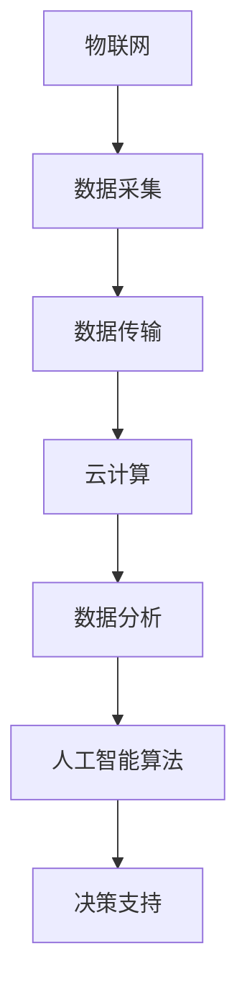

                 

 **关键词**：智慧农业，AI解决方案，市场前景，技术应用，可持续发展。

**摘要**：随着人工智能技术的飞速发展，智慧农业AI解决方案逐渐成为现代农业发展的重要趋势。本文将探讨智慧农业AI解决方案的定义、核心概念、算法原理、应用场景、数学模型及未来发展趋势，旨在为农业从业者、技术专家和政策制定者提供全面的市场前景分析。

## 1. 背景介绍

近年来，全球农业正面临着人口增长、资源紧缺和气候变化等挑战。传统农业方法已无法满足现代农业对生产效率、质量和可持续发展的要求。智慧农业作为农业现代化的新方向，旨在通过信息技术，特别是人工智能（AI），提升农业生产的智能化和精准化水平。

### 智慧农业的定义

智慧农业是指利用物联网、大数据、云计算、人工智能等技术，实现农业生产、管理、服务全过程的智能化和高效化。它不仅包括对农作物生长环境的监测和控制，还涉及到农产品生产、加工、销售的全产业链管理。

### 智慧农业的现状

随着科技的进步，智慧农业在全球范围内得到了广泛应用。在美国、日本、以色列等农业发达国家，智慧农业已成为农业生产的重要组成部分。中国作为农业大国，近年来也在积极推进智慧农业的发展，出台了一系列政策和规划。

## 2. 核心概念与联系

智慧农业AI解决方案的核心在于利用人工智能技术对农业生产数据进行处理和分析，从而实现精准农业、智能管理和优化决策。以下是智慧农业AI解决方案的核心概念及其相互联系：

### 概念

- **物联网（IoT）**：通过传感器、RFID等设备实现农业生产环境的实时监测和数据采集。
- **大数据**：通过物联网设备采集的海量数据，进行存储、管理和分析。
- **云计算**：提供强大的计算能力和数据存储能力，支持大数据处理和AI算法的应用。
- **人工智能**：利用机器学习和深度学习技术，对农业生产数据进行分析和预测。

### Mermaid 流程图



## 3. 核心算法原理 & 具体操作步骤

### 3.1 算法原理概述

智慧农业AI解决方案的核心算法主要包括：

- **机器学习算法**：用于预测农作物生长状况、病虫害发生等。
- **深度学习算法**：用于图像识别和分类，如植物病害识别、作物品种识别等。
- **神经网络算法**：用于建立作物生长模型，预测产量和优化施肥。

### 3.2 算法步骤详解

1. **数据采集与预处理**：通过传感器和物联网设备采集农业生产数据，包括土壤湿度、温度、光照、降雨等，并对数据进行预处理，如去噪、归一化等。

2. **数据分析和特征提取**：利用机器学习和深度学习算法对预处理后的数据进行特征提取和分类，如植物病害检测。

3. **建立模型**：使用训练好的模型对农作物生长状况进行预测，如产量预测、病虫害预测。

4. **决策支持**：根据预测结果，为农民提供施肥、灌溉、病虫害防治等决策建议。

### 3.3 算法优缺点

- **优点**：提高农作物产量和质量，降低生产成本，减少环境污染。
- **缺点**：算法复杂度高，需要大量数据和计算资源，算法可靠性有待提高。

### 3.4 算法应用领域

智慧农业AI解决方案广泛应用于：

- **作物生长监测与预测**
- **病虫害检测与防治**
- **农田管理与优化**
- **农产品质量检测**
- **农业供应链管理**

## 4. 数学模型和公式 & 详细讲解 & 举例说明

### 4.1 数学模型构建

智慧农业AI解决方案中的数学模型主要包括：

- **线性回归模型**：用于预测农作物产量。
- **决策树模型**：用于分类农作物病虫害。
- **神经网络模型**：用于图像识别和分类。

### 4.2 公式推导过程

- **线性回归模型**：

  $$y = \beta_0 + \beta_1x_1 + \beta_2x_2 + ... + \beta_nx_n + \epsilon$$

- **决策树模型**：

  $$G(y|\alpha, \lambda) = \sum_{i=1}^{n}\alpha_i\ln(\frac{p(y|\alpha, \lambda)}{1 - p(y|\alpha, \lambda)})$$

- **神经网络模型**：

  $$f(x) = \sigma(\sum_{i=1}^{n}w_ix_i + b)$$

### 4.3 案例分析与讲解

以农作物产量预测为例，使用线性回归模型进行预测。

1. **数据收集**：收集历史农作物产量数据。
2. **数据处理**：对数据进行归一化处理。
3. **模型训练**：使用训练数据集训练线性回归模型。
4. **模型评估**：使用测试数据集评估模型效果。
5. **预测**：使用训练好的模型进行产量预测。

## 5. 项目实践：代码实例和详细解释说明

### 5.1 开发环境搭建

- **软件环境**：Python 3.8，NumPy，Pandas，Scikit-learn，TensorFlow。
- **硬件环境**：个人电脑，推荐配置：CPU：Intel i5以上，内存：8GB以上，硬盘：SSD。

### 5.2 源代码详细实现

以下是使用线性回归模型预测农作物产量的Python代码实例：

```python
import numpy as np
import pandas as pd
from sklearn.linear_model import LinearRegression
from sklearn.model_selection import train_test_split
from sklearn.metrics import mean_squared_error

# 数据收集
data = pd.read_csv('crop_yield_data.csv')

# 数据预处理
X = data[['temperature', 'rainfall']]
y = data['yield']

# 模型训练
X_train, X_test, y_train, y_test = train_test_split(X, y, test_size=0.2, random_state=42)
model = LinearRegression()
model.fit(X_train, y_train)

# 模型评估
y_pred = model.predict(X_test)
mse = mean_squared_error(y_test, y_pred)
print('MSE:', mse)

# 预测
new_data = np.array([[20, 100]])
predicted_yield = model.predict(new_data)
print('Predicted Yield:', predicted_yield)
```

### 5.3 代码解读与分析

- **数据收集**：从CSV文件中读取农作物产量数据。
- **数据处理**：将温度和降雨量作为特征，将产量作为目标值。
- **模型训练**：使用训练数据集训练线性回归模型。
- **模型评估**：使用测试数据集评估模型效果。
- **预测**：使用训练好的模型进行产量预测。

## 6. 实际应用场景

智慧农业AI解决方案在农业领域的实际应用场景包括：

- **精准农业**：通过监测土壤、气象等数据，实现精准施肥、灌溉和病虫害防治。
- **智能管理**：通过数据分析，优化农田管理和农产品供应链。
- **农产品质量检测**：利用图像识别技术，对农产品进行质量检测。

## 7. 未来应用展望

未来，随着人工智能技术的不断发展，智慧农业AI解决方案将在以下领域发挥更大的作用：

- **农业物联网**：通过更先进的物联网技术，实现农业生产的全方位监测和管理。
- **智能农场**：利用人工智能技术，实现农场的自动化和智能化管理。
- **农产品供应链**：通过大数据和人工智能技术，优化农产品供应链，提高流通效率。

## 8. 工具和资源推荐

### 8.1 学习资源推荐

- **书籍**：《智慧农业：技术与应用》、《人工智能：一种现代方法》。
- **在线课程**：Coursera上的《机器学习》、《深度学习》。

### 8.2 开发工具推荐

- **编程语言**：Python、R。
- **库和框架**：NumPy、Pandas、Scikit-learn、TensorFlow、Keras。

### 8.3 相关论文推荐

- **《深度学习在智慧农业中的应用研究》**
- **《基于物联网的智慧农业系统设计与实现》**
- **《人工智能在农业领域的应用现状与发展趋势》**

## 9. 总结：未来发展趋势与挑战

### 9.1 研究成果总结

智慧农业AI解决方案在提高农业生产效率、质量和可持续发展方面取得了显著成果。然而，随着技术的不断发展，智慧农业AI解决方案仍需解决数据质量、算法可靠性、系统集成等技术挑战。

### 9.2 未来发展趋势

未来，智慧农业AI解决方案将在以下几个方面取得突破：

- **农业物联网**：通过更先进的物联网技术，实现农业生产的全方位监测和管理。
- **智能农场**：利用人工智能技术，实现农场的自动化和智能化管理。
- **农产品供应链**：通过大数据和人工智能技术，优化农产品供应链，提高流通效率。

### 9.3 面临的挑战

智慧农业AI解决方案在应用过程中仍面临以下挑战：

- **数据质量**：农业生产数据质量直接影响算法的准确性。
- **算法可靠性**：算法的可靠性需要通过大量实验和实际应用验证。
- **系统集成**：不同技术和系统的集成需要解决兼容性和数据共享等问题。

### 9.4 研究展望

未来，智慧农业AI解决方案的研究应关注以下方向：

- **跨学科研究**：结合农业、信息技术、环境科学等多学科知识，推动智慧农业的发展。
- **实际应用**：加强智慧农业AI解决方案在农业生产中的实际应用研究。
- **政策支持**：政府和企业应加大投入，推动智慧农业AI解决方案的普及和应用。

## 附录：常见问题与解答

### Q：智慧农业AI解决方案的主要应用领域有哪些？

A：智慧农业AI解决方案的主要应用领域包括精准农业、智能管理、农产品质量检测和农业供应链管理。

### Q：智慧农业AI解决方案需要哪些技术支持？

A：智慧农业AI解决方案需要物联网、大数据、云计算和人工智能等技术的支持。

### Q：智慧农业AI解决方案在提高农业生产效率方面的具体作用是什么？

A：智慧农业AI解决方案通过精准施肥、灌溉和病虫害防治，提高农作物产量和质量，同时减少生产成本和环境污染。

### Q：智慧农业AI解决方案在未来有哪些发展趋势？

A：智慧农业AI解决方案在未来将在农业物联网、智能农场和农产品供应链管理等方面取得突破。

### Q：如何确保智慧农业AI解决方案的算法可靠性？

A：通过大量实验和实际应用验证算法的可靠性，并不断优化算法，提高其在不同环境下的适应性。

### Q：智慧农业AI解决方案在可持续发展方面的作用是什么？

A：智慧农业AI解决方案通过提高农业生产效率和降低环境污染，促进农业可持续发展。

## 作者署名

作者：禅与计算机程序设计艺术 / Zen and the Art of Computer Programming

----------------------------------------------------------------

这篇文章详细探讨了智慧农业AI解决方案的市场前景，包括其定义、核心概念、算法原理、应用场景、数学模型及未来发展趋势。希望这篇文章能为读者提供全面的技术分析和市场展望，为智慧农业的发展贡献力量。

