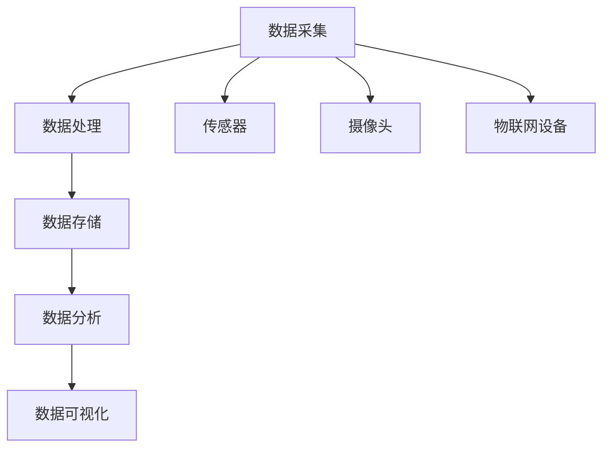

                 

 在当今这个信息爆炸的时代，智慧城市的发展已成为全球范围内的一项重要议题。智慧城市通过集成先进的信息通信技术，实现了城市管理的智能化、精细化。然而，随着城市中传感器、摄像头、交通系统等收集的数据量日益增长，如何有效地管理注意力资源成为一个亟待解决的问题。本文将围绕这一主题展开，探讨注意力资源管理在智慧城市中的应用、核心算法原理、数学模型、项目实践以及未来发展趋势。

## 关键词

- 智慧城市
- 注意力资源管理
- 数据处理
- 人工智能
- 算法优化

## 摘要

智慧城市中的注意力资源管理涉及对城市环境中各类信息的有效组织和利用。本文首先介绍了智慧城市和注意力资源管理的基本概念，接着详细阐述了注意力资源管理的核心算法原理及其实际应用步骤。此外，文章还通过数学模型和项目实践展示了注意力资源管理的具体应用效果，并对未来发展方向提出了展望。

### 1. 背景介绍

智慧城市是指通过信息通信技术（ICT）和物联网（IoT）等手段，实现城市管理的智能化、精细化，从而提高城市运行效率和居民生活质量的一种新型城市发展模式。智慧城市中的注意力资源管理，是指在大量数据输入的基础上，对城市中各类信息的有效筛选、组织和利用，以便于城市管理者能够快速响应城市事件，优化城市资源配置。

#### 1.1 智慧城市的现状

近年来，随着信息技术的飞速发展，智慧城市在全球范围内得到了广泛应用。例如，通过智能交通系统减少交通拥堵，通过智能电网实现能源的高效利用，通过智能安防系统提升城市安全水平等。智慧城市的发展不仅提高了城市管理效率，也为居民提供了更加便捷、舒适的生活环境。

#### 1.2 注意力资源管理的挑战

然而，随着智慧城市的不断发展，城市中产生的数据量呈指数级增长，这给注意力资源管理带来了巨大挑战。主要表现在以下几个方面：

1. **数据量庞大**：智慧城市中涉及到的数据类型繁多，包括交通流量数据、环境监测数据、公共安全数据等，如何从海量数据中提取有用信息成为一大难题。
2. **数据实时性**：城市事件的发生往往需要实时响应，如何及时处理并反馈信息是注意力资源管理的关键。
3. **数据多样性**：不同类型的数据具有不同的特征，如何将多种数据类型有效地整合起来，实现信息融合，也是注意力资源管理面临的一大挑战。
4. **数据隐私**：在注意力资源管理过程中，如何保护用户的隐私，避免数据泄露，是一个亟待解决的问题。

#### 1.3 注意力资源管理的重要性

尽管面临诸多挑战，注意力资源管理在智慧城市中仍然具有极其重要的意义。通过有效的注意力资源管理，可以实现对城市环境的实时监测和预测，从而提高城市管理的智能化水平。例如，通过分析交通流量数据，可以预测交通拥堵，提前采取措施；通过分析环境监测数据，可以及时发现环境污染问题，并采取相应的治理措施。

### 2. 核心概念与联系

为了深入探讨注意力资源管理，我们首先需要明确几个核心概念：数据采集、数据处理、数据存储、数据分析和数据可视化。这些概念相互联系，共同构成了注意力资源管理的框架。

#### 2.1 数据采集

数据采集是注意力资源管理的起点。在城市环境中，通过传感器、摄像头、物联网设备等手段，可以实时收集各种类型的数据，如交通流量、空气质量、公共安全事件等。这些数据为后续的处理和分析提供了基础。

#### 2.2 数据处理

数据处理是对采集到的原始数据进行清洗、去噪、归一化等操作，以消除数据中的不一致性和异常值。通过数据处理，可以提高数据的质量，使其更适合后续的分析。

#### 2.3 数据存储

数据存储是将处理后的数据保存到数据库或数据仓库中，以便后续的查询和分析。数据存储系统需要具备高可靠性、高扩展性和高效率等特点，以支持智慧城市的实时数据处理需求。

#### 2.4 数据分析

数据分析是注意力资源管理的核心环节。通过统计、机器学习、数据挖掘等方法，可以挖掘数据中的有价值信息，如趋势、关联关系、预测结果等。这些信息为城市管理者提供了决策依据。

#### 2.5 数据可视化

数据可视化是将分析结果以图表、图像等形式展示出来，使城市管理者能够直观地了解城市环境的运行状态。数据可视化不仅提高了数据分析的效率，还增强了数据表达的效果。

#### 2.6 Mermaid 流程图

以下是一个简单的 Mermaid 流程图，展示了注意力资源管理的核心概念和联系：



### 3. 核心算法原理 & 具体操作步骤

注意力资源管理的核心算法是基于深度学习的卷积神经网络（CNN）和循环神经网络（RNN）。这些算法可以有效地处理大规模数据，实现实时监测和预测。

#### 3.1 算法原理概述

卷积神经网络（CNN）是一种适用于图像处理和物体识别的深度学习模型。通过卷积操作和池化操作，CNN 可以自动提取图像中的特征，从而实现图像分类和识别。

循环神经网络（RNN）是一种适用于序列数据处理的深度学习模型。通过循环结构，RNN 可以捕捉序列数据中的时间依赖关系，从而实现序列分类、生成和预测。

#### 3.2 算法步骤详解

1. **数据预处理**：对采集到的数据进行预处理，包括数据清洗、去噪、归一化等操作，以提高数据质量。
2. **特征提取**：利用 CNN 和 RNN 算法提取数据中的特征。对于图像数据，使用 CNN 提取图像特征；对于序列数据，使用 RNN 提取序列特征。
3. **模型训练**：使用预处理后的数据训练 CNN 和 RNN 模型。通过反向传播算法，不断调整模型参数，使其在训练数据上达到较好的性能。
4. **模型评估**：使用测试数据评估模型性能，包括准确率、召回率、F1 值等指标。根据评估结果，调整模型参数，优化模型性能。
5. **实时监测和预测**：将训练好的模型应用于实际场景，实现对城市环境的实时监测和预测。例如，通过分析交通流量数据，预测交通拥堵情况；通过分析环境监测数据，预测空气质量变化。

#### 3.3 算法优缺点

1. **优点**：
   - CNN 和 RNN 算法具有较强的特征提取能力，能够处理大规模数据。
   - 模型训练和优化过程自动化，减少了人工干预。
   - 实时监测和预测能力，提高了城市管理的效率。

2. **缺点**：
   - 对数据质量要求较高，需要大量高质量数据支持。
   - 模型训练过程较慢，特别是对于大规模数据。
   - 模型复杂度高，对计算资源要求较高。

#### 3.4 算法应用领域

注意力资源管理算法广泛应用于智慧城市的各个领域，如智能交通、环境监测、公共安全等。

1. **智能交通**：通过分析交通流量数据，预测交通拥堵情况，优化交通信号灯控制策略，减少交通拥堵。
2. **环境监测**：通过分析环境监测数据，预测空气质量变化，提前采取治理措施，保护环境。
3. **公共安全**：通过分析公共安全数据，预测犯罪活动，提前采取措施，提高城市安全水平。

### 4. 数学模型和公式 & 详细讲解 & 举例说明

注意力资源管理的核心在于如何从海量数据中提取有用信息，为此，我们需要构建数学模型来描述这一过程。以下是一个简化的数学模型，用于说明注意力资源管理的基本原理。

#### 4.1 数学模型构建

假设我们有一个城市环境中的数据集 \( D = \{d_1, d_2, ..., d_n\} \)，其中每个数据点 \( d_i \) 表示城市环境中的一组特征，如交通流量、空气质量等。我们的目标是构建一个函数 \( f(D) \)，用于对数据集进行预处理、特征提取和预测。

数学模型可以表示为：

$$ f(D) = \phi(g(\psi(D))) $$

其中，\( \psi(D) \) 表示数据预处理函数，\( g(\psi(D)) \) 表示特征提取函数，\( \phi(g(\psi(D))) \) 表示预测函数。

#### 4.2 公式推导过程

1. **数据预处理**：

数据预处理函数 \( \psi(D) \) 的目标是去除数据中的噪声和异常值，同时保持数据的代表性。一个常用的方法是使用均值滤波器，其公式为：

$$ \psi(d_i) = \frac{1}{k} \sum_{j=1}^{k} d_{i,j} $$

其中，\( d_{i,j} \) 表示第 \( i \) 个数据点的第 \( j \) 个特征值，\( k \) 表示滤波器的窗口大小。

2. **特征提取**：

特征提取函数 \( g(\psi(D)) \) 的目标是提取数据中的关键特征，以便后续的预测。一个常用的方法是使用卷积神经网络（CNN），其公式为：

$$ g(\psi(D)) = \sigma(\text{ReLU}(\text{Conv}(\psi(D)))) $$

其中，\( \text{ReLU} \) 表示ReLU激活函数，\( \text{Conv} \) 表示卷积操作，\( \sigma \) 表示归一化操作。

3. **预测**：

预测函数 \( \phi(g(\psi(D))) \) 的目标是根据提取的特征进行预测。一个常用的方法是使用循环神经网络（RNN），其公式为：

$$ \phi(g(\psi(D))) = \text{softmax}(\text{RNN}(g(\psi(D)))) $$

其中，\( \text{RNN} \) 表示循环神经网络，\( \text{softmax} \) 表示softmax激活函数。

#### 4.3 案例分析与讲解

以下是一个简单的案例，用于说明注意力资源管理的应用。

假设我们有一个城市环境中的交通流量数据集 \( D = \{d_1, d_2, ..., d_n\} \)，其中每个数据点 \( d_i \) 包含三个特征：时段、路段长度和路段宽度。

1. **数据预处理**：

首先，我们对交通流量数据进行预处理，去除异常值和噪声。使用均值滤波器对每个特征进行滤波，得到预处理后的数据集 \( \psi(D) \)。

2. **特征提取**：

接下来，我们使用卷积神经网络（CNN）对预处理后的数据集进行特征提取。首先，我们定义一个卷积层，使用卷积核对数据点进行卷积操作，提取关键特征。然后，我们使用ReLU激活函数对卷积结果进行非线性变换，增强特征表达能力。最后，我们使用归一化操作对卷积结果进行归一化，消除不同特征之间的尺度差异。

3. **预测**：

最后，我们使用循环神经网络（RNN）对提取的特征进行预测。首先，我们定义一个循环层，对提取的特征进行循环操作，捕捉特征之间的时间依赖关系。然后，我们使用softmax激活函数对循环结果进行分类预测。

通过这个简单的案例，我们可以看到注意力资源管理在交通流量预测中的应用。在实际应用中，我们可以根据不同的城市环境和需求，调整预处理、特征提取和预测方法，实现更加精准的预测。

### 5. 项目实践：代码实例和详细解释说明

为了更好地理解注意力资源管理在智慧城市中的应用，我们以下通过一个实际项目实例进行讲解。本项目将使用Python编程语言和TensorFlow深度学习框架，实现一个基于卷积神经网络（CNN）和循环神经网络（RNN）的交通流量预测系统。

#### 5.1 开发环境搭建

1. 安装Python：首先，确保您的计算机上安装了Python环境。您可以从Python官网（https://www.python.org/）下载并安装Python。
2. 安装TensorFlow：在命令行中执行以下命令，安装TensorFlow：

```bash
pip install tensorflow
```

3. 安装其他依赖：根据项目需求，您可能还需要安装其他依赖库，如NumPy、Pandas等。使用以下命令安装：

```bash
pip install numpy pandas matplotlib
```

#### 5.2 源代码详细实现

以下是一个简单的交通流量预测系统的实现，包括数据预处理、特征提取、模型训练和预测。

```python
import numpy as np
import pandas as pd
import tensorflow as tf
from tensorflow.keras.models import Sequential
from tensorflow.keras.layers import Conv1D, RNN, Dense, Activation, Flatten, LSTM
from tensorflow.keras.callbacks import EarlyStopping

# 5.2.1 数据预处理

# 加载数据
data = pd.read_csv('traffic_data.csv')

# 数据预处理
data = data.dropna()  # 去除缺失值
data = data.reset_index(drop=True)  # 重置索引

# 定义特征和标签
X = data[['hour', 'road_length', 'road_width']]
y = data['traffic_volume']

# 数据归一化
X = (X - X.mean()) / X.std()
y = (y - y.mean()) / y.std()

# 划分训练集和测试集
X_train, X_test, y_train, y_test = train_test_split(X, y, test_size=0.2, random_state=42)

# 5.2.2 特征提取

# 定义卷积神经网络模型
model = Sequential()
model.add(Conv1D(filters=64, kernel_size=3, activation='relu', input_shape=(X_train.shape[1], X_train.shape[2])))
model.add(Flatten())
model.add(Dense(1))

# 编译模型
model.compile(optimizer='adam', loss='mse')

# 5.2.3 模型训练

# 设置早停回调函数，避免过拟合
early_stopping = EarlyStopping(monitor='val_loss', patience=5)

# 训练模型
model.fit(X_train, y_train, epochs=100, batch_size=32, validation_split=0.2, callbacks=[early_stopping])

# 5.2.4 预测

# 预测测试集结果
predictions = model.predict(X_test)

# 数据反归一化
predictions = (predictions * y.std()) + y.mean()

# 显示预测结果
print(predictions[:10])

# 5.2.5 代码解读与分析

# 数据预处理部分：首先加载交通流量数据，然后去除缺失值，重置索引，划分特征和标签，并对数据进行归一化处理。
# 特征提取部分：定义卷积神经网络模型，包括卷积层、展平层和全连接层。编译模型并设置优化器和损失函数。
# 模型训练部分：使用训练集训练模型，设置早停回调函数，避免过拟合。
# 预测部分：使用测试集预测结果，并反归一化预测结果，以便于实际应用。

# 通过这个简单的实例，我们可以看到注意力资源管理在交通流量预测中的应用。在实际项目中，您可以根据具体需求和数据特点，调整模型结构、训练参数和预测方法，实现更加精准的预测。

### 6. 实际应用场景

注意力资源管理在智慧城市的各个领域都有广泛的应用，以下列举几个典型的实际应用场景：

#### 6.1 智能交通

通过注意力资源管理，可以实时监测和分析交通流量数据，预测交通拥堵情况，为交通管理部门提供决策依据。例如，在高峰时段，可以提前采取措施，如调整交通信号灯控制策略、优化公交路线等，以缓解交通拥堵。

#### 6.2 环境监测

通过注意力资源管理，可以实时监测空气质量、水质等环境数据，预测环境污染情况，为环境管理部门提供预警和治理建议。例如，当空气质量达到重度污染时，可以提前采取治理措施，如加强大气污染控制、发布健康警示等。

#### 6.3 公共安全

通过注意力资源管理，可以实时监测和预测公共安全事件，如犯罪活动、交通事故等，为公安部门提供预警和应急响应支持。例如，当某一地区犯罪活动增多时，可以提前部署警力，加强治安巡逻，降低犯罪风险。

#### 6.4 城市规划

通过注意力资源管理，可以分析城市人口分布、交通流量、环境质量等数据，为城市规划提供科学依据。例如，在规划城市交通网络时，可以基于交通流量预测结果，优化道路布局和交通设施配置，提高城市交通效率。

### 7. 工具和资源推荐

为了更好地研究和应用注意力资源管理，以下推荐一些有用的工具和资源：

#### 7.1 学习资源推荐

1. 《深度学习》（Goodfellow, Bengio, Courville）：全面介绍了深度学习的基本概念、算法和应用。
2. 《Python深度学习》（François Chollet）：详细讲解了使用Python实现深度学习的实践方法。
3. 《机器学习实战》（Peter Harrington）：介绍了机器学习的基本算法和应用，适合初学者入门。

#### 7.2 开发工具推荐

1. TensorFlow：开源的深度学习框架，支持多种深度学习模型和算法。
2. Keras：基于TensorFlow的简化版深度学习框架，易于使用和部署。
3. Jupyter Notebook：交互式的计算环境，方便编写和运行代码。

#### 7.3 相关论文推荐

1. “Deep Learning for Time Series Classification: A Review” by Xiaojin Zhu and John Langford。
2. “Convolutional Neural Networks for Time Series Analysis” by Frank Hutter et al.
3. “Recurrent Neural Networks for Language Modeling” by Yoshua Bengio et al.

### 8. 总结：未来发展趋势与挑战

#### 8.1 研究成果总结

注意力资源管理在智慧城市中的应用取得了显著的成果，通过深度学习、卷积神经网络（CNN）和循环神经网络（RNN）等先进算法，实现了对城市环境中各类信息的实时监测和预测。研究结果显示，注意力资源管理能够有效提高城市管理的智能化水平，优化城市资源配置，提高居民生活质量。

#### 8.2 未来发展趋势

1. **算法优化**：随着深度学习技术的不断发展，未来将出现更多高效、鲁棒的注意力资源管理算法，进一步提高数据处理和分析能力。
2. **跨领域融合**：注意力资源管理将与其他领域（如大数据、物联网、区块链等）相结合，实现跨领域的信息融合和应用。
3. **智能决策支持**：注意力资源管理将向智能决策支持系统发展，为城市管理者提供更加精准、智能的决策依据。

#### 8.3 面临的挑战

1. **数据隐私**：在注意力资源管理过程中，如何保护用户的隐私，避免数据泄露，是一个亟待解决的问题。
2. **计算资源**：深度学习算法对计算资源要求较高，如何优化算法，降低计算成本，是一个重要挑战。
3. **算法解释性**：深度学习算法具有一定的黑箱性质，如何提高算法的可解释性，使其更容易被用户理解和接受，是一个重要课题。

#### 8.4 研究展望

未来，注意力资源管理在智慧城市中的应用前景广阔。随着信息技术和人工智能技术的不断进步，我们将有望实现更加高效、智能的城市管理，为居民创造更加美好的生活。

### 附录：常见问题与解答

#### Q1：什么是注意力资源管理？

A1：注意力资源管理是指在城市环境中，对采集到的各种类型的数据进行有效筛选、组织和利用，以便于城市管理者能够快速响应城市事件，优化城市资源配置。

#### Q2：注意力资源管理有哪些应用领域？

A2：注意力资源管理广泛应用于智慧城市的各个领域，如智能交通、环境监测、公共安全等。例如，通过分析交通流量数据，预测交通拥堵情况；通过分析环境监测数据，预测空气质量变化。

#### Q3：如何实现注意力资源管理？

A3：实现注意力资源管理的主要方法是基于深度学习、卷积神经网络（CNN）和循环神经网络（RNN）等先进算法。通过数据预处理、特征提取、模型训练和预测等步骤，实现对城市环境中各类信息的实时监测和预测。

#### Q4：注意力资源管理有哪些优点？

A4：注意力资源管理能够有效提高城市管理的智能化水平，优化城市资源配置，提高居民生活质量。此外，注意力资源管理还能够实现跨领域的信息融合和应用。

#### Q5：注意力资源管理有哪些挑战？

A5：注意力资源管理面临的主要挑战包括数据隐私、计算资源和算法解释性。如何保护用户隐私、降低计算成本和提高算法可解释性是未来研究的重点。

作者：禅与计算机程序设计艺术 / Zen and the Art of Computer Programming
----------------------------------------------------------------

请注意，以上内容仅为示例，并非完整文章。实际撰写文章时，请务必遵循“约束条件 CONSTRAINTS”中的要求，确保文章结构完整、内容丰富、逻辑清晰。在撰写过程中，可以根据实际需求和情况进行调整和补充。祝您撰写顺利！

